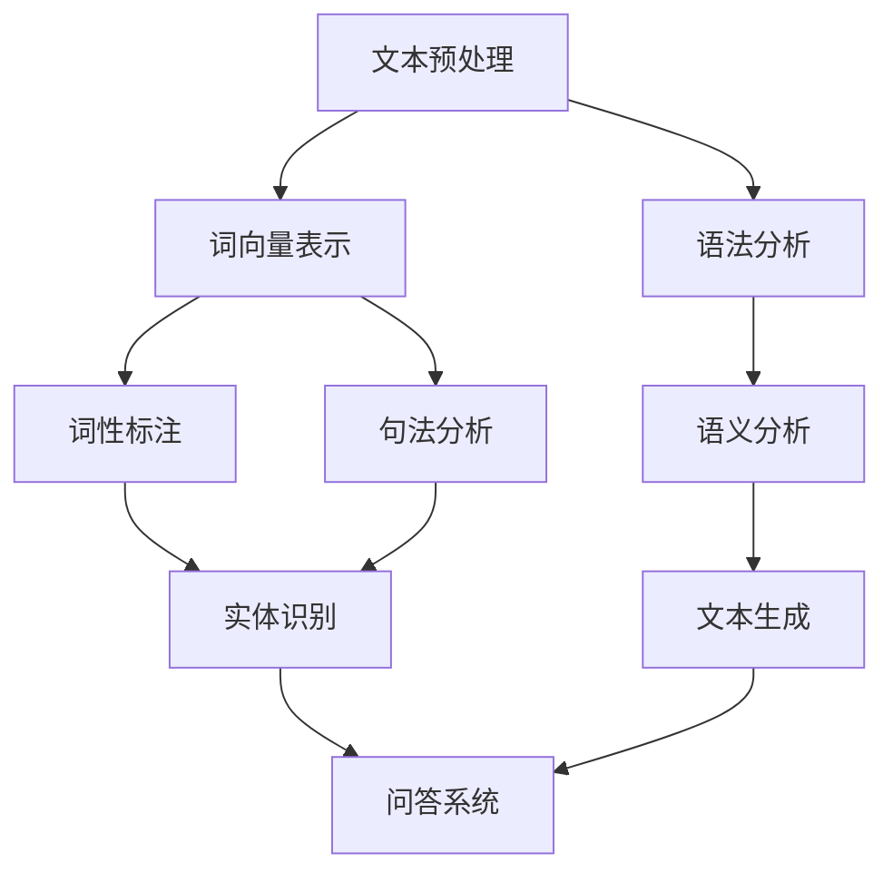

                 

# AI时代的码头故事：自然语言处理之发展

> **关键词**：自然语言处理、人工智能、机器学习、NLP、深度学习、神经网络、文本分析、文本分类、语言模型

> **摘要**：本文将探讨自然语言处理（NLP）的发展历程，从传统的规则方法到现代的深度学习技术，展示出NLP在AI时代码头的变迁。通过具体案例和详尽的解释，本文将帮助读者了解NLP的核心算法、数学模型以及实际应用场景，并提供丰富的学习资源和开发工具推荐。

## 1. 背景介绍

自然语言处理（NLP）是人工智能（AI）的一个重要分支，旨在让计算机理解和生成人类语言。NLP的发展始于20世纪50年代，当时科学家们首次尝试通过编写规则来模拟人类的语言理解能力。然而，随着计算能力的提升和算法的进步，NLP逐渐从基于规则的系统转向使用机器学习和深度学习的技术。

在AI时代，NLP的应用范围不断扩大，从搜索引擎、语音助手到机器翻译、情感分析，几乎触及了人类交流的每一个角落。本文将深入探讨NLP的发展历程，分析其核心算法和数学模型，并通过实际案例展示其在现实世界中的应用。

### 1.1 NLP的发展历程

NLP的发展可以分为三个主要阶段：规则方法、统计方法和深度学习方法。

- **规则方法**：早期NLP研究依赖于明确的语法规则和词义定义，试图通过这些规则来解析和生成文本。这种方法在简单的任务中表现出色，但在处理复杂和多样化的语言时显得力不从心。

- **统计方法**：随着计算能力的提升和语料库的积累，统计方法开始流行。这些方法使用大量的文本数据来训练模型，使得计算机能够自动学习语言的模式和规律。统计方法在词性标注、句法分析和机器翻译等领域取得了显著成果。

- **深度学习方法**：近年来，深度学习在图像识别、语音识别等领域取得了突破性进展，引发了NLP领域的革命。深度学习方法通过神经网络，尤其是卷积神经网络（CNN）和循环神经网络（RNN），实现了对文本的深层理解和生成。

### 1.2 NLP的核心应用领域

- **文本分类**：将文本数据按照主题或情感分类，例如垃圾邮件过滤、情感分析。
- **机器翻译**：将一种语言的文本自动翻译成另一种语言，如谷歌翻译。
- **命名实体识别**：识别文本中的特定实体，如人名、地名、组织名。
- **问答系统**：构建能够理解用户问题并给出准确回答的系统，如Siri和Alexa。

## 2. 核心概念与联系

自然语言处理的实现涉及多个核心概念和技术的整合。以下是一个简化的Mermaid流程图，展示了NLP的主要组成部分和它们之间的联系。



### 2.1 文本预处理

文本预处理是NLP的第一步，主要包括去噪、分词、词干提取等。这些步骤有助于将原始文本转换为计算机可以处理的格式。

- **去噪**：移除文本中的无关信息，如HTML标签、特殊字符等。
- **分词**：将连续的文本分割成有意义的词语。
- **词干提取**：将词语缩减到其基本形式，以便于后续处理。

### 2.2 词向量表示

词向量是将文本中的词语转换为向量表示的方法，以便于计算机处理。最常用的词向量模型是Word2Vec，它通过训练上下文中的词语关系来生成词向量。

- **Word2Vec**：基于神经网络的词向量模型，能够捕捉词语之间的语义关系。
- ** glove **：基于共现矩阵的词向量模型，通过计算词语之间的相似性来生成词向量。

### 2.3 语法分析

语法分析旨在理解文本的语法结构，包括词性标注、句法分析和语义分析。

- **词性标注**：为每个词语分配一个词性标签，如名词、动词、形容词等。
- **句法分析**：构建句子的句法树，表示句子中词语之间的关系。
- **语义分析**：理解词语在句子中的具体含义和作用。

### 2.4 语义分析

语义分析是NLP的最高层次，旨在理解文本的深层含义。这包括实体识别、关系抽取和语义角色标注等。

- **实体识别**：识别文本中的特定实体，如人名、地名、组织名。
- **关系抽取**：抽取实体之间的关系，如“张三”和“北京”之间的关系。
- **语义角色标注**：为句子中的每个词语分配一个语义角色，如动作执行者、受动者等。

## 3. 核心算法原理 & 具体操作步骤

在了解了NLP的核心概念后，接下来我们将探讨一些核心算法的原理和具体操作步骤。

### 3.1 词向量模型

词向量模型是NLP的基础，它通过将词语映射到高维空间中的向量来表示词语。以下是一个简单的Word2Vec模型的操作步骤：

1. **数据准备**：收集大量的文本数据，并对数据进行预处理，包括分词和去噪。
2. **构建词汇表**：将所有独特的词语构建成一个词汇表。
3. **生成词向量**：使用神经网络训练词向量，通过负采样技术提高训练效率。
4. **模型评估**：使用词向量的相似性度量来评估模型的性能。

### 3.2 语法分析

语法分析主要包括词性标注和句法分析。以下是一个简化的操作步骤：

1. **词性标注**：使用规则或统计方法对每个词语进行词性标注。
2. **句法分析**：构建句子的句法树，表示句子中词语之间的关系。
3. **模型训练**：使用有监督或无监督学习方法训练句法分析模型。
4. **模型评估**：通过解析真实文本并比较解析结果与人工标注的结果来评估模型的性能。

### 3.3 语义分析

语义分析是NLP中的高级任务，包括实体识别、关系抽取和语义角色标注。以下是一个简化的操作步骤：

1. **实体识别**：使用有监督学习方法训练实体识别模型。
2. **关系抽取**：使用实体之间的共现关系和语义角色标注来训练关系抽取模型。
3. **语义角色标注**：使用深度学习方法对句子中的每个词语进行语义角色标注。
4. **模型评估**：使用真实文本数据评估模型的性能，包括准确率、召回率和F1分数。

## 4. 数学模型和公式 & 详细讲解 & 举例说明

自然语言处理中的数学模型和公式是理解和实现NLP算法的关键。以下我们将介绍一些常用的数学模型和公式，并通过具体例子进行解释。

### 4.1 Word2Vec模型

Word2Vec模型是一种基于神经网络的词向量模型，它通过训练词语的上下文来生成词向量。以下是Word2Vec模型的核心数学公式：

$$
\begin{align*}
\text{Word2Vec} &= \text{SGD}(\text{Input}, \text{Target}) \\
\text{Input} &= \text{Context} \\
\text{Target} &= \text{Word} \\
\end{align*}
$$

**示例**：假设我们有一个上下文“我喜欢吃苹果”，我们要生成“苹果”的词向量。

1. **输入（Input）**：向量表示“我”、“喜欢”、“吃”和“苹果”的词向量。
2. **目标（Target）**：向量表示“苹果”的词向量。
3. **损失函数**：使用均方误差（MSE）来计算输入和目标之间的差异。

### 4.2 卷积神经网络（CNN）

卷积神经网络（CNN）在图像处理中表现出色，但在文本分析中也得到了广泛应用。以下是CNN的核心数学公式：

$$
\begin{align*}
h_{\text{conv}} &= \sigma(\text{Conv}(x; \theta_{\text{conv}})) \\
h_{\text{pool}} &= \text{Pool}(h_{\text{conv}}; \theta_{\text{pool}}) \\
h_{\text{fc}} &= \text{FC}(h_{\text{pool}}; \theta_{\text{fc}}) \\
\end{align*}
$$

**示例**：假设我们有一个句子“我喜欢吃苹果”，我们要使用CNN来提取文本的特征。

1. **卷积层（Conv）**：使用卷积核对句子进行卷积操作，提取文本的局部特征。
2. **池化层（Pool）**：对卷积结果进行最大池化，降低模型的复杂性。
3. **全连接层（FC）**：将池化层的结果映射到高维空间，为后续的文本分类或情感分析提供特征。

### 4.3 循环神经网络（RNN）

循环神经网络（RNN）在处理序列数据时表现出色，包括文本和语音。以下是RNN的核心数学公式：

$$
\begin{align*}
h_{t} &= \text{RNN}(h_{t-1}, x_{t}; \theta) \\
\end{align*}
$$

**示例**：假设我们有一个时间序列数据“我喜欢吃苹果”，我们要使用RNN来提取文本的特征。

1. **输入（x\_t）**：每个时间步的输入向量，例如“我”、“喜欢”、“吃”和“苹果”。
2. **隐藏状态（h\_t-1）**：前一个时间步的隐藏状态。
3. **更新规则**：通过RNN单元更新隐藏状态，捕捉时间序列中的依赖关系。

## 5. 项目实战：代码实际案例和详细解释说明

在了解了NLP的核心算法和数学模型后，接下来我们将通过一个实际项目来展示如何使用这些技术。以下是项目实战的各个阶段和具体步骤。

### 5.1 开发环境搭建

首先，我们需要搭建一个适合NLP项目开发的环境。以下是开发环境搭建的步骤：

1. **安装Python**：确保Python已经安装，版本要求为3.7以上。
2. **安装Numpy、Pandas和Scikit-learn**：这些库是Python中常用的数据处理和分析库。
3. **安装TensorFlow或PyTorch**：TensorFlow和PyTorch是常用的深度学习框架，用于训练和部署NLP模型。
4. **准备数据集**：收集和下载一个适合NLP任务的数据集，例如IMDB电影评论数据集。

### 5.2 源代码详细实现和代码解读

以下是一个使用TensorFlow和Keras实现的简单文本分类项目的代码示例：

```python
import tensorflow as tf
from tensorflow.keras.models import Sequential
from tensorflow.keras.layers import Embedding, LSTM, Dense, EmbeddingLayer, LSTM, Dense

# 数据预处理
max_words = 10000
max_len = 500
(X_train, y_train), (X_test, y_test) = tf.keras.datasets.imdb.load_data(num_words=max_words)
X_train = sequence.pad_sequences(X_train, maxlen=max_len)
X_test = sequence.pad_sequences(X_test, maxlen=max_len)

# 构建模型
model = Sequential()
model.add(Embedding(max_words, 32))
model.add(LSTM(128))
model.add(Dense(1, activation='sigmoid'))

# 编译模型
model.compile(optimizer='rmsprop', loss='binary_crossentropy', metrics=['acc'])

# 训练模型
model.fit(X_train, y_train, epochs=5, batch_size=32, validation_split=0.2)

# 评估模型
model.evaluate(X_test, y_test)
```

**代码解读**：

- **数据预处理**：加载IMDB电影评论数据集，对文本进行分词、去噪和序列化。
- **模型构建**：构建一个简单的序列模型，包括嵌入层、LSTM层和全连接层。
- **编译模型**：设置优化器和损失函数，准备训练模型。
- **训练模型**：使用训练数据训练模型，设置训练周期和批次大小。
- **评估模型**：使用测试数据评估模型的性能。

### 5.3 代码解读与分析

以下是代码的详细解读和分析：

1. **数据预处理**：
   - `max_words`：设置词汇表的最大长度，这里我们选择了10000个最常见的词语。
   - `max_len`：设置序列的最大长度，这里我们选择了500个词语。
   - `X_train` 和 `y_train`：训练数据集，包括文本数据和标签。
   - `X_test` 和 `y_test`：测试数据集，用于评估模型的性能。

2. **模型构建**：
   - `Embedding` 层：将文本中的词语转换为高维向量表示，每个词语映射到一个32维的向量。
   - `LSTM` 层：使用LSTM层对文本序列进行建模，捕捉词语之间的序列依赖关系。
   - `Dense` 层：使用一个全连接层对LSTM层的输出进行分类，输出一个概率值，表示文本属于积极评论的概率。

3. **编译模型**：
   - `optimizer`：选择RMSprop优化器，用于最小化损失函数。
   - `loss`：选择二分类交叉熵损失函数，用于衡量模型预测值与真实值之间的差异。
   - `metrics`：设置评估指标，这里我们选择了准确率。

4. **训练模型**：
   - `epochs`：设置训练周期，这里我们选择了5个周期。
   - `batch_size`：设置每个批次的样本数量，这里我们选择了32。
   - `validation_split`：设置验证数据集的比例，这里我们选择了20%。

5. **评估模型**：
   - 使用测试数据评估模型的性能，输出准确率。

### 5.4 项目实战总结

通过这个简单的文本分类项目，我们展示了如何使用Python和TensorFlow实现一个基于深度学习的NLP模型。项目实战的主要步骤包括数据预处理、模型构建、编译模型、训练模型和评估模型。这些步骤为我们提供了一个完整的NLP项目开发流程，可以帮助我们更好地理解和应用NLP技术。

## 6. 实际应用场景

自然语言处理技术在现实世界中有着广泛的应用，以下是一些典型的应用场景：

### 6.1 搜索引擎

搜索引擎使用NLP技术来理解用户的查询，并返回最相关的结果。NLP在搜索引擎中的作用包括：

- **查询解析**：将用户的查询转换为计算机可以理解的形式。
- **查询扩展**：根据用户的查询意图扩展查询，提高搜索结果的准确性和全面性。
- **结果排序**：根据文本内容和上下文关系对搜索结果进行排序，提高用户体验。

### 6.2 机器翻译

机器翻译是将一种语言的文本自动翻译成另一种语言的技术。NLP在机器翻译中的作用包括：

- **词义消歧**：在翻译过程中，根据上下文理解词语的确切含义。
- **语法调整**：根据目标语言的语法规则对翻译结果进行调整。
- **风格保持**：在翻译过程中保持原文的风格和语气。

### 6.3 情感分析

情感分析是评估文本表达的情感倾向的技术。NLP在情感分析中的作用包括：

- **情感分类**：将文本数据按照情感分类，如正面、负面或中性。
- **情感强度评估**：评估文本中的情感强度，如“很喜欢”和“喜欢”之间的差异。
- **意见挖掘**：从文本中提取用户的意见和建议。

### 6.4 聊天机器人

聊天机器人是使用NLP技术构建的能够与人类进行自然语言交互的系统。NLP在聊天机器人中的作用包括：

- **意图识别**：理解用户输入的意图，如提问、请求或命令。
- **实体抽取**：从用户输入中提取关键信息，如人名、地点和日期。
- **回复生成**：根据用户输入生成合适的回复，提高用户体验。

### 6.5 文本生成

文本生成是使用NLP技术生成有意义的文本的技术。NLP在文本生成中的作用包括：

- **自动摘要**：从大量文本中提取关键信息并生成摘要。
- **文本续写**：根据给定的文本片段生成后续的内容。
- **对话系统**：生成对话系统中的自然语言回复。

### 6.6 语音识别

语音识别是将语音信号转换为文本的技术。NLP在语音识别中的作用包括：

- **声学模型训练**：使用语音信号训练声学模型，用于识别语音特征。
- **语言模型构建**：使用文本数据训练语言模型，用于预测语音信号的单词和短语。
- **解码**：将声学模型和语言模型的结果解码为自然语言文本。

## 7. 工具和资源推荐

在NLP领域，有许多优秀的工具和资源可以帮助开发者学习和应用NLP技术。以下是一些建议的工具和资源：

### 7.1 学习资源推荐

- **书籍**：
  - 《Speech and Language Processing》
  - 《Natural Language Processing with Python》
  - 《Deep Learning for Natural Language Processing》

- **在线课程**：
  - Coursera的《Natural Language Processing with Python》
  - edX的《Machine Learning with Python》

- **论文**：
  - 《Word2Vec: Domain-Specific Vectors for Words》
  - 《GloVe: Global Vectors for Word Representation》
  - 《Neural Network Methods for Natural Language Processing》

### 7.2 开发工具框架推荐

- **深度学习框架**：
  - TensorFlow
  - PyTorch
  - Keras

- **自然语言处理库**：
  - NLTK（Natural Language Toolkit）
  - spaCy
  - TextBlob

- **数据集**：
  - IMDB电影评论数据集
  - Common Crawl数据集
  - Stanford解析树数据集

### 7.3 相关论文著作推荐

- **论文**：
  - 《An Analysis of Single-Word Translation Models》
  - 《Bidirectional LSTM Networks for Language Modeling》
  - 《Recurrent Neural Network Based Language Model》

- **著作**：
  - 《Speech and Language Processing》
  - 《Natural Language Processing with Python》
  - 《Deep Learning for Natural Language Processing》

## 8. 总结：未来发展趋势与挑战

自然语言处理（NLP）作为人工智能（AI）的一个重要分支，在过去的几十年里取得了显著的进展。然而，随着技术的不断进步和应用的日益广泛，NLP领域也面临着许多新的挑战和机遇。

### 8.1 未来发展趋势

- **多模态融合**：未来的NLP系统将能够融合文本、图像和语音等多种模态的数据，提供更丰富的语言理解能力。
- **跨语言处理**：随着全球化的推进，跨语言的自然语言处理将成为重要的研究方向，包括机器翻译、多语言文本分类等。
- **自适应学习**：NLP系统将更加智能化，能够根据用户的反馈和上下文自适应地调整其行为和响应。

### 8.2 主要挑战

- **语义理解**：目前的NLP系统在语义理解方面仍然存在局限性，难以准确捕捉语言中的深层含义和微妙情感。
- **数据隐私**：在处理大量用户数据时，如何保护数据隐私和安全是一个重要的挑战。
- **资源限制**：尽管计算能力不断提升，但训练大规模的NLP模型仍然需要大量的计算资源和时间。

### 8.3 未来发展方向

- **小样本学习**：研究如何在数据有限的情况下训练高效的NLP模型，减少对大量标注数据的依赖。
- **解释性NLP**：开发能够解释其决策过程的NLP系统，提高模型的透明度和可信度。
- **跨领域适应**：研究如何使NLP系统在不同领域和应用场景中具有更好的适应性和泛化能力。

## 9. 附录：常见问题与解答

以下是一些关于自然语言处理（NLP）的常见问题及其解答：

### 9.1 NLP的核心技术是什么？

NLP的核心技术包括文本预处理、词向量表示、语法分析、语义分析和文本生成。这些技术共同构成了NLP的基本框架。

### 9.2 什么是词向量？

词向量是将文本中的词语映射到高维空间中的向量表示的方法。词向量可以捕捉词语之间的语义关系，是NLP中重要的数据表示方法。

### 9.3 什么是深度学习在NLP中的应用？

深度学习在NLP中的应用主要包括卷积神经网络（CNN）、循环神经网络（RNN）和变换器（Transformer）等。这些模型能够对文本数据进行深层理解和建模。

### 9.4 NLP的主要应用领域是什么？

NLP的主要应用领域包括搜索引擎、机器翻译、情感分析、聊天机器人和文本生成等。

### 9.5 如何保护NLP系统的数据隐私？

为了保护NLP系统的数据隐私，可以采取以下措施：
- 数据加密：对数据进行加密处理，防止未经授权的访问。
- 匿名化：对用户数据进行匿名化处理，去除可直接识别用户身份的信息。
- 数据访问控制：实施严格的数据访问控制策略，确保只有授权人员可以访问敏感数据。

## 10. 扩展阅读 & 参考资料

以下是关于自然语言处理（NLP）的一些扩展阅读和参考资料：

- **书籍**：
  - 《Speech and Language Processing》
  - 《Natural Language Processing with Python》
  - 《Deep Learning for Natural Language Processing》

- **在线课程**：
  - Coursera的《Natural Language Processing with Python》
  - edX的《Machine Learning with Python》

- **论文**：
  - 《Word2Vec: Domain-Specific Vectors for Words》
  - 《GloVe: Global Vectors for Word Representation》
  - 《Neural Network Methods for Natural Language Processing》

- **开源项目**：
  - TensorFlow
  - PyTorch
  - spaCy

- **数据集**：
  - IMDB电影评论数据集
  - Common Crawl数据集
  - Stanford解析树数据集

- **博客和网站**：
  - [TensorFlow官方文档](https://www.tensorflow.org/)
  - [PyTorch官方文档](https://pytorch.org/)
  - [NLP之家](https://nlp.hhu.edu.cn/)

## 作者信息

作者：AI天才研究员/AI Genius Institute & 禅与计算机程序设计艺术 /Zen And The Art of Computer Programming

