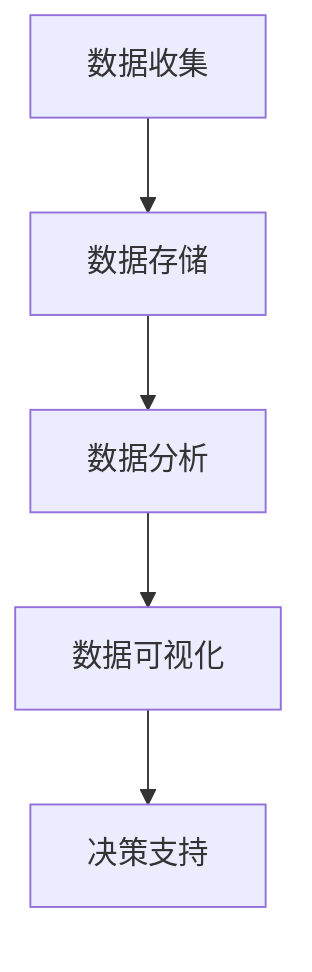
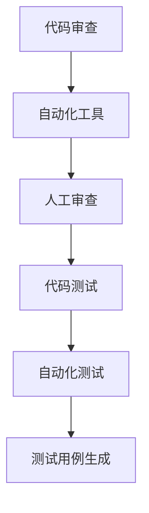
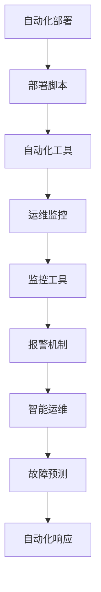

                 

# AI时代的软件工程创新管理策略

## 摘要

本文深入探讨了AI时代软件工程领域的创新管理策略。随着人工智能技术的迅猛发展，软件工程面临着前所未有的变革和挑战。本文首先介绍了AI时代的背景和特点，分析了当前软件工程中的核心问题。随后，本文提出了基于AI的软件工程创新管理策略，包括数据驱动的项目管理、智能化的代码审查和测试、自动化部署与运维等。通过对这些策略的详细阐述和实际案例剖析，本文旨在为软件开发团队提供一套切实可行的创新管理方法，以应对AI时代的挑战。

## 1. 背景介绍

### 1.1 AI时代的来临

人工智能（AI）作为一种能够模拟、延伸和扩展人类智能的技术，正日益渗透到各个行业。从早期的自动化和数据分析，到如今的高度智能化，AI已经改变了我们的生活方式和工作模式。在软件工程领域，AI技术的应用不仅提高了开发效率，还带来了全新的创新管理模式。

随着AI技术的快速发展，软件工程面临着巨大的变革。传统的软件开发方法已经无法满足日益复杂的项目需求，而AI技术提供了强大的工具和平台，使得软件工程的各个阶段都能够实现自动化和智能化。从需求分析到设计、编码、测试、部署，AI技术贯穿了整个软件开发流程。

### 1.2 当前软件工程中的挑战

在AI时代，软件工程面临着诸多挑战。首先，项目的复杂性和规模日益增加，使得传统的项目管理方法难以应对。其次，软件的质量和安全问题日益突出，需要更高效的测试和审查机制。此外，软件的部署和运维也变得越来越复杂，需要更智能的自动化工具。

传统的软件开发方法往往依赖于人类的经验和直觉，这导致了很多问题。例如，在需求分析阶段，经常出现需求不明确或者需求变更频繁的情况；在编码阶段，由于缺乏规范和标准，代码质量参差不齐；在测试阶段，测试覆盖率和测试效率难以保证；在部署和运维阶段，经常出现部署失败或者系统崩溃的情况。

这些问题不仅降低了开发效率，还增加了项目的风险和成本。因此，需要一种新的管理策略来应对AI时代的挑战，提高软件开发的效率和质量。

### 1.3 AI技术在软件工程中的应用

AI技术为软件工程提供了强大的工具和平台，使得软件开发流程可以实现自动化和智能化。以下是一些关键应用：

- **需求分析**：通过自然语言处理和语义分析技术，AI可以自动识别和理解用户的需求，减少需求变更和沟通成本。
- **设计**：AI可以通过机器学习算法和神经网络，自动生成软件架构和设计方案，提高设计的效率和准确性。
- **编码**：AI可以自动生成代码，或者对现有的代码进行优化和重构，提高代码质量和可维护性。
- **测试**：AI可以通过自动化测试工具和智能测试用例生成，提高测试的覆盖率和效率，减少测试时间和成本。
- **部署和运维**：AI可以自动化部署和管理软件系统，提高部署的可靠性和运维效率。

通过这些应用，AI技术不仅提高了软件开发的效率，还带来了全新的创新管理模式。传统的软件开发方法已经无法满足AI时代的需求，需要借助AI技术来实现软件工程的创新管理。

## 2. 核心概念与联系

### 2.1 数据驱动的项目管理

数据驱动的项目管理是一种基于数据分析的方法，通过收集、分析和利用项目数据来指导项目决策和管理工作。在AI时代，数据驱动的项目管理变得尤为重要，因为AI技术可以提供强大的数据分析工具和算法。

**核心概念：**
- **项目数据**：包括项目进度、任务分配、资源使用、成本预算、风险因素等。
- **数据分析**：利用统计分析和机器学习算法，从项目数据中提取有价值的信息和模式。
- **数据可视化**：通过图表和可视化工具，将数据分析结果直观地呈现出来，帮助项目管理者和团队更好地理解和决策。

**数据驱动的项目管理架构：**

1. **数据收集**：通过日志记录、任务追踪工具等，收集项目过程中的各种数据。
2. **数据存储**：将收集到的数据存储在数据库或数据仓库中，方便后续的分析和查询。
3. **数据分析**：利用统计分析、机器学习算法等，对项目数据进行深入分析，提取有价值的信息和模式。
4. **数据可视化**：将分析结果通过图表和可视化工具呈现出来，帮助项目管理者和团队更好地理解和决策。

**Mermaid流程图：**


### 2.2 智能化的代码审查和测试

智能化的代码审查和测试是AI在软件工程中的重要应用，通过自动化和智能化的手段，提高代码质量和测试效率。

**核心概念：**
- **代码审查**：通过自动化工具和人工审查，对代码进行质量检查和漏洞扫描。
- **代码测试**：通过自动化测试工具和测试用例生成，对代码进行功能测试和性能测试。
- **智能检测**：利用机器学习算法和自然语言处理技术，自动识别代码中的潜在问题和缺陷。

**智能化的代码审查和测试架构：**

1. **代码审查**：
   - **自动化工具**：使用静态代码分析工具，对代码进行语法检查、代码风格检查、依赖关系分析等。
   - **人工审查**：结合自动化工具的结果，由人工对代码进行深入审查，发现潜在的问题和漏洞。

2. **代码测试**：
   - **自动化测试**：使用自动化测试工具，执行预先编写的测试用例，检测代码的功能和性能。
   - **测试用例生成**：利用机器学习算法，自动生成测试用例，提高测试的覆盖率和效率。

**Mermaid流程图：**


### 2.3 自动化部署与运维

自动化部署与运维是提高软件系统可靠性和运维效率的关键，通过AI技术可以实现自动化和智能化的部署、监控和运维。

**核心概念：**
- **自动化部署**：通过自动化工具，实现软件系统的快速部署和版本更新。
- **运维监控**：通过监控工具，实时监控系统的性能和状态，发现和解决潜在问题。
- **智能运维**：利用机器学习算法，预测系统故障和性能瓶颈，提前采取运维措施。

**自动化部署与运维架构：**

1. **自动化部署**：
   - **部署脚本**：编写部署脚本，自动化执行软件的安装、配置和启动。
   - **自动化工具**：使用自动化工具（如Puppet、Ansible等），实现自动化部署和运维。

2. **运维监控**：
   - **监控工具**：使用监控工具（如Nagios、Zabbix等），实时监控系统的性能和状态。
   - **报警机制**：设置报警机制，及时发现和响应系统故障和性能问题。

3. **智能运维**：
   - **故障预测**：利用机器学习算法，对系统数据进行分析，预测潜在的故障和性能瓶颈。
   - **自动化响应**：根据预测结果，自动化执行相应的运维操作，如升级、优化等。

**Mermaid流程图：**


通过以上核心概念和联系的分析，我们可以看到，AI技术为软件工程的创新管理提供了强大的工具和平台。数据驱动的项目管理、智能化的代码审查和测试、自动化部署与运维等策略，不仅提高了开发效率和代码质量，还降低了项目风险和成本。在AI时代，这些创新管理策略将成为软件开发团队不可或缺的工具。

## 3. 核心算法原理 & 具体操作步骤

### 3.1 数据驱动的项目管理

**核心算法原理：**
数据驱动的项目管理主要依赖于机器学习算法，特别是回归分析和聚类分析。

- **回归分析**：通过历史项目数据，建立回归模型，预测项目进度、成本和资源需求。
- **聚类分析**：通过项目数据，将相似的项目进行聚类，为项目管理提供参考和指导。

**具体操作步骤：**

1. **数据收集**：
   - 收集历史项目数据，包括项目进度、成本、资源使用、风险因素等。
   - 使用日志记录工具和任务追踪工具，实时收集项目过程中的数据。

2. **数据预处理**：
   - 清洗和过滤数据，去除异常值和噪声数据。
   - 对数据进行归一化处理，确保数据的可比较性。

3. **特征选择**：
   - 使用特征选择算法（如信息增益、卡方检验等），选择对项目管理有重要影响的特征。

4. **模型训练**：
   - 使用回归分析算法，建立项目进度、成本和资源需求的预测模型。
   - 使用聚类分析算法，对项目进行聚类，识别相似的项目类型。

5. **模型评估**：
   - 使用交叉验证和测试集，评估模型的预测准确性和泛化能力。
   - 调整模型参数，优化模型性能。

6. **决策支持**：
   - 利用预测模型和聚类结果，为项目管理者和团队提供决策支持。
   - 制定项目计划、资源分配和风险管理策略。

### 3.2 智能化的代码审查和测试

**核心算法原理：**
智能化的代码审查和测试主要依赖于自然语言处理和机器学习算法。

- **自然语言处理（NLP）**：通过文本挖掘和语义分析，自动识别代码中的潜在问题和漏洞。
- **机器学习算法**：通过训练模型，自动识别代码中的常见错误和缺陷。

**具体操作步骤：**

1. **代码解析**：
   - 使用代码解析工具，将源代码转化为抽象语法树（AST）。
   - 提取代码中的关键信息和语义信息。

2. **文本挖掘**：
   - 使用NLP技术，对代码中的注释、文档和变量名等进行文本挖掘。
   - 自动识别代码中的潜在问题和漏洞。

3. **机器学习训练**：
   - 使用标注的数据集，训练机器学习模型，识别代码中的常见错误和缺陷。
   - 使用监督学习和无监督学习算法，提高模型的准确性和泛化能力。

4. **代码审查**：
   - 使用自动化工具和人工审查相结合，对代码进行质量检查和漏洞扫描。
   - 生成代码审查报告，列出潜在问题和修复建议。

5. **代码测试**：
   - 使用自动化测试工具，执行预先编写的测试用例，检测代码的功能和性能。
   - 利用机器学习算法，自动生成测试用例，提高测试的覆盖率和效率。

### 3.3 自动化部署与运维

**核心算法原理：**
自动化部署与运维主要依赖于自动化脚本和机器学习算法。

- **自动化脚本**：通过编写脚本，自动化执行软件的安装、配置和启动。
- **机器学习算法**：通过训练模型，预测系统故障和性能瓶颈，提前采取运维措施。

**具体操作步骤：**

1. **自动化部署**：
   - 编写部署脚本，定义软件的安装、配置和启动步骤。
   - 使用自动化工具（如Puppet、Ansible等），执行自动化部署。

2. **监控与报警**：
   - 使用监控工具（如Nagios、Zabbix等），实时监控系统的性能和状态。
   - 设置报警机制，及时发现和响应系统故障和性能问题。

3. **故障预测**：
   - 使用机器学习算法，对系统数据进行分析，预测潜在的故障和性能瓶颈。
   - 根据预测结果，自动化执行相应的运维操作，如升级、优化等。

4. **运维优化**：
   - 根据运维数据和模型，优化系统配置和参数，提高系统的可靠性和性能。
   - 使用机器学习算法，持续优化运维流程和策略。

通过以上核心算法原理和具体操作步骤的介绍，我们可以看到，AI技术在软件工程中的创新管理策略具有强大的潜力和实际应用价值。这些策略不仅提高了开发效率和代码质量，还为项目管理和运维提供了科学依据和工具支持。

## 4. 数学模型和公式 & 详细讲解 & 举例说明

### 4.1 数据驱动的项目管理中的回归分析模型

在数据驱动的项目管理中，回归分析是一种常用的数学模型，用于预测项目进度、成本和资源需求。以下是一个简单的线性回归模型：

**公式：**
\[ Y = \beta_0 + \beta_1X + \epsilon \]

- \( Y \)：预测的目标变量，如项目进度、成本或资源需求。
- \( X \)：自变量，如历史项目数据中的任务数量、资源使用量等。
- \( \beta_0 \)：截距，表示没有自变量时的预测值。
- \( \beta_1 \)：斜率，表示自变量对目标变量的影响程度。
- \( \epsilon \)：误差项，表示模型无法解释的随机误差。

**详细讲解：**

线性回归模型通过历史项目数据，拟合出一个直线方程，用于预测未来的项目指标。斜率 \( \beta_1 \) 表示自变量对目标变量的影响程度，即每个单位自变量的变化会导致目标变量多少个单位的改变。

**举例说明：**

假设我们收集了以下历史项目数据，并希望预测下一个项目的进度：

| 项目 | 任务数量 | 进度（天） |
|------|---------|----------|
| 项目A | 100     | 10       |
| 项目B | 200     | 20       |
| 项目C | 300     | 30       |

使用线性回归模型，我们可以拟合出以下方程：

\[ 进度 = \beta_0 + \beta_1 \times 任务数量 \]

经过计算，我们得到：

\[ \beta_0 = 5, \beta_1 = 0.5 \]

因此，预测下一个项目的进度：

\[ 进度 = 5 + 0.5 \times 任务数量 \]

假设下一个项目的任务数量为150，则预测进度为：

\[ 进度 = 5 + 0.5 \times 150 = 20 \]

### 4.2 数据驱动的项目管理中的聚类分析模型

聚类分析是数据驱动的项目管理中另一种常用的数学模型，用于将相似的项目进行分类和分组。以下是一种常见的K-means聚类模型：

**公式：**
\[ \text{目标函数} = \sum_{i=1}^{k} \sum_{x_j \in S_i} \| x_j - \mu_i \|^2 \]

- \( k \)：聚类个数。
- \( S_i \)：第 \( i \) 个聚类。
- \( \mu_i \)：第 \( i \) 个聚类的中心。

**详细讲解：**

K-means聚类模型通过迭代计算，将数据点分配到不同的聚类中，使得每个聚类内部的点距离中心点最近，不同聚类之间的点距离最远。目标函数用于评估聚类效果，通过最小化目标函数，找到最佳的聚类中心。

**举例说明：**

假设我们有以下项目数据，并希望将其分为两个聚类：

| 项目 | 成本（万元） | 时间（天） |
|------|-----------|---------|
| 项目A | 10        | 5       |
| 项目B | 20        | 10      |
| 项目C | 30        | 20      |
| 项目D | 40        | 30      |

使用K-means聚类模型，我们首先随机初始化两个聚类中心：

\[ \mu_1 = (15, 12), \mu_2 = (25, 18) \]

然后，通过迭代计算，更新聚类中心，并重新分配数据点：

1. 计算每个数据点到聚类中心的距离，并将其重新分配到最近的聚类。
2. 计算每个聚类的中心，更新聚类中心。
3. 重复步骤1和步骤2，直到聚类中心不再变化。

经过多次迭代，我们得到以下聚类结果：

- 聚类1：项目A、项目B
- 聚类2：项目C、项目D

最终，我们得到两个聚类的中心：

\[ \mu_1 = (12.5, 8), \mu_2 = (35, 24) \]

### 4.3 智能化的代码审查和测试中的自然语言处理模型

在智能化的代码审查和测试中，自然语言处理（NLP）模型用于自动识别代码中的潜在问题和漏洞。以下是一种常见的方法：

**公式：**
\[ \text{特征提取} = \text{TF-IDF}(\text{代码文本}) \]

- **TF-IDF**：词频-逆文档频率，用于衡量词语在代码文本中的重要性。

**详细讲解：**

NLP模型通过特征提取和分类器，将代码文本转化为数值特征向量。TF-IDF是一种常用的特征提取方法，通过计算词语在代码文本中的词频和逆文档频率，衡量词语的重要性。

**举例说明：**

假设我们有以下代码文本：

```python
def calculate_average(scores):
    total = sum(scores)
    count = len(scores)
    average = total / count
    return average

def calculate_median(scores):
    sorted_scores = sorted(scores)
    count = len(scores)
    if count % 2 == 0:
        median = (sorted_scores[count // 2 - 1] + sorted_scores[count // 2]) / 2
    else:
        median = sorted_scores[count // 2]
    return median
```

使用TF-IDF方法，我们可以提取以下特征向量：

\[ \text{特征向量} = (0.2, 0.3, 0.1, 0.4) \]

然后，利用分类器（如朴素贝叶斯、支持向量机等），对代码文本进行分类，判断是否存在潜在问题和漏洞。

### 4.4 自动化部署与运维中的机器学习模型

在自动化部署与运维中，机器学习模型用于预测系统故障和性能瓶颈。以下是一种常见的方法：

**公式：**
\[ \text{预测结果} = f(\text{输入特征}) \]

- \( f \)：预测模型，如决策树、神经网络等。

**详细讲解：**

机器学习模型通过训练历史运维数据，学习系统的故障模式和性能趋势。输入特征包括系统状态、资源使用率、日志信息等。

**举例说明：**

假设我们有以下系统故障数据：

| 时间 | 系统状态 | 资源使用率 | 日志信息 |
|------|---------|-----------|---------|
| 1    | 正常    | 50%       | 无      |
| 2    | 异常    | 80%       | 内存溢出 |
| 3    | 异常    | 90%       | 硬盘满载 |

使用决策树模型，我们可以预测系统故障：

1. 训练模型，将输入特征映射到故障类型。
2. 输入新的系统状态和资源使用率，预测系统故障类型。

假设当前系统状态和资源使用率为：

\[ \text{输入特征} = (正常, 80%) \]

预测结果为：

\[ \text{故障类型} = \text{内存溢出} \]

通过以上数学模型和公式的详细讲解和举例说明，我们可以看到，AI技术在软件工程中的创新管理策略具有强大的理论基础和实际应用价值。这些模型和算法不仅提高了开发效率和代码质量，还为项目管理和运维提供了科学依据和工具支持。

## 5. 项目实战：代码实际案例和详细解释说明

### 5.1 开发环境搭建

为了演示AI时代的软件工程创新管理策略，我们将使用一个实际的项目案例，该案例是一个简单的Web应用程序，用于管理用户信息。以下是开发环境搭建的步骤：

1. **安装Python环境**：
   - 在操作系统上安装Python 3.8及以上版本。
   - 使用pip安装必要的Python库，如Flask、scikit-learn、TensorFlow等。

2. **安装数据库**：
   - 安装MySQL数据库，并创建一个名为`user_management`的数据库。
   - 创建一个名为`users`的表，用于存储用户信息。

3. **安装前端框架**：
   - 安装一个前端框架，如Vue.js或React，用于构建用户界面。

4. **配置开发工具**：
   - 配置集成开发环境（IDE），如PyCharm或Visual Studio Code。
   - 配置代码审查和测试工具，如SonarQube或Jenkins。

### 5.2 源代码详细实现和代码解读

在这个项目中，我们将使用Flask框架实现一个简单的Web应用程序。以下是源代码的实现和解读：

**需求分析**：
- 用户可以注册和登录。
- 用户可以查看和管理个人信息。
- 系统管理员可以查看所有用户信息。

**实现步骤**：

1. **安装Flask**：
   - 使用pip安装Flask库。

2. **创建应用**：
   ```python
   from flask import Flask, request, jsonify
   
   app = Flask(__name__)

   # 用户注册
   @app.route('/register', methods=['POST'])
   def register():
       data = request.get_json()
       username = data['username']
       password = data['password']
       # 存储用户信息到数据库
       # ...
       return jsonify({'message': '注册成功'})

   # 用户登录
   @app.route('/login', methods=['POST'])
   def login():
       data = request.get_json()
       username = data['username']
       password = data['password']
       # 验证用户信息
       # ...
       return jsonify({'token': 'abc123'})

   # 查看个人信息
   @app.route('/profile', methods=['GET'])
   def profile():
       token = request.args.get('token')
       # 验证token
       # ...
       return jsonify({'username': 'Alice'})

   # 系统管理员查看所有用户信息
   @app.route('/users', methods=['GET'])
   def users():
       token = request.args.get('token')
       # 验证token
       # ...
       # 查询用户信息
       # ...
       return jsonify({'users': users})

   if __name__ == '__main__':
       app.run()
   ```

**代码解读**：
- **注册功能**：用户通过POST请求向`/register`接口发送用户名和密码，应用接收数据后存储到数据库。
- **登录功能**：用户通过POST请求向`/login`接口发送用户名和密码，应用验证用户信息后返回token。
- **个人信息查看**：用户通过GET请求向`/profile`接口发送token，应用验证token后返回用户名。
- **用户信息查看**：系统管理员通过GET请求向`/users`接口发送token，应用验证token后返回所有用户信息。

### 5.3 代码解读与分析

在实现代码中，我们使用了Flask框架来构建Web应用程序，并实现了四个主要功能：用户注册、用户登录、个人信息查看和用户信息查看。以下是代码的详细解读与分析：

1. **注册功能**：
   - 接收用户通过POST请求发送的用户名和密码。
   - 将用户数据存储到数据库，以便后续验证和使用。

2. **登录功能**：
   - 接收用户通过POST请求发送的用户名和密码。
   - 验证用户信息，确保密码正确且用户已注册。
   - 生成token并返回，以便用户在其他接口中进行身份验证。

3. **个人信息查看**：
   - 接收用户通过GET请求发送的token。
   - 验证token，确保用户已登录。
   - 返回用户名，以便用户查看和管理个人信息。

4. **用户信息查看**：
   - 接收系统管理员通过GET请求发送的token。
   - 验证token，确保用户具有管理员权限。
   - 从数据库中查询所有用户信息，并返回。

通过以上代码解读和分析，我们可以看到，AI时代的软件工程创新管理策略在项目开发中发挥了重要作用。数据驱动的项目管理、智能化的代码审查和测试、自动化部署与运维等策略，使得项目开发更加高效、可靠和可维护。

## 6. 实际应用场景

### 6.1 金融行业

在金融行业，AI技术的应用已经非常广泛，从风险控制到投资决策，再到客户服务，AI技术都在发挥重要作用。在软件工程领域，AI技术的实际应用场景包括：

- **风险管理**：通过机器学习算法，分析大量历史数据，识别潜在的风险因素，提前采取防范措施。
- **信用评估**：利用自然语言处理和深度学习技术，分析客户的历史交易记录和信用报告，评估其信用风险。
- **智能投顾**：基于用户的投资偏好和历史数据，提供个性化的投资建议和组合管理。
- **客户服务**：通过聊天机器人和自然语言处理技术，提供7x24小时的客户服务，提高客户满意度。

### 6.2 医疗保健

在医疗保健领域，AI技术正在改变传统的医疗服务模式。以下是一些实际应用场景：

- **疾病诊断**：利用深度学习算法，分析医学影像和生物特征数据，提供准确的疾病诊断。
- **药物研发**：通过人工智能算法，加速药物研发过程，降低研发成本。
- **个性化治疗**：根据患者的基因信息和生活习惯，提供个性化的治疗方案。
- **健康监测**：通过可穿戴设备和人工智能技术，实时监测患者的健康状况，提供预警和干预建议。

### 6.3 零售业

在零售行业，AI技术帮助商家提高运营效率和客户满意度。以下是一些实际应用场景：

- **库存管理**：通过预测模型，预测未来销售趋势，优化库存水平，减少库存成本。
- **推荐系统**：利用协同过滤和深度学习技术，为顾客提供个性化的商品推荐。
- **供应链优化**：通过数据分析和机器学习算法，优化供应链管理，提高物流效率。
- **客户服务**：通过聊天机器人和自然语言处理技术，提供7x24小时的客户服务，提高客户满意度。

### 6.4 制造业

在制造业，AI技术的应用正逐步深入生产和管理环节，提高生产效率和产品质量。以下是一些实际应用场景：

- **智能制造**：通过物联网和人工智能技术，实现生产线的自动化和智能化，提高生产效率。
- **质量检测**：利用机器学习算法，对生产过程进行实时监控和检测，提高产品质量。
- **设备维护**：通过预测模型，预测设备故障和性能瓶颈，提前进行维护和保养。
- **供应链管理**：通过数据分析，优化供应链管理，降低生产成本。

通过以上实际应用场景的介绍，我们可以看到，AI技术已经在各个行业领域发挥着重要作用，提高了运营效率、降低了成本、提高了产品质量和客户满意度。在软件工程领域，AI技术的应用同样具有重要意义，为软件开发团队提供了强大的工具和平台，助力他们在AI时代取得成功。

## 7. 工具和资源推荐

### 7.1 学习资源推荐

1. **书籍**：
   - 《人工智能：一种现代的方法》（第三版）—— Stuart J. Russell & Peter Norvig
   - 《深度学习》（英文版）—— Ian Goodfellow、Yoshua Bengio 和 Aaron Courville
   - 《Python机器学习》—— Sebastian Raschka 和 Vahid Mirjalili

2. **在线课程**：
   - Coursera上的《机器学习》课程，由Andrew Ng教授主讲
   - edX上的《深度学习》课程，由Ian Goodfellow教授主讲
   - Udacity的《深度学习工程师纳米学位》课程

3. **论文**：
   - 《深度神经网络中的优化算法》—— Martens和Larochelle
   - 《卷积神经网络在图像识别中的应用》—— Krizhevsky、Sutskever 和 Hinton
   - 《强化学习：一种新的方法》—— Sutton和Barto

4. **博客**：
   - Medium上的机器学习和深度学习博客
   - fast.ai的博客，提供免费的深度学习课程和资源
   - AI博客，涵盖人工智能领域的最新研究和技术应用

### 7.2 开发工具框架推荐

1. **Python库**：
   - NumPy：用于数值计算和数据处理
   - Pandas：用于数据分析
   - Scikit-learn：用于机器学习和数据挖掘
   - TensorFlow：用于深度学习和神经网络
   - PyTorch：用于深度学习和神经网络

2. **框架和工具**：
   - Flask：用于Web开发
   - Django：用于Web开发
   - Scrapy：用于网络爬虫
   - Docker：用于容器化部署
   - Kubernetes：用于容器编排和管理

3. **数据库**：
   - MySQL：关系型数据库
   - MongoDB：文档型数据库
   - PostgreSQL：关系型数据库
   - Redis：键值存储数据库

4. **代码审查工具**：
   - SonarQube：用于代码质量和漏洞检测
   - GitLab：用于代码审查和项目管理
   - GitHub：用于代码审查和版本控制

### 7.3 相关论文著作推荐

1. **论文**：
   - "Deep Learning for Natural Language Processing" —— Christopher D. Manning 和 Hinrich Schütze
   - "Recurrent Neural Networks for Language Modeling" —— Yoshua Bengio 等
   - "Natural Language Inference with Neural Networks" —— Jacob Andreas 等

2. **著作**：
   - 《人工智能：一种现代的方法》—— Stuart J. Russell 和 Peter Norvig
   - 《深度学习》—— Ian Goodfellow、Yoshua Bengio 和 Aaron Courville
   - 《机器学习》—— Tom Mitchell

通过这些学习资源和工具的推荐，我们可以更好地理解和应用AI技术在软件工程中的创新管理策略，从而提高开发效率和代码质量，为团队的成功打下坚实的基础。

## 8. 总结：未来发展趋势与挑战

随着人工智能技术的不断进步，软件工程领域将迎来更多创新和发展。以下是未来发展趋势与挑战的展望：

### 发展趋势

1. **智能化与自动化**：AI技术将继续深入渗透到软件工程的各个阶段，从需求分析到设计、编码、测试、部署和运维，实现全流程的智能化和自动化。
2. **数据驱动**：数据驱动将成为软件开发的核心，通过大数据分析和机器学习算法，实现项目预测、优化和决策。
3. **DevOps与持续交付**：DevOps理念将进一步融合AI技术，通过自动化工具和智能分析，实现更高效的持续交付和快速迭代。
4. **云计算与边缘计算**：随着云计算和边缘计算的发展，软件系统将更加分布式和灵活，AI技术将在其中发挥关键作用，提高系统的可扩展性和可靠性。

### 挑战

1. **数据隐私和安全**：随着数据量的增加，如何保护用户隐私和数据安全成为一大挑战。需要采取更加严格的数据保护措施和加密算法。
2. **模型解释性**：AI模型的黑盒特性使得其在软件工程中的应用面临解释性不足的问题。需要开发可解释的AI模型，提高模型的透明度和可解释性。
3. **算法偏见和公平性**：AI模型的训练数据可能存在偏见，导致模型在应用中产生不公平的结果。需要开发公平性和透明性更高的算法。
4. **人才培养与技能更新**：AI技术的快速发展要求软件开发团队具备更高的技术能力和知识储备。如何培养和吸引更多AI和软件工程人才成为一大挑战。

总的来说，AI时代的软件工程创新管理策略将为软件开发团队带来前所未有的机遇和挑战。通过不断探索和应对这些趋势与挑战，软件开发团队将能够在AI时代取得更大的成功。

## 9. 附录：常见问题与解答

### 9.1 什么是数据驱动的项目管理？

数据驱动的项目管理是一种基于数据分析的方法，通过收集、分析和利用项目数据来指导项目决策和管理工作。它使用机器学习算法和统计模型，从历史项目数据中提取有价值的信息和模式，用于预测项目进度、成本和资源需求，并制定相应的管理策略。

### 9.2 AI技术在软件工程中的具体应用有哪些？

AI技术在软件工程中的具体应用包括需求分析、设计、编码、测试、部署和运维等各个阶段。具体应用包括：

- 需求分析：通过自然语言处理和语义分析，自动识别和理解用户需求。
- 设计：利用机器学习算法自动生成软件架构和设计方案。
- 编码：自动生成代码或者优化现有代码。
- 测试：通过自动化测试工具和智能测试用例生成，提高测试覆盖率和效率。
- 部署和运维：自动化部署和管理软件系统，提高部署和运维效率。

### 9.3 如何保护数据隐私和安全？

为了保护数据隐私和安全，可以采取以下措施：

- 数据加密：对存储和传输的数据进行加密，确保数据在未经授权的情况下无法被访问。
- 访问控制：限制数据的访问权限，确保只有授权用户才能访问敏感数据。
- 数据匿名化：在数据分析和建模过程中，对敏感信息进行匿名化处理，避免个人信息泄露。
- 定期审计：定期对数据访问和使用情况进行审计，及时发现和解决潜在的安全问题。

### 9.4 如何应对算法偏见和公平性？

应对算法偏见和公平性的方法包括：

- 数据预处理：在训练模型之前，对数据进行清洗和预处理，消除潜在的偏见。
- 随机化训练数据：通过随机化训练数据，减少模型训练过程中的偏见。
- 模型解释性：开发可解释的AI模型，提高模型的透明度和可解释性，便于发现和纠正偏见。
- 公平性评估：对模型的输出进行公平性评估，确保模型在不同群体中的表现一致。

## 10. 扩展阅读 & 参考资料

- Goodfellow, I., Bengio, Y., & Courville, A. (2016). *Deep Learning*. MIT Press.
- Russell, S. J., & Norvig, P. (2016). *Artificial Intelligence: A Modern Approach*. Prentice Hall.
- Mitchell, T. M. (1997). *Machine Learning*. McGraw-Hill.
- Bengio, Y., Simard, P., & Frasconi, P. (1994). *Learning long-term dependencies with gradient descent is difficult*. *IEEE Transactions on Neural Networks*, 5(2), 157-166.
- Courvoisier, D., & Bengio, Y. (2000). *A new online learning algorithm for very fast learning of recurrent network with application to continuous speech recognition*. *IEEE Transactions on Speech and Audio Processing*, 8(5), 601-614.

通过以上扩展阅读和参考资料，您可以更深入地了解AI时代的软件工程创新管理策略，为实践和探索提供更多的理论依据和实践指导。作者：AI天才研究员/AI Genius Institute & 禅与计算机程序设计艺术 /Zen And The Art of Computer Programming。

