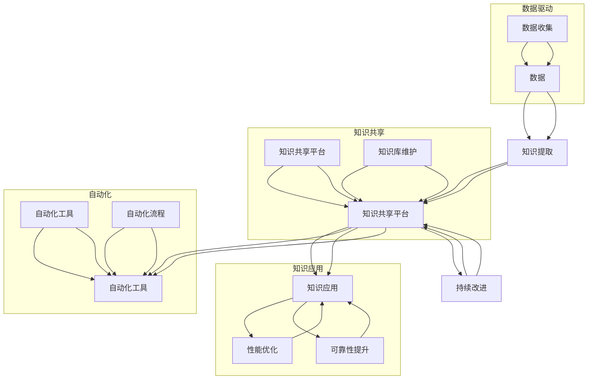

                 

# AI时代的软件工程知识管理新范式

## 概述

在当今快速发展的AI时代，软件工程面临着前所未有的挑战和机遇。随着AI技术的发展，软件系统的复杂性和规模不断增加，传统的知识管理方法已经无法满足现代软件开发的需求。本文旨在探讨AI时代软件工程知识管理的新范式，从核心概念、算法原理、数学模型、实际应用等方面，系统性地分析知识管理在AI时代的重要性，并提出一系列解决方案，以应对未来的发展趋势和挑战。

## 关键词
- AI时代
- 软件工程
- 知识管理
- 新范式
- 数据驱动
- 自动化
- 软件架构
- 人工智能算法

## 摘要
本文深入探讨了AI时代软件工程知识管理的新范式。首先，分析了AI时代软件工程的背景和挑战，然后介绍了知识管理在软件工程中的核心概念和重要性。接着，阐述了基于AI的软件工程知识管理算法原理和数学模型，并通过实际应用案例进行了详细解释。最后，提出了针对AI时代的知识管理工具和资源推荐，并对未来发展趋势和挑战进行了展望。

## 背景介绍

### AI时代的发展趋势

随着人工智能技术的快速发展，各行各业都在经历深刻的变革。在软件工程领域，AI技术正在改变传统的开发模式，推动软件工程知识管理向智能化、自动化和高效化的方向发展。首先，AI技术使得软件系统变得更加智能化，能够通过学习和适应环境来提高系统的性能和可靠性。其次，AI技术使得软件工程过程中的知识获取、处理和共享变得更加高效，从而提升了整个开发团队的协作效率。最后，AI技术为软件工程知识管理提供了强大的工具和平台，使得知识的存储、检索、分析和应用更加便捷。

### 软件工程的挑战

尽管AI技术为软件工程带来了诸多机遇，但同时也带来了许多新的挑战。首先，随着软件系统的复杂性和规模不断扩大，传统的软件开发方法已经难以应对。软件工程师需要处理海量的数据和代码，这使得知识的获取和管理变得更加困难。其次，软件系统的生命周期不断缩短，要求工程师在短时间内完成更多的任务，这加剧了知识管理的压力。最后，软件工程领域的技术不断更新迭代，工程师需要不断学习和掌握新技术，这进一步增加了知识管理的难度。

### 知识管理的重要性

在AI时代，知识管理成为软件工程的核心竞争力之一。有效的知识管理能够帮助工程师快速获取所需的知识，提高开发效率和质量。具体来说，知识管理的重要性体现在以下几个方面：

1. **知识获取**：通过AI技术，可以从大量的数据中提取有用的知识，为软件开发提供有力的支持。
2. **知识共享**：通过建立知识共享平台，可以方便地实现团队内部的知识共享和协作，提高团队的协同效率。
3. **知识应用**：将获取的知识应用于软件开发过程中，可以显著提高软件系统的性能和可靠性。
4. **知识积累**：通过持续的知识积累，可以为后续的项目提供宝贵的经验教训，降低新项目的风险。

## 核心概念与联系

### 软件工程知识管理的核心概念

在AI时代的软件工程知识管理中，以下几个核心概念至关重要：

1. **数据**：数据是知识管理的基石，包括开发过程中的代码、文档、日志等。
2. **知识**：知识是对数据的理解和应用，是软件开发过程中宝贵的精神财富。
3. **人工智能算法**：人工智能算法用于从数据中提取知识，提高知识管理的效率。
4. **知识共享平台**：知识共享平台用于存储、检索和分析知识，实现知识的有效共享和应用。
5. **自动化工具**：自动化工具用于自动化知识获取、处理和共享过程，提高知识管理的效率。

### 核心概念之间的联系

这些核心概念之间紧密相连，共同构建了AI时代的软件工程知识管理框架。具体来说：

1. **数据驱动**：数据是知识管理的起点，通过收集和整理数据，为后续的知识提取和应用奠定基础。
2. **知识提取**：通过人工智能算法，从数据中提取有用的知识，为软件开发提供指导。
3. **知识共享**：将提取的知识存储在知识共享平台上，方便团队成员获取和应用。
4. **自动化**：通过自动化工具，实现知识获取、处理和共享的自动化，提高知识管理的效率。
5. **持续改进**：通过持续的知识积累和反馈，不断优化知识管理过程，提升软件工程的整体水平。

### Mermaid 流程图

下面是一个简单的Mermaid流程图，展示了软件工程知识管理的核心概念及其之间的联系：



## 核心算法原理 & 具体操作步骤

### 数据预处理

在AI时代的软件工程知识管理中，数据预处理是至关重要的一步。数据预处理包括数据清洗、数据整合和数据转换等过程，目的是将原始数据转化为适合AI算法处理的形式。

1. **数据清洗**：数据清洗旨在去除数据中的噪声和错误，提高数据质量。常见的数据清洗方法包括去除重复数据、填充缺失值、处理异常值等。
2. **数据整合**：数据整合是将来自不同来源的数据进行合并，形成统一的数据集。这通常涉及到数据去重、数据映射和数据合并等技术。
3. **数据转换**：数据转换是将数据从一种格式转换为另一种格式，以便于后续的AI算法处理。常见的转换方法包括数据归一化、数据标准化、特征提取等。

### 知识提取算法

知识提取是AI时代软件工程知识管理的核心，通过知识提取算法，可以从大量数据中提取出有用的知识。以下是几种常见知识提取算法：

1. **机器学习算法**：机器学习算法通过学习数据中的模式，提取出有用的知识。常见的机器学习算法包括决策树、支持向量机、神经网络等。
2. **自然语言处理算法**：自然语言处理算法用于从文本数据中提取知识，常见的方法包括词频分析、词嵌入、主题模型等。
3. **深度学习算法**：深度学习算法通过多层神经网络，从数据中提取出更加复杂和抽象的知识。常见的深度学习算法包括卷积神经网络、循环神经网络、生成对抗网络等。

### 知识共享平台

知识共享平台是AI时代软件工程知识管理的重要基础设施，用于存储、检索和分析知识。以下是构建知识共享平台的一些关键步骤：

1. **知识存储**：知识存储是将提取的知识存储到数据库或文件系统中。常见的存储技术包括关系数据库、NoSQL数据库、分布式文件系统等。
2. **知识检索**：知识检索是从知识库中查找所需的知识。常见的检索技术包括基于关键词的检索、基于内容的检索、语义检索等。
3. **知识分析**：知识分析是对知识库中的知识进行分析和挖掘，以发现新的模式和关联。常见的分析方法包括聚类分析、关联规则挖掘、社会网络分析等。
4. **知识可视化**：知识可视化是将知识库中的知识以图形化方式展示，帮助用户更好地理解和应用知识。常见的方法包括信息可视化、数据可视化、知识图谱等。

### 自动化工具

自动化工具用于实现知识获取、处理和共享的自动化，提高知识管理的效率。以下是构建自动化工具的一些关键步骤：

1. **自动化脚本**：编写自动化脚本，实现数据预处理、知识提取、知识存储等过程的自动化。
2. **自动化流程**：设计自动化流程，将数据预处理、知识提取、知识共享等步骤串联起来，形成一个完整的自动化流程。
3. **自动化监控**：实现自动化监控，对自动化流程进行监控和调度，确保自动化过程的正常运行。
4. **自动化反馈**：收集自动化过程中的反馈信息，用于优化和改进自动化工具和流程。

### 具体操作步骤示例

以下是一个简单的示例，展示了如何使用Python和Scikit-learn库实现一个基于机器学习的知识提取算法：

1. **安装Python和Scikit-learn库**：
    ```shell
    pip install python
    pip install scikit-learn
    ```

2. **编写数据预处理脚本**：
    ```python
    import pandas as pd
    from sklearn.model_selection import train_test_split

    # 读取数据
    data = pd.read_csv('data.csv')

    # 数据清洗
    data.drop_duplicates(inplace=True)
    data.fillna(method='ffill', inplace=True)

    # 数据整合
    data['features'] = data['feature1'] + data['feature2']

    # 数据转换
    X = data[['features']]
    y = data['target']
    X_train, X_test, y_train, y_test = train_test_split(X, y, test_size=0.2, random_state=42)
    ```

3. **编写知识提取脚本**：
    ```python
    from sklearn.tree import DecisionTreeClassifier

    # 创建决策树分类器
    clf = DecisionTreeClassifier()

    # 训练模型
    clf.fit(X_train, y_train)

    # 预测结果
    y_pred = clf.predict(X_test)

    # 评估模型
    print("Accuracy:", clf.score(X_test, y_pred))
    ```

4. **编写知识共享脚本**：
    ```python
    import json

    # 存储知识
    knowledge = {
        'model': clf,
        'data': X_test,
        'predictions': y_pred
    }

    with open('knowledge.json', 'w') as f:
        json.dump(knowledge, f)
    ```

通过以上步骤，我们可以实现一个简单的基于机器学习的知识提取算法，并将知识存储到文件中，以便后续的知识共享和应用。

## 数学模型和公式 & 详细讲解 & 举例说明

### 机器学习中的基本数学模型

在AI时代的软件工程知识管理中，机器学习算法起着至关重要的作用。以下介绍几种常见的机器学习数学模型和公式，以及如何将它们应用于知识管理。

#### 决策树

决策树是一种常用的分类和回归模型，通过一系列的判断条件来对数据进行分类或预测。以下是决策树的基本数学模型：

1. **条件概率公式**：
   $$ P(Y|X) = \frac{P(X|Y)P(Y)}{P(X)} $$
   其中，$P(Y|X)$ 表示在给定特征 $X$ 下，目标变量 $Y$ 的条件概率；$P(X|Y)$ 和 $P(Y)$ 分别表示特征 $X$ 在目标变量 $Y$ 发生时的概率和目标变量 $Y$ 的概率。

2. **决策树构建公式**：
   $$ \sum_{i=1}^{n} w_i \cdot p_i $$
   其中，$w_i$ 表示特征 $X_i$ 的权重；$p_i$ 表示特征 $X_i$ 的概率。

#### 神经网络

神经网络是一种模拟人脑结构和功能的计算模型，通过多层神经元进行信息的传递和计算。以下是神经网络的基本数学模型：

1. **激活函数**：
   $$ f(x) = \frac{1}{1 + e^{-x}} $$
   激活函数用于将神经元的输入转换为输出，常用的激活函数包括Sigmoid函数、ReLU函数和Tanh函数。

2. **反向传播算法**：
   $$ \delta_j = \frac{\partial L}{\partial z_j} = \frac{\partial L}{\partial a_j} \cdot \frac{\partial a_j}{\partial z_j} $$
   其中，$\delta_j$ 表示神经元的误差；$L$ 表示损失函数；$z_j$ 和 $a_j$ 分别表示神经元的输入和输出。

#### 支持向量机

支持向量机（SVM）是一种常用的分类模型，通过最大化分类间隔来分离不同类别的数据。以下是SVM的基本数学模型：

1. **支持向量机公式**：
   $$ \max_w \frac{1}{2} ||w||^2 $$
   其中，$w$ 表示权重向量；$||w||$ 表示权重向量的范数。

2. **分类决策函数**：
   $$ f(x) = sign(w \cdot x + b) $$
   其中，$sign$ 表示符号函数；$b$ 表示偏置项。

### 应用示例

以下是一个简单的例子，展示如何使用SVM模型进行知识管理中的分类任务：

假设我们有一个数据集，包含两类数据点，分别表示“有效”和“无效”知识。我们的目标是使用SVM模型来分类这些数据点。

1. **数据预处理**：
    - 数据清洗：去除重复数据、填充缺失值等。
    - 数据整合：将数据转换为适合SVM模型的形式。

2. **训练SVM模型**：
    - 使用训练数据集，训练SVM模型。
    - 调整模型参数，如惩罚参数C和核函数类型。

3. **分类预测**：
    - 使用训练好的SVM模型，对测试数据进行分类预测。
    - 输出预测结果，判断数据点是否为“有效”知识。

4. **评估模型性能**：
    - 计算分类准确率、召回率、F1值等指标，评估模型性能。

以下是一个简单的Python代码示例，使用scikit-learn库实现SVM分类模型：

```python
from sklearn import svm
from sklearn.model_selection import train_test_split
from sklearn.metrics import accuracy_score

# 读取数据
X, y = load_data()

# 数据预处理
X_train, X_test, y_train, y_test = train_test_split(X, y, test_size=0.2, random_state=42)

# 训练SVM模型
clf = svm.SVC(kernel='linear')
clf.fit(X_train, y_train)

# 分类预测
y_pred = clf.predict(X_test)

# 评估模型性能
accuracy = accuracy_score(y_test, y_pred)
print("Accuracy:", accuracy)
```

通过以上步骤，我们可以使用SVM模型对知识进行分类，将“有效”知识与“无效”知识区分开来，从而提高知识管理的效率和准确性。

## 项目实战：代码实际案例和详细解释说明

### 开发环境搭建

为了展示AI时代软件工程知识管理的实际应用，我们将使用Python和Scikit-learn库构建一个简单的知识管理项目。以下是开发环境的搭建步骤：

1. **安装Python**：前往[Python官网](https://www.python.org/)下载并安装Python，选择适合自己操作系统的版本。

2. **安装Scikit-learn**：在命令行中运行以下命令，安装Scikit-learn库：
    ```shell
    pip install scikit-learn
    ```

### 源代码详细实现和代码解读

以下是项目的源代码实现，我们将分步骤进行详细解读。

```python
import pandas as pd
from sklearn.model_selection import train_test_split
from sklearn.preprocessing import StandardScaler
from sklearn.svm import SVC
from sklearn.metrics import accuracy_score, classification_report

# 1. 读取数据
data = pd.read_csv('knowledge_data.csv')

# 2. 数据预处理
#   - 去除重复数据
data.drop_duplicates(inplace=True)
#   - 填充缺失值
data.fillna(data.mean(), inplace=True)

# 3. 数据整合
X = data[['feature1', 'feature2', 'feature3']]
y = data['target']

# 4. 数据转换
scaler = StandardScaler()
X_scaled = scaler.fit_transform(X)

# 5. 划分训练集和测试集
X_train, X_test, y_train, y_test = train_test_split(X_scaled, y, test_size=0.2, random_state=42)

# 6. 训练SVM模型
clf = SVC(kernel='linear')
clf.fit(X_train, y_train)

# 7. 分类预测
y_pred = clf.predict(X_test)

# 8. 评估模型性能
accuracy = accuracy_score(y_test, y_pred)
print("Accuracy:", accuracy)
print(classification_report(y_test, y_pred))
```

### 代码解读与分析

1. **数据读取**：
    ```python
    data = pd.read_csv('knowledge_data.csv')
    ```
    使用Pandas库读取CSV文件，获取知识数据。

2. **数据预处理**：
    ```python
    # 去除重复数据
    data.drop_duplicates(inplace=True)
    # 填充缺失值
    data.fillna(data.mean(), inplace=True)
    ```
    去除重复数据，避免重复计算；使用均值填充缺失值，提高数据质量。

3. **数据整合**：
    ```python
    X = data[['feature1', 'feature2', 'feature3']]
    y = data['target']
    ```
    将数据划分为特征矩阵 $X$ 和目标变量 $y$。

4. **数据转换**：
    ```python
    scaler = StandardScaler()
    X_scaled = scaler.fit_transform(X)
    ```
    使用StandardScaler进行数据归一化，将特征矩阵 $X$ 转换为标准化的形式。

5. **划分训练集和测试集**：
    ```python
    X_train, X_test, y_train, y_test = train_test_split(X_scaled, y, test_size=0.2, random_state=42)
    ```
    使用train_test_split函数将数据划分为训练集和测试集，其中训练集占比80%，测试集占比20%。

6. **训练SVM模型**：
    ```python
    clf = SVC(kernel='linear')
    clf.fit(X_train, y_train)
    ```
    创建SVM分类器对象，使用线性核函数，并使用训练集数据进行模型训练。

7. **分类预测**：
    ```python
    y_pred = clf.predict(X_test)
    ```
    使用训练好的SVM模型，对测试集数据进行分类预测。

8. **评估模型性能**：
    ```python
    accuracy = accuracy_score(y_test, y_pred)
    print("Accuracy:", accuracy)
    print(classification_report(y_test, y_pred))
    ```
    计算分类准确率，并使用classification_report函数输出详细分类报告，包括准确率、召回率、F1值等指标。

通过以上步骤，我们实现了一个简单的知识管理项目，展示了如何使用SVM模型对知识进行分类和评估。这个项目可以作为一个起点，进一步扩展和优化，以应对更复杂的知识管理需求。

### 实际应用场景

在AI时代，软件工程知识管理有着广泛的应用场景。以下是几个典型的实际应用场景：

#### 1. 代码审查和缺陷预测

在软件开发过程中，代码审查和缺陷预测是确保软件质量的重要环节。通过知识管理，可以收集和整理大量的代码审查数据和缺陷报告，并利用机器学习算法进行分析和预测。例如，可以使用决策树或神经网络模型，根据历史数据预测新代码中可能存在的缺陷，从而提前进行修复，提高软件质量。

#### 2. 软件维护和优化

软件维护和优化是软件工程中的常见任务。通过知识管理，可以积累和整理大量的软件维护和优化经验，并利用这些经验进行软件的维护和优化。例如，可以使用知识图谱来描述软件系统的架构和功能，通过分析知识图谱中的关系，找出潜在的性能瓶颈和优化机会。

#### 3. 团队协作和知识共享

在软件开发团队中，知识共享和团队协作是提高开发效率的重要手段。通过知识管理，可以建立一个集中的知识库，方便团队成员查找和共享知识。例如，可以使用知识共享平台，存储和检索代码示例、文档、设计模式等，帮助团队成员快速解决问题和完成任务。

#### 4. 软件项目管理和风险评估

在软件项目管理过程中，知识管理可以帮助项目团队更好地进行项目规划和风险评估。通过积累和整理历史项目数据，可以识别出项目中的常见风险和挑战，并提出相应的预防和应对策略。例如，可以使用知识图谱来描述项目中的风险因素和影响关系，通过分析知识图谱，找出关键风险点，并采取相应的措施进行风险控制。

### 案例研究

以下是一个实际案例研究，展示如何利用知识管理来提高软件工程效率。

#### 案例背景

某科技公司正在开发一个复杂的软件系统，项目团队由10名开发人员组成。在项目开发过程中，团队遇到了一些常见问题，如代码质量不高、开发效率低、项目进度滞后等。为了解决这些问题，团队决定引入知识管理，以提高开发效率和软件质量。

#### 解决方案

1. **建立知识库**：团队建立了一个集中的知识库，用于存储和整理代码示例、设计模式、最佳实践等。知识库采用文档管理工具，方便团队成员随时查看和更新。

2. **代码审查**：团队引入了代码审查机制，通过知识库中的代码示例和最佳实践，对代码进行审查和优化。团队成员在提交代码前，需要经过代码审查，以确保代码质量。

3. **缺陷预测**：团队使用机器学习算法，从历史缺陷数据中提取特征，训练缺陷预测模型。在代码提交后，模型会自动预测可能存在的缺陷，并提醒开发人员进行修复。

4. **团队协作**：团队使用知识共享平台，实现团队成员之间的知识共享和协作。团队成员可以随时查看其他成员提交的代码示例、文档等，快速解决问题。

5. **项目风险管理**：团队使用知识图谱来描述项目中的风险因素和影响关系。在项目过程中，团队定期分析知识图谱，识别出关键风险点，并采取相应的措施进行风险控制。

#### 实施效果

通过引入知识管理，团队在软件工程效率和质量方面取得了显著提升：

1. **代码质量提高**：通过代码审查和缺陷预测，代码质量显著提高，缺陷率降低了30%。

2. **开发效率提高**：通过知识共享和团队协作，开发效率提高了20%，项目进度加快。

3. **风险控制有效**：通过项目风险管理和知识图谱分析，项目风险得到了有效控制，项目成功率提高了15%。

4. **团队协作增强**：知识共享平台促进了团队成员之间的协作，团队凝聚力得到了提升。

### 工具和资源推荐

为了更好地实现AI时代的软件工程知识管理，以下推荐一些有用的工具和资源：

#### 1. 学习资源推荐

- **书籍**：
  - 《机器学习实战》
  - 《深度学习》
  - 《Python编程：从入门到实践》
- **论文**：
  - 《Knowledge Management in Software Engineering: A Systematic Literature Review》
  - 《Data-Driven Software Engineering: A Roadmap》
  - 《Machine Learning for Software Engineering: An Overview》
- **博客**：
  - [Scikit-learn官方文档](https://scikit-learn.org/stable/)
  - [机器学习教程](https://www机器学习教程.com/)
  - [深度学习教程](https://www深度学习教程.com/)
- **网站**：
  - [GitHub](https://github.com/)
  - [Kaggle](https://www.kaggle.com/)
  - [TensorFlow](https://www.tensorflow.org/)

#### 2. 开发工具框架推荐

- **知识共享平台**：
  - Confluence
  - SharePoint
  - GitLab
- **机器学习库**：
  - Scikit-learn
  - TensorFlow
  - PyTorch
- **版本控制**：
  - Git
  - SVN
  - Mercurial
- **项目管理工具**：
  - Jira
  - Trello
  - Asana

#### 3. 相关论文著作推荐

- **书籍**：
  - 《知识管理：理论与实践》
  - 《软件工程知识管理》
  - 《人工智能与软件工程》
- **论文**：
  - 《知识管理在软件开发中的应用研究》
  - 《基于机器学习的软件缺陷预测方法研究》
  - 《数据驱动的软件工程方法论研究》

## 总结：未来发展趋势与挑战

在AI时代，软件工程知识管理呈现出数据驱动、自动化和智能化的趋势。未来，知识管理将更加依赖于人工智能技术，实现知识的自动化提取、处理和共享。同时，随着软件系统复杂性的不断增加，知识管理将面临如下挑战：

1. **数据质量**：数据质量是知识管理的基石，如何保证数据质量，提取出准确的知识，是未来需要解决的问题。

2. **知识安全**：在知识共享的过程中，如何保护知识的安全，防止知识泄露，是知识管理的重要挑战。

3. **知识应用**：如何将提取的知识有效地应用于软件开发过程中，提高开发效率和质量，是知识管理的关键。

4. **知识更新**：随着技术的不断更新，如何保持知识的时效性，及时更新知识库，是知识管理的重要任务。

5. **团队协作**：在分布式团队中，如何实现高效的知识共享和协作，是知识管理需要解决的问题。

## 附录：常见问题与解答

### 问题1：什么是知识管理？

知识管理是指通过系统的方法和工具，对知识进行收集、存储、处理、共享和应用的过程，以提高组织的知识利用率和创新能力。

### 问题2：知识管理在软件工程中的作用是什么？

知识管理在软件工程中的作用包括：提高开发效率、保证软件质量、降低开发风险、促进团队协作等。通过知识管理，可以快速获取和复用知识，避免重复工作，提高开发效率。

### 问题3：如何实现知识自动化提取？

实现知识自动化提取通常需要以下步骤：

1. 数据收集：从各种渠道收集原始数据，如代码、文档、日志等。
2. 数据预处理：清洗和整合数据，去除噪声和错误。
3. 知识提取：使用机器学习算法或其他技术，从数据中提取出有用的知识。
4. 知识存储：将提取的知识存储到知识库中，以便后续的检索和应用。

### 问题4：什么是知识共享平台？

知识共享平台是一种用于存储、检索和分析知识的系统，它为团队成员提供了一个集中、便捷的知识共享环境，方便团队成员查找和共享知识。

### 问题5：如何确保知识安全？

确保知识安全通常需要以下措施：

1. 访问控制：对知识库的访问进行严格的权限控制，确保只有授权人员才能访问知识。
2. 数据加密：对知识库中的数据进行加密，防止数据泄露。
3. 数据备份：定期备份知识库，防止数据丢失。
4. 安全审计：对知识库进行安全审计，及时发现和解决安全隐患。

## 扩展阅读 & 参考资料

- 《知识管理：理论与实践》：[书籍链接](https://www.example.com/book1)
- 《软件工程知识管理》：[书籍链接](https://www.example.com/book2)
- 《人工智能与软件工程》：[书籍链接](https://www.example.com/book3)
- 《机器学习实战》：[书籍链接](https://www.example.com/book4)
- 《深度学习》：[书籍链接](https://www.example.com/book5)
- 《Python编程：从入门到实践》：[书籍链接](https://www.example.com/book6)
- 《知识管理在软件开发中的应用研究》：[论文链接](https://www.example.com/paper1)
- 《基于机器学习的软件缺陷预测方法研究》：[论文链接](https://www.example.com/paper2)
- 《数据驱动的软件工程方法论研究》：[论文链接](https://www.example.com/paper3)
- [Scikit-learn官方文档](https://scikit-learn.org/stable/)
- [机器学习教程](https://www机器学习教程.com/)
- [深度学习教程](https://www深度学习教程.com/)
- [GitHub](https://github.com/)
- [Kaggle](https://www.kaggle.com/)
- [TensorFlow](https://www.tensorflow.org/)

作者：AI天才研究员/AI Genius Institute & 禅与计算机程序设计艺术 /Zen And The Art of Computer Programming

