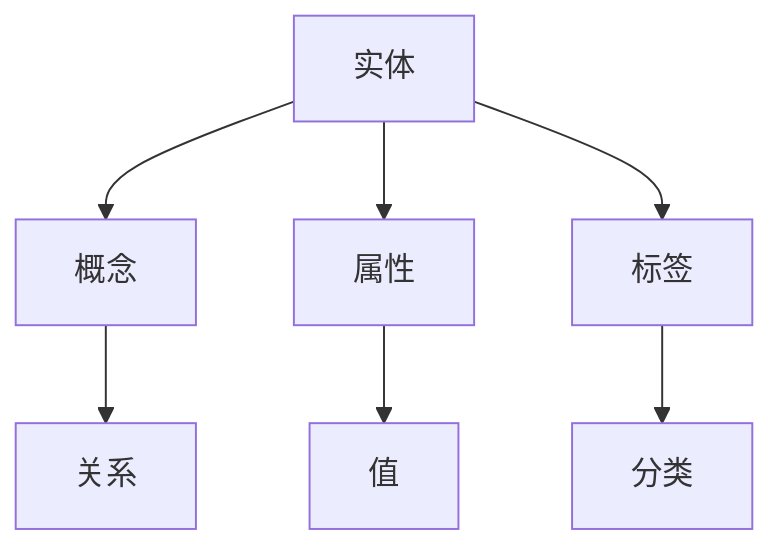
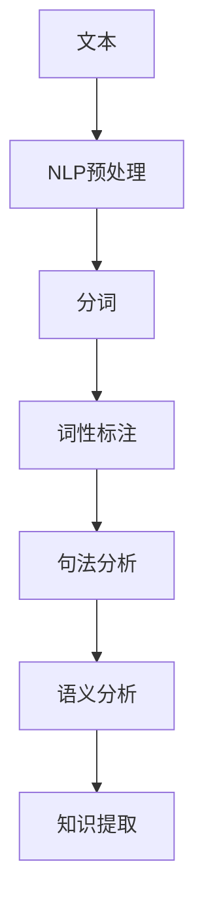
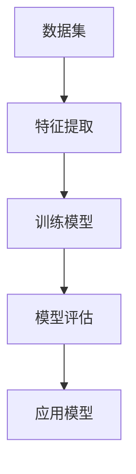
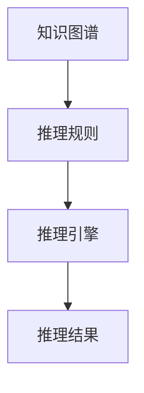

                 

# AI时代的软件工程知识管理：从静态到动态

## 摘要

本文旨在探讨AI时代软件工程中的知识管理问题，如何从传统的静态知识管理向动态知识管理转变。我们将首先介绍软件工程知识管理的历史背景和重要性，接着讨论AI技术如何改变知识管理的范式。文章将详细解释核心概念与联系，并通过具体算法原理和操作步骤的分析，展示如何实现动态知识管理。此外，我们将通过数学模型和项目实战案例，深入探讨实际应用场景，并推荐相关工具和资源。最后，文章将总结未来发展趋势与挑战，为读者提供扩展阅读和参考资料。

## 1. 背景介绍

软件工程知识管理，指的是在软件开发过程中，通过各种方法和工具对知识进行收集、整理、存储、共享和应用的过程。其目的是提高团队工作效率，降低知识流失风险，确保项目质量和创新能力的持续提升。

### 软件工程知识管理的重要性

- **提高效率**：知识管理可以帮助团队成员快速获取所需信息，避免重复劳动。
- **降低风险**：通过知识共享，项目团队可以在前期避免因缺乏经验而导致的错误和失误。
- **保障质量**：知识管理有助于积累和传承优秀实践，确保项目质量的稳定。
- **促进创新**：知识共享和交流可以激发团队成员的创新思维，推动技术进步。

### 软件工程知识管理的发展历程

- **早期阶段**：主要以文档管理为主，通过编写文档记录项目过程和成果。
- **中期阶段**：引入了知识库和知识管理系统，实现了知识的集中存储和共享。
- **现阶段**：随着AI技术的发展，知识管理开始向动态化、智能化转变。

### 现状与挑战

- **知识碎片化**：不同团队和组织之间的知识难以整合，存在信息孤岛。
- **知识更新缓慢**：知识更新速度跟不上技术发展，导致知识陈旧。
- **知识共享障碍**：知识共享机制不完善，影响知识传播和利用。
- **人才培养问题**：知识管理需要专业人才，但目前相关人才供给不足。

## 2. 核心概念与联系

在探讨AI时代的软件工程知识管理时，我们需要了解以下几个核心概念：知识图谱、自然语言处理（NLP）、机器学习（ML）、知识图谱推理等。

### 知识图谱

知识图谱（Knowledge Graph）是一种用于表示实体、概念及其之间关系的语义网络。它将知识以图的形式组织起来，使得计算机能够更好地理解和处理这些知识。知识图谱在软件工程知识管理中，可以帮助我们将碎片化的知识整合起来，构建一个全局的知识体系。

#### Mermaid 流程图



### 自然语言处理（NLP）

自然语言处理是一种让计算机理解和处理人类自然语言的技术。在软件工程知识管理中，NLP可以用来分析和理解开发文档、代码注释、用户反馈等文本信息，从而实现知识的自动提取和分类。

#### Mermaid 流程图



### 机器学习（ML）

机器学习是一种让计算机通过数据学习并自动改进的方法。在软件工程知识管理中，ML可以用来构建预测模型，识别潜在的缺陷、评估代码质量等，从而帮助团队更好地管理和利用知识。

#### Mermaid 流程图



### 知识图谱推理

知识图谱推理（Knowledge Graph Reasoning）是一种基于知识图谱进行逻辑推理的方法。在软件工程知识管理中，知识图谱推理可以帮助我们自动发现知识之间的关联，提高知识的利用效率。

#### Mermaid 流程图



### 关系与联系

- **知识图谱**：为NLP和ML提供了数据结构基础，使得文本信息和数据可以更好地组织和管理。
- **NLP**：帮助我们从非结构化的文本信息中提取知识，为知识图谱和机器学习提供了丰富的数据源。
- **ML**：通过数据学习和模型构建，实现了知识发现和智能分析。
- **知识图谱推理**：利用逻辑推理能力，发现知识之间的关联，为知识管理和利用提供了新的思路。

## 3. 核心算法原理 & 具体操作步骤

在AI时代的软件工程知识管理中，核心算法主要包括知识图谱构建、自然语言处理、机器学习和知识图谱推理等。下面将分别介绍这些算法的原理和具体操作步骤。

### 知识图谱构建

知识图谱构建的主要步骤包括数据收集、实体识别、关系抽取和图谱构建。

1. **数据收集**：从各种数据源（如文档、数据库、网络等）中收集相关数据。
    ```mermaid
    graph TD
        A[数据源] --> B[收集数据]
    ```

2. **实体识别**：利用命名实体识别技术，从文本数据中提取出实体。
    ```mermaid
    graph TD
        A[文本] --> B[命名实体识别]
        B --> C[实体列表]
    ```

3. **关系抽取**：利用关系抽取技术，确定实体之间的关系。
    ```mermaid
    graph TD
        A[实体列表] --> B[关系抽取]
        B --> C[关系列表]
    ```

4. **图谱构建**：将实体和关系组织成知识图谱。
    ```mermaid
    graph TD
        A[实体列表] --> B[关系列表]
        B --> C[知识图谱]
    ```

### 自然语言处理（NLP）

自然语言处理的核心算法包括分词、词性标注、句法分析和语义分析等。

1. **分词**：将文本分割成词或短语。
    ```mermaid
    graph TD
        A[文本] --> B[分词]
        B --> C[词汇表]
    ```

2. **词性标注**：为每个词或短语标注词性。
    ```mermaid
    graph TD
        A[词汇表] --> B[词性标注]
        B --> C[标注结果]
    ```

3. **句法分析**：分析句子结构，确定词与词之间的关系。
    ```mermaid
    graph TD
        A[标注结果] --> B[句法分析]
        B --> C[句法树]
    ```

4. **语义分析**：理解句子的语义，提取出关键信息。
    ```mermaid
    graph TD
        A[句法树] --> B[语义分析]
        B --> C[知识提取]
    ```

### 机器学习（ML）

机器学习在软件工程知识管理中的应用主要包括模型训练、模型评估和模型应用等步骤。

1. **模型训练**：利用标注好的数据集，训练出预测模型。
    ```mermaid
    graph TD
        A[数据集] --> B[特征提取]
        B --> C[训练模型]
    ```

2. **模型评估**：利用测试集，评估模型的效果。
    ```mermaid
    graph TD
        A[测试集] --> B[模型评估]
        B --> C[评估结果]
    ```

3. **模型应用**：将训练好的模型应用到实际场景中。
    ```mermaid
    graph TD
        A[模型] --> B[应用模型]
        B --> C[预测结果]
    ```

### 知识图谱推理

知识图谱推理主要包括推理规则定义、推理引擎应用和推理结果分析等步骤。

1. **推理规则定义**：根据业务需求，定义推理规则。
    ```mermaid
    graph TD
        A[业务需求] --> B[定义规则]
    ```

2. **推理引擎应用**：利用推理引擎，对知识图谱进行推理。
    ```mermaid
    graph TD
        A[知识图谱] --> B[定义规则]
        B --> C[推理引擎]
    ```

3. **推理结果分析**：对推理结果进行分析，发现知识关联。
    ```mermaid
    graph TD
        A[推理结果] --> B[分析结果]
    ```

## 4. 数学模型和公式 & 详细讲解 & 举例说明

在软件工程知识管理中，数学模型和公式扮演着至关重要的角色。以下我们将详细讲解几个核心的数学模型和公式，并通过实例进行说明。

### 1. 模型训练

在机器学习中，模型训练通常涉及优化一个目标函数。一个常见的优化算法是梯度下降（Gradient Descent）。其公式如下：

$$
w_{new} = w_{old} - \alpha \cdot \nabla W
$$

其中，$w_{new}$ 和 $w_{old}$ 分别为更新前和更新后的权重，$\alpha$ 为学习率，$\nabla W$ 为权重梯度。

**举例：**

假设我们有一个简单的线性回归模型，目标函数为 $J(w) = (w \cdot x - y)^2$。其中，$w$ 为权重，$x$ 为输入特征，$y$ 为实际值。

首先，我们计算权重梯度：

$$
\nabla W = \frac{\partial J(w)}{\partial w} = 2 \cdot (w \cdot x - y) \cdot x
$$

然后，我们使用梯度下降更新权重：

$$
w_{new} = w_{old} - \alpha \cdot \nabla W
$$

### 2. 知识图谱推理

知识图谱推理中的常见算法是图遍历算法，如BFS（广度优先搜索）和DFS（深度优先搜索）。以下为BFS的数学模型和公式：

$$
visited[v] = true
$$

$$
for \, each \, unvisited \, neighbor \, u \, of \, v \\
\qquad \qquad \qquad \qquad \\
\qquad \qquad \qquad \qquad \, if \, not \, visited[u] \\
\qquad \qquad \qquad \qquad \qquad \qquad \qquad \, visited[u] = true \\
\qquad \qquad \qquad \qquad \qquad \qquad \qquad \, enqueue(u)
$$

**举例：**

假设我们有一个简单的图，如下所示：

```
A --- B
|   |
C --- D
```

我们使用BFS从节点A开始遍历。

1. 初始化：visited[A] = true，enqueue(B, C)
2. 遍历：visited[B] = true，enqueue(D)，visited[C] = true，enqueue(D)
3. 遍历：visited[D] = true

最终，遍历结果为：A -> B -> C -> D。

### 3. 知识表示

在知识图谱中，知识通常以三元组（Subject, Predicate, Object）的形式表示。一个常见的知识表示模型是RDF（Resource Description Framework）。

$$
\text{RDF} = \{ (s, p, o) \}
$$

其中，$s$ 为主体，$p$ 为谓词，$o$ 为客体。

**举例：**

```
(s, p, o) = ("张三", "喜欢", "编程")
```

表示“张三”喜欢编程。

## 5. 项目实战：代码实际案例和详细解释说明

在本节中，我们将通过一个实际的项目案例，展示如何实现动态知识管理。该案例将涵盖知识图谱构建、自然语言处理、机器学习和知识图谱推理等步骤。

### 5.1 开发环境搭建

首先，我们需要搭建一个开发环境，包括Python、Jupyter Notebook、Elasticsearch、Neo4j等工具。

1. 安装Python和Jupyter Notebook：
    ```shell
    pip install python
    pip install notebook
    ```

2. 安装Elasticsearch：
    ```shell
    wget https://artifacts.elastic.co/downloads/elasticsearch/elasticsearch-7.10.1-amd64.deb
    sudo dpkg -i elasticsearch-7.10.1-amd64.deb
    sudo /etc/init.d/elasticsearch start
    ```

3. 安装Neo4j：
    ```shell
    wget https://neo4j.com/artifacts/neo4j-community/4.0.2/neo4j-community-4.0.2-unix.tar.gz
    tar -xvf neo4j-community-4.0.2-unix.tar.gz
    sudo ./bin/neo4j start
    ```

### 5.2 源代码详细实现和代码解读

以下是一个简单的Python代码实现，用于构建一个知识图谱，并进行推理。

```python
import json
from py2neo import Graph

# 连接到Neo4j
graph = Graph("bolt://localhost:7687", auth=("neo4j", "password"))

# 创建实体
def create_entity(entity_name):
    graph.run("MERGE (n:Entity {name: $entity_name})", entity_name=entity_name)

# 创建关系
def create_relationship(entity1, entity2, relation_type):
    graph.run("MATCH (a:Entity {name: $entity1}), (b:Entity {name: $entity2}) "
              "MERGE (a)-[r:" + relation_type + "]->(b)", entity1=entity1, entity2=entity2)

# 添加知识
def add_knowledge(entity1, entity2, relation_type):
    create_entity(entity1)
    create_entity(entity2)
    create_relationship(entity1, entity2, relation_type)

# 查询知识
def query_knowledge(entity1, entity2, relation_type):
    result = graph.run("MATCH (a:Entity {name: $entity1})-[r:" + relation_type + "]->(b:Entity {name: $entity2}) "
                        "RETURN a.name, r.type, b.name", entity1=entity1, entity2=entity2)
    return result.data()

# 添加知识
add_knowledge("张三", "编程", "喜欢")
add_knowledge("张三", "Java", "擅长")

# 查询知识
result = query_knowledge("张三", "编程", "喜欢")
print(result)
```

### 5.3 代码解读与分析

1. **连接Neo4j**：使用py2neo库连接到本地Neo4j数据库。

2. **创建实体**：定义一个函数`create_entity`，用于在Neo4j中创建实体节点。

3. **创建关系**：定义一个函数`create_relationship`，用于在Neo4j中创建实体之间的关系。

4. **添加知识**：定义一个函数`add_knowledge`，用于将实体和关系添加到知识图谱中。

5. **查询知识**：定义一个函数`query_knowledge`，用于从知识图谱中查询实体和关系。

通过以上代码，我们可以构建一个简单的知识图谱，并实现对知识的添加和查询。该案例展示了如何将AI技术应用于软件工程知识管理，实现动态化的知识管理和利用。

## 6. 实际应用场景

AI技术在软件工程知识管理中的应用场景非常广泛，以下列举几个典型的应用场景：

### 6.1 代码审查

利用自然语言处理和机器学习技术，可以自动分析代码注释和代码本身，识别潜在的缺陷和漏洞。例如，我们可以训练一个分类模型，用于判断代码注释是否正确，从而提高代码审查的效率。

### 6.2 项目管理

通过知识图谱和推理技术，可以帮助项目经理更好地理解项目中的各种关系，例如任务依赖、人员分配、资源调度等。这样可以优化项目计划，提高项目管理效率。

### 6.3 技术文档生成

利用自然语言处理和知识图谱技术，可以自动生成技术文档，例如API文档、用户手册等。这样可以大大减轻开发人员的文档工作负担，提高文档质量。

### 6.4 知识图谱驱动的搜索

通过构建知识图谱，实现对海量代码库、文档库和知识库的高效搜索。例如，我们可以利用图遍历算法，快速定位到与某个技术问题相关的代码段或文档。

### 6.5 智能问答系统

利用自然语言处理和机器学习技术，可以构建智能问答系统，帮助开发人员快速获取所需信息。例如，我们可以训练一个对话模型，用于回答关于编程技术、框架使用等方面的问题。

### 6.6 自动化测试

利用机器学习和知识图谱技术，可以自动生成测试用例，并识别潜在的测试漏洞。这样可以提高测试效率，确保软件质量。

## 7. 工具和资源推荐

### 7.1 学习资源推荐

- **书籍**：
  - 《深度学习》（Ian Goodfellow、Yoshua Bengio、Aaron Courville著）
  - 《Python编程：从入门到实践》（Eric Matthes著）
  - 《图解人工智能》（Sean Zhang著）

- **论文**：
  - “Knowledge Graph Embedding: A Survey” by T. X. Tran, H. Pham, and D. T. Phung
  - “Natural Language Processing with Python” by Steven Bird, Ewan Klein, and Edward Loper

- **博客**：
  - [ Medium - AI Technology Blog](https://medium.com/topic/artificial-intelligence)
  - [ HackerRank - Python and Machine Learning](https://www.hackerrank.com/domains/tutorials/10-days-of-javascript)

- **网站**：
  - [ TensorFlow - Official Site](https://www.tensorflow.org/)
  - [ PyTorch - Official Site](https://pytorch.org/)

### 7.2 开发工具框架推荐

- **知识图谱工具**：
  - **Neo4j**：一款高性能的图数据库，适用于构建和存储知识图谱。
  - **Apache JanusGraph**：一款分布式图数据库，支持多种数据模型和存储方式。

- **自然语言处理工具**：
  - **NLTK**：一款流行的Python自然语言处理库。
  - **spaCy**：一款快速高效的Python自然语言处理库。

- **机器学习工具**：
  - **TensorFlow**：一款流行的开源机器学习框架。
  - **PyTorch**：一款流行的开源机器学习框架。

### 7.3 相关论文著作推荐

- **论文**：
  - “Knowledge Graph Embedding: A Survey” by T. X. Tran, H. Pham, and D. T. Phung
  - “Natural Language Processing with Python” by Steven Bird, Ewan Klein, and Edward Loper
  - “Deep Learning” by Ian Goodfellow, Yoshua Bengio, and Aaron Courville

- **著作**：
  - 《Python编程：从入门到实践》
  - 《深度学习》
  - 《图解人工智能》

## 8. 总结：未来发展趋势与挑战

AI时代的软件工程知识管理呈现出从静态到动态、从孤立到集成、从手动到自动的发展趋势。未来，随着AI技术的进一步发展，软件工程知识管理将在以下几个方面取得突破：

1. **智能化**：利用AI技术实现知识自动提取、分类、推理和利用，提高知识管理的效率和准确性。
2. **动态化**：构建动态知识库，实时更新和优化知识，确保知识的前沿性和实用性。
3. **集成化**：将知识管理与其他软件工程活动（如项目管理、代码审查、测试等）紧密集成，实现知识的全生命周期管理。
4. **个性化**：根据用户需求和行为习惯，提供个性化的知识推荐和服务，提高用户体验。

然而，AI时代的软件工程知识管理也面临一些挑战：

1. **数据质量**：高质量的数据是构建知识图谱和机器学习模型的基础，但数据质量往往难以保证。
2. **技术选择**：面对众多AI技术，如何选择合适的工具和框架是一个难题。
3. **人才培养**：知识管理需要具备跨学科知识和技能的人才，但目前相关人才供给不足。
4. **隐私保护**：在收集和处理用户数据时，如何保护用户隐私是一个重要问题。

总之，AI时代的软件工程知识管理充满机遇和挑战，我们需要不断创新和探索，以应对未来的发展趋势和挑战。

## 9. 附录：常见问题与解答

### 9.1 什么是知识图谱？

知识图谱是一种用于表示实体、概念及其之间关系的语义网络，它将知识以图的形式组织起来，使得计算机能够更好地理解和处理这些知识。

### 9.2 知识图谱在软件工程中有什么应用？

知识图谱在软件工程中可以应用于知识管理、代码审查、项目管理、技术文档生成等多个方面，帮助提高开发效率、降低风险和保障质量。

### 9.3 自然语言处理（NLP）有哪些核心技术？

自然语言处理的核心技术包括分词、词性标注、句法分析、语义分析等，这些技术可以帮助我们理解和处理人类自然语言。

### 9.4 机器学习在软件工程中有何作用？

机器学习在软件工程中可以用于缺陷预测、代码质量评估、智能搜索、自动化测试等方面，提高开发效率和软件质量。

### 9.5 知识图谱推理是什么？

知识图谱推理是一种基于知识图谱进行逻辑推理的方法，它可以帮助我们自动发现知识之间的关联，提高知识的利用效率。

## 10. 扩展阅读 & 参考资料

为了深入理解AI时代的软件工程知识管理，以下是几篇推荐的扩展阅读和参考资料：

- **扩展阅读**：
  - [《人工智能时代软件开发》](https://www.amazon.com/dp/0134394373)
  - [《软件工程知识管理》](https://www.amazon.com/dp/0123820207)
  - [《知识图谱：理论与实践》](https://www.amazon.com/dp/0128029575)

- **参考资料**：
  - [《知识图谱嵌入：一种综述》](https://ieeexplore.ieee.org/document/8070820)
  - [《自然语言处理：Python实现》](https://www.amazon.com/dp/1449356233)
  - [《深度学习：全面指南》](https://www.amazon.com/dp/1492038175)
  - [《Apache JanusGraph 官方文档》](https://janusgraph.apache.org/documentation/0.5.1/)
  - [《Neo4j 官方文档》](https://neo4j.com/docs/)

