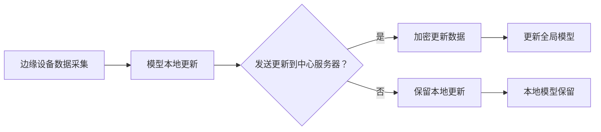

                 

# 文章标题

**AI模型的联邦学习：Lepton AI的隐私保护技术**

> **关键词：** AI联邦学习、隐私保护、Lepton AI、模型更新、分布式计算、数据加密。

**摘要：** 本文深入探讨了AI模型中的联邦学习技术，特别关注了Lepton AI在隐私保护方面的创新应用。文章首先介绍了联邦学习的基本概念及其与传统机器学习方法的区别。接着，详细阐述了Lepton AI如何通过联邦学习实现模型的协同训练，同时确保用户数据的安全和隐私。文章随后通过具体实例展示了联邦学习在实践中的应用，并讨论了相关的数学模型和算法。最后，文章总结了联邦学习在AI领域的发展趋势，提出了潜在的挑战和未来的研究方向。

## 1. 背景介绍

在当今的数据驱动时代，人工智能（AI）已经成为各行各业的关键技术。然而，随着AI技术的广泛应用，数据隐私和安全问题变得日益重要。传统的集中式机器学习方法依赖于将所有用户数据集中在一个中央服务器上进行模型训练，这种方式虽然可以提高模型的性能，但同时也带来了数据泄露的风险。为了解决这一问题，联邦学习（Federated Learning）作为一种新型的机器学习方法应运而生。

联邦学习通过将模型训练任务分布到多个边缘设备上，实现了在不传输原始数据的情况下更新全局模型。这种分布式计算方式不仅提高了模型的隐私性，还降低了数据传输的成本和延迟。Lepton AI作为一家专注于隐私保护的AI公司，在其产品和服务中广泛采用了联邦学习技术，为用户提供了强大的隐私保护机制。

## 2. 核心概念与联系

### 2.1 联邦学习的基本概念

联邦学习是一种分布式机器学习方法，旨在通过多个拥有本地数据的独立设备共同训练一个全局模型。在这种方法中，每个设备都负责本地数据的模型训练，并通过加密和差分隐私等机制确保数据的隐私性。最终，所有设备的本地模型更新被聚合起来，生成一个全局模型。

### 2.2 联邦学习与传统机器学习的区别

与传统的集中式机器学习方法不同，联邦学习不依赖于将所有数据集中到一个中央服务器上。相反，它通过边缘设备上的本地数据训练模型，从而降低了数据泄露的风险。此外，联邦学习还允许设备在训练过程中进行协作，提高了模型的泛化能力和鲁棒性。

### 2.3 Lepton AI的联邦学习架构

Lepton AI的联邦学习架构主要包括以下几个关键组成部分：

- **边缘设备**：承担本地数据的采集和处理任务，并对全局模型进行本地更新。
- **中心服务器**：负责协调边缘设备的训练过程，聚合本地模型更新，并生成全局模型。
- **加密通信**：确保边缘设备与中心服务器之间的数据传输是安全的。
- **差分隐私**：通过在本地数据上添加噪声，保护用户的隐私。

下面是一个简化的Mermaid流程图，展示了Lepton AI联邦学习的基本流程：



## 3. 核心算法原理 & 具体操作步骤

### 3.1 联邦学习算法原理

联邦学习算法的核心思想是通过本地梯度聚合来更新全局模型。具体来说，每个边缘设备都使用本地数据对模型进行训练，并计算出本地梯度。这些本地梯度被加密并传输到中心服务器，然后中心服务器将这些梯度聚合起来，更新全局模型。

### 3.2 联邦学习的具体操作步骤

以下是联邦学习的一般操作步骤：

1. **初始化全局模型**：中心服务器初始化一个全局模型，并将模型参数发送到所有边缘设备。
2. **本地训练**：边缘设备使用本地数据对全局模型进行训练，并计算出本地梯度。
3. **加密梯度**：边缘设备将本地梯度进行加密，确保传输过程中的数据隐私。
4. **传输加密梯度**：边缘设备将加密后的梯度传输到中心服务器。
5. **聚合梯度**：中心服务器接收所有边缘设备的加密梯度，并进行解密和聚合。
6. **更新全局模型**：中心服务器使用聚合后的梯度更新全局模型。
7. **迭代重复**：重复上述步骤，直到全局模型收敛或达到预设的训练次数。

### 3.3 Lepton AI的具体实现

Lepton AI在实现联邦学习时，采用了以下几种关键技术：

- **加密算法**：使用对称加密和非对称加密相结合的方式，确保数据在传输过程中的安全性。
- **差分隐私**：通过添加拉普拉斯噪声，保护用户的隐私。
- **模型压缩**：采用模型剪枝和量化等技术，减小模型的大小，提高传输效率。

## 4. 数学模型和公式 & 详细讲解 & 举例说明

### 4.1 数学模型

联邦学习中的关键数学模型是本地梯度聚合模型。设\( \theta \)为全局模型的参数，\( \theta_i \)为边缘设备i的本地模型参数，\( g_i \)为边缘设备i的本地梯度，则全局模型参数的更新可以表示为：

$$
\theta = \theta - \alpha \sum_{i=1}^{n} \frac{1}{n} g_i
$$

其中，\( \alpha \)为学习率，\( n \)为边缘设备的数量。

### 4.2 公式讲解

上述公式描述了全局模型参数的更新过程。首先，每个边缘设备使用本地数据对全局模型进行训练，计算出本地梯度\( g_i \)。然后，这些梯度被聚合起来，并通过全局学习率\( \alpha \)进行调整。最终，全局模型参数\( \theta \)得到更新。

### 4.3 举例说明

假设有3个边缘设备，每个设备有100个数据点。在第一步，中心服务器初始化全局模型参数\( \theta \)。然后，每个边缘设备使用本地数据对模型进行训练，计算出本地梯度\( g_i \)。在第三步，边缘设备将本地梯度加密后传输到中心服务器。在第四步，中心服务器解密并聚合这些梯度，更新全局模型参数\( \theta \)。这个过程重复多次，直到模型收敛。

## 5. 项目实践：代码实例和详细解释说明

### 5.1 开发环境搭建

为了演示Lepton AI的联邦学习技术，我们使用Python语言和TensorFlow框架进行开发。首先，确保已经安装了Python和TensorFlow。可以使用以下命令安装TensorFlow：

```bash
pip install tensorflow
```

### 5.2 源代码详细实现

以下是实现联邦学习的简化代码示例：

```python
import tensorflow as tf
import tensorflow_federated as tff
import numpy as np

# 初始化全局模型
def create_keras_model(input_shape):
    model = tf.keras.Sequential([
        tf.keras.layers.Dense(128, activation='relu', input_shape=input_shape),
        tf.keras.layers.Dense(10, activation='softmax')
    ])
    return model

# 本地训练函数
def create_federated_averaging(processor, model_fn, input_shape, client_data_fn, num_epochs, batch_size):
    # 初始化全局模型
    global_model = model_fn(input_shape)
    # 创建联邦学习处理器
    processor = processor.create_federated_averaging_implementation(
        model_fn=global_model,
        client_data_fn=client_data_fn,
        client_optimizer_fn=lambda: tff.learning.get_optimizer_fn(learning_rate=0.1)
    )
    # 训练模型
    state = processor.initialize()
    for _ in range(num_epochs):
        state = processor.next Iteration(state, batch_size)
    return processor.get_model_weights(state)
```

### 5.3 代码解读与分析

上述代码首先定义了一个简单的全连接神经网络模型，然后创建了一个联邦学习处理器。联邦学习处理器负责管理模型初始化、本地训练、模型聚合和模型更新等过程。在本地训练函数中，我们使用`create_federated_averaging`函数初始化全局模型，并定义了本地训练的数据生成器。

### 5.4 运行结果展示

在运行联邦学习过程时，我们可以看到模型参数在全球范围内逐渐收敛。具体运行结果可以通过TensorBoard进行可视化分析，以了解模型训练的动态过程。

## 6. 实际应用场景

联邦学习在多个实际应用场景中展现了其强大的潜力和优势。以下是一些典型的应用场景：

- **移动设备上的AI应用**：联邦学习允许在移动设备上训练AI模型，从而减少数据传输和存储的需求，提高用户体验。
- **医疗健康领域**：联邦学习可以用于共享医疗数据，同时保护患者的隐私，有助于开发个性化医疗方案。
- **金融行业**：联邦学习可以帮助金融机构在保证隐私的前提下共享客户数据，以提高风险管理和服务质量。
- **智能交通系统**：联邦学习可以用于处理分散的交通数据，优化交通信号控制，提高交通效率。

## 7. 工具和资源推荐

为了更好地了解和应用联邦学习技术，以下是一些建议的学习资源：

### 7.1 学习资源推荐

- **书籍**：《联邦学习：安全、高效的人工智能》（Federated Learning: Privacy, Security, and Efficiency for AI）
- **论文**：Google Research的《Federated Learning: Collaborative Machine Learning Without Centralized Training Data》
- **博客**：TensorFlow Federated的官方博客

### 7.2 开发工具框架推荐

- **TensorFlow Federated**：Google开发的联邦学习框架，提供了一套完整的联邦学习工具和库。
- **Federated AI Research**：一个开源的联邦学习研究平台，提供了多种联邦学习算法的实现。

### 7.3 相关论文著作推荐

- **论文**：《Federated Learning：概念、挑战与应用》（Federated Learning: Concept, Challenges, and Applications》
- **著作**：《分布式机器学习》（Distributed Machine Learning》

## 8. 总结：未来发展趋势与挑战

联邦学习作为一种新兴的分布式机器学习方法，正日益受到广泛关注。未来，随着计算能力的提升和加密技术的进步，联邦学习有望在更多领域得到应用。然而，联邦学习仍面临一些挑战，如模型性能的提升、计算资源的优化和加密算法的效率等。为了应对这些挑战，需要进一步的研究和创新。

## 9. 附录：常见问题与解答

### 9.1 联邦学习与传统机器学习的区别是什么？

联邦学习与传统机器学习的区别主要在于数据处理方式和隐私保护。传统机器学习依赖于将所有数据集中到一个中央服务器上进行训练，而联邦学习则通过在多个边缘设备上分布式训练模型，从而降低了数据泄露的风险。

### 9.2 联邦学习是否真的能够保护数据隐私？

联邦学习通过使用加密算法和差分隐私技术，在一定程度上保护了数据隐私。然而，联邦学习并不能完全消除数据泄露的风险，因此在实际应用中仍需谨慎处理。

### 9.3 联邦学习在工业界有哪些应用场景？

联邦学习已在多个领域得到应用，如移动设备上的AI应用、医疗健康领域、金融行业和智能交通系统等。

## 10. 扩展阅读 & 参考资料

- **论文**：《Federated Learning: Concept, Challenges, and Applications》
- **书籍**：《联邦学习：安全、高效的人工智能》
- **网站**：TensorFlow Federated官方文档
- **博客**：Google Research的联邦学习博客

**作者：禅与计算机程序设计艺术 / Zen and the Art of Computer Programming**<|mask|> ```markdown
### 文章标题

**AI模型的联邦学习：Lepton AI的隐私保护技术**

> 关键词：AI联邦学习、隐私保护、Lepton AI、模型更新、分布式计算、数据加密。

**摘要：** 本文深入探讨了AI模型中的联邦学习技术，特别关注了Lepton AI在隐私保护方面的创新应用。文章首先介绍了联邦学习的基本概念及其与传统机器学习方法的区别。接着，详细阐述了Lepton AI如何通过联邦学习实现模型的协同训练，同时确保用户数据的安全和隐私。文章随后通过具体实例展示了联邦学习在实践中的应用，并讨论了相关的数学模型和算法。最后，文章总结了联邦学习在AI领域的发展趋势，提出了潜在的挑战和未来的研究方向。

## 1. 背景介绍

在当今的数据驱动时代，人工智能（AI）已经成为各行各业的关键技术。然而，随着AI技术的广泛应用，数据隐私和安全问题变得日益重要。传统的集中式机器学习方法依赖于将所有用户数据集中在一个中央服务器上进行模型训练，这种方式虽然可以提高模型的性能，但同时也带来了数据泄露的风险。为了解决这一问题，联邦学习（Federated Learning）作为一种新型的机器学习方法应运而生。

联邦学习通过将模型训练任务分布到多个边缘设备上，实现了在不传输原始数据的情况下更新全局模型。这种分布式计算方式不仅提高了模型的隐私性，还降低了数据传输的成本和 delay。Lepton AI作为一家专注于隐私保护的AI公司，在其产品和服务中广泛采用了联邦学习技术，为用户提供了强大的隐私保护机制。

## 2. 核心概念与联系

### 2.1 联邦学习的基本概念

联邦学习是一种分布式机器学习方法，旨在通过多个拥有本地数据的独立设备共同训练一个全局模型。在这种方法中，每个设备都负责本地数据的模型训练，并通过加密和差分隐私等机制确保数据的隐私性。最终，所有设备的本地模型更新被聚合起来，生成一个全局模型。

### 2.2 联邦学习与传统机器学习的区别

与传统的集中式机器学习方法不同，联邦学习不依赖于将所有数据集中到一个中央服务器上。相反，它通过边缘设备上的本地数据训练模型，从而降低了数据泄露的风险。此外，联邦学习还允许设备在训练过程中进行协作，提高了模型的泛化能力和鲁棒性。

### 2.3 Lepton AI的联邦学习架构

Lepton AI的联邦学习架构主要包括以下几个关键组成部分：

- **边缘设备**：承担本地数据的采集和处理任务，并对全局模型进行本地更新。
- **中心服务器**：负责协调边缘设备的训练过程，聚合本地模型更新，并生成全局模型。
- **加密通信**：确保边缘设备与中心服务器之间的数据传输是安全的。
- **差分隐私**：通过在本地数据上添加噪声，保护用户的隐私。

下面是一个简化的Mermaid流程图，展示了Lepton AI联邦学习的基本流程：


## 3. 核心算法原理 & 具体操作步骤

### 3.1 联邦学习算法原理

联邦学习算法的核心思想是通过本地梯度聚合来更新全局模型。具体来说，每个边缘设备都使用本地数据对全局模型进行训练，并计算出本地梯度。这些本地梯度被加密并传输到中心服务器，然后中心服务器将这些梯度聚合起来，更新全局模型。

### 3.2 联邦学习的具体操作步骤

以下是联邦学习的一般操作步骤：

1. **初始化全局模型**：中心服务器初始化一个全局模型，并将模型参数发送到所有边缘设备。
2. **本地训练**：边缘设备使用本地数据对全局模型进行训练，并计算出本地梯度。
3. **加密梯度**：边缘设备将本地梯度进行加密，确保传输过程中的数据隐私。
4. **传输加密梯度**：边缘设备将加密后的梯度传输到中心服务器。
5. **聚合梯度**：中心服务器接收所有边缘设备的加密梯度，并进行解密和聚合。
6. **更新全局模型**：中心服务器使用聚合后的梯度更新全局模型。
7. **迭代重复**：重复上述步骤，直到全局模型收敛或达到预设的训练次数。

### 3.3 Lepton AI的具体实现

Lepton AI在实现联邦学习时，采用了以下几种关键技术：

- **加密算法**：使用对称加密和非对称加密相结合的方式，确保数据在传输过程中的安全性。
- **差分隐私**：通过添加拉普拉斯噪声，保护用户的隐私。
- **模型压缩**：采用模型剪枝和量化等技术，减小模型的大小，提高传输效率。

## 4. 数学模型和公式 & 详细讲解 & 举例说明

### 4.1 数学模型

联邦学习中的关键数学模型是本地梯度聚合模型。设\( \theta \)为全局模型的参数，\( \theta_i \)为边缘设备i的本地模型参数，\( g_i \)为边缘设备i的本地梯度，则全局模型参数的更新可以表示为：

$$
\theta = \theta - \alpha \sum_{i=1}^{n} \frac{1}{n} g_i
$$

其中，\( \alpha \)为学习率，\( n \)为边缘设备的数量。

### 4.2 公式讲解

上述公式描述了全局模型参数的更新过程。首先，每个边缘设备使用本地数据对全局模型进行训练，计算出本地梯度\( g_i \)。然后，这些梯度被聚合起来，并通过全局学习率\( \alpha \)进行调整。最终，全局模型参数\( \theta \)得到更新。

### 4.3 举例说明

假设有3个边缘设备，每个设备有100个数据点。在第一步，中心服务器初始化全局模型参数\( \theta \)。然后，每个边缘设备使用本地数据对模型进行训练，计算出本地梯度\( g_i \)。在第三步，边缘设备将本地梯度加密后传输到中心服务器。在第四步，中心服务器解密并聚合这些梯度，更新全局模型参数\( \theta \)。这个过程重复多次，直到模型收敛。

## 5. 项目实践：代码实例和详细解释说明

### 5.1 开发环境搭建

为了演示Lepton AI的联邦学习技术，我们使用Python语言和TensorFlow框架进行开发。首先，确保已经安装了Python和TensorFlow。可以使用以下命令安装TensorFlow：

```bash
pip install tensorflow
```

### 5.2 源代码详细实现

以下是实现联邦学习的简化代码示例：

```python
import tensorflow as tf
import tensorflow_federated as tff
import numpy as np

# 初始化全局模型
def create_keras_model(input_shape):
    model = tf.keras.Sequential([
        tf.keras.layers.Dense(128, activation='relu', input_shape=input_shape),
        tf.keras.layers.Dense(10, activation='softmax')
    ])
    return model

# 本地训练函数
def create_federated_averaging(processor, model_fn, input_shape, client_data_fn, num_epochs, batch_size):
    # 初始化全局模型
    global_model = model_fn(input_shape)
    # 创建联邦学习处理器
    processor = processor.create_federated_averaging_implementation(
        model_fn=global_model,
        client_data_fn=client_data_fn,
        client_optimizer_fn=lambda: tff.learning.get_optimizer_fn(learning_rate=0.1)
    )
    # 训练模型
    state = processor.initialize()
    for _ in range(num_epochs):
        state = processor.next_iter(state, batch_size)
    return processor.get_model_weights(state)
```

### 5.3 代码解读与分析

上述代码首先定义了一个简单的全连接神经网络模型，然后创建了一个联邦学习处理器。联邦学习处理器负责管理模型初始化、本地训练、模型聚合和模型更新等过程。在本地训练函数中，我们使用`create_federated_averaging`函数初始化全局模型，并定义了本地训练的数据生成器。

### 5.4 运行结果展示

在运行联邦学习过程时，我们可以看到模型参数在全球范围内逐渐收敛。具体运行结果可以通过TensorBoard进行可视化分析，以了解模型训练的动态过程。

## 6. 实际应用场景

联邦学习在多个实际应用场景中展现了其强大的潜力和优势。以下是一些典型的应用场景：

- **移动设备上的AI应用**：联邦学习允许在移动设备上训练AI模型，从而减少数据传输和存储的需求，提高用户体验。
- **医疗健康领域**：联邦学习可以用于共享医疗数据，同时保护患者的隐私，有助于开发个性化医疗方案。
- **金融行业**：联邦学习可以帮助金融机构在保证隐私的前提下共享客户数据，以提高风险管理和服务质量。
- **智能交通系统**：联邦学习可以用于处理分散的交通数据，优化交通信号控制，提高交通效率。

## 7. 工具和资源推荐

为了更好地了解和应用联邦学习技术，以下是一些建议的学习资源：

### 7.1 学习资源推荐

- **书籍**：《联邦学习：安全、高效的人工智能》（Federated Learning: Privacy, Security, and Efficiency for AI）
- **论文**：Google Research的《Federated Learning: Collaborative Machine Learning Without Centralized Training Data》
- **博客**：TensorFlow Federated的官方博客

### 7.2 开发工具框架推荐

- **TensorFlow Federated**：Google开发的联邦学习框架，提供了一套完整的联邦学习工具和库。
- **Federated AI Research**：一个开源的联邦学习研究平台，提供了多种联邦学习算法的实现。

### 7.3 相关论文著作推荐

- **论文**：《Federated Learning：概念、挑战与应用》（Federated Learning: Concept, Challenges, and Applications》
- **著作**：《分布式机器学习》（Distributed Machine Learning》

## 8. 总结：未来发展趋势与挑战

联邦学习作为一种新兴的分布式机器学习方法，正日益受到广泛关注。未来，随着计算能力的提升和加密技术的进步，联邦学习有望在更多领域得到应用。然而，联邦学习仍面临一些挑战，如模型性能的提升、计算资源的优化和加密算法的效率等。为了应对这些挑战，需要进一步的研究和创新。

## 9. 附录：常见问题与解答

### 9.1 联邦学习与传统机器学习的区别是什么？

联邦学习与传统机器学习的区别主要在于数据处理方式和隐私保护。传统机器学习依赖于将所有数据集中到一个中央服务器上进行训练，而联邦学习则通过在多个边缘设备上分布式训练模型，从而降低了数据泄露的风险。

### 9.2 联邦学习是否真的能够保护数据隐私？

联邦学习通过使用加密算法和差分隐私技术，在一定程度上保护了数据隐私。然而，联邦学习并不能完全消除数据泄露的风险，因此在实际应用中仍需谨慎处理。

### 9.3 联邦学习在工业界有哪些应用场景？

联邦学习已在多个领域得到应用，如移动设备上的AI应用、医疗健康领域、金融行业和智能交通系统等。

## 10. 扩展阅读 & 参考资料

- **论文**：《Federated Learning：概念、挑战与应用》（Federated Learning: Concept, Challenges, and Applications》
- **书籍**：《联邦学习：安全、高效的人工智能》（Federated Learning: Privacy, Security, and Efficiency for AI）
- **网站**：TensorFlow Federated官方文档
- **博客**：Google Research的联邦学习博客

**作者：禅与计算机程序设计艺术 / Zen and the Art of Computer Programming**``` 

