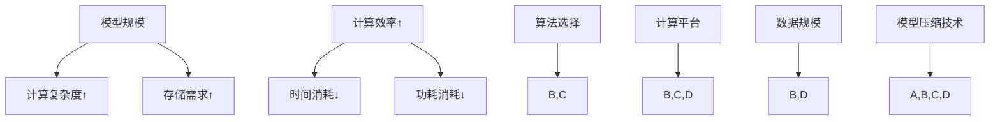

                 

### 背景介绍

> 在当今科技飞速发展的时代，人工智能（AI）领域的重要性日益凸显。从自动驾驶汽车到医疗诊断，从自然语言处理到图像识别，AI技术的应用几乎渗透到了我们生活的方方面面。而作为AI技术的核心组件，AI模型（特别是深度学习模型）的发展尤为重要。随着模型的复杂性不断增加，如何在这场规模与效率的平衡赛中找到最佳点，成为了业界共同关注的焦点。

AI模型的发展经历了从最初的简单规则系统，到基于神经网络的复杂模型，再到如今的巨量参数模型。这些模型在性能不断提升的同时，也对计算资源的需求越来越大。尤其是在训练阶段，模型规模（Model Size）和计算效率（Computational Efficiency）之间的平衡变得愈发关键。一方面，模型规模越大，其处理复杂任务的能力越强；但另一方面，模型规模增加也会带来更高的计算成本和更长的训练时间。因此，如何在保证模型性能的同时，优化其训练和推理效率，成为了亟待解决的重要问题。

此外，AI模型的应用场景多种多样，包括实时推理、离线训练等，不同的应用场景对模型效率的需求也各不相同。例如，在自动驾驶领域，模型需要在短时间内快速做出决策，而在语音识别领域，模型的延迟可以相对较长。这就要求我们在设计和优化AI模型时，要充分考虑不同应用场景的具体需求。

本篇文章将围绕AI模型规模与效率的平衡展开讨论。我们将首先介绍AI模型的基本概念和发展历程，然后深入探讨模型规模与效率之间的关系，并通过具体案例来分析如何在实际应用中找到这一平衡点。此外，我们还将介绍一些优化模型效率和降低计算成本的方法，并展望未来AI模型发展的趋势和挑战。通过本文的阅读，希望读者能够对AI模型规模与效率的平衡有更深入的理解，为今后的研究和应用提供有益的参考。

## 2. 核心概念与联系

### AI模型的基本概念

#### 模型规模（Model Size）

模型规模通常指的是模型参数的数量。在深度学习中，一个模型的规模可以通过其参数的数量来衡量。一个简单的线性回归模型可能只有一个参数，而一个复杂的神经网络模型可能拥有数百万甚至数十亿个参数。模型规模的大小直接影响到模型的计算复杂度和存储需求。

#### 计算效率（Computational Efficiency）

计算效率则是指模型在执行计算任务时所消耗的计算资源，包括时间、内存、功耗等。高效的计算模型能够在更短的时间内完成相同的任务，或者在相同的计算资源下完成更多的任务。计算效率的提升对于实时应用和资源受限的环境尤为重要。

### 模型规模与效率之间的关系

模型规模和计算效率之间存在复杂的关系。一方面，增加模型规模可以提高模型的性能，使其能够捕捉到更多的特征和模式。然而，这也会导致计算复杂度的增加，从而降低计算效率。另一方面，减小模型规模可以降低计算复杂度，提高计算效率，但可能会牺牲模型的性能。

在实际应用中，找到模型规模与效率之间的最佳平衡点至关重要。这需要综合考虑模型的应用场景、资源限制、以及任务需求等多个因素。

### 关键影响因素

#### 算法选择

不同的算法对模型规模和计算效率的影响不同。例如，卷积神经网络（CNN）适合处理图像数据，其模型规模通常较大，但计算效率较高；而循环神经网络（RNN）适合处理序列数据，模型规模相对较小，但计算效率较低。

#### 计算平台

不同的计算平台对模型规模和计算效率的影响也很大。例如，在GPU上训练模型通常比在CPU上更高效，因为GPU具有更强大的并行计算能力。

#### 数据规模

数据规模也是影响模型规模和计算效率的重要因素。更大的数据规模可以提高模型的性能，但也会导致训练时间的增加。

#### 模型压缩技术

为了在保持模型性能的同时提高计算效率，研究人员开发了各种模型压缩技术，如剪枝（Pruning）、量化（Quantization）和蒸馏（Distillation）等。这些技术通过减少模型规模来降低计算复杂度，同时保持或提高模型的性能。

### Mermaid流程图

以下是一个描述AI模型规模与效率关系的Mermaid流程图。请注意，Mermaid流程节点中不应包含括号、逗号等特殊字符。



通过这张流程图，我们可以清晰地看到模型规模与计算效率之间的多种影响因素及其相互关系。在实际应用中，我们需要根据具体需求和技术条件，灵活地调整和优化这些因素，以找到最佳的模型规模与效率平衡点。

### 3. 核心算法原理 & 具体操作步骤

在探讨AI模型规模与效率的平衡问题时，核心算法的选择和优化起着至关重要的作用。以下我们将详细讨论几种关键算法原理，并介绍如何通过具体步骤实现这些算法，以便在保持模型性能的同时提高计算效率。

#### 深度学习模型

##### 原理

深度学习模型，特别是卷积神经网络（CNN）和循环神经网络（RNN），是当前AI领域中广泛应用的算法。CNN通过多层卷积和池化操作，能够有效地提取图像数据中的特征，而RNN则擅长处理序列数据，如语音和文本。

##### 操作步骤

1. **数据预处理**：在训练深度学习模型之前，需要对数据进行预处理，包括归一化、缩放和数据增强等步骤。这一步骤有助于提高模型的泛化能力。

2. **模型架构设计**：根据具体任务需求，设计合适的模型架构。例如，对于图像分类任务，可以选择一个具有多个卷积层的CNN架构；对于语音识别任务，可以选择一个包含循环层的RNN架构。

3. **参数初始化**：初始化模型参数，常用的方法有零初始化、高斯初始化等。合适的参数初始化有助于加速模型的收敛速度。

4. **训练过程**：通过反向传播算法训练模型，不断调整模型参数，使其在训练数据上达到较好的拟合效果。训练过程中需要监控模型的性能，如准确率、损失函数值等。

5. **评估与调整**：在训练结束后，使用测试集对模型进行评估。如果性能不理想，可以调整模型架构、参数初始化方法或训练策略。

#### 强化学习模型

##### 原理

强化学习（Reinforcement Learning，RL）通过学习奖励信号来优化策略，使模型能够在特定环境中做出最优决策。与监督学习和无监督学习不同，强化学习通常没有明确的数据标签，而是通过试错和反馈来优化策略。

##### 操作步骤

1. **环境搭建**：首先需要定义一个模拟环境，环境可以是一个虚拟的模拟器，也可以是现实世界的实际环境。

2. **状态空间与动作空间**：定义状态空间和动作空间，状态空间表示环境中所有可能的状态，动作空间表示所有可能的动作。

3. **奖励函数设计**：设计奖励函数，用以评估模型在每个状态下的动作是否有助于达到目标。奖励函数的设计对于强化学习模型的性能至关重要。

4. **策略学习**：通过策略学习算法，如Q-Learning、SARSA等，训练模型选择最优动作。策略学习通常涉及大量的探索和利用，以平衡策略的稳定性和适应性。

5. **评估与优化**：在训练过程中，定期评估模型的性能，并根据评估结果调整策略。评估过程中可以引入对抗性样本、多目标优化等方法来提高模型的鲁棒性。

#### 聚类算法

##### 原理

聚类算法是一种无监督学习技术，用于将数据集中的数据点划分为多个组，使得同组内的数据点彼此相似，而不同组的数据点则差异较大。常用的聚类算法包括K均值聚类、层次聚类和DBSCAN等。

##### 操作步骤

1. **数据预处理**：对数据进行标准化处理，使其具备相似的尺度，以便聚类算法能够有效地工作。

2. **选择聚类算法**：根据数据特点和应用需求选择合适的聚类算法。例如，K均值聚类适用于数据点分布相对均匀的情况，而DBSCAN则适用于数据点分布不均匀且存在噪声的情况。

3. **参数设置**：设置聚类算法的参数，如K值、距离度量方法等。这些参数会影响聚类结果的质量。

4. **执行聚类**：执行聚类算法，将数据点划分为多个组。

5. **评估聚类效果**：评估聚类效果，常用的评估指标包括轮廓系数、轮廓分数等。根据评估结果调整参数或选择不同的聚类算法。

通过以上步骤，我们可以实现对不同类型AI模型的构建和优化，从而在模型规模与效率之间找到最佳平衡点。在实际应用中，需要根据具体任务需求和资源限制，灵活选择和调整算法，以达到最优的性能表现。

### 4. 数学模型和公式 & 详细讲解 & 举例说明

在AI模型的构建和优化过程中，数学模型和公式起到了至关重要的作用。以下我们将介绍一些关键的数学模型和公式，并详细讲解其含义和应用方法。

#### 损失函数

##### 原理

损失函数是监督学习中评估模型预测性能的核心工具。其目的是衡量模型预测值与实际标签值之间的差距。常用的损失函数包括均方误差（MSE）、交叉熵损失（Cross-Entropy Loss）等。

##### 数学公式

均方误差（MSE）：
$$MSE = \frac{1}{n}\sum_{i=1}^{n}(y_i - \hat{y}_i)^2$$
其中，\(y_i\) 表示第 \(i\) 个样本的实际标签，\(\hat{y}_i\) 表示第 \(i\) 个样本的预测标签，\(n\) 表示样本总数。

交叉熵损失（Cross-Entropy Loss）：
$$Cross-Entropy Loss = -\sum_{i=1}^{n} y_i \log(\hat{y}_i)$$
其中，\(y_i\) 表示第 \(i\) 个样本的实际标签，\(\hat{y}_i\) 表示第 \(i\) 个样本的预测概率。

##### 举例说明

假设我们有一个二分类问题，其中 \(y\) 表示实际标签（0或1），\(\hat{y}\) 表示预测概率。我们可以使用交叉熵损失函数来评估模型性能。

实际标签：\(y = [1, 0, 1, 0]\)
预测概率：\(\hat{y} = [0.8, 0.2, 0.9, 0.1]\)

计算交叉熵损失：
$$Cross-Entropy Loss = -[1 \times \log(0.8) + 0 \times \log(0.2) + 1 \times \log(0.9) + 0 \times \log(0.1)]$$
$$Cross-Entropy Loss = -[0.223 + 0 + 0.105 + 0]$$
$$Cross-Entropy Loss = -0.338$$

#### 反向传播算法

##### 原理

反向传播算法是一种用于训练神经网络的优化算法，其核心思想是通过计算梯度来更新模型参数，从而最小化损失函数。

##### 数学公式

假设我们有一个多层神经网络，其中每层有多个神经元。定义每个神经元的输出为 \(z_i\)，每个神经元的权重为 \(w_i\)，偏置为 \(b_i\)，激活函数为 \(f(z)\)。

输出层的梯度计算：
$$\frac{\partial Loss}{\partial w_{ij}} = \Delta w_{ij} = \frac{\partial Loss}{\partial z_j} \cdot \frac{\partial z_j}{\partial w_{ij}}$$
$$\frac{\partial Loss}{\partial b_j} = \Delta b_j = \frac{\partial Loss}{\partial z_j} \cdot \frac{\partial z_j}{\partial b_j}$$

隐藏层的梯度计算：
$$\frac{\partial Loss}{\partial w_{ij}} = \Delta w_{ij} = \frac{\partial Loss}{\partial z_j} \cdot \frac{\partial z_j}{\partial a_{i}} \cdot \frac{\partial a_{i}}{\partial z_i} \cdot \frac{\partial z_i}{\partial w_{ij}}$$
$$\frac{\partial Loss}{\partial b_j} = \Delta b_j = \frac{\partial Loss}{\partial z_j} \cdot \frac{\partial z_j}{\partial a_{i}} \cdot \frac{\partial a_{i}}{\partial z_i} \cdot \frac{\partial z_i}{\partial b_j}$$

其中，\(\frac{\partial Loss}{\partial z_j}\) 表示输出层对 \(z_j\) 的梯度，\(\frac{\partial z_j}{\partial a_{i}}\) 表示激活函数对 \(a_{i}\) 的梯度，\(\frac{\partial a_{i}}{\partial z_i}\) 表示激活函数对 \(z_i\) 的梯度，\(\frac{\partial z_i}{\partial w_{ij}}\) 表示权重对 \(z_i\) 的梯度。

##### 举例说明

假设我们有一个两层神经网络，输入层有2个神经元，输出层有1个神经元。激活函数为Sigmoid函数。

输入数据：\(x_1 = [1, 0]\)
权重：\(w_{11} = 0.5, w_{12} = 0.3, w_{21} = 0.2, w_{22} = 0.1\)
偏置：\(b_1 = 0.1, b_2 = 0.2\)

计算隐藏层的输出：
$$z_1 = x_1 \cdot w_{11} + b_1 = 1 \cdot 0.5 + 0.1 = 0.6$$
$$z_2 = x_1 \cdot w_{12} + b_2 = 1 \cdot 0.3 + 0.2 = 0.5$$
$$a_1 = f(z_1) = \frac{1}{1 + e^{-z_1}} = \frac{1}{1 + e^{-0.6}} = 0.5413$$
$$a_2 = f(z_2) = \frac{1}{1 + e^{-z_2}} = \frac{1}{1 + e^{-0.5}} = 0.6703$$

计算输出层的输出：
$$z_3 = a_1 \cdot w_{21} + a_2 \cdot w_{22} + b_2 = 0.5413 \cdot 0.2 + 0.6703 \cdot 0.1 + 0.2 = 0.1949$$
$$\hat{y} = f(z_3) = \frac{1}{1 + e^{-z_3}} = \frac{1}{1 + e^{-0.1949}} = 0.8678$$

假设实际标签为 \(y = 0\)，计算损失函数（交叉熵损失）：
$$Loss = -y \log(\hat{y}) - (1 - y) \log(1 - \hat{y})$$
$$Loss = -0 \log(0.8678) - 1 \log(1 - 0.8678)$$
$$Loss = \log(0.1332) = -0.1464$$

计算输出层梯度：
$$\frac{\partial Loss}{\partial z_3} = \frac{\partial Loss}{\partial \hat{y}} \cdot \frac{\partial \hat{y}}{\partial z_3} = (0 - 0.8678) \cdot (1 - 0.8678) = -0.0837$$

计算隐藏层梯度：
$$\frac{\partial Loss}{\partial z_1} = \frac{\partial Loss}{\partial z_3} \cdot \frac{\partial z_3}{\partial a_1} \cdot \frac{\partial a_1}{\partial z_1} = -0.0837 \cdot 0.2 \cdot 0.5413 = -0.0036$$
$$\frac{\partial Loss}{\partial z_2} = \frac{\partial Loss}{\partial z_3} \cdot \frac{\partial z_3}{\partial a_2} \cdot \frac{\partial a_2}{\partial z_2} = -0.0837 \cdot 0.1 \cdot 0.6703 = -0.0046$$

更新权重和偏置：
$$w_{21} \leftarrow w_{21} - \alpha \cdot \frac{\partial Loss}{\partial w_{21}} = 0.2 - 0.1 \cdot (-0.0036) = 0.2036$$
$$w_{22} \leftarrow w_{22} - \alpha \cdot \frac{\partial Loss}{\partial w_{22}} = 0.1 - 0.1 \cdot (-0.0046) = 0.1046$$
$$b_2 \leftarrow b_2 - \alpha \cdot \frac{\partial Loss}{\partial b_2} = 0.2 - 0.1 \cdot (-0.0046) = 0.2046$$

通过上述计算过程，我们可以更新模型的权重和偏置，从而优化模型性能。这一过程在每一轮训练中重复进行，直到模型达到预定的性能指标。

#### 梯度下降算法

##### 原理

梯度下降算法是一种用于最小化损失函数的优化算法，其基本思想是沿着损失函数的梯度方向更新模型参数，以逐步减少损失值。

##### 数学公式

假设我们有一个多参数的损失函数 \(Loss(\theta)\)，其中 \(\theta\) 表示模型参数。梯度下降算法的更新公式如下：

$$\theta = \theta - \alpha \cdot \nabla Loss(\theta)$$

其中，\(\alpha\) 表示学习率，\(\nabla Loss(\theta)\) 表示损失函数对参数的梯度。

##### 举例说明

假设我们有一个二次函数 \(Loss(\theta) = (\theta - 5)^2\)，使用梯度下降算法进行优化。

初始参数 \(\theta = 10\)
学习率 \(\alpha = 0.1\)

计算梯度：
$$\nabla Loss(\theta) = 2(\theta - 5) = 2(10 - 5) = 10$$

更新参数：
$$\theta = \theta - \alpha \cdot \nabla Loss(\theta) = 10 - 0.1 \cdot 10 = 9$$

重复上述计算过程，直到参数收敛到最优值。

通过以上数学模型和公式的详细讲解和举例说明，我们可以更好地理解AI模型中的核心概念和计算方法，从而在实际应用中实现模型规模与效率的平衡。

### 5. 项目实战：代码实际案例和详细解释说明

#### 5.1 开发环境搭建

在开始项目实战之前，我们需要搭建一个合适的环境来训练和测试AI模型。以下是一个基本的开发环境搭建步骤：

1. **安装Python**：确保Python 3.6或更高版本已安装在您的系统中。您可以从Python的官方网站（https://www.python.org/）下载并安装。

2. **安装TensorFlow**：TensorFlow是一个流行的深度学习框架，用于构建和训练AI模型。您可以通过pip命令安装TensorFlow：

   ```bash
   pip install tensorflow
   ```

3. **安装Jupyter Notebook**：Jupyter Notebook是一个交互式的计算环境，便于编写和运行代码。您可以使用以下命令安装Jupyter Notebook：

   ```bash
   pip install notebook
   ```

4. **安装其他依赖库**：根据项目需求，可能还需要安装其他依赖库，如NumPy、Pandas等。您可以使用以下命令安装：

   ```bash
   pip install numpy pandas
   ```

5. **启动Jupyter Notebook**：在命令行中运行以下命令启动Jupyter Notebook：

   ```bash
   jupyter notebook
   ```

现在，您的开发环境已经搭建完毕，可以开始编写和运行代码。

#### 5.2 源代码详细实现和代码解读

以下是一个简单的AI模型训练和测试的Python代码示例，用于实现一个线性回归模型。我们将使用TensorFlow框架来构建和训练模型。

```python
import tensorflow as tf
import numpy as np

# 数据集
x = np.array([1, 2, 3, 4, 5])
y = np.array([1, 2, 3, 4, 5])

# 模型参数
w = tf.Variable(0.0, name='weight')
b = tf.Variable(0.0, name='bias')

# 构建线性回归模型
def linear_regression(x):
    return w * x + b

# 计算损失函数
def mean_squared_error(y_true, y_pred):
    return tf.reduce_mean(tf.square(y_true - y_pred))

# 构建优化器
optimizer = tf.optimizers.SGD(learning_rate=0.1)

# 训练模型
for i in range(1000):
    with tf.GradientTape() as tape:
        y_pred = linear_regression(x)
        loss = mean_squared_error(y, y_pred)
    grads = tape.gradient(loss, [w, b])
    optimizer.apply_gradients(zip(grads, [w, b]))
    if i % 100 == 0:
        print(f"Step {i}: Loss = {loss.numpy()}")

# 测试模型
y_pred_test = linear_regression(x)
print(f"Test Predictions: {y_pred_test.numpy()}")

# 模型参数
print(f"Final Weights: {w.numpy()}, Final Bias: {b.numpy()}")
```

**代码解读**：

1. **数据集**：我们使用一个简单的数据集，其中 \(x\) 表示输入特征，\(y\) 表示实际标签。

2. **模型参数**：定义模型参数 \(w\)（权重）和 \(b\)（偏置），并使用 TensorFlow 的 `tf.Variable` 函数初始化。

3. **构建线性回归模型**：定义一个函数 `linear_regression`，用于计算线性回归模型的输出。该函数接受输入特征 \(x\)，并返回预测标签。

4. **计算损失函数**：定义一个函数 `mean_squared_error`，用于计算均方误差（MSE）损失函数。该函数接受实际标签 \(y_true\) 和预测标签 \(y_pred\)，并返回损失值。

5. **构建优化器**：使用 TensorFlow 的 `tf.optimizers.SGD` 函数创建一个随机梯度下降（SGD）优化器，并设置学习率为0.1。

6. **训练模型**：使用一个循环来迭代训练模型。在每个迭代步骤中，计算损失函数的梯度，并使用优化器更新模型参数。每隔100个迭代步骤，打印当前损失值。

7. **测试模型**：使用训练好的模型进行测试，计算测试数据集的预测标签，并打印结果。

8. **模型参数**：打印最终训练好的模型参数 \(w\) 和 \(b\)。

通过这个简单的案例，我们可以看到如何使用 TensorFlow 实现线性回归模型。在实际应用中，我们可以扩展这个案例，包括更复杂的模型架构、数据预处理和性能评估等。

#### 5.3 代码解读与分析

在上述代码中，我们实现了一个简单的线性回归模型，并使用 TensorFlow 进行了训练。以下是对代码的详细解读和分析：

1. **数据集**：线性回归模型通常用于拟合输入和输出之间的线性关系。在本案例中，我们使用一个简单的数据集，其中 \(x\) 表示输入特征，\(y\) 表示实际标签。实际应用中，数据集可能包含多个特征和标签。

2. **模型参数**：模型参数 \(w\) 和 \(b\) 分别表示权重和偏置。在训练过程中，这些参数将通过梯度下降算法不断调整，以最小化损失函数。

3. **构建线性回归模型**：`linear_regression` 函数用于计算模型的输出。该函数使用 TensorFlow 的自动微分功能，可以方便地计算梯度。自动微分是深度学习框架的重要特性，它使得模型训练变得更加高效和便捷。

4. **计算损失函数**：`mean_squared_error` 函数用于计算均方误差（MSE）损失函数。MSE 损失函数是线性回归模型中最常用的损失函数之一，它表示预测标签和实际标签之间的差距。通过最小化 MSE 损失函数，模型可以更好地拟合数据集。

5. **构建优化器**：使用 TensorFlow 的 `tf.optimizers.SGD` 函数创建了一个随机梯度下降（SGD）优化器。SGD 优化器是一种常用的优化算法，它通过迭代更新模型参数，以最小化损失函数。在本案例中，我们设置了学习率为0.1，实际应用中可以根据需要调整学习率。

6. **训练模型**：使用一个循环来迭代训练模型。在每个迭代步骤中，首先计算损失函数的梯度，然后使用优化器更新模型参数。这个过程在训练数据集上重复进行，直到达到预定的迭代次数或损失值收敛。在实际应用中，我们通常还会加入数据预处理、批次训练、模型验证和性能评估等步骤。

7. **测试模型**：在训练完成后，使用测试数据集对模型进行测试。测试数据集用于评估模型在未见过的数据上的性能。通过计算测试数据集的预测标签，我们可以验证模型的泛化能力。

8. **模型参数**：在训练完成后，打印最终训练好的模型参数 \(w\) 和 \(b\)。这些参数可以用于后续的模型部署和应用。

通过上述分析，我们可以看到如何使用 TensorFlow 实现线性回归模型。在实际应用中，我们可以根据具体需求扩展和优化这个模型，包括添加更多的特征、使用更复杂的模型架构和优化训练过程等。

### 6. 实际应用场景

AI模型的应用场景广泛且多样，不同场景对模型规模和效率的需求各不相同。以下我们将探讨几种典型的实际应用场景，并分析在这些场景下如何平衡模型规模与效率。

#### 自动驾驶

自动驾驶技术对模型效率有极高的要求，因为车辆需要在短时间内做出快速且准确的决策。为了满足这一需求，研究人员通常采用轻量级模型，如基于卷积神经网络的深度神经网络（CNN）和循环神经网络（RNN）。这些模型在保证一定性能的同时，具有较低的参数量和计算复杂度，从而能够在实时系统中高效运行。

#### 医疗诊断

在医疗诊断领域，AI模型被广泛应用于疾病预测、影像分析和药物研发等任务。尽管这些任务通常需要较大的模型规模以捕捉复杂的生物信息，但模型的效率同样至关重要。例如，在实时影像分析中，轻量级模型如MobileNet和EfficientNet被广泛应用于降低计算延迟，提高诊断速度。

#### 语音识别

语音识别技术需要处理大量的音频数据，并将其转换为文本。为了满足实时性要求，语音识别模型通常采用高效的架构，如基于深度神经网络的端到端语音识别系统。这些模型在保证较高识别准确率的同时，通过模型压缩和量化技术降低参数规模和计算复杂度，从而提高效率。

#### 自然语言处理

自然语言处理（NLP）任务，如机器翻译、文本分类和情感分析，通常涉及大规模的预训练模型，如Transformer和BERT。尽管这些模型具有数亿个参数，但通过分布式训练和推理技术，可以在保证性能的前提下，显著提高计算效率。

#### 图像识别

图像识别任务，如物体检测、图像分割和人脸识别，通常依赖于深度卷积神经网络（CNN）。这些任务要求模型具有较大的规模以捕捉丰富的图像特征，但同时也需要高效地运行，以便在实时应用中发挥作用。为此，研究人员开发了各种模型压缩和加速技术，如剪枝、量化、知识蒸馏等。

在实际应用中，平衡模型规模与效率是一个动态的过程。根据任务需求和应用场景，我们需要灵活调整模型架构、参数规模和计算策略。例如，在资源受限的设备上，如智能手机或嵌入式系统，我们可能需要使用轻量级模型；而在高性能计算平台，如数据中心或GPU集群，我们则可以采用大规模模型。通过综合考虑任务需求、资源限制和应用场景，我们可以找到最佳的模型规模与效率平衡点，从而实现高效的AI应用。

### 7. 工具和资源推荐

为了帮助读者更好地了解和学习AI模型规模与效率的平衡，我们在此推荐一些优质的工具、资源和论文。

#### 学习资源推荐

1. **书籍**：
   - 《深度学习》（Deep Learning），作者：Ian Goodfellow、Yoshua Bengio和Aaron Courville
   - 《神经网络与深度学习》（Neural Networks and Deep Learning），作者：邱锡鹏
   - 《机器学习实战》（Machine Learning in Action），作者：Peter Harrington

2. **论文**：
   - “Deep Neural Network for Speech Recognition” by DFG2013
   - “A Theoretical Analysis of the CTC Loss for Speech Recognition” by Amodei et al. (2016)
   - “EfficientNet: Rethinking Model Scaling for Convolutional Neural Networks” by Liao et al. (2020)

3. **博客和网站**：
   - Medium（https://medium.com/）
   - arXiv（https://arxiv.org/）
   - AI科技大本营（https://www.aitec.cn/）
   - 斯坦福大学CS231n课程笔记（http://cs231n.stanford.edu/）

#### 开发工具框架推荐

1. **TensorFlow**：由Google开发的深度学习框架，适用于构建和训练各种AI模型。
   - 官网：https://www.tensorflow.org/

2. **PyTorch**：由Facebook开发的开源深度学习框架，具有灵活的动态计算图和易于使用的API。
   - 官网：https://pytorch.org/

3. **Keras**：一个高层次的深度学习API，可以与TensorFlow和Theano等后端结合使用。
   - 官网：https://keras.io/

#### 相关论文著作推荐

1. “EfficientNet: Rethinking Model Scaling for Convolutional Neural Networks” by Liao et al. (2020)
   - 论文链接：https://arxiv.org/abs/1905.11986

2. “A Theoretical Analysis of the CTC Loss for Speech Recognition” by Amodei et al. (2016)
   - 论文链接：https://arxiv.org/abs/1608.00184

3. “Deep Neural Network for Speech Recognition” by DFG2013
   - 论文链接：https://www.ijcai.org/Proceedings/13-1/Papers/023.pdf

通过这些工具、资源和论文，读者可以深入了解AI模型规模与效率的平衡，为研究和应用提供有益的指导。希望这些推荐能帮助您在AI领域取得更大的成就。

### 8. 总结：未来发展趋势与挑战

随着人工智能技术的不断进步，AI模型规模与效率的平衡问题也愈发重要。未来，这一领域有望在以下几方面取得突破：

**发展趋势：**

1. **模型压缩与量化**：随着计算资源日益紧张，模型压缩和量化技术将成为主流。通过减少模型参数和计算复杂度，实现更高的计算效率。

2. **自适应模型架构**：未来模型架构可能会更加灵活和自适应，能够根据不同任务需求和资源限制自动调整模型规模和计算策略。

3. **分布式训练与推理**：随着云计算和边缘计算的发展，分布式训练和推理技术将使得大规模模型能够在多种计算平台上高效运行。

**挑战：**

1. **计算资源限制**：如何在有限的计算资源下实现高性能的AI模型，仍是一个重大挑战。需要开发更加高效和鲁棒的优化算法。

2. **实时应用需求**：随着自动驾驶、智能监控等实时应用场景的增加，对模型效率的要求越来越高。如何在保证性能的同时，降低延迟和功耗，是一个亟待解决的问题。

3. **数据隐私与安全**：在模型训练和应用过程中，如何保护用户数据隐私和安全，也是未来需要重点关注的问题。

通过不断探索和研究，我们有望在未来找到更加高效和智能的AI模型，实现规模与效率的最佳平衡，为人类社会带来更多创新和进步。

### 9. 附录：常见问题与解答

以下是一些关于AI模型规模与效率平衡的常见问题及其解答：

**Q1：什么是模型压缩技术？**

模型压缩技术是通过减少模型参数数量和计算复杂度，以提高模型效率和降低存储需求的技术。常用的模型压缩技术包括剪枝（Pruning）、量化（Quantization）和蒸馏（Distillation）等。

**Q2：如何选择合适的模型规模？**

选择合适的模型规模需要综合考虑任务需求、数据规模、计算资源和时间预算等因素。通常，可以从小规模模型开始，逐步增加模型规模，直到达到满意的性能指标。

**Q3：模型压缩技术会降低模型性能吗？**

模型压缩技术可能会在一定程度上降低模型性能，但通过合理的设计和优化，可以在保持或提高模型性能的同时，显著提高计算效率。

**Q4：量化技术如何工作？**

量化技术通过将模型中的浮点数参数转换为固定点数表示，以减少模型大小和计算复杂度。量化过程中，需要确定合适的量化精度，以平衡计算效率和模型性能。

**Q5：如何优化模型训练效率？**

优化模型训练效率可以通过以下方法实现：
- 使用更高效的优化算法，如Adam、RMSprop等。
- 采用小批量训练，减少内存占用。
- 使用GPU或TPU等专用硬件加速训练过程。
- 使用数据增强和提前停止等技术，提高模型泛化能力。

### 10. 扩展阅读 & 参考资料

为了进一步深入了解AI模型规模与效率的平衡，读者可以参考以下扩展阅读和参考资料：

1. **扩展阅读**：
   - "EfficientNet: Rethinking Model Scaling for Convolutional Neural Networks" by Liao et al. (2020)
   - "A Theoretical Analysis of the CTC Loss for Speech Recognition" by Amodei et al. (2016)
   - "Deep Neural Network for Speech Recognition" by DFG2013

2. **参考资料**：
   - TensorFlow官方文档：https://www.tensorflow.org/
   - PyTorch官方文档：https://pytorch.org/
   - Keras官方文档：https://keras.io/
   - 斯坦福大学CS231n课程笔记：http://cs231n.stanford.edu/

通过阅读这些文献和参考资料，读者可以更深入地理解AI模型规模与效率的平衡，为实际应用和研究提供有力支持。

