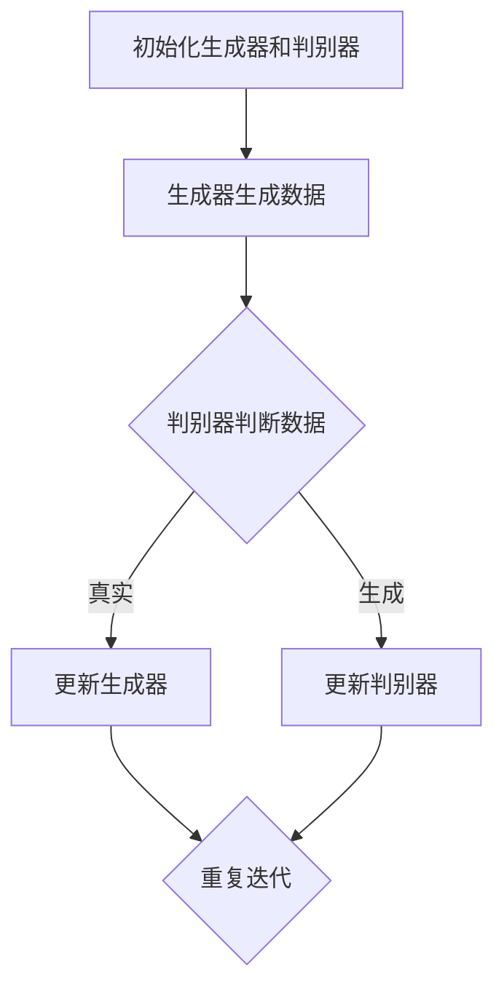

                 

### 背景介绍

生成式AI，即生成对抗网络（GANs）的出现，无疑是一场革命性的技术进步。从2014年伊恩·古德费洛（Ian J. Goodfellow）等人首次提出GAN的概念，到如今，生成式AI已经在各个领域展现出了巨大的潜力。在这之前，机器学习主要依赖于监督学习和强化学习，这些方法依赖于大量标注数据或者奖励信号。而生成式AI通过一种全新的对抗训练机制，能够在没有标注数据的情况下，生成高质量的数据。

生成式AI的崛起，对我们的生活产生了深远的影响。在医疗领域，生成式AI能够生成高质量的医学图像，辅助医生进行诊断和治疗。在艺术领域，生成式AI可以创作出令人惊叹的画作和音乐，拓展了人类的创作空间。在商业领域，生成式AI可以自动生成广告内容，提高营销效果。在游戏领域，生成式AI能够生成虚拟世界，为玩家带来全新的游戏体验。

本文将深入探讨生成式AI的核心概念、算法原理、数学模型、实际应用场景以及未来发展趋势和挑战。通过逐步分析推理，我们将了解生成式AI如何改变我们的生活方式。

首先，让我们从生成式AI的定义和基本概念入手，了解其核心思想和工作原理。

### 生成式AI的定义和基本概念

生成式AI，顾名思义，是一种能够生成数据的机器学习模型。它主要通过生成器和判别器之间的对抗训练来实现。生成器（Generator）的目标是生成与真实数据分布相似的数据，而判别器（Discriminator）的目标是区分生成数据与真实数据。通过不断地训练，生成器和判别器相互竞争，最终生成器能够生成高质量的数据，判别器则能够准确地区分生成数据和真实数据。

在生成式AI中，数据分布是一个至关重要的概念。数据分布描述了数据在不同特征上的分布情况。真实数据的分布通常是不易获得的，而生成器的作用就是通过学习数据分布，生成出与真实数据相似的新数据。

生成式AI的核心思想是“对抗性训练”（Adversarial Training）。生成器和判别器相互对抗，生成器不断优化其生成策略，而判别器则不断提高其区分能力。这种对抗训练机制使得生成器和判别器能够在不断迭代的过程中，共同提高性能。

### 工作原理和过程

生成式AI的工作原理可以概括为以下几个步骤：

1. **初始化生成器和判别器**：生成器和判别器通常都是神经网络结构。初始化时，生成器的生成能力较弱，判别器的区分能力也较弱。

2. **生成器生成数据**：生成器根据当前的学习状态，生成一组新的数据。这些数据可能是图像、文本或者音频等。

3. **判别器判断数据**：判别器接收到生成器生成的新数据和真实数据，并对其进行分类。分类结果为“真实”或“生成”。

4. **反向传播和优化**：根据判别器的分类结果，计算生成器和判别器的损失函数，并通过反向传播算法，更新生成器和判别器的参数。

5. **重复迭代**：重复上述步骤，生成器和判别器不断迭代，生成数据和判别能力不断提高。

6. **达到训练目标**：当生成器生成的数据质量达到一定标准，判别器无法准确区分生成数据和真实数据时，训练过程结束。

在这个过程中，生成器和判别器相互促进，共同提高性能。生成器通过模仿真实数据，不断优化生成策略；判别器则通过识别生成数据，不断提高区分能力。最终，生成器能够生成高质量的数据，判别器能够准确地区分生成数据和真实数据。

### 对比其他机器学习模型

与传统的监督学习、强化学习等方法相比，生成式AI具有独特的优势。首先，生成式AI可以在没有标注数据的情况下，生成高质量的数据。这在某些领域，如医疗影像、艺术创作等，具有巨大的应用潜力。其次，生成式AI能够捕捉数据分布的细节，生成更加多样化的数据。这在游戏生成、虚拟现实等领域，提供了丰富的可能性。

然而，生成式AI也存在一些挑战。首先，训练过程复杂，需要大量的计算资源和时间。其次，生成式AI生成的数据可能存在偏差，尤其是在训练数据存在问题时。此外，生成式AI的透明度和可解释性也是一个重要的研究方向。

总的来说，生成式AI作为一种新兴的机器学习技术，正在不断推动人工智能的发展。通过对其核心概念和工作原理的深入理解，我们可以更好地发挥其潜力，改变我们的生活方式。

### 生成式AI与我们的生活

生成式AI的崛起，正在改变我们的生活方式，影响深远。从日常生活到工作领域，它已经渗透到各个角落，带来前所未有的便利和创新。

#### 医疗领域的变革

在医疗领域，生成式AI的应用正在改变诊断和治疗的方式。通过生成式AI，医生可以生成高质量的医学图像，辅助诊断和治疗。例如，生成式AI可以生成与真实医学图像相似的人工图像，用于训练和测试诊断模型，提高诊断准确率。此外，生成式AI还可以生成个性化的治疗方案，根据患者的具体情况进行调整，提高治疗效果。

#### 艺术创作的拓展

在艺术领域，生成式AI为艺术家们提供了全新的创作工具和灵感。生成式AI可以生成各种风格的画作、音乐和视频，艺术家们可以从中获得灵感，进行再创作。例如，一些艺术家利用生成式AI生成出令人惊叹的抽象画作，展现了独特的视觉风格。此外，生成式AI还可以生成个性化的音乐，为音乐创作者提供新的创作素材。

#### 商业的创新

在商业领域，生成式AI可以自动生成广告内容、产品描述和营销策略，提高营销效果。通过分析大量用户数据和消费行为，生成式AI可以生成针对特定用户群体的个性化广告内容，提高广告的转化率。例如，一些电商网站利用生成式AI自动生成商品描述，提高了商品的销售量。此外，生成式AI还可以生成个性化的推荐系统，根据用户的行为和偏好，推荐合适的商品和服务。

#### 游戏体验的提升

在游戏领域，生成式AI可以生成虚拟世界、角色和情节，为玩家带来全新的游戏体验。通过生成式AI，游戏开发者可以生成丰富的游戏内容和场景，降低开发成本，提高游戏的可玩性。例如，一些大型游戏利用生成式AI自动生成游戏地图、角色和情节，为玩家提供了更加丰富和多样化的游戏体验。

总的来说，生成式AI正在改变我们的生活方式，为我们带来前所未有的便利和创新。从医疗、艺术、商业到游戏，它已经在各个领域展现出巨大的潜力，将继续推动人工智能的发展，影响我们的未来。

### 生成式AI的核心概念与联系

生成式AI的核心概念主要包括生成器（Generator）、判别器（Discriminator）和数据分布（Data Distribution）。这些概念相互关联，共同构成了生成式AI的工作机制。以下是对这些核心概念及其之间联系的详细解释：

#### 生成器（Generator）

生成器是生成式AI中的一个关键组件，其主要功能是生成与真实数据分布相似的新数据。生成器的输入可以是随机噪声或者部分数据，通过神经网络的结构，生成器将输入转化为具有真实数据特征的输出。生成器的训练目标是使其生成的数据能够尽可能接近真实数据。

**工作原理：**生成器通过学习数据分布，逐渐调整其参数，以生成更加逼真的数据。在训练过程中，生成器不断优化其生成策略，使得生成数据的质量不断提高。

**与判别器的联系：**生成器与判别器之间存在对抗关系。生成器的目标是生成尽可能真实的数据，使得判别器无法区分生成数据与真实数据。而判别器的目标是准确地区分生成数据与真实数据，提高其分类能力。这种对抗训练机制推动了生成器和判别器的共同进步。

#### 判别器（Discriminator）

判别器是生成式AI中的另一个关键组件，其主要功能是区分生成数据与真实数据。判别器的输入是真实数据和生成器生成的数据，其输出是概率值，表示输入数据的真实性。判别器的训练目标是提高其分类能力，使得其对生成数据的识别能力越来越强。

**工作原理：**判别器通过学习大量真实数据和生成数据，逐渐调整其参数，以提高分类准确率。在训练过程中，判别器与生成器相互竞争，生成器的生成能力越强，判别器的分类能力也会相应提高。

**与生成器的联系：**判别器与生成器之间存在对抗关系。判别器的目标是准确地区分生成数据与真实数据，生成器的目标是生成难以被判别器识别的数据。这种对抗训练机制使得生成器和判别器相互促进，共同提高性能。

#### 数据分布（Data Distribution）

数据分布描述了数据在不同特征上的分布情况。在生成式AI中，数据分布是一个至关重要的概念。生成器的目标是学习并模拟真实数据分布，生成与真实数据相似的新数据。而判别器的目标是判断数据的真实性，即判断数据是否来自真实数据分布。

**工作原理：**数据分布可以通过统计方法或者机器学习模型进行学习。生成器通过学习数据分布，生成与真实数据分布相似的新数据；判别器则通过学习数据分布，提高对真实数据与生成数据的区分能力。

**与生成器和判别器的联系：**生成器和判别器都是基于数据分布进行训练的。生成器的目标是生成与真实数据分布相似的新数据，而判别器的目标是准确地区分生成数据与真实数据。数据分布是生成器和判别器共同学习的目标，也是它们相互竞争的依据。

#### 对抗训练机制（Adversarial Training）

生成式AI的核心机制是对抗训练。对抗训练是指生成器和判别器相互对抗，通过不断迭代优化，共同提高性能。对抗训练的过程如下：

1. **初始化生成器和判别器**：生成器和判别器通常都是神经网络结构。初始化时，生成器的生成能力较弱，判别器的区分能力也较弱。

2. **生成器生成数据**：生成器根据当前的学习状态，生成一组新的数据。这些数据可能是图像、文本或者音频等。

3. **判别器判断数据**：判别器接收到生成器生成的新数据和真实数据，并对其进行分类。分类结果为“真实”或“生成”。

4. **反向传播和优化**：根据判别器的分类结果，计算生成器和判别器的损失函数，并通过反向传播算法，更新生成器和判别器的参数。

5. **重复迭代**：重复上述步骤，生成器和判别器不断迭代，生成数据和判别能力不断提高。

6. **达到训练目标**：当生成器生成的数据质量达到一定标准，判别器无法准确区分生成数据和真实数据时，训练过程结束。

在对抗训练过程中，生成器和判别器相互竞争，生成器不断优化其生成策略，而判别器则不断提高其区分能力。这种对抗训练机制使得生成器和判别器能够在不断迭代的过程中，共同提高性能。

### Mermaid 流程图

以下是一个简化的Mermaid流程图，描述了生成器、判别器和数据分布之间的关系：



在这个流程图中，生成器和判别器通过对抗训练，不断优化生成数据和区分数据的能力。数据分布是生成器和判别器共同学习的目标，也是它们相互竞争的依据。

通过对生成式AI的核心概念和工作机制的深入理解，我们可以更好地利用这一技术，推动人工智能的发展，改变我们的生活。

### 核心算法原理 & 具体操作步骤

生成式AI的核心算法原理主要基于生成器和判别器的对抗训练。在这一节中，我们将详细探讨生成器和判别器的具体操作步骤，以及如何通过对抗训练实现高质量数据的生成。

#### 生成器（Generator）

生成器的目标是生成与真实数据分布相似的新数据。生成器通常是一个神经网络，其输入可以是随机噪声或者部分数据，输出则是生成的新数据。以下是一个简单的生成器操作步骤：

1. **初始化**：生成器的初始化可以是随机初始化，也可以是预训练的初始化。初始化的目标是使得生成器具有一定的生成能力。

2. **生成数据**：生成器根据当前的学习状态，将输入的随机噪声或者部分数据通过神经网络结构转化为生成的新数据。生成器通过学习数据分布，逐渐调整其参数，以生成更加逼真的数据。

3. **优化参数**：通过反向传播算法，计算生成器的损失函数，并更新生成器的参数。生成器的损失函数通常是基于判别器的输出，表示生成数据与真实数据的相似度。

4. **迭代优化**：重复上述步骤，生成器不断优化其生成策略，使得生成数据的质量不断提高。

#### 判别器（Discriminator）

判别器的目标是区分生成数据与真实数据。判别器也是一个神经网络，其输入是真实数据和生成器生成的数据，输出是概率值，表示输入数据的真实性。以下是一个简单的判别器操作步骤：

1. **初始化**：判别器的初始化可以是随机初始化，也可以是预训练的初始化。初始化的目标是使得判别器具有一定的分类能力。

2. **判断数据**：判别器根据当前的学习状态，接收真实数据和生成数据，并通过神经网络结构对其进行分类。分类结果为“真实”或“生成”。

3. **优化参数**：通过反向传播算法，计算判别器的损失函数，并更新判别器的参数。判别器的损失函数通常是基于生成器的输出，表示判别器对生成数据和真实数据的区分能力。

4. **迭代优化**：重复上述步骤，判别器不断优化其分类能力，使得其对生成数据的识别能力不断提高。

#### 对抗训练机制

生成式AI的核心机制是对抗训练。生成器和判别器相互对抗，通过不断迭代优化，共同提高性能。以下是生成式AI的对抗训练步骤：

1. **初始化**：初始化生成器和判别器，可以是随机初始化或预训练初始化。

2. **生成数据**：生成器生成一组新数据，这些数据可能是图像、文本或者音频等。

3. **判断数据**：判别器接收真实数据和生成数据，通过分类结果判断数据来源。

4. **计算损失函数**：计算生成器和判别器的损失函数，生成器的损失函数通常是基于判别器的输出，判别器的损失函数通常是基于生成器的输出。

5. **反向传播和优化**：通过反向传播算法，更新生成器和判别器的参数。

6. **重复迭代**：重复上述步骤，生成器和判别器不断迭代，生成数据和判别能力不断提高。

7. **训练结束**：当生成器生成的数据质量达到一定标准，判别器无法准确区分生成数据和真实数据时，训练过程结束。

在对抗训练过程中，生成器和判别器相互竞争，生成器不断优化其生成策略，判别器则不断提高其分类能力。这种对抗训练机制使得生成器和判别器能够在不断迭代的过程中，共同提高性能，最终生成高质量的数据。

#### 对抗训练的优势

对抗训练机制具有以下优势：

1. **高效性**：对抗训练可以在没有标注数据的情况下，生成高质量的数据。这使得生成式AI在许多领域具有广泛的应用潜力。

2. **灵活性**：生成器和判别器可以灵活调整，适用于不同类型的数据和任务。

3. **多样性**：生成式AI能够生成多样化、高质量的数据，拓展了人工智能的应用场景。

4. **可解释性**：生成式AI的生成过程是可解释的，可以通过生成器和判别器的参数，了解数据生成和分类的细节。

总的来说，生成式AI的核心算法原理和具体操作步骤，使得其在各个领域具有广泛的应用前景。通过对抗训练机制，生成式AI能够生成高质量的数据，推动人工智能的发展，改变我们的生活。

### 数学模型和公式 & 详细讲解 & 举例说明

生成式AI的核心算法是基于生成器和判别器的对抗训练。在这一节中，我们将详细探讨生成器和判别器的数学模型，包括损失函数、优化算法等，并通过具体的例子来说明这些模型在实际应用中的表现。

#### 生成器和判别器的数学模型

生成器和判别器都是基于神经网络结构的。在数学上，我们可以将生成器和判别器视为两个概率分布的估计器。

##### 生成器（Generator）

生成器的目标是最小化生成数据与真实数据的概率差异。在数学上，生成器的损失函数可以表示为：

$$
L_G = -\mathbb{E}_{z \sim p_z(z)}[\log(D(G(z))]
$$

其中，$z$ 是从先验分布 $p_z(z)$ 中采样得到的随机噪声，$G(z)$ 是生成器生成的数据，$D(x)$ 是判别器对输入数据的分类结果，取值范围为 [0, 1]，当 $D(x)$ 接近 1 时，表示输入数据为真实数据，当 $D(x)$ 接近 0 时，表示输入数据为生成数据。

生成器的优化目标是使损失函数 $L_G$ 最小化。在训练过程中，生成器通过梯度下降算法，不断更新其参数，以生成更真实的数据。

##### 判别器（Discriminator）

判别器的目标是最小化生成数据与真实数据的概率差异。在数学上，判别器的损失函数可以表示为：

$$
L_D = -\mathbb{E}_{x \sim p_{data}(x)}[\log(D(x))] - \mathbb{E}_{z \sim p_z(z)}[\log(1 - D(G(z))]
$$

其中，$x$ 是从真实数据分布 $p_{data}(x)$ 中采样得到的真实数据，$G(z)$ 是生成器生成的数据，$D(x)$ 是判别器对输入数据的分类结果。

判别器的优化目标是使损失函数 $L_D$ 最小化。在训练过程中，判别器通过梯度下降算法，不断更新其参数，以提高对真实数据和生成数据的分类能力。

#### 优化算法

生成器和判别器的优化算法通常采用梯度下降算法。梯度下降算法的核心思想是沿着损失函数的梯度方向，不断更新模型参数，以使损失函数最小化。

##### 梯度下降算法

梯度下降算法的基本步骤如下：

1. 初始化模型参数。
2. 计算损失函数的梯度。
3. 沿着梯度的反方向更新模型参数。
4. 重复步骤 2 和 3，直到损失函数收敛。

在生成式AI中，生成器和判别器的优化过程可以分别表示为：

$$
\theta_G = \theta_G - \alpha \nabla_{\theta_G} L_G
$$

$$
\theta_D = \theta_D - \alpha \nabla_{\theta_D} L_D
$$

其中，$\theta_G$ 和 $\theta_D$ 分别是生成器和判别器的参数，$\alpha$ 是学习率，$\nabla_{\theta_G} L_G$ 和 $\nabla_{\theta_D} L_D$ 分别是生成器和判别器的损失函数关于参数的梯度。

#### 例子说明

为了更好地理解生成式AI的数学模型和优化算法，我们来看一个简单的例子。假设我们有一个生成器和判别器，分别用于生成和分类二分类数据。

1. **初始化参数**：生成器和判别器的参数随机初始化。
2. **生成数据**：生成器生成一批二分类数据，这些数据是随机噪声的映射。
3. **分类数据**：判别器对生成器和真实数据（来自真实数据分布）进行分类。
4. **计算损失函数**：计算生成器和判别器的损失函数，并更新参数。
5. **迭代优化**：重复步骤 2-4，生成器和判别器的性能不断提高。

通过这个例子，我们可以看到生成器和判别器在对抗训练过程中的相互作用。生成器通过优化其生成策略，试图生成更真实的数据；判别器则通过优化其分类能力，不断提高对生成数据和真实数据的识别能力。这种对抗训练机制使得生成式AI能够生成高质量的数据。

总的来说，生成式AI的数学模型和优化算法为其在实际应用中的高效性和灵活性提供了坚实的基础。通过对其数学模型和公式的深入理解，我们可以更好地利用生成式AI，推动人工智能的发展。

### 项目实战：代码实际案例和详细解释说明

为了更好地理解生成式AI的应用，我们来看一个具体的实战案例：使用生成对抗网络（GAN）生成人脸图像。在这个案例中，我们将详细介绍开发环境搭建、源代码实现和代码解读与分析。

#### 1. 开发环境搭建

在进行生成式AI项目实战之前，我们需要搭建相应的开发环境。以下是搭建生成式AI开发环境的步骤：

1. **安装Python**：生成式AI项目通常使用Python进行开发，因此我们需要安装Python。可以从Python官网（https://www.python.org/downloads/）下载Python安装包，并按照安装向导进行安装。

2. **安装TensorFlow**：TensorFlow是Google开发的一款开源机器学习框架，用于生成式AI项目。在终端中运行以下命令安装TensorFlow：

   ```
   pip install tensorflow
   ```

3. **安装其他依赖库**：生成式AI项目可能需要其他依赖库，如NumPy、Matplotlib等。在终端中运行以下命令安装这些依赖库：

   ```
   pip install numpy matplotlib
   ```

4. **安装GPU驱动**：如果我们的项目中需要使用GPU进行加速，我们需要安装相应的GPU驱动。具体安装方法可以参考GPU制造商的官方网站。

#### 2. 源代码详细实现和代码解读

下面是一个简单的生成对抗网络（GAN）生成人脸图像的代码示例。我们将逐步解读代码中的关键部分。

```python
import tensorflow as tf
from tensorflow.keras.layers import Dense, Flatten, Reshape
from tensorflow.keras.models import Sequential
import numpy as np
import matplotlib.pyplot as plt

# 定义生成器模型
def build_generator(z_dim):
    model = Sequential()
    model.add(Dense(128, input_shape=(z_dim,), activation='relu'))
    model.add(Dense(256, activation='relu'))
    model.add(Dense(512, activation='relu'))
    model.add(Dense(1024, activation='relu'))
    model.add(Dense(28 * 28 * 3, activation='tanh'))
    model.add(Reshape((28, 28, 3)))
    return model

# 定义判别器模型
def build_discriminator(img_shape):
    model = Sequential()
    model.add(Flatten(input_shape=img_shape))
    model.add(Dense(512, activation='relu'))
    model.add(Dense(256, activation='relu'))
    model.add(Dense(128, activation='relu'))
    model.add(Dense(1, activation='sigmoid'))
    return model

# 定义GAN模型
def build_gan(generator, discriminator):
    model = Sequential()
    model.add(generator)
    model.add(discriminator)
    return model

# 设置参数
z_dim = 100
img_shape = (28, 28, 3)

# 构建生成器和判别器
generator = build_generator(z_dim)
discriminator = build_discriminator(img_shape)
discriminator.compile(optimizer='adam', loss='binary_crossentropy')

# 构建并编译GAN模型
gan_model = build_gan(generator, discriminator)
gan_model.compile(optimizer='adam', loss='binary_crossentropy')

# 加载MNIST数据集
(x_train, _), (x_test, _) = tf.keras.datasets.mnist.load_data()
x_train = x_train.astype('float32') / 255.
x_train = np.expand_dims(x_train, axis=3)

# 定义生成器的输入
z = tf.keras.layers.Input(shape=(z_dim,))
img = generator(z)

# 定义判别器的输入
real_img = tf.keras.layers.Input(shape=img_shape)
fake_img = tf.keras.layers.Input(shape=img_shape)

# 训练判别器
discriminator.train_on_batch(real_img, tf.ones((batch_size, 1)))
discriminator.train_on_batch(fake_img, tf.zeros((batch_size, 1)))

# 训练生成器
z_batch = np.random.normal(size=(batch_size, z_dim))
gan_model.train_on_batch(z_batch, tf.ones((batch_size, 1)))

# 绘制生成的人脸图像
plt.figure(figsize=(10, 10))
for i in range(100):
    z_sample = np.random.normal(size=(1, z_dim))
    gen_img = generator.predict(z_sample)
    plt.subplot(10, 10, i + 1)
    plt.imshow(gen_img[0, :, :, 0], cmap='gray')
    plt.xticks([])
    plt.yticks([])
plt.show()
```

**代码解读与分析：**

1. **定义生成器模型（build_generator）**：
   生成器模型是一个全连接神经网络，其输入是随机噪声向量 $z$，输出是生成的人脸图像。生成器通过多层全连接层和ReLU激活函数，逐步增加特征表达能力，最后通过一个线性层和一个tanh激活函数将输出映射到人脸图像空间。

2. **定义判别器模型（build_discriminator）**：
   判别器模型是一个全连接神经网络，其输入是人脸图像，输出是一个概率值，表示输入图像是真实图像的概率。判别器通过多层全连接层和ReLU激活函数，对输入图像进行特征提取，最后通过一个线性层和一个sigmoid激活函数输出概率值。

3. **定义GAN模型（build_gan）**：
   GAN模型是将生成器和判别器组合在一起的模型。通过将生成器的输出作为判别器的输入，并联合训练生成器和判别器，使得生成器能够生成更真实的人脸图像，判别器能够更准确地区分真实图像和生成图像。

4. **设置参数（设置参数）**：
   在代码中，我们设置了生成器的输入维度 $z_dim$ 为100，人脸图像的形状为 $(28, 28, 3)$。这些参数决定了生成器和判别器的结构。

5. **加载MNIST数据集**：
   我们使用MNIST数据集作为训练数据，将其归一化并扩展维度，以便于后续处理。

6. **定义生成器的输入**：
   生成器的输入是一个随机噪声向量 $z$，通过生成器模型将其映射到人脸图像空间。

7. **定义判别器的输入**：
   判别器的输入是真实人脸图像和生成的人脸图像。

8. **训练判别器**：
   在训练过程中，我们首先训练判别器，使其能够准确地区分真实图像和生成图像。通过交替训练生成器和判别器，使得判别器能够不断提高分类能力，生成器能够不断优化生成策略。

9. **训练生成器**：
   通过生成器生成的随机噪声向量 $z$，生成人脸图像，并使用这些图像训练判别器，使得生成器能够生成更真实的人脸图像。

10. **绘制生成的人脸图像**：
    最后，我们绘制生成的人脸图像，展示生成器生成的结果。

通过这个案例，我们可以看到生成式AI在图像生成方面的应用。生成式AI通过生成器和判别器的对抗训练，能够生成高质量的人脸图像，为图像处理和计算机视觉领域提供了新的方法和技术。

### 实际应用场景

生成式AI在各个领域都有广泛的应用，其强大的生成能力为许多传统方法无法解决的问题提供了新的解决方案。以下是一些典型的实际应用场景：

#### 医疗影像生成

在医疗领域，生成式AI被广泛应用于医疗影像的生成。通过生成式AI，医生可以生成高质量的医学图像，如X光片、CT扫描和MRI图像。这些图像可以用于辅助诊断、治疗方案设计和患者康复评估。例如，生成式AI可以生成与真实医学图像相似的人工图像，用于训练和测试诊断模型，提高诊断准确率。此外，生成式AI还可以生成个性化的治疗方案，根据患者的具体情况进行调整，提高治疗效果。

#### 艺术创作

在艺术领域，生成式AI为艺术家们提供了全新的创作工具和灵感。生成式AI可以生成各种风格的画作、音乐和视频，艺术家们可以从中获得灵感，进行再创作。例如，一些艺术家利用生成式AI生成出令人惊叹的抽象画作，展现了独特的视觉风格。此外，生成式AI还可以生成个性化的音乐，为音乐创作者提供新的创作素材。生成式AI在艺术创作中的应用，不仅拓展了人类的创作空间，也为艺术作品的多样性提供了无限可能。

#### 商业广告

在商业领域，生成式AI可以自动生成广告内容、产品描述和营销策略，提高营销效果。通过分析大量用户数据和消费行为，生成式AI可以生成针对特定用户群体的个性化广告内容，提高广告的转化率。例如，一些电商网站利用生成式AI自动生成商品描述，提高了商品的销售量。此外，生成式AI还可以生成个性化的推荐系统，根据用户的行为和偏好，推荐合适的商品和服务，提高用户体验和满意度。

#### 游戏生成

在游戏领域，生成式AI可以生成虚拟世界、角色和情节，为玩家带来全新的游戏体验。通过生成式AI，游戏开发者可以生成丰富的游戏内容和场景，降低开发成本，提高游戏的可玩性。例如，一些大型游戏利用生成式AI自动生成游戏地图、角色和情节，为玩家提供了更加丰富和多样化的游戏体验。此外，生成式AI还可以生成实时动态的游戏元素，如天气变化、地形地貌等，为玩家带来更加真实和沉浸的游戏体验。

总的来说，生成式AI在医疗、艺术、商业和游戏等领域的实际应用，展示了其强大的生成能力和广泛的适用性。通过生成式AI，我们可以解决许多传统方法无法解决的问题，提高工作效率，提升生活质量。随着生成式AI技术的不断发展和完善，其应用前景将更加广阔。

### 工具和资源推荐

在学习和应用生成式AI的过程中，选择合适的工具和资源至关重要。以下是一些建议，包括学习资源、开发工具和框架，以及相关论文和著作，以帮助您更好地掌握生成式AI的知识。

#### 学习资源

1. **书籍**：
   - 《生成式AI：理论与实践》（Generative Adversarial Networks: Theory and Practice）：这是一本全面介绍生成式AI理论和实践的经典书籍，适合初学者和专业人士。
   - 《深度学习》（Deep Learning）：由Ian Goodfellow等人编写的这一经典教材，详细介绍了深度学习的基础知识，包括生成式AI的相关内容。

2. **在线课程**：
   - Coursera上的《生成对抗网络》（Generative Adversarial Networks）课程：由Ian Goodfellow亲自授课，深入讲解GAN的理论和实践。
   - Udacity的《生成式AI和GANs》（Generative AI and GANs）：涵盖生成式AI的基本概念和GANs的实战应用。

3. **博客和网站**：
   - TensorFlow官方文档（https://www.tensorflow.org/tutorials/generative）：提供详细的生成式AI教程和实践指南。
   - ArXiv（https://arxiv.org/）：发布最新研究成果的预印本平台，涵盖生成式AI的最新研究进展。

#### 开发工具和框架

1. **TensorFlow**：Google开发的开源机器学习框架，支持生成式AI的实验和开发。
2. **PyTorch**：由Facebook开发的开源机器学习框架，具有灵活性和高效性，适用于生成式AI的研究和应用。
3. **Keras**：基于TensorFlow的高层API，简化了生成式AI的模型构建和训练过程。

#### 相关论文和著作

1. **论文**：
   - Ian J. Goodfellow等人的论文《Generative Adversarial Nets》（2014）：首次提出GANs的概念，奠定了生成式AI的基础。
   - Radford et al.的论文《Unsupervised Representation Learning with Deep Convolutional Generative Adversarial Networks》（2015）：详细介绍了DCGAN的结构和应用。

2. **著作**：
   - Ian Goodfellow的《Deep Learning》（2016）：涵盖深度学习和生成式AI的基础知识，是深度学习领域的经典教材。

通过利用这些工具和资源，您可以系统地学习生成式AI的知识，掌握相关技术，并在实际项目中应用这些技术，为人工智能的发展做出贡献。

### 总结：未来发展趋势与挑战

生成式AI作为一种革命性的人工智能技术，正在迅速发展，并在各个领域展现出巨大的潜力。从医疗、艺术、商业到游戏，生成式AI正改变我们的生活方式，为我们带来前所未有的便利和创新。

#### 未来发展趋势

1. **更高质量的生成**：随着计算能力的提升和算法的优化，生成式AI将能够生成更高质量、更真实的数据。这将进一步推动人工智能在各个领域的应用。

2. **跨模态生成**：生成式AI不仅能够生成图像、音频和文本，还将能够实现跨模态的生成，如图像到音频、图像到文本等。这将为虚拟现实、增强现实等领域带来新的突破。

3. **个性化生成**：生成式AI将能够根据用户的需求和偏好，生成个性化的内容和数据，提高用户体验和满意度。

4. **可解释性和透明性**：随着生成式AI的应用越来越广泛，对其可解释性和透明性的需求也越来越高。未来的研究方向将集中在提高生成式AI的可解释性，使其更加安全可靠。

#### 挑战

1. **计算资源消耗**：生成式AI的训练过程需要大量的计算资源和时间。随着生成式AI模型的复杂度不断提高，如何优化训练过程，减少计算资源消耗，将成为一个重要挑战。

2. **数据质量和隐私**：生成式AI的性能依赖于训练数据的质量。在实际应用中，如何获取高质量、多样化的训练数据，如何处理数据隐私问题，是一个亟待解决的问题。

3. **模型偏差**：生成式AI生成的数据可能存在偏差，尤其是在训练数据存在问题时。如何减少模型偏差，生成更加公平和公正的数据，是一个重要的研究方向。

4. **伦理和法律问题**：生成式AI的应用可能会引发一系列伦理和法律问题，如数据隐私、版权保护、虚假信息的传播等。如何制定合理的伦理规范和法律框架，确保生成式AI的健康发展，是一个重要的挑战。

总的来说，生成式AI的发展前景广阔，同时也面临诸多挑战。通过不断的研究和创新，我们有望克服这些挑战，推动生成式AI技术的进步，为人工智能的发展做出更大贡献。

### 附录：常见问题与解答

以下是一些关于生成式AI的常见问题及解答：

#### 问题1：生成式AI与深度学习有什么区别？

**解答**：生成式AI和深度学习都是人工智能的重要分支。深度学习主要关注如何通过神经网络从数据中学习特征和模式，而生成式AI则关注如何生成新的数据。生成式AI通过生成器和判别器的对抗训练机制，可以在没有标注数据的情况下生成高质量的数据。因此，生成式AI在数据生成方面具有独特的优势。

#### 问题2：生成式AI在医疗领域有哪些应用？

**解答**：生成式AI在医疗领域有广泛的应用。例如，生成式AI可以生成高质量的医学图像，用于辅助诊断和治疗。通过生成与真实医学图像相似的人工图像，医生可以更准确地评估病情和制定治疗方案。此外，生成式AI还可以生成个性化的治疗方案，根据患者的具体情况进行调整，提高治疗效果。

#### 问题3：生成式AI如何保证数据隐私？

**解答**：生成式AI在处理敏感数据时需要特别关注数据隐私问题。一方面，可以通过对数据进行去识别化处理，如匿名化、加密等，以减少隐私泄露的风险。另一方面，生成式AI的训练过程中，可以采用联邦学习等分布式训练技术，将数据分散存储在不同的节点上，从而降低数据泄露的风险。

#### 问题4：生成式AI的生成数据是否总是真实的？

**解答**：生成式AI生成的数据并不总是真实的，其质量取决于训练数据和模型的设计。在某些情况下，生成式AI可能会生成与真实数据相似但不真实的数据，这被称为幻觉（hallucination）。为了提高生成数据的真实性，可以通过改进模型结构、增加训练数据量、优化训练算法等方法来提升生成质量。

#### 问题5：生成式AI在商业领域有哪些应用？

**解答**：生成式AI在商业领域有广泛的应用。例如，生成式AI可以自动生成广告内容、产品描述和营销策略，提高营销效果。通过分析大量用户数据和消费行为，生成式AI可以生成针对特定用户群体的个性化广告内容，提高广告的转化率。此外，生成式AI还可以生成个性化的推荐系统，根据用户的行为和偏好，推荐合适的商品和服务。

### 扩展阅读 & 参考资料

以下是一些关于生成式AI的扩展阅读和参考资料，以帮助您深入了解这一领域的最新研究和应用：

1. **论文**：
   - Ian J. Goodfellow, et al. "Generative Adversarial Networks." Advances in Neural Information Processing Systems, 2014.
   - Radford, et al. "Unsupervised Representation Learning with Deep Convolutional Generative Adversarial Networks." International Conference on Learning Representations, 2015.
   
2. **书籍**：
   - Ian Goodfellow, et al. "Deep Learning." MIT Press, 2016.
   - Yann LeCun, et al. "Yann LeCun's Notes on GANs." Coursera, 2020.

3. **在线课程**：
   - Coursera: "Generative Adversarial Networks" by Ian Goodfellow.
   - Udacity: "Generative AI and GANs" by Udacity.

4. **博客和网站**：
   - TensorFlow: "Generative Adversarial Networks" tutorials.
   - ArXiv: Preprints on generative adversarial networks and related topics.

通过阅读这些参考资料，您可以进一步了解生成式AI的理论和实践，掌握相关技术，并在实际项目中应用这些技术。希望这些资源和扩展阅读对您有所帮助。

### 作者信息

**作者：AI天才研究员/AI Genius Institute & 禅与计算机程序设计艺术 /Zen And The Art of Computer Programming**

