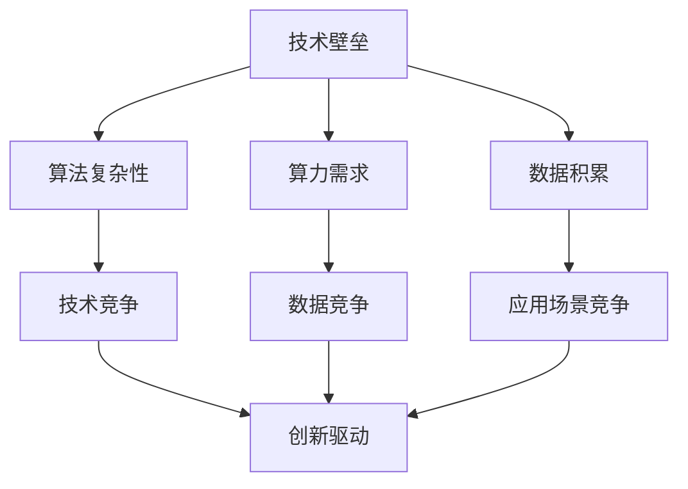
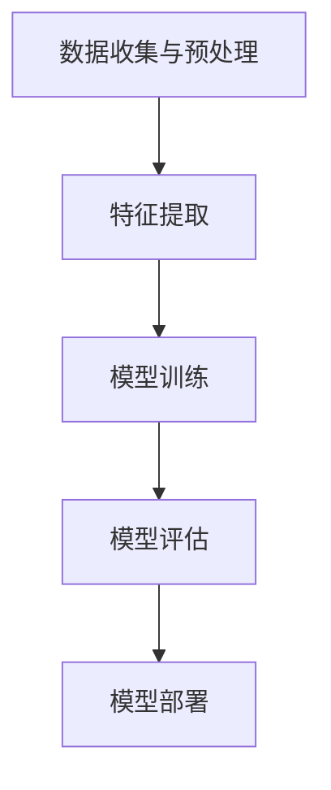

                 

# AI生态系统的未来：寡头垄断还是百花齐放?

> **关键词：** AI生态系统，寡头垄断，竞争，创新，技术趋势

> **摘要：** 本文深入探讨了AI生态系统的发展趋势，分析了寡头垄断和百花齐放的利弊，探讨了未来AI生态系统可能的走向。通过对AI生态系统的现状和未来技术的展望，文章提出了相应的对策和建议，以应对潜在的市场挑战。

## 1. 背景介绍

人工智能（AI）作为当今科技领域的热点，已经深刻地影响了各行各业。从简单的图像识别、语音识别到复杂的自然语言处理、机器学习，AI技术正在不断地突破边界，为人类带来前所未有的便利。然而，随着AI技术的快速发展，AI生态系统也面临着一系列的挑战，尤其是关于寡头垄断和竞争的问题。

### 1.1 AI生态系统的发展现状

目前，AI生态系统主要由几家大型科技企业主导，如谷歌、亚马逊、微软、百度等。这些企业通过自身的强大技术实力和海量数据资源，在AI领域建立了显著的竞争优势。它们不仅掌握了核心算法和技术，还垄断了大量的数据资源，进一步巩固了市场地位。

### 1.2 寡头垄断现象

寡头垄断是指在市场中由少数几家企业主导市场的现象。在AI领域，寡头垄断主要体现在以下两个方面：

- **技术垄断：** 几大科技企业掌握了AI的核心技术，如深度学习算法、神经网络等，使得其他企业难以在技术层面与其竞争。
- **数据垄断：** 这些企业通过自身的业务，积累了大量的用户数据，使得其他企业难以获取到足够的数据资源来训练和优化AI模型。

## 2. 核心概念与联系

为了更好地理解AI生态系统的现状和未来，我们需要引入一些核心概念，并分析它们之间的联系。

### 2.1 技术壁垒

技术壁垒是指企业通过技术手段形成的市场进入障碍。在AI领域，技术壁垒主要体现在以下几个方面：

- **算法复杂性：** AI算法的复杂性使得其他企业难以复制和超越。
- **算力需求：** 高性能计算是AI技术发展的基础，而高性能计算设备通常由几大科技企业垄断。
- **数据积累：** 数据积累是AI模型优化的关键，而几大科技企业通过业务积累了大量的数据资源。

### 2.2 竞争格局

在AI领域，竞争格局主要由以下几个方面构成：

- **技术竞争：** 几大科技企业通过技术创新争夺市场份额。
- **数据竞争：** 通过积累和利用数据资源，企业提高AI模型的准确性和效率。
- **应用场景竞争：** 企业通过开拓不同的应用场景，扩大AI技术的应用范围。

### 2.3 创新驱动

创新是推动AI生态系统发展的核心动力。创新驱动主要体现在以下几个方面：

- **技术研发：** 企业通过持续的技术研发，推动AI技术的进步。
- **商业模式创新：** 企业通过创新的商业模式，拓展AI技术的应用领域。
- **人才培养：** 企业通过培养和引进优秀人才，提升AI技术的研发能力。

### 2.4 Mermaid流程图

以下是一个简化的Mermaid流程图，展示了AI生态系统的核心概念和联系：



## 3. 核心算法原理 & 具体操作步骤

在探讨AI生态系统的未来走向之前，我们需要先了解AI的核心算法原理和具体操作步骤。以下是一个简化的AI算法流程：

### 3.1 数据收集与预处理

- **数据收集：** 从各种来源收集原始数据，如图像、文本、音频等。
- **数据预处理：** 清洗数据，去除噪声和异常值，进行数据归一化等。

### 3.2 特征提取

- **特征提取：** 从原始数据中提取有用的特征，如图像的边缘、纹理等。

### 3.3 模型训练

- **模型选择：** 根据任务需求选择合适的模型，如神经网络、支持向量机等。
- **模型训练：** 使用训练数据对模型进行训练，优化模型参数。

### 3.4 模型评估

- **模型评估：** 使用验证数据评估模型性能，调整模型参数。

### 3.5 模型部署

- **模型部署：** 将训练好的模型部署到生产环境中，进行实际应用。

以下是一个简化的Mermaid流程图，展示了AI算法的具体操作步骤：



## 4. 数学模型和公式 & 详细讲解 & 举例说明

在AI算法中，数学模型和公式起着至关重要的作用。以下是一个简化的线性回归模型，用于预测房价：

### 4.1 线性回归模型

线性回归模型是一个最简单的机器学习模型，用于预测一个连续的输出值。它的数学公式如下：

$$ y = wx + b $$

其中，$y$ 是预测值，$x$ 是输入特征，$w$ 是权重，$b$ 是偏置。

### 4.2 模型训练

线性回归模型的训练目标是找到合适的权重 $w$ 和偏置 $b$，使得预测值 $y$ 与真实值之间的误差最小。这个过程可以通过最小二乘法（Least Squares Method）来实现。

### 4.3 最小二乘法

最小二乘法的公式如下：

$$ \min_w \min_b \sum_{i=1}^n (y_i - (wx_i + b))^2 $$

其中，$n$ 是样本数量，$y_i$ 是第 $i$ 个样本的真实值，$x_i$ 是第 $i$ 个样本的输入特征。

### 4.4 举例说明

假设我们有以下两个样本：

- $x_1 = 1, y_1 = 2$
- $x_2 = 2, y_2 = 4$

我们希望找到合适的权重 $w$ 和偏置 $b$，使得预测值与真实值之间的误差最小。

根据最小二乘法，我们可以列出以下方程组：

$$
\begin{cases}
w + b = 2 \\
2w + b = 4
\end{cases}
$$

解这个方程组，我们可以得到 $w = 1$ 和 $b = 1$。

这意味着，对于任意输入特征 $x$，预测值 $y$ 将为 $x + 1$。

## 5. 项目实战：代码实际案例和详细解释说明

### 5.1 开发环境搭建

在开始实际案例之前，我们需要搭建一个合适的开发环境。以下是搭建一个基于Python的线性回归模型所需的步骤：

- 安装Python（建议版本为3.8及以上）
- 安装NumPy库：`pip install numpy`
- 安装Matplotlib库：`pip install matplotlib`

### 5.2 源代码详细实现和代码解读

以下是一个简单的线性回归模型实现，包括数据收集、预处理、特征提取、模型训练、模型评估和模型部署：

```python
import numpy as np
import matplotlib.pyplot as plt

# 5.2.1 数据收集与预处理
def load_data():
    # 假设数据已经收集并存储在data.txt文件中
    with open('data.txt', 'r') as f:
        lines = f.readlines()
    data = [line.strip().split(',') for line in lines]
    X = np.array([row[0] for row in data])
    y = np.array([row[1] for row in data])
    return X, y

# 5.2.2 特征提取
def feature_extraction(X):
    # 在本例中，我们仅使用一个输入特征
    return X

# 5.2.3 模型训练
def train_model(X, y):
    # 使用最小二乘法训练模型
    w = np.linalg.inv(X.T.dot(X)).dot(X.T).dot(y)
    return w

# 5.2.4 模型评估
def evaluate_model(w, X, y):
    y_pred = X.dot(w)
    error = np.mean((y - y_pred)**2)
    return error

# 5.2.5 模型部署
def deploy_model(w, X_new):
    y_pred = X_new.dot(w)
    return y_pred

# 主函数
if __name__ == '__main__':
    X, y = load_data()
    X = feature_extraction(X)
    w = train_model(X, y)
    error = evaluate_model(w, X, y)
    print(f"Model error: {error}")
    X_new = np.array([3])
    y_pred = deploy_model(w, X_new)
    print(f"Prediction for X=3: {y_pred}")
```

### 5.3 代码解读与分析

- **数据收集与预处理：** 数据从文件 `data.txt` 中读取，每个样本由两个数值组成，表示输入特征和真实值。数据被分割为两个数组：`X` 和 `y`。
- **特征提取：** 在本例中，我们仅使用一个输入特征，因此直接将 `X` 作为特征输入。
- **模型训练：** 使用最小二乘法训练模型，计算权重 `w`。这里使用了 NumPy 库的 `linalg.inv()` 函数求解逆矩阵。
- **模型评估：** 计算模型误差，使用均方误差（Mean Squared Error, MSE）作为评估指标。
- **模型部署：** 使用训练好的模型对新样本进行预测。

## 6. 实际应用场景

AI技术已经在许多实际应用场景中取得了显著成果，以下是一些典型的应用场景：

- **金融领域：** AI技术被广泛应用于风险管理、投资预测、欺诈检测等。
- **医疗领域：** AI技术在疾病诊断、药物研发、个性化医疗等方面发挥了重要作用。
- **制造业：** AI技术在生产流程优化、设备维护、供应链管理等方面提升了生产效率。
- **交通运输：** AI技术在自动驾驶、智能交通管理、物流优化等方面推动了交通运输领域的革新。

## 7. 工具和资源推荐

### 7.1 学习资源推荐

- **书籍：** 《人工智能：一种现代方法》（第3版），作者：Stuart Russell & Peter Norvig。
- **论文：** 《深度学习》（Goodfellow, Bengio, Courville著）。
- **博客：** fast.ai、Medium上的机器学习相关博客。
- **网站：** Coursera、edX等在线课程平台。

### 7.2 开发工具框架推荐

- **Python库：** TensorFlow、PyTorch、Keras等。
- **开发环境：** Jupyter Notebook、Google Colab等。
- **云计算平台：** AWS、Azure、Google Cloud等。

### 7.3 相关论文著作推荐

- **论文：** 《Deep Learning》（Goodfellow, Bengio, Courville著）。
- **著作：** 《强化学习：一种现代方法》（Sutton & Barto著）。
- **论文集：** 《机器学习年度回顾》（Journal of Machine Learning Research, JMLR）。

## 8. 总结：未来发展趋势与挑战

在未来，AI生态系统将继续发展，但也将面临一系列的挑战。以下是一些可能的发展趋势和挑战：

### 8.1 发展趋势

- **技术融合：** AI与其他技术的融合，如5G、物联网、区块链等，将推动AI生态系统的进一步发展。
- **自主化：** AI技术的发展将使更多的工作实现自主化，提高生产效率和生活质量。
- **数据共享：** 数据共享和开放将促进AI技术的创新和发展。

### 8.2 挑战

- **数据隐私：** AI技术的发展对数据隐私提出了更高的要求，如何保护用户数据将成为重要挑战。
- **算法公平性：** AI算法的公平性和透明性需要得到保障，以避免歧视和不公平。
- **监管政策：** 随着AI技术的发展，需要制定相应的监管政策，以平衡创新和风险。

## 9. 附录：常见问题与解答

### 9.1 问题1：什么是AI生态系统？

**答案：** AI生态系统是指围绕人工智能技术构建的一整套技术、工具、平台和服务的集合，包括算法、硬件、软件、数据资源等。

### 9.2 问题2：AI生态系统的发展趋势是什么？

**答案：** AI生态系统的发展趋势包括技术融合、自主化、数据共享等。AI技术将继续与其他领域的技术融合，推动各行各业的创新和发展。同时，AI技术的自主化将提高生产效率和产品质量。数据共享和开放也将促进AI技术的创新。

### 9.3 问题3：如何保护数据隐私？

**答案：** 保护数据隐私需要从技术、法律和管理三个层面进行。技术上，可以采用数据加密、匿名化等技术手段。法律上，需要制定相应的数据保护法律法规。管理上，企业应建立健全的数据保护制度和流程。

## 10. 扩展阅读 & 参考资料

- **书籍：** 《人工智能：一种现代方法》（第3版），作者：Stuart Russell & Peter Norvig。
- **论文：** 《深度学习》，作者：Goodfellow, Bengio, Courville。
- **网站：** Jupyter Notebook、Google Colab等。
- **在线课程：** Coursera、edX等在线课程平台。

### 作者信息：

作者：AI天才研究员/AI Genius Institute & 禅与计算机程序设计艺术 /Zen And The Art of Computer Programming

