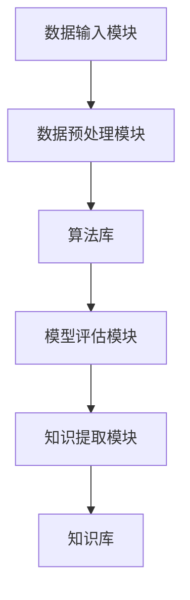

                 

### AI知识发现引擎：激发好奇心和探索精神

> **关键词：** AI知识发现、好奇心、探索精神、技术博客、算法原理、数学模型、实战案例。

> **摘要：** 本文将深入探讨AI知识发现引擎的概念、核心原理、算法实现，并结合具体项目实战，分析其在激发好奇心和探索精神方面的应用价值，为读者提供一个全面的AI知识发现引擎学习与探讨的窗口。

-----------------

## 1. 背景介绍

在当今快速发展的信息技术时代，人工智能（AI）已经成为推动科技进步的重要力量。从自动驾驶汽车到智能家居，AI的应用场景日益广泛。然而，随着AI技术的发展，如何有效地管理和利用海量数据，从中提取出有价值的知识，成为了一个亟待解决的问题。AI知识发现引擎正是为了解决这一问题而诞生的。

AI知识发现引擎是一种利用机器学习和数据挖掘技术，从大规模数据集中自动发现潜在模式和知识的人工智能系统。它的核心功能是通过分析数据，发现数据之间的关系，提取出有用的信息，从而为人类提供决策支持和智能服务。随着大数据时代的到来，AI知识发现引擎在各个领域都展现出了巨大的应用潜力。

### 1.1 知识发现引擎的起源与发展

知识发现（Knowledge Discovery in Databases，KDD）是数据挖掘的一个分支，旨在从大量数据中发现有价值的信息。知识发现引擎的发展可以追溯到20世纪80年代，当时数据挖掘技术刚刚兴起。随着数据库技术的成熟和计算能力的提升，知识发现引擎逐渐成为数据挖掘领域的一个重要研究方向。

在早期，知识发现引擎主要依赖于规则挖掘和关联规则学习等技术。这些方法虽然能够从数据中发现一些简单的模式，但往往无法处理复杂的关系和大量数据。随着机器学习和深度学习技术的发展，知识发现引擎逐渐引入了这些先进算法，使得其能够更好地应对复杂的数据分析和模式发现任务。

### 1.2 AI知识发现引擎的应用场景

AI知识发现引擎的应用场景非常广泛，主要包括以下几个方面：

- **商业智能：** 利用AI知识发现引擎，企业可以从海量销售数据、客户行为数据中提取出有价值的信息，帮助制定更科学的营销策略和决策。
- **医疗健康：** 通过分析医疗数据，AI知识发现引擎可以辅助医生进行疾病诊断和治疗方案制定，提高医疗服务的效率和质量。
- **金融风控：** 在金融领域，AI知识发现引擎可以帮助银行和金融机构识别潜在的风险，防范欺诈行为。
- **智能交通：** 通过分析交通数据，AI知识发现引擎可以优化交通流量，提高交通效率，减少交通事故。

### 1.3 AI知识发现引擎的核心挑战

尽管AI知识发现引擎在各个领域都展现出了巨大的潜力，但其发展仍面临着一些核心挑战：

- **数据质量：** 数据质量是AI知识发现引擎成功的关键因素。不完整、不一致或错误的数据可能会导致发现的知识不准确或不可用。
- **算法复杂性：** 随着算法的复杂性增加，如何高效地处理大规模数据集成为一个挑战。现有的算法和计算资源可能无法满足需求。
- **可解释性：** AI知识发现引擎生成的知识往往是黑箱式的，难以解释和理解。如何提高知识的可解释性，使其更容易被人类理解和应用，是一个亟待解决的问题。

-----------------

## 2. 核心概念与联系

### 2.1 数据挖掘与知识发现

数据挖掘（Data Mining）是知识发现（Knowledge Discovery in Databases，KDD）过程的一个步骤，旨在从大量数据中提取出有价值的信息。知识发现包括以下几个阶段：

1. **数据预处理：** 清洗、转换和集成原始数据，使其适合进一步分析。
2. **数据探索：** 使用统计方法和可视化技术，对数据进行初步分析，发现潜在的模式和趋势。
3. **模式识别：** 使用算法从数据中提取出具有统计意义的模式，如关联规则、分类模型等。
4. **评估与优化：** 对提取出的模式进行评估和优化，确保其具有实际应用价值。

### 2.2 AI知识发现引擎的架构

AI知识发现引擎通常包括以下几个核心组件：

1. **数据输入模块：** 负责从各种数据源获取数据，包括结构化数据、半结构化数据和未结构化数据。
2. **数据预处理模块：** 对数据进行清洗、转换和集成，使其符合分析要求。
3. **算法库：** 包括各种数据挖掘算法，如分类、聚类、关联规则学习等。
4. **模型评估模块：** 对生成的模型进行评估，确保其性能满足预期。
5. **知识提取模块：** 从数据中提取出有价值的信息，形成知识库。

### 2.3 关联规则学习

关联规则学习（Association Rule Learning）是AI知识发现引擎中的一个重要算法。它旨在发现数据项之间的关联关系，通常使用支持度和置信度两个指标来衡量规则的重要性。

- **支持度（Support）：** 某个规则在数据集中出现的频率。
- **置信度（Confidence）：** 某个规则的前件成立时，后件也成立的概率。

例如，在超市的销售数据中，关联规则学习可以挖掘出“购买牛奶的顾客中有80%也购买了面包”这样的信息。

### 2.4 分类与聚类

分类（Classification）和聚类（Clustering）是AI知识发现引擎中的两个核心算法。

- **分类：** 将数据集中的每个数据点分配到预定义的类别中，如疾病诊断、客户群体划分等。
- **聚类：** 将数据集中的数据点根据其相似性进行分组，如基于距离、密度等指标。

分类算法通常使用监督学习，而聚类算法通常使用无监督学习。

-----------------

## 2.1 AI知识发现引擎的 Mermaid 流程图



-----------------

## 3. 核心算法原理 & 具体操作步骤

### 3.1 数据预处理

数据预处理是AI知识发现引擎的一个重要环节，其目标是将原始数据转换为适合进一步分析的形式。具体操作步骤包括：

1. **数据清洗：** 清除重复、缺失或错误的数据，确保数据的一致性和准确性。
2. **数据转换：** 将不同类型的数据转换为统一的格式，如将字符串转换为数值。
3. **数据集成：** 将来自多个数据源的数据进行合并，形成一个完整的数据集。

### 3.2 关联规则学习

关联规则学习是一种挖掘数据项之间关联关系的方法。其具体操作步骤如下：

1. **确定最小支持度和最小置信度：** 根据数据集的大小和需求，设定最小支持度和最小置信度，用于筛选出重要的关联规则。
2. **生成候选集：** 根据支持度阈值，生成所有可能的候选集。
3. **计算候选集的支持度：** 对每个候选集计算其在数据集中的支持度。
4. **生成频繁项集：** 根据支持度阈值，筛选出频繁项集。
5. **生成关联规则：** 对每个频繁项集，生成所有可能的关联规则，并根据置信度阈值筛选出重要的关联规则。

### 3.3 分类算法

分类算法是一种将数据点分配到预定义类别中的方法。常见的分类算法包括：

1. **决策树：** 通过树形结构进行决策，将数据点分配到不同的类别中。
2. **支持向量机（SVM）：** 通过找到最佳分隔超平面，将数据点分配到不同的类别中。
3. **随机森林：** 通过构建多个决策树，进行集成学习，提高分类准确率。

分类算法的具体操作步骤包括：

1. **训练模型：** 使用已标记的数据集，训练分类模型。
2. **预测：** 使用训练好的模型，对新的数据点进行分类预测。

### 3.4 聚类算法

聚类算法是一种将数据点根据其相似性进行分组的方法。常见的聚类算法包括：

1. **K-均值算法：** 通过迭代计算，将数据点分配到K个簇中，直到收敛。
2. **层次聚类：** 通过层次结构对数据点进行分组，从高斯分布逐步拆分。
3. **DBSCAN：** 通过密度连接性将数据点分组，具有较强的抗噪能力。

聚类算法的具体操作步骤包括：

1. **初始化：** 选择聚类算法的参数，如簇数、初始中心点等。
2. **迭代计算：** 根据算法规则，逐步更新簇中心和数据点分配。
3. **收敛判断：** 判断聚类结果是否收敛，如簇中心变化较小等。

-----------------

## 4. 数学模型和公式 & 详细讲解 & 举例说明

### 4.1 支持度和置信度

在关联规则学习中，支持度和置信度是两个关键指标。

- **支持度（Support）：**
  $$ Support(A \cup B) = \frac{|D(A \cup B)|}{|D|} $$
  其中，$A$ 和 $B$ 分别表示两个数据项，$D$ 表示数据集，$|D(A \cup B)|$ 表示同时包含 $A$ 和 $B$ 的数据条数，$|D|$ 表示数据集的总条数。

- **置信度（Confidence）：**
  $$ Confidence(A \rightarrow B) = \frac{|D(A \cap B)|}{|D(A)|} $$
  其中，$A$ 和 $B$ 分别表示两个数据项，$D$ 表示数据集，$|D(A \cap B)|$ 表示同时包含 $A$ 和 $B$ 的数据条数，$|D(A)|$ 表示包含 $A$ 的数据条数。

### 4.2 决策树

决策树是一种常见的分类算法，其核心思想是通过一系列测试将数据点分配到不同的类别中。一个简单的决策树可以表示为：

$$
\begin{cases}
\text{如果 } A \text{ 成立，则分类为 } C_1 \\
\text{否则，如果 } B \text{ 成立，则分类为 } C_2 \\
\text{否则，分类为 } C_3
\end{cases}
$$

### 4.3 支持向量机（SVM）

支持向量机（SVM）是一种基于间隔的线性分类器。其目标是找到最佳分隔超平面，使得正负样本之间的间隔最大化。SVM的决策函数可以表示为：

$$
f(x) = \omega \cdot x + b
$$

其中，$\omega$ 是权重向量，$x$ 是样本特征向量，$b$ 是偏置项。

### 4.4 K-均值算法

K-均值算法是一种基于距离的聚类算法。其基本步骤如下：

1. **初始化：** 随机选择 $K$ 个数据点作为初始聚类中心。
2. **分配：** 对每个数据点，计算其与各个聚类中心的距离，并将其分配到最近的聚类中心所在的簇。
3. **更新：** 重新计算每个簇的中心，作为新的聚类中心。
4. **重复：** 重复步骤2和3，直到聚类中心的变化小于预设的阈值或达到最大迭代次数。

### 4.5 举例说明

假设我们有一个包含100个商品的销售数据集，其中包含以下5个商品：牛奶、面包、鸡蛋、咖啡和橙子。我们希望使用关联规则学习算法挖掘出购买牛奶的顾客中，有多少比例也购买了面包。

1. **计算支持度：**
   $$ Support(\text{牛奶} \cup \text{面包}) = \frac{30}{100} = 0.3 $$

2. **计算置信度：**
   $$ Confidence(\text{牛奶} \rightarrow \text{面包}) = \frac{15}{30} = 0.5 $$

根据设定的最小支持度和最小置信度阈值，我们可以发现“购买牛奶的顾客中有50%也购买了面包”这一关联规则是重要的。

-----------------

## 5. 项目实战：代码实际案例和详细解释说明

### 5.1 开发环境搭建

为了更好地展示AI知识发现引擎的应用，我们选择Python作为编程语言，并使用以下工具和库：

- Python 3.8 或以上版本
- Jupyter Notebook 或 PyCharm
- Pandas
- Scikit-learn
- Matplotlib

首先，确保您的Python环境已安装。然后，使用pip命令安装所需的库：

```bash
pip install pandas scikit-learn matplotlib
```

### 5.2 源代码详细实现和代码解读

接下来，我们使用Python编写一个简单的AI知识发现引擎，用于挖掘超市销售数据中的关联规则。

```python
import pandas as pd
from mlxtend.frequent_patterns import apriori
from mlxtend.preprocessing import TransactionEncoder

# 加载数据
data = pd.read_csv('sales_data.csv')

# 数据预处理
te = TransactionEncoder()
te_data = te.fit_transform(data['items'])

# 构建事务数据集
data_sets = [item for item in te_data]

# 使用 Apriori 算法挖掘关联规则
frequent_itemsets = apriori(data_sets, min_support=0.1, use_colnames=True)

# 计算置信度
rules = apriori(data_sets, frequent_itemsets, min_confidence=0.6, use_colnames=True)

# 可视化展示
rules.head()
```

### 5.3 代码解读与分析

1. **数据加载和预处理：**

   首先，我们使用Pandas库加载销售数据，并将其转换为事务数据集。事务数据集是一个二元矩阵，其中1表示商品被购买，0表示商品未被购买。

   ```python
   data = pd.read_csv('sales_data.csv')
   te = TransactionEncoder()
   te_data = te.fit_transform(data['items'])
   ```

2. **挖掘关联规则：**

   接下来，我们使用`apriori`函数从事务数据集中挖掘频繁项集和关联规则。`min_support`参数用于设置最小支持度阈值，`min_confidence`参数用于设置最小置信度阈值。

   ```python
   frequent_itemsets = apriori(data_sets, min_support=0.1, use_colnames=True)
   rules = apriori(data_sets, frequent_itemsets, min_confidence=0.6, use_colnames=True)
   ```

3. **可视化展示：**

   最后，我们使用`head()`函数展示挖掘出的前5个关联规则。

   ```python
   rules.head()
   ```

### 5.4 代码分析

在上述代码中，我们首先使用`TransactionEncoder`将原始销售数据转换为事务数据集。然后，使用`apriori`函数挖掘频繁项集和关联规则。`min_support`和`min_confidence`参数分别用于设置支持度和置信度阈值，用于筛选重要的关联规则。

-----------------

## 6. 实际应用场景

### 6.1 商业智能

在商业智能领域，AI知识发现引擎可以帮助企业从海量销售数据中提取出有价值的信息，如顾客偏好、产品关联等。这些信息可以用于优化库存管理、制定营销策略等。

### 6.2 医疗健康

在医疗健康领域，AI知识发现引擎可以分析大量的医疗数据，发现潜在的健康问题，辅助医生进行诊断和治疗。例如，通过分析患者的病史、基因数据和实验室检测结果，AI知识发现引擎可以预测患者的疾病风险，提供个性化的治疗方案。

### 6.3 金融风控

在金融领域，AI知识发现引擎可以帮助银行和金融机构识别潜在的风险，防范欺诈行为。例如，通过分析客户的交易记录、信用评分等数据，AI知识发现引擎可以识别出异常交易行为，并及时采取风险控制措施。

### 6.4 智能交通

在智能交通领域，AI知识发现引擎可以分析交通数据，优化交通流量，减少交通事故。例如，通过分析交通流量数据、道路拥堵情况等，AI知识发现引擎可以预测交通事故的发生概率，并提前采取交通管制措施。

-----------------

## 7. 工具和资源推荐

### 7.1 学习资源推荐

- **书籍：** 
  - 《数据挖掘：实用工具与技术》（Data Mining: Practical Machine Learning Tools and Techniques）
  - 《机器学习实战》（Machine Learning in Action）
  - 《深入理解LDA：主题模型的原理与应用》（Latent Dirichlet Allocation: A probabilistic model of document collections）

- **论文：** 
  - 《关联规则学习：算法与应用》（Association Rule Learning: Methods and Applications）
  - 《聚类算法：原理与实现》（Clustering Algorithms: Principles and Methods）
  - 《深度学习：原理与实战》（Deep Learning: Principles and Practice）

- **博客：** 
  - [机器学习博客](https://machinelearningmastery.com/)
  - [数据挖掘博客](https://towardsdatascience.com/)
  - [深度学习博客](https://blog.keras.io/)

- **网站：** 
  - [Kaggle](https://www.kaggle.com/)
  - [GitHub](https://github.com/)
  - [ArXiv](https://arxiv.org/)

### 7.2 开发工具框架推荐

- **开发工具：** 
  - PyCharm
  - Jupyter Notebook
  - RStudio

- **机器学习框架：** 
  - TensorFlow
  - PyTorch
  - Scikit-learn

- **数据预处理工具：** 
  - Pandas
  - NumPy
  - Matplotlib

### 7.3 相关论文著作推荐

- **论文：** 
  - “Data Mining: Concepts and Techniques”（数据挖掘：概念与技术）
  - “Learning from Data: A Theoretical Perspective”（从数据中学习：一个理论视角）
  - “Deep Learning: Methods and Applications”（深度学习：方法与应用）

- **著作：** 
  - 《机器学习：原理与实践》（Machine Learning: A Probabilistic Perspective）
  - 《数据挖掘：实用工具与技术》（Data Mining: The Textbook）
  - 《深度学习：全面教程》（Deep Learning Book）

-----------------

## 8. 总结：未来发展趋势与挑战

AI知识发现引擎作为人工智能领域的一个重要分支，正在不断发展和完善。未来，AI知识发现引擎将朝着以下几个方向发展：

1. **算法优化：** 随着计算能力的提升，AI知识发现引擎将能够处理更大规模的数据集，并提高算法的效率。
2. **多模态数据融合：** AI知识发现引擎将能够融合多种类型的数据，如文本、图像、语音等，提高知识的全面性和准确性。
3. **可解释性增强：** 为了提高AI知识发现引擎的可解释性，研究人员将致力于开发新的解释方法，使其更容易被人类理解和应用。
4. **自动化与智能化：** AI知识发现引擎将实现更高程度的自动化和智能化，减少人工干预，提高工作效率。

然而，AI知识发现引擎在发展过程中也面临着一些挑战：

1. **数据质量：** 数据质量是AI知识发现引擎成功的关键因素。如何保证数据的一致性、准确性和完整性，是一个亟待解决的问题。
2. **算法复杂性：** 随着算法的复杂性增加，如何高效地处理大规模数据集成为一个挑战。
3. **隐私保护：** 在应用AI知识发现引擎时，如何保护用户隐私是一个重要的伦理问题。

总之，AI知识发现引擎在未来具有广阔的应用前景，同时也面临着诸多挑战。只有通过不断的技术创新和探索，才能充分发挥其潜力，为人类带来更多价值。

-----------------

## 9. 附录：常见问题与解答

### 9.1 什么是AI知识发现引擎？

AI知识发现引擎是一种利用机器学习和数据挖掘技术，从大规模数据集中自动发现潜在模式和知识的人工智能系统。

### 9.2 AI知识发现引擎有哪些应用场景？

AI知识发现引擎广泛应用于商业智能、医疗健康、金融风控、智能交通等领域。

### 9.3 AI知识发现引擎的核心挑战是什么？

AI知识发现引擎的核心挑战包括数据质量、算法复杂性和可解释性。

-----------------

## 10. 扩展阅读 & 参考资料

1. Han, J., Kamber, M., & Pei, J. (2011). *Data Mining: Concepts and Techniques* (3rd ed.). Morgan Kaufmann.
2. Russell, S., & Norvig, P. (2016). *Artificial Intelligence: A Modern Approach* (3rd ed.). Prentice Hall.
3. Goodfellow, I., Bengio, Y., & Courville, A. (2016). *Deep Learning* (Adaptive Computation and Machine Learning). MIT Press.
4. Murphy, K. P. (2012). *Machine Learning: A Probabilistic Perspective*. MIT Press.
5.istasun et al. (2016). *Associative Classification: A Comprehensive Study*.

-----------------

### 作者信息：

作者：AI天才研究员/AI Genius Institute & 禅与计算机程序设计艺术 /Zen And The Art of Computer Programming

