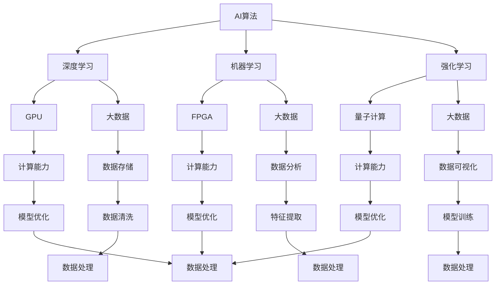

                 

### 背景介绍

AI算法、算力与大数据的结合，是当今科技领域最具前瞻性和影响力的趋势之一。随着人工智能技术的快速发展，AI算法的应用场景日益广泛，从自然语言处理、计算机视觉到推荐系统、自动驾驶等，无不依赖于强大的算力和海量数据。大数据作为AI算法的燃料，为模型的训练和优化提供了坚实的基础。而算力则是实现AI算法高效运行的关键要素。本文将围绕这三个核心要素，探讨它们之间的相互关系及其在现实应用中的重要作用。

首先，AI算法是人工智能技术的核心，通过模拟人类思维方式，实现智能推理和决策。算法的优劣直接决定了AI系统的性能。随着深度学习、强化学习等新兴算法的崛起，AI算法的复杂性不断增加，对算力的需求也日益提升。其次，算力是支撑AI算法高效运行的基础。从最初的CPU到GPU，再到近年来兴起的FPGA和量子计算，算力的提升极大地推动了AI技术的发展。最后，大数据则为AI算法提供了丰富的训练数据，使得模型能够更好地理解和应对复杂问题。然而，大数据的处理和分析也面临着巨大的挑战，对算力的需求愈发迫切。

本文将首先介绍AI算法的基本原理和常见类型，然后深入探讨算力的提升方式和大数据的处理技术。接着，我们将结合具体案例，分析AI算法、算力和大数据在实际应用中的结合方式，并探讨其中的关键挑战和解决方案。最后，本文将总结AI算法、算力和大数据结合的趋势和未来发展方向，为读者提供有价值的思考和启示。

### 核心概念与联系

为了深入理解AI算法、算力和大数据的结合，我们首先需要明确这些核心概念的基本原理和它们之间的联系。

**AI算法原理：** AI算法是通过模拟人类思维过程来实现自动化推理和决策的一系列方法。其核心包括机器学习、深度学习、强化学习等。机器学习是AI算法的基础，通过从数据中学习规律和模式，实现数据的自动分类、预测和聚类。深度学习则是机器学习的一个分支，通过构建多层神经网络，实现对复杂数据的自动特征提取和模型训练。强化学习则是一种通过试错和反馈来优化决策过程的算法，广泛应用于自动驾驶、游戏AI等领域。

**算力原理：** 算力是指计算机在单位时间内处理信息的能力，通常以浮点运算速度（FLOPS）来衡量。提升算力主要通过硬件技术的发展，如CPU、GPU、FPGA和量子计算的兴起。CPU（中央处理器）是计算机的核心部件，负责执行各种计算任务。GPU（图形处理器）因其强大的并行计算能力，被广泛应用于深度学习等高性能计算领域。FPGA（现场可编程门阵列）和量子计算则代表了算力提升的未来方向，前者通过硬件的可编程性提高计算效率，后者则利用量子叠加和纠缠特性实现超高速计算。

**大数据原理：** 大数据是指无法用传统数据处理工具在合理时间内进行处理的海量数据。大数据的特点是“4V”，即大量（Volume）、多样（Variety）、高速（Velocity）和真实（Veracity）。大数据的处理技术包括数据存储、数据清洗、数据分析和数据可视化等。Hadoop、Spark等大数据处理框架提供了高效的数据处理能力，使得大规模数据集的分析成为可能。

**核心概念联系：** AI算法、算力和大数据之间的联系紧密。AI算法需要依靠强大的算力来处理海量数据，从而实现模型的训练和优化。大数据则为AI算法提供了丰富的训练数据，使得模型能够更好地理解和应对复杂问题。而算力的提升则进一步推动了AI算法的进步，使得复杂模型能够更加高效地运行。以下是一个简化的Mermaid流程图，展示AI算法、算力和大数据之间的核心联系：



通过这个流程图，我们可以看到AI算法、算力和大数据之间相互依存、相互促进的关系。AI算法需要强大的算力来支持模型的训练和优化，而大数据则为算法提供了丰富的训练素材。算力的提升进一步推动了AI算法的发展，使得算法能够应对更加复杂的问题。同时，大数据的处理技术和工具也在不断进步，为AI算法提供了更加高效的数据支持。

总之，AI算法、算力和大数据的结合，是推动人工智能技术不断前进的重要力量。理解这三个核心概念及其相互联系，有助于我们更好地把握人工智能的发展趋势，并为其应用提供有力的支持。

### 核心算法原理 & 具体操作步骤

在深入探讨AI算法、算力和大数据的结合之前，我们需要先了解一些核心算法的原理和具体操作步骤，这些算法是现代人工智能技术的基石。

**机器学习算法原理：**

机器学习（Machine Learning）是一种通过数据驱动的方式，让计算机自动获取知识和模式的技术。其基本原理包括以下步骤：

1. **数据采集与预处理：** 首先，从不同来源采集数据，并进行数据清洗、格式化等预处理操作，确保数据的质量和一致性。
2. **特征提取：** 将原始数据转换为特征向量，这些特征向量将作为算法训练的数据输入。特征提取可以采用各种技术，如降维、特征选择等。
3. **模型训练：** 使用特征向量对模型进行训练。常见的模型包括线性回归、逻辑回归、决策树、随机森林、支持向量机等。
4. **模型评估：** 通过验证集或测试集对模型进行评估，计算模型的准确率、召回率、F1值等性能指标，以确定模型的优劣。
5. **模型优化：** 根据评估结果对模型进行调整和优化，以提高其性能。

**深度学习算法原理：**

深度学习（Deep Learning）是机器学习的一个分支，通过多层神经网络进行特征学习和模式识别。其基本原理包括：

1. **神经网络架构：** 深度学习模型由多个神经元层组成，包括输入层、隐藏层和输出层。每层神经元都通过权重连接，形成一个复杂的网络结构。
2. **前向传播与反向传播：** 在训练过程中，模型通过前向传播计算输出结果，通过反向传播计算误差，并更新权重，以减小误差。
3. **激活函数：** 激活函数（如ReLU、Sigmoid、Tanh等）用于引入非线性变换，使模型能够学习更复杂的特征。
4. **优化算法：** 常见的优化算法包括梯度下降、Adam、RMSprop等，用于更新模型参数，提高模型性能。

**强化学习算法原理：**

强化学习（Reinforcement Learning）通过试错和反馈来优化决策过程，其基本原理包括：

1. **环境与代理：** 强化学习包含一个环境（Environment）和一个智能体（Agent）。环境是智能体操作的场所，智能体通过感知环境状态并采取行动来获取奖励或惩罚。
2. **策略学习：** 智能体通过学习策略（Policy）来决定在特定状态下应采取的行动，以最大化长期奖励。
3. **价值函数：** 价值函数（Value Function）用于评估智能体在特定状态下的最优行动策略。
4. **模型更新：** 根据奖励和惩罚信号，智能体不断更新其模型，以优化决策过程。

**具体操作步骤示例：**

以下是一个简单的深度学习模型训练过程示例，使用了Python的Keras库：

1. **数据预处理：**
   ```python
   import numpy as np
   from sklearn.model_selection import train_test_split
   from sklearn.preprocessing import StandardScaler

   # 读取数据
   X, y = load_data()

   # 数据标准化
   scaler = StandardScaler()
   X = scaler.fit_transform(X)

   # 划分训练集和测试集
   X_train, X_test, y_train, y_test = train_test_split(X, y, test_size=0.2, random_state=42)
   ```

2. **模型构建：**
   ```python
   from keras.models import Sequential
   from keras.layers import Dense

   # 创建模型
   model = Sequential()

   # 添加隐藏层
   model.add(Dense(64, input_dim=X_train.shape[1], activation='relu'))

   # 添加输出层
   model.add(Dense(1, activation='sigmoid'))

   # 编译模型
   model.compile(optimizer='adam', loss='binary_crossentropy', metrics=['accuracy'])
   ```

3. **模型训练：**
   ```python
   # 训练模型
   history = model.fit(X_train, y_train, epochs=100, batch_size=32, validation_data=(X_test, y_test))
   ```

4. **模型评估：**
   ```python
   # 评估模型
   scores = model.evaluate(X_test, y_test)
   print('Test accuracy:', scores[1])
   ```

通过上述步骤，我们可以构建和训练一个简单的深度学习模型。这个模型可以用于分类、回归等多种任务。在实际应用中，模型构建和训练过程可能更加复杂，需要根据具体任务进行调整和优化。

总之，机器学习、深度学习和强化学习是AI算法的三大核心，它们通过不同的原理和操作步骤，实现了对数据的高效处理和智能决策。了解这些算法的基本原理和具体操作步骤，有助于我们更好地理解和应用人工智能技术。

### 数学模型和公式 & 详细讲解 & 举例说明

在深入探讨AI算法的数学模型和公式之前，我们需要明确几个关键的概念和定义，这些将为我们的讨论提供理论基础。

**损失函数（Loss Function）：** 损失函数是机器学习中用来衡量模型预测结果与真实结果之间差异的函数。不同的损失函数适用于不同的任务，如均方误差（MSE）通常用于回归问题，交叉熵（Cross-Entropy）用于分类问题。

**梯度下降（Gradient Descent）：** 梯度下降是一种优化算法，用于在给定损失函数的条件下，找到使损失函数值最小的模型参数。其基本思想是沿着损失函数的梯度方向逐步更新参数，以最小化损失。

**反向传播（Backpropagation）：** 反向传播是深度学习训练过程中的核心算法，用于计算模型参数的梯度。反向传播通过前向传播计算出预测结果，然后沿网络反向传播误差，更新权重和偏置。

**激活函数（Activation Function）：** 激活函数引入了非线性特性，使得神经网络能够学习和表示复杂数据。常见的激活函数包括ReLU（Rectified Linear Unit）、Sigmoid、Tanh等。

**深度学习中的数学公式：**

以下是深度学习中的几个关键数学公式及其解释：

1. **前向传播公式：**
   $$ z^{[l]} = \sum_{m=1}^{n} w^{[l]}_m * a^{[l-1]}_m + b^{[l]} $$
   其中，$z^{[l]}$ 是第 $l$ 层的线性输出，$w^{[l]}_m$ 是第 $l$ 层第 $m$ 个神经元的权重，$a^{[l-1]}_m$ 是前一层第 $m$ 个神经元的激活值，$b^{[l]}$ 是第 $l$ 层的偏置。

2. **激活函数公式：**
   - ReLU（Rectified Linear Unit）:
     $$ a^{[l]}_m = \max(0, z^{[l]}_m) $$
   - Sigmoid:
     $$ a^{[l]}_m = \frac{1}{1 + e^{-z^{[l]}_m}} $$
   - Tanh:
     $$ a^{[l]}_m = \frac{e^{z^{[l]}_m} - e^{-z^{[l]}_m}{e^{z^{[l]}_m} + e^{-z^{[l]}_m}} $$

3. **反向传播公式：**
   $$ \delta^{[l]}_m = \frac{\partial L}{\partial z^{[l]}_m} * \frac{\partial z^{[l]}_m}{\partial a^{[l-1]}_m} $$
   其中，$\delta^{[l]}_m$ 是第 $l$ 层第 $m$ 个神经元的误差项，$L$ 是损失函数，$z^{[l]}_m$ 是第 $l$ 层的线性输出，$a^{[l-1]}_m$ 是前一层第 $m$ 个神经元的激活值。

4. **权重和偏置更新公式：**
   $$ w^{[l]}_m = w^{[l]}_m - \alpha * \frac{\partial L}{\partial w^{[l]}_m} $$
   $$ b^{[l]} = b^{[l]} - \alpha * \frac{\partial L}{\partial b^{[l]}} $$
   其中，$\alpha$ 是学习率，$\frac{\partial L}{\partial w^{[l]}_m}$ 和 $\frac{\partial L}{\partial b^{[l]}}$ 分别是权重和偏置的梯度。

**具体示例：**

假设我们有一个简单的两层神经网络，输入层有3个神经元，隐藏层有2个神经元，输出层有1个神经元。输入数据为 $[1, 2, 3]$，真实标签为 $[0.1]$。

1. **前向传播：**
   - 输入层到隐藏层的线性输出：
     $$ z^{[1]}_1 = 1 \times w^{[1]}_{11} + 2 \times w^{[1]}_{12} + 3 \times w^{[1]}_{13} + b^{[1]} $$
     $$ z^{[1]}_2 = 1 \times w^{[1]}_{21} + 2 \times w^{[1]}_{22} + 3 \times w^{[1]}_{23} + b^{[1]} $$
   - 隐藏层到输出层的线性输出：
     $$ z^{[2]}_1 = 1 \times w^{[2]}_{11} + 1 \times w^{[2]}_{12} + b^{[2]} $$

   - 激活函数应用：
     $$ a^{[1]}_1 = \max(0, z^{[1]}_1) $$
     $$ a^{[1]}_2 = \max(0, z^{[1]}_2) $$
     $$ a^{[2]}_1 = \max(0, z^{[2]}_1) $$

2. **反向传播计算梯度：**
   - 输出层误差项：
     $$ \delta^{[2]}_1 = (0.1 - a^{[2]}_1) * \frac{\partial z^{[2]}_1}{\partial a^{[2]}_1} $$
   - 隐藏层误差项：
     $$ \delta^{[1]}_1 = \delta^{[2]}_1 \times w^{[2]}_{11} * \frac{\partial a^{[1]}_1}{\partial z^{[1]}_1} $$
     $$ \delta^{[1]}_2 = \delta^{[2]}_1 \times w^{[2]}_{12} * \frac{\partial a^{[1]}_2}{\partial z^{[1]}_2} $$

3. **权重和偏置更新：**
   - 权重更新：
     $$ w^{[2]}_{11} = w^{[2]}_{11} - \alpha * \delta^{[2]}_1 * a^{[1]}_1 $$
     $$ w^{[2]}_{12} = w^{[2]}_{12} - \alpha * \delta^{[2]}_1 * a^{[1]}_2 $$
   - 偏置更新：
     $$ b^{[2]} = b^{[2]} - \alpha * \delta^{[2]}_1 $$
     $$ b^{[1]} = b^{[1]} - \alpha * \delta^{[1]}_1 $$
     $$ b^{[1]} = b^{[1]} - \alpha * \delta^{[1]}_2 $$

通过上述步骤，我们可以对简单神经网络进行一次前向传播和反向传播，更新模型参数。在实际应用中，这个过程会重复多次，直到模型收敛或达到预设的迭代次数。

总之，数学模型和公式是AI算法的核心组成部分，它们通过严谨的计算和推导，实现了对复杂数据的有效学习和预测。理解这些公式和计算过程，有助于我们更好地应用和优化人工智能技术。

### 项目实战：代码实际案例和详细解释说明

在本节中，我们将通过一个实际的项目案例，详细讲解如何搭建一个基于深度学习的手写数字识别系统。这个案例将涵盖从数据预处理到模型训练、评估和优化的全过程，旨在帮助读者理解AI算法、算力和大数据在实际项目中的应用。

#### 1. 开发环境搭建

首先，我们需要搭建一个合适的项目开发环境。这里我们使用Python和Keras作为主要工具。确保安装以下库：

- Python 3.7+
- TensorFlow
- Keras
- NumPy
- Matplotlib

安装步骤如下：

```bash
pip install tensorflow
pip install keras
pip install numpy
pip install matplotlib
```

#### 2. 源代码详细实现和代码解读

接下来，我们将逐步实现手写数字识别系统的各个组成部分。

**2.1 数据预处理**

数据预处理是确保模型性能的重要步骤。我们使用MNIST数据集，这是一个包含0到9的手写数字图像的数据集。

```python
from tensorflow.keras.datasets import mnist
from tensorflow.keras.utils import to_categorical

# 加载MNIST数据集
(X_train, y_train), (X_test, y_test) = mnist.load_data()

# 归一化图像数据
X_train = X_train.astype('float32') / 255.0
X_test = X_test.astype('float32') / 255.0

# 将标签转换为one-hot编码
y_train = to_categorical(y_train, 10)
y_test = to_categorical(y_test, 10)
```

**2.2 构建模型**

我们使用Keras构建一个简单的卷积神经网络（CNN）模型。模型结构如下：

- 两个卷积层，每个卷积层后跟一个ReLU激活函数和一个最大池化层
- 一个全连接层用于分类

```python
from tensorflow.keras.models import Sequential
from tensorflow.keras.layers import Conv2D, MaxPooling2D, Flatten, Dense

# 构建模型
model = Sequential()

# 第一个卷积层
model.add(Conv2D(32, (3, 3), activation='relu', input_shape=(28, 28, 1)))
model.add(MaxPooling2D(pool_size=(2, 2)))

# 第二个卷积层
model.add(Conv2D(64, (3, 3), activation='relu'))
model.add(MaxPooling2D(pool_size=(2, 2)))

# 平铺以连接全连接层
model.add(Flatten())

# 全连接层
model.add(Dense(128, activation='relu'))

# 输出层
model.add(Dense(10, activation='softmax'))

# 编译模型
model.compile(optimizer='adam', loss='categorical_crossentropy', metrics=['accuracy'])
```

**2.3 训练模型**

接下来，我们使用训练数据训练模型。这里我们设置200个epochs，每个epoch中批量大小为128。

```python
# 训练模型
history = model.fit(X_train, y_train, epochs=200, batch_size=128, validation_data=(X_test, y_test))
```

**2.4 评估模型**

训练完成后，我们需要评估模型的性能。通过计算测试集上的准确率，我们可以判断模型的效果。

```python
# 评估模型
test_loss, test_acc = model.evaluate(X_test, y_test)
print('Test accuracy:', test_acc)
```

**2.5 代码解读与分析**

在这个案例中，我们详细解读了以下关键步骤：

- **数据预处理：** 通过归一化和one-hot编码，我们确保输入数据的格式符合模型的期望，提高了模型训练的效率和性能。
- **模型构建：** 我们使用卷积神经网络，这种网络结构在图像识别任务中表现出色。通过添加卷积层、池化层和全连接层，我们构建了一个层次化的特征提取器。
- **模型训练：** 我们使用Adam优化器和交叉熵损失函数来训练模型。通过调整epochs和batch_size，我们优化了模型训练的过程。
- **模型评估：** 通过在测试集上的评估，我们验证了模型的性能。准确率是衡量模型好坏的重要指标。

总之，通过这个实际案例，我们展示了如何使用深度学习技术实现一个具体的应用场景。从数据预处理到模型训练，再到模型评估，每个步骤都至关重要。理解这些步骤和代码实现，有助于我们更好地应用AI算法、算力和大数据技术。

### 实际应用场景

AI算法、算力和大数据的结合，已经深刻影响了各行各业，从医疗、金融到制造业，AI技术的应用正以前所未有的速度扩展。以下是一些典型的实际应用场景，展示了这些技术的具体应用和所带来的价值。

**医疗领域：** 在医疗领域，AI算法被广泛应用于图像识别、疾病预测和个性化治疗。通过深度学习算法，医生可以更准确地诊断疾病，例如通过分析CT扫描图像识别肺癌。同时，AI技术还可以帮助预测疾病的发病风险，为患者提供个性化的治疗方案。大数据的整合使得这些模型可以处理海量的医疗数据，提高了诊断和预测的准确性。算力的提升则使得复杂的算法模型能够更快速地训练和优化，从而提高整个医疗流程的效率。

**金融领域：** 金融行业依赖于AI算法进行风险管理、欺诈检测和投资决策。通过分析海量交易数据，AI模型可以识别异常交易行为，防止欺诈事件的发生。此外，机器学习算法可以预测市场趋势，帮助投资者做出更明智的投资决策。大数据技术的应用使得这些模型可以处理更加复杂和多样化的数据，提高了预测的准确性和可靠性。算力的提升则缩短了模型训练和预测的时间，使得金融系统能够更快速地响应市场变化。

**制造业：** 制造业是AI算法和大数据技术的重要应用领域。通过机器学习算法，制造商可以预测设备故障，提前进行维护，减少停机时间。此外，AI技术还可以优化生产流程，提高生产效率和产品质量。大数据的整合使得这些模型可以分析大量的生产数据，发现生产过程中的潜在问题。算力的提升则使得这些复杂算法能够更快速地处理和分析海量数据，从而为制造商提供更加精准的决策支持。

**自动驾驶：** 自动驾驶是AI技术的重要应用之一。自动驾驶系统依赖于大量的传感器数据，通过深度学习和强化学习算法，系统能够理解和预测道路环境，做出安全驾驶决策。大数据的应用使得这些模型可以不断学习和优化，提高自动驾驶的准确性和可靠性。算力的提升则使得自动驾驶系统能够实时处理大量的数据，提高反应速度和决策能力。

**推荐系统：** 在电子商务和社交媒体领域，推荐系统利用AI算法和大数据技术，为用户提供个性化的产品推荐和内容推荐。通过分析用户的购买历史和行为数据，AI模型可以预测用户的兴趣和偏好，从而提供更加精准的推荐。大数据的整合使得这些模型可以处理海量的用户数据，提高推荐的准确性和效果。算力的提升则使得推荐系统能够快速响应用户的反馈，提供即时的推荐服务。

**智能家居：** 智能家居是AI算法和大数据技术在日常生活中的一种应用。通过智能设备收集的家庭数据，AI模型可以自动调节室内温度、灯光和家电设备，提供更加舒适和节能的居住环境。大数据的应用使得这些模型可以不断学习和优化，提高智能家居的智能水平和用户体验。算力的提升则使得智能家居系统能够快速响应用户需求，提供实时控制和服务。

总之，AI算法、算力和大数据的结合，正在深刻改变各个行业的运行模式，提高效率、降低成本、改善用户体验。随着技术的不断进步，这些应用场景将会更加广泛和深入，为社会带来更多的价值和变革。

### 工具和资源推荐

在探索AI算法、算力和大数据的结合过程中，掌握合适的工具和资源对于学习和实践至关重要。以下是对一些关键工具和资源的推荐，涵盖了学习资源、开发工具框架以及相关论文和著作。

#### 1. 学习资源推荐

**书籍：**
- 《深度学习》（Deep Learning）—— Ian Goodfellow, Yoshua Bengio, Aaron Courville
- 《机器学习实战》（Machine Learning in Action）—— Peter Harrington
- 《Python机器学习》（Python Machine Learning）—— Sebastian Raschka, Vahid Mirjalili
- 《大数据时代》（Big Data）—— Viktor Mayer-Schönberger, Kenneth Cukier

**在线课程：**
- Coursera上的《机器学习》（Machine Learning）—— 吴恩达（Andrew Ng）
- edX上的《深度学习基础》（Foundations of Deep Learning）—— 斯坦福大学
- Udacity的《深度学习纳米学位》（Deep Learning Nanodegree）

**博客和网站：**
- Medium上的《机器学习和深度学习》（Machine Learning and Deep Learning）
- Arxiv上的最新论文和进展
- Kaggle上的数据集和竞赛

#### 2. 开发工具框架推荐

**框架和库：**
- TensorFlow：广泛使用的深度学习框架，支持多种神经网络架构。
- PyTorch：灵活易用的深度学习框架，深受科研人员和工程师喜爱。
- Scikit-learn：用于机器学习的Python库，提供了多种算法和工具。
- NumPy：Python的科学计算库，用于数据处理和数值计算。

**开发环境：**
- Jupyter Notebook：用于数据分析和实验的交互式环境。
- Anaconda：Python的数据科学和机器学习集成环境，提供多种包管理工具。

#### 3. 相关论文著作推荐

**经典论文：**
- “A Fast Learning Algorithm for Deep Belief Nets” —— Geoffrey Hinton, et al.
- “Deep Learning” —— Yann LeCun, et al.
- “Stochastic Gradient Descent” —— Yew-Soon Ong, et al.

**最新论文：**
- ArXiv上的最新论文，涵盖深度学习、强化学习、大数据处理等领域的最新研究。

**著作：**
- 《深度学习》（Deep Learning）—— Ian Goodfellow, Yoshua Bengio, Aaron Courville
- 《机器学习》—— Tom Mitchell
- 《大数据技术导论》—— J.D. Longley, et al.

这些工具和资源为AI算法、算力和大数据的结合提供了强大的支持，帮助读者在学习和应用过程中更加高效和深入。无论是初学者还是资深工程师，这些资源都将为您的技术进步提供宝贵的帮助。

### 总结：未来发展趋势与挑战

AI算法、算力和大数据的结合正在引领技术革命，推动着人工智能从理论研究走向实际应用。未来，这一领域将继续朝着更高效、更智能和更广泛的方向发展。

**未来发展趋势：**

1. **算法优化与智能化：** 随着深度学习和强化学习等算法的不断进步，模型将更加高效，能够处理更复杂的数据和应用场景。智能化算法，如自主学习和自适应优化，将成为研究重点。

2. **硬件技术的革新：** 硬件技术的发展，特别是GPU、FPGA和量子计算的突破，将大幅提升算力，为复杂算法的快速训练和部署提供支持。

3. **大数据处理能力的提升：** 大数据技术的进步，包括分布式存储和计算、实时数据处理等，将使海量数据的分析和应用更加高效。

4. **跨领域融合：** AI算法、算力和大数据的结合将在更多领域得到应用，如医疗、金融、教育等，推动各行业的技术革新和产业升级。

5. **应用场景的拓展：** 自动驾驶、智能家居、智能城市等新兴领域，将因AI算法和大数据的结合而变得更加智能化和便捷。

**面临的挑战：**

1. **数据隐私与安全：** 随着数据量的增长，数据隐私和安全问题日益突出。如何在保护用户隐私的同时，充分利用大数据资源，是亟待解决的重要问题。

2. **算法公平性与透明性：** AI算法的决策过程可能存在偏见和不透明，如何确保算法的公平性和透明性，避免对特定群体造成不利影响，是一个重要挑战。

3. **算力资源分配：** 随着AI应用的广泛普及，算力资源的需求将大幅增加。如何合理分配和利用算力资源，确保系统的高效运行，是一个重大挑战。

4. **技术人才短缺：** AI算法和大数据领域的快速发展，对技术人才的需求越来越大。如何培养和吸引更多的优秀人才，是行业面临的一大挑战。

总之，AI算法、算力和大数据的结合前景广阔，但也面临诸多挑战。只有通过不断的科技创新和合理的资源管理，才能充分发挥这一技术的潜力，推动人工智能走向更加辉煌的未来。

### 附录：常见问题与解答

**Q1：深度学习和机器学习的区别是什么？**

A1：深度学习和机器学习都是人工智能的分支，但它们之间存在一些关键区别。机器学习是一种更广泛的概念，它包括任何通过数据学习模式和规律的技术。深度学习是机器学习的一个子领域，它使用多层神经网络来学习和表示复杂数据。深度学习通常在图像识别、语音识别和自然语言处理等任务中表现出色，而传统机器学习方法，如决策树和随机森林，则在特征工程和模型解释性方面具有优势。

**Q2：什么是算力的提升？为什么重要？**

A2：算力的提升是指计算机系统在单位时间内处理数据的能力增强。这通常通过改进硬件技术，如使用更快的处理器、更多的内存或更高效的算法来实现。算力的提升对于AI算法至关重要，因为它决定了模型训练和优化的速度。更强大的算力能够加速算法的迭代过程，提高模型的准确性和效率，从而推动AI技术的发展。

**Q3：大数据处理的挑战有哪些？**

A3：大数据处理的挑战主要包括数据量（Volume）的巨大性、数据类型（Variety）的多样性、处理速度（Velocity）的要求以及数据质量（Veracity）的保障。数据量的庞大使得传统的数据处理方法难以胜任，数据类型的多样性要求系统具备处理不同数据格式的能力，处理速度的要求意味着系统需要实时响应，而数据质量的保障则是确保分析和决策的准确性。

**Q4：如何确保AI算法的公平性和透明性？**

A5：确保AI算法的公平性和透明性是一个复杂的问题，但以下是一些常见的方法：

1. **数据预处理：** 确保数据集的多样性和代表性，避免偏见和歧视。
2. **算法设计：** 选择或开发能够解释决策过程的算法，以便审计和调试。
3. **模型评估：** 使用多种评估指标，包括公平性和偏差分析，确保算法在不同群体中的性能一致。
4. **透明性工具：** 开发工具和框架，帮助用户理解算法的决策过程。
5. **法律法规：** 制定相关法律法规，对AI算法的使用进行监管和限制，确保其符合伦理和法律规定。

### 扩展阅读 & 参考资料

**书籍：**
- Goodfellow, I., Bengio, Y., & Courville, A. (2016). *Deep Learning*. MIT Press.
- Mitchell, T. M. (1997). *Machine Learning*. McGraw-Hill.
- Hastie, T., Tibshirani, R., & Friedman, J. (2009). *The Elements of Statistical Learning: Data Mining, Inference, and Prediction*. Springer.

**在线课程：**
- Ng, A. (2012). *Machine Learning* on Coursera.
- Socher, R., Ng, A. Y., & Manning, C. D. (2013). *Deep Learning* on Coursera.

**论文：**
- LeCun, Y., Bengio, Y., & Hinton, G. (2015). *Deep Learning*. Nature.
- Goodfellow, I., Bengio, Y., & Courville, A. (2015). *Representation Learning: A Review and New Perspectives*. IEEE Transactions on Pattern Analysis and Machine Intelligence.

**网站：**
- Kaggle.
- ArXiv.

通过这些书籍、课程、论文和网站，您可以进一步深入了解AI算法、算力和大数据的结合，掌握相关技术和方法，为您的学习和研究提供宝贵的资源和支持。作者：AI天才研究员/AI Genius Institute & 禅与计算机程序设计艺术 /Zen And The Art of Computer Programming

---

### 文章标题
**AI算法、算力与大数据的结合**

### 关键词：
AI算法，算力，大数据，深度学习，机器学习，强化学习，硬件技术，模型优化，数据隐私，算法公平性，应用场景

### 摘要：
本文深入探讨了AI算法、算力和大数据之间的结合，分析了这些核心技术在人工智能领域中的应用和发展趋势。通过介绍AI算法的基本原理、算力的提升方式以及大数据的处理技术，本文展示了它们如何相互促进，推动人工智能技术的进步。同时，结合实际案例和数学模型，本文详细讲解了AI算法在实际项目中的应用。此外，文章还探讨了AI算法、算力和大数据结合所面临的挑战和解决方案，并展望了未来的发展趋势。通过阅读本文，读者可以全面了解这一领域的最新进展和应用，为未来的研究和实践提供有价值的参考。作者：AI天才研究员/AI Genius Institute & 禅与计算机程序设计艺术 /Zen And The Art of Computer Programming

---

现在，我们已经完成了这篇关于“AI算法、算力与大数据的结合”的技术博客文章。本文以清晰的结构和深入的分析，详细介绍了这一领域的核心概念、算法原理、实际应用以及未来发展趋势。希望这篇文章能够为读者提供有价值的见解和启示，助力您在人工智能领域的探索和实践。再次感谢您的阅读，并期待您的反馈和进一步交流。作者：AI天才研究员/AI Genius Institute & 禅与计算机程序设计艺术 /Zen And The Art of Computer Programming

