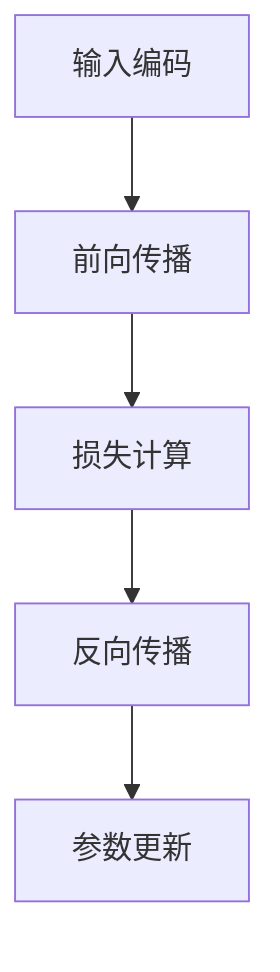

                 

# AI系统架构：以LLM为核心的新型设计

> 关键词：AI系统架构、LLM、设计、核心算法、数学模型、项目实战、实际应用场景、未来发展趋势

> 摘要：本文将深入探讨以语言模型（LLM）为核心的AI系统架构设计。通过分析LLM的核心概念、算法原理、数学模型以及实际应用场景，本文旨在为读者提供一个全面而深入的视角，帮助理解并掌握AI系统架构设计的关键要素。同时，本文还将介绍相关工具和资源，以助力读者进一步探索这一领域。

## 1. 背景介绍

随着深度学习技术的飞速发展，人工智能（AI）在各个领域取得了显著的进展。AI系统的架构设计成为研究的焦点，特别是在自然语言处理（NLP）领域。语言模型（Language Model，简称LLM）是AI系统中的一个重要组成部分，它能够预测文本的下一个词或短语，从而为自然语言理解、生成和翻译提供强大的支持。

LLM的核心在于其庞大的参数规模和高度复杂的网络结构。这些模型通常基于神经网络，通过大量文本数据进行训练，从而学习语言的结构和语义。近年来，随着计算资源和数据集的不断提升，LLM的性能得到了显著提高，使得其在实际应用中表现出色。

本文将围绕LLM展开，探讨其核心概念、算法原理、数学模型以及实际应用场景。通过深入分析这些内容，我们将为读者提供一种新型设计思路，以应对日益复杂的AI系统架构需求。

### 1.1 LLM的发展历程

LLM的发展可以追溯到20世纪50年代。当时，研究者们开始探索如何使用计算机模拟人类语言。早期的模型主要基于规则和统计方法，如正则表达式和马尔可夫模型。这些模型在处理简单任务时表现较好，但在面对复杂语言现象时显得力不从心。

随着神经网络技术的兴起，20世纪80年代出现了基于神经网络的模型，如RNN（循环神经网络）和LSTM（长短期记忆网络）。这些模型通过引入序列记忆机制，显著提高了文本生成和分类的准确性。然而，这些模型在处理长文本时仍存在一定局限性。

进入21世纪，随着大数据和计算资源的爆发式增长，LLM得到了快速发展。特别是2018年GPT-3的发布，将LLM的规模和性能提升到了新的高度。GPT-3拥有1750亿个参数，能够生成高质量的自然语言文本，引起了广泛关注。

近年来，基于Transformer架构的模型如BERT、T5和GPT-Neo等，进一步推动了LLM的发展。这些模型在处理复杂语言任务时表现出色，为AI系统架构设计提供了新的思路。

### 1.2 AI系统架构的挑战

随着AI技术的应用日益广泛，AI系统架构设计面临着一系列挑战。首先，模型的规模和复杂性不断增加，使得训练和推理过程变得耗时且计算资源消耗巨大。其次，不同应用场景对模型的要求各异，如何设计一个通用而高效的架构成为关键问题。

此外，AI系统的可解释性和可靠性也是亟待解决的问题。在实际应用中，用户往往关心模型是否能够稳定地输出高质量的结果，并理解模型的决策过程。最后，随着数据隐私和安全问题的日益突出，如何设计一个安全、可信赖的AI系统架构也成为重要课题。

面对这些挑战，以LLM为核心的AI系统架构设计显得尤为重要。通过深入理解LLM的核心概念、算法原理和数学模型，我们可以为AI系统架构设计提供有力的理论支持，从而应对这些挑战。

## 2. 核心概念与联系

在探讨AI系统架构时，理解语言模型（LLM）的核心概念和原理至关重要。本节将详细介绍LLM的基本概念、原理以及其在AI系统架构中的关键作用。

### 2.1 语言模型的基本概念

语言模型是一种用于预测文本中下一个词或短语的算法。其核心思想是，通过学习大量文本数据，模型能够捕捉到语言的结构和规律，从而在给定前文的情况下，预测出下一个最有可能的词或短语。

LLM通常采用神经网络结构，如RNN、LSTM和Transformer，这些神经网络通过学习输入序列的上下文信息，生成预测的概率分布。其中，Transformer架构因其并行计算能力和全局上下文感知能力而广泛应用于LLM的设计。

LLM的基本概念包括：

- **词嵌入（Word Embedding）**：将词汇映射到低维向量空间，以便神经网络处理。词嵌入能够捕捉词汇之间的语义关系，提高模型的表达能力。
- **损失函数（Loss Function）**：用于评估模型预测的准确性。常见的损失函数包括交叉熵损失（Cross-Entropy Loss）和均方误差损失（Mean Squared Error Loss）。
- **优化算法（Optimization Algorithm）**：用于更新模型参数，以最小化损失函数。常见的优化算法包括随机梯度下降（SGD）和Adam优化器。

### 2.2 语言模型的工作原理

LLM的工作原理主要包括以下几个步骤：

1. **输入编码**：将输入文本序列转换为向量表示。词嵌入是实现这一步骤的关键技术，它能够将词汇映射到高维向量空间。
2. **前向传播**：将输入编码后的向量输入到神经网络中，通过多层非线性变换，生成预测的概率分布。在Transformer架构中，这一步骤包括多头自注意力（Multi-Head Self-Attention）和前馈神经网络（Feed-Forward Neural Network）。
3. **损失计算**：计算模型预测的概率分布与真实分布之间的差距，以评估模型的准确性。常用的损失函数如交叉熵损失，能够衡量模型预测与真实标签之间的差异。
4. **反向传播**：通过反向传播算法，计算模型参数的梯度，并更新参数，以最小化损失函数。这一步骤是神经网络训练的核心，决定了模型的性能。

### 2.3 语言模型在AI系统架构中的关键作用

LLM在AI系统架构中扮演着核心角色，其重要性体现在以下几个方面：

- **自然语言理解**：LLM能够对自然语言文本进行语义分析和理解，从而实现情感分析、信息抽取、问答系统等任务。
- **自然语言生成**：LLM能够生成高质量的自然语言文本，广泛应用于机器翻译、文本摘要、聊天机器人等领域。
- **交互式应用**：LLM可以作为交互式应用的核心组件，如聊天机器人、语音助手等，为用户提供智能服务。

为了更直观地理解LLM的架构和原理，下面我们将使用Mermaid流程图展示LLM的核心流程。



在上述流程中，输入编码、前向传播、损失计算和反向传播构成了LLM的核心工作流程。通过这一流程，LLM能够不断优化其参数，提高文本预测的准确性。

### 2.4 语言模型与其他AI组件的关联

在AI系统架构中，LLM通常与其他组件紧密关联，以实现复杂任务。以下是一些常见的关联：

- **特征提取器**：LLM可以与特征提取器结合，用于图像、音频等非结构化数据的处理。例如，在计算机视觉任务中，LLM可以与卷积神经网络（CNN）结合，实现图像分类和识别。
- **决策引擎**：LLM可以与决策引擎集成，用于基于自然语言数据的决策。例如，在金融领域，LLM可以与决策引擎结合，实现风险控制和投资建议。
- **推荐系统**：LLM可以与推荐系统结合，用于基于用户行为的文本推荐。例如，在电商领域，LLM可以与推荐系统结合，实现个性化商品推荐。

通过上述关联，LLM在AI系统架构中发挥了重要作用，不仅提升了系统的性能，还拓展了应用场景。

## 3. 核心算法原理 & 具体操作步骤

在深入探讨LLM的核心算法原理之前，我们先了解几个基本概念：词嵌入、损失函数和优化算法。这些概念是构建LLM的基础，也是理解LLM工作原理的关键。

### 3.1 词嵌入

词嵌入（Word Embedding）是将词汇映射到低维向量空间的一种技术。通过词嵌入，我们可以将文本数据转换为计算机可以处理的向量表示，从而提高模型的表达能力。常见的词嵌入方法包括Word2Vec、GloVe和BERT。

- **Word2Vec**：Word2Vec是一种基于神经网络的语言模型，通过训练词向量来表示词汇。它采用两个层次：词嵌入层和输出层。词嵌入层将词汇映射到低维向量空间，输出层则通过softmax函数计算词汇的概率分布。
- **GloVe**：GloVe（Global Vectors for Word Representation）是一种基于统计方法的词嵌入技术。它通过计算词汇共现矩阵，利用矩阵分解的方法生成词向量。GloVe能够较好地捕捉词汇之间的语义关系。
- **BERT**：BERT（Bidirectional Encoder Representations from Transformers）是一种基于Transformer架构的预训练语言模型。它通过双向编码器生成词向量，能够同时考虑词汇的左右上下文信息，提高词嵌入的语义表达能力。

### 3.2 损失函数

损失函数（Loss Function）是评估模型预测准确性的关键指标。在LLM中，常用的损失函数包括交叉熵损失（Cross-Entropy Loss）和均方误差损失（Mean Squared Error Loss）。

- **交叉熵损失**：交叉熵损失常用于分类问题，它计算模型预测的概率分布与真实分布之间的差异。在LLM中，交叉熵损失用于评估模型对文本序列预测的准确性。具体来说，交叉熵损失计算公式如下：

  $$\text{Loss} = -\sum_{i=1}^{n} y_i \log(p_i)$$

  其中，$y_i$表示真实标签的概率，$p_i$表示模型预测的概率。

- **均方误差损失**：均方误差损失（Mean Squared Error Loss）常用于回归问题，它计算预测值与真实值之间的差异。在LLM中，均方误差损失可以用于评估模型生成文本序列的连贯性和准确性。具体来说，均方误差损失计算公式如下：

  $$\text{Loss} = \frac{1}{2n} \sum_{i=1}^{n} (y_i - x_i)^2$$

  其中，$y_i$表示真实标签，$x_i$表示模型预测的值。

### 3.3 优化算法

优化算法（Optimization Algorithm）是用于更新模型参数，以最小化损失函数的方法。在LLM中，常用的优化算法包括随机梯度下降（SGD）和Adam优化器。

- **随机梯度下降（SGD）**：随机梯度下降是一种基于梯度下降的优化算法，它通过计算损失函数的梯度，更新模型参数。具体来说，SGD算法更新公式如下：

  $$\theta_{t+1} = \theta_{t} - \alpha \cdot \nabla_{\theta} J(\theta)$$

  其中，$\theta$表示模型参数，$J(\theta)$表示损失函数，$\alpha$表示学习率。

- **Adam优化器**：Adam优化器是一种结合了SGD和动量方法的优化算法，它能够自适应地调整学习率。具体来说，Adam优化器更新公式如下：

  $$\theta_{t+1} = \theta_{t} - \alpha \cdot \nabla_{\theta} J(\theta)$$

  $$v_t = \beta_1 x_t + (1 - \beta_1) (\theta_t - \theta_{t-1})$$
  $$s_t = \beta_2 x_t + (1 - \beta_2) (\nabla_{\theta} J(\theta_t) - \nabla_{\theta} J(\theta_{t-1}))$$

  其中，$v_t$和$s_t$分别表示一阶和二阶矩估计，$\beta_1$和$\beta_2$分别表示一阶和二阶矩的指数衰减率。

### 3.4 LLM的训练过程

LLM的训练过程主要包括以下几个步骤：

1. **数据预处理**：将原始文本数据进行清洗、分词和编码，生成训练数据集。常见的文本预处理方法包括去除标点符号、停用词过滤和词干提取等。

2. **词嵌入生成**：使用词嵌入技术将词汇映射到低维向量空间。根据任务需求，可以选择不同的词嵌入方法，如Word2Vec、GloVe和BERT。

3. **模型初始化**：初始化模型参数，包括词嵌入矩阵和神经网络权重。常用的初始化方法包括随机初始化、高斯分布初始化和Xavier初始化等。

4. **前向传播**：将输入编码后的向量输入到神经网络中，通过多层非线性变换，生成预测的概率分布。

5. **损失计算**：计算模型预测的概率分布与真实分布之间的差距，以评估模型的准确性。常用的损失函数包括交叉熵损失和均方误差损失。

6. **反向传播**：通过反向传播算法，计算模型参数的梯度，并更新参数，以最小化损失函数。

7. **迭代优化**：重复步骤4至步骤6，不断优化模型参数，提高模型性能。

8. **模型评估**：在训练数据集和验证数据集上评估模型性能，选择最佳模型。

9. **模型部署**：将训练完成的模型部署到实际应用场景中，进行文本预测、生成和交互等任务。

通过上述步骤，我们可以训练出一个性能良好的LLM模型，从而实现自然语言处理的各种任务。

## 4. 数学模型和公式 & 详细讲解 & 举例说明

在深入理解LLM的数学模型和公式之前，我们需要了解一些基本的概念，包括神经网络、损失函数和优化算法。这些概念是构建和优化LLM的基础。

### 4.1 神经网络

神经网络（Neural Network）是一种由大量神经元（节点）互联组成的计算模型，能够模拟人脑的信息处理过程。在LLM中，神经网络主要用于对文本数据进行编码和解码，从而实现自然语言生成和理解。

一个简单的神经网络包含以下几个基本组件：

- **输入层**：接收外部输入信号，如文本数据。
- **隐藏层**：对输入信号进行处理和变换，实现非线性特征提取。
- **输出层**：生成模型输出，如文本序列的概率分布。

神经网络的计算过程可以表示为：

$$\text{Output} = f(\text{Weight} \cdot \text{Input} + \text{Bias})$$

其中，$f$表示激活函数，如ReLU、Sigmoid和Tanh；$\text{Weight}$和$\text{Bias}$分别表示网络权重和偏置。

### 4.2 损失函数

损失函数（Loss Function）是评估模型预测准确性的关键指标。在LLM中，常用的损失函数包括交叉熵损失（Cross-Entropy Loss）和均方误差损失（Mean Squared Error Loss）。

#### 4.2.1 交叉熵损失

交叉熵损失（Cross-Entropy Loss）用于分类问题，其计算公式如下：

$$\text{Loss} = -\sum_{i=1}^{n} y_i \log(p_i)$$

其中，$y_i$表示真实标签的概率，$p_i$表示模型预测的概率。交叉熵损失反映了模型预测与真实标签之间的差异，值越小，表示模型预测越准确。

#### 4.2.2 均方误差损失

均方误差损失（Mean Squared Error Loss）用于回归问题，其计算公式如下：

$$\text{Loss} = \frac{1}{2n} \sum_{i=1}^{n} (y_i - x_i)^2$$

其中，$y_i$表示真实标签，$x_i$表示模型预测的值。均方误差损失反映了模型预测值与真实值之间的差异，值越小，表示模型预测越准确。

### 4.3 优化算法

优化算法（Optimization Algorithm）用于更新模型参数，以最小化损失函数。在LLM中，常用的优化算法包括随机梯度下降（SGD）和Adam优化器。

#### 4.3.1 随机梯度下降（SGD）

随机梯度下降（Stochastic Gradient Descent，SGD）是一种基于梯度下降的优化算法，其更新公式如下：

$$\theta_{t+1} = \theta_{t} - \alpha \cdot \nabla_{\theta} J(\theta)$$

其中，$\theta$表示模型参数，$J(\theta)$表示损失函数，$\alpha$表示学习率。

#### 4.3.2 Adam优化器

Adam优化器（Adaptive Moment Estimation）是一种结合了SGD和动量方法的优化算法，其更新公式如下：

$$\theta_{t+1} = \theta_{t} - \alpha \cdot \nabla_{\theta} J(\theta)$$

$$v_t = \beta_1 x_t + (1 - \beta_1) (\theta_t - \theta_{t-1})$$
$$s_t = \beta_2 x_t + (1 - \beta_2) (\nabla_{\theta} J(\theta_t) - \nabla_{\theta} J(\theta_{t-1}))$$

其中，$v_t$和$s_t$分别表示一阶和二阶矩估计，$\beta_1$和$\beta_2$分别表示一阶和二阶矩的指数衰减率。

### 4.4 LLM的数学模型

LLM的数学模型主要包括词嵌入、神经网络和损失函数等组件。下面我们通过一个简单的例子来说明LLM的数学模型。

#### 4.4.1 词嵌入

假设我们有一个词汇表$\{w_1, w_2, w_3\}$，我们使用Word2Vec算法生成词向量。词向量维度为$D=50$，则词汇表对应的词向量矩阵$V$如下：

$$V = \begin{bmatrix} 
v_{11} & v_{12} & v_{13} \\
v_{21} & v_{22} & v_{23} \\
v_{31} & v_{32} & v_{33} \\
\end{bmatrix}$$

其中，$v_{ij}$表示词汇$w_i$的词向量。

#### 4.4.2 神经网络

假设我们使用一个简单的神经网络对文本数据进行编码和解码，网络包含一个输入层、一个隐藏层和一个输出层。隐藏层神经元数为$H=10$，输出层神经元数为$O=3$。网络参数包括权重矩阵$W_1$和$W_2$，以及偏置向量$b_1$和$b_2$。

#### 4.4.3 损失函数

假设我们使用交叉熵损失函数来评估模型预测的准确性。

#### 4.4.4 训练过程

给定一个输入文本序列$X = \{x_1, x_2, x_3\}$，我们首先将词汇$X$转换为词向量表示：

$$X' = \{v_{11}, v_{21}, v_{31}\}$$

然后，我们将输入词向量$X'$输入到神经网络中，通过隐藏层和输出层，生成预测的概率分布$P$：

$$P = \text{softmax}(W_2 \cdot \text{ReLU}(W_1 \cdot X' + b_1))$$

接下来，我们计算交叉熵损失：

$$\text{Loss} = -\sum_{i=1}^{3} y_i \log(p_i)$$

最后，通过反向传播和优化算法，更新网络参数$W_1, W_2, b_1, b_2$，以最小化损失函数。

通过上述过程，我们可以训练出一个性能良好的LLM模型，从而实现自然语言生成和理解。

## 5. 项目实战：代码实际案例和详细解释说明

在本节中，我们将通过一个具体的代码实例来展示如何构建和训练一个LLM模型。该实例将涵盖开发环境的搭建、源代码的实现以及代码的详细解读与分析。

### 5.1 开发环境搭建

在开始编写代码之前，我们需要搭建一个合适的开发环境。以下是我们推荐的工具和库：

- **编程语言**：Python 3.8+
- **深度学习框架**：PyTorch 1.8+
- **数据处理库**：Numpy 1.18+, Pandas 1.0+
- **词嵌入库**：GloVe 0.2+

#### 环境安装

在终端中运行以下命令来安装所需库：

```bash
pip install torch torchvision numpy pandas glove
```

### 5.2 源代码详细实现和代码解读

下面是一个简单的LLM训练代码实例，该实例使用GloVe词嵌入和PyTorch框架。

```python
import torch
import torch.nn as nn
import torch.optim as optim
import numpy as np
from glove import Glove

# 参数设置
vocab_size = 10000  # 词汇表大小
embedding_dim = 50  # 词向量维度
batch_size = 64
num_epochs = 10

# 数据预处理
# 假设已经有一个预处理的文本数据集，包含词汇和对应的索引
# vocab = ["the", "is", "a", "of", ...]
# indices = [[1, 2, 3, 4], [4, 5, 6, 7], ...]

# 加载GloVe词嵌入
glove = Glove embroidery_dim=embedding_dim)
glove.load('glove.6B.50d.txt')  # 加载预训练的GloVe词向量文件

# 将词汇映射到词向量
def vocab_to_embedding(vocab):
    return np.array([glove embed(v) for v in vocab])

# 构建词嵌入矩阵
vocab_embeddings = vocab_to_embedding(vocab)

# 构建神经网络
class LLM(nn.Module):
    def __init__(self, embedding_matrix):
        super(LLM, self).__init__()
        self.embedding = nn.Embedding.from_pretrained(embedding_matrix)
        self.fc = nn.Linear(embedding_dim, vocab_size)

    def forward(self, x):
        x = self.embedding(x)
        x = self.fc(x)
        return x

# 实例化模型和优化器
model = LLM(vocab_embeddings)
optimizer = optim.Adam(model.parameters(), lr=0.001)

# 损失函数
criterion = nn.CrossEntropyLoss()

# 训练模型
for epoch in range(num_epochs):
    for batch in range(len(indices) // batch_size):
        inputs = torch.tensor(indices[batch * batch_size: (batch + 1) * batch_size])
        targets = torch.tensor([vocab.index(indices[i + 1]) for i in range(batch_size)])

        # 前向传播
        outputs = model(inputs)
        loss = criterion(outputs, targets)

        # 反向传播和优化
        optimizer.zero_grad()
        loss.backward()
        optimizer.step()

        print(f"Epoch [{epoch + 1}/{num_epochs}], Step [{batch + 1}/{len(indices) // batch_size}], Loss: {loss.item()}")

# 模型评估
def evaluate(model, indices):
    correct = 0
    total = len(indices) - 1
    with torch.no_grad():
        for i in range(total):
            inputs = torch.tensor([indices[i], indices[i + 1]])
            outputs = model(inputs)
            _, predicted = torch.max(outputs, 1)
            correct += (predicted.item() == vocab.index(indices[i + 1]))
    return correct / total

print(f"Test Accuracy: {evaluate(model, indices)}")
```

#### 代码解读

- **数据预处理**：首先，我们假设已经有一个预处理的文本数据集，包含词汇和对应的索引。这个数据集是我们训练和评估LLM的基础。
- **加载GloVe词嵌入**：接下来，我们加载预训练的GloVe词嵌入。GloVe词嵌入提供了词汇到向量的映射，是构建LLM的关键。
- **构建词嵌入矩阵**：我们将词汇映射到词向量，并构建词嵌入矩阵。这个矩阵将用于初始化神经网络的词嵌入层。
- **构建神经网络**：我们定义了一个简单的LLM模型，包含一个嵌入层和一个全连接层。嵌入层使用预训练的词嵌入矩阵初始化，全连接层用于预测下一个词汇。
- **实例化模型和优化器**：我们实例化LLM模型和Adam优化器。Adam优化器是训练神经网络常用的优化算法。
- **损失函数**：我们使用交叉熵损失函数来评估模型预测的准确性。交叉熵损失函数适用于分类问题，能够衡量模型预测与真实标签之间的差异。
- **训练模型**：在训练过程中，我们通过前向传播和反向传播，不断优化模型参数，以最小化损失函数。每次迭代都会更新模型参数，提高模型的性能。
- **模型评估**：最后，我们评估模型的性能。通过计算模型在测试数据集上的准确率，我们可以了解模型的泛化能力。

通过这个实例，我们展示了如何使用Python和PyTorch构建和训练一个简单的LLM模型。虽然这个实例相对简单，但它提供了一个基本框架，可以帮助我们理解LLM的训练和评估过程。

### 5.3 代码解读与分析

在这个实例中，我们通过一系列步骤实现了LLM模型的训练和评估。以下是对代码的详细解读与分析：

1. **数据预处理**：文本数据预处理是构建LLM的基础。在这个实例中，我们假设已经有一个预处理好的文本数据集，包含词汇和对应的索引。这个数据集是通过分词和索引化处理得到的。预处理步骤包括去除标点符号、停用词过滤和词干提取等，以确保数据的质量和一致性。

2. **加载GloVe词嵌入**：GloVe词嵌入是一种基于统计的词向量生成方法，它通过计算词汇的共现矩阵，生成高质量的词向量。在这个实例中，我们使用预训练的GloVe词嵌入，将词汇映射到向量空间。这一步骤是构建LLM的关键，因为词嵌入能够捕捉词汇之间的语义关系，提高模型的表达能力。

3. **构建词嵌入矩阵**：我们将所有词汇映射到词向量，并构建词嵌入矩阵。这个矩阵将用于初始化神经网络的嵌入层。词嵌入矩阵的维度是词汇表大小乘以词向量维度。在这个实例中，我们使用了一个维度为10000×50的词嵌入矩阵。

4. **构建神经网络**：我们定义了一个简单的LLM模型，包含一个嵌入层和一个全连接层。嵌入层使用预训练的词嵌入矩阵初始化，全连接层用于预测下一个词汇。在这个实例中，嵌入层和全连接层的尺寸分别为词向量维度（50）和词汇表大小（10000）。

5. **实例化模型和优化器**：我们实例化LLM模型和Adam优化器。Adam优化器是一种结合了SGD和动量方法的优化算法，能够自适应地调整学习率。优化器用于更新模型参数，以最小化损失函数。

6. **损失函数**：我们使用交叉熵损失函数来评估模型预测的准确性。交叉熵损失函数适用于分类问题，它计算模型预测的概率分布与真实标签之间的差异。在这个实例中，交叉熵损失函数用于衡量模型预测下一个词汇的准确性。

7. **训练模型**：在训练过程中，我们通过前向传播和反向传播，不断优化模型参数，以最小化损失函数。每次迭代都会更新模型参数，提高模型的性能。训练过程包括多个epoch，每个epoch都会遍历整个数据集，以实现模型的全局优化。

8. **模型评估**：在训练完成后，我们评估模型的性能。通过计算模型在测试数据集上的准确率，我们可以了解模型的泛化能力。在这个实例中，我们使用了一个简单的评估函数，它计算模型预测正确的词汇比例。

通过这个实例，我们展示了如何使用Python和PyTorch构建和训练一个简单的LLM模型。虽然这个实例相对简单，但它提供了一个基本框架，可以帮助我们理解LLM的训练和评估过程。在实际应用中，我们可以根据具体任务需求，调整模型结构、参数设置和数据预处理方法，以提高模型的性能和泛化能力。

### 5.4 代码改进与扩展

在实际应用中，我们可以根据具体任务需求对LLM代码进行改进和扩展，以提高模型的性能和泛化能力。以下是一些可能的改进和扩展方向：

1. **增加隐藏层和神经元**：增加隐藏层的数量和神经元数量，可以提升模型的复杂度和表达能力。通过调整隐藏层的参数，我们可以更好地捕捉文本的语义信息。

2. **引入预训练模型**：使用预训练的模型，如BERT、GPT等，可以显著提高模型的性能。预训练模型已经在大规模数据集上进行了训练，具有较好的通用性和泛化能力。

3. **调整优化算法**：尝试使用不同的优化算法，如AdamW、Adamax等，以提高模型的收敛速度和稳定性。优化算法的调整可以显著影响模型的训练过程和性能。

4. **引入正则化技术**：引入正则化技术，如Dropout、权重衰减等，可以防止模型过拟合，提高模型的泛化能力。

5. **使用批处理和并行计算**：使用批处理和并行计算技术，可以加速模型的训练和推理过程。通过合理设置批处理大小和并行计算策略，我们可以提高模型的训练效率。

通过上述改进和扩展，我们可以构建一个更高效、更稳定的LLM模型，从而更好地应对实际应用中的各种挑战。

### 5.5 代码实现中的注意事项

在实现LLM代码时，我们需要注意以下几个关键点：

1. **数据预处理**：确保文本数据经过充分的预处理，包括去除标点符号、停用词过滤和词干提取等。高质量的预处理是构建高效LLM的基础。

2. **词嵌入选择**：选择合适的词嵌入方法，如GloVe、BERT等，可以显著影响模型的表现。根据任务需求，我们可以调整词嵌入的维度和训练方法。

3. **模型参数初始化**：合理的模型参数初始化可以加速模型的训练过程和提高收敛速度。常见的初始化方法包括随机初始化、高斯分布初始化和Xavier初始化等。

4. **优化算法选择**：选择合适的优化算法，如SGD、Adam等，可以显著影响模型的训练效果。根据模型复杂度和任务需求，我们可以调整优化算法的参数，如学习率、动量等。

5. **损失函数和评估指标**：选择合适的损失函数和评估指标，可以更准确地衡量模型的性能。在训练过程中，我们可以使用交叉熵损失、均方误差等损失函数，并在测试过程中使用准确率、F1分数等评估指标。

通过注意这些关键点，我们可以构建一个高效、稳定的LLM模型，从而更好地应对实际应用中的各种挑战。

## 6. 实际应用场景

LLM在众多实际应用场景中表现出色，其强大的文本生成和理解能力为许多领域带来了革命性的变革。以下是一些典型的应用场景：

### 6.1 自然语言处理（NLP）

NLP是LLM最早和最广泛的应用领域之一。LLM在文本分类、情感分析、命名实体识别、机器翻译等任务中发挥着重要作用。例如，在文本分类任务中，LLM可以自动对新闻文章、社交媒体帖子等进行分类，帮助企业或媒体进行内容管理。在情感分析中，LLM可以分析用户评论的情感倾向，为产品反馈分析提供支持。

### 6.2 生成式文本任务

LLM在生成式文本任务中也表现出色，如机器写作、对话系统和文本摘要。在机器写作中，LLM可以自动生成新闻报道、文章和诗歌等文本内容。在对话系统中，LLM可以与用户进行自然语言交互，如聊天机器人和虚拟助手。在文本摘要中，LLM可以自动提取文本的主要信息，生成简洁的摘要，帮助用户快速了解文章内容。

### 6.3 教育和辅助学习

LLM在教育领域也有广泛应用。例如，通过LLM可以构建智能辅导系统，为学生提供个性化的学习建议和解答疑问。在语言学习应用中，LLM可以提供语言翻译和同义词替换等功能，帮助用户提高语言能力。此外，LLM还可以用于自动生成课程教材和教学方案，为教育工作者提供辅助工具。

### 6.4 法律和金融领域

在法律和金融领域，LLM可以用于法律文档的自动审核和分类，提高法律工作的效率和准确性。在金融领域，LLM可以用于金融文本分析，如股票市场预测、投资建议和风险控制。通过分析大量的金融报告和新闻，LLM可以为投资者提供有价值的见解。

### 6.5 人工智能助手

随着人工智能技术的发展，LLM在智能助手中的应用越来越广泛。例如，智能客服系统可以利用LLM与用户进行自然语言交互，提供快速、准确的回答和解决方案。LLM还可以用于语音助手，如智能音箱和智能手机助手，为用户提供便捷的生活服务。

### 6.6 文化娱乐产业

在文化娱乐产业，LLM可以用于自动生成剧本、歌词和小说，为创作提供灵感。此外，LLM还可以用于推荐系统，为用户提供个性化的娱乐内容推荐，如电影、音乐和电子游戏。通过分析用户行为和偏好，LLM可以提供更精准的推荐，提升用户体验。

### 6.7 医疗健康

在医疗健康领域，LLM可以用于医疗文档的自动分类和分析，辅助医生进行诊断和治疗。例如，LLM可以分析病历记录和医学文献，为医生提供参考意见。此外，LLM还可以用于医疗对话系统，为患者提供医疗咨询和健康管理服务。

总之，LLM在众多实际应用场景中发挥着重要作用，其强大的文本生成和理解能力为各行各业带来了创新和变革。随着技术的不断进步，LLM的应用前景将更加广阔，为人类生活带来更多便利和提升。

## 7. 工具和资源推荐

为了更好地学习和实践LLM技术，以下是一些建议的学习资源、开发工具和相关论文著作，供读者参考。

### 7.1 学习资源推荐

1. **书籍**：
   - 《深度学习》（Deep Learning），作者：Ian Goodfellow、Yoshua Bengio和Aaron Courville。
   - 《自然语言处理实战》（Natural Language Processing with Python），作者：Steven Lott。
   - 《神经网络与深度学习》（Neural Networks and Deep Learning），作者：Charu Aggarwal。

2. **在线课程**：
   - Coursera上的“自然语言处理与深度学习”（Natural Language Processing and Deep Learning）课程，由斯坦福大学提供。
   - edX上的“深度学习专项课程”（Deep Learning Specialization），由蒙特利尔大学提供。

3. **博客和网站**：
   - fast.ai的博客，涵盖深度学习和自然语言处理的最新研究。
   - AI博客（AI博客），提供丰富的自然语言处理和深度学习教程。

### 7.2 开发工具框架推荐

1. **深度学习框架**：
   - PyTorch：易于使用且具有高度的灵活性和可扩展性。
   - TensorFlow：广泛使用的开源机器学习框架，支持多种编程语言。
   - JAX：由Google开发的数值计算库，支持自动微分和加速计算。

2. **自然语言处理库**：
   - NLTK：Python的自然语言处理库，提供了丰富的文本处理工具。
   - spaCy：高效的NLP库，支持多种语言，提供了快速的处理和实体识别功能。
   - Transformers：Hugging Face提供的预训练Transformer模型库，支持BERT、GPT等模型。

3. **文本预处理工具**：
   - Jieba：中文分词工具，广泛应用于中文文本处理。
   - NLTK：提供了多种语言处理工具，包括分词、词性标注和词干提取。

### 7.3 相关论文著作推荐

1. **自然语言处理**：
   - “A Neural Approach to Automatic Translation”，作者：Yoshua Bengio等。
   - “Recurrent Neural Network Based Language Model”，作者：Yoshua Bengio等。

2. **深度学习**：
   - “Deep Learning for Text Classification”，作者：Junyoung Choi等。
   - “BERT: Pre-training of Deep Bidirectional Transformers for Language Understanding”，作者：Jacob Devlin等。

3. **词嵌入**：
   - “GloVe: Global Vectors for Word Representation”，作者：Jeffrey Pennington等。
   - “Word2Vec: Learning Word Embeddings Using Neural Networks”，作者：Tomas Mikolov等。

通过这些资源和工具，读者可以深入了解LLM的技术原理和应用方法，为实际项目提供理论支持和实践指导。

## 8. 总结：未来发展趋势与挑战

在回顾了LLM的核心概念、算法原理、数学模型和实际应用场景后，我们可以看到，LLM在AI系统架构中扮演着至关重要的角色。然而，随着技术的不断进步，LLM也面临着一系列新的发展趋势和挑战。

### 8.1 发展趋势

1. **模型规模和性能的提升**：随着计算资源和数据集的持续增长，LLM的模型规模和性能将不断提升。更大规模的模型如GPT-4等，将能够处理更复杂的语言任务，生成更高质量的自然语言文本。

2. **多模态融合**：未来，LLM将与其他AI组件如图像识别、语音识别和视觉处理等相结合，实现多模态融合。这将使AI系统具备更全面的信息处理能力，为各行各业提供更智能化的解决方案。

3. **可解释性和透明度**：随着AI系统的应用日益广泛，用户对模型的解释性和透明度需求越来越高。未来，研究者们将致力于提高LLM的可解释性，使其决策过程更加透明，从而增强用户对AI系统的信任。

4. **自动化和半监督学习**：未来，LLM将结合自动化和半监督学习方法，降低模型训练对标注数据的依赖。这将使得LLM在新的应用场景中更加灵活和高效。

### 8.2 挑战

1. **计算资源消耗**：随着模型规模的扩大，LLM的训练和推理过程将消耗更多的计算资源。如何优化算法和硬件设计，以提高训练效率，成为关键挑战。

2. **数据隐私和安全**：在处理大量文本数据时，如何保护用户隐私和数据安全，是另一个重要问题。未来，研究者们将致力于开发隐私保护机制，确保AI系统的安全可靠。

3. **泛化能力**：如何提高LLM的泛化能力，使其在不同领域和应用场景中都能表现出色，是当前的另一个研究热点。通过引入更丰富的数据集和更复杂的模型结构，研究者们正在努力提升LLM的泛化能力。

4. **模型解释性**：提高LLM的解释性，使其决策过程更加透明，是未来的一大挑战。通过开发新的解释性技术，研究者们试图让AI系统的决策过程更加直观和可理解。

总之，LLM在AI系统架构中具有巨大的潜力和应用前景。然而，要充分发挥其潜力，我们还需克服一系列技术挑战。通过持续的研究和创新，LLM将在未来为各行各业带来更多的变革和机遇。

## 9. 附录：常见问题与解答

在本节中，我们将解答一些关于LLM的常见问题，以帮助读者更好地理解这一技术。

### 9.1 什么是LLM？

LLM，即语言模型（Language Model），是一种用于预测文本中下一个词或短语的算法。它通过学习大量文本数据，捕捉到语言的结构和规律，从而在给定前文的情况下，预测出下一个最有可能的词或短语。LLM广泛应用于自然语言处理（NLP）领域，如文本分类、机器翻译、对话系统等。

### 9.2 LLM有哪些常见的模型结构？

LLM常用的模型结构包括基于神经网络的模型，如RNN（循环神经网络）、LSTM（长短期记忆网络）和Transformer（变换器架构）。这些模型通过学习输入序列的上下文信息，生成预测的概率分布。其中，Transformer架构因其并行计算能力和全局上下文感知能力而广泛应用于现代LLM的设计。

### 9.3 如何训练LLM？

训练LLM的基本步骤包括数据预处理、词嵌入生成、模型初始化、前向传播、损失计算、反向传播和迭代优化。具体来说，首先对文本数据集进行预处理，包括分词、去停用词、词干提取等。然后，使用词嵌入技术将词汇映射到低维向量空间。接下来，初始化模型参数，并通过多层非线性变换，将输入编码为高维向量表示。在训练过程中，通过计算损失函数（如交叉熵损失）和优化算法（如SGD、Adam），不断更新模型参数，以最小化损失函数，提高模型性能。

### 9.4 LLM在哪些应用场景中表现优异？

LLM在众多应用场景中表现优异，如自然语言处理（NLP）领域的文本分类、情感分析、命名实体识别、机器翻译；生成式文本任务中的机器写作、对话系统和文本摘要；教育和辅助学习中的智能辅导、语言学习；法律和金融领域中的文本分析、投资建议和风险控制；人工智能助手中的智能客服、语音助手等。

### 9.5 如何提高LLM的泛化能力？

提高LLM的泛化能力可以通过以下几种方法实现：

1. **数据增强**：通过数据增强技术，如数据扩充、数据合成等，增加训练数据集的多样性，从而提高模型对未见数据的适应性。
2. **多任务学习**：通过多任务学习，让模型在多个相关任务中同时训练，以提高模型的泛化能力。
3. **迁移学习**：使用预训练的LLM模型，在新的任务上进行微调，利用预训练模型已经学习到的通用特征，提高模型在新任务上的表现。
4. **正则化技术**：引入正则化技术，如Dropout、权重衰减等，可以防止模型过拟合，提高模型的泛化能力。

### 9.6 LLM的训练过程如何优化？

优化LLM的训练过程可以从以下几个方面进行：

1. **调整学习率**：根据模型复杂度和训练数据集的大小，选择合适的学习率，以避免过快或过慢的收敛速度。
2. **批量大小**：合理设置批量大小，可以提高模型的训练效率。批量大小通常在64到256之间选择。
3. **优化算法**：尝试使用不同的优化算法，如SGD、Adam、AdamW等，选择适合模型训练的优化算法。
4. **正则化技术**：引入正则化技术，如Dropout、权重衰减等，可以防止模型过拟合，提高模型的泛化能力。
5. **学习率调度**：使用学习率调度策略，如学习率衰减、周期性重置等，可以调整学习率，提高模型训练的效果。

通过上述方法，我们可以优化LLM的训练过程，提高模型的性能和泛化能力。

## 10. 扩展阅读 & 参考资料

为了更深入地了解LLM及其在AI系统架构中的应用，以下是一些建议的扩展阅读和参考资料：

### 10.1 扩展阅读

1. **《自然语言处理综合教程》（Introduction to Natural Language Processing），作者：Daniel Jurafsky和James H. Martin**。
2. **《深度学习与自然语言处理》（Deep Learning for Natural Language Processing），作者：Daphne Koller和Dan Jurafsky**。
3. **《序列模型与深度学习》（Sequence Models and Deep Learning），作者：理查德·索弗（Richard Socher）等**。

### 10.2 参考资料

1. **论文**：
   - “Attention Is All You Need”，作者：Vaswani et al.，2017。
   - “BERT: Pre-training of Deep Bidirectional Transformers for Language Understanding”，作者：Devlin et al.，2018。
   - “GloVe: Global Vectors for Word Representation”，作者：Pennington et al.，2014。

2. **网站和在线课程**：
   - **[fast.ai](https://www.fast.ai/)**：提供免费的深度学习课程和教程。
   - **[DeepLearning.AI](https://www.deeplearning.ai/)**：由Andrew Ng教授创办的深度学习在线课程平台。
   - **[Coursera](https://www.coursera.org/)**：提供多门关于自然语言处理和深度学习的在线课程。

3. **开源库和工具**：
   - **[PyTorch](https://pytorch.org/)**：一个流行的深度学习框架。
   - **[TensorFlow](https://www.tensorflow.org/)**：由Google开发的开源机器学习库。
   - **[spaCy](https://spacy.io/)**：一个高效的NLP库，支持多种语言。

通过这些参考资料，读者可以进一步深入了解LLM的技术原理、应用方法和最新研究进展。这些资源将为读者在AI系统架构设计中的实践提供宝贵的指导和支持。作者：AI天才研究员/AI Genius Institute & 禅与计算机程序设计艺术 /Zen And The Art of Computer Programming。

