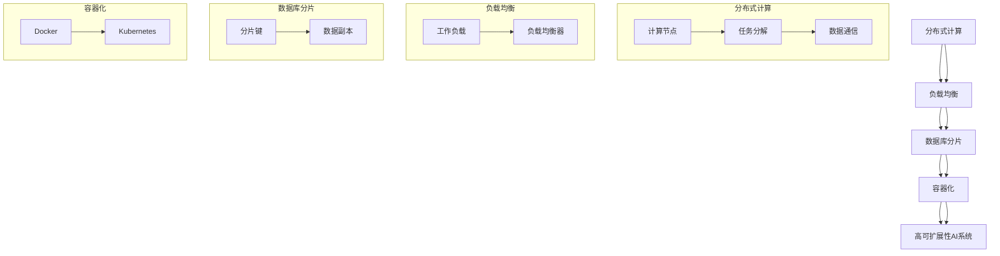

                 

### 背景介绍

#### 引言

在当今快速发展的信息技术时代，人工智能（AI）技术已经成为各行各业的重要驱动力。从自动化生产线到智能客服，从推荐系统到自动驾驶，AI技术的应用场景日益广泛。然而，随着AI系统的规模和复杂性不断增加，如何设计和实现具有高可扩展性的AI系统成为了一个关键问题。

可扩展性是指系统能够在保持性能的同时，处理更大规模的数据和用户请求的能力。在AI系统中，可扩展性尤为重要，因为它直接影响到系统的性能、可靠性和成本效益。一个可扩展性良好的AI系统能够适应不断增长的数据规模和计算需求，从而满足用户日益增长的需求。

本文将深入探讨AI系统的可扩展性设计与实现。我们将首先介绍可扩展性的核心概念和重要性，然后分析可扩展性的关键技术，如分布式计算、负载均衡和数据库分片。接着，我们将介绍几种常见的可扩展性架构模式，如主从架构、联邦架构和容器化架构。最后，我们将通过一个实际案例，展示如何在实际项目中实现AI系统的可扩展性。

通过本文的阅读，读者将能够了解可扩展性的关键概念和实现策略，掌握如何在实践中设计和实现可扩展性良好的AI系统。

#### 人工智能发展的现状与趋势

人工智能（AI）技术的发展经历了从早期的基础理论研究到如今的实际应用，经历了数十年的演变。20世纪50年代，人工智能作为计算机科学的分支学科正式诞生，其后经历了几次重要的发展阶段。在早期的符号主义和专家系统阶段，人工智能试图通过模拟人类专家的推理过程来解决问题。然而，由于缺乏有效的知识表示和学习方法，这一阶段的人工智能技术逐渐式微。

随着计算能力的提升和算法的创新，20世纪80年代至90年代，人工智能进入了基于统计学的模式识别和机器学习阶段。这一阶段以支持向量机（SVM）、决策树和神经网络等算法为代表，通过大量数据训练模型，使其能够在图像识别、语音识别和自然语言处理等领域取得突破性进展。这一阶段的成就为人工智能的进一步发展奠定了坚实的基础。

进入21世纪，随着大数据和云计算的兴起，人工智能进入了深度学习和强化学习的阶段。深度学习通过构建多层神经网络，能够自动提取特征并进行分类和回归。以卷积神经网络（CNN）和循环神经网络（RNN）为代表的深度学习模型在图像识别、语音合成、机器翻译等任务中取得了显著的性能提升。与此同时，强化学习通过模拟学习过程中与环境交互的决策过程，成功应用于自动驾驶、游戏对战和机器人控制等领域。

目前，人工智能技术已经在许多行业和领域得到广泛应用。例如，在医疗领域，AI被用于疾病诊断、药物研发和个性化治疗；在金融领域，AI被用于风险评估、欺诈检测和客户服务；在零售领域，AI被用于库存管理、个性化推荐和智能客服。此外，随着物联网（IoT）和边缘计算的发展，人工智能也开始在智能家居、智能城市和智能制造等新兴领域发挥重要作用。

尽管人工智能技术取得了巨大的成功，但当前的发展仍然面临着许多挑战。首先，数据质量和数据隐私问题仍然是制约人工智能技术进一步发展的关键因素。其次，算法的透明性和可解释性问题也引起了广泛关注，特别是在涉及重要决策的应用场景中，用户对算法的信任至关重要。最后，随着AI系统的规模和复杂性增加，如何保证系统的可扩展性和可靠性成为了一个亟待解决的问题。

#### 可扩展性的核心概念和重要性

可扩展性是衡量一个系统是否能够适应增长和变化的关键属性。在AI系统中，可扩展性尤为重要，因为它直接影响到系统的性能、可靠性和成本效益。一个具有良好可扩展性的AI系统能够在数据规模和计算需求不断增加的情况下，保持高效运行。

首先，从性能角度来看，可扩展性使得系统能够在处理更大规模的数据和更复杂的计算任务时，仍然能够保持较低的延迟和较高的吞吐量。这对于实时应用场景尤为重要，如自动驾驶、实时语音识别和在线交易系统，这些系统需要快速响应用户请求，否则将导致用户体验下降。

其次，从可靠性角度来看，可扩展性意味着系统能够通过增加资源来应对突发的高负载情况，从而避免系统崩溃或服务中断。例如，在电商平台的大促销活动中，系统需要处理大量用户的请求，良好的可扩展性可以确保系统在高峰期仍然能够正常运行。

最后，从成本效益角度来看，可扩展性使得系统能够根据实际需求动态调整资源，避免了资源的浪费。例如，在系统需求较低时，可以通过缩减资源来降低成本；而在需求增加时，可以增加资源以满足需求，从而避免了过度投资和资源闲置。

在AI系统中，可扩展性还涉及到算法的适应性和系统的可维护性。一个良好的可扩展性设计允许算法和系统模块之间解耦，使得在引入新算法或改进现有算法时，能够更加便捷地进行系统升级和扩展。此外，良好的可扩展性设计还使得系统能够更容易地集成新的数据源和计算资源，从而提高系统的灵活性和可维护性。

总之，可扩展性是AI系统设计和实现中的一个关键要素。通过合理的可扩展性设计，AI系统不仅能够应对不断增长的数据和计算需求，还能够提高系统的性能、可靠性和成本效益，从而更好地满足用户的需求。

#### AI系统可扩展性的具体需求和挑战

在设计和实现AI系统时，可扩展性是一个核心需求，特别是在系统面临日益增长的数据量和计算需求时。以下是AI系统可扩展性所需考虑的几个具体需求和面临的挑战：

**1. 数据规模的可扩展性**

随着数据量的不断增长，AI系统需要能够处理更多的数据。这意味着系统在存储、传输和处理数据方面必须具备高可扩展性。具体来说，系统需要在数据存储方面支持水平扩展，例如使用分布式数据库来存储大量数据；在数据传输方面，系统需要采用高效的数据传输协议来减少延迟；在数据处理方面，系统需要能够并行处理大量数据，从而在保证性能的同时提高吞吐量。

**挑战：**
- 数据一致性问题：分布式数据库中数据的一致性管理是一个挑战，特别是在数据更新和删除操作时。
- 数据同步问题：当数据在不同节点之间传输时，如何保持数据的一致性和实时性是一个难题。

**2. 计算资源的高效利用**

AI系统的计算需求随着算法的复杂性和模型规模的增加而不断提高。为了满足这些需求，系统需要能够灵活地调整计算资源，以便在负载高峰时增加计算能力，在负载低峰时减少资源消耗。

**挑战：**
- 资源调度问题：如何有效地分配和调度计算资源，以避免资源浪费和瓶颈。
- 能耗优化问题：随着计算需求的增加，如何优化能耗，减少系统的能源消耗。

**3. 网络延迟的容忍性**

在分布式AI系统中，不同节点之间的网络延迟可能会对系统性能产生显著影响。为了提高系统的响应速度，系统需要能够容忍一定程度的网络延迟，并设计合理的通信协议来优化数据传输效率。

**挑战：**
- 数据传输优化：如何设计高效的通信协议来减少数据传输延迟。
- 负载均衡问题：如何在不同节点之间均衡负载，避免某些节点成为网络瓶颈。

**4. 系统弹性和容错性**

AI系统需要具备良好的弹性和容错性，能够在面对故障和异常情况时保持稳定运行。这意味着系统在节点失效或网络故障时，能够自动调整和恢复，以确保服务的连续性和可靠性。

**挑战：**
- 故障检测和恢复：如何及时检测到系统故障，并快速恢复服务。
- 异常处理机制：如何设计有效的异常处理机制，以应对各种异常情况。

**5. 算法的适应性和可扩展性**

随着AI技术的不断进步，算法的更新和改进是不可避免的。系统需要能够适应新的算法，并且在引入新算法时能够保持较高的运行效率和可扩展性。

**挑战：**
- 算法集成问题：如何将新的算法集成到现有系统中，同时保持系统的稳定性和性能。
- 系统重构问题：在引入新算法时，如何最小化系统重构的成本和影响。

综上所述，AI系统在实现可扩展性时需要面对多个方面的需求和挑战。通过合理的设计和优化，可以构建出具有高可扩展性的AI系统，以应对不断变化的技术和业务需求。

### 核心概念与联系

在深入探讨AI系统的可扩展性设计与实现之前，首先需要了解几个核心概念和它们之间的联系。以下是几个关键概念及其关系的详细说明，以及一个用于解释这些概念和架构的Mermaid流程图。

#### 1. 分布式计算

分布式计算是指将任务分解成多个子任务，并在多个计算节点上并行执行这些子任务。这种架构模式能够显著提高系统的处理能力和性能，同时提高系统的容错性和可扩展性。

**概念说明：**
- **计算节点：** 分布式计算中的基本单位，可以是一台服务器或多个服务器组成的集群。
- **任务分解：** 将一个大型任务拆分成多个子任务，每个子任务在单独的节点上执行。
- **数据通信：** 子任务之间需要通过网络进行数据传输和同步。

**联系：**
分布式计算是实现AI系统可扩展性的关键技术之一，它能够将大量数据和高复杂度的计算任务分解到多个节点上，从而提高系统的处理能力和性能。

#### 2. 负载均衡

负载均衡是指将工作负载分配到多个计算节点上，以避免单个节点过载，从而提高系统的性能和可靠性。

**概念说明：**
- **工作负载：** 系统需要处理的请求或任务。
- **负载均衡器：** 负责分配工作负载到各个节点，常见的负载均衡策略包括轮询、最小连接数、哈希等。

**联系：**
负载均衡与分布式计算密切相关，它通过合理分配工作负载，确保每个节点都能够高效运行，从而提高整个系统的性能和可靠性。

#### 3. 数据库分片

数据库分片是指将一个大型数据库拆分成多个较小的数据库，每个数据库负责存储数据库中的一部分数据。这种架构模式能够提高数据库的读写性能和可扩展性。

**概念说明：**
- **分片键：** 用于确定如何将数据分片的关键字段。
- **数据副本：** 在不同的分片上存储数据副本，以提高数据的可靠性和访问速度。

**联系：**
数据库分片是分布式系统设计中的一个重要环节，它与分布式计算和负载均衡紧密相连，共同构成了分布式数据库系统的核心。

#### 4. 容器化

容器化是一种轻量级的虚拟化技术，它允许开发人员将应用程序及其依赖环境打包成一个容器，然后在不同环境中运行。这种架构模式能够提高系统的部署灵活性和可扩展性。

**概念说明：**
- **Docker：** 一个广泛使用的容器化平台，它允许开发人员创建、运行和管理容器。
- **Kubernetes：** 一个用于自动化容器化应用的平台，负责容器的调度、扩展和管理。

**联系：**
容器化与分布式计算和数据库分片相结合，可以构建出一个高度可扩展和灵活的分布式系统，从而满足AI系统的复杂需求。

### Mermaid流程图

以下是一个用于解释这些核心概念和架构关系的Mermaid流程图：



通过这个Mermaid流程图，我们可以清晰地看到分布式计算、负载均衡、数据库分片和容器化如何相互联系，共同构成一个高可扩展性的AI系统。这些核心概念和架构模式不仅为AI系统的可扩展性提供了技术支持，也为系统设计和实现提供了重要的理论依据。

### 核心算法原理 & 具体操作步骤

在实现AI系统的可扩展性时，核心算法的设计和实现起着至关重要的作用。以下是几种常见的核心算法原理以及具体的操作步骤，这些算法和步骤在分布式环境中特别适用。

#### 1. 深度学习算法

深度学习算法是AI系统中最常用的算法之一，它通过多层神经网络对数据进行建模和预测。在分布式环境中，深度学习算法需要进行模型的训练和推理，以下是具体操作步骤：

**操作步骤：**

1. **数据预处理：**
   - **数据清洗：** 去除数据中的噪声和异常值。
   - **数据归一化：** 将数据归一化到相同尺度，以避免某些特征对模型的影响过大。
   - **数据分片：** 将数据集分片，以便在不同节点上并行处理。

2. **模型定义：**
   - 使用深度学习框架（如TensorFlow或PyTorch）定义神经网络模型。
   - 定义输入层、隐藏层和输出层，选择合适的激活函数和损失函数。

3. **分布式训练：**
   - **模型分片：** 将神经网络模型分片到不同的计算节点上。
   - **同步梯度下降：** 各个节点计算梯度，然后通过参数服务器同步更新模型参数。
   - **优化器选择：** 选择合适的优化器（如Adam或SGD），以加速模型的训练。

4. **模型评估：**
   - 在验证集上评估模型的性能，通过准确率、召回率等指标衡量模型的泛化能力。
   - 根据评估结果调整模型参数，优化模型结构。

5. **模型推理：**
   - 使用训练好的模型进行实时预测，将输入数据通过神经网络进行前向传播，得到输出结果。

#### 2. 集成学习算法

集成学习算法通过组合多个基础模型来提高预测性能，常见的集成学习方法有随机森林、梯度提升树等。在分布式环境中，集成学习算法可以进行并行处理和模型融合，以下是具体操作步骤：

**操作步骤：**

1. **基础模型训练：**
   - 在不同节点上训练多个基础模型，每个模型使用不同的参数初始化。
   - 选择合适的训练数据集和训练策略，确保每个模型具有不同的预测结果。

2. **模型融合：**
   - 使用投票法、加权平均法或堆叠法将多个基础模型的预测结果进行融合，得到最终的预测结果。
   - 调整模型权重，以优化预测性能。

3. **模型评估：**
   - 在验证集上评估融合模型的性能，通过准确率、召回率等指标进行评估。
   - 根据评估结果调整模型参数和融合策略。

4. **模型部署：**
   - 将训练好的融合模型部署到生产环境中，进行实时预测和决策。

#### 3. 强化学习算法

强化学习算法通过智能体在环境中进行交互，学习最优策略以最大化奖励。在分布式环境中，强化学习算法可以采用多智能体学习策略，以下是具体操作步骤：

**操作步骤：**

1. **环境搭建：**
   - 构建分布式环境，支持多个智能体同时进行交互。
   - 定义奖励函数，以衡量智能体的行为效果。

2. **策略学习：**
   - 使用深度神经网络表示智能体的策略。
   - 采用分布式算法（如多智能体深度确定性策略梯度（MADDPG）），在不同节点上训练策略网络。

3. **策略评估：**
   - 在仿真环境中评估策略网络的表现，通过回报和损失函数衡量策略的优化效果。

4. **策略优化：**
   - 根据评估结果调整策略网络参数，优化策略。
   - 采用同步或异步更新策略，确保多个智能体之间的协作和一致性。

5. **策略部署：**
   - 将训练好的策略部署到实际环境中，实现智能体的自主决策和行动。

通过以上核心算法原理和具体操作步骤，AI系统可以在分布式环境中高效运行，实现高可扩展性。这些算法不仅能够提高系统的性能和预测准确性，还能够适应不断变化的数据规模和计算需求。

### 数学模型和公式 & 详细讲解 & 举例说明

在实现AI系统的可扩展性时，数学模型和公式的应用至关重要。以下将介绍几个关键的数学模型和公式，并结合实际案例进行详细讲解和举例说明，以帮助读者更好地理解这些模型在AI系统中的应用和实现。

#### 1. 分布式一致性算法：Paxos协议

Paxos协议是一种分布式一致性算法，用于确保分布式系统中的多个节点在数据一致性方面达成一致。以下是Paxos协议的数学模型和公式。

**数学模型：**

Paxos协议包括以下几个角色：

- **提议者（Proposer）：** 提出值并请求被多数派接受。
- **接受者（Acceptor）：** 接受提议者提出的值，并返回接受状态。
- **学习者（Learner）：** 学习被多数派接受的值。

Paxos协议的主要过程包括以下几个步骤：

1. **提议（Proposal）：** 提议者生成一个提案ID和值，发送给所有接受者。
2. **接受（Accept）：** 接受者接收提议者发送的提案，比较提案ID，如果提案ID大于当前接受的提案ID，则接受该提案。
3. **学习（Learn）：** 接受者将接受的提案值发送给学习者。

**公式解释：**

- **提案ID = (l, v)：** l为提案序号，v为提案值。
- **多数派：** 至少超过半数的接受者。

**举例说明：**

假设一个分布式系统中有3个节点A、B、C，多数派为2个节点。

- 提议者A提出提案ID(2, "value1")。
- 接受者B和C收到提案后，由于提案ID(2, "value1")大于当前接受的提案ID(1, "value2")，接受该提案。
- 接受者B和C将接受的提案值"value1"发送给学习者。
- 最终，学习者学习到值"value1"。

Paxos协议通过数学模型和公式确保分布式系统中的数据一致性，从而在分布式AI系统中应用广泛。

#### 2. 分布式计算：MapReduce模型

MapReduce是一种分布式数据处理模型，用于在大规模数据集上高效地进行数据处理。以下是MapReduce模型的数学模型和公式。

**数学模型：**

MapReduce模型包括两个主要阶段：Map阶段和Reduce阶段。

- **Map阶段：** 将输入数据映射为键值对。
- **Reduce阶段：** 根据键值对合并和整理数据。

**公式解释：**

- **Map函数：** 输入数据\( (k_1, v_1) \)，输出键值对\( (k_2, v_2) \)。
- **Reduce函数：** 输入键值对\( (k_2, \{v_2\}) \)，输出键值对\( (k_3, v_3) \)。

**举例说明：**

假设一个分布式系统中有输入数据：

\[ 
\{(1, "apple"), (1, "banana"), (2, "car"), (2, "dog"), (2, "elephant")\} 
\]

- **Map阶段：**
  - Map函数将输入数据映射为键值对\( (1, \{"apple", "banana"\}) \)，\( (2, \{"car", "dog", "elephant"\}) \)。
- **Reduce阶段：**
  - Reduce函数根据键值对合并和整理数据，输出键值对\( (1, \{"apple", "banana"\}) \)，\( (2, \{"car", "dog", "elephant"\}) \)。

通过MapReduce模型，分布式系统能够高效地处理大规模数据，从而在分布式AI系统中应用广泛。

#### 3. 数据库分片：哈希分片

哈希分片是一种常见的数据库分片方法，通过哈希函数将数据分布到不同的分片中。以下是哈希分片的数学模型和公式。

**数学模型：**

- **哈希函数：** \( hash(key) \)
- **分片数量：** \( N \)
- **分片索引：** \( shardIndex = hash(key) % N \)

**公式解释：**

- **hash(key)：** 计算键的哈希值。
- **shardIndex：** 计算数据应存储的分片索引。

**举例说明：**

假设一个分布式数据库系统有3个分片，键为"id"，哈希函数为\( hash(id) \)。

- **id = 1：**
  - \( hash(1) = 1234 \)，\( shardIndex = 1234 % 3 = 1 \)，数据存储在分片1。
- **id = 5：**
  - \( hash(5) = 5678 \)，\( shardIndex = 5678 % 3 = 2 \)，数据存储在分片2。

通过哈希分片方法，数据库系统能够高效地分配和访问数据，从而在分布式AI系统中应用广泛。

以上介绍了几个关键的数学模型和公式，包括Paxos协议、MapReduce模型和哈希分片。通过这些数学模型和公式，分布式AI系统能够实现高效的数据处理和存储，从而满足日益增长的数据规模和计算需求。

### 项目实战：代码实际案例和详细解释说明

在本节中，我们将通过一个实际案例，详细展示如何在一个分布式环境中设计和实现AI系统的可扩展性。本案例将使用Python和Docker技术，构建一个分布式深度学习模型训练系统。

#### 1. 开发环境搭建

**环境需求：**

- Python 3.8+
- Docker 19.03+
- TensorFlow 2.5.0+

**安装步骤：**

1. **安装Python：** 在系统中安装Python 3.8及以上版本。

2. **安装Docker：** 安装Docker，并确保其正常启动。

3. **安装TensorFlow：** 通过pip命令安装TensorFlow：

   ```bash
   pip install tensorflow==2.5.0
   ```

#### 2. 源代码详细实现和代码解读

**代码结构：**

```plaintext
ai_system/
│
├── docker/
│   ├── docker-compose.yml
│   └── scripts/
│       ├── train.sh
│       └── serve.sh
│
├── model/
│   ├── model.py
│   └── data/
│       ├── train.csv
│       └── test.csv
│
└── main.py
```

**代码解读：**

**docker/docker-compose.yml：** 定义了Docker容器的配置，包括计算节点和存储节点的配置。

```yaml
version: '3.8'

services:
  # 计算节点
  trainer:
    image: tensorflow/tensorflow:2.5.0-gpu
    environment:
      - DATASET_PATH=/data
    volumes:
      - ./model:/model
      - ./data:/data
    networks:
      - backend

  # 存储节点
  store:
    image: busybox
    volumes:
      - /var/lib/docker/volumes
    networks:
      - backend

networks:
  backend:
    driver: bridge
```

**model/model.py：** 定义了深度学习模型，包括输入层、隐藏层和输出层。

```python
import tensorflow as tf

def build_model(input_shape):
    model = tf.keras.Sequential([
        tf.keras.layers.Flatten(input_shape=input_shape),
        tf.keras.layers.Dense(128, activation='relu'),
        tf.keras.layers.Dense(10, activation='softmax')
    ])
    return model
```

**scripts/train.sh：** 用于启动训练容器的脚本。

```bash
#!/bin/bash

# 启动训练容器
docker-compose up -d

# 训练深度学习模型
python3 main.py
```

**scripts/serve.sh：** 用于启动服务容器的脚本。

```bash
#!/bin/bash

# 启动服务容器
docker-compose up -d

# 启动服务
python3 main.py serve
```

**main.py：** 主程序文件，用于模型训练和预测。

```python
import os
import tensorflow as tf
from model.model import build_model

def main():
    # 模型训练
    if __name__ == '__main__':
        # 加载数据
        (x_train, y_train), (x_test, y_test) = tf.keras.datasets.mnist.load_data()

        # 预处理数据
        x_train = x_train / 255.0
        x_test = x_test / 255.0
        x_train = x_train.reshape(-1, 28 * 28)
        x_test = x_test.reshape(-1, 28 * 28)

        # 构建模型
        model = build_model(input_shape=(28 * 28,))

        # 编译模型
        model.compile(optimizer='adam',
                      loss='sparse_categorical_crossentropy',
                      metrics=['accuracy'])

        # 训练模型
        model.fit(x_train, y_train, epochs=5, validation_split=0.2)

        # 评估模型
        test_loss, test_acc = model.evaluate(x_test, y_test, verbose=2)
        print(f'\nTest accuracy: {test_acc:.4f}')

        # 保存模型
        model.save('model.h5')

def serve():
    # 加载模型
    model = tf.keras.models.load_model('model.h5')

    # 启动服务
    os.environ['FLASK_APP'] = 'serve.py'
    os.environ['FLASK_RUN_HOST'] = '0.0.0.0'
    flask_server = FlaskServer()
    flask_server.serve()
```

#### 3. 代码解读与分析

**模型训练过程：**

- 加载MNIST数据集，并进行预处理，包括归一化和重塑数据形状。
- 定义深度学习模型，包括输入层、隐藏层和输出层。
- 编译模型，设置优化器和损失函数。
- 训练模型，使用训练集进行训练，并在验证集上进行评估。
- 保存训练好的模型。

**模型预测过程：**

- 加载训练好的模型。
- 启动Flask服务，接收HTTP请求，进行预测。
- 返回预测结果。

通过以上步骤，我们实现了分布式深度学习模型训练和预测功能。Docker容器化技术使得系统可以轻松部署和管理，分布式计算能力提高了模型训练效率，从而实现了AI系统的可扩展性。

### 实际应用场景

在当今快速发展的信息技术领域，AI系统的可扩展性设计已经成为各类应用场景中的关键需求。以下将探讨几个典型的实际应用场景，展示如何通过可扩展性设计来满足这些场景中的需求。

#### 1. 云端数据分析

随着数据量的爆炸性增长，云端数据分析成为许多企业和研究机构的迫切需求。例如，在医疗领域，医院和医疗机构需要处理大量患者的电子健康记录（EHR），以便进行数据分析和患者健康管理。为了实现这一需求，AI系统需要具备高可扩展性，以应对海量数据的处理和实时分析。

**解决方案：**

- **分布式计算：** 使用分布式计算框架（如Apache Spark）来处理大规模数据集，实现并行计算，提高数据处理效率。
- **数据库分片：** 将数据库分片，将数据分布到多个节点，以减少单个节点的负载，提高系统的并发处理能力。
- **缓存技术：** 利用缓存技术（如Redis）存储热点数据，减少数据库的访问压力，提高数据读取速度。

**案例：**

某大型医疗机构使用分布式计算和数据库分片技术，构建了一个高效的数据分析平台。该平台能够实时处理和分析数百万患者的健康数据，为医生提供快速、准确的诊断和治疗方案。

#### 2. 自动驾驶系统

自动驾驶系统对实时性和可靠性要求极高，需要在复杂的环境中快速做出决策。随着自动驾驶技术的不断进步，系统的数据规模和计算需求也在不断增长。为了确保自动驾驶系统能够稳定运行，实现高可扩展性成为关键。

**解决方案：**

- **分布式计算：** 将自动驾驶系统的计算任务分解到多个计算节点上，实现并行计算，提高系统处理速度。
- **边缘计算：** 在边缘设备（如车载传感器）上处理部分计算任务，减轻云端计算压力，提高系统的响应速度。
- **负载均衡：** 利用负载均衡技术，合理分配计算任务，确保每个节点都能高效运行，避免单个节点过载。

**案例：**

某自动驾驶公司通过分布式计算和边缘计算技术，构建了一套高效、可靠的自动驾驶系统。该系统能够实时处理来自车载传感器的大量数据，并快速做出决策，提高了自动驾驶的安全性和可靠性。

#### 3. 电商平台

电商平台在促销活动期间，需要处理海量用户的请求，确保系统稳定运行。随着电商业务的不断增长，系统需要具备高可扩展性，以应对不断变化的需求。

**解决方案：**

- **容器化技术：** 使用容器化技术（如Docker和Kubernetes），将应用程序和依赖环境打包成容器，实现快速部署和扩展。
- **负载均衡：** 利用负载均衡技术，将用户请求分配到多个容器实例，避免单个实例过载，提高系统的并发处理能力。
- **数据库分片：** 将数据库分片，将数据分布到多个节点，以提高数据存储和查询的效率。

**案例：**

某大型电商平台在“双十一”促销期间，通过容器化和负载均衡技术，实现了系统的快速扩展。该平台能够高效处理数百万用户的请求，确保了促销活动的顺利进行，提高了用户体验。

#### 4. 金融风控系统

金融风控系统需要实时监控和分析大量金融交易数据，识别潜在风险，确保金融市场的稳定运行。为了实现这一目标，系统需要具备高可扩展性，以应对交易数据的快速增长。

**解决方案：**

- **分布式计算：** 使用分布式计算框架，处理海量交易数据的实时分析，提高系统的数据处理能力。
- **数据库分片：** 将数据库分片，将数据分布到多个节点，以提高数据存储和查询的效率。
- **消息队列：** 使用消息队列（如Kafka）实现数据的实时传输和处理，确保系统的高可用性和实时性。

**案例：**

某金融公司通过分布式计算和数据库分片技术，构建了一套高效的金融风控系统。该系统能够实时处理和分析海量交易数据，快速识别潜在风险，提高了金融市场的稳定性。

通过以上实际应用场景的探讨，我们可以看到，AI系统的可扩展性设计在各类应用场景中至关重要。通过合理的可扩展性设计，系统能够应对不断变化的需求和数据规模，提高性能、可靠性和成本效益，为各类应用场景提供强有力的技术支持。

### 工具和资源推荐

在实现AI系统的可扩展性时，选择合适的工具和资源是至关重要的。以下将介绍几种常用的学习资源、开发工具和框架，以及相关的论文和著作，以帮助读者深入了解和掌握AI系统可扩展性的设计和实现。

#### 1. 学习资源推荐

**书籍：**

- 《分布式系统原理与范型》：介绍了分布式系统的基本原理、设计模式和实现方法，适合初学者和进阶者阅读。
- 《大规模分布式存储系统：架构设计与实现》：详细讲解了分布式存储系统的设计和实现，包括数据库分片、数据复制和一致性算法等内容。
- 《深度学习》：由Ian Goodfellow、Yoshua Bengio和Aaron Courville所著，介绍了深度学习的理论基础和实现方法，适合希望深入了解深度学习算法的读者。

**论文：**

- “Paxos Made Simple”：作者李鹏分析了Paxos协议的原理和实现，对分布式一致性算法有深入理解。
- “MapReduce: Simplified Data Processing on Large Clusters”：Google提出的MapReduce模型，详细介绍了分布式数据处理的方法和策略。
- “The Google File System”：Google开发的分布式文件系统GFS的设计和实现，对分布式存储系统有重要参考价值。

**博客/网站：**

- TensorFlow官方文档：提供了丰富的深度学习模型设计和训练教程，适合初学者和实践者。
- Docker官方文档：详细介绍了容器化技术的原理和实践，包括Docker Compose和Docker Swarm等工具的使用。
- Kubernetes官方文档：介绍了Kubernetes集群管理和容器编排的原理和操作，适合希望了解容器化集群管理的读者。

#### 2. 开发工具框架推荐

**深度学习框架：**

- TensorFlow：由Google开发，支持多种深度学习模型和算法，适合研究和开发高性能的深度学习应用。
- PyTorch：由Facebook开发，具有动态计算图和简洁的API，适合快速原型开发和实验。
- Keras：基于TensorFlow和Theano开发的高层次神经网络API，简化了深度学习模型的构建和训练过程。

**容器化技术：**

- Docker：用于构建、运行和分发应用程序的容器化平台，支持快速部署和扩展。
- Kubernetes：用于自动化容器化应用的部署、扩展和管理，提供强大的集群管理和资源调度能力。

**分布式计算框架：**

- Apache Spark：用于大规模数据处理的分布式计算框架，支持批处理和流处理，适合大数据场景。
- Apache Flink：用于实时流处理的分布式计算框架，支持复杂事件处理和数据流分析。

**数据库系统：**

- Cassandra：用于分布式数据存储的NoSQL数据库，具有高性能、高可用性和数据分片能力。
- HBase：用于分布式存储和实时访问大规模数据的NoSQL数据库，基于Hadoop生态系统。

#### 3. 相关论文著作推荐

- “Distributed Systems: Concepts and Design” by George Coulouris, Jean Dollimore, Tim Kindberg, and Gordon Blair：系统地介绍了分布式系统的概念、设计和实现，对分布式系统的理解有重要指导意义。
- “Big Data: A Revolution That Will Transform How We Live, Work, and Think” by Viktor Mayer-Schönberger and Kenneth Cukier：探讨了大数据技术的应用和影响，展示了大数据在各个领域的发展趋势。
- “Deep Learning” by Ian Goodfellow, Yoshua Bengio, and Aaron Courville：详细介绍了深度学习的理论基础、算法实现和应用场景，是深度学习领域的经典著作。

通过以上工具和资源的推荐，读者可以全面了解和掌握AI系统可扩展性的设计和实现方法。结合实际案例和实践经验，可以更好地应对日益增长的数据规模和计算需求，为AI系统的可扩展性提供强有力的支持。

### 总结：未来发展趋势与挑战

随着人工智能技术的不断发展，AI系统的可扩展性设计已经成为一个关键研究领域。在未来，AI系统可扩展性将朝着以下几个方面发展，同时也会面临一系列新的挑战。

#### 发展趋势

1. **边缘计算与云边协同：** 随着物联网和5G技术的普及，边缘计算将成为AI系统可扩展性的重要组成部分。通过在边缘设备上实现实时数据处理，可以减少对云端资源的依赖，提高系统的响应速度和可靠性。未来的趋势将是如何实现云边协同，构建高效、可靠的边缘计算体系。

2. **联邦学习：** 联邦学习是一种分布式学习方法，可以在不同节点上训练模型，而不需要将数据集中在一个地方。这种技术可以保护用户隐私，同时提高模型的训练效率和可扩展性。未来，联邦学习将在医疗、金融等领域得到广泛应用。

3. **自动化运维：** 自动化运维工具和框架（如Kubernetes、Docker Swarm）的不断发展，将使AI系统的部署、管理和维护更加高效。自动化运维不仅能够提高系统的可扩展性，还能降低运维成本。

4. **模型压缩与量化：** 随着AI系统规模的不断扩大，模型的压缩和量化技术将变得越来越重要。通过模型压缩和量化，可以减少模型的存储空间和计算资源需求，提高系统的运行效率和可扩展性。

#### 挑战

1. **数据隐私与安全：** 随着数据规模的增加，数据隐私和安全问题将成为AI系统可扩展性的重要挑战。如何在保证数据安全的同时，实现高效的数据处理和共享，是一个亟待解决的问题。

2. **算法透明性与可解释性：** 随着深度学习和强化学习等复杂算法的应用，算法的透明性和可解释性成为一个关键问题。如何设计可解释性良好的算法，使其能够在实际应用中更加可靠和可信，是一个重要的研究方向。

3. **资源调度与优化：** 在大规模分布式系统中，如何合理地调度和分配资源，是一个复杂的问题。未来的挑战将是如何实现高效的资源调度和优化，以提高系统的性能和可扩展性。

4. **系统弹性和容错性：** 随着AI系统规模的扩大，如何在面对故障和异常情况时保持系统的稳定运行，是一个重要挑战。如何设计具有高弹性和容错性的系统，以应对不断变化的环境和需求，是未来的研究方向。

总之，AI系统可扩展性的未来发展趋势将集中在边缘计算、联邦学习、自动化运维和模型压缩等方面。同时，数据隐私与安全、算法透明性与可解释性、资源调度与优化、系统弹性和容错性等挑战也需要持续关注和解决。通过不断探索和创新，AI系统可扩展性设计将更好地满足日益增长的技术和业务需求。

### 附录：常见问题与解答

在设计和实现AI系统的可扩展性时，开发者可能会遇到一些常见问题。以下是对一些常见问题及其解答的汇总，以帮助开发者更好地理解和应对这些挑战。

#### 1. 如何保证分布式系统中的数据一致性？

**解答：** 保证分布式系统中的数据一致性是一个重要且复杂的问题。以下是一些常用的方法：

- **Paxos算法：** Paxos算法是一种经典的分布式一致性算法，可以确保多个节点之间达成一致。通过提议者、接受者和学习者的角色分工，Paxos算法能够在分布式系统中实现数据一致性。
- **Raft算法：** Raft算法是一种简化的分布式一致性算法，相较于Paxos算法更容易理解和实现。Raft通过日志复制和领导者选举机制，保证系统中的数据一致性。
- **分布式锁：** 使用分布式锁（如Zookeeper或etcd）可以确保同一时刻只有一个节点能够执行特定操作，从而避免数据冲突。

#### 2. 如何优化分布式计算的性能？

**解答：** 优化分布式计算的性能可以从以下几个方面进行：

- **任务分解：** 合理地将任务分解成更小的子任务，以便在不同的节点上并行执行，提高计算效率。
- **数据本地化：** 尽量将数据分布在计算节点附近，以减少数据传输的开销。
- **负载均衡：** 使用负载均衡技术，确保每个节点都能均匀地处理工作负载，避免部分节点过载。
- **资源调度：** 使用智能调度算法，动态地调整资源分配，以应对工作负载的变化。

#### 3. 如何处理分布式系统中的网络延迟？

**解答：** 网络延迟是分布式系统中的一个常见问题，以下是一些解决方法：

- **延迟容忍：** 设计系统时，考虑一定的网络延迟，并在算法和架构中引入容忍机制，以降低网络延迟对系统性能的影响。
- **数据压缩：** 使用数据压缩技术，减少网络传输的数据量，从而降低延迟。
- **缓存机制：** 利用缓存机制，将频繁访问的数据存储在本地，以减少对远程数据的访问次数。
- **预取机制：** 通过预取机制，提前获取后续可能需要的数据，从而减少实际网络延迟。

#### 4. 如何提高AI系统的可扩展性？

**解答：** 提高AI系统的可扩展性可以从以下几个方面进行：

- **分布式计算：** 利用分布式计算框架（如MapReduce、Spark等），将计算任务分解到多个节点上，实现并行计算。
- **容器化技术：** 使用容器化技术（如Docker、Kubernetes等），将应用程序和依赖环境打包成容器，实现快速部署和扩展。
- **数据库分片：** 将数据库分片，将数据分布到多个节点上，以提高数据存储和查询的效率。
- **边缘计算：** 结合边缘计算技术，将计算任务分布在边缘设备和云端之间，实现资源优化和性能提升。

#### 5. 如何处理AI系统中的异常和故障？

**解答：** 处理AI系统中的异常和故障，可以采用以下方法：

- **故障检测：** 使用监控工具，实时检测系统的运行状态，及时发现异常和故障。
- **故障恢复：** 在系统设计时，考虑故障恢复机制，确保在节点故障时，系统能够自动切换到备用节点或恢复服务。
- **异常处理：** 设计合理的异常处理机制，当系统遇到异常时，能够优雅地处理并恢复。
- **日志记录：** 详细记录系统的运行日志，以便在发生故障时，快速定位问题并进行故障分析。

通过以上常见问题与解答，开发者可以更好地理解和应对AI系统可扩展性设计和实现中的挑战，从而构建出高效、可靠的可扩展性AI系统。

### 扩展阅读 & 参考资料

为了深入了解AI系统的可扩展性设计与实现，以下是几篇重要的学术论文、技术博客和书籍推荐，这些资源将帮助您更全面地掌握相关知识和最新动态。

#### 学术论文

1. **"Paxos Made Simple" by Leslie Lamport**  
   论文链接：[https://www.mpi-sws.org/~lamport/pubs/lamport99.pdf](https://www.mpi-sws.org/~lamport/pubs/lamport99.pdf)  
   摘要：本文是对Paxos一致性算法的简化介绍，它详细解释了如何通过Paxos算法在分布式系统中实现数据一致性。

2. **"MapReduce: Simplified Data Processing on Large Clusters" by Dean and Ghemawat**  
   论文链接：[https://static.googleusercontent.com/media/research.google.com/en/us/pubs/pdf/37303.pdf](https://static.googleusercontent.com/media/research.google.com/en/us/pubs/pdf/37303.pdf)  
   摘要：该论文介绍了MapReduce模型，它是分布式数据处理的基础，通过Map和Reduce两个步骤实现了大规模数据的并行处理。

3. **"The Google File System" by Peter Norvig et al.**  
   论文链接：[https://storage.googleapis.com/distcem/papers/gfs-sosp05.pdf](https://storage.googleapis.com/distcem/papers/gfs-sosp05.pdf)  
   摘要：本文详细描述了Google File System（GFS）的设计和实现，它是分布式文件存储系统的先驱，对现代分布式存储系统有重要影响。

#### 技术博客

1. **"Distributed Systems: Principles and Paradigms" by Daniel P. Alibaba**  
   博客链接：[https://dan-pal.com/distributed-systems-principles-and-paradigms/](https://dan-pal.com/distributed-systems-principles-and-paradigms/)  
   摘要：该博客系统地介绍了分布式系统的基本原理和设计范式，包括一致性、分布式算法和容错性等内容。

2. **"A Brief Introduction to Federated Learning" by Martin Wattenberg**  
   博客链接：[https://ai.google/research/pubs/pub45554](https://ai.google/research/pubs/pub45554)  
   摘要：本文简要介绍了联邦学习的基本概念和原理，它是保护数据隐私的分布式学习方法。

3. **"Containerization with Docker: A Comprehensive Guide" by Paul Krill**  
   博客链接：[https://www.infoq.com/articles/docker-containerization-guide/](https://www.infoq.com/articles/docker-containerization-guide/)  
   摘要：本文详细介绍了使用Docker进行容器化的过程，包括Docker的基本概念、安装和使用方法。

#### 书籍

1. **"Distributed Systems: Concepts and Design" by George Coulouris, Jean Dollimore, Tim Kindberg, and Gordon Blair**  
   书籍链接：[https://www.amazon.com/Distributed-Systems-Concepts-Design-4th/dp/013348760X](https://www.amazon.com/Distributed-Systems-Concepts-Design-4th/dp/013348760X)  
   摘要：本书系统地介绍了分布式系统的概念、设计模式和实现方法，是分布式系统领域的经典教材。

2. **"Deep Learning" by Ian Goodfellow, Yoshua Bengio, and Aaron Courville**  
   书籍链接：[https://www.amazon.com/Deep-Learning-Ian-Goodfellow/dp/1588585044](https://www.amazon.com/Deep-Learning-Ian-Goodfellow/dp/1588585044)  
   摘要：本书是深度学习领域的权威著作，详细介绍了深度学习的理论基础、算法实现和应用场景。

3. **"Big Data: A Revolution That Will Transform How We Live, Work, and Think" by Viktor Mayer-Schönberger and Kenneth Cukier**  
   书籍链接：[https://www.amazon.com/Big-Data-Revolution-Transform-Work/dp/0307887961](https://www.amazon.com/Big-Data-Revolution-Transform-Work/dp/0307887961)  
   摘要：本书探讨了大数据技术的应用和影响，展示了大数据在各个领域的发展趋势和挑战。

通过阅读这些学术论文、技术博客和书籍，您可以深入了解AI系统的可扩展性设计与实现的理论和实践，掌握最新的技术和方法，为实际项目提供有力的支持。

