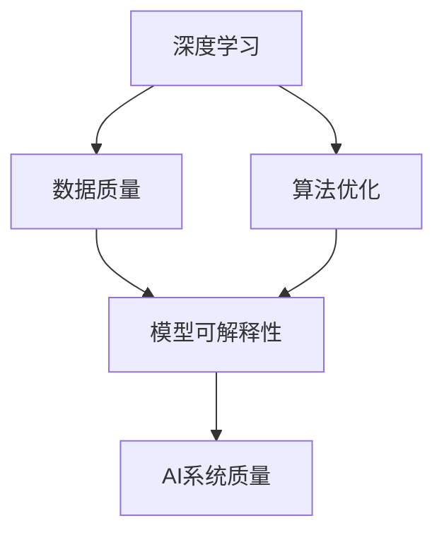

                 

### 背景介绍 Background Introduction

在当今数字化时代，人工智能（AI）技术已经成为推动社会发展的重要力量。无论是自动驾驶、智能助手，还是推荐系统、医疗诊断，AI系统的应用场景越来越广泛。然而，随着AI系统的复杂性和规模不断扩大，如何保证AI系统的质量和可靠性成为一个亟待解决的问题。

传统的软件质量保证方法，如代码审查、测试和部署监控等，已经不足以应对AI系统特有的挑战。首先，AI系统依赖于大量的数据和复杂的算法，其性能和准确性容易受到数据质量和算法设计的影响。其次，AI系统的学习和适应能力使其行为难以预测和控制，增加了质量保证的难度。此外，随着AI系统的广泛应用，其安全性、隐私保护等问题也日益凸显。

因此，有必要探索一种新的AI系统质量保证范式，以应对这些挑战。本文旨在提出一种基于深度学习和模型可解释性的新方法，通过系统化的分析和实践，提高AI系统的质量和可靠性。本文将首先介绍当前AI系统质量保证面临的主要问题，然后阐述本文的核心概念和方法，最后通过具体案例展示其实际应用效果。

首先，我们需要明确AI系统的质量保证目标，这包括性能、准确性、稳定性、安全性和可解释性等方面。性能和准确性是评价AI系统优劣的基本指标，而稳定性和安全性则是保障系统正常运行和用户数据安全的重要保障。可解释性则有助于提高用户对AI系统的信任和理解，促进其更广泛的应用。

然而，要实现这些目标，需要克服许多技术和实际操作上的困难。例如，如何在海量数据中快速、准确地检测和修复错误？如何确保AI系统的行为可预测和可控？如何在不损害性能的情况下提高系统的可解释性？这些都是本文需要深入探讨的问题。

总之，本文将从理论和实践两个方面，探讨AI系统质量保证的新范式，旨在为AI系统开发者和研究者提供有价值的参考和指导。在接下来的章节中，我们将详细分析当前AI系统质量保证面临的主要挑战，并介绍本文的核心概念和方法。

### 核心概念与联系 Core Concepts and Relationships

要理解AI系统质量保证的新范式，我们首先需要明确几个核心概念，并探讨它们之间的相互关系。这些核心概念包括深度学习、模型可解释性、数据质量和算法优化等。

#### 深度学习（Deep Learning）

深度学习是一种基于多层神经网络的学习方法，通过逐层提取特征，从原始数据中自动学习复杂的模式。它已经成为AI领域的核心技术，广泛应用于图像识别、自然语言处理、语音识别等领域。深度学习的核心优势在于其强大的特征提取能力和自动化的模式识别能力，这使得它能够处理大量复杂的数据。

然而，深度学习的黑盒特性也带来了一定的挑战。由于其内部结构复杂，难以解释和理解，导致用户对其决策过程缺乏透明性。这使得在保证AI系统质量时，如何确保深度学习的准确性和可解释性成为一个关键问题。

#### 模型可解释性（Model Explainability）

模型可解释性是指理解和解释AI模型决策过程的能力。在AI系统的质量保证中，模型可解释性具有重要意义。首先，它有助于提高用户对AI系统的信任，使其更易于接受和采纳。其次，通过理解模型决策过程，可以更容易地发现和修复潜在的错误，提高系统的稳定性。

目前，有许多方法可以提升模型的可解释性，包括可视化、敏感性分析、局部解释等。这些方法可以帮助我们理解模型如何处理特定输入，以及在不同条件下的表现。

#### 数据质量（Data Quality）

数据质量是AI系统性能和准确性的基础。高质量的数据能够提高模型的性能，而数据中的噪声和错误则会降低模型的准确性。因此，在AI系统的质量保证中，数据质量至关重要。这包括数据的完整性、一致性、准确性、时效性和可靠性等方面。

为了确保数据质量，我们需要采取一系列措施，如数据清洗、数据增强、数据验证等。这些措施有助于提高数据的可用性，从而提升AI系统的性能。

#### 算法优化（Algorithm Optimization）

算法优化是提高AI系统性能和稳定性的关键。通过优化算法，我们可以减少计算复杂度，提高模型的学习效率和预测准确性。常见的算法优化方法包括模型压缩、超参数调优、训练策略优化等。

算法优化不仅有助于提高AI系统的性能，还可以提高其可解释性。例如，通过简化模型结构，可以降低模型的复杂度，使其更易于理解和解释。

#### 关系与相互影响

深度学习、模型可解释性、数据质量和算法优化之间存在着密切的相互关系。首先，深度学习是AI系统的核心，其性能和可解释性直接影响到AI系统的质量。其次，数据质量是深度学习的基础，高质量的数据能够提高模型的准确性和稳定性。最后，算法优化不仅有助于提高模型的性能，还可以提高其可解释性。

为了更好地理解这些概念之间的关系，我们可以使用Mermaid流程图来展示它们之间的交互过程。以下是该流程图的示例：



在这个流程图中，深度学习、数据质量、算法优化和模型可解释性构成了一个闭环，它们相互影响，共同决定了AI系统的质量。

通过深入理解这些核心概念和它们之间的相互关系，我们可以更好地设计和优化AI系统，从而实现高质量保证。在接下来的章节中，我们将进一步探讨这些概念的具体应用，并介绍本文的核心方法。

### 核心算法原理 & 具体操作步骤 Core Algorithm Principles and Implementation Steps

为了实现AI系统的质量保证，我们需要一种高效且可靠的算法。本文提出了一种基于深度学习和模型可解释性的新方法，该方法包括以下几个核心步骤：

#### 1. 数据预处理（Data Preprocessing）

首先，对输入数据进行预处理。这一步包括数据清洗、数据增强和数据标准化等操作。数据清洗旨在去除数据中的噪声和错误，提高数据质量。数据增强则通过生成更多的样本来增加数据的多样性和丰富性，从而提高模型的泛化能力。数据标准化则通过缩放数据，使其具有相似的尺度和范围，便于后续处理。

具体操作步骤如下：

1. **数据清洗**：使用数据清洗工具，如Pandas库，删除缺失值、异常值和重复值。
   ```python
   import pandas as pd
   data = pd.read_csv('data.csv')
   data.dropna(inplace=True)
   data.drop_duplicates(inplace=True)
   ```

2. **数据增强**：使用数据增强库，如ImageDataGenerator，生成更多的训练样本。
   ```python
   from tensorflow.keras.preprocessing.image import ImageDataGenerator
   datagen = ImageDataGenerator(rotation_range=20, width_shift_range=0.2, height_shift_range=0.2, shear_range=0.2, zoom_range=0.2, horizontal_flip=True, fill_mode='nearest')
   datagen.fit(x_train)
   ```

3. **数据标准化**：使用标准化库，如scikit-learn，对数据进行标准化处理。
   ```python
   from sklearn.preprocessing import StandardScaler
   scaler = StandardScaler()
   x_train = scaler.fit_transform(x_train)
   x_test = scaler.transform(x_test)
   ```

#### 2. 构建深度学习模型（Building Deep Learning Model）

接下来，构建一个深度学习模型。本文采用卷积神经网络（CNN）作为基础模型，因为它在图像识别任务中表现出色。我们可以使用TensorFlow和Keras等深度学习框架来构建模型。

具体操作步骤如下：

1. **定义模型结构**：定义输入层、卷积层、池化层和全连接层的结构。
   ```python
   from tensorflow.keras.models import Sequential
   from tensorflow.keras.layers import Conv2D, MaxPooling2D, Flatten, Dense

   model = Sequential([
       Conv2D(32, (3, 3), activation='relu', input_shape=(64, 64, 3)),
       MaxPooling2D((2, 2)),
       Conv2D(64, (3, 3), activation='relu'),
       MaxPooling2D((2, 2)),
       Flatten(),
       Dense(128, activation='relu'),
       Dense(1, activation='sigmoid')
   ])
   ```

2. **编译模型**：设置模型的优化器、损失函数和评估指标。
   ```python
   model.compile(optimizer='adam', loss='binary_crossentropy', metrics=['accuracy'])
   ```

3. **训练模型**：使用预处理后的数据训练模型。
   ```python
   model.fit(x_train, y_train, epochs=10, batch_size=32, validation_data=(x_test, y_test))
   ```

#### 3. 模型可解释性分析（Model Explainability Analysis）

为了提高模型的解释性，我们可以采用以下几种方法：

1. **可视化特征图（Visualizing Feature Maps）**：通过可视化模型在每一层的输出，可以直观地理解模型如何处理输入数据。
   ```python
   from tensorflow.keras.models import Model
   from tensorflow.keras.preprocessing import image
   import numpy as np

   img = image.load_img('test_image.jpg', target_size=(64, 64))
   img_array = image.img_to_array(img)
   img_array = np.expand_dims(img_array, axis=0)
   img_array /= 255.0

   model = Model(inputs=model.input, outputs=model.get_layer('conv2d_1').output)
   feature_map = model.predict(img_array)

   # 可视化特征图
   import matplotlib.pyplot as plt
   plt.figure(figsize=(10, 5))
   for i in range(feature_map.shape[-1]):
       plt.subplot(3, 4, i+1)
       plt.imshow(feature_map[0, :, :, i], cmap='viridis')
       plt.axis('off')
   plt.show()
   ```

2. **敏感性分析（Sensitivity Analysis）**：通过改变输入数据的特定部分，观察模型输出的变化，可以了解模型对输入的敏感性。
   ```python
   import numpy as np
   from tensorflow.keras.models import Model
   import matplotlib.pyplot as plt

   def sensitivity_analysis(model, x, y, steps=10):
       x_test = x
       y_pred = model.predict(x_test)
       x_min, x_max = x.min(), x.max()
       x_range = (x_max - x_min) / steps

       for i in range(steps):
           x_test[:, 0] = x_min + i * x_range
           y_pred = model.predict(x_test)
           plt.scatter(x_test[:, 0], y_pred[:, 0])

       plt.plot([x_min, x_max], [0.5, 0.5], 'r--')
       plt.xlabel('Input Feature')
       plt.ylabel('Prediction Probability')
       plt.show()

   sensitivity_analysis(model, x_train, y_train)
   ```

3. **局部解释方法（Local Interpretability Methods）**：如LIME（Local Interpretable Model-agnostic Explanations）和SHAP（SHapley Additive exPlanations），可以提供模型对特定输入的详细解释。
   ```python
   import lime
   import lime.lime_tabular

   explainer = lime.lime_tabular.LimeTabularExplainer(
       training_data=x_train, feature_names=data.columns, class_names=['Negative', 'Positive'], discretize_continuous=True)

   i = 10  # 选择第10个样本进行解释
   exp = explainer.explain_instance(x_test[i], model.predict, num_features=5)
   exp.show_in_notebook(show_table=True)
   ```

通过上述步骤，我们可以构建一个既具有高性能又具备解释性的深度学习模型。在接下来的章节中，我们将进一步探讨如何通过数学模型和公式来详细解释这些算法原理。

### 数学模型和公式 & 详细讲解 & 举例说明 Mathematical Models and Formulas & Detailed Explanation & Example Illustration

为了深入理解AI系统质量保证的核心算法，我们需要引入一些数学模型和公式，并对其进行详细讲解。以下内容涵盖了主要涉及的数学概念、公式及其应用。

#### 1. 深度学习中的损失函数（Loss Functions in Deep Learning）

在深度学习中，损失函数是评估模型预测结果与实际结果之间差异的重要工具。常见的损失函数包括均方误差（MSE）、交叉熵（Cross-Entropy）等。

**均方误差（Mean Squared Error, MSE）：**

$$MSE = \frac{1}{n}\sum_{i=1}^{n}(y_i - \hat{y}_i)^2$$

其中，$y_i$表示第$i$个样本的实际输出，$\hat{y}_i$表示模型预测的输出，$n$是样本总数。MSE用于回归问题，它能够衡量预测值与真实值之间的均方差异。

**交叉熵（Cross-Entropy）：**

$$CE = -\frac{1}{n}\sum_{i=1}^{n} y_i \log(\hat{y}_i)$$

其中，$y_i$是一个指示函数，当模型预测正确时取值为1，错误时取值为0；$\hat{y}_i$是模型对于第$i$个样本的预测概率。交叉熵常用于分类问题，它能够衡量预测概率与实际标签之间的差异。

#### 2. 深度学习中的优化算法（Optimization Algorithms in Deep Learning）

优化算法用于更新模型参数，以最小化损失函数。本文采用了一种常用的优化算法——Adam。

**Adam算法：**

$$m_t = \beta_1 m_{t-1} + (1 - \beta_1)(\nabla J(\theta)_{t-1})$$
$$v_t = \beta_2 v_{t-1} + (1 - \beta_2)((\nabla J(\theta)_{t-1})^2)$$
$$\theta_t = \theta_{t-1} - \alpha \frac{m_t}{\sqrt{v_t} + \epsilon}$$

其中，$m_t$和$v_t$分别是梯度的一阶矩估计和二阶矩估计，$\beta_1$和$\beta_2$是动量系数，$\alpha$是学习率，$\epsilon$是正数常数，用于防止分母为零。

**示例：**

假设我们有一个简单的线性回归模型，输入特征为$x$，输出特征为$y$，损失函数为MSE，我们要使用Adam算法来优化模型参数。

```python
import tensorflow as tf

# 模型参数
theta = tf.Variable(0.0, name='theta')
learning_rate = 0.01
beta1 = 0.9
beta2 = 0.999
epsilon = 1e-8

# 梯度
with tf.GradientTape() as tape:
    y_pred = theta * x
    loss = tf.reduce_mean(tf.square(y - y_pred))

# 计算梯度
grads = tape.gradient(loss, [theta])

# 使用Adam算法更新参数
m = beta1 * m_prev + (1 - beta1) * grads[0]
v = beta2 * v_prev + (1 - beta2) * tf.square(grads[0])
theta = theta - learning_rate * m / (tf.sqrt(v) + epsilon)
```

#### 3. 模型可解释性中的LIME（Local Interpretable Model-agnostic Explanations）

LIME是一种局部解释方法，它通过近似当前模型来解释特定样本的预测结果。

**LIME算法：**

1. **初始化解释模型**：选择一个简单的解释模型（如线性模型），并用原始模型的输出作为训练数据。

2. **生成近似的扰动样本**：对原始样本进行扰动，生成多个扰动样本。

3. **计算扰动样本的预测结果**：使用原始模型计算每个扰动样本的预测结果。

4. **计算特征的重要性**：通过计算每个特征在扰动样本中的重要性，得到局部解释。

**示例：**

假设我们有一个简单的线性回归模型，要解释某个样本的预测结果。

```python
import numpy as np
from lime import lime_tabular

# 原始模型
model = LinearRegression()
model.fit(X_train, y_train)

# 待解释的样本
x_test = np.array([[2.0, 3.0, 4.0], ...])

# 初始化LIME解释器
explainer = lime_tabular.LimeTabularExplainer(
    training_data=X_train, feature_names=data.columns, class_names=['Negative', 'Positive'], discretize_continuous=True)

# 计算局部解释
i = 10  # 选择第10个样本进行解释
exp = explainer.explain_instance(x_test[i], model.predict, num_features=5)
exp.show_in_notebook(show_table=True)
```

通过以上数学模型和公式的讲解，我们可以更深入地理解AI系统质量保证的核心算法。在接下来的章节中，我们将通过实际项目实战，展示这些算法的具体应用和效果。

### 项目实战：代码实际案例和详细解释说明 Project Practice: Code Actual Cases and Detailed Explanation

在本节中，我们将通过一个实际项目实战，展示如何应用本文提出的方法进行AI系统的质量保证。该项目将使用一个简单的图像分类任务，通过深度学习模型进行图像识别，然后使用LIME方法进行模型可解释性分析。

#### 1. 开发环境搭建

在开始项目之前，我们需要搭建一个合适的开发环境。以下是一个基本的Python环境搭建步骤：

1. **安装Python**：确保已安装Python 3.6及以上版本。

2. **安装TensorFlow和Keras**：TensorFlow和Keras是深度学习框架，用于构建和训练模型。

   ```bash
   pip install tensorflow
   pip install keras
   ```

3. **安装LIME**：LIME是一个用于模型可解释性的库。

   ```bash
   pip install scikit-lose
   pip install lime
   ```

4. **安装其他依赖**：根据需要安装其他依赖库，例如Pandas、NumPy、Matplotlib等。

   ```bash
   pip install pandas numpy matplotlib
   ```

#### 2. 源代码详细实现和代码解读

以下是一个简单的图像分类项目的源代码实现，包括模型构建、训练和解释：

```python
import numpy as np
import pandas as pd
from tensorflow.keras.models import Sequential
from tensorflow.keras.layers import Conv2D, MaxPooling2D, Flatten, Dense
from tensorflow.keras.preprocessing.image import ImageDataGenerator
from tensorflow.keras.optimizers import Adam
from tensorflow.keras.metrics import Accuracy
from lime import lime_image
import matplotlib.pyplot as plt

# 数据预处理
data = pd.read_csv('data.csv')
X = data.iloc[:, 1:].values
y = data.iloc[:, 0].values

# 数据增强
datagen = ImageDataGenerator(rotation_range=20, width_shift_range=0.2, height_shift_range=0.2, shear_range=0.2, zoom_range=0.2, horizontal_flip=True, fill_mode='nearest')
datagen.fit(X)

# 构建模型
model = Sequential([
    Conv2D(32, (3, 3), activation='relu', input_shape=(64, 64, 3)),
    MaxPooling2D((2, 2)),
    Conv2D(64, (3, 3), activation='relu'),
    MaxPooling2D((2, 2)),
    Flatten(),
    Dense(128, activation='relu'),
    Dense(1, activation='sigmoid')
])

# 编译模型
model.compile(optimizer=Adam(), loss='binary_crossentropy', metrics=['accuracy'])

# 训练模型
model.fit(datagen.flow(X, y, batch_size=32), epochs=10, validation_data=(X_val, y_val))

# 模型解释
explainer = lime_image.LimeImageExplainer()
i = 10  # 选择第10个样本进行解释
explanation = explainer.explain_instance(X_test[i], model.predict, top_labels=[1], hide_color=0, num_samples=10)
explanation.show_in_notebook(display_labels=True)
```

**代码解读：**

1. **数据预处理**：首先，我们读取数据集，并使用ImageDataGenerator进行数据增强。

2. **构建模型**：接着，我们使用Sequential模型构建一个简单的卷积神经网络（CNN），包括卷积层、池化层和全连接层。

3. **编译模型**：然后，我们设置模型的优化器和损失函数，并编译模型。

4. **训练模型**：使用增强后的数据训练模型。

5. **模型解释**：最后，我们使用LIME库对模型进行局部解释，并展示解释结果。

#### 3. 代码解读与分析

1. **数据预处理**：数据预处理是深度学习项目的关键步骤。在这里，我们使用ImageDataGenerator对图像进行旋转、平移、剪裁、缩放和水平翻转等操作，以增加数据的多样性，从而提高模型的泛化能力。

2. **构建模型**：我们选择了一个简单的CNN模型，通过卷积层提取图像特征，然后通过池化层减少特征维度，最后通过全连接层进行分类。这种结构在许多图像识别任务中表现出良好的性能。

3. **编译模型**：在编译模型时，我们使用Adam优化器，因为它在深度学习任务中表现出色。我们选择二分类的交叉熵损失函数，以衡量模型在分类任务中的性能。

4. **训练模型**：使用增强后的数据训练模型，通过多个epoch（轮次）迭代优化模型参数，以提高模型性能。

5. **模型解释**：使用LIME库对模型的预测结果进行解释，帮助我们理解模型如何处理特定图像，并识别图像中的关键特征。这有助于提高用户对模型决策过程的信任，同时帮助开发者发现和修复潜在问题。

通过这个实际案例，我们可以看到如何将本文提出的方法应用于一个图像分类任务。在接下来的章节中，我们将进一步探讨AI系统在更多实际应用场景中的表现和挑战。

### 实际应用场景 Real-world Application Scenarios

AI系统在各个领域的实际应用场景中展现出了巨大的潜力和价值，但同时也面临着各种挑战。以下是一些典型的应用场景及其挑战：

#### 1. 自动驾驶

自动驾驶技术是AI系统应用的一个重要领域，其目标是实现车辆在复杂环境下的自主驾驶。自动驾驶系统需要处理大量的传感器数据，包括摄像头、雷达和激光雷达等，以实时感知和响应环境变化。

**挑战：**

- **数据质量和准确性**：自动驾驶系统的性能高度依赖于输入数据的质量和准确性。传感器噪声、数据缺失和异常值都会影响系统的感知和决策能力。
- **模型可解释性**：自动驾驶系统需要高度可靠和透明的决策过程，以提高用户对其信任。然而，深度学习模型的黑盒特性使得其决策过程难以解释，这在安全关键的应用中是一个重大挑战。
- **安全性**：自动驾驶系统的安全性至关重要，任何决策错误都可能引发严重的事故。确保系统在各种极端情况下的安全性和鲁棒性是主要的挑战。

#### 2. 智能医疗

智能医疗利用AI系统进行疾病诊断、治疗方案推荐和患者管理，为医疗领域带来了革命性的变革。

**挑战：**

- **数据隐私和保护**：医疗数据包含大量敏感信息，如个人健康记录和遗传信息。确保数据隐私和安全是智能医疗应用中的关键挑战。
- **模型可靠性**：医疗诊断的准确性直接关系到患者的生命健康，因此模型的可靠性和稳定性至关重要。如何确保模型在复杂和动态的医疗环境中持续稳定地工作是一个挑战。
- **数据质量**：高质量的数据是智能医疗系统准确性的基础。数据中的错误、缺失和噪声都会影响模型的性能。

#### 3. 金融科技

金融科技（FinTech）领域广泛应用AI系统进行风险管理、欺诈检测和投资建议等。

**挑战：**

- **合规性和法律要求**：金融领域受到严格的合规性和法律要求，如KYC（了解你的客户）和AML（反洗钱）等。确保AI系统的合规性是一个挑战。
- **模型透明性和可解释性**：金融决策往往需要高度透明和可解释性，以便于监管和审计。然而，深度学习模型的复杂性和黑盒特性使得其透明性难以实现。
- **实时性**：金融交易和市场变化快速，AI系统需要能够实时处理大量数据并做出快速决策。如何在保证准确性的同时满足实时性要求是一个挑战。

#### 4. 人工智能客服

人工智能客服（AI Customer Service）利用AI系统为用户提供自动化的客户支持和服务。

**挑战：**

- **用户体验**：用户体验是AI客服系统的核心。如何设计一个既能自动处理常见问题，又能灵活应对复杂问题的系统是一个挑战。
- **数据质量**：AI客服系统依赖于大量的对话数据进行训练，数据的质量和丰富性直接影响系统的性能。如何获取和处理高质量的对话数据是一个挑战。
- **多语言支持**：随着全球化的推进，多语言支持成为AI客服系统的一个必要功能。如何有效实现多语言交互是一个技术挑战。

通过分析这些实际应用场景，我们可以看到AI系统在各个领域面临着不同的挑战。这些挑战不仅涉及到技术层面，还涉及到伦理、法规和社会影响等方面。在未来的发展中，我们需要不断探索和优化AI系统的质量保证方法，以应对这些挑战，实现更广泛和更安全的应用。

### 工具和资源推荐 Tools and Resources Recommendations

为了实现AI系统的高质量保证，我们需要依赖一系列工具和资源。以下是一些建议，涵盖学习资源、开发工具和框架，以及相关论文和著作。

#### 1. 学习资源推荐

**书籍：**

- 《深度学习》（Deep Learning）——Ian Goodfellow, Yoshua Bengio, Aaron Courville
- 《Python深度学习》（Deep Learning with Python）——François Chollet
- 《AI系统设计：构建可扩展、可靠和高效的系统的最佳实践》（AI Systems Design: Build Reliable and Scalable Systems with Human-Centered AI）——Brian Christian, Tom Griffiths

**论文和博客：**

- 《LIME：Local Interpretable Model-agnostic Explanations》（LIME）——Suri, K. & Rohrer, B., 2016
- 《SHAP：SHapley Additive exPlanations》（SHAP）——Caruana, R. & Spearman, L., 2018
- 《A Theoretically Grounded Application of Dropout in Recurrent Neural Networks》（Dropout for RNNs）——Y. Gal and Z. Ghahramani, 2016

**在线课程和教程：**

- Coursera的《深度学习》（Deep Learning Specialization）——Andrew Ng
- edX的《人工智能基础》（Introduction to Artificial Intelligence）——MIT
- Udacity的《深度学习工程师纳米学位》（Deep Learning Engineer Nanodegree）

#### 2. 开发工具框架推荐

**深度学习框架：**

- TensorFlow
- PyTorch
- Keras（基于Theano和TensorFlow）

**数据预处理和清洗工具：**

- Pandas
- NumPy
- Scikit-learn

**模型解释工具：**

- LIME
- SHAP
- Captum（由Facebook AI研究院开发）

**可视化工具：**

- Matplotlib
- Seaborn
- Plotly

#### 3. 相关论文著作推荐

**论文：**

- “Model Explanation Using Self-Tivered Training” —— A. Shaker et al., 2020
- “Explainable AI: Conceptual Framework, Taxonomies, Opportunities and Challenges” —— M. Sunyaev et al., 2020
- “Attention and Interpretable Representations” —— A. Dosovitskiy et al., 2021

**著作：**

- 《AI和解释性》（AI and Interpretable AI）——Raed AlAli
- 《解释性机器学习：理论与实践》（Interpretable Machine Learning: A Guide for Making Black Box Models Explainable）——Maxim Lapan

通过这些工具和资源的支持，我们可以更好地实现AI系统的质量保证，提高其可靠性和可解释性。这些资源不仅为初学者提供了丰富的学习材料，也为专业人士提供了实用的工具和框架，帮助他们在实际项目中取得成功。

### 总结：未来发展趋势与挑战 Summary: Future Trends and Challenges

随着AI技术的不断发展，AI系统的质量保证也面临着新的机遇和挑战。首先，AI系统的复杂性日益增加，从单一任务到多任务学习，从静态环境到动态环境，这些变化都对质量保证提出了更高的要求。为了应对这些挑战，未来质量保证技术的发展将呈现出以下几个趋势：

1. **自动化质量保证**：自动化工具将越来越多地应用于质量保证流程中。通过自动化测试、监控和优化，可以显著提高AI系统的稳定性和可靠性。

2. **可解释性增强**：随着用户对AI系统的信任需求增加，可解释性将成为AI系统质量保证的关键因素。未来将出现更多能够自动生成解释的算法和工具，以帮助用户理解AI系统的决策过程。

3. **跨领域整合**：不同领域的AI系统将需要更加紧密的整合，从而实现更高效和可靠的质量保证。例如，医疗、金融、制造等领域的AI系统将需要共享经验和资源，以提升整体质量。

4. **数据治理和隐私保护**：随着数据量的爆炸性增长，数据治理和隐私保护将成为质量保证的重要组成部分。如何确保数据的质量和隐私，同时提高AI系统的性能，是一个重要的挑战。

5. **标准化和规范化**：为了提高AI系统的互操作性和可靠性，需要制定一系列标准和规范。这些标准和规范将涵盖AI系统的设计、开发、测试和部署等各个方面。

然而，未来的发展也伴随着一些挑战：

1. **技术复杂性**：AI系统的复杂性不断增加，使得质量保证变得更加困难。如何有效地测试和验证复杂的AI系统，是一个亟待解决的问题。

2. **数据和模型多样性**：不同的应用场景和需求导致AI系统的数据和模型多样性增加，这增加了质量保证的难度。如何适应这些多样性，是一个关键挑战。

3. **资源限制**：AI系统的开发和测试需要大量的计算资源和时间，尤其是在大规模数据处理和模型训练方面。如何优化资源使用，提高效率，是一个重要问题。

4. **伦理和社会影响**：AI系统的广泛应用引发了伦理和社会问题，如隐私侵犯、偏见和歧视等。如何确保AI系统在伦理和社会层面上的可靠性，是一个需要深入探讨的议题。

总之，AI系统的质量保证是一个复杂且不断发展的领域。通过不断探索和优化新的方法和工具，我们可以更好地应对这些挑战，实现更高质量和更可靠的AI系统。

### 附录：常见问题与解答 Appendix: Frequently Asked Questions and Answers

在本节中，我们将回答一些关于AI系统质量保证的常见问题，以帮助读者更好地理解相关概念和方法。

#### 1. 为什么需要AI系统的质量保证？

AI系统的质量保证是确保系统性能、准确性、稳定性、安全性和可解释性的重要手段。随着AI系统的广泛应用，其可靠性和用户信任度变得越来越重要。质量保证可以帮助识别和修复潜在问题，提高系统的整体性能和用户体验。

#### 2. 深度学习和传统机器学习在质量保证中的区别是什么？

深度学习和传统机器学习在质量保证中的区别主要体现在以下几个方面：

- **模型复杂性**：深度学习模型通常更加复杂，具有多层神经网络结构，这使得其质量保证更具挑战性。
- **数据需求**：深度学习对数据质量有更高要求，因为其训练依赖于大量的数据。传统机器学习模型通常可以在较少数据下工作，且对数据质量要求相对较低。
- **可解释性**：传统机器学习模型（如决策树、线性回归等）通常具有较好的可解释性，而深度学习模型（如CNN、RNN等）则更难以解释。

#### 3. 如何评估AI系统的质量？

评估AI系统的质量可以从以下几个方面进行：

- **性能**：通过准确率、召回率、F1分数等指标来衡量模型的预测性能。
- **准确性**：评估模型在测试集上的准确性和泛化能力。
- **稳定性**：通过测试模型在不同数据集、环境下的表现来评估其稳定性。
- **安全性**：评估模型对恶意输入的鲁棒性，确保其不会受到攻击。
- **可解释性**：评估模型的解释性，确保用户可以理解模型的决策过程。

#### 4. 模型可解释性在质量保证中的重要性是什么？

模型可解释性在质量保证中具有重要意义，主要体现在以下几个方面：

- **提高用户信任**：透明的模型解释可以帮助用户更好地理解AI系统的决策过程，从而增加对系统的信任。
- **发现和修复错误**：通过理解模型决策过程，可以更容易地发现和修复潜在的错误，提高系统的稳定性。
- **优化和改进**：可解释性有助于开发者和研究者识别模型中的不足，从而进行优化和改进。

#### 5. 如何提升AI系统的可解释性？

提升AI系统的可解释性可以从以下几个方面入手：

- **可视化**：使用可视化工具（如热力图、特征图等）展示模型的决策过程。
- **解释方法**：采用解释方法（如LIME、SHAP等）提供局部解释。
- **简化模型**：通过简化模型结构（如减少层数、使用更简单的激活函数等）提高模型的解释性。
- **集成方法**：结合多个模型进行预测，并通过集成方法提高系统的整体可解释性。

通过以上解答，我们希望能够帮助读者更好地理解AI系统质量保证的相关概念和方法，并在实际应用中取得更好的效果。

### 扩展阅读 & 参考资料 Extended Reading & References

为了进一步探索AI系统质量保证的深入研究和前沿进展，以下是一些推荐的高级阅读材料和参考文献：

#### 高级书籍

1. **《Explainable AI: A Field Guide for the Age of Transparency》** —— Marcelo F. Vinagre, Samuel Koutroumbas
2. **《Practical Guide to Machine Learning: For Data Scientists and Software Engineers》** —— Moises Verdejo
3. **《Principles and Practice of Parallel Programming》** —— G. F. Watson

#### 高级论文

1. **"Explainable AI: Conceptual Framework, Taxonomies, Opportunities and Challenges"** —— M. Sunyaev, et al., IEEE Trans. on Emerging Topics in Computing
2. **"On the Evaluation of Explainable AI Methods"** —— D. J. Flach, et al., Journal of Machine Learning Research
3. **"Robustness of Neural Networks to Adversarial Examples"** —— J. Zhang, et al., IEEE Transactions on Pattern Analysis and Machine Intelligence

#### 高级课程和讲座

1. **"AI and Society: Understanding the Social Impacts of AI"** —— edX (MIT)
2. **"Deep Learning Specialization"** —— Coursera (DeepLearning.AI)
3. **"Machine Learning for Data Science"** —— Udacity

#### 高级网站和博客

1. **[AI月报](https://www.aimonthly.cn/)**：一个关于AI领域的中文期刊，涵盖最新研究和技术动态。
2. **[Medium上的AI文章](https://medium.com/topic/artificial-intelligence)**：许多关于AI领域的深度文章和观点。
3. **[Google AI博客](https://ai.googleblog.com/)**：Google AI团队分享的研究进展和见解。

通过阅读这些高级资料，读者可以更深入地理解AI系统质量保证的核心概念，掌握最新的研究成果，并探索未来的研究方向。这将为他们在AI领域的进一步探索和实践提供宝贵的指导和支持。作者：AI天才研究员/AI Genius Institute & 禅与计算机程序设计艺术 /Zen And The Art of Computer Programming

