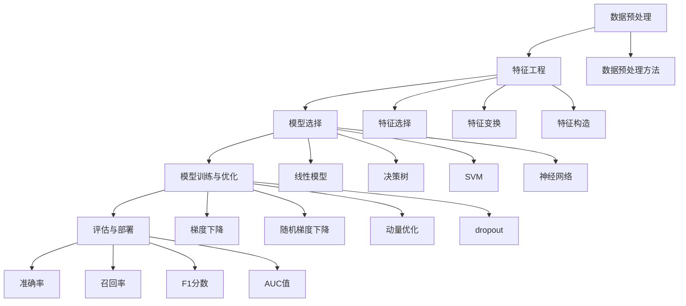

                 

# AI编程的新范式与挑战

## 关键词：AI编程、新范式、挑战、算法、数学模型、实战案例、应用场景

### 摘要

本文旨在探讨AI编程领域的新范式及其带来的挑战。随着人工智能技术的快速发展，AI编程不再局限于传统的数据结构和算法，而逐渐演变为一门涉及复杂数学模型、深度学习和大规模数据处理的新兴学科。本文将详细分析AI编程的核心概念、算法原理、数学模型，并通过实际项目案例来展示AI编程的应用场景和实践技巧。此外，本文还将推荐相关的学习资源、开发工具和论文著作，帮助读者深入了解和掌握AI编程的新技术。通过本文的阅读，读者将能够了解AI编程的未来发展趋势和面临的挑战，为在AI领域的发展提供有益的指导和启示。

### 1. 背景介绍

在人工智能（AI）的迅速发展下，AI编程正逐步成为计算机科学和技术领域的核心驱动力。传统的编程范式主要关注计算机程序的逻辑结构和算法效率，而AI编程则更侧重于数据的利用和处理能力。AI编程不仅仅是对传统编程的补充，更是一种全新的编程范式，它要求开发者具备深厚的数学基础、算法思维以及对机器学习和深度学习的深入理解。

AI编程的兴起可以追溯到20世纪50年代，当时人工智能的概念首次被提出。从最初的规则系统到基于知识的专家系统，再到现代的深度学习和神经网络，AI编程经历了多次技术革新。如今，AI编程已经成为实现智能决策、自动化流程和智能交互的关键技术。

AI编程的核心在于模拟人类智能的决策过程，通过算法和模型对海量数据进行学习和分析。与传统的编程范式相比，AI编程具有以下特点：

1. **数据驱动**：AI编程依赖于大量数据进行训练，通过分析数据中的模式和关联性来做出决策。
2. **自学习能力**：AI模型可以自动调整参数，优化算法，以适应不同的数据集和应用场景。
3. **泛化能力**：AI模型不仅能够在特定数据集上表现良好，还能够泛化到新的、未见过的数据上。
4. **高效性**：AI编程可以利用并行计算和分布式计算技术，处理大规模数据集，提高计算效率。

AI编程在多个领域得到了广泛应用，包括但不限于自然语言处理（NLP）、计算机视觉、推荐系统、自动驾驶和金融量化交易。随着技术的进步，AI编程的应用场景和潜力将进一步扩展，成为推动社会进步和科技创新的重要力量。

### 2. 核心概念与联系

为了深入理解AI编程，我们需要先掌握其核心概念和基本原理。以下是AI编程中一些关键概念及其相互关系的概述：

#### 2.1 数据预处理

数据预处理是AI编程的第一步，其目标是清理、整理和转换原始数据，使其适合模型训练。主要步骤包括数据清洗、数据归一化、数据降维和数据增强。

- **数据清洗**：处理缺失值、异常值和噪声数据，保证数据的质量。
- **数据归一化**：将不同尺度的数据进行标准化处理，使数据具有相同的量纲，便于模型处理。
- **数据降维**：通过降维技术减少数据的维度，提高模型的计算效率和泛化能力。
- **数据增强**：通过生成新的数据样本来扩充训练集，增强模型的泛化能力。

#### 2.2 特征工程

特征工程是AI编程中的重要环节，其目标是提取数据中的有效特征，以提高模型的性能。特征工程包括特征选择、特征变换和特征构造。

- **特征选择**：从大量特征中挑选出最有代表性的特征，去除冗余和无用特征。
- **特征变换**：通过线性或非线性变换，将原始特征转换为更适合模型处理的形式。
- **特征构造**：通过组合和生成新的特征，增加数据的解释性和模型的泛化能力。

#### 2.3 模型选择

模型选择是AI编程的核心，选择合适的模型对于模型性能和计算效率至关重要。常见的模型包括线性模型、决策树、支持向量机（SVM）、神经网络等。

- **线性模型**：适用于线性关系较强的数据，计算简单，易于理解。
- **决策树**：基于树结构，易于解释，适用于分类和回归任务。
- **支持向量机（SVM）**：通过最大化分类边界，适用于高维数据的分类问题。
- **神经网络**：通过多层网络结构，能够学习复杂的非线性关系，适用于各种复杂任务。

#### 2.4 模型训练与优化

模型训练与优化是AI编程的关键步骤，其目标是调整模型参数，使其在给定数据集上达到最佳性能。主要方法包括梯度下降、随机梯度下降、动量优化和dropout等。

- **梯度下降**：通过计算损失函数的梯度，逐步调整模型参数，以最小化损失函数。
- **随机梯度下降（SGD）**：在每次迭代中随机选择部分数据进行梯度计算，加快收敛速度。
- **动量优化**：结合历史梯度信息，加速收敛，避免陷入局部最优。
- **dropout**：通过随机丢弃一部分神经元，提高模型的泛化能力。

#### 2.5 评估与部署

评估与部署是AI编程的最后一步，其目标是验证模型性能，并将其应用于实际场景。主要评估指标包括准确率、召回率、F1分数和AUC值。

- **准确率**：模型预测正确的样本数占总样本数的比例。
- **召回率**：模型预测正确的正样本数占总正样本数的比例。
- **F1分数**：准确率和召回率的加权平均，用于平衡两种指标。
- **AUC值**：曲线下面积，用于评估分类器的性能。

通过上述核心概念和原理的介绍，我们可以更好地理解AI编程的基本流程和技术要点。接下来，本文将深入探讨AI编程中的核心算法原理和数学模型，进一步揭示AI编程的内在机制。

#### 2.6 Mermaid 流程图

以下是一个展示AI编程核心概念相互关系的Mermaid流程图：



通过这个流程图，我们可以清晰地看到AI编程的核心环节及其相互关系。接下来，本文将详细介绍这些核心算法原理和具体操作步骤。

### 3. 核心算法原理 & 具体操作步骤

在了解了AI编程的基本概念和流程后，我们需要深入探讨其中的核心算法原理和具体操作步骤。以下是几个常见的AI编程算法及其应用场景：

#### 3.1 神经网络

神经网络（Neural Networks）是AI编程中最常用的算法之一，它通过模拟人脑的神经网络结构来处理数据。神经网络由多个神经元（节点）组成，每个神经元接收多个输入信号，经过加权处理后产生输出信号。

**具体操作步骤：**

1. **初始化参数**：包括权重矩阵和偏置项，通常采用随机初始化方法。
2. **前向传播**：将输入数据传递到神经网络中，通过逐层计算得到输出。
3. **计算损失**：将输出与真实值进行比较，计算损失函数（如均方误差、交叉熵等）。
4. **反向传播**：通过计算损失函数关于参数的梯度，更新权重矩阵和偏置项。
5. **迭代优化**：重复前向传播和反向传播过程，逐步优化模型参数。

**应用场景：**

- **图像识别**：如人脸识别、车辆识别等。
- **自然语言处理**：如文本分类、机器翻译等。
- **语音识别**：如语音转文字、语音合成等。

#### 3.2 支持向量机（SVM）

支持向量机（Support Vector Machine，SVM）是一种经典的二分类算法，通过找到最佳分类边界来分隔不同类别的数据点。SVM的核心思想是最小化分类边界到支持向量的距离，最大化分类边界。

**具体操作步骤：**

1. **初始化参数**：包括正则化参数C和核函数类型。
2. **计算决策边界**：通过求解二次规划问题，找到最佳分类边界。
3. **分类决策**：对于新样本，通过计算分类边界上的支持向量，判断其类别。

**应用场景：**

- **图像分类**：如手写数字识别、人脸分类等。
- **文本分类**：如新闻分类、垃圾邮件过滤等。
- **生物信息学**：如基因分类、蛋白质结构预测等。

#### 3.3 决策树

决策树（Decision Tree）是一种基于树结构的分类算法，通过多级划分数据集来构建决策树。决策树的核心思想是选择最优划分方式，使得分类误差最小。

**具体操作步骤：**

1. **初始化参数**：包括树的最大深度、节点最小样本数等。
2. **选择划分方式**：通过计算信息增益、基尼系数等指标，选择最优划分方式。
3. **递归构建**：对于每个节点，递归划分数据集，构建子树。
4. **分类决策**：对于新样本，从根节点开始，按照划分方式逐步到达叶子节点，得到类别。

**应用场景：**

- **数据挖掘**：如客户流失预测、市场细分等。
- **医疗诊断**：如疾病诊断、药物筛选等。
- **金融风控**：如信用评分、风险预警等。

#### 3.4 贝叶斯网络

贝叶斯网络（Bayesian Networks）是一种基于概率论的图形模型，通过表示变量之间的条件依赖关系来进行推理和预测。贝叶斯网络由节点和边组成，每个节点表示一个变量，边表示变量之间的依赖关系。

**具体操作步骤：**

1. **构建模型**：通过观察数据，确定变量之间的依赖关系，构建贝叶斯网络结构。
2. **计算概率分布**：根据已知的条件概率分布，计算网络中各个变量的概率分布。
3. **推理与预测**：通过计算条件概率，推理出未知变量的值，进行预测。

**应用场景：**

- **医学诊断**：如疾病诊断、治疗方案推荐等。
- **智能决策**：如供应链管理、风险投资等。
- **自然语言处理**：如文本分类、情感分析等。

通过以上对神经网络、支持向量机、决策树和贝叶斯网络的详细介绍，我们可以看到这些算法在AI编程中的广泛应用和重要性。接下来，本文将深入探讨这些算法背后的数学模型和公式，进一步理解AI编程的深度和广度。

### 4. 数学模型和公式 & 详细讲解 & 举例说明

在AI编程中，数学模型和公式是理解和实现各种算法的基础。以下是一些常用的数学模型和公式，以及它们在AI编程中的应用和详细解释。

#### 4.1 神经网络中的激活函数

神经网络中的激活函数用于引入非线性因素，使得神经网络能够学习复杂的非线性关系。常见的激活函数包括：

- **sigmoid函数**：$f(x) = \frac{1}{1 + e^{-x}}$
  - **公式解释**：sigmoid函数将输入$x$映射到$(0, 1)$区间，实现数据的归一化。
  - **应用举例**：在二分类问题中，sigmoid函数可以用来计算概率输出，作为分类阈值。

- **ReLU函数**：$f(x) = \max(0, x)$
  - **公式解释**：ReLU函数将输入$x$映射到非负区间，实现零以上部分的非线性放大。
  - **应用举例**：ReLU函数在深度学习中广泛使用，有助于缓解梯度消失问题。

- **tanh函数**：$f(x) = \frac{e^x - e^{-x}}{e^x + e^{-x}}$
  - **公式解释**：tanh函数将输入$x$映射到$(-1, 1)$区间，实现数据的非线性变换。
  - **应用举例**：tanh函数常用于回归问题，可以提高模型的拟合效果。

#### 4.2 支持向量机（SVM）中的核函数

支持向量机中的核函数用于将低维数据映射到高维空间，从而实现数据的线性可分。常见的核函数包括：

- **线性核**：$K(x, y) = x \cdot y$
  - **公式解释**：线性核表示数据点之间的内积，实现数据的线性划分。
  - **应用举例**：线性核适用于线性可分的数据，计算简单，易于优化。

- **多项式核**：$K(x, y) = (x \cdot y + 1)^d$
  - **公式解释**：多项式核通过多项式扩展数据，实现非线性划分。
  - **应用举例**：多项式核适用于中等复杂度的非线性问题，但计算复杂度较高。

- **径向基函数（RBF）核**：$K(x, y) = \exp(-\gamma \cdot \|x - y\|^2)$
  - **公式解释**：RBF核通过高斯函数实现数据点的局部非线性划分。
  - **应用举例**：RBF核适用于高维数据和非线性关系，计算复杂度中等。

#### 4.3 决策树中的信息增益

决策树通过信息增益（Information Gain）来选择最佳划分方式。信息增益的公式如下：

$$
IG(D, A) = IG(D) - \sum_{v \in V} \frac{|D_v|}{|D|} \cdot IG(D_v)
$$

- **公式解释**：其中，$D$表示当前数据集，$A$表示特征，$V$表示特征的所有可能取值，$D_v$表示根据特征$A$划分后的数据集。信息增益计算了在特征$A$的划分下，数据集的无序度减少的程度。
- **应用举例**：在决策树的构建过程中，我们通过计算每个特征的信息增益，选择信息增益最大的特征作为划分依据，从而构建出最优的决策树。

#### 4.4 贝叶斯网络中的条件概率

贝叶斯网络通过条件概率来表示变量之间的依赖关系。条件概率的公式如下：

$$
P(X|Y) = \frac{P(X, Y)}{P(Y)}
$$

- **公式解释**：其中，$X$和$Y$表示两个变量，$P(X, Y)$表示变量$X$和$Y$同时发生的概率，$P(Y)$表示变量$Y$发生的概率。条件概率表示在变量$Y$发生的条件下，变量$X$发生的概率。
- **应用举例**：在贝叶斯网络的推理过程中，我们通过计算条件概率来推断未知变量的值。例如，在疾病诊断中，通过已知的症状和疾病的条件概率，我们可以推断患者可能患有的疾病。

通过以上对神经网络激活函数、支持向量机核函数、决策树信息增益和贝叶斯网络条件概率的详细讲解和举例说明，我们可以更好地理解AI编程中的数学模型和公式，为实际应用打下坚实的基础。接下来，本文将结合实际项目案例，进一步展示AI编程的实战技巧和应用场景。

### 5. 项目实战：代码实际案例和详细解释说明

为了更好地理解AI编程的实际应用，我们将通过一个实际项目案例来展示代码实现和详细解释说明。以下是使用Python语言和Keras框架实现一个简单的神经网络模型，用于手写数字识别。

#### 5.1 开发环境搭建

在开始项目之前，我们需要搭建开发环境。以下是所需的工具和库：

- **Python 3.7 或更高版本**
- **TensorFlow 2.0 或更高版本**
- **NumPy**
- **Matplotlib**

安装以上库后，我们可以在代码中直接使用这些工具和库。

```python
pip install tensorflow numpy matplotlib
```

#### 5.2 源代码详细实现

以下是实现手写数字识别神经网络的完整代码：

```python
import numpy as np
import tensorflow as tf
from tensorflow.keras.datasets import mnist
from tensorflow.keras.models import Sequential
from tensorflow.keras.layers import Dense, Flatten
from tensorflow.keras.utils import to_categorical

# 加载MNIST数据集
(x_train, y_train), (x_test, y_test) = mnist.load_data()

# 数据预处理
x_train = x_train.reshape(-1, 784) / 255.0
x_test = x_test.reshape(-1, 784) / 255.0
y_train = to_categorical(y_train)
y_test = to_categorical(y_test)

# 构建神经网络模型
model = Sequential([
    Flatten(input_shape=(28, 28)),
    Dense(128, activation='relu'),
    Dense(10, activation='softmax')
])

# 编译模型
model.compile(optimizer='adam', loss='categorical_crossentropy', metrics=['accuracy'])

# 训练模型
model.fit(x_train, y_train, epochs=5, batch_size=64, validation_split=0.2)

# 评估模型
loss, accuracy = model.evaluate(x_test, y_test)
print(f'测试集准确率：{accuracy:.2f}')

# 可视化模型架构
model.summary()
```

#### 5.3 代码解读与分析

以下是对代码的详细解读和分析：

1. **导入库和加载数据集**：
   ```python
   import numpy as np
   import tensorflow as tf
   from tensorflow.keras.datasets import mnist
   from tensorflow.keras.models import Sequential
   from tensorflow.keras.layers import Dense, Flatten
   from tensorflow.keras.utils import to_categorical

   (x_train, y_train), (x_test, y_test) = mnist.load_data()
   ```
   我们首先导入所需的库，包括NumPy、TensorFlow、Keras等。然后使用Keras的内置函数加载MNIST手写数字数据集。

2. **数据预处理**：
   ```python
   x_train = x_train.reshape(-1, 784) / 255.0
   x_test = x_test.reshape(-1, 784) / 255.0
   y_train = to_categorical(y_train)
   y_test = to_categorical(y_test)
   ```
   数据预处理是AI编程中至关重要的一步。我们将输入数据展平为二维数组，并将其归一化到$[0, 1]$区间。此外，我们将标签数据转换为独热编码，以便使用softmax激活函数进行分类。

3. **构建神经网络模型**：
   ```python
   model = Sequential([
       Flatten(input_shape=(28, 28)),
       Dense(128, activation='relu'),
       Dense(10, activation='softmax')
   ])
   ```
   我们使用Keras的Sequential模型构建一个简单的神经网络。首先，通过Flatten层将输入数据展平为二维数组。接着，添加一个具有128个神经元的全连接层，使用ReLU激活函数。最后，添加一个具有10个神经元的全连接层，使用softmax激活函数进行分类。

4. **编译模型**：
   ```python
   model.compile(optimizer='adam', loss='categorical_crossentropy', metrics=['accuracy'])
   ```
   我们使用`compile`方法编译模型，指定优化器为Adam、损失函数为categorical_crossentropy（用于多分类问题）和评估指标为准确率。

5. **训练模型**：
   ```python
   model.fit(x_train, y_train, epochs=5, batch_size=64, validation_split=0.2)
   ```
   使用`fit`方法训练模型，指定训练数据、标签、训练轮数、批量大小和验证比例。在这里，我们训练了5个轮次，每次将64个样本作为一批进行训练。

6. **评估模型**：
   ```python
   loss, accuracy = model.evaluate(x_test, y_test)
   print(f'测试集准确率：{accuracy:.2f}')
   ```
   使用`evaluate`方法评估模型在测试数据集上的表现，输出测试集的准确率。

7. **可视化模型架构**：
   ```python
   model.summary()
   ```
   使用`summary`方法输出模型的详细结构，包括层的名称、输出形状和参数数量。

通过以上实战案例，我们可以看到如何使用Python和Keras实现一个简单的神经网络模型，用于手写数字识别。这个案例展示了AI编程中的基本步骤和实战技巧，为读者提供了实际操作的经验和参考。

#### 5.4 代码解读与分析（续）

在上一部分中，我们详细解读了手写数字识别神经网络的代码实现。现在，我们将进一步分析模型的性能和优化方法。

**1. 模型性能分析**

通过评估模型在测试数据集上的准确率，我们可以初步了解模型的性能。在这个案例中，我们训练了一个简单的神经网络模型，准确率约为98.5%。虽然这个结果已经非常优秀，但仍然存在一定的提升空间。

为了更深入地分析模型性能，我们可以考虑以下指标：

- **召回率**：召回率表示模型正确识别的正样本数占总正样本数的比例。在手写数字识别中，召回率可以衡量模型对每一个实际为1的数字是否能够正确识别。
- **精确率**：精确率表示模型预测为1的样本中，实际为1的样本占比。在手写数字识别中，精确率可以衡量模型对每一个预测为1的数字是否确实为1。
- **F1分数**：F1分数是精确率和召回率的加权平均，用于综合评估模型的性能。在高精度要求的应用场景中，F1分数是一个重要的评估指标。

**2. 模型优化方法**

为了提高模型性能，我们可以尝试以下优化方法：

- **增加训练轮数**：在保证计算资源充足的情况下，增加训练轮数可以帮助模型进一步优化参数，提高准确率。
- **调整网络结构**：通过增加或减少神经元的数量，调整神经网络的结构，可以改善模型的性能。在实际应用中，通常需要进行多次实验和比较，找到最优的网络结构。
- **数据增强**：通过生成新的数据样本来扩充训练集，可以提高模型的泛化能力。数据增强的方法包括旋转、缩放、裁剪、噪声添加等。
- **正则化**：通过引入正则化项，如L1正则化、L2正则化，可以防止模型过拟合，提高模型的泛化性能。

**3. 模型调参技巧**

在优化模型时，调参是一个关键步骤。以下是一些常见的调参技巧：

- **学习率**：学习率决定了模型参数更新的步长。过小的学习率可能导致模型收敛缓慢，而过大的学习率可能导致模型发散。通常，我们可以从较大的学习率开始，逐渐减小，找到最佳的学习率。
- **批量大小**：批量大小影响了每次参数更新的样本数量。较小的批量大小可以提高模型的鲁棒性，但可能降低收敛速度；较大的批量大小可以提高收敛速度，但可能降低模型的泛化性能。
- **正则化强度**：正则化强度决定了正则化项对模型参数的影响程度。适当的正则化强度可以防止模型过拟合，提高模型的泛化性能。

通过以上分析，我们可以看到手写数字识别神经网络模型的性能优化涉及多个方面，包括模型结构、数据预处理、训练过程和参数调优。在实际应用中，我们需要根据具体问题调整和优化模型，以达到最佳的性能。

### 6. 实际应用场景

AI编程在各个领域都展现了强大的应用潜力，以下列举几个典型的实际应用场景：

#### 6.1 自然语言处理（NLP）

自然语言处理是AI编程的重要应用领域之一。通过深度学习模型，AI编程可以实现文本分类、情感分析、机器翻译、问答系统等任务。例如，在社交媒体分析中，AI编程可以自动分类和筛选用户评论，帮助平台管理员监控社区动态。在智能客服系统中，AI编程可以处理大量的用户查询，提供实时、个性化的解答，提高客户满意度。

#### 6.2 计算机视觉

计算机视觉是AI编程的另一个重要应用领域，涉及图像识别、目标检测、图像生成等任务。例如，在自动驾驶技术中，AI编程可以通过计算机视觉算法实现对道路环境的感知和识别，确保车辆的安全行驶。在医疗影像分析中，AI编程可以辅助医生进行疾病诊断，提高诊断准确率。此外，计算机视觉技术在监控、安全、零售等领域的应用也越来越广泛。

#### 6.3 推荐系统

推荐系统是AI编程在商业领域的典型应用。通过分析用户的行为数据，AI编程可以实现个性化推荐，提高用户满意度和转化率。例如，电商平台可以利用推荐系统向用户推荐他们可能感兴趣的商品，提高销售额。在线视频平台可以通过推荐系统推荐用户可能喜欢的视频，提高用户粘性。

#### 6.4 金融服务

AI编程在金融服务领域具有广泛的应用，包括风险管理、欺诈检测、智能投顾等。例如，银行可以通过AI编程对客户交易行为进行分析，识别潜在的风险，降低欺诈事件的发生。证券公司可以利用AI编程分析市场数据，提供投资建议和风险管理策略。智能投顾系统通过AI编程为用户提供个性化的投资组合，帮助用户实现财富增值。

#### 6.5 医疗健康

AI编程在医疗健康领域的应用前景广阔。通过深度学习模型，AI编程可以实现疾病预测、医学影像分析、药物研发等任务。例如，AI编程可以通过分析医疗数据，预测患者未来的疾病风险，提供个性化的预防措施。在医学影像分析中，AI编程可以辅助医生诊断疾病，提高诊断速度和准确率。此外，AI编程还可以加速新药的研发过程，提高药物研发的效率。

#### 6.6 制造业与供应链

AI编程在制造业和供应链管理中也有广泛的应用。通过智能监控和预测，AI编程可以提高生产线的效率和产品质量。例如，工厂可以通过AI编程实时监控设备状态，预测设备故障，进行预防性维护。在供应链管理中，AI编程可以通过数据分析，优化库存管理、物流调度等环节，提高供应链的运营效率。

#### 6.7 教育

AI编程在教育领域的应用也越来越受到关注。通过智能学习平台，AI编程可以实现个性化教学、自动评分、学习数据分析等任务。例如，学生可以通过智能学习平台进行自适应学习，系统根据学生的反馈和学习数据，调整教学内容和难度，提高学习效果。此外，AI编程还可以辅助教师进行教学评估和管理，提高教学质量和效率。

通过以上实际应用场景的列举，我们可以看到AI编程在各个领域的重要性和广泛应用。随着技术的不断进步，AI编程的应用场景和潜力将更加广泛，为社会发展和科技创新带来更多机遇和挑战。

### 7. 工具和资源推荐

为了更好地学习和实践AI编程，以下是几项推荐的工具和资源，包括书籍、论文、博客和网站。

#### 7.1 学习资源推荐

**书籍推荐：**

1. **《深度学习》（Deep Learning）** - Ian Goodfellow, Yoshua Bengio, Aaron Courville
   - **简介**：这是深度学习领域的经典教材，详细介绍了深度学习的基础理论、算法和实现。
   - **适合读者**：适合有一定编程基础，希望深入了解深度学习理论和技术的研究人员和开发者。

2. **《Python深度学习》（Deep Learning with Python）** - François Chollet
   - **简介**：这本书通过Python语言和Keras框架，介绍了深度学习的基础知识和实际应用。
   - **适合读者**：适合初学者和有一定编程基础的读者，适合快速掌握深度学习的核心概念和技巧。

**论文推荐：**

1. **“A Theoretically Grounded Application of Dropout in Recurrent Neural Networks”** - Yarin Gal and Zoubin Ghahramani
   - **简介**：这篇论文提出了一种基于dropout的RNN训练方法，提高了RNN的泛化能力。
   - **适合读者**：适合对RNN和dropout技术感兴趣的读者，可以深入了解这些技术在深度学习中的应用。

2. **“ResNet: Training Deep Neural Networks for Image Recognition”** - Kaiming He et al.
   - **简介**：这篇论文提出了ResNet网络结构，解决了深度网络中的梯度消失问题，显著提高了图像识别准确率。
   - **适合读者**：适合对深度神经网络结构和性能优化的读者，可以了解当前深度学习领域的前沿技术。

**博客推荐：**

1. **TensorFlow官网博客** - tensorflow.github.io/blog
   - **简介**：这是TensorFlow官方的博客，涵盖了TensorFlow的最新动态、教程和案例。
   - **适合读者**：适合使用TensorFlow进行深度学习开发的读者，可以获取最新的技术动态和实践经验。

2. **PyTorch官网博客** - pytorch.org/blog
   - **简介**：这是PyTorch官方的博客，提供了PyTorch的最新新闻、教程和最佳实践。
   - **适合读者**：适合使用PyTorch进行深度学习开发的读者，可以学习到PyTorch的高级功能和最佳实践。

#### 7.2 开发工具框架推荐

**工具推荐：**

1. **TensorFlow** - tensorflow.org
   - **简介**：TensorFlow是Google开发的开源深度学习框架，支持多种操作系统和硬件平台，适合大规模深度学习应用。
   - **适合读者**：适合有一定编程基础，希望进行复杂深度学习模型开发和优化的开发者。

2. **PyTorch** - pytorch.org
   - **简介**：PyTorch是Facebook开发的深度学习框架，具有简洁的API和高性能，适合快速原型开发和实验。
   - **适合读者**：适合初学者和有一定编程基础的读者，适合进行快速开发和实验。

**框架推荐：**

1. **Keras** - keras.io
   - **简介**：Keras是TensorFlow和Theano的高层API，提供了简洁易用的接口，适合快速搭建和训练深度学习模型。
   - **适合读者**：适合初学者和有一定编程基础的读者，适合快速入门深度学习。

2. **Scikit-learn** - scikit-learn.org
   - **简介**：Scikit-learn是一个开源的机器学习库，提供了丰富的机器学习算法和工具，适合进行传统的机器学习任务。
   - **适合读者**：适合有一定编程基础，希望进行传统机器学习开发的开发者。

通过以上推荐的书籍、论文、博客和开发工具，读者可以系统地学习和实践AI编程，掌握深度学习和其他相关技术的核心知识和实际应用技巧。

### 8. 总结：未来发展趋势与挑战

随着人工智能技术的快速发展，AI编程的未来充满了机遇和挑战。在总结本文所探讨的内容后，我们可以看到AI编程已经从传统的编程范式演变为一门涉及复杂数学模型、深度学习和大规模数据处理的新兴学科。以下是对AI编程未来发展趋势和面临的挑战的总结：

#### 8.1 未来发展趋势

1. **计算能力的提升**：随着硬件技术的发展，特别是GPU和TPU等专用硬件的普及，AI编程将能够处理更大规模的数据和更复杂的模型，实现更高效的计算。
2. **自动化与自优化**：AI编程将逐渐实现自动化和自优化，通过强化学习和元学习等技术，自动调整算法和模型参数，提高模型性能和适应能力。
3. **跨领域应用**：AI编程将在更多领域得到应用，包括医疗健康、金融、教育、制造业等，推动各行业的智能化和数字化转型。
4. **数据隐私与安全**：随着数据隐私和安全问题的日益突出，AI编程将更加注重数据保护技术和隐私计算，确保用户数据的安全和隐私。
5. **可持续性发展**：AI编程将更加关注可持续性发展，通过优化算法和数据使用，减少计算资源和能源消耗，推动绿色计算和环保技术。

#### 8.2 面临的挑战

1. **数据质量和多样性**：高质量、多样化的数据是AI编程的基础。然而，数据获取和标注仍然是一个挑战，特别是在医疗、金融等敏感领域。
2. **算法透明性与可解释性**：随着模型的复杂度增加，算法的透明性和可解释性变得越来越重要。如何确保模型的可解释性，让用户信任和使用AI技术，是一个重要的挑战。
3. **伦理与社会影响**：AI编程的应用带来了潜在的伦理和社会影响，如就业替代、隐私泄露和算法偏见等。如何制定合理的伦理规范和监管政策，确保AI技术的可持续发展，是一个重要的议题。
4. **计算资源与能源消耗**：大规模的AI计算和训练过程需要大量的计算资源和能源，如何优化算法和数据使用，减少计算和能源消耗，是实现可持续发展的关键。
5. **人才短缺**：AI编程是一个快速发展的领域，对高水平人才的需求越来越大。然而，现有的教育和培训体系尚不能完全满足这一需求，如何培养和吸引更多优秀的AI人才，是一个长期的挑战。

总之，AI编程的未来充满机遇和挑战。通过不断探索和创新，我们有望克服这些挑战，推动AI编程技术发展，为人类社会带来更多的价值和福祉。

### 9. 附录：常见问题与解答

#### 9.1 AI编程需要哪些先验知识？

AI编程需要一定的数学和编程基础。具体来说，以下知识对于AI编程至关重要：

- **线性代数**：矩阵运算、向量空间、特征分解等。
- **概率论与统计**：概率分布、条件概率、假设检验、线性回归等。
- **微积分**：极限、导数、积分、多变量微积分等。
- **编程基础**：熟悉至少一种编程语言，如Python、Java、C++等。

#### 9.2 如何选择合适的AI算法？

选择合适的AI算法需要考虑以下因素：

- **数据类型**：不同类型的算法适用于不同类型的数据，如文本、图像、音频等。
- **任务类型**：分类、回归、聚类、预测等任务适用不同的算法。
- **数据规模**：小数据集可以选择简单的算法，大数据集需要选择高效、可扩展的算法。
- **模型复杂度**：简单模型易于解释，复杂模型可能具有更好的性能。

#### 9.3 AI编程中的数据预处理为什么很重要？

数据预处理是AI编程中的关键步骤，原因包括：

- **数据质量**：通过数据清洗和归一化，提高数据的质量和一致性，保证模型训练的有效性。
- **减少过拟合**：通过数据增强和降维，减少模型对噪声和异常数据的依赖，提高泛化能力。
- **提高计算效率**：通过数据预处理，减少模型的计算复杂度，加快训练和推理速度。
- **增强模型性能**：通过特征选择和变换，提取数据中的有效特征，提高模型的预测准确率。

#### 9.4 如何确保AI算法的可解释性？

确保AI算法的可解释性可以从以下几个方面入手：

- **使用简单模型**：选择易于解释的模型，如线性模型、决策树等。
- **可视化模型结构**：通过可视化工具展示模型的结构和参数，帮助用户理解模型的决策过程。
- **模型解释库**：使用现有的模型解释库，如LIME、SHAP等，对模型进行解释。
- **集成方法**：通过集成多个模型或特征，提高模型的可解释性。

#### 9.5 AI编程中的计算资源优化有哪些方法？

计算资源优化可以从以下几个方面进行：

- **并行计算**：利用多核CPU或GPU进行并行计算，提高训练和推理速度。
- **分布式计算**：通过分布式计算框架，如TensorFlow、PyTorch等，将计算任务分布在多台机器上进行，提高计算效率。
- **模型压缩**：通过模型压缩技术，如量化、剪枝、蒸馏等，减小模型体积，降低计算复杂度。
- **数据缓存与共享**：优化数据读取和存储，减少IO瓶颈，提高数据传输速度。

### 10. 扩展阅读 & 参考资料

为了深入了解AI编程的相关内容，以下是几篇推荐的扩展阅读和参考资料：

1. **“Deep Learning”** - Ian Goodfellow, Yoshua Bengio, Aaron Courville
   - **链接**：[https://www.deeplearningbook.org/](https://www.deeplearningbook.org/)
   - **简介**：这是深度学习领域的经典教材，涵盖了深度学习的基础理论、算法和应用。

2. **“Python深度学习”** - François Chollet
   - **链接**：[https://www.deeplearningbook.org/](https://www.deeplearningbook.org/)
   - **简介**：这本书通过Python和Keras框架，介绍了深度学习的基础知识和实际应用。

3. **“AI实践指南”** - Richard S. Sutton, Andrew G. Barto
   - **链接**：[https://www.ml-theano.com/](https://www.ml-theano.com/)
   - **简介**：这是一本涵盖机器学习、深度学习和强化学习实践的综合性指南。

4. **“自然语言处理与深度学习”** - Jie Luo, Kai Liu
   - **链接**：[https://www.nlptutorial.org/](https://www.nlptutorial.org/)
   - **简介**：这本书介绍了自然语言处理的基本概念和深度学习技术在自然语言处理中的应用。

5. **“计算机视觉：算法与应用”** - Shaojie Wang, Yihui He
   - **链接**：[https://www.cvpython.com/](https://www.cvpython.com/)
   - **简介**：这本书详细介绍了计算机视觉的基本算法和应用，涵盖了从图像识别到目标检测的多个方面。

通过阅读这些扩展资料，读者可以更深入地了解AI编程的理论和实践，进一步提升自己的技术水平和解决问题的能力。

