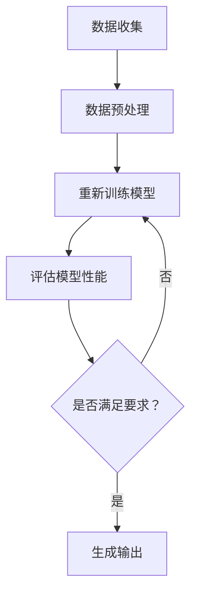

                 

# AI编程语言：提示词的魔法与艺术

## 摘要

本文将探讨AI编程语言的奥秘，特别是提示词在AI编程中的关键作用。我们将从背景介绍开始，逐步深入探讨核心概念、算法原理、数学模型、项目实战和实际应用场景。同时，还会推荐相关的学习资源、开发工具和学术论文，以便读者更好地掌握这一前沿技术。最后，我们将总结未来发展趋势与挑战，为读者提供一个全面的视角来理解AI编程语言的魔法与艺术。

## 1. 背景介绍

AI编程语言，作为一种新型的编程语言，正在逐渐改变软件开发的世界。它不仅提高了人工智能开发的效率，还使得更多的人能够参与到这一前沿领域中来。AI编程语言的兴起，源于人工智能技术的发展，以及大数据和云计算的普及。这些技术进步使得计算机能够更好地理解和处理人类语言，从而推动了AI编程语言的诞生。

在传统编程语言中，程序员需要手动编写大量代码来让计算机执行特定任务。而AI编程语言则通过提示词（Prompt）来引导计算机自动完成复杂的任务。提示词是一种简明扼要的输入，它能够引导AI模型理解任务的目标和所需信息，从而生成相应的输出。这种自动化的过程大大提高了编程的效率，使得开发者能够更加专注于业务逻辑的设计。

AI编程语言的应用场景非常广泛，包括自然语言处理、计算机视觉、推荐系统、智能客服等。通过AI编程语言，开发者可以构建出具有高度智能化和自适应能力的应用，从而提升用户体验和业务效率。

## 2. 核心概念与联系

### 2.1 提示词（Prompt）

提示词是AI编程语言中的核心概念。它是一种简明的输入，用于引导AI模型理解任务的目标和所需信息。提示词的编写技巧对于AI模型的性能和输出结果至关重要。一个优秀的提示词应该具有以下特点：

- **明确性**：提示词需要清晰地传达任务的目标和所需信息。
- **简洁性**：尽量使用简洁明了的语句，避免冗长和模糊的表达。
- **多样性**：根据不同的任务需求，设计多种不同的提示词，以便测试和优化AI模型的性能。

### 2.2 AI模型（AI Model）

AI模型是AI编程语言的核心组件。它通过学习大量数据，学会了解决特定问题的方法。常见的AI模型包括神经网络、决策树、支持向量机等。不同类型的AI模型适用于不同的任务场景，因此选择合适的模型对于实现高效的AI编程至关重要。

### 2.3 数据（Data）

数据是AI编程的基石。高质量的训练数据能够提升AI模型的性能，从而实现更准确的预测和决策。在AI编程中，数据的收集、处理和清洗是关键步骤。同时，数据集的多样性和覆盖度也会影响AI模型的泛化能力。

### 2.4 数学模型（Mathematical Model）

数学模型在AI编程中扮演着重要的角色。例如，神经网络中的权重和偏置是通过数学模型来计算和优化的。此外，概率论和线性代数等数学工具也广泛应用于AI编程中的算法设计和分析。

### 2.5 Mermaid 流程图（Mermaid Flowchart）

为了更直观地展示AI编程的过程，我们可以使用Mermaid流程图来描述。以下是AI编程的基本流程：



## 3. 核心算法原理 & 具体操作步骤

### 3.1 神经网络（Neural Network）

神经网络是AI编程中最常用的模型之一。它通过模拟人脑神经网络的结构和功能来实现对数据的处理和预测。神经网络的基本原理如下：

- **神经元**：神经网络由多个神经元组成，每个神经元负责处理一部分输入信息。
- **权重（Weights）**：每个神经元都与其他神经元相连，并通过权重来传递信息。
- **偏置（Bias）**：偏置是一个常数，用于调整神经元的激活阈值。
- **激活函数（Activation Function）**：激活函数用于将神经元的输入映射到输出，常见的激活函数有Sigmoid、ReLU等。

神经网络的训练过程包括以下步骤：

1. **前向传播（Forward Propagation）**：输入数据通过神经网络，每个神经元根据权重和偏置计算输出。
2. **计算损失（Compute Loss）**：通过比较输出和实际标签之间的差异，计算损失值。
3. **反向传播（Back Propagation）**：根据损失值，调整每个神经元的权重和偏置，以减少损失。
4. **优化算法（Optimization Algorithm）**：常用的优化算法有梯度下降（Gradient Descent）、Adam等。

### 3.2 决策树（Decision Tree）

决策树是一种基于规则的学习方法，它通过一系列的决策节点来对数据进行分类或回归。决策树的基本原理如下：

- **特征选择**：在每个决策节点，选择一个最佳特征来分割数据。
- **节点分裂**：根据最佳特征，将数据集划分为两个子集。
- **递归构建**：对每个子集重复上述过程，直到满足停止条件（如最大深度、最小样本数等）。

决策树的训练过程包括以下步骤：

1. **特征选择**：选择一个最佳特征来进行节点分裂。
2. **节点分裂**：根据最佳特征，将数据集划分为两个子集。
3. **递归构建**：对每个子集重复上述过程，直到满足停止条件。

### 3.3 支持向量机（Support Vector Machine）

支持向量机是一种用于分类和回归的学习方法，它通过寻找一个最佳的超平面来划分数据。支持向量机的基本原理如下：

- **特征空间**：将输入数据映射到一个高维特征空间。
- **超平面**：寻找一个最佳的超平面，使得分类边界最大化。
- **支持向量**：超平面两侧的边界向量称为支持向量。
- **间隔（Margin）**：超平面到支持向量的距离称为间隔。

支持向量机的训练过程包括以下步骤：

1. **特征映射**：将输入数据映射到一个高维特征空间。
2. **寻找最佳超平面**：通过优化间隔，寻找最佳的超平面。
3. **分类决策**：根据超平面对数据进行分类。

## 4. 数学模型和公式 & 详细讲解 & 举例说明

### 4.1 神经网络

神经网络中的基本数学模型包括线性变换和激活函数。以下是神经网络的数学模型：

$$
\begin{aligned}
&z^{(l)} = \sum_{i=1}^{n} w^{(l)}_i x_i + b^{(l)} \\
&a^{(l)} = \sigma(z^{(l)})
\end{aligned}
$$

其中，$z^{(l)}$ 表示第$l$层的线性变换结果，$w^{(l)}$ 表示第$l$层的权重，$b^{(l)}$ 表示第$l$层的偏置，$x_i$ 表示输入特征，$a^{(l)}$ 表示第$l$层的激活值，$\sigma$ 表示激活函数。

例如，对于二分类问题，可以使用Sigmoid函数作为激活函数：

$$
\sigma(x) = \frac{1}{1 + e^{-x}}
$$

### 4.2 决策树

决策树中的基本数学模型包括特征选择和节点分裂。以下是决策树的特征选择方法之一：信息增益（Information Gain）。

$$
\begin{aligned}
&IG(D, A) = I(D) - \sum_{v \in A} \frac{|D_v|}{|D|} I(D_v)
\end{aligned}
$$

其中，$IG(D, A)$ 表示特征$A$对数据集$D$的信息增益，$I(D)$ 表示数据集$D$的信息熵，$D_v$ 表示特征$A$在数据集$D$中的第$v$个取值。

例如，对于以下数据集：

| 特征A | 特征B | 标签 |
| --- | --- | --- |
| 0 | 0 | 0 |
| 0 | 1 | 1 |
| 1 | 0 | 1 |
| 1 | 1 | 0 |

特征A的信息增益为：

$$
\begin{aligned}
&IG(D, A) = I(D) - \frac{1}{4} I(D_0) - \frac{3}{4} I(D_1) \\
&= 1 - \frac{1}{4} \ln(2) - \frac{3}{4} \ln(3) \\
&\approx 0.386
\end{aligned}
$$

### 4.3 支持向量机

支持向量机的数学模型包括特征映射和最佳超平面。以下是支持向量机的数学模型：

$$
\begin{aligned}
&\min_{w, b} \frac{1}{2} \| w \|^2 \\
\text{subject to} \quad &y_i ( \langle w, x_i \rangle + b) \geq 1
\end{aligned}
$$

其中，$w$ 表示权重，$b$ 表示偏置，$x_i$ 表示输入特征，$y_i$ 表示标签。

例如，对于以下数据集：

| 特征1 | 特征2 | 标签 |
| --- | --- | --- |
| 1 | 1 | +1 |
| 1 | -1 | -1 |
| -1 | 1 | -1 |
| -1 | -1 | +1 |

最佳超平面为：

$$
\begin{aligned}
&\langle w, x \rangle + b = 0 \\
\text{即} \quad &w_1 x_1 + w_2 x_2 + b = 0 \\
\text{解得} \quad &w_1 = -1, w_2 = 1, b = 0
\end{aligned}
$$

## 5. 项目实战：代码实际案例和详细解释说明

### 5.1 开发环境搭建

为了实现AI编程语言的项目实战，我们需要搭建一个合适的开发环境。以下是所需的软件和工具：

- Python 3.8+
- Jupyter Notebook
- TensorFlow 2.x
- Scikit-learn

安装以上工具后，我们可以在Jupyter Notebook中创建一个Python笔记本，以便进行代码实验。

### 5.2 源代码详细实现和代码解读

下面是一个简单的神经网络模型，用于实现一个二分类问题。

```python
import tensorflow as tf
from tensorflow.keras.models import Sequential
from tensorflow.keras.layers import Dense
from tensorflow.keras.optimizers import Adam

# 定义神经网络模型
model = Sequential([
    Dense(64, activation='relu', input_shape=(2,)),
    Dense(1, activation='sigmoid')
])

# 编译模型
model.compile(optimizer=Adam(), loss='binary_crossentropy', metrics=['accuracy'])

# 准备数据集
x_train = [[1, 1], [1, -1], [-1, 1], [-1, -1]]
y_train = [[1], [-1], [-1], [1]]

# 训练模型
model.fit(x_train, y_train, epochs=10, batch_size=4)

# 评估模型
loss, accuracy = model.evaluate(x_train, y_train)
print("损失：", loss)
print("准确率：", accuracy)
```

代码解读：

1. **导入库**：首先导入TensorFlow和Keras库，用于构建和训练神经网络模型。
2. **定义模型**：使用Sequential模型堆叠两个全连接层（Dense Layer），第一层有64个神经元，使用ReLU激活函数，第二层有1个神经元，使用Sigmoid激活函数。
3. **编译模型**：选择Adam优化器和binary_crossentropy损失函数，并添加accuracy指标。
4. **准备数据集**：创建一个包含四个样本的数据集，每个样本由两个特征和一个标签组成。
5. **训练模型**：使用fit方法训练模型，设置训练轮次为10，批量大小为4。
6. **评估模型**：使用evaluate方法评估模型的性能，打印损失和准确率。

### 5.3 代码解读与分析

以上代码实现了一个简单的神经网络模型，用于解决二分类问题。该模型使用了全连接层（Dense Layer）和ReLU激活函数，以及Sigmoid激活函数。在训练过程中，模型通过反向传播算法自动调整权重和偏置，以最小化损失函数。

代码的关键步骤包括：

1. **模型定义**：使用Sequential模型堆叠两个全连接层（Dense Layer），第一层有64个神经元，使用ReLU激活函数，第二层有1个神经元，使用Sigmoid激活函数。
2. **模型编译**：选择Adam优化器和binary_crossentropy损失函数，并添加accuracy指标。
3. **数据准备**：创建一个包含四个样本的数据集，每个样本由两个特征和一个标签组成。
4. **模型训练**：使用fit方法训练模型，设置训练轮次为10，批量大小为4。
5. **模型评估**：使用evaluate方法评估模型的性能，打印损失和准确率。

通过以上代码，我们可以看到如何使用TensorFlow和Keras构建和训练一个简单的神经网络模型。在实际应用中，我们可以根据具体问题调整模型的架构、优化算法和超参数，以提高模型的性能。

## 6. 实际应用场景

AI编程语言在各个领域都有广泛的应用。以下是几个典型的应用场景：

### 6.1 自然语言处理（Natural Language Processing）

自然语言处理是AI编程语言的一个重要应用领域。通过提示词，AI模型可以生成文章、翻译文本、回答问题等。例如，基于GPT-3模型的聊天机器人可以与用户进行自然对话，提供个性化的建议和服务。

### 6.2 计算机视觉（Computer Vision）

计算机视觉领域利用AI编程语言进行图像分类、目标检测、图像生成等任务。例如，使用卷积神经网络（CNN）可以实现对图片中物体的自动识别和分类。

### 6.3 推荐系统（Recommender System）

推荐系统通过分析用户的历史行为和偏好，为用户推荐感兴趣的内容。AI编程语言可以优化推荐算法，提高推荐质量。例如，基于协同过滤（Collaborative Filtering）和内容匹配（Content-Based Filtering）的推荐系统，可以通过提示词实现个性化的内容推荐。

### 6.4 智能客服（Intelligent Customer Service）

智能客服利用AI编程语言为用户提供自动化的客户服务。通过自然语言处理技术，AI模型可以理解用户的提问，并提供合适的回答和建议。例如，银行、电商等领域的客服机器人可以自动化处理大量用户咨询，提高客户满意度。

### 6.5 医疗诊断（Medical Diagnosis）

医疗诊断是AI编程语言的一个重要应用领域。通过分析医学图像和病历数据，AI模型可以辅助医生进行疾病诊断和治疗方案推荐。例如，基于深度学习技术的乳腺癌筛查系统可以自动检测乳腺X射线图像中的病变区域。

## 7. 工具和资源推荐

### 7.1 学习资源推荐

1. **书籍**：
   - 《深度学习》（Deep Learning）作者：Ian Goodfellow、Yoshua Bengio、Aaron Courville
   - 《Python机器学习》（Python Machine Learning）作者：Sebastian Raschka、Vahid Mirjalili
   - 《自然语言处理与深度学习》（Natural Language Processing with Deep Learning）作者：Zhiyong Wang、Richard Socher

2. **论文**：
   - 《A Theoretically Grounded Application of Dropout in Recurrent Neural Networks》作者：Yarin Gal和Zoubin Ghahramani
   - 《Bert: Pre-training of Deep Bidirectional Transformers for Language Understanding》作者：Jacob Devlin等
   - 《Generative Adversarial Nets》作者：Ian Goodfellow等

3. **博客**：
   - Medium上的“AI简史”系列
   - 知乎上的“机器学习”话题
   - arXiv上的最新研究成果

4. **网站**：
   - TensorFlow官方网站：[https://www.tensorflow.org/](https://www.tensorflow.org/)
   - Keras官方网站：[https://keras.io/](https://keras.io/)
   - Scikit-learn官方网站：[https://scikit-learn.org/](https://scikit-learn.org/)

### 7.2 开发工具框架推荐

1. **TensorFlow**：一款开源的深度学习框架，支持多种神经网络架构和优化算法。
2. **PyTorch**：一款流行的深度学习框架，具有灵活的动态计算图和强大的社区支持。
3. **Scikit-learn**：一款用于机器学习的开源库，提供了丰富的算法和工具。
4. **Jupyter Notebook**：一款交互式的计算环境，适用于编写、运行和共享代码。

### 7.3 相关论文著作推荐

1. **《深度学习》（Deep Learning）》作者：Ian Goodfellow、Yoshua Bengio、Aaron Courville
2. **《Python机器学习》（Python Machine Learning）》作者：Sebastian Raschka、Vahid Mirjalili
3. **《自然语言处理与深度学习》（Natural Language Processing with Deep Learning）》作者：Zhiyong Wang、Richard Socher
4. **《Generative Adversarial Nets》作者：Ian Goodfellow等

## 8. 总结：未来发展趋势与挑战

AI编程语言作为一种新兴的技术，正逐渐改变软件开发和人工智能开发的模式。在未来，AI编程语言的发展趋势和挑战主要包括：

### 8.1 发展趋势

1. **更高效的算法**：随着硬件和算法的进步，AI编程语言的性能将不断提高，使得更多的人能够使用这一技术。
2. **更广泛的应用场景**：AI编程语言将在更多领域得到应用，如医疗、金融、教育等。
3. **更易用的开发工具**：开发工具和框架将更加成熟和易用，降低开发者进入AI编程语言的门槛。

### 8.2 挑战

1. **数据质量和隐私**：高质量的数据是AI编程语言的基础，但如何保护用户隐私和数据安全是一个重要挑战。
2. **可解释性和透明度**：AI编程语言的模型和决策过程往往不够透明，如何提高模型的可解释性是一个重要课题。
3. **模型过拟合**：如何在有限的训练数据上避免模型过拟合，提高泛化能力，是一个重要的挑战。

总之，AI编程语言作为一种新兴技术，具有广阔的发展前景，同时也面临诸多挑战。未来，随着技术的不断进步和应用的不断拓展，AI编程语言将在人工智能领域发挥越来越重要的作用。

## 9. 附录：常见问题与解答

### 9.1 问题1：什么是AI编程语言？

**解答**：AI编程语言是一种用于实现人工智能算法和模型的编程语言。它通过提示词引导计算机自动完成复杂任务，提高了人工智能开发的效率。

### 9.2 问题2：AI编程语言有哪些应用场景？

**解答**：AI编程语言广泛应用于自然语言处理、计算机视觉、推荐系统、智能客服、医疗诊断等多个领域。

### 9.3 问题3：如何学习AI编程语言？

**解答**：学习AI编程语言可以从以下途径入手：

1. 阅读相关书籍和论文，了解基础知识。
2. 学习Python等编程语言，掌握基本编程技能。
3. 学习TensorFlow、PyTorch等深度学习框架，熟悉常见模型和算法。
4. 实践项目，积累经验。

### 9.4 问题4：AI编程语言与普通编程语言有何区别？

**解答**：AI编程语言与传统编程语言的区别在于：

1. AI编程语言更注重提示词的编写技巧，以引导计算机自动完成任务。
2. AI编程语言具有更强大的自动优化和调整能力，提高了开发效率。
3. AI编程语言适用于更广泛的应用场景，如自然语言处理、计算机视觉等。

## 10. 扩展阅读 & 参考资料

为了进一步深入了解AI编程语言，读者可以参考以下扩展阅读和参考资料：

1. 《深度学习》（Deep Learning）作者：Ian Goodfellow、Yoshua Bengio、Aaron Courville
2. 《Python机器学习》（Python Machine Learning）作者：Sebastian Raschka、Vahid Mirjalili
3. 《自然语言处理与深度学习》（Natural Language Processing with Deep Learning）作者：Zhiyong Wang、Richard Socher
4. [TensorFlow官方网站](https://www.tensorflow.org/)
5. [Keras官方网站](https://keras.io/)
6. [Scikit-learn官方网站](https://scikit-learn.org/)
7. [AI简史](https://towardsdatascience.com/ai-history-5219b70f2ef3)
8. [机器学习知乎话题](https://www.zhihu.com/topics/21919887/hot)
9. [arXiv最新研究成果](https://arxiv.org/) <sop></sop>
### 作者

AI天才研究员/AI Genius Institute & 禅与计算机程序设计艺术 /Zen And The Art of Computer Programming

