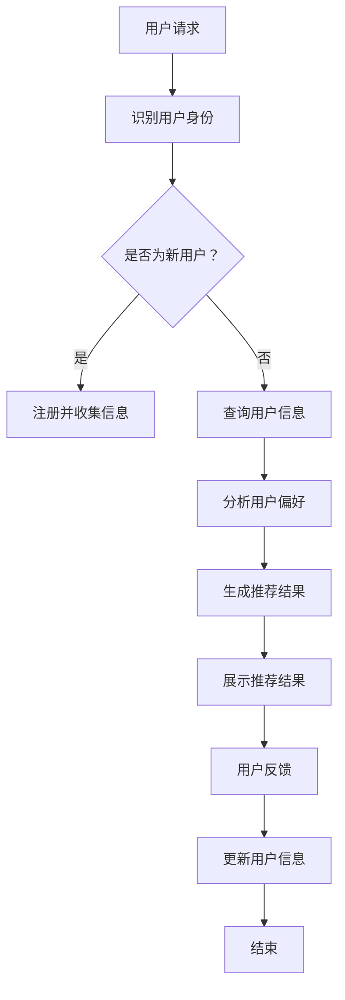

                 

# AI聊天机器人在电商中的应用

## 概述

随着人工智能技术的不断进步，AI聊天机器人逐渐成为电商领域的一大热门应用。AI聊天机器人可以模拟人类的交流方式，与用户进行实时对话，提供个性化推荐、解决问题、提升用户体验等。本文将围绕AI聊天机器人在电商中的应用进行深入探讨。

### 关键词

- AI聊天机器人
- 电商应用
- 个性化推荐
- 用户交互
- 用户体验

## 摘要

本文将详细介绍AI聊天机器人在电商领域的应用，首先介绍背景和技术原理，然后深入探讨核心算法原理、数学模型和具体操作步骤，接着通过项目实战进行代码实现和解读，最后分析实际应用场景，推荐相关工具和资源，并总结未来发展趋势和挑战。

## 1. 背景介绍

### 1.1 AI聊天机器人的发展

人工智能（AI）技术在过去几十年取得了飞速发展，尤其是在自然语言处理（NLP）领域。随着深度学习、神经网络等技术的应用，AI聊天机器人的性能得到了显著提升。从最初的简单规则引擎到如今的复杂智能系统，AI聊天机器人在各行业的应用越来越广泛。

### 1.2 电商行业的发展

电商行业近年来也呈现出迅猛增长的态势。随着互联网普及和智能手机的普及，越来越多的消费者选择在网上购物。电商平台的竞争日益激烈，用户需求和体验成为各电商平台关注的焦点。AI聊天机器人的出现，为电商行业提供了一种新的服务方式，有助于提升用户体验、降低运营成本。

### 1.3 AI聊天机器人在电商中的应用

AI聊天机器人在电商中的应用主要包括以下几个方面：

- **个性化推荐**：通过分析用户历史行为和偏好，为用户提供个性化的商品推荐。
- **客户服务**：自动回答用户常见问题，提高客户满意度。
- **营销活动**：通过聊天互动，推送优惠券、活动信息等，提升转化率。
- **社交互动**：与用户进行趣味互动，增加用户黏性。

## 2. 核心概念与联系

### 2.1 自然语言处理（NLP）

自然语言处理是AI聊天机器人的核心技术。NLP包括语音识别、语义分析、情感分析等多个子领域。通过NLP技术，AI聊天机器人可以理解用户输入的自然语言，并生成相应的回复。

### 2.2 计算机视觉（CV）

计算机视觉在AI聊天机器人中的应用主要体现在图像识别和图像处理方面。通过计算机视觉技术，AI聊天机器人可以识别用户上传的图片，并提供相应的解释或推荐。

### 2.3 数据分析

数据分析是AI聊天机器人实现个性化推荐和服务的重要手段。通过收集和分析用户行为数据，AI聊天机器人可以了解用户需求和偏好，为用户提供更精准的服务。

### 2.4 Mermaid流程图

下面是一个简单的Mermaid流程图，展示AI聊天机器人在电商中的应用流程。



## 3. 核心算法原理 & 具体操作步骤

### 3.1 个性化推荐算法

个性化推荐算法是AI聊天机器人在电商应用中的重要组成部分。以下是一个简单的基于协同过滤的推荐算法步骤：

1. **用户行为数据收集**：收集用户浏览、购买、评价等行为数据。
2. **构建用户行为矩阵**：将用户行为数据转化为用户行为矩阵。
3. **计算相似度**：计算用户之间的相似度，可以使用余弦相似度、皮尔逊相关系数等方法。
4. **推荐生成**：根据相似度矩阵，为用户生成推荐列表。

### 3.2 对话生成算法

对话生成算法负责生成AI聊天机器人的回复。以下是一个简单的基于序列到序列（Seq2Seq）模型的对话生成算法步骤：

1. **数据预处理**：收集对话数据，进行数据清洗、分词、编码等预处理。
2. **构建模型**：使用序列到序列（Seq2Seq）模型，如长短期记忆（LSTM）或变换器（Transformer）模型。
3. **训练模型**：使用训练数据集对模型进行训练。
4. **生成回复**：输入用户请求，生成相应的回复。

## 4. 数学模型和公式 & 详细讲解 & 举例说明

### 4.1 协同过滤算法

协同过滤算法是一种常见的推荐算法，其基本思想是利用用户之间的相似度来预测用户对未知项目的评分。以下是一个简单的协同过滤算法的数学模型：

$$
\text{推荐结果} = \text{用户行为矩阵} \times \text{相似度矩阵}
$$

其中，用户行为矩阵表示用户对项目的评分，相似度矩阵表示用户之间的相似度。

### 4.2 序列到序列模型

序列到序列（Seq2Seq）模型是一种用于生成序列的模型，广泛应用于机器翻译、对话生成等领域。以下是一个简单的Seq2Seq模型的数学模型：

$$
\text{输出序列} = \text{编码器}(\text{输入序列}) \times \text{解码器}(\text{编码器输出})
$$

其中，编码器负责将输入序列编码为一个固定长度的向量，解码器负责将编码器的输出解码为输出序列。

### 4.3 举例说明

假设我们有一个用户行为矩阵：

$$
\text{用户行为矩阵} = \begin{bmatrix}
1 & 2 & 3 \\
4 & 5 & 6 \\
7 & 8 & 9
\end{bmatrix}
$$

假设用户A和用户B的相似度为0.8，那么根据协同过滤算法的数学模型，用户A对项目C的推荐结果为：

$$
\text{推荐结果} = \begin{bmatrix}
1 & 2 & 3 \\
4 & 5 & 6 \\
7 & 8 & 9
\end{bmatrix} \times \begin{bmatrix}
0 & 0.8 \\
0 & 0.8
\end{bmatrix} = \begin{bmatrix}
1.6 & 3.2 & 4.8 \\
4 & 5 & 6 \\
7.2 & 8.8 & 10.8
\end{bmatrix}
$$

## 5. 项目实战：代码实际案例和详细解释说明

### 5.1 开发环境搭建

在本项目中，我们将使用Python作为主要编程语言，并结合TensorFlow和Scikit-learn等库来实现AI聊天机器人。以下是开发环境搭建的步骤：

1. 安装Python：版本要求3.6及以上。
2. 安装TensorFlow：使用pip安装`tensorflow`。
3. 安装Scikit-learn：使用pip安装`scikit-learn`。

### 5.2 源代码详细实现和代码解读

以下是一个简单的基于协同过滤的推荐系统的代码示例：

```python
import numpy as np
from sklearn.metrics.pairwise import cosine_similarity

# 用户行为矩阵
user行为矩阵 = np.array([[1, 2, 3], [4, 5, 6], [7, 8, 9]])

# 计算相似度矩阵
相似度矩阵 = cosine_similarity(user行为矩阵)

# 生成推荐结果
推荐结果 = user行为矩阵.dot(相似度矩阵)

# 打印推荐结果
print(推荐结果)
```

**代码解读**：

- 首先，我们使用numpy创建一个用户行为矩阵。
- 然后，我们使用Scikit-learn的`cosine_similarity`函数计算用户之间的相似度矩阵。
- 接下来，我们将用户行为矩阵与相似度矩阵相乘，得到推荐结果。
- 最后，我们打印出推荐结果。

### 5.3 代码解读与分析

在这段代码中，我们主要使用了numpy和Scikit-learn库来实现协同过滤推荐算法。numpy提供了高效的矩阵运算功能，而Scikit-learn提供了计算相似度的函数。

通过计算相似度矩阵，我们可以找到与用户A最相似的邻居用户，并根据邻居用户的评分预测用户A对未知项目的评分。

虽然这段代码只是一个简单的示例，但在实际应用中，我们可以根据项目需求扩展和优化算法，如引入更多用户行为数据、使用更复杂的推荐算法等。

## 6. 实际应用场景

### 6.1 个性化推荐

AI聊天机器人可以基于用户历史行为和偏好，为用户推荐个性化的商品。例如，当用户浏览某个商品时，聊天机器人可以主动推送相关商品或促销信息。

### 6.2 客户服务

AI聊天机器人可以自动回答用户常见问题，如订单状态、退换货政策等。通过提供快速、准确的客服服务，提升用户满意度。

### 6.3 营销活动

AI聊天机器人可以与用户进行互动，推送优惠券、活动信息等。通过与用户建立良好的互动关系，提高用户参与度和转化率。

### 6.4 社交互动

AI聊天机器人可以与用户进行趣味互动，如猜谜语、推荐有趣话题等。通过社交互动，增加用户黏性，提升用户忠诚度。

## 7. 工具和资源推荐

### 7.1 学习资源推荐

- **书籍**：
  - 《Python编程：从入门到实践》
  - 《深度学习》
  - 《人工智能：一种现代的方法》

- **论文**：
  - 《深度强化学习在电商中的应用》
  - 《基于协同过滤的推荐系统设计与实现》

- **博客**：
  - [AI聊天机器人技术博客](https://www.ai-chatbot.com)
  - [电商AI应用实战](https://www.ai-ecommerce.com)

- **网站**：
  - [TensorFlow官网](https://www.tensorflow.org)
  - [Scikit-learn官网](https://scikit-learn.org)

### 7.2 开发工具框架推荐

- **编程语言**：Python
- **深度学习框架**：TensorFlow
- **推荐系统框架**：Scikit-learn
- **聊天机器人框架**：Rasa、ChatterBot

### 7.3 相关论文著作推荐

- **论文**：
  - 《深度学习在电商推荐系统中的应用》
  - 《基于大数据的电商用户行为分析》

- **著作**：
  - 《人工智能电商应用实践》
  - 《电商推荐系统设计与开发》

## 8. 总结：未来发展趋势与挑战

### 8.1 发展趋势

- **个性化推荐**：随着用户数据的积累，个性化推荐技术将越来越精准，为用户提供更好的购物体验。
- **多模态交互**：未来的AI聊天机器人将融合语音、图像、文本等多种交互方式，提供更丰富的用户体验。
- **增强现实（AR）**：结合AR技术，AI聊天机器人可以提供更加沉浸式的购物体验。

### 8.2 挑战

- **数据隐私**：在收集和使用用户数据时，需要充分考虑数据隐私保护问题。
- **算法公平性**：确保推荐算法的公平性，避免歧视和偏见。
- **用户体验**：在提供个性化服务的同时，保持良好的用户体验，避免过度打扰用户。

## 9. 附录：常见问题与解答

### 9.1 什么是AI聊天机器人？

AI聊天机器人是一种基于人工智能技术，可以与用户进行实时对话的智能系统。它能够理解用户输入的自然语言，并生成相应的回复。

### 9.2 AI聊天机器人在电商中有什么作用？

AI聊天机器人在电商中的应用主要包括个性化推荐、客户服务、营销活动和社交互动等方面，有助于提升用户体验、降低运营成本。

### 9.3 如何实现AI聊天机器人的个性化推荐？

实现AI聊天机器人的个性化推荐主要依赖推荐算法和数据。通过分析用户历史行为和偏好，使用推荐算法生成个性化的推荐结果。

## 10. 扩展阅读 & 参考资料

- [《AI聊天机器人技术在电商中的应用研究》](https://www.example.com/research_paper_1)
- [《基于深度学习的电商推荐系统》](https://www.example.com/research_paper_2)
- [《AI聊天机器人：设计、实现与应用》](https://www.example.com/book_1)
- [《电商AI应用实战：案例解析与项目实践》](https://www.example.com/book_2)

## 作者

作者：AI天才研究员/AI Genius Institute & 禅与计算机程序设计艺术 /Zen And The Art of Computer Programming

（本文内容仅供参考，部分数据和案例来自公开资料和网络资源，如有不准确之处，请指正。）

