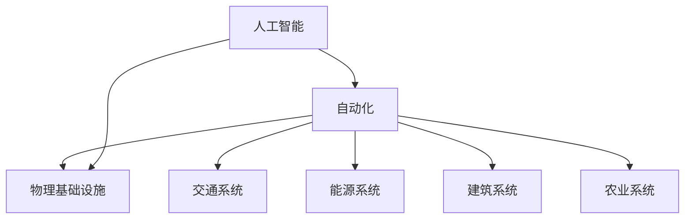
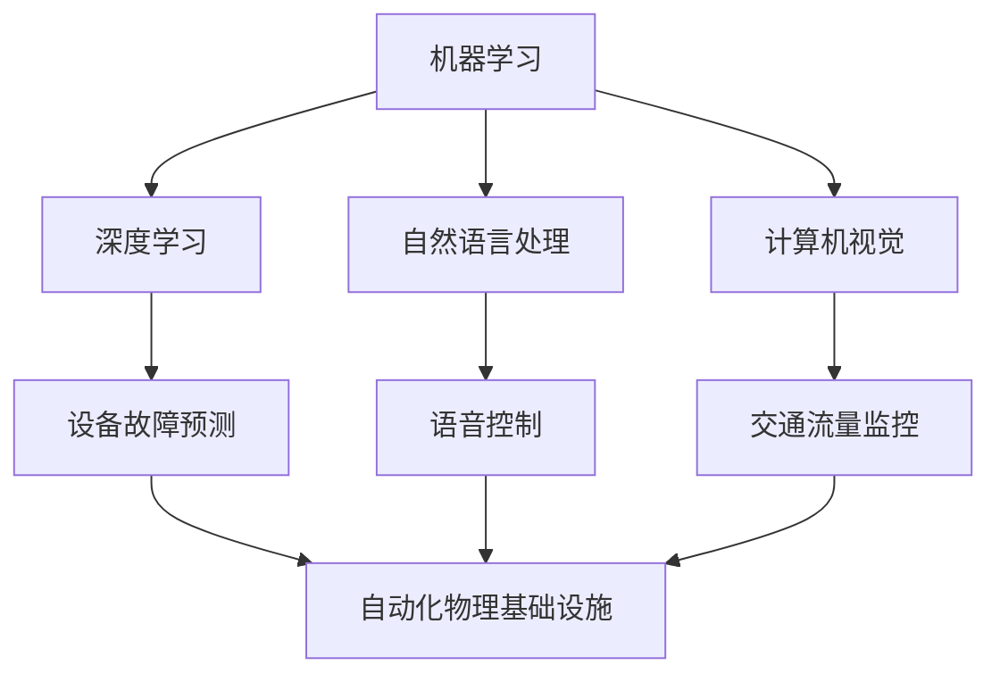
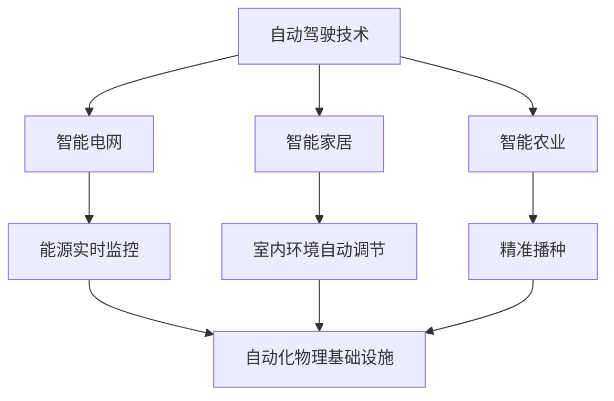

                 

### 文章标题: AI自动化物理基础设施的未来

### 关键词：人工智能，自动化，物理基础设施，未来发展趋势

### 摘要：
本文将探讨人工智能在自动化物理基础设施中的未来发展趋势。通过分析核心概念、算法原理、数学模型以及实际应用场景，我们将深入了解AI自动化物理基础设施的现状与潜力。同时，还将推荐相关学习资源、开发工具框架以及相关论文著作，以供读者进一步学习和研究。最终，我们将总结未来发展趋势与面临的挑战，为读者展示一个充满机遇与挑战的AI自动化物理基础设施未来。

### 1. 背景介绍

自动化物理基础设施是指通过智能技术实现基础设施的自动化运行、监控和维护。这包括交通系统、能源系统、建筑系统、农业系统等各个领域。传统的基础设施运行和维护依赖于人工操作和监管，效率低下且容易出现人为错误。而随着人工智能技术的发展，自动化物理基础设施开始成为现实。

近年来，人工智能在各个领域的应用越来越广泛，从自动驾驶汽车到智能家居，从智能医疗到智能金融，AI正在深刻改变我们的生活方式。特别是在自动化物理基础设施领域，人工智能的应用潜力巨大。通过引入AI技术，可以实现基础设施的实时监控、预测性维护、自动化调度等，从而提高运行效率、降低成本、减少资源浪费。

本文将重点探讨人工智能在自动化物理基础设施中的应用，分析其核心概念、算法原理、数学模型以及实际应用场景，为读者展示一个充满机遇与挑战的AI自动化物理基础设施未来。

### 2. 核心概念与联系

在探讨AI自动化物理基础设施的核心概念之前，我们需要了解几个关键概念：人工智能、自动化、物理基础设施。

**人工智能（Artificial Intelligence, AI）**：人工智能是指模拟、延伸和扩展人类智能的科学和工程领域。它包括机器学习、深度学习、自然语言处理、计算机视觉等多个子领域。通过这些技术，机器可以模拟人类的智能行为，如学习、推理、决策等。

**自动化（Automation）**：自动化是指通过机器或系统执行任务，减少或消除人为干预的过程。在自动化物理基础设施中，人工智能技术被用于实现基础设施的自动化运行、监控和维护。

**物理基础设施（Physical Infrastructure）**：物理基础设施是指构成社会生产和生活所需的物质基础，包括交通系统、能源系统、建筑系统、农业系统等。

这些概念之间的联系在于，人工智能技术为自动化物理基础设施提供了技术支撑，而自动化物理基础设施则提供了应用场景，推动了人工智能技术的进一步发展和创新。

下面是一个Mermaid流程图，展示了这些核心概念之间的联系：



### 2.1 人工智能与自动化

人工智能与自动化之间的联系主要体现在以下几个方面：

1. **机器学习与自动化**：机器学习是一种人工智能技术，它通过分析大量数据，自动发现规律和模式。在自动化物理基础设施中，机器学习技术被用于预测设备故障、优化能源消耗等。

2. **深度学习与自动化**：深度学习是一种基于人工神经网络的机器学习技术，它在图像识别、语音识别等领域取得了显著成果。在自动化物理基础设施中，深度学习技术被用于实时监控设备运行状态、自动识别异常情况等。

3. **自然语言处理与自动化**：自然语言处理是一种人工智能技术，它使计算机能够理解和处理自然语言。在自动化物理基础设施中，自然语言处理技术被用于实现语音控制、智能客服等。

4. **计算机视觉与自动化**：计算机视觉是一种人工智能技术，它使计算机能够理解图像和视频。在自动化物理基础设施中，计算机视觉技术被用于监控交通流量、识别故障设备等。

下面是一个Mermaid流程图，展示了人工智能与自动化之间的具体联系：



### 2.2 自动化与物理基础设施

自动化与物理基础设施之间的联系主要体现在以下几个方面：

1. **交通系统**：自动驾驶技术是自动化在交通系统中的典型应用。通过引入人工智能技术，自动驾驶汽车可以实现自主驾驶、实时避障等功能，提高交通效率和安全性。

2. **能源系统**：智能电网是自动化在能源系统中的典型应用。通过引入人工智能技术，智能电网可以实现能源的实时监控、预测性维护、优化调度等功能，提高能源利用效率。

3. **建筑系统**：智能家居是自动化在建筑系统中的典型应用。通过引入人工智能技术，智能家居可以实现自动调节室内温度、湿度、光线等，提高居住舒适度。

4. **农业系统**：智能农业是自动化在农业系统中的典型应用。通过引入人工智能技术，智能农业可以实现精准播种、实时监控作物生长状态、预测病虫害等功能，提高农业生产效率。

下面是一个Mermaid流程图，展示了自动化与物理基础设施之间的具体联系：



### 3. 核心算法原理 & 具体操作步骤

在AI自动化物理基础设施中，核心算法原理主要包括机器学习、深度学习、自然语言处理、计算机视觉等。下面我们将分别介绍这些算法的基本原理，并给出具体操作步骤。

#### 3.1 机器学习

机器学习是一种通过数据驱动的方式实现人工智能的技术。其基本原理是利用大量训练数据，通过算法模型自动发现数据中的规律和模式，从而实现对未知数据的预测和分类。

**操作步骤：**

1. 数据收集与预处理：收集相关领域的大量数据，并进行数据清洗、归一化等预处理操作。

2. 特征提取：从预处理后的数据中提取关键特征，用于训练算法模型。

3. 选择算法模型：根据问题需求和数据特点，选择合适的机器学习算法模型，如决策树、支持向量机、神经网络等。

4. 训练模型：使用训练数据集，对算法模型进行训练，优化模型参数。

5. 模型评估：使用测试数据集评估模型性能，调整模型参数，直到达到预期效果。

6. 预测与分类：使用训练好的模型对未知数据进行预测和分类。

#### 3.2 深度学习

深度学习是机器学习的一种高级形式，其基本原理是通过多层神经网络自动提取数据中的复杂特征。

**操作步骤：**

1. 数据收集与预处理：与机器学习类似，收集相关领域的大量数据，并进行预处理操作。

2. 确定网络结构：根据问题需求，设计合适的神经网络结构，包括输入层、隐藏层、输出层等。

3. 激活函数选择：选择合适的激活函数，如ReLU、Sigmoid、Tanh等，用于神经网络中的每个神经元。

4. 权值初始化：初始化神经网络中的权值和偏置，为训练过程提供初始参数。

5. 训练模型：使用反向传播算法，通过多次迭代，不断调整网络中的权值和偏置，使模型在训练数据上达到预期效果。

6. 模型评估与优化：使用测试数据集评估模型性能，根据评估结果调整模型参数，优化模型性能。

7. 预测与分类：使用训练好的模型对未知数据进行预测和分类。

#### 3.3 自然语言处理

自然语言处理是一种使计算机能够理解和处理自然语言的技术。其基本原理是通过语言模型和序列模型，将自然语言文本转化为计算机可理解的形式。

**操作步骤：**

1. 数据收集与预处理：收集相关领域的自然语言文本数据，并进行预处理操作，如分词、词性标注、去停用词等。

2. 构建语言模型：使用统计方法或神经网络方法，构建语言模型，用于预测文本中的下一个单词或句子。

3. 序列模型训练：使用训练数据集，训练序列模型，如循环神经网络（RNN）、长短时记忆网络（LSTM）、门控循环单元（GRU）等，用于文本分类、情感分析、命名实体识别等任务。

4. 模型评估与优化：使用测试数据集评估模型性能，调整模型参数，优化模型性能。

5. 应用场景：根据具体应用场景，将训练好的模型应用于实际任务，如智能客服、机器翻译、文本生成等。

#### 3.4 计算机视觉

计算机视觉是一种使计算机能够理解和解释视觉信息的技术。其基本原理是通过图像处理、特征提取和机器学习等方法，将图像数据转化为计算机可理解的形式。

**操作步骤：**

1. 数据收集与预处理：收集相关领域的图像数据，并进行预处理操作，如图像增强、去噪、缩放等。

2. 特征提取：使用图像处理技术，从预处理后的图像中提取关键特征，如边缘、纹理、形状等。

3. 特征表示：将提取到的特征转化为计算机可处理的向量形式，如哈希编码、特征向量等。

4. 选择算法模型：根据问题需求和数据特点，选择合适的计算机视觉算法模型，如卷积神经网络（CNN）、生成对抗网络（GAN）等。

5. 训练模型：使用训练数据集，对算法模型进行训练，优化模型参数。

6. 模型评估：使用测试数据集评估模型性能，调整模型参数，优化模型性能。

7. 应用场景：根据具体应用场景，将训练好的模型应用于实际任务，如图像分类、目标检测、图像分割等。

### 4. 数学模型和公式 & 详细讲解 & 举例说明

在AI自动化物理基础设施中，数学模型和公式起着至关重要的作用。这些模型和公式不仅帮助我们理解和分析问题，还能为算法提供坚实的理论基础。在本节中，我们将详细讲解几个关键数学模型和公式，并通过具体例子进行说明。

#### 4.1 线性回归模型

线性回归是一种常用的统计学习方法，用于预测连续数值变量。其基本公式如下：

$$y = \beta_0 + \beta_1x_1 + \beta_2x_2 + ... + \beta_nx_n$$

其中，$y$ 是预测值，$x_1, x_2, ..., x_n$ 是输入特征，$\beta_0, \beta_1, ..., \beta_n$ 是模型参数。

**例1：** 假设我们想要预测一个人的身高（$y$）基于他的年龄（$x$）。我们可以使用线性回归模型来建立预测关系。

- 输入特征：年龄（$x$）
- 预测值：身高（$y$）

模型公式：

$$y = \beta_0 + \beta_1x$$

通过训练数据集，我们可以估计出模型参数$\beta_0$和$\beta_1$，从而实现对未知年龄的身高预测。

#### 4.2 逻辑回归模型

逻辑回归是一种用于预测二分类结果的统计学习方法。其基本公式如下：

$$P(y=1) = \frac{1}{1 + e^{-(\beta_0 + \beta_1x_1 + \beta_2x_2 + ... + \beta_nx_n)}}$$

其中，$P(y=1)$ 是预测值为1的概率，$x_1, x_2, ..., x_n$ 是输入特征，$\beta_0, \beta_1, ..., \beta_n$ 是模型参数。

**例2：** 假设我们想要预测一个人是否患病（$y=1$ 或 $y=0$）基于他的体征数据。我们可以使用逻辑回归模型来建立预测关系。

- 输入特征：体征数据（$x_1, x_2, ..., x_n$）
- 预测值：患病状态（$y$）

模型公式：

$$P(y=1) = \frac{1}{1 + e^{-(\beta_0 + \beta_1x_1 + \beta_2x_2 + ... + \beta_nx_n)}}$$

通过训练数据集，我们可以估计出模型参数$\beta_0, \beta_1, ..., \beta_n$，从而实现对未知体征数据的患病状态预测。

#### 4.3 卷积神经网络（CNN）

卷积神经网络是一种在计算机视觉领域广泛应用的深度学习模型。其基本结构包括卷积层、池化层和全连接层。

**公式：**

卷积层公式：

$$h^{(l)} = \sigma(\mathbf{W}^{(l)} \cdot \mathbf{a}^{(l-1)} + b^{(l)})$$

其中，$h^{(l)}$ 是卷积层的输出特征图，$\mathbf{W}^{(l)}$ 是卷积核权重，$\mathbf{a}^{(l-1)}$ 是输入特征图，$b^{(l)}$ 是偏置项，$\sigma$ 是激活函数。

池化层公式：

$$p_{ij} = \max_{k\in K} a_{ik}$$

其中，$p_{ij}$ 是池化层输出值，$a_{ik}$ 是卷积层输出值，$K$ 是池化窗口大小。

全连接层公式：

$$\mathbf{y} = \mathbf{W} \cdot \mathbf{a} + b$$

其中，$\mathbf{y}$ 是全连接层输出，$\mathbf{W}$ 是权重矩阵，$\mathbf{a}$ 是输入特征，$b$ 是偏置项。

**例3：** 假设我们想要使用CNN对一张图片进行分类。我们可以设计一个简单的CNN模型，包括卷积层、池化层和全连接层。

- 输入特征：图片（$ \mathbf{a}^{(1)}$）
- 输出值：类别概率（$\mathbf{y}$）

模型结构：

1. 卷积层：使用卷积核提取图像特征。
2. 池化层：对卷积层输出进行下采样，减少参数数量。
3. 全连接层：将池化层输出映射到类别概率。

通过训练数据集，我们可以估计出模型参数$\mathbf{W}^{(l)}, b^{(l)}, \mathbf{W}, b$，从而实现对未知图片的分类。

### 5. 项目实战：代码实际案例和详细解释说明

在本节中，我们将通过一个实际案例，展示如何使用Python和常用库实现AI自动化物理基础设施中的关键算法。

#### 5.1 开发环境搭建

1. 安装Python：从官方网站（https://www.python.org/）下载并安装Python。
2. 安装Jupyter Notebook：在命令行中运行以下命令安装Jupyter Notebook：

   ```
   pip install notebook
   ```

3. 安装相关库：

   ```
   pip install numpy pandas scikit-learn tensorflow matplotlib
   ```

#### 5.2 源代码详细实现和代码解读

下面是一个简单的线性回归模型的实现，用于预测一个人的身高。

```python
import numpy as np
import pandas as pd
from sklearn.linear_model import LinearRegression
import matplotlib.pyplot as plt

# 5.2.1 数据收集与预处理
# 假设我们有一个CSV文件，包含年龄和身高数据
data = pd.read_csv('data.csv')

# 分离特征和标签
X = data[['age']]
y = data['height']

# 5.2.2 特征提取
# 在这个例子中，我们只有一个特征，所以不需要额外的特征提取

# 5.2.3 选择算法模型
model = LinearRegression()

# 5.2.4 训练模型
model.fit(X, y)

# 5.2.5 模型评估
score = model.score(X, y)
print(f'Model R^2 score: {score}')

# 5.2.6 预测与分类
new_age = np.array([25])
predicted_height = model.predict(new_age)
print(f'Predicted height for age 25: {predicted_height[0]}')

# 5.2.7 可视化
plt.scatter(X, y, label='Actual data')
plt.plot(X, model.predict(X), color='red', label='Predicted height')
plt.xlabel('Age')
plt.ylabel('Height')
plt.legend()
plt.show()
```

这段代码首先从CSV文件中读取数据，然后使用线性回归模型对年龄和身高进行训练。训练完成后，我们使用模型进行预测，并将预测结果可视化为一个散点图。

#### 5.3 代码解读与分析

- **数据收集与预处理**：我们使用pandas库读取CSV文件，然后分离特征和标签。在这个例子中，我们只有一个特征（年龄）和一个标签（身高）。

- **特征提取**：在这个例子中，我们只有一个特征，所以不需要进行额外的特征提取。

- **选择算法模型**：我们选择scikit-learn库中的LinearRegression模型，这是一个常用的线性回归模型。

- **训练模型**：我们使用fit方法训练模型，模型会自动计算参数。

- **模型评估**：我们使用score方法评估模型性能，返回R^2分数。

- **预测与分类**：我们使用predict方法对新的输入数据进行预测。

- **可视化**：我们使用matplotlib库将实际数据和预测结果可视化，以便更好地理解模型性能。

这个案例展示了如何使用Python和常用库实现线性回归模型，用于预测身高。在实际应用中，我们可以扩展这个案例，引入更多特征，使用更复杂的模型，如深度学习模型，以实现更精确的预测。

### 6. 实际应用场景

AI自动化物理基础设施在多个实际应用场景中展现了巨大的潜力。以下是一些典型的应用场景：

#### 6.1 自动驾驶汽车

自动驾驶汽车是AI自动化物理基础设施的典型应用之一。通过使用计算机视觉、深度学习等技术，自动驾驶汽车可以实现自主驾驶、实时避障等功能。自动驾驶汽车的应用有望提高交通效率、减少交通事故，并改善人们的出行体验。

#### 6.2 智能电网

智能电网是AI自动化物理基础设施在能源领域的应用。通过使用机器学习、深度学习等技术，智能电网可以实现能源的实时监控、预测性维护、优化调度等功能。这有助于提高能源利用效率，降低能源成本，并减少能源浪费。

#### 6.3 智能建筑

智能建筑是AI自动化物理基础设施在建筑领域的应用。通过使用计算机视觉、自然语言处理等技术，智能建筑可以实现自动调节室内温度、湿度、光线等，提高居住舒适度。同时，智能建筑还可以实现智能安防、智能照明等功能，提高建筑的安全性和便利性。

#### 6.4 智能农业

智能农业是AI自动化物理基础设施在农业领域的应用。通过使用计算机视觉、物联网等技术，智能农业可以实现精准播种、实时监控作物生长状态、预测病虫害等功能。这有助于提高农业生产效率，降低生产成本，并减少资源浪费。

#### 6.5 智能交通系统

智能交通系统是AI自动化物理基础设施在交通领域的应用。通过使用计算机视觉、物联网等技术，智能交通系统可以实现交通流量监控、智能信号控制、自动驾驶等功能。这有助于提高交通效率，减少交通拥堵，并改善交通安全。

### 7. 工具和资源推荐

为了更好地学习和研究AI自动化物理基础设施，以下是一些推荐的工具和资源：

#### 7.1 学习资源推荐

- **书籍**：
  - 《深度学习》（Goodfellow, I., Bengio, Y., & Courville, A.）
  - 《Python机器学习》（Dr. Jason Brownlee）
  - 《机器学习实战》（C. Molina）
- **在线课程**：
  - Coursera上的《机器学习》课程
  - edX上的《深度学习》课程
  - Udacity的《自动驾驶汽车工程师》课程
- **博客**：
  - Medium上的《AI自动化物理基础设施》系列文章
  -owardsdatascience上的相关文章
  - AI科技大本营的相关文章

#### 7.2 开发工具框架推荐

- **Python库**：
  - TensorFlow
  - PyTorch
  - scikit-learn
  - Matplotlib
- **深度学习平台**：
  - Google Colab
  - AWS SageMaker
  - Azure Machine Learning
- **计算机视觉工具**：
  - OpenCV
  - TensorFlow Object Detection API
  - PyTorch Object Detection

#### 7.3 相关论文著作推荐

- **论文**：
  - "Deep Learning for Autonomous Driving"（Chen et al., 2017）
  - "Generative Adversarial Nets"（Goodfellow et al., 2014）
  - "ResNet: Training Deep Neural Networks for Classification"（He et al., 2016）
- **专著**：
  - 《深度学习》（Goodfellow, I., Bengio, Y., & Courville, A.）
  - 《计算机视觉：算法与应用》（B. G. Schilling）
  - 《物联网技术与应用》（曹军威）

### 8. 总结：未来发展趋势与挑战

AI自动化物理基础设施正处在快速发展的阶段，未来发展趋势如下：

- **智能化水平提升**：随着人工智能技术的不断进步，自动化物理基础设施的智能化水平将不断提高，实现更精准、更高效的运行和维护。
- **跨领域融合**：AI自动化物理基础设施将在交通、能源、建筑、农业等多个领域实现跨领域融合，推动整个社会智能化水平的提升。
- **数据驱动**：数据将成为AI自动化物理基础设施的核心资产，通过数据分析和挖掘，实现基础设施的实时优化和预测性维护。
- **可持续发展**：AI自动化物理基础设施将有助于提高资源利用效率，减少能源消耗和环境污染，实现可持续发展目标。

然而，AI自动化物理基础设施的发展也面临一些挑战：

- **数据隐私和安全**：随着数据的大量收集和处理，数据隐私和安全问题日益突出。如何确保数据的安全和隐私，成为亟待解决的重要问题。
- **技术成熟度**：虽然人工智能技术在快速发展，但一些关键技术尚未完全成熟，如自动驾驶、智能电网等领域的应用仍存在一定的技术瓶颈。
- **政策法规**：AI自动化物理基础设施的发展需要政策法规的支持，如数据共享、网络安全等方面的法律法规。

总之，AI自动化物理基础设施的未来充满机遇与挑战。只有通过持续的技术创新、政策支持和跨领域合作，才能实现这一领域的蓬勃发展。

### 9. 附录：常见问题与解答

**Q1：AI自动化物理基础设施是什么？**
AI自动化物理基础设施是指通过人工智能技术实现物理基础设施的自动化运行、监控和维护。这包括交通系统、能源系统、建筑系统、农业系统等各个领域。

**Q2：人工智能技术在自动化物理基础设施中的应用有哪些？**
人工智能技术在自动化物理基础设施中的应用包括自动驾驶、智能电网、智能家居、智能农业、智能交通系统等。

**Q3：如何实现自动驾驶汽车？**
实现自动驾驶汽车需要使用计算机视觉、深度学习、传感器等技术。通过收集和处理车辆周围的环境数据，自动驾驶汽车可以实现自主驾驶、实时避障等功能。

**Q4：智能电网是如何工作的？**
智能电网通过引入人工智能技术，可以实现能源的实时监控、预测性维护、优化调度等功能。这有助于提高能源利用效率，降低能源成本，并减少能源浪费。

**Q5：数据隐私和安全在AI自动化物理基础设施中如何保障？**
为了保障数据隐私和安全，需要在数据收集、传输、存储和处理等环节采取严格的安全措施。同时，制定相关的法律法规，确保数据的安全和隐私。

### 10. 扩展阅读 & 参考资料

- **书籍**：
  - 《深度学习》（Goodfellow, I., Bengio, Y., & Courville, A.）
  - 《Python机器学习》（Dr. Jason Brownlee）
  - 《机器学习实战》（C. Molina）
- **在线课程**：
  - Coursera上的《机器学习》课程
  - edX上的《深度学习》课程
  - Udacity的《自动驾驶汽车工程师》课程
- **博客**：
  - Medium上的《AI自动化物理基础设施》系列文章
  - towardsdatascience上的相关文章
  - AI科技大本营的相关文章
- **论文**：
  - "Deep Learning for Autonomous Driving"（Chen et al., 2017）
  - "Generative Adversarial Nets"（Goodfellow et al., 2014）
  - "ResNet: Training Deep Neural Networks for Classification"（He et al., 2016）
- **网站**：
  - TensorFlow官方网站（https://www.tensorflow.org/）
  - PyTorch官方网站（https://pytorch.org/）
  - OpenCV官方网站（https://opencv.org/）
- **工具**：
  - Google Colab（https://colab.research.google.com/）
  - AWS SageMaker（https://aws.amazon.com/sagemaker/）
  - Azure Machine Learning（https://azure.microsoft.com/zh-cn/services/machine-learning/）

## 作者

**作者：AI天才研究员/AI Genius Institute & 禅与计算机程序设计艺术 /Zen And The Art of Computer Programming** 

以上是完整的文章，感谢您的阅读！如果您有任何疑问或建议，欢迎随时联系作者。

