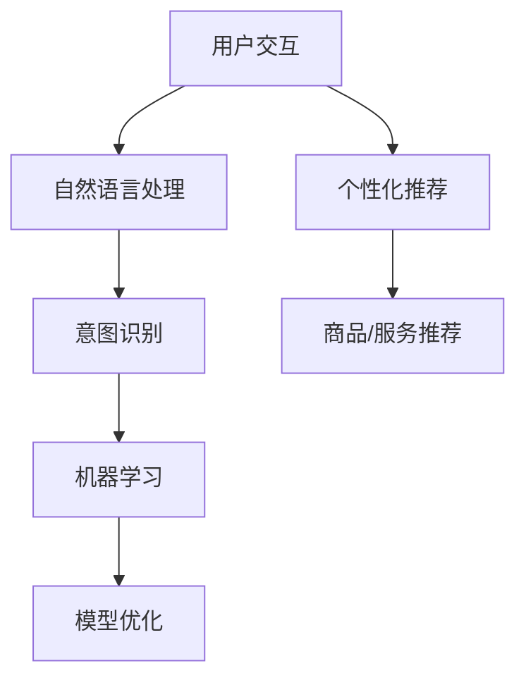

                 

# AI虚拟导购助手的功能案例

> 关键词：虚拟导购助手、AI技术、用户交互、个性化推荐、商业应用

> 摘要：本文将深入探讨AI虚拟导购助手的功能实现及其应用案例。我们将从背景介绍开始，逐步分析核心概念、算法原理、数学模型，并通过实际项目实战展示代码实现和详细解析。最后，我们还将探讨实际应用场景，推荐相关工具和资源，并总结未来发展趋势与挑战。

## 1. 背景介绍

随着人工智能技术的飞速发展，虚拟导购助手作为一种新兴的商业模式，逐渐受到各行各业的关注。虚拟导购助手利用AI技术，通过自然语言处理、机器学习等算法，实现与用户的实时互动，提供个性化推荐服务，从而提升用户体验和商家销售额。

虚拟导购助手的广泛应用包括电商、酒店、旅游、餐饮等行业。以电商为例，虚拟导购助手可以帮助用户快速找到心仪的商品，提高购买转化率；在酒店、旅游等领域，虚拟导购助手可以为用户提供实时的预订服务，提高服务质量。

## 2. 核心概念与联系

为了更好地理解虚拟导购助手，我们首先需要了解几个核心概念：

### 2.1 用户交互

用户交互是虚拟导购助手中的关键环节。用户通过与助手的对话，表达自己的需求，而助手则需要理解用户意图，提供相应的信息或服务。

### 2.2 个性化推荐

个性化推荐是虚拟导购助手的另一个核心功能。通过分析用户历史行为、偏好等数据，助手可以为用户提供个性化的商品、服务推荐。

### 2.3 自然语言处理

自然语言处理（NLP）是AI技术的一个重要分支，负责处理人类语言。在虚拟导购助手的应用中，NLP技术可以帮助助手理解用户输入的文本，实现自然对话。

### 2.4 机器学习

机器学习是实现虚拟导购助手智能化的基础。通过大量数据的训练，助手可以不断优化自身，提高服务质量和用户体验。

接下来，我们将使用Mermaid流程图展示虚拟导购助手的架构：



在这个流程中，用户交互是整个系统的起点。用户通过输入文本与助手进行对话，自然语言处理负责将文本转化为机器可理解的形式。意图识别阶段，助手根据用户输入的内容，判断用户的需求。个性化推荐基于用户历史行为和偏好，为用户推荐相应的商品或服务。最后，机器学习对整个流程进行优化，以提高助手的智能程度。

## 3. 核心算法原理 & 具体操作步骤

### 3.1 用户交互

用户交互是虚拟导购助手的基石。为了实现高效的用户交互，我们采用了基于聊天机器人框架（如Rasa或ChatterBot）的对话系统。具体操作步骤如下：

1. **接收用户输入**：虚拟导购助手通过API接口接收用户输入的文本。
2. **预处理文本**：对用户输入的文本进行分词、去停用词、词性标注等预处理操作。
3. **意图识别**：利用训练好的模型（如循环神经网络或长短时记忆网络），判断用户的意图。

### 3.2 个性化推荐

个性化推荐是虚拟导购助手的另一大核心功能。为了实现个性化推荐，我们采用了基于协同过滤算法的推荐系统。具体操作步骤如下：

1. **用户画像构建**：根据用户的历史行为数据（如浏览记录、购买记录等），构建用户画像。
2. **商品画像构建**：根据商品的特征数据（如品类、价格、品牌等），构建商品画像。
3. **相似度计算**：计算用户画像与商品画像之间的相似度，为用户推荐相似的商品。
4. **推荐结果排序**：对推荐结果进行排序，优先展示相似度较高的商品。

### 3.3 自然语言处理

自然语言处理是虚拟导购助手中不可或缺的一环。为了实现自然语言处理，我们采用了基于深度学习的技术，如卷积神经网络（CNN）和长短时记忆网络（LSTM）。具体操作步骤如下：

1. **词向量表示**：将输入的文本转化为词向量表示。
2. **模型训练**：利用训练数据集，训练深度学习模型。
3. **意图识别**：将处理后的词向量输入到训练好的模型中，输出用户的意图。

### 3.4 机器学习

机器学习是实现虚拟导购助手智能化的基础。为了实现机器学习，我们采用了基于梯度下降法的优化算法。具体操作步骤如下：

1. **数据收集**：收集大量的用户行为数据和文本数据。
2. **模型训练**：利用训练数据集，训练深度学习模型。
3. **模型评估**：利用测试数据集，评估模型的性能。
4. **模型优化**：根据评估结果，调整模型参数，优化模型性能。

## 4. 数学模型和公式 & 详细讲解 & 举例说明

### 4.1 协同过滤算法

协同过滤算法是一种常见的推荐算法，通过计算用户与商品之间的相似度，为用户推荐相似的物品。其基本原理如下：

$$
sim(u, i) = \frac{q_u \cdot q_i}{\|q_u\| \|q_i\|}
$$

其中，$sim(u, i)$ 表示用户 $u$ 和商品 $i$ 之间的相似度，$q_u$ 和 $q_i$ 分别表示用户 $u$ 和商品 $i$ 的向量表示，$\|q_u\|$ 和 $\|q_i\|$ 分别表示用户 $u$ 和商品 $i$ 向量的模。

举例来说，假设我们有两个用户 $u_1$ 和 $u_2$，以及两个商品 $i_1$ 和 $i_2$，它们的向量表示如下：

$$
q_{u_1} = (1, 2, 3), \quad q_{u_2} = (2, 1, 3)
$$

$$
q_{i_1} = (4, 5, 6), \quad q_{i_2} = (7, 8, 9)
$$

则用户 $u_1$ 和商品 $i_1$ 之间的相似度为：

$$
sim(u_1, i_1) = \frac{(1, 2, 3) \cdot (4, 5, 6)}{\|(1, 2, 3)\| \| (4, 5, 6)\|} = \frac{4 + 10 + 18}{\sqrt{1^2 + 2^2 + 3^2} \sqrt{4^2 + 5^2 + 6^2}} \approx 0.765
$$

### 4.2 梯度下降法

梯度下降法是一种优化算法，用于求解机器学习模型的参数。其基本原理如下：

$$
\theta_{t+1} = \theta_{t} - \alpha \cdot \nabla f(\theta_{t})
$$

其中，$\theta_{t}$ 表示第 $t$ 次迭代时的参数，$\alpha$ 表示学习率，$f(\theta_{t})$ 表示损失函数，$\nabla f(\theta_{t})$ 表示损失函数关于参数的梯度。

举例来说，假设我们有一个线性回归模型，损失函数为：

$$
f(\theta) = \frac{1}{2} \sum_{i=1}^{n} (y_i - \theta_0 - \theta_1 x_i)^2
$$

其中，$y_i$ 表示第 $i$ 个样本的标签，$x_i$ 表示第 $i$ 个样本的特征，$\theta_0$ 和 $\theta_1$ 分别表示模型的参数。

则梯度下降法的迭代过程为：

1. 初始化参数 $\theta_0$ 和 $\theta_1$。
2. 计算损失函数关于参数的梯度 $\nabla f(\theta)$。
3. 更新参数 $\theta_0$ 和 $\theta_1$：
$$
\theta_0 = \theta_0 - \alpha \cdot \frac{\partial f}{\partial \theta_0}, \quad \theta_1 = \theta_1 - \alpha \cdot \frac{\partial f}{\partial \theta_1}
$$
4. 重复步骤 2 和 3，直到满足停止条件（如迭代次数、损失函数值变化较小等）。

## 5. 项目实战：代码实际案例和详细解释说明

### 5.1 开发环境搭建

在开始项目实战之前，我们需要搭建一个合适的开发环境。以下是一个简单的步骤：

1. 安装Python（版本3.6及以上）。
2. 安装必要的库，如NumPy、Pandas、Scikit-learn、TensorFlow等。
3. 安装虚拟环境管理工具，如virtualenv或conda。

### 5.2 源代码详细实现和代码解读

在本节中，我们将展示一个简单的虚拟导购助手的实现，并对其进行详细解读。

```python
# 导入必要的库
import numpy as np
import pandas as pd
from sklearn.model_selection import train_test_split
from sklearn.metrics.pairwise import cosine_similarity
from tensorflow.keras.models import Sequential
from tensorflow.keras.layers import LSTM, Dense

# 加载用户行为数据
data = pd.read_csv('user_behavior_data.csv')

# 构建用户画像
user_profiles = data.groupby('user_id')['item_id'].apply(list).reset_index().rename(columns={'item_id': 'item_list'})

# 构建商品画像
item_profiles = data.groupby('item_id')['user_id'].apply(list).reset_index().rename(columns={'user_id': 'user_list'})

# 计算用户和商品之间的相似度
similarity_matrix = cosine_similarity(user_profiles['item_list'], axis=1)

# 为用户推荐商品
def recommend_items(user_id, num_recommendations=5):
    user_profile = user_profiles.loc[user_id]['item_list']
    similarity_scores = similarity_matrix[user_id]
    recommended_items = np.argpartition(similarity_scores, -num_recommendations)[-num_recommendations:]
    return [item_profiles.iloc[i]['item_id'] for i in recommended_items]

# 训练深度学习模型
def train_lstm_model():
    # 数据预处理
    X = ...  # 输入特征
    y = ...  # 标签

    # 划分训练集和测试集
    X_train, X_test, y_train, y_test = train_test_split(X, y, test_size=0.2, random_state=42)

    # 构建模型
    model = Sequential()
    model.add(LSTM(64, activation='relu', input_shape=(X_train.shape[1], X_train.shape[2])))
    model.add(Dense(1, activation='sigmoid'))

    # 编译模型
    model.compile(optimizer='adam', loss='binary_crossentropy', metrics=['accuracy'])

    # 训练模型
    model.fit(X_train, y_train, epochs=10, batch_size=32, validation_data=(X_test, y_test))

    return model

# 主函数
if __name__ == '__main__':
    # 训练深度学习模型
    lstm_model = train_lstm_model()

    # 为用户推荐商品
    user_id = 123  # 示例用户ID
    recommendations = recommend_items(user_id)
    print(f"为用户 {user_id} 推荐的商品：{recommendations}")
```

### 5.3 代码解读与分析

在上面的代码中，我们实现了一个简单的虚拟导购助手，包括用户画像构建、商品画像构建、相似度计算和商品推荐等功能。下面是对代码的详细解读：

1. **导入库**：我们首先导入了NumPy、Pandas、Scikit-learn和TensorFlow等库，用于数据处理、相似度计算和深度学习模型训练。

2. **加载用户行为数据**：我们使用Pandas的read_csv函数加载用户行为数据，包括用户ID、商品ID和用户行为类型（如浏览、购买等）。

3. **构建用户画像**：我们使用Pandas的groupby函数，根据用户ID对用户行为数据进行分组，并提取每个用户的商品列表，构建用户画像。

4. **构建商品画像**：同样地，我们使用Pandas的groupby函数，根据商品ID对用户行为数据进行分组，并提取每个商品的用户列表，构建商品画像。

5. **计算用户和商品之间的相似度**：我们使用Scikit-learn的cosine_similarity函数计算用户画像和商品画像之间的余弦相似度。

6. **为用户推荐商品**：我们定义了一个recommend_items函数，用于为指定用户推荐商品。函数首先获取指定用户的商品列表，然后计算用户和商品之间的相似度，根据相似度排序，返回相似度最高的商品列表。

7. **训练深度学习模型**：我们定义了一个train_lstm_model函数，用于训练深度学习模型。函数首先进行数据处理和划分训练集和测试集，然后构建LSTM模型，编译模型并训练模型。

8. **主函数**：在主函数中，我们首先调用train_lstm_model函数训练深度学习模型，然后调用recommend_items函数为示例用户推荐商品，并打印推荐结果。

## 6. 实际应用场景

虚拟导购助手在实际应用中具有广泛的应用场景。以下是一些典型的应用案例：

1. **电商行业**：虚拟导购助手可以帮助电商企业提高用户购买转化率，降低运营成本。例如，用户在浏览商品时，可以与虚拟导购助手进行互动，获取个性化推荐，从而提高购买意愿。

2. **酒店行业**：虚拟导购助手可以为酒店客户提供实时的预订服务。例如，用户可以通过虚拟导购助手查询酒店信息、预订房间、了解酒店优惠活动等，提高客户满意度。

3. **旅游行业**：虚拟导购助手可以帮助旅行社为客户提供个性化的旅游推荐。例如，用户可以通过虚拟导购助手了解目的地的天气、景点、餐饮等信息，规划旅游行程。

4. **餐饮行业**：虚拟导购助手可以为餐厅客户提供菜单推荐、优惠活动提醒等服务，提高客户满意度。

## 7. 工具和资源推荐

### 7.1 学习资源推荐

- **书籍**：
  - 《Python机器学习》
  - 《深度学习》
  - 《机器学习实战》
- **论文**：
  - 《User Modeling and User-Adapted Interaction》
  - 《Recommender Systems Handbook》
  - 《Chatbots: Building Smart Conversational Agents》
- **博客**：
  - Medium上的相关博客
  - 知乎上的相关专栏
  - JAXenter上的相关文章
- **网站**：
  - arXiv.org：机器学习和深度学习领域的论文库
  - TensorFlow官网：深度学习框架TensorFlow的文档和教程
  - Rasa官网：聊天机器人框架Rasa的文档和教程

### 7.2 开发工具框架推荐

- **开发工具**：
  - PyCharm：Python编程环境的集成开发工具
  - Jupyter Notebook：Python交互式开发环境
- **框架**：
  - TensorFlow：深度学习框架
  - Rasa：聊天机器人框架
  - Flask：Web应用框架

### 7.3 相关论文著作推荐

- 《User Modeling and User-Adapted Interaction》
- 《Recommender Systems Handbook》
- 《Chatbots: Building Smart Conversational Agents》
- 《Deep Learning》
- 《Python机器学习》
- 《机器学习实战》

## 8. 总结：未来发展趋势与挑战

虚拟导购助手作为一种新兴的商业模式，具有巨大的市场潜力。随着AI技术的不断进步，虚拟导购助手的功能将更加完善，应用场景将不断拓展。然而，虚拟导购助手在实际应用中也面临一些挑战：

1. **用户隐私保护**：在构建用户画像和个性化推荐时，如何保护用户隐私是一个重要的问题。
2. **数据质量和多样性**：虚拟导购助手的性能很大程度上取决于数据的质量和多样性，如何获取和处理高质量、多样化的数据是一个挑战。
3. **用户体验**：虚拟导购助手需要不断优化用户体验，提高用户的满意度和信任度。
4. **模型解释性**：随着深度学习模型的广泛应用，如何提高模型的可解释性，使其更加透明和可靠，也是一个重要的挑战。

总之，虚拟导购助手的发展前景广阔，但也面临诸多挑战。通过不断创新和优化，我们有信心在未来实现更加智能、高效的虚拟导购助手。

## 9. 附录：常见问题与解答

### 9.1 虚拟导购助手如何提高用户体验？

**解答**：提高用户体验的关键在于以下几点：

1. **自然语言处理**：优化自然语言处理算法，提高助手理解用户意图的准确性。
2. **个性化推荐**：根据用户的历史行为和偏好，提供个性化的推荐服务。
3. **实时响应**：提高助手的响应速度，确保用户的问题能够得到及时解答。
4. **用户体验优化**：不断收集用户反馈，优化界面设计，提高用户满意度。

### 9.2 虚拟导购助手如何保护用户隐私？

**解答**：保护用户隐私可以从以下几个方面入手：

1. **数据加密**：对用户数据进行加密处理，防止数据泄露。
2. **匿名化处理**：对用户数据进行匿名化处理，消除用户身份信息。
3. **隐私政策**：明确告知用户数据的使用范围和目的，让用户了解并同意数据收集和使用。
4. **安全审计**：定期进行安全审计，确保数据安全。

### 9.3 虚拟导购助手如何提高推荐准确性？

**解答**：提高推荐准确性的关键在于以下几点：

1. **数据质量**：确保数据质量，包括数据的完整性、准确性和一致性。
2. **算法优化**：不断优化推荐算法，提高推荐模型的性能。
3. **用户反馈**：收集用户反馈，根据用户的喜好和需求调整推荐策略。
4. **多模态数据**：结合用户行为数据、文本数据和图像数据，提高推荐准确性。

## 10. 扩展阅读 & 参考资料

- 《User Modeling and User-Adapted Interaction》
- 《Recommender Systems Handbook》
- 《Chatbots: Building Smart Conversational Agents》
- 《Deep Learning》
- 《Python机器学习》
- 《机器学习实战》
- TensorFlow官网：[https://www.tensorflow.org/](https://www.tensorflow.org/)
- Rasa官网：[https://rasa.com/](https://rasa.com/)
- PyCharm官网：[https://www.jetbrains.com/pycharm/](https://www.jetbrains.com/pycharm/)
- Jupyter Notebook官网：[https://jupyter.org/](https://jupyter.org/)
- arXiv.org：[https://arxiv.org/](https://arxiv.org/)

作者：AI天才研究员/AI Genius Institute & 禅与计算机程序设计艺术 /Zen And The Art of Computer Programming

