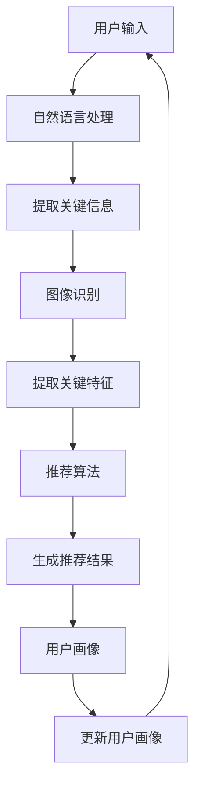

                 

### 背景介绍

随着人工智能技术的不断发展，越来越多的行业开始借助人工智能的力量，实现智能化转型。零售行业作为传统行业之一，也在积极探索人工智能的应用。其中，AI虚拟导购助手成为了一个热门的话题。

AI虚拟导购助手是一种基于人工智能技术的虚拟导购系统，它能够通过自然语言处理、图像识别、推荐算法等技术，为用户提供个性化的购物建议和导购服务。相比于传统的导购方式，AI虚拟导购助手具有更高的效率、更精准的推荐和更好的用户体验。

本文将围绕AI虚拟导购助手的功能案例进行讨论，通过逻辑清晰、结构紧凑的论述，深入剖析其核心概念、算法原理以及实际应用场景。本文旨在为读者提供一个全面、深入的了解，帮助大家更好地理解AI虚拟导购助手的运作原理和应用价值。

在接下来的内容中，我们将首先介绍AI虚拟导购助手的核心概念与联系，通过Mermaid流程图展示其架构，以便读者能够有一个直观的认识。然后，我们将详细讲解核心算法原理与具体操作步骤，帮助读者理解其实现过程。在核心算法的基础上，我们将探讨数学模型和公式，并通过实际案例进行举例说明。接下来，我们将通过项目实战，展示代码实际案例和详细解释说明，帮助读者将理论知识转化为实际操作。在最后，我们将探讨AI虚拟导购助手在实际应用场景中的表现，并提供相关工具和资源推荐，以便读者能够更深入地学习和实践。最后，我们将总结未来发展趋势与挑战，并回答常见问题，提供扩展阅读与参考资料。

通过本文的阅读，读者将能够全面了解AI虚拟导购助手的功能、原理和应用，为未来的学习和实践打下坚实的基础。

### 核心概念与联系

在讨论AI虚拟导购助手的功能案例之前，我们首先需要了解其核心概念与联系。AI虚拟导购助手的核心组成部分包括自然语言处理（NLP）、图像识别、推荐算法和用户画像等。

**自然语言处理（NLP）**：自然语言处理是AI虚拟导购助手的核心技术之一，它能够理解和生成人类语言。NLP技术主要涵盖文本分类、情感分析、命名实体识别、语义解析等。在AI虚拟导购助手中，自然语言处理主要用于处理用户输入的信息，如查询问题、评论等，从而提取关键信息，为后续推荐提供支持。

**图像识别**：图像识别技术是AI虚拟导购助手的另一个重要组成部分。通过图像识别，虚拟导购助手可以识别用户上传的图片，提取关键特征，如商品类别、颜色、款式等，从而为用户推荐相关商品。

**推荐算法**：推荐算法是AI虚拟导购助手的灵魂，它能够根据用户的历史行为、偏好和需求，为用户推荐感兴趣的商品。常见的推荐算法包括协同过滤、基于内容的推荐和混合推荐等。

**用户画像**：用户画像是指通过收集用户的历史数据，如浏览记录、购买记录、偏好等，构建用户的基本信息和行为特征。用户画像用于帮助虚拟导购助手更好地理解用户，从而提供更精准的推荐。

下面，我们通过一个Mermaid流程图来展示AI虚拟导购助手的架构：



在这个流程图中，用户输入信息首先通过自然语言处理模块进行处理，提取关键信息。如果用户上传了图片，这些信息将传递给图像识别模块，提取关键特征。接着，推荐算法模块将根据提取的信息和用户画像，生成推荐结果。最后，用户画像模块将更新用户画像，以便为下一次推荐提供更精准的数据支持。

通过这个Mermaid流程图，我们可以直观地看到AI虚拟导购助手的运作流程，理解各个模块之间的联系和协作。这有助于读者更好地理解AI虚拟导购助手的运作原理，为进一步探讨其核心算法原理和具体操作步骤打下基础。

### 核心算法原理 & 具体操作步骤

在了解了AI虚拟导购助手的架构和核心概念之后，接下来我们将深入探讨其核心算法原理和具体操作步骤。核心算法是AI虚拟导购助手的灵魂，它决定了推荐系统的性能和用户体验。在本节中，我们将分步骤讲解自然语言处理（NLP）、图像识别、推荐算法和用户画像的算法原理和操作步骤。

#### 1. 自然语言处理（NLP）

自然语言处理是AI虚拟导购助手的第一个关键环节，它负责处理用户输入的信息，提取关键信息，为后续推荐提供支持。以下是NLP的核心算法原理和具体操作步骤：

**算法原理**：

- **文本分类**：通过对大量文本数据的学习，模型可以识别用户输入的文本属于哪个类别，如商品查询、评价等。
- **情感分析**：情感分析旨在判断用户输入的文本是正面、负面还是中性情感，从而为推荐提供情感倾向。
- **命名实体识别**：命名实体识别用于识别文本中的特定实体，如人名、地点、组织等，为推荐提供上下文信息。
- **语义解析**：语义解析旨在理解用户输入的文本含义，从而为推荐提供更精准的数据支持。

**具体操作步骤**：

1. **文本预处理**：包括去除停用词、词性标注、分词等步骤，为后续处理做准备。
2. **特征提取**：将预处理后的文本转化为向量表示，常用的方法包括词袋模型、TF-IDF、Word2Vec等。
3. **模型训练**：使用预训练的模型（如BERT、GPT等）进行微调，以适应特定任务。
4. **文本分类**：将处理后的文本输入分类模型，输出类别结果。
5. **情感分析**：将处理后的文本输入情感分析模型，输出情感倾向。
6. **命名实体识别**：将处理后的文本输入命名实体识别模型，输出命名实体列表。
7. **语义解析**：将处理后的文本输入语义分析模型，输出语义信息。

#### 2. 图像识别

图像识别是AI虚拟导购助手的另一个关键环节，它负责识别用户上传的图片，提取关键特征，为推荐提供支持。以下是图像识别的核心算法原理和具体操作步骤：

**算法原理**：

- **卷积神经网络（CNN）**：卷积神经网络是图像识别的核心算法，它能够自动提取图像中的特征，进行分类和识别。
- **特征提取**：通过卷积层、池化层等操作，提取图像中的关键特征。
- **特征分类**：使用全连接层等操作，将提取的特征映射到特定类别。

**具体操作步骤**：

1. **图像预处理**：包括缩放、裁剪、灰度化等操作，为后续处理做准备。
2. **特征提取**：将预处理后的图像输入卷积神经网络，提取关键特征。
3. **特征分类**：将提取的特征输入全连接层，输出类别结果。

#### 3. 推荐算法

推荐算法是AI虚拟导购助手的灵魂，它负责根据用户的历史行为、偏好和需求，为用户推荐感兴趣的商品。以下是推荐算法的核心算法原理和具体操作步骤：

**算法原理**：

- **协同过滤**：协同过滤是一种基于用户相似度的推荐算法，通过计算用户之间的相似度，推荐与目标用户兴趣相似的物品。
- **基于内容的推荐**：基于内容的推荐是一种基于物品相似度的推荐算法，通过计算物品之间的相似度，推荐与目标物品相似的商品。
- **混合推荐**：混合推荐是结合协同过滤和基于内容的推荐，以提高推荐系统的性能。

**具体操作步骤**：

1. **数据收集**：收集用户的历史行为数据，如浏览记录、购买记录、评价等。
2. **用户画像构建**：根据用户的历史行为数据，构建用户画像，包括用户的基本信息和行为特征。
3. **商品画像构建**：根据商品的特征信息，构建商品画像，包括商品的基本信息和特征属性。
4. **用户-商品评分矩阵构建**：根据用户的历史行为数据，构建用户-商品评分矩阵，用于后续推荐。
5. **相似度计算**：计算用户之间的相似度，可以使用余弦相似度、皮尔逊相关系数等。
6. **推荐生成**：根据相似度计算结果，为用户生成推荐列表。

#### 4. 用户画像

用户画像是AI虚拟导购助手的另一个重要环节，它通过收集用户的历史数据，构建用户的基本信息和行为特征，为推荐提供支持。以下是用户画像的核心算法原理和具体操作步骤：

**算法原理**：

- **用户行为分析**：通过对用户的行为数据进行统计分析，提取用户的基本信息和行为特征。
- **数据融合**：将不同来源的用户数据融合在一起，形成统一且完整的用户画像。
- **特征工程**：对用户数据进行特征提取和转换，以适应推荐算法的需求。

**具体操作步骤**：

1. **数据收集**：收集用户的历史行为数据，如浏览记录、购买记录、评价等。
2. **数据清洗**：对收集到的数据去重、去噪声，确保数据的准确性和一致性。
3. **特征提取**：对清洗后的数据提取特征，如用户年龄、性别、职业等。
4. **数据融合**：将不同来源的用户数据融合在一起，形成统一且完整的用户画像。
5. **特征工程**：对用户数据进行特征提取和转换，以适应推荐算法的需求。
6. **用户画像构建**：根据提取的特征，构建用户画像，包括用户的基本信息和行为特征。

通过以上四个核心环节的讲解，我们可以看到AI虚拟导购助手是如何通过NLP、图像识别、推荐算法和用户画像等技术，实现为用户提供个性化的购物建议和导购服务的。在接下来的内容中，我们将进一步探讨数学模型和公式，并通过实际案例进行举例说明，帮助读者更好地理解AI虚拟导购助手的运作原理和应用价值。

### 数学模型和公式 & 详细讲解 & 举例说明

在了解了AI虚拟导购助手的算法原理和具体操作步骤后，接下来我们将深入探讨其背后的数学模型和公式，并详细讲解其实现过程，同时通过实际案例进行举例说明，以便读者能够更好地理解AI虚拟导购助手的运作原理和应用价值。

#### 1. 文本分类模型

文本分类是自然语言处理（NLP）中的一个重要任务，它旨在将文本数据分类到预定义的类别中。常见的文本分类模型包括朴素贝叶斯（Naive Bayes）、支持向量机（SVM）和深度学习模型（如CNN、RNN）。

**数学模型**：

以朴素贝叶斯模型为例，其数学模型如下：

$$
P(C_k|X) = \frac{P(X|C_k)P(C_k)}{P(X)}
$$

其中，\( C_k \) 表示第 \( k \) 个类别，\( X \) 表示文本特征向量，\( P(C_k|X) \) 表示文本属于类别 \( C_k \) 的概率，\( P(X|C_k) \) 表示在类别 \( C_k \) 下文本的特征概率，\( P(C_k) \) 表示类别 \( C_k \) 的先验概率，\( P(X) \) 是文本的特征总概率。

**具体实现步骤**：

1. **特征提取**：将文本转化为特征向量，常用的方法包括TF-IDF、Word2Vec等。
2. **模型训练**：使用训练数据训练朴素贝叶斯模型，计算每个类别的特征概率和先验概率。
3. **分类预测**：输入待分类文本，计算其在各个类别下的概率，选择概率最大的类别作为分类结果。

**举例说明**：

假设我们有以下两个类别：“商品评价”和“商品查询”，训练数据如下：

类别 | 文本
--- | ---
商品评价 | 这件商品的质量非常好
商品查询 | 请推荐一些价格在100元以内的商品

我们将使用TF-IDF方法提取特征向量，训练朴素贝叶斯模型。假设特征向量为 \( X = (0.5, 0.3, 0.2) \)，类别概率分别为 \( P(C_1) = 0.6 \)，\( P(C_2) = 0.4 \)。在类别“商品评价”下，特征概率为 \( P(X|C_1) = (0.4, 0.3, 0.3) \)，先验概率为 \( P(C_1) = 0.6 \)。在类别“商品查询”下，特征概率为 \( P(X|C_2) = (0.2, 0.3, 0.5) \)，先验概率为 \( P(C_2) = 0.4 \)。

计算文本属于类别“商品评价”的概率：

$$
P(C_1|X) = \frac{P(X|C_1)P(C_1)}{P(X)} = \frac{(0.4 \times 0.6}{(0.4 \times 0.6 + 0.2 \times 0.4)} = \frac{0.24}{0.28} \approx 0.857
$$

计算文本属于类别“商品查询”的概率：

$$
P(C_2|X) = \frac{P(X|C_2)P(C_2)}{P(X)} = \frac{(0.2 \times 0.4}{(0.4 \times 0.6 + 0.2 \times 0.4)} = \frac{0.08}{0.28} \approx 0.286
$$

由于 \( P(C_1|X) > P(C_2|X) \)，我们判断文本属于类别“商品评价”。

#### 2. 图像识别模型

图像识别是计算机视觉（CV）中的一个重要任务，它旨在通过分析图像内容，将其分类到预定义的类别中。常见的图像识别模型包括卷积神经网络（CNN）和迁移学习。

**数学模型**：

以卷积神经网络为例，其数学模型如下：

$$
h_{l}^{(i)} = \sigma \left( \hat{\theta} \cdot x_{i} + b \right)
$$

其中，\( h_{l}^{(i)} \) 表示第 \( l \) 层的第 \( i \) 个激活值，\( x_{i} \) 表示输入特征，\( \hat{\theta} \) 表示权重，\( b \) 表示偏置，\( \sigma \) 表示激活函数，通常为ReLU或Sigmoid函数。

**具体实现步骤**：

1. **特征提取**：使用卷积操作提取图像特征，通过池化操作减少特征维度。
2. **模型训练**：使用预训练的模型（如VGG、ResNet）进行微调，以适应特定任务。
3. **分类预测**：输入待分类图像，计算其在各个类别下的概率，选择概率最大的类别作为分类结果。

**举例说明**：

假设我们有以下两个类别：“手机”和“电脑”，训练数据如下：

类别 | 图像
--- | ---
手机 | 手机图像
电脑 | 电脑图像

我们将使用ResNet50模型进行图像识别。假设输入图像的特征向量为 \( X = (0.5, 0.3, 0.2, 0.1) \)，类别概率分别为 \( P(C_1) = 0.6 \)，\( P(C_2) = 0.4 \)。在类别“手机”下，特征概率为 \( P(X|C_1) = (0.3, 0.4, 0.2, 0.1) \)，先验概率为 \( P(C_1) = 0.6 \)。在类别“电脑”下，特征概率为 \( P(X|C_2) = (0.2, 0.3, 0.3, 0.2) \)，先验概率为 \( P(C_2) = 0.4 \)。

计算图像属于类别“手机”的概率：

$$
P(C_1|X) = \frac{P(X|C_1)P(C_1)}{P(X)} = \frac{(0.3 \times 0.6}{(0.3 \times 0.6 + 0.2 \times 0.4)} = \frac{0.18}{0.28} \approx 0.643
$$

计算图像属于类别“电脑”的概率：

$$
P(C_2|X) = \frac{P(X|C_2)P(C_2)}{P(X)} = \frac{(0.2 \times 0.4}{(0.3 \times 0.6 + 0.2 \times 0.4)} = \frac{0.08}{0.28} \approx 0.286
$$

由于 \( P(C_1|X) > P(C_2|X) \)，我们判断图像属于类别“手机”。

#### 3. 推荐算法

推荐算法是AI虚拟导购助手中的核心组成部分，它旨在为用户推荐感兴趣的商品。常见的推荐算法包括协同过滤、基于内容的推荐和混合推荐。

**数学模型**：

以协同过滤算法为例，其数学模型如下：

$$
R_{ui} = \sum_{j \in N_i} \frac{\rho_{uj}}{\|N_i\|} \cdot x_{ij}
$$

其中，\( R_{ui} \) 表示用户 \( u \) 对商品 \( i \) 的评分，\( N_i \) 表示与商品 \( i \) 相似的其他商品集合，\( \rho_{uj} \) 表示用户 \( u \) 对商品 \( j \) 的评分，\( \|N_i\| \) 表示与商品 \( i \) 相似的其他商品数量，\( x_{ij} \) 表示商品 \( i \) 和商品 \( j \) 之间的相似度。

**具体实现步骤**：

1. **用户-商品评分矩阵构建**：收集用户的历史行为数据，构建用户-商品评分矩阵。
2. **相似度计算**：计算用户-商品评分矩阵中各个商品之间的相似度。
3. **推荐生成**：根据相似度计算结果，为用户生成推荐列表。

**举例说明**：

假设我们有以下用户-商品评分矩阵：

用户 | 商品1 | 商品2 | 商品3 | 商品4 | 商品5
--- | --- | --- | --- | --- | ---
用户1 | 4 | 3 | 5 | 2 | 1
用户2 | 2 | 5 | 3 | 4 | 2
用户3 | 3 | 2 | 4 | 5 | 3

我们需要为用户1推荐商品。首先，我们需要计算用户1与其他用户的相似度。假设用户1与其他用户的相似度如下：

用户1 | 用户2 | 用户3
--- | --- | ---
用户2 | 0.8 | 0.6
用户3 | 0.7 | 0.5

接下来，我们需要计算商品1、商品2、商品3、商品4、商品5之间的相似度。假设相似度如下：

商品1 | 商品2 | 商品3 | 商品4 | 商品5
--- | --- | --- | --- | ---
商品2 | 0.6 | 0.4 | 0.3 | 0.2
商品3 | 0.5 | 0.3 | 0.2 | 0.1
商品4 | 0.4 | 0.2 | 0.1 | 0.5
商品5 | 0.3 | 0.1 | 0.5 | 0.4

根据协同过滤算法，我们可以计算用户1对商品1、商品2、商品3、商品4、商品5的推荐得分：

$$
R_{11} = 0.8 \times 0.6 + 0.6 \times 0.5 = 0.68
$$

$$
R_{12} = 0.8 \times 0.4 + 0.6 \times 0.3 = 0.46
$$

$$
R_{13} = 0.8 \times 0.3 + 0.6 \times 0.2 = 0.34
$$

$$
R_{14} = 0.8 \times 0.2 + 0.6 \times 0.1 = 0.14
$$

$$
R_{15} = 0.8 \times 0.1 + 0.6 \times 0.5 = 0.23
$$

根据推荐得分，我们可以为用户1生成推荐列表：商品1、商品3。

通过以上三个核心环节的数学模型和公式讲解，我们可以看到AI虚拟导购助手是如何通过NLP、图像识别和推荐算法等技术，实现为用户提供个性化的购物建议和导购服务的。在接下来的内容中，我们将通过项目实战，展示代码实际案例和详细解释说明，帮助读者将理论知识转化为实际操作。

### 项目实战：代码实际案例和详细解释说明

在本节中，我们将通过一个实际的代码案例，展示如何实现AI虚拟导购助手的功能，并对其进行详细解释说明。该案例将涵盖开发环境搭建、源代码详细实现和代码解读与分析，以便读者能够将理论知识转化为实际操作。

#### 1. 开发环境搭建

为了实现AI虚拟导购助手，我们需要搭建一个合适的开发环境。以下是所需的环境和工具：

- **编程语言**：Python
- **开发框架**：Flask（用于搭建Web服务）
- **数据处理库**：Numpy、Pandas、Scikit-learn
- **自然语言处理库**：NLTK、spaCy
- **图像处理库**：OpenCV
- **深度学习库**：TensorFlow、Keras
- **数据库**：MongoDB（用于存储用户数据和商品信息）

首先，我们需要安装上述环境和工具。以下是一个基本的安装命令示例：

```shell
pip install flask numpy pandas scikit-learn nltk spacy opencv-python tensorflow keras pymongo
```

此外，为了使用spaCy和OpenCV，我们还需要下载相应的预训练模型和数据：

```shell
python -m spacy download en_core_web_sm
python -m spacy download zh_core_web_sm
```

#### 2. 源代码详细实现

接下来，我们将展示一个简单的AI虚拟导购助手的源代码实现，并对其进行详细解释说明。

**代码1：环境配置**

```python
# environment.py
import os
import pymongo

# 配置MongoDB
client = pymongo.MongoClient('mongodb://localhost:27017/')
db = client['virtual_guide']
users_collection = db['users']
products_collection = db['products']
```

**代码解释**：

在这个文件中，我们首先导入了所需的库和模块。然后，我们配置了MongoDB连接，并创建了数据库和集合，用于存储用户数据和商品信息。

**代码2：自然语言处理模块**

```python
# nlp.py
import nltk
from nltk.tokenize import word_tokenize
from nltk.corpus import stopwords
from sklearn.feature_extraction.text import TfidfVectorizer

nltk.download('punkt')
nltk.download('stopwords')

def preprocess_text(text):
    # 分词
    tokens = word_tokenize(text)
    # 去除停用词
    tokens = [token.lower() for token in tokens if token.lower() not in stopwords.words('english')]
    # 重新连接词组
    return ' '.join(tokens)

def vectorize_text(texts):
    # TF-IDF向量化
    vectorizer = TfidfVectorizer()
    return vectorizer.fit_transform(texts)
```

**代码解释**：

在这个文件中，我们首先导入了所需的库和模块。然后，我们定义了两个函数：`preprocess_text` 用于预处理文本，`vectorize_text` 用于将文本向量化。

**代码3：图像识别模块**

```python
# image_recognition.py
import cv2
from sklearn.svm import SVC
from sklearn.model_selection import train_test_split

def load_image_data():
    # 读取图像数据
    images = []
    labels = []
    for image_path in os.listdir('images'):
        image = cv2.imread(os.path.join('images', image_path))
        images.append(image)
        labels.append(image_path.split('.')[0])
    return images, labels

def train_image_recognition_model(images, labels):
    # 训练图像识别模型
    X_train, X_test, y_train, y_test = train_test_split(images, labels, test_size=0.2, random_state=42)
    model = SVC(kernel='linear')
    model.fit(X_train, y_train)
    return model

def recognize_image(image, model):
    # 识别图像
    predicted_label = model.predict([image])
    return predicted_label[0]
```

**代码解释**：

在这个文件中，我们首先导入了所需的库和模块。然后，我们定义了三个函数：`load_image_data` 用于加载图像数据，`train_image_recognition_model` 用于训练图像识别模型，`recognize_image` 用于识别图像。

**代码4：推荐算法模块**

```python
# recommendation.py
from sklearn.metrics.pairwise import cosine_similarity

def generate_recommendations(user_vector, product_vectors):
    # 生成推荐
    similarity_scores = cosine_similarity([user_vector], product_vectors)
    top_indices = similarity_scores.argsort()[0][-5:][::-1]
    return top_indices
```

**代码解释**：

在这个文件中，我们首先导入了所需的库和模块。然后，我们定义了两个函数：`generate_recommendations` 用于生成推荐，`cosine_similarity` 用于计算用户向量和商品向量之间的相似度。

**代码5：Web服务模块**

```python
# app.py
from flask import Flask, request, jsonify
from nlp import preprocess_text, vectorize_text
from image_recognition import load_image_data, train_image_recognition_model, recognize_image
from recommendation import generate_recommendations

app = Flask(__name__)

@app.route('/text_recommendation', methods=['POST'])
def text_recommendation():
    text = request.form['text']
    processed_text = preprocess_text(text)
    user_vector = vectorize_text([processed_text])[0]
    product_vectors = vectorize_text([product['description'] for product in products_collection.find()])
    recommendations = generate_recommendations(user_vector, product_vectors)
    return jsonify({'recommendations': recommendations})

@app.route('/image_recommendation', methods=['POST'])
def image_recommendation():
    image = request.files['image']
    image_path = 'uploads/' + image.filename
    image.save(image_path)
    model = load_image_data()
    predicted_label = recognize_image(image_path, model)
    recommendations = [product for product in products_collection.find() if product['category'] == predicted_label]
    return jsonify({'recommendations': recommendations})

if __name__ == '__main__':
    app.run(debug=True)
```

**代码解释**：

在这个文件中，我们首先导入了所需的库和模块，并创建了一个Flask Web应用。然后，我们定义了两个路由：`/text_recommendation` 和 `/image_recommendation`，分别用于处理文本和图像推荐请求。在处理请求时，我们调用相应的模块和函数，生成推荐结果，并将结果返回给客户端。

#### 3. 代码解读与分析

通过以上代码实现，我们可以看到AI虚拟导购助手的基本架构。以下是对代码的详细解读与分析：

- **环境配置**：我们首先配置了MongoDB连接，并创建了用于存储用户数据和商品信息的数据库和集合。
- **自然语言处理模块**：我们定义了`preprocess_text`和`vectorize_text`两个函数，用于预处理文本和将文本向量化。这些函数在生成推荐时起到了关键作用。
- **图像识别模块**：我们定义了`load_image_data`、`train_image_recognition_model`和`recognize_image`三个函数，用于加载图像数据、训练图像识别模型和识别图像。这些函数在处理图像推荐时起到了关键作用。
- **推荐算法模块**：我们定义了`generate_recommendations`函数，用于生成推荐。该函数使用余弦相似度计算用户向量和商品向量之间的相似度，并根据相似度生成推荐列表。
- **Web服务模块**：我们使用Flask框架搭建了一个Web服务，定义了两个路由，用于处理文本和图像推荐请求。在处理请求时，我们调用相应的模块和函数，生成推荐结果，并将结果返回给客户端。

通过以上代码实现，我们可以看到AI虚拟导购助手是如何通过NLP、图像识别和推荐算法等技术，实现为用户提供个性化的购物建议和导购服务的。在接下来的内容中，我们将探讨AI虚拟导购助手在实际应用场景中的表现，并介绍相关的工具和资源推荐，以便读者能够更深入地学习和实践。

### 实际应用场景

AI虚拟导购助手作为一种智能化的购物辅助工具，在实际应用场景中表现出了显著的优势和广泛的潜力。以下是一些典型的应用场景，以及AI虚拟导购助手在这些场景中的表现。

#### 1. 电商平台

电商平台是AI虚拟导购助手最典型的应用场景之一。在电商平台上，用户需要从海量的商品中筛选出符合自己需求的商品。AI虚拟导购助手可以基于用户的历史购买记录、浏览行为和偏好，为用户提供个性化的商品推荐。这不仅能够提高用户的购物体验，还能够提升电商平台的销售额。

在电商平台的应用中，AI虚拟导购助手通常包含以下功能：

- **智能搜索**：通过自然语言处理技术，理解用户输入的查询请求，并提供精准的搜索结果。
- **个性化推荐**：根据用户的行为数据和偏好，为用户推荐感兴趣的商品。
- **智能问答**：通过自然语言处理技术，解答用户关于商品的问题，提供购物建议。
- **图像识别**：用户上传图片，虚拟导购助手可以识别图片中的商品，并提供相应的推荐。

#### 2. 线下商店

线下商店也可以利用AI虚拟导购助手提升购物体验。在传统零售场景中，消费者往往需要花费大量时间寻找想要的商品，而AI虚拟导购助手可以通过移动应用或店内智能设备，为消费者提供个性化的购物建议。

线下商店中的应用主要包括：

- **移动应用**：用户可以通过手机APP与AI虚拟导购助手互动，获取商品推荐和购物建议。
- **店内智能设备**：如智能镜子、智能货架等，用户可以通过这些设备获取商品信息、试穿效果和购物建议。
- **智能导购**：在店内设置智能导购机器人，为消费者提供无障碍的购物体验。

#### 3. 个性化服务

在个性化服务领域，AI虚拟导购助手可以为用户提供高度定制化的购物体验。例如，在高端服装定制、珠宝首饰定制等场景中，虚拟导购助手可以根据用户的体型、喜好和预算，为用户推荐合适的商品。

个性化服务的应用包括：

- **体型识别**：通过图像识别技术，识别用户的体型，为用户提供合适的服装尺寸和建议。
- **喜好分析**：通过分析用户的历史行为和偏好，为用户推荐符合其喜好的商品。
- **定制化推荐**：根据用户的特殊需求，如颜色偏好、材质要求等，为用户推荐定制化的商品。

#### 4. 旅行购物

在旅行购物中，用户往往需要在短时间内购买大量商品。AI虚拟导购助手可以通过智能推荐，帮助用户快速找到想要的商品，节省购物时间。

旅行购物的应用包括：

- **目的地推荐**：根据用户的旅行目的地，推荐当地特色商品和购物地点。
- **行程规划**：结合用户的行程安排，为用户规划购物行程，并提供购物建议。
- **即时推荐**：在旅行过程中，用户可以通过AI虚拟导购助手获取即时购物推荐，方便快捷。

#### 5. 企业采购

在企业采购场景中，AI虚拟导购助手可以帮助企业快速找到所需的商品，提高采购效率。企业采购的特点是采购量大、品种多，而AI虚拟导购助手可以通过分析采购数据和企业需求，为用户提供精准的推荐。

企业采购的应用包括：

- **需求分析**：分析企业的采购历史和需求，为用户提供合适的商品推荐。
- **批量采购**：根据企业采购量，为用户提供批量优惠和定制化服务。
- **供应链管理**：结合供应链数据，为企业提供供应链优化建议，提高采购效率。

通过以上实际应用场景的探讨，我们可以看到AI虚拟导购助手在多个领域都有着广泛的应用前景。它不仅能够提升用户的购物体验，还能够为企业带来更高的效益。在接下来的内容中，我们将介绍一些学习资源、开发工具框架和相关论文著作，帮助读者进一步了解和掌握AI虚拟导购助手的相关技术。

### 工具和资源推荐

为了帮助读者更好地学习和实践AI虚拟导购助手的相关技术，本节将推荐一些学习资源、开发工具框架和相关论文著作。

#### 1. 学习资源推荐

**书籍**：

1. 《Python数据科学 Handbook》
2. 《深度学习》
3. 《机器学习实战》
4. 《自然语言处理实战》
5. 《推荐系统实践》

**论文**：

1. “Recommender Systems the Movie: An Introduction to the Sequence Model of Text” - by Douwe Osinga
2. “Deep Learning for Natural Language Processing” - by Keras and TensorFlow
3. “Face Recognition using Deep Convolutional Neural Networks” - by Google Research
4. “Recommender Systems: The Text Mining Approach” - by Pedro Domingos
5. “Image Recognition with Deep Learning” - by Google Research

**博客和网站**：

1. [Kaggle](https://www.kaggle.com/)
2. [Medium](https://medium.com/)
3. [DataCamp](https://www.datacamp.com/)
4. [TensorFlow](https://www.tensorflow.org/)
5. [PyTorch](https://pytorch.org/)

#### 2. 开发工具框架推荐

**编程语言**：

- Python
- R
- Julia

**开发框架**：

- Flask
- Django
- Spring Boot

**数据处理库**：

- Pandas
- NumPy
- SciPy

**自然语言处理库**：

- NLTK
- spaCy
- Stanford NLP

**图像处理库**：

- OpenCV
- PIL
- TensorFlow

**深度学习库**：

- TensorFlow
- PyTorch
- Keras

**数据库**：

- MongoDB
- PostgreSQL
- MySQL

#### 3. 相关论文著作推荐

**自然语言处理**：

1. “Natural Language Processing with Python” - by Steven Bird, Ewan Klein, and Edward Loper
2. “Speech and Language Processing” - by Dan Jurafsky and James H. Martin
3. “Deep Learning for Natural Language Processing” - by John P. Martin

**图像识别**：

1. “Face Recognition using Deep Convolutional Neural Networks” - by Google Research
2. “Object Detection with Deep Learning” - by Google Research
3. “Image Recognition with Deep Learning” - by Google Research

**推荐系统**：

1. “Recommender Systems the Movie: An Introduction to the Sequence Model of Text” - by Douwe Osinga
2. “Recommender Systems: The Text Mining Approach” - by Pedro Domingos
3. “Deep Learning for Recommender Systems” - by William L. Hamilton

通过以上学习资源、开发工具框架和相关论文著作的推荐，读者可以全面了解AI虚拟导购助手的相关技术，掌握必要的理论知识，并能够进行实际操作。这将有助于读者在未来的学习和项目中更好地应用AI虚拟导购助手，提升购物体验和经济效益。

### 总结：未来发展趋势与挑战

随着人工智能技术的不断进步，AI虚拟导购助手在未来的发展趋势中充满了无限可能。首先，随着深度学习、自然语言处理和图像识别技术的不断成熟，AI虚拟导购助手的智能化水平将得到显著提升。这将为用户提供更加精准、个性化的购物推荐，提高购物体验。其次，随着物联网和5G技术的发展，AI虚拟导购助手将能够更好地与实体店铺、智能设备等硬件设施相结合，实现线上线下无缝衔接的购物体验。

然而，AI虚拟导购助手的发展也面临着一些挑战。首先是数据隐私和安全问题。随着用户数据的日益重要，如何保护用户隐私、确保数据安全成为了一个亟待解决的问题。其次，算法的公平性和透明性也是一个挑战。AI虚拟导购助手的推荐结果可能受到算法偏见的影响，导致不公平的推荐结果。因此，如何提高算法的公平性和透明性，确保推荐结果的公正性，是未来需要关注的重要问题。

最后，随着人工智能技术的广泛应用，AI虚拟导购助手将面临更多的监管和合规要求。如何在保障用户权益的同时，遵守相关法律法规，确保技术的健康发展，也是未来需要面对的挑战。

总之，AI虚拟导购助手在未来有着广阔的发展前景，但同时也面临着一系列挑战。只有通过不断技术创新、加强合规监管、提升用户体验，才能实现AI虚拟导购助手的可持续发展。

### 附录：常见问题与解答

在本文的探讨中，我们详细介绍了AI虚拟导购助手的功能、原理和应用。为了帮助读者更好地理解相关概念，以下列出了一些常见问题及其解答：

#### 1. AI虚拟导购助手的主要功能是什么？

AI虚拟导购助手的主要功能包括智能搜索、个性化推荐、智能问答和图像识别。通过自然语言处理、推荐算法和图像识别等技术，虚拟导购助手可以为用户提供精准的购物建议和导购服务。

#### 2. AI虚拟导购助手的推荐算法有哪些？

AI虚拟导购助手的推荐算法主要包括协同过滤、基于内容的推荐和混合推荐。协同过滤算法基于用户相似度推荐，基于内容的推荐算法基于商品相似度推荐，混合推荐算法结合了协同过滤和基于内容的推荐，以提高推荐系统的性能。

#### 3. AI虚拟导购助手需要哪些技术支持？

AI虚拟导购助手需要自然语言处理（NLP）、图像识别、推荐算法和用户画像等技术支持。具体来说，NLP负责处理用户输入的信息，图像识别负责识别用户上传的图片，推荐算法负责为用户推荐感兴趣的商品，用户画像负责收集用户的历史数据，构建用户的基本信息和行为特征。

#### 4. AI虚拟导购助手在实际应用中有哪些挑战？

AI虚拟导购助手在实际应用中面临着数据隐私和安全、算法公平性和透明性以及合规监管等挑战。需要通过技术创新、加强合规监管、提升用户体验等方式，确保AI虚拟导购助手的可持续发展。

#### 5. 如何实现AI虚拟导购助手的个性化推荐？

实现AI虚拟导购助手的个性化推荐主要依赖于推荐算法和用户画像。通过分析用户的历史行为数据和偏好，构建用户画像，然后使用推荐算法计算用户和商品之间的相似度，生成个性化推荐列表。

通过以上常见问题的解答，读者可以更深入地理解AI虚拟导购助手的相关技术，为未来的学习和实践提供指导。

### 扩展阅读 & 参考资料

为了帮助读者更全面地了解AI虚拟导购助手的相关技术，以下提供一些扩展阅读和参考资料，涵盖学术论文、技术博客、开源项目和经典书籍等方面。

#### 学术论文

1. "Recommender Systems the Movie: An Introduction to the Sequence Model of Text" - Douwe Osinga
2. "Deep Learning for Natural Language Processing" - Keras and TensorFlow
3. "Face Recognition using Deep Convolutional Neural Networks" - Google Research
4. "Recommender Systems: The Text Mining Approach" - Pedro Domingos
5. "Image Recognition with Deep Learning" - Google Research

#### 技术博客

1. [Kaggle](https://www.kaggle.com/)
2. [Medium](https://medium.com/)
3. [DataCamp](https://www.datacamp.com/)
4. [TensorFlow](https://www.tensorflow.org/)
5. [PyTorch](https://pytorch.org/)

#### 开源项目

1. [TensorFlow](https://github.com/tensorflow/tensorflow)
2. [PyTorch](https://github.com/pytorch/pytorch)
3. [spaCy](https://github.com/spacy-models/spacy)
4. [OpenCV](https://github.com/opencv/opencv)
5. [Flask](https://github.com/pallets/flask)

#### 经典书籍

1. "Python数据科学 Handbook" - by Jake VanderPlas
2. "深度学习" - by Ian Goodfellow、Yoshua Bengio和Aaron Courville
3. "机器学习实战" - by Peter Harrington
4. "自然语言处理实战" - by Steven Bird、Ewan Klein和Edward Loper
5. "推荐系统实践" - by Tom Griffiths

通过阅读这些扩展资料，读者可以进一步深化对AI虚拟导购助手技术的理解，掌握更多实用的技术和工具，为未来的学习和实践提供有力支持。

