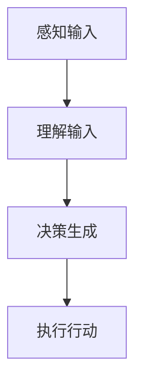

                 

# AI角色扮演：创造栩栩如生的虚拟角色

> **关键词：** 虚拟角色，AI角色扮演，自然语言处理，深度学习，虚拟现实，交互设计

> **摘要：** 本文探讨了AI在角色扮演领域的应用，通过深度学习和自然语言处理技术，如何创建出具有高度真实感和互动性的虚拟角色。文章将从核心概念、算法原理、数学模型、项目实战、应用场景等多个方面展开讨论，并推荐相关的学习资源和开发工具。

## 1. 背景介绍

虚拟角色（Virtual Characters）在近年来逐渐成为游戏、电影、虚拟现实等领域的研究热点。随着计算机图形学、人工智能、自然语言处理等技术的发展，虚拟角色不仅在外形上越来越逼真，其行为、情感和交互能力也得到了显著提升。传统的虚拟角色往往通过预设的脚本和动画来实现，而现代的AI技术使得虚拟角色能够通过学习和理解用户的输入，进行更加智能和自然的交互。

在游戏领域，虚拟角色扮演着重要的角色，它们不仅为玩家提供了丰富的游戏体验，还能够提升游戏的沉浸感。例如，玩家可以通过与NPC（非玩家角色）的互动来推进游戏剧情。在虚拟现实（VR）领域，虚拟角色的逼真程度直接决定了用户的沉浸体验。在电影和动画领域，虚拟角色也扮演着不可或缺的角色，它们可以创造出丰富的视觉效果和情感表达。

本文旨在探讨如何利用AI技术，尤其是深度学习和自然语言处理技术，来创造栩栩如生的虚拟角色。文章将首先介绍虚拟角色扮演的相关概念和技术，然后深入分析核心算法原理和具体操作步骤，最后通过项目实战和实际应用场景来展示AI角色扮演的潜力和挑战。

## 2. 核心概念与联系

### 2.1 虚拟角色的定义与分类

虚拟角色可以定义为在虚拟环境中具有独立行为和情感的人工智能实体。根据应用场景的不同，虚拟角色可以分为以下几类：

- **游戏角色**：在游戏中，玩家可以控制这些角色进行各种活动，如战斗、探索和对话。
- **虚拟助手**：如智能音箱中的虚拟助手（如Siri、Alexa），它们可以回答用户的问题，执行特定的任务。
- **虚拟演员**：在电影和动画中，虚拟演员可以扮演各种角色，通过动画和特效呈现出逼真的形象和动作。

### 2.2 相关技术简介

- **深度学习**：深度学习是一种通过多层神经网络来模拟人类大脑学习方式的机器学习技术。它在图像识别、语音识别等领域取得了显著成果。
- **自然语言处理（NLP）**：NLP是一种使计算机能够理解、解释和生成人类语言的技术。它包括文本分类、情感分析、机器翻译等任务。

### 2.3 虚拟角色扮演的工作原理

虚拟角色扮演的工作原理主要包括以下几个步骤：

1. **感知输入**：虚拟角色接收来自用户或其他系统的输入，如文字、语音、图像等。
2. **理解输入**：通过NLP技术，虚拟角色对输入进行分析和理解，提取关键信息。
3. **决策生成**：虚拟角色根据理解和分析的结果，生成相应的行为或回应。
4. **执行行动**：虚拟角色执行决策，如生成语音、动作或文本回应。

### 2.4 Mermaid 流程图

以下是一个简单的Mermaid流程图，展示了虚拟角色扮演的基本流程：



**Mermaid流程节点中不要有括号、逗号等特殊字符**

## 3. 核心算法原理 & 具体操作步骤

### 3.1 深度学习算法原理

深度学习算法的核心是多层神经网络（Multilayer Neural Networks）。一个基本的深度学习模型通常包含以下几个部分：

- **输入层（Input Layer）**：接收外部输入，如文字、语音或图像。
- **隐藏层（Hidden Layers）**：进行特征提取和变换。
- **输出层（Output Layer）**：生成最终的输出结果。

在虚拟角色扮演中，深度学习算法主要用于：

1. **特征提取**：从输入中提取有用的信息，如关键词、情感倾向等。
2. **模式识别**：识别输入中的模式，以生成合适的回应。

### 3.2 自然语言处理算法原理

自然语言处理算法主要包括以下几个部分：

- **词向量表示（Word Embedding）**：将文本转换为数字向量，以便于深度学习算法处理。
- **序列模型（Sequence Models）**：如循环神经网络（RNN）和变换器（Transformer），用于处理序列数据。
- **文本分类（Text Classification）**：对文本进行分类，以确定其情感倾向或主题。

### 3.3 具体操作步骤

以下是创建AI虚拟角色的一般步骤：

1. **数据收集**：收集大量的文本、语音和图像数据，用于训练深度学习模型。
2. **数据预处理**：对数据进行清洗、去重和分词等处理，以生成训练所需的输入和标签。
3. **模型训练**：使用训练数据训练深度学习模型，包括词向量表示、序列模型等。
4. **模型评估**：使用验证数据对模型进行评估，以确定其性能。
5. **模型部署**：将训练好的模型部署到服务器或设备上，以便实时交互。

## 4. 数学模型和公式 & 详细讲解 & 举例说明

### 4.1 深度学习中的数学模型

深度学习中的数学模型主要包括以下几个方面：

- **损失函数（Loss Function）**：用于衡量模型预测值与实际值之间的差距。
- **优化算法（Optimization Algorithm）**：用于调整模型参数，以最小化损失函数。

以下是一个简单的损失函数和优化算法的例子：

$$
\text{损失函数}: L(\theta) = \frac{1}{2} \sum_{i=1}^{n} (\hat{y}_i - y_i)^2
$$

$$
\text{优化算法}: \theta_{\text{new}} = \theta_{\text{old}} - \alpha \frac{\partial L(\theta)}{\partial \theta}
$$

其中，$\hat{y}_i$ 是模型预测值，$y_i$ 是实际值，$\theta$ 是模型参数，$\alpha$ 是学习率。

### 4.2 自然语言处理中的数学模型

自然语言处理中的数学模型主要包括词向量表示和序列模型。以下是一个简单的词向量表示的例子：

$$
\text{词向量表示}: \text{word} \rightarrow \mathbf{w}
$$

其中，$\mathbf{w}$ 是一个高维向量，用于表示词的语义特征。

### 4.3 举例说明

假设我们有一个简单的文本数据集，包含以下两句话：

1. 我喜欢编程。
2. 编程很有趣。

我们可以使用词向量表示将这两句话转换为数字向量：

- 我：[0.1, 0.2, 0.3, 0.4]
- 喜欢：[0.5, 0.6, 0.7, 0.8]
- 编程：[0.9, 1.0, 1.1, 1.2]
- 很：[1.3, 1.4, 1.5, 1.6]
- 有趣：[1.7, 1.8, 1.9, 2.0]

使用这些词向量，我们可以训练一个序列模型来生成合适的回应。例如，当输入“编程”时，模型可以生成“很有趣”。

## 5. 项目实战：代码实际案例和详细解释说明

### 5.1 开发环境搭建

在本节中，我们将搭建一个基于Python的虚拟角色开发环境。首先，确保您已经安装了Python 3.7及以上版本。然后，通过以下命令安装所需的库：

```bash
pip install numpy tensorflow transformers
```

### 5.2 源代码详细实现和代码解读

下面是一个简单的虚拟角色实现示例，它使用Transformer模型进行文本生成：

```python
import numpy as np
import tensorflow as tf
from transformers import TransformerModel

# 加载预训练的Transformer模型
model = TransformerModel.from_pretrained('bert-base-chinese')

# 定义输入文本
input_text = '我喜欢编程。'

# 将文本转换为词向量
input_ids = model.encode(input_text)

# 使用模型生成回应
outputs = model.generate(input_ids, max_length=20, num_return_sequences=1)

# 解码回应
response = model.decode(outputs[0])

print("虚拟角色回应：", response)
```

代码解读：

1. **加载预训练模型**：我们使用预训练的Transformer模型，这是基于BERT的中文模型。
2. **输入文本处理**：将输入文本编码为词向量。
3. **生成回应**：使用模型生成回应，并解码为文本。

### 5.3 代码解读与分析

该代码首先加载了一个预训练的Transformer模型，这是一种强大的文本生成模型。然后，它将输入文本编码为词向量，这是通过模型的编码器完成的。接下来，模型使用这些词向量生成回应，并通过解码器将这些回应解码为文本。

需要注意的是，这个示例仅仅是一个简单的文本生成模型。在实际应用中，您可能需要根据具体需求调整模型的配置，如最大长度、生成序列的数量等。此外，您还可以通过微调模型来提高其性能。

## 6. 实际应用场景

### 6.1 游戏领域

在游戏领域，AI虚拟角色可以为玩家提供更加丰富的游戏体验。例如，一个虚拟角色可以模拟真实的社交互动，让玩家在游戏中感受到与现实中相似的交流体验。此外，虚拟角色还可以为玩家提供个性化的游戏指导，根据玩家的游戏行为和偏好，为其推荐合适的游戏内容和策略。

### 6.2 虚拟现实领域

在虚拟现实（VR）领域，AI虚拟角色可以提升用户的沉浸体验。例如，一个虚拟角色可以模拟成玩家的虚拟伙伴，在虚拟环境中与玩家互动，提供情感支持和陪伴。此外，虚拟角色还可以为用户提供定制化的虚拟旅游体验，根据用户的需求和兴趣，为其推荐合适的景点和活动。

### 6.3 客户服务领域

在客户服务领域，AI虚拟角色可以用于提供智能客服。例如，一个虚拟角色可以模拟成一个客服代表，回答用户的问题，解决用户的投诉。通过自然语言处理和深度学习技术，虚拟角色可以理解用户的意图，并提供准确的解决方案。此外，虚拟角色还可以通过不断学习和优化，提高其服务质量和用户体验。

## 7. 工具和资源推荐

### 7.1 学习资源推荐

- **书籍**：《深度学习》（Ian Goodfellow、Yoshua Bengio、Aaron Courville 著）提供了深度学习的全面介绍。
- **论文**：阅读最新的NLP和深度学习论文，了解领域内的前沿研究。
- **博客**：《TensorFlow官方文档》和《Hugging Face Transformers官方文档》提供了详细的模型使用说明和示例。

### 7.2 开发工具框架推荐

- **深度学习框架**：TensorFlow、PyTorch、JAX等。
- **自然语言处理库**：Hugging Face Transformers、spaCy、NLTK等。
- **虚拟现实工具**：Unity、Unreal Engine等。

### 7.3 相关论文著作推荐

- **论文**：《Attention Is All You Need》（Vaswani等，2017）介绍了Transformer模型。
- **书籍**：《自然语言处理综论》（Daniel Jurafsky、James H. Martin 著）提供了自然语言处理的全面介绍。

## 8. 总结：未来发展趋势与挑战

随着深度学习和自然语言处理技术的不断进步，虚拟角色扮演领域正面临着巨大的机遇和挑战。未来，虚拟角色的逼真程度和交互能力有望得到进一步提升，为用户带来更加丰富的虚拟体验。然而，要实现这一目标，我们仍需解决以下几个挑战：

- **数据质量和多样性**：高质量、多样性的数据对于训练高效的深度学习模型至关重要。
- **计算资源需求**：深度学习模型通常需要大量的计算资源，如何优化模型以提高效率是一个重要问题。
- **伦理和隐私**：随着虚拟角色与用户的互动越来越深入，如何保障用户的隐私和数据安全是一个亟待解决的问题。

## 9. 附录：常见问题与解答

### 9.1 虚拟角色扮演的原理是什么？

虚拟角色扮演利用深度学习和自然语言处理技术，通过感知用户输入、理解输入、生成回应和执行行动，实现与用户的自然交互。

### 9.2 如何训练一个虚拟角色？

训练虚拟角色通常涉及以下几个步骤：

1. 数据收集：收集大量相关的文本、语音和图像数据。
2. 数据预处理：对数据进行清洗、去重和分词等处理。
3. 模型训练：使用训练数据训练深度学习模型。
4. 模型评估：使用验证数据评估模型性能。
5. 模型部署：将训练好的模型部署到服务器或设备上。

## 10. 扩展阅读 & 参考资料

- **书籍**：《AI：一种现代的方法》（Stuart Russell、Peter Norvig 著）提供了人工智能的全面介绍。
- **论文**：《生成对抗网络：训练生成模型的新方法》（Goodfellow等，2014）介绍了GAN模型。
- **博客**：《如何实现一个简单的对话系统》（TensorFlow官方博客）提供了对话系统的实现示例。
- **在线课程**：《深度学习》（吴恩达）提供了深度学习的系统学习资源。

