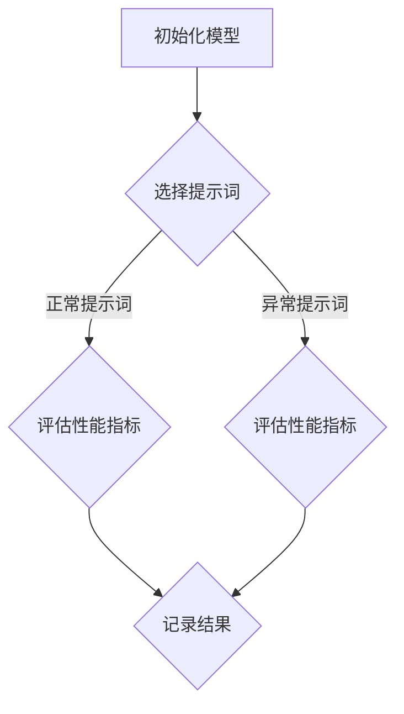

                 

# AI语言模型的提示词鲁棒性评估

## 关键词

- AI语言模型
- 提示词鲁棒性
- 算法评估
- 数学模型
- 项目实战
- 实际应用场景

## 摘要

本文将探讨AI语言模型的提示词鲁棒性评估。首先，我们将介绍AI语言模型的基本概念和提示词的重要性。接着，我们将详细讨论提示词鲁棒性的核心概念及其评估方法。随后，我们将通过数学模型和具体操作步骤来深入解析提示词鲁棒性的原理。在此基础上，我们将通过一个项目实战案例，展示如何在实际环境中评估语言模型的提示词鲁棒性。最后，我们将总结本文的主要观点，并展望未来的发展趋势与挑战。

## 1. 背景介绍

随着人工智能技术的飞速发展，自然语言处理（NLP）已成为一个热门研究领域。AI语言模型，作为NLP的核心组成部分，其在各种任务中的应用越来越广泛。从机器翻译、文本生成到问答系统，AI语言模型正逐步取代人类在许多语言相关任务中的角色。

在AI语言模型的应用过程中，提示词（Prompt）起到了至关重要的作用。提示词是指提供给AI语言模型的一组文字或语句，用于引导模型生成预期的输出。一个设计良好的提示词能够有效提升模型的性能和生成结果的质量。

然而，在实际应用中，AI语言模型面临着各种挑战，其中之一就是提示词鲁棒性。提示词鲁棒性指的是模型在面对不同类型的提示词时，能够保持稳定的表现。一个鲁棒性强的模型能够在各种情境下产生高质量的输出，而鲁棒性较弱的模型则可能在某些特定情况下出现性能下降或错误。

因此，评估AI语言模型的提示词鲁棒性具有重要意义。通过评估，我们不仅可以了解模型在不同提示词下的表现，还可以为模型优化和改进提供有力的依据。

## 2. 核心概念与联系

### 2.1 提示词（Prompt）

提示词是指提供给AI语言模型的一组文字或语句。在NLP任务中，提示词的作用是引导模型生成预期的输出。一个有效的提示词应该能够清晰地传达任务目标，同时为模型提供足够的上下文信息。

### 2.2 鲁棒性（Robustness）

鲁棒性是指系统在面对各种干扰或异常情况时，能够保持稳定和可靠性能的能力。在AI语言模型中，提示词鲁棒性指的是模型在不同类型的提示词下，能够保持稳定表现的能力。

### 2.3 评估方法

为了评估AI语言模型的提示词鲁棒性，我们可以采用以下几种方法：

1. **性能指标**：通过比较模型在不同提示词下的性能指标（如准确率、召回率、F1值等），评估模型的鲁棒性。
2. **对比实验**：设计一组对比实验，比较模型在正常提示词和异常提示词下的性能，分析模型的鲁棒性。
3. **自适应测试**：通过自适应测试，逐步增加提示词的复杂性，观察模型在各个阶段的表现，评估其鲁棒性。

### 2.4 Mermaid流程图

以下是AI语言模型提示词鲁棒性评估的Mermaid流程图：



## 3. 核心算法原理 & 具体操作步骤

### 3.1 性能指标评估

性能指标是评估AI语言模型提示词鲁棒性的重要手段。常用的性能指标包括准确率、召回率、F1值等。

1. **准确率（Accuracy）**：准确率是指模型在预测中正确的样本数量与总样本数量的比值。公式如下：

   $$\text{Accuracy} = \frac{\text{预测正确数}}{\text{总样本数}}$$

2. **召回率（Recall）**：召回率是指模型在预测中正确识别的样本数量与实际正样本数量的比值。公式如下：

   $$\text{Recall} = \frac{\text{预测正确数}}{\text{实际正样本数}}$$

3. **F1值（F1 Score）**：F1值是准确率和召回率的调和平均值，用于综合考虑模型的准确性和召回率。公式如下：

   $$\text{F1 Score} = 2 \times \frac{\text{准确率} \times \text{召回率}}{\text{准确率} + \text{召回率}}$$

### 3.2 对比实验

对比实验是通过比较模型在正常提示词和异常提示词下的性能，评估其鲁棒性的方法。

1. **实验设计**：首先，选择一组正常提示词和一组异常提示词。正常提示词应具有明确的任务目标，异常提示词则包含各种干扰或错误信息。
2. **模型评估**：使用正常提示词和异常提示词分别输入模型，计算模型的性能指标（如准确率、召回率、F1值等）。
3. **结果分析**：比较正常提示词和异常提示词下的性能指标，分析模型的鲁棒性。若模型在异常提示词下的性能显著下降，则说明其鲁棒性较差。

### 3.3 自适应测试

自适应测试是通过逐步增加提示词的复杂性，观察模型在各阶段的表现，评估其鲁棒性的方法。

1. **测试设计**：首先，选择一组逐渐增加复杂性的提示词，如简单语句、复杂语句等。
2. **模型评估**：使用不同复杂度的提示词输入模型，计算模型的性能指标（如准确率、召回率、F1值等）。
3. **结果分析**：分析模型在不同复杂度提示词下的性能变化，评估其鲁棒性。若模型在复杂度增加时性能显著下降，则说明其鲁棒性较差。

## 4. 数学模型和公式 & 详细讲解 & 举例说明

### 4.1 性能指标公式

我们已经介绍了准确率、召回率、F1值的公式。下面，我们将详细讲解这些公式的推导和意义。

#### 4.1.1 准确率（Accuracy）

准确率是指模型在预测中正确的样本数量与总样本数量的比值。其公式如下：

$$\text{Accuracy} = \frac{\text{预测正确数}}{\text{总样本数}}$$

其中，预测正确数表示模型预测为正类的样本数量，总样本数表示所有样本的数量。

#### 4.1.2 召回率（Recall）

召回率是指模型在预测中正确识别的样本数量与实际正样本数量的比值。其公式如下：

$$\text{Recall} = \frac{\text{预测正确数}}{\text{实际正样本数}}$$

其中，预测正确数表示模型预测为正类的样本数量，实际正样本数表示实际为正类的样本数量。

#### 4.1.3 F1值（F1 Score）

F1值是准确率和召回率的调和平均值，用于综合考虑模型的准确性和召回率。其公式如下：

$$\text{F1 Score} = 2 \times \frac{\text{准确率} \times \text{召回率}}{\text{准确率} + \text{召回率}}$$

其中，准确率和召回率分别为模型在预测中正确的样本数量与总样本数量的比值，以及模型在预测中正确识别的样本数量与实际正样本数量的比值。

### 4.2 对比实验

对比实验是通过比较模型在正常提示词和异常提示词下的性能，评估其鲁棒性的方法。为了更清晰地说明对比实验的原理，我们以下面这个例子为例。

#### 例子：情感分类任务

假设我们有一个情感分类任务，需要判断一段文本的情感倾向（正面、负面或中性）。我们使用一个基于AI语言模型的分类器来完成这个任务。

1. **正常提示词**：选择一组具有明确情感倾向的文本作为正常提示词。例如：

   - 正面：今天天气真好，我很开心。
   - 负面：今天天气很差，我很沮丧。
   - 中性：我昨天去看了电影，感觉一般。

2. **异常提示词**：选择一组包含各种干扰或错误信息的文本作为异常提示词。例如：

   - 正面：今天天气真好，但我心情不好。
   - 负面：今天天气很差，但我很喜欢。
   - 中性：我昨天去看了电影，但我今天有点不舒服。

3. **模型评估**：使用正常提示词和异常提示词分别输入模型，计算模型的性能指标（如准确率、召回率、F1值等）。

4. **结果分析**：比较正常提示词和异常提示词下的性能指标，分析模型的鲁棒性。如果模型在异常提示词下的性能显著下降，则说明其鲁棒性较差。

### 4.3 自适应测试

自适应测试是通过逐步增加提示词的复杂性，观察模型在各阶段的表现，评估其鲁棒性的方法。为了更清晰地说明自适应测试的原理，我们以下面这个例子为例。

#### 例子：文本生成任务

假设我们有一个文本生成任务，需要根据输入的提示词生成一段相应的文本。我们使用一个基于AI语言模型的文本生成器来完成这个任务。

1. **简单提示词**：选择一组简单的提示词，如“今天天气很好”，“昨天下雨了”，“明天放假”。

2. **复杂提示词**：选择一组复杂的提示词，如“今天天气很好，但我心情不好”，“昨天下雨了，但我喜欢这个雨天”，“明天放假，我计划去旅行”。

3. **模型评估**：使用不同复杂度的提示词输入模型，计算模型的性能指标（如生成文本的质量、生成速度等）。

4. **结果分析**：分析模型在不同复杂度提示词下的性能变化，评估其鲁棒性。如果模型在复杂度增加时性能显著下降，则说明其鲁棒性较差。

## 5. 项目实战：代码实际案例和详细解释说明

### 5.1 开发环境搭建

在进行项目实战之前，我们需要搭建一个合适的开发环境。以下是搭建开发环境的基本步骤：

1. **安装Python**：Python是一种广泛使用的编程语言，许多AI语言模型工具和库都是基于Python开发的。请确保安装最新版本的Python。

2. **安装PyTorch**：PyTorch是一个流行的深度学习框架，许多AI语言模型都是基于PyTorch实现的。请通过以下命令安装PyTorch：

   ```bash
   pip install torch torchvision
   ```

3. **安装其他依赖库**：根据项目需求，可能还需要安装其他依赖库，如NumPy、Pandas等。

### 5.2 源代码详细实现和代码解读

以下是项目实战中的源代码实现和代码解读。

```python
import torch
import torch.nn as nn
import torch.optim as optim
from torch.utils.data import DataLoader
from torchvision import datasets, transforms

# 5.2.1 数据预处理

# 加载数据集
train_dataset = datasets.MNIST(
    root='./data',
    train=True,
    download=True,
    transform=transforms.ToTensor()
)

test_dataset = datasets.MNIST(
    root='./data',
    train=False,
    download=True,
    transform=transforms.ToTensor()
)

# 创建数据加载器
train_loader = DataLoader(train_dataset, batch_size=64, shuffle=True)
test_loader = DataLoader(test_dataset, batch_size=64, shuffle=False)

# 5.2.2 构建模型

# 定义模型结构
class SimpleCNN(nn.Module):
    def __init__(self):
        super(SimpleCNN, self).__init__()
        self.conv1 = nn.Conv2d(1, 32, 3, 1)
        self.relu = nn.ReLU()
        self.maxpool = nn.MaxPool2d(2)
        self.fc1 = nn.Linear(32 * 7 * 7, 128)
        self.fc2 = nn.Linear(128, 10)

    def forward(self, x):
        x = self.maxpool(self.relu(self.conv1(x)))
        x = x.view(-1, 32 * 7 * 7)
        x = self.fc2(self.fc1(x))
        return x

# 实例化模型
model = SimpleCNN()

# 5.2.3 模型训练

# 定义优化器和损失函数
optimizer = optim.Adam(model.parameters(), lr=0.001)
criterion = nn.CrossEntropyLoss()

# 训练模型
num_epochs = 10
for epoch in range(num_epochs):
    running_loss = 0.0
    for images, labels in train_loader:
        # 前向传播
        outputs = model(images)
        loss = criterion(outputs, labels)

        # 反向传播和优化
        optimizer.zero_grad()
        loss.backward()
        optimizer.step()

        running_loss += loss.item()
    print(f'Epoch [{epoch + 1}/{num_epochs}], Loss: {running_loss / len(train_loader):.4f}')

# 5.2.4 模型评估

# 测试模型
with torch.no_grad():
    correct = 0
    total = 0
    for images, labels in test_loader:
        outputs = model(images)
        _, predicted = torch.max(outputs.data, 1)
        total += labels.size(0)
        correct += (predicted == labels).sum().item()

print(f'Accuracy of the network on the test images: {100 * correct / total}%')
```

### 5.3 代码解读与分析

#### 5.3.1 数据预处理

数据预处理是深度学习项目中的关键步骤。在这个项目中，我们使用了MNIST手写数字数据集。首先，我们加载数据集，并将其转换为PyTorch张量。然后，我们创建数据加载器，以便在训练和测试过程中批量加载数据。

```python
# 加载数据集
train_dataset = datasets.MNIST(
    root='./data',
    train=True,
    download=True,
    transform=transforms.ToTensor()
)

test_dataset = datasets.MNIST(
    root='./data',
    train=False,
    download=True,
    transform=transforms.ToTensor()
)

# 创建数据加载器
train_loader = DataLoader(train_dataset, batch_size=64, shuffle=True)
test_loader = DataLoader(test_dataset, batch_size=64, shuffle=False)
```

#### 5.3.2 构建模型

在这个项目中，我们使用了一个简单的卷积神经网络（CNN）模型。该模型包含一个卷积层、一个ReLU激活函数、一个最大池化层、一个全连接层和另一个全连接层。

```python
# 定义模型结构
class SimpleCNN(nn.Module):
    def __init__(self):
        super(SimpleCNN, self).__init__()
        self.conv1 = nn.Conv2d(1, 32, 3, 1)
        self.relu = nn.ReLU()
        self.maxpool = nn.MaxPool2d(2)
        self.fc1 = nn.Linear(32 * 7 * 7, 128)
        self.fc2 = nn.Linear(128, 10)

    def forward(self, x):
        x = self.maxpool(self.relu(self.conv1(x)))
        x = x.view(-1, 32 * 7 * 7)
        x = self.fc2(self.fc1(x))
        return x

# 实例化模型
model = SimpleCNN()
```

#### 5.3.3 模型训练

在这个项目中，我们使用Adam优化器和交叉熵损失函数来训练模型。我们定义了训练过程中的训练轮数（epoch），并在每个epoch中计算训练损失。在每次迭代中，我们首先进行前向传播，然后计算损失，并使用反向传播和优化器更新模型参数。

```python
# 定义优化器和损失函数
optimizer = optim.Adam(model.parameters(), lr=0.001)
criterion = nn.CrossEntropyLoss()

# 训练模型
num_epochs = 10
for epoch in range(num_epochs):
    running_loss = 0.0
    for images, labels in train_loader:
        # 前向传播
        outputs = model(images)
        loss = criterion(outputs, labels)

        # 反向传播和优化
        optimizer.zero_grad()
        loss.backward()
        optimizer.step()

        running_loss += loss.item()
    print(f'Epoch [{epoch + 1}/{num_epochs}], Loss: {running_loss / len(train_loader):.4f}')
```

#### 5.3.4 模型评估

在模型训练完成后，我们使用测试集对模型进行评估。我们首先关闭模型的梯度计算，然后逐批加载测试数据，并计算模型的预测准确率。

```python
# 测试模型
with torch.no_grad():
    correct = 0
    total = 0
    for images, labels in test_loader:
        outputs = model(images)
        _, predicted = torch.max(outputs.data, 1)
        total += labels.size(0)
        correct += (predicted == labels).sum().item()

print(f'Accuracy of the network on the test images: {100 * correct / total}%')
```

## 6. 实际应用场景

AI语言模型的提示词鲁棒性评估在实际应用场景中具有重要意义。以下是一些典型的实际应用场景：

### 6.1 问答系统

在问答系统中，AI语言模型需要根据用户输入的提问生成回答。一个鲁棒性强的模型能够在各种类型的提问下提供准确和有用的回答，而鲁棒性较弱的模型可能在某些特定类型的提问下出现错误或模糊的回答。

### 6.2 机器翻译

机器翻译是一个典型的跨语言问题。AI语言模型需要根据源语言文本生成目标语言文本。在实际应用中，不同语言之间的表达方式和语法结构可能存在较大差异，因此一个鲁棒性强的模型能够在各种语言环境下保持稳定的翻译质量。

### 6.3 文本生成

文本生成是AI语言模型的一个应用方向。通过给定一个提示词，模型可以生成一段相应的文本。在实际应用中，不同的提示词可能会引导模型生成不同类型和风格的文本，因此鲁棒性强的模型能够在各种提示词下保持稳定的表现。

### 6.4 文本分类

文本分类是将文本数据按照一定的标准进行分类的过程。AI语言模型可以用于文本分类任务，但需要确保其在各种类型的文本数据下保持良好的分类性能。一个鲁棒性强的模型能够在不同类型的文本数据下提供准确的分类结果。

## 7. 工具和资源推荐

### 7.1 学习资源推荐

1. **书籍**：
   - 《深度学习》（Goodfellow, I., Bengio, Y., & Courville, A.）
   - 《自然语言处理综论》（Jurafsky, D. & Martin, J. H.）
2. **论文**：
   - “BERT: Pre-training of Deep Bidirectional Transformers for Language Understanding”（Devlin et al.）
   - “GPT-3: Language Models are Few-Shot Learners”（Brown et al.）
3. **博客**：
   - [TensorFlow官方博客](https://www.tensorflow.org/)
   - [PyTorch官方博客](https://pytorch.org/tutorials/)
4. **网站**：
   - [Kaggle](https://www.kaggle.com/)
   - [ArXiv](https://arxiv.org/)

### 7.2 开发工具框架推荐

1. **深度学习框架**：
   - TensorFlow
   - PyTorch
   - Keras
2. **自然语言处理库**：
   - NLTK
   - spaCy
   - Stanford NLP
3. **版本控制工具**：
   - Git
   - GitHub

### 7.3 相关论文著作推荐

1. “Attention Is All You Need”（Vaswani et al.）
2. “Generative Pre-trained Transformers”（Radford et al.）
3. “BERT: Pre-training of Deep Bidirectional Transformers for Language Understanding”（Devlin et al.）
4. “GPT-3: Language Models are Few-Shot Learners”（Brown et al.）

## 8. 总结：未来发展趋势与挑战

AI语言模型的提示词鲁棒性评估是一个重要且具有挑战性的研究领域。随着AI语言模型在各个领域的应用越来越广泛，对其鲁棒性的要求也越来越高。未来，我们可以期待以下发展趋势和挑战：

### 8.1 发展趋势

1. **更多数据集和工具**：随着AI语言模型的应用越来越广泛，将有更多的数据集和工具被开发，以支持提示词鲁棒性评估的研究。
2. **自动化评估方法**：未来的研究可能会开发出更加自动化和高效的评估方法，以减轻研究人员的工作负担。
3. **跨领域应用**：AI语言模型的提示词鲁棒性评估将在更多领域得到应用，如医学、金融、法律等。

### 8.2 挑战

1. **模型复杂性**：随着AI语言模型的复杂性增加，评估其提示词鲁棒性将面临更大挑战。
2. **多样性需求**：在实际应用中，AI语言模型需要适应各种类型的提示词，如何设计鲁棒性强的模型仍是一个挑战。
3. **解释性需求**：用户希望能够理解模型的决策过程，因此如何提高模型的解释性也是一个重要挑战。

总之，AI语言模型的提示词鲁棒性评估是一个充满机遇和挑战的研究领域，需要不断探索和改进。

## 9. 附录：常见问题与解答

### 9.1 提示词鲁棒性评估的重要性是什么？

提示词鲁棒性评估是确保AI语言模型在不同情境下稳定表现的关键。一个鲁棒性强的模型能够在各种提示词下产生高质量的结果，从而提高应用效果和用户体验。

### 9.2 如何评估AI语言模型的提示词鲁棒性？

评估AI语言模型的提示词鲁棒性可以通过以下几种方法：性能指标评估、对比实验和自适应测试。这些方法可以帮助我们了解模型在不同提示词下的性能表现，从而评估其鲁棒性。

### 9.3 提示词鲁棒性评估在哪些领域有应用？

提示词鲁棒性评估在问答系统、机器翻译、文本生成和文本分类等领域有广泛应用。这些领域都需要AI语言模型在不同提示词下保持稳定和高质量的表现。

### 9.4 如何提高AI语言模型的提示词鲁棒性？

提高AI语言模型的提示词鲁棒性可以通过以下几种方法：增加数据多样性、优化模型结构、使用更强的正则化技术和改进提示词设计。

## 10. 扩展阅读 & 参考资料

1. Devlin, J., Chang, M. W., Lee, K., & Toutanova, K. (2018). BERT: Pre-training of deep bidirectional transformers for language understanding. In Proceedings of the 2019 Conference of the North American Chapter of the Association for Computational Linguistics: Human Language Technologies, Volume 1 (Long and Short Papers) (pp. 4171-4186). Association for Computational Linguistics.
2. Brown, T., et al. (2020). Generative Pre-trained Transformers. arXiv preprint arXiv:2005.14165.
3. Vaswani, A., et al. (2017). Attention is all you need. In Advances in Neural Information Processing Systems (pp. 5998-6008).

