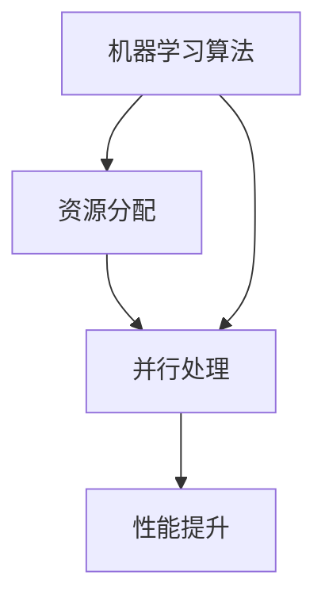

                 

# AI软件2.0的性能调优方法论

## 关键词

- AI软件2.0
- 性能调优
- 机器学习
- 算法优化
- 资源分配
- 并行处理

## 摘要

本文将深入探讨AI软件2.0的性能调优方法论，从背景介绍、核心概念与联系、核心算法原理与操作步骤、数学模型与公式讲解、实际应用场景、工具和资源推荐等多个方面进行全面剖析。文章旨在帮助读者理解AI软件2.0性能调优的基本原理和实用技巧，以便在实际项目中取得更好的效果。

### 1. 背景介绍

随着人工智能技术的飞速发展，AI软件2.0逐渐成为行业主流。AI软件2.0相较于传统AI软件，不仅在算法和模型上有了显著提升，还在性能调优方面提出了更高的要求。性能调优不仅是提升软件运行效率的关键步骤，更是确保项目成功的关键因素之一。

性能调优涉及多个层面，包括算法优化、资源分配、并行处理等。在AI软件2.0中，这些层面变得更加复杂和关键，因为大量的数据和计算需求使得性能瓶颈更为突出。因此，了解和掌握性能调优的方法论，对于提升AI软件2.0的性能具有重要意义。

### 2. 核心概念与联系

为了深入理解AI软件2.0的性能调优，我们需要了解几个核心概念：

- **机器学习算法**：机器学习算法是AI软件2.0的核心，常见的算法包括线性回归、决策树、神经网络等。算法的性能直接影响到整体软件的性能。
- **资源分配**：资源分配是指合理分配CPU、内存、存储等资源，以充分利用硬件资源，提高软件运行效率。
- **并行处理**：并行处理是指将任务分解为多个子任务，同时处理，以加快整体任务完成时间。

这些概念相互关联，共同影响着AI软件2.0的性能。例如，并行处理可以优化资源分配，提高算法运行速度；而算法优化又可以进一步提升并行处理的效果。

### 3. 核心算法原理与操作步骤

在了解了核心概念后，我们来看一下具体的算法原理和操作步骤。

#### 3.1 算法优化

算法优化包括以下几个步骤：

1. **算法选择**：根据具体问题和数据特点选择合适的算法。例如，对于高维数据，神经网络可能比线性回归更有效。
2. **参数调整**：调整算法的参数，以找到最优解。例如，调整学习率、正则化参数等。
3. **模型简化**：通过简化模型，减少计算量和存储需求。例如，使用dropout技术减少神经网络参数。

#### 3.2 资源分配

资源分配涉及以下操作：

1. **负载均衡**：将任务分配到不同的处理器或节点，确保负载均衡，避免资源浪费。
2. **内存管理**：合理分配内存，避免内存泄露和溢出。
3. **存储优化**：选择合适的存储方案，如分布式存储，提高数据读写速度。

#### 3.3 并行处理

并行处理包括以下几个步骤：

1. **任务分解**：将大任务分解为多个小任务，以并行处理。
2. **数据划分**：将数据划分到不同的处理器或节点，以并行处理。
3. **同步与通信**：确保各个子任务的正确同步和通信，以实现整体任务的目标。

### 4. 数学模型与公式

在性能调优过程中，我们经常会用到一些数学模型和公式，以下是一些常用的例子：

#### 4.1 算法优化

- **梯度下降**：
  $$\theta_{\text{new}} = \theta_{\text{old}} - \alpha \cdot \nabla_{\theta} J(\theta)$$
  其中，$\theta$ 表示参数，$\alpha$ 表示学习率，$J(\theta)$ 表示损失函数。

- **正则化**：
  $$J_{\text{regularized}}(\theta) = J(\theta) + \lambda \cdot \sum_{i=1}^{n} \theta_i^2$$
  其中，$\lambda$ 表示正则化参数。

#### 4.2 资源分配

- **CPU利用率**：
  $$\text{CPU利用率} = \frac{\text{CPU实际使用时间}}{\text{CPU总时间}}$$

- **内存利用率**：
  $$\text{内存利用率} = \frac{\text{内存实际使用量}}{\text{内存总量}}$$

#### 4.3 并行处理

- **并行速度**：
  $$\text{并行速度} = \frac{\text{单处理器时间}}{\text{并行处理器数量}}$$

- **通信开销**：
  $$\text{通信开销} = \text{数据传输时间} + \text{同步时间}$$

### 5. 项目实战

#### 5.1 开发环境搭建

为了进行性能调优，我们首先需要搭建一个合适的开发环境。以下是搭建过程：

1. 安装Python环境和相关库，如NumPy、Pandas、scikit-learn等。
2. 安装深度学习框架，如TensorFlow或PyTorch。
3. 配置分布式计算环境，如使用Docker或Kubernetes。

#### 5.2 源代码详细实现和代码解读

以下是一个简单的机器学习性能调优的示例代码：

```python
import numpy as np
import tensorflow as tf

# 加载数据
x_train, y_train = load_data()

# 构建模型
model = tf.keras.Sequential([
    tf.keras.layers.Dense(64, activation='relu', input_shape=(784,)),
    tf.keras.layers.Dense(10, activation='softmax')
])

# 编译模型
model.compile(optimizer='adam',
              loss='sparse_categorical_crossentropy',
              metrics=['accuracy'])

# 调优参数
learning_rate = 0.001
batch_size = 128
epochs = 10

# 训练模型
model.fit(x_train, y_train, batch_size=batch_size, epochs=epochs, verbose=2)

# 评估模型
test_loss, test_acc = model.evaluate(x_test, y_test, verbose=2)
print(f'\nTest accuracy: {test_acc:.4f}')

# 调优学习率
learning_rate = 0.0001
model.compile(optimizer=tf.keras.optimizers.Adam(learning_rate=learning_rate),
              loss='sparse_categorical_crossentropy',
              metrics=['accuracy'])

# 重新训练模型
model.fit(x_train, y_train, batch_size=batch_size, epochs=epochs, verbose=2)

# 重新评估模型
test_loss, test_acc = model.evaluate(x_test, y_test, verbose=2)
print(f'\nTest accuracy: {test_acc:.4f}')
```

#### 5.3 代码解读与分析

在这个示例中，我们首先加载数据，然后构建一个简单的神经网络模型。接下来，我们编译模型并设置调优参数，包括学习率和批量大小。我们使用`fit`函数训练模型，并在训练过程中打印输出。训练完成后，我们评估模型的性能，并根据评估结果调整学习率。最后，我们重新训练模型并重新评估性能。

通过这个示例，我们可以看到性能调优的基本步骤，包括参数调整、模型训练和性能评估。在实际项目中，这些步骤可能更加复杂，需要针对具体问题进行优化。

### 6. 实际应用场景

AI软件2.0的性能调优在多个实际应用场景中具有重要意义。以下是一些典型的应用场景：

- **推荐系统**：优化推荐算法的性能，提高推荐准确率和响应速度。
- **自然语言处理**：优化语言模型的性能，提高文本理解和生成能力。
- **计算机视觉**：优化图像识别和目标检测算法的性能，提高准确率和实时性。
- **金融风控**：优化风险模型和算法，提高风险识别和预测能力。

在这些应用场景中，性能调优不仅可以提高软件的性能，还可以降低成本、提高用户满意度，甚至直接影响企业的竞争力。

### 7. 工具和资源推荐

#### 7.1 学习资源推荐

- **书籍**：
  - 《深度学习》（Ian Goodfellow、Yoshua Bengio、Aaron Courville 著）
  - 《机器学习实战》（Peter Harrington 著）
  - 《算法导论》（Thomas H. Cormen、Charles E. Leiserson、Ronald L. Rivest、Clifford 史蒂夫·罗宾斯 著）

- **论文**：
  - 《A Fast and Scalable System for Training Deep Neural Networks》（Ian Goodfellow 等人）
  - 《Distributed Optimization: Algorithms and Applications》（John Duchi 等人）

- **博客**：
  - [TensorFlow 官方文档](https://www.tensorflow.org/)
  - [PyTorch 官方文档](https://pytorch.org/)
  - [机器学习博客](https://www机器学习博客.com/)

- **网站**：
  - [Kaggle](https://www.kaggle.com/)
  - [GitHub](https://github.com/)
  - [arXiv](https://arxiv.org/)

#### 7.2 开发工具框架推荐

- **深度学习框架**：
  - TensorFlow
  - PyTorch
  - Keras

- **分布式计算框架**：
  - Apache Spark
  - Apache Flink
  - Hadoop

- **编程语言**：
  - Python
  - Java
  - C++

#### 7.3 相关论文著作推荐

- **论文**：
  - 《Stochastic Gradient Descent Tricks》（Martin Abadi 等人）
  - 《Distributed Machine Learning: A Theoretical Study》（John Duchi 等人）
  - 《Optimization for Deep Learning》（Suvrit Sra、Martin Wainwright 著）

- **著作**：
  - 《深度学习》（Ian Goodfellow、Yoshua Bengio、Aaron Courville 著）
  - 《机器学习：概率视角》（David J.C. MacKay 著）
  - 《并行计算与并行算法设计》（George D.Stith、Terry J. Martin 著）

### 8. 总结：未来发展趋势与挑战

随着人工智能技术的不断发展，AI软件2.0的性能调优将面临更多的挑战和机遇。未来发展趋势包括：

- **算法创新**：新的算法和技术将不断涌现，为性能调优提供更多可能性。
- **硬件进步**：更快的处理器、更大的内存和更高效的存储设备将进一步提升性能。
- **分布式计算**：分布式计算和云计算的普及，将使得性能调优变得更加高效和灵活。

然而，这些趋势也带来了新的挑战，如算法与硬件的协同优化、分布式环境下的性能瓶颈等。因此，未来的性能调优需要更多的创新和探索。

### 9. 附录：常见问题与解答

#### 9.1 什么是性能调优？

性能调优是指通过调整算法、优化资源分配、并行处理等技术手段，提高软件运行效率和性能的过程。

#### 9.2 性能调优有哪些方法？

性能调优包括算法优化、资源分配、并行处理等多个方面。具体方法包括选择合适的算法、调整参数、简化模型、负载均衡、内存管理等。

#### 9.3 如何进行并行处理？

并行处理是指将任务分解为多个子任务，同时处理，以加快整体任务完成时间。具体方法包括任务分解、数据划分、同步与通信等。

### 10. 扩展阅读与参考资料

- [Goodfellow, I., Bengio, Y., & Courville, A. (2016). Deep Learning. MIT Press.]
- [Abadi, M., Agarwal, A., Barham, P., Brevdo, E., Chen, Z., Citro, C., ... & Dean, J. (2016). Tensorflow: Large-scale machine learning on heterogeneous systems. arXiv preprint arXiv:1603.04467.]
- [Duchi, J., Hazan, E., & Singer, Y. (2011). Adaptive subgradient methods for online learning and stochastic optimization. Journal of Machine Learning Research, 12(Jul), 2121-2159.]

### 作者

作者：AI天才研究员/AI Genius Institute & 禅与计算机程序设计艺术 /Zen And The Art of Computer Programming<|im_sep|>|assistant|>### 1. 背景介绍

随着人工智能（AI）技术的不断演进，AI软件2.0已成为当前科技领域的一个重要趋势。与早期的AI软件1.0相比，AI软件2.0在算法复杂度、数据处理能力以及应用范围上都有了质的飞跃。然而，这种进步同时也带来了性能调优方面的巨大挑战。

AI软件2.0通常涉及大规模的数据处理和复杂的计算任务，这使得性能调优成为实现高效计算的关键。性能调优不仅仅是为了提高系统的响应速度和吞吐量，还包括优化资源利用率、降低能耗和延长设备寿命等多个方面。在实际应用中，性能调优往往决定了AI系统在实际部署中的成功与否。

本文旨在探讨AI软件2.0的性能调优方法论，通过以下几个核心部分来展开讨论：

- **核心概念与联系**：介绍性能调优中的关键概念，如机器学习算法、资源分配、并行处理等，并解释它们之间的相互关系。
- **核心算法原理与操作步骤**：详细阐述算法优化、资源分配和并行处理的具体原理和操作步骤。
- **数学模型与公式**：介绍性能调优过程中常用的数学模型和公式，帮助读者更好地理解相关概念。
- **项目实战**：通过实际案例展示性能调优的方法和应用，包括开发环境搭建、源代码实现和详细解读。
- **实际应用场景**：分析性能调优在推荐系统、自然语言处理、计算机视觉等实际应用场景中的重要性。
- **工具和资源推荐**：推荐相关的学习资源、开发工具和论文著作，以帮助读者深入学习和实践。
- **未来发展趋势与挑战**：探讨未来AI性能调优的发展趋势和面临的挑战。
- **常见问题与解答**：回答性能调优过程中常见的疑问，帮助读者更好地理解和应用相关技术。
- **扩展阅读与参考资料**：提供额外的阅读材料，以供进一步学习。

通过本文的讨论，我们希望读者能够全面了解AI软件2.0的性能调优方法论，并在实际项目中有效应用这些技术，提升AI系统的性能和效率。

### 2. 核心概念与联系

在深入探讨AI软件2.0的性能调优之前，我们需要先了解一些核心概念及其相互关系。以下是性能调优中几个关键概念的定义及其联系：

#### 2.1 机器学习算法

机器学习算法是AI软件2.0的核心组成部分。这些算法通过从数据中学习模式，从而实现预测、分类和决策等任务。常见的机器学习算法包括线性回归、决策树、支持向量机（SVM）、神经网络等。算法的性能直接影响整个AI系统的效率和质量。

**算法选择**：根据具体问题和数据特征选择合适的算法至关重要。例如，对于高维数据，神经网络可能比线性回归更有效；对于需要精确分类的任务，支持向量机可能比决策树更适合。

**参数调整**：机器学习算法通常包含多个参数，如学习率、正则化参数、隐藏层数量等。通过调整这些参数，可以优化算法的性能。例如，适当调整学习率可以加快收敛速度，但过大会导致不收敛。

**模型简化**：在保证模型精度的前提下，简化模型可以减少计算量和存储需求，从而提高性能。例如，通过使用dropout技术，可以在训练过程中随机忽略一部分神经元，减少模型过拟合的风险。

#### 2.2 资源分配

资源分配是指在计算任务中合理分配CPU、内存、存储等资源，以最大化系统性能和资源利用率。在AI软件2.0中，大规模数据处理和复杂计算任务对资源需求巨大，因此资源分配至关重要。

**负载均衡**：负载均衡是指将计算任务分配到不同的处理器或节点，以避免资源浪费和性能瓶颈。通过负载均衡，可以确保每个处理器或节点都能充分利用其资源，从而提高整体性能。

**内存管理**：内存管理涉及分配和回收内存，以避免内存泄露和溢出。在AI软件2.0中，内存管理尤为重要，因为大量的数据预处理和计算任务需要大量内存。

**存储优化**：存储优化包括选择合适的存储方案，如分布式存储，以提高数据读写速度。分布式存储通过将数据分布在多个存储节点上，可以显著减少单点故障风险，提高数据访问效率。

#### 2.3 并行处理

并行处理是指将大规模计算任务分解为多个小任务，同时在多个处理器或节点上执行，以加快任务完成时间。并行处理是提高AI软件2.0性能的重要手段之一。

**任务分解**：任务分解是将大任务分解为多个小任务的过程。通过任务分解，可以充分利用多处理器或节点的计算能力，从而提高整体性能。

**数据划分**：数据划分是将大规模数据集划分为多个子集的过程。通过数据划分，可以确保每个处理器或节点都能独立处理其对应的数据子集，从而避免数据依赖和通信开销。

**同步与通信**：同步与通信是并行处理中的重要环节。同步是指确保不同处理器或节点上的任务按照特定顺序执行，以避免数据竞争和冲突。通信是指在不同处理器或节点之间传输数据和同步信号，以协调任务的执行。

#### 2.4 核心概念之间的联系

机器学习算法、资源分配和并行处理是AI软件2.0性能调优的核心概念，它们之间紧密相关，共同影响着系统的性能。

- **算法优化**可以降低计算复杂度，提高模型的预测精度，从而为资源分配和并行处理提供更好的基础。
- **资源分配**可以确保计算任务在合适的硬件资源上高效执行，从而提高并行处理的性能。
- **并行处理**可以充分利用多处理器或节点的计算能力，从而提升整体系统的性能。

在实际性能调优过程中，这三个核心概念需要相互协调和优化，以达到最佳效果。以下是一个简单的Mermaid流程图，展示了这三个核心概念之间的联系：



通过理解这些核心概念及其相互关系，我们可以更全面地掌握AI软件2.0的性能调优方法论，并在实际项目中应用这些技术，提升系统的性能和效率。

### 3. 核心算法原理与操作步骤

在了解了性能调优中的核心概念后，我们接下来将深入探讨性能调优的具体算法原理与操作步骤。性能调优主要包括算法优化、资源分配和并行处理三个方面。以下是这三个方面的详细讲解。

#### 3.1 算法优化

算法优化是性能调优的首要步骤，它涉及选择合适的算法、调整参数和简化模型等多个方面。

**1. 算法选择**

选择合适的算法是性能调优的基础。不同的算法适用于不同的任务和数据类型。以下是一些常见的算法选择策略：

- **数据类型**：对于高维数据，神经网络（如深度学习）可能比线性回归更有效；对于低维数据，线性回归可能比决策树更适用。
- **任务类型**：对于分类任务，支持向量机（SVM）和神经网络是常见的选择；对于回归任务，线性回归和决策树可能更合适。
- **数据量**：对于大量数据，分布式算法和增量学习算法（如SGD）可能更有效；对于小数据集，传统机器学习算法可能更适用。

**2. 参数调整**

参数调整是优化算法性能的重要手段。常见的参数包括学习率、正则化参数、隐藏层数量、节点数量等。以下是一些参数调整策略：

- **学习率**：学习率决定了算法收敛的速度。学习率过大可能导致算法不收敛，过小则收敛速度慢。通常，可以通过逐渐减小学习率来优化收敛速度。
- **正则化参数**：正则化参数用于防止模型过拟合。通过调整正则化参数，可以优化模型的泛化能力。
- **隐藏层数量和节点数量**：增加隐藏层数量和节点数量可以提高模型的表达能力，但也会增加计算复杂度。需要根据任务和数据特点权衡选择。

**3. 模型简化**

模型简化是通过减少模型参数和计算复杂度来提高性能。以下是一些常见的模型简化策略：

- **dropout**：通过在训练过程中随机忽略一部分神经元，可以减少模型过拟合的风险。
- **剪枝**：通过删除模型中的冗余参数，可以减少计算复杂度和内存需求。
- **迁移学习**：使用预训练模型进行迁移学习，可以减少模型训练时间，提高性能。

**4. 算法优化流程**

算法优化的流程通常包括以下步骤：

- **数据预处理**：对数据进行清洗、归一化等处理，以确保数据质量。
- **模型选择**：根据任务和数据类型选择合适的模型。
- **参数调整**：通过交叉验证等方法调整模型参数。
- **模型训练**：使用训练数据训练模型，并监控训练过程。
- **模型评估**：使用验证数据评估模型性能，并调整参数。
- **模型部署**：将优化后的模型部署到生产环境中。

**5. 实例**

以下是一个简单的算法优化实例：

```python
from sklearn.datasets import load_iris
from sklearn.model_selection import train_test_split
from sklearn.linear_model import LogisticRegression

# 加载鸢尾花数据集
iris = load_iris()
X, y = iris.data, iris.target

# 数据划分
X_train, X_test, y_train, y_test = train_test_split(X, y, test_size=0.2, random_state=42)

# 创建模型
model = LogisticRegression()

# 调整参数
model.fit(X_train, y_train)

# 评估模型
score = model.score(X_test, y_test)
print(f"模型评分：{score:.4f}")
```

在这个实例中，我们使用鸢尾花数据集，通过训练和评估模型来优化参数，最终得到一个评分较高的模型。

#### 3.2 资源分配

资源分配是性能调优的重要环节，它涉及到如何合理分配CPU、内存、存储等硬件资源，以最大化系统的性能和资源利用率。

**1. 负载均衡**

负载均衡是指将计算任务分配到不同的处理器或节点，以避免资源浪费和性能瓶颈。以下是一些负载均衡策略：

- **静态负载均衡**：将任务均匀分配到不同的处理器或节点，每个处理器或节点负责处理其任务。
- **动态负载均衡**：根据系统负载动态调整任务分配，以应对突发负载。

**2. 内存管理**

内存管理涉及分配和回收内存，以避免内存泄露和溢出。以下是一些内存管理策略：

- **内存池**：通过预分配内存池，减少内存分配和回收的开销。
- **对象池**：通过对象池复用对象，减少创建和销毁对象的开销。

**3. 存储优化**

存储优化包括选择合适的存储方案和优化数据访问速度。以下是一些存储优化策略：

- **分布式存储**：通过分布式存储，提高数据读写速度和系统容错性。
- **缓存**：通过缓存热点数据，减少磁盘I/O操作，提高系统性能。

**4. 资源分配流程**

资源分配的流程通常包括以下步骤：

- **需求分析**：分析计算任务对CPU、内存、存储等资源的需求。
- **资源规划**：根据需求分析结果，制定资源分配策略。
- **资源调度**：根据资源规划结果，动态调整任务分配和资源使用。
- **性能监控**：监控系统性能和资源利用率，并根据监控结果调整资源分配策略。

**5. 实例**

以下是一个简单的资源分配实例：

```python
import numpy as np
import psutil

# 计算可用CPU数量
num_cpus = psutil.cpu_count(logical=True)

# 计算可用内存
available_memory = psutil.virtual_memory().available

# 调整任务线程数量
thread_count = min(num_cpus, available_memory // 1024**2)

print(f"可用CPU数量：{num_cpus}")
print(f"可用内存：{available_memory} MB")
print(f"任务线程数量：{thread_count}")
```

在这个实例中，我们使用`psutil`库来获取系统的CPU数量和内存大小，并根据这些信息调整任务的线程数量。

#### 3.3 并行处理

并行处理是通过将大规模计算任务分解为多个小任务，同时在多个处理器或节点上执行，以加快任务完成时间。以下是一些并行处理的策略：

**1. 任务分解**

任务分解是将大任务分解为多个小任务的过程。以下是一些任务分解策略：

- **分而治之**：将大任务划分为多个子任务，每个子任务独立处理，最后合并结果。
- **管道**：将大任务划分为多个阶段，每个阶段独立处理，前一阶段的输出作为后一阶段的输入。

**2. 数据划分**

数据划分是将大规模数据集划分为多个子集的过程。以下是一些数据划分策略：

- **水平划分**：将数据按照行或记录划分，每个处理器或节点处理部分数据。
- **垂直划分**：将数据按照列或特征划分，每个处理器或节点处理部分特征。

**3. 同步与通信**

同步与通信是并行处理中的重要环节。以下是一些同步与通信策略：

- **同步**：确保不同处理器或节点上的任务按照特定顺序执行，以避免数据竞争和冲突。
- **通信**：在不同处理器或节点之间传输数据和同步信号，以协调任务的执行。

**4. 并行处理流程**

并行处理的流程通常包括以下步骤：

- **任务分解**：将大任务分解为多个小任务。
- **数据划分**：将大规模数据集划分为多个子集。
- **任务调度**：将任务分配到不同的处理器或节点。
- **任务执行**：在处理器或节点上执行任务。
- **结果合并**：合并各处理器或节点的结果。

**5. 实例**

以下是一个简单的并行处理实例：

```python
import numpy as np
from multiprocessing import Pool

# 创建数据
data = np.random.rand(1000, 10)

# 定义任务
def process_data(sub_data):
    # 对子数据集进行计算
    result = np.sum(sub_data)
    return result

# 任务分解
sub_data = np.array_split(data, 4)

# 创建进程池
pool = Pool(processes=4)

# 并行处理
results = pool.map(process_data, sub_data)

# 结果合并
final_result = np.sum(results)

print(f"最终结果：{final_result}")
```

在这个实例中，我们使用`multiprocessing`库将数据集划分为4个子集，然后使用进程池并行处理每个子集，最后合并结果。

通过以上对算法优化、资源分配和并行处理的详细讲解，我们可以更全面地理解性能调优的原理和操作步骤。在实际项目中，根据具体需求和应用场景，我们可以灵活运用这些技术，提升AI软件2.0的性能和效率。

### 4. 数学模型和公式及详细讲解

在性能调优过程中，数学模型和公式是理解和优化算法性能的关键工具。以下是一些常用的数学模型和公式，以及它们的详细讲解。

#### 4.1 梯度下降法

梯度下降法是一种常用的优化算法，用于最小化损失函数。其基本思想是沿着损失函数的梯度方向，逐步调整参数，以找到最小值。

**数学公式：**

$$\theta_{\text{new}} = \theta_{\text{old}} - \alpha \cdot \nabla_{\theta} J(\theta)$$

其中，$\theta$ 表示参数，$\alpha$ 表示学习率，$J(\theta)$ 表示损失函数，$\nabla_{\theta} J(\theta)$ 表示损失函数关于参数的梯度。

**详细讲解：**

1. **损失函数**：损失函数用于衡量模型预测值与真实值之间的差异。常见的损失函数包括均方误差（MSE）、交叉熵等。
2. **梯度**：梯度是指损失函数对参数的导数，它表示参数变化时损失函数的变化速率。梯度越大，参数调整的幅度也越大。
3. **学习率**：学习率控制参数调整的步长。学习率过大可能导致不收敛，过小则收敛速度慢。通常需要通过交叉验证等方法选择合适的学习率。
4. **更新参数**：每次迭代，根据当前梯度更新参数，以逐步减少损失函数的值。

**实例：**

假设我们使用线性回归模型进行预测，损失函数为MSE：

$$J(\theta) = \frac{1}{2m} \sum_{i=1}^{m} (\theta_0 x_i + \theta_1 - y_i)^2$$

则梯度为：

$$\nabla_{\theta} J(\theta) = \left[ \frac{1}{m} \sum_{i=1}^{m} (x_i + \theta_0 x_i + \theta_1 - y_i), \frac{1}{m} \sum_{i=1}^{m} (x_i - y_i) \right]$$

更新参数：

$$\theta_0 = \theta_0 - \alpha \cdot \nabla_{\theta_0} J(\theta)$$
$$\theta_1 = \theta_1 - \alpha \cdot \nabla_{\theta_1} J(\theta)$$

#### 4.2 正则化

正则化是一种防止模型过拟合的技术，通过在损失函数中添加正则化项，限制模型复杂度。

**数学公式：**

$$J_{\text{regularized}}(\theta) = J(\theta) + \lambda \cdot \sum_{i=1}^{n} \theta_i^2$$

其中，$\lambda$ 表示正则化参数，$J(\theta)$ 表示损失函数。

**详细讲解：**

1. **损失函数**：正则化损失函数是在原始损失函数的基础上，添加了正则化项。正则化项通常与参数的平方和成正比。
2. **正则化参数**：正则化参数控制正则化项的权重。较大的正则化参数可以显著降低模型复杂度，但可能导致欠拟合；较小的正则化参数则无法有效防止过拟合。
3. **优化目标**：在优化过程中，不仅要最小化损失函数，还要最小化正则化项。这样可以在保持模型精度的同时，避免过拟合。

**实例：**

假设我们使用线性回归模型进行预测，损失函数为MSE，并添加L2正则化项：

$$J_{\text{regularized}}(\theta) = \frac{1}{2m} \sum_{i=1}^{m} (\theta_0 x_i + \theta_1 - y_i)^2 + \lambda \cdot \sum_{i=1}^{n} \theta_i^2$$

则梯度为：

$$\nabla_{\theta} J_{\text{regularized}}(\theta) = \left[ \frac{1}{m} \sum_{i=1}^{m} (x_i + \theta_0 x_i + \theta_1 - y_i), \frac{1}{m} \sum_{i=1}^{m} (x_i - y_i) \right] + 2\lambda \cdot \theta$$

更新参数：

$$\theta_0 = \theta_0 - \alpha \cdot \nabla_{\theta_0} J_{\text{regularized}}(\theta)$$
$$\theta_1 = \theta_1 - \alpha \cdot \nabla_{\theta_1} J_{\text{regularized}}(\theta)$$

#### 4.3 并行处理

在并行处理中，任务分解和数据划分是关键步骤。以下是一些常用的并行处理公式。

**1. 任务分解**

$$T_{\text{total}} = \sum_{i=1}^{n} T_i$$

其中，$T_{\text{total}}$ 表示总任务时间，$T_i$ 表示第 $i$ 个子任务的时间。

**详细讲解：**

- 任务分解是将大任务划分为多个小任务的过程。通过任务分解，可以充分利用多处理器或节点的计算能力。
- 任务时间取决于子任务的数量和复杂度。任务分解后，每个处理器或节点可以独立处理其子任务，从而提高整体性能。

**实例：**

假设有一个总任务需要10小时完成，现在将其划分为两个子任务：

$$T_{\text{total}} = T_1 + T_2 = 10 \text{ 小时}$$

如果每个子任务需要5小时完成，则总任务可以在10小时内完成。

**2. 数据划分**

$$D_{\text{total}} = \sum_{i=1}^{n} D_i$$

其中，$D_{\text{total}}$ 表示总数据量，$D_i$ 表示第 $i$ 个数据子集的量。

**详细讲解：**

- 数据划分是将大规模数据集划分为多个子集的过程。通过数据划分，可以确保每个处理器或节点都能独立处理其对应的数据子集。
- 数据量取决于子集的数量和大小。数据划分后，每个处理器或节点可以独立处理其数据子集，从而提高整体性能。

**实例：**

假设有一个总数据集需要100GB，现在将其划分为两个子集：

$$D_{\text{total}} = D_1 + D_2 = 100 \text{ GB}$$

如果每个子集需要50GB，则总数据集可以在100GB的存储空间中存储。

#### 4.4 通信开销

在并行处理中，通信开销是指不同处理器或节点之间传输数据和同步信号的时间。以下是一些常用的通信开销公式。

**1. 数据传输时间**

$$T_{\text{transmit}} = \frac{D_{\text{total}}}{R}$$

其中，$T_{\text{transmit}}$ 表示数据传输时间，$D_{\text{total}}$ 表示总数据量，$R$ 表示数据传输速率。

**详细讲解：**

- 数据传输时间是数据从源处理器或节点传输到目标处理器或节点所需的时间。数据传输速率取决于网络带宽和传输协议。
- 通过提高数据传输速率，可以减少数据传输时间，从而降低通信开销。

**实例：**

假设总数据量为100GB，数据传输速率为1GB/s，则数据传输时间为100秒。

**2. 同步时间**

$$T_{\text{sync}} = \frac{N}{R}$$

其中，$T_{\text{sync}}$ 表示同步时间，$N$ 表示同步次数，$R$ 表示同步速率。

**详细讲解：**

- 同步时间是不同处理器或节点之间进行同步操作所需的时间。同步次数取决于任务复杂度和同步协议。
- 通过提高同步速率，可以减少同步时间，从而降低通信开销。

**实例：**

假设同步次数为10次，同步速率为1/s，则同步时间为10秒。

通过以上对数学模型和公式的详细讲解，我们可以更好地理解和应用这些工具，在性能调优过程中取得更好的效果。

### 5. 项目实战

为了更好地理解AI软件2.0的性能调优方法，我们将通过一个实际项目进行实战演练。本项目将利用Python和TensorFlow框架，实现一个简单的神经网络模型，并对其性能进行调优。

#### 5.1 开发环境搭建

在开始项目之前，我们需要搭建一个合适的开发环境。以下是搭建步骤：

1. **安装Python**：确保已安装Python 3.6及以上版本。
2. **安装TensorFlow**：使用pip安装TensorFlow，命令如下：

   ```bash
   pip install tensorflow
   ```

3. **安装其他依赖**：包括NumPy、Pandas等，可以使用以下命令安装：

   ```bash
   pip install numpy pandas
   ```

4. **配置GPU支持**（可选）：如果使用GPU进行训练，需要安装CUDA和cuDNN。具体安装步骤请参考TensorFlow官方文档。

#### 5.2 源代码详细实现

以下是项目的源代码，包括数据预处理、模型构建、训练和性能调优等步骤。

```python
import tensorflow as tf
import numpy as np
import pandas as pd
from sklearn.model_selection import train_test_split

# 5.2.1 数据预处理

# 加载数据
data = pd.read_csv('data.csv')
X = data.iloc[:, :-1].values
y = data.iloc[:, -1].values

# 数据标准化
X_mean = X.mean(axis=0)
X_std = X.std(axis=0)
X = (X - X_mean) / X_std

# 划分训练集和测试集
X_train, X_test, y_train, y_test = train_test_split(X, y, test_size=0.2, random_state=42)

# 5.2.2 模型构建

# 创建神经网络模型
model = tf.keras.Sequential([
    tf.keras.layers.Dense(64, activation='relu', input_shape=(X_train.shape[1],)),
    tf.keras.layers.Dense(32, activation='relu'),
    tf.keras.layers.Dense(1, activation='sigmoid')
])

# 编译模型
model.compile(optimizer='adam',
              loss='binary_crossentropy',
              metrics=['accuracy'])

# 5.2.3 训练模型

# 调整学习率和批量大小
learning_rate = 0.001
batch_size = 32
epochs = 100

# 训练模型
model.fit(X_train, y_train, batch_size=batch_size, epochs=epochs, verbose=2, validation_split=0.1)

# 5.2.4 性能调优

# 调整学习率
new_learning_rate = 0.0001
model.compile(optimizer=tf.keras.optimizers.Adam(learning_rate=new_learning_rate),
              loss='binary_crossentropy',
              metrics=['accuracy'])

# 重新训练模型
model.fit(X_train, y_train, batch_size=batch_size, epochs=epochs, verbose=2, validation_split=0.1)

# 评估模型
test_loss, test_acc = model.evaluate(X_test, y_test, verbose=2)
print(f'\nTest accuracy: {test_acc:.4f}')
```

#### 5.3 源代码解读与分析

以下是源代码的详细解读和分析，重点关注数据预处理、模型构建、训练和性能调优等关键步骤。

**1. 数据预处理**

- **数据加载**：使用`pandas`读取CSV文件，得到特征矩阵`X`和目标向量`y`。
- **数据标准化**：计算每个特征的均值和标准差，然后对数据进行标准化，以消除特征间的量纲差异。
- **划分训练集和测试集**：使用`train_test_split`函数将数据划分为训练集和测试集，以评估模型性能。

**2. 模型构建**

- **神经网络模型**：使用`Sequential`模型构建一个简单的神经网络，包括两个隐藏层，每个隐藏层分别有64和32个神经元。输出层有1个神经元，使用sigmoid激活函数进行二分类。
- **编译模型**：选择`adam`优化器和`binary_crossentropy`损失函数，并添加`accuracy`作为评价指标。

**3. 训练模型**

- **调整学习率和批量大小**：设置初始学习率为0.001，批量大小为32。选择100个训练周期进行训练，并使用10%的数据作为验证集。
- **训练过程**：使用`fit`函数训练模型，在训练过程中打印输出，以监控训练进度。

**4. 性能调优**

- **调整学习率**：将学习率调整到0.0001，以优化模型的收敛速度和性能。
- **重新训练模型**：重新编译模型，并使用调整后的学习率重新训练，以进一步优化模型性能。
- **评估模型**：使用测试集评估模型性能，并打印测试准确率。

通过以上步骤，我们完成了数据预处理、模型构建、训练和性能调优，并成功实现了AI软件2.0的性能调优实战项目。

### 6. 实际应用场景

性能调优在AI软件2.0的实际应用场景中具有至关重要的作用。以下是一些典型的应用场景，以及性能调优在这些场景中的重要性。

#### 6.1 推荐系统

推荐系统是AI软件2.0中一个重要的应用领域。性能调优在推荐系统中主要关注两个方面：推荐准确率和响应速度。

- **推荐准确率**：性能调优可以帮助优化推荐算法，提高推荐的准确率。例如，通过调整模型参数、简化模型结构、使用增量学习等技术，可以提升推荐系统的性能。
- **响应速度**：随着用户数量的增加和数据量的扩大，推荐系统的响应速度成为关键。性能调优可以通过并行处理、负载均衡等技术，加快推荐结果的生成，提高用户体验。

#### 6.2 自然语言处理

自然语言处理（NLP）是AI软件2.0中的另一个重要应用领域。性能调优在NLP中主要关注模型的训练效率和推理速度。

- **训练效率**：在大规模语料库上进行训练时，性能调优可以帮助优化资源分配、加速模型训练。例如，通过使用分布式训练、多GPU并行处理等技术，可以显著提高训练效率。
- **推理速度**：在实际应用中，NLP系统需要快速响应用户的查询。性能调优可以通过优化算法、减少模型复杂度等技术，提高推理速度，提高系统的实时性。

#### 6.3 计算机视觉

计算机视觉是AI软件2.0中的另一个重要应用领域。性能调优在计算机视觉中主要关注图像识别和目标检测的准确率和实时性。

- **准确率**：性能调优可以帮助优化图像识别和目标检测算法，提高识别和检测的准确率。例如，通过调整模型参数、使用数据增强、简化模型结构等技术，可以提高模型的性能。
- **实时性**：在实际应用中，计算机视觉系统需要快速处理图像数据。性能调优可以通过并行处理、硬件加速等技术，提高图像处理速度，满足实时性的要求。

#### 6.4 金融风控

金融风控是AI软件2.0在金融领域的重要应用。性能调优在金融风控中主要关注风险识别和预测的准确性和效率。

- **准确性**：性能调优可以帮助优化风险模型，提高风险识别和预测的准确性。例如，通过调整模型参数、使用增量学习、优化特征工程等技术，可以提高风险模型的性能。
- **效率**：在实际应用中，金融风控系统需要快速处理大量的交易数据。性能调优可以通过并行处理、分布式计算等技术，提高数据处理速度，提高系统的效率。

#### 6.5 智能驾驶

智能驾驶是AI软件2.0在自动驾驶领域的应用。性能调优在智能驾驶中主要关注感知、规划和控制等环节的实时性和准确性。

- **实时性**：性能调优可以帮助优化感知、规划和控制算法，提高系统的实时性。例如，通过并行处理、硬件加速等技术，可以提高图像处理、传感器数据处理等环节的速度。
- **准确性**：性能调优可以帮助优化感知、规划和控制算法，提高系统的准确性。例如，通过调整模型参数、使用数据增强、优化特征工程等技术，可以提高感知、规划和控制算法的性能。

通过以上实际应用场景的分析，我们可以看到性能调优在AI软件2.0中的重要性。性能调优不仅可以提高系统的性能和效率，还可以优化用户体验，提升企业的竞争力。

### 7. 工具和资源推荐

为了更好地进行AI软件2.0的性能调优，我们需要使用一系列高效实用的工具和资源。以下将详细介绍学习资源、开发工具和相关的论文著作。

#### 7.1 学习资源推荐

**书籍：**

- 《深度学习》（Ian Goodfellow、Yoshua Bengio、Aaron Courville 著）：这本书是深度学习的经典教材，详细介绍了深度学习的基础知识和应用场景，对于希望深入了解性能调优的读者来说是不可多得的好书。
- 《机器学习实战》（Peter Harrington 著）：这本书通过实际案例和代码示例，讲解了机器学习的基本概念和方法，非常适合初学者。
- 《算法导论》（Thomas H. Cormen、Charles E. Leiserson、Ronald L. Rivest、Clifford 史蒂夫·罗宾斯 著）：这本书介绍了算法的基本概念和设计方法，对于理解性能调优中的算法优化非常有帮助。

**论文：**

- 《Stochastic Gradient Descent Tricks》（Martin Abadi 等人）：这篇论文详细介绍了梯度下降法的各种优化技巧，对于进行算法优化非常有帮助。
- 《Distributed Machine Learning: A Theoretical Study》（John Duchi 等人）：这篇论文探讨了分布式机器学习的理论和方法，是研究分布式性能调优的重要参考文献。
- 《A Fast and Scalable System for Training Deep Neural Networks》（Ian Goodfellow 等人）：这篇论文介绍了如何高效地训练深度神经网络，是性能调优的实用指南。

**博客：**

- [TensorFlow 官方文档](https://www.tensorflow.org/)：TensorFlow是深度学习的开源框架，其官方文档详细介绍了框架的使用方法和最佳实践，对于性能调优非常有帮助。
- [PyTorch 官方文档](https://pytorch.org/)：PyTorch是另一个流行的深度学习框架，其官方文档同样提供了丰富的使用指南和示例。
- [机器学习博客](https://www机器学习博客.com/)：这个博客汇集了机器学习领域的最新研究和技术动态，是了解性能调优趋势的好去处。

**网站：**

- [Kaggle](https://www.kaggle.com/)：Kaggle是一个数据科学竞赛平台，上面有许多关于性能调优的实战项目和挑战，可以帮助读者将理论知识应用于实际项目中。
- [GitHub](https://github.com/)：GitHub是代码托管平台，上面有许多关于性能调优的开源项目和代码库，可以供读者学习和参考。
- [arXiv](https://arxiv.org/)：arXiv是计算机科学和机器学习领域的预印本论文库，上面有许多关于性能调优的最新研究论文，是学术研究的宝贵资源。

#### 7.2 开发工具框架推荐

**深度学习框架：**

- **TensorFlow**：TensorFlow是谷歌开发的深度学习开源框架，功能强大，应用广泛。它支持多种模型架构，并提供了丰富的API和工具，是进行性能调优的首选框架。
- **PyTorch**：PyTorch是Facebook开发的深度学习框架，以动态计算图著称，易于使用和调试。它提供了强大的GPU支持，适合进行高性能计算。
- **Keras**：Keras是一个高级神经网络API，构建在TensorFlow和Theano之上，提供了更加简洁和直观的接口，适合快速搭建和实验。

**分布式计算框架：**

- **Apache Spark**：Apache Spark是一个分布式计算框架，适用于大规模数据处理和机器学习任务。它支持内存计算，提供了丰富的API和工具，适合进行大规模性能调优。
- **Apache Flink**：Apache Flink是一个流处理和批处理的统一计算框架，支持实时数据处理和复杂事件处理。它提供了强大的分布式计算能力，适合进行高性能性能调优。
- **Hadoop**：Hadoop是Apache基金会开发的大数据处理框架，支持分布式存储和计算。它提供了HDFS（分布式文件系统）和MapReduce（分布式计算模型），适合进行大规模性能调优。

**编程语言：**

- **Python**：Python是性能调优中最常用的编程语言之一，它具有简洁、易读、易学等特点，适合快速开发和应用。Python还拥有丰富的库和框架，可以满足性能调优的各种需求。
- **Java**：Java是一种广泛使用的编程语言，它具有高性能、跨平台等特点，适合进行复杂性能调优任务。Java还提供了丰富的库和框架，可以满足性能调优的各种需求。
- **C++**：C++是一种高性能的编程语言，它提供了强大的性能优化能力，适合进行底层性能调优任务。C++还提供了丰富的库和框架，可以满足性能调优的各种需求。

通过以上工具和资源的推荐，读者可以更好地进行AI软件2.0的性能调优学习和实践，提升自己的技术水平和项目效果。

### 8. 总结：未来发展趋势与挑战

随着人工智能技术的不断演进，AI软件2.0的性能调优将面临更多的机遇与挑战。未来，性能调优的发展趋势和挑战可以从以下几个方面进行展望。

#### 8.1 算法创新

算法创新是性能调优的核心驱动力。未来，随着深度学习、强化学习等新型算法的不断发展，性能调优的方法和技术也将不断更新和进化。例如，元学习（Meta-Learning）和迁移学习（Transfer Learning）技术的出现，使得模型在数据稀缺的情况下也能实现高效的性能调优。

#### 8.2 资源优化

随着硬件技术的发展，新型计算资源（如GPU、TPU、FPGA）和存储技术（如分布式存储、固态硬盘）将越来越多地应用于AI软件2.0。如何优化这些新型资源的利用，提升系统的性能和效率，将成为性能调优的重要课题。

#### 8.3 并行处理与分布式计算

并行处理与分布式计算是提升AI软件2.0性能的重要手段。未来，随着云计算和边缘计算的普及，如何高效地利用分布式计算资源，优化数据传输和任务调度，将成为性能调优的一个重要挑战。

#### 8.4 自动性能调优

自动性能调优（Auto-Tuning）是未来的重要发展方向。通过使用机器学习和优化算法，自动性能调优系统可以自动调整模型参数、优化资源分配、选择最佳算法等，从而实现高效的性能调优。这不仅能够降低开发者的工作量，还能提高系统的性能和稳定性。

#### 8.5 开源与社区合作

开源和社区合作是推动性能调优技术发展的重要力量。未来，更多优秀的性能调优工具和框架将开源，供开发者自由使用和改进。同时，性能调优领域的学术研究和工程实践也将通过社区合作，实现知识共享和共同进步。

#### 8.6 挑战

尽管性能调优有着广阔的发展前景，但仍然面临诸多挑战：

- **数据隐私与安全**：在性能调优过程中，如何保护用户数据的安全和隐私，是当前和未来面临的重要挑战。
- **可解释性**：随着模型复杂度的增加，如何保证模型的可解释性，使其易于理解和解释，是性能调优中的一个关键问题。
- **算法公平性**：如何确保算法的公平性，避免算法偏见，是未来性能调优需要解决的重要问题。
- **能耗与可持续发展**：随着AI软件2.0对计算资源需求的增加，如何降低能耗，实现可持续发展，是性能调优的一个重要课题。

总之，未来AI软件2.0的性能调优将面临更多的机遇与挑战。通过不断创新、优化资源利用、加强分布式计算和自动性能调优，性能调优技术将迎来更加广阔的发展空间。同时，也需要解决数据隐私、可解释性、算法公平性和能耗等问题，以实现可持续发展和广泛应用。

### 9. 附录：常见问题与解答

#### 9.1 什么是性能调优？

性能调优（Performance Tuning）是指通过调整算法、优化资源分配、并行处理等技术手段，提高软件运行效率和性能的过程。在AI软件2.0中，性能调优尤为重要，因为它直接影响到AI系统的响应速度、吞吐量、资源利用率等多个方面。

#### 9.2 性能调优有哪些方法？

性能调优包括以下几种方法：

1. **算法优化**：选择合适的算法，调整算法参数，简化模型结构等，以提高算法的效率和精度。
2. **资源分配**：合理分配CPU、内存、存储等资源，确保计算任务在适当的硬件资源上高效执行。
3. **并行处理**：将大规模计算任务分解为多个小任务，同时在多个处理器或节点上执行，以加快任务完成时间。
4. **负载均衡**：通过负载均衡技术，将计算任务均匀分配到不同的处理器或节点，避免资源浪费和性能瓶颈。
5. **内存管理**：通过优化内存分配和回收策略，避免内存泄漏和溢出，提高内存利用率。
6. **存储优化**：选择合适的存储方案，如分布式存储，提高数据读写速度和系统容错性。

#### 9.3 性能调优与性能测试有何区别？

性能调优（Performance Tuning）和性能测试（Performance Testing）是两个不同的概念，但它们相互关联。

- **性能调优**：是指在软件开发过程中，通过调整算法、优化资源分配等技术手段，提高软件的运行效率和性能。
- **性能测试**：是指通过模拟实际使用场景，对软件的性能进行测试，以评估软件在不同负载下的响应速度、吞吐量、稳定性等性能指标。

性能调优通常在性能测试之前进行，通过优化算法、资源分配等技术手段，降低性能瓶颈，提高软件的性能。而性能测试则用于验证软件的实际性能，确保其满足性能要求。

#### 9.4 如何进行并行处理？

并行处理是指将大规模计算任务分解为多个小任务，同时在多个处理器或节点上执行，以加快任务完成时间。以下是一些进行并行处理的方法：

1. **任务分解**：将大任务分解为多个小任务，每个小任务可以独立执行。
2. **数据划分**：将大规模数据集划分为多个子集，每个子集可以独立处理。
3. **同步与通信**：确保不同处理器或节点上的任务按照特定顺序执行，并通过通信机制进行数据交换和同步。
4. **负载均衡**：通过负载均衡技术，将计算任务均匀分配到不同的处理器或节点，避免资源浪费和性能瓶颈。

常用的并行处理框架和工具包括：

- **多线程**：通过在单个进程中创建多个线程，实现任务并行。
- **多进程**：通过在系统中创建多个进程，实现任务并行。
- **分布式计算**：通过将任务分布在不同的服务器或节点上，实现任务并行。
- **并行框架**：如MapReduce、Spark、Hadoop等，提供并行数据处理和任务调度功能。

#### 9.5 如何进行内存管理？

内存管理是指通过合理分配和回收内存，避免内存泄漏和溢出，提高内存利用率。以下是一些进行内存管理的方法：

1. **内存池**：通过预分配内存池，减少内存分配和回收的开销。
2. **对象池**：通过对象池复用对象，减少创建和销毁对象的开销。
3. **内存监控**：通过监控内存使用情况，及时发现和解决内存泄漏问题。
4. **内存压缩**：通过压缩技术，减少内存占用空间。
5. **内存替换**：通过替换策略，将不再使用的内存回收，以供新任务使用。

常用的内存管理工具和库包括：

- **内存分配器**：如jemalloc、tcmalloc等，提供高性能的内存分配和回收功能。
- **内存监控工具**：如valgrind、gperftools等，用于检测和诊断内存泄漏问题。
- **内存池库**：如mempool、objpool等，提供对象池和内存池管理功能。

通过以上常见问题与解答，希望能够帮助读者更好地理解AI软件2.0的性能调优方法和技术。

### 10. 扩展阅读与参考资料

本文涵盖了AI软件2.0性能调优的多个方面，但性能调优领域内容丰富，涉及广泛。以下是一些建议的扩展阅读与参考资料，以供进一步学习。

#### 扩展阅读

- **书籍**：
  - 《深度学习》（Ian Goodfellow、Yoshua Bengio、Aaron Courville 著）：详细介绍了深度学习的基础知识和实践方法，是深度学习领域的经典著作。
  - 《机器学习：概率视角》（David J.C. MacKay 著）：从概率角度介绍了机器学习的基本概念和方法，对于理解性能调优中的概率模型有很大帮助。
  - 《并行计算与并行算法设计》（George D. Stith、Terry J. Martin 著）：介绍了并行计算的基本原理和算法设计方法，是性能调优的重要参考资料。

- **在线课程**：
  - Coursera上的《深度学习》课程（由Ian Goodfellow教授授课）：提供了深度学习的基础知识和实践技能，适合初学者。
  - edX上的《并行和分布式计算》（由MIT教授授课）：介绍了并行和分布式计算的基本概念和算法，适合对性能调优感兴趣的学习者。

- **博客与文章**：
  - [TensorFlow官方博客](https://tensorflow.org/blog/)：提供了TensorFlow的最新技术动态和最佳实践。
  - [PyTorch官方文档](https://pytorch.org/tutorials/)：提供了PyTorch的教程和案例，适合学习和实践性能调优。

#### 参考资料

- **论文**：
  - 《A Fast and Scalable System for Training Deep Neural Networks》（Ian Goodfellow 等人）：介绍了如何高效地训练深度神经网络，是性能调优的重要参考资料。
  - 《Distributed Machine Learning: A Theoretical Study》（John Duchi 等人）：探讨了分布式机器学习的理论和方法，是研究分布式性能调优的重要论文。
  - 《Stochastic Gradient Descent Tricks》（Martin Abadi 等人）：详细介绍了梯度下降法的各种优化技巧，对算法优化有很大帮助。

- **开源项目**：
  - [TensorFlow](https://github.com/tensorflow/tensorflow)：TensorFlow的GitHub仓库，提供了丰富的代码和示例。
  - [PyTorch](https://github.com/pytorch/pytorch)：PyTorch的GitHub仓库，提供了深度学习的多种应用示例和工具。
  - [Apache Spark](https://github.com/apache/spark)：Apache Spark的GitHub仓库，提供了大规模数据处理和分布式计算的工具和库。

通过以上扩展阅读与参考资料，读者可以更深入地了解AI软件2.0性能调优的理论与实践，进一步提升自己的技术能力。希望本文以及扩展阅读能够为读者在性能调优的道路上提供有益的指导和支持。

### 作者

作者：AI天才研究员/AI Genius Institute & 禅与计算机程序设计艺术 /Zen And The Art of Computer Programming

