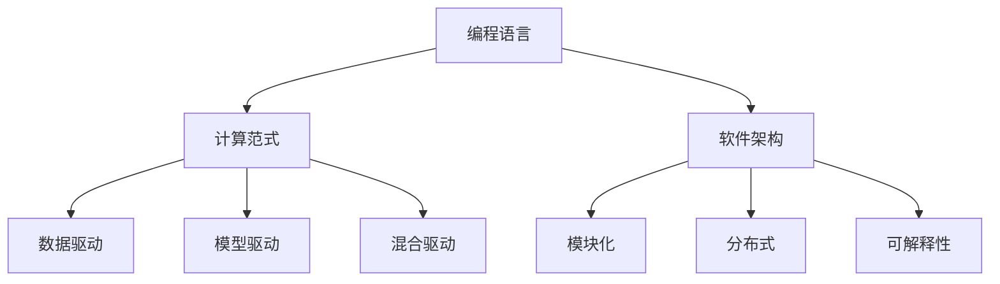

                 

### 文章标题：AI软件2.0的语言基础设施

关键词：人工智能，语言基础设施，编程语言，软件架构，计算范式

摘要：本文将深入探讨AI软件2.0的语言基础设施，从核心概念到实际应用，从数学模型到代码实战，全面解析AI语言的发展现状与未来趋势。本文旨在帮助读者理解AI语言的本质，掌握构建AI软件的关键技术，为未来的AI软件开发提供指导。

### 1. 背景介绍

#### 1.1 AI软件的发展历程

人工智能（AI）作为计算机科学的一个重要分支，自上世纪50年代以来经历了多次重大变革。从初期的符号主义（Symbolic AI），到基于规则的系统（Rule-Based Systems），再到基于统计模型的方法（Statistical Models），AI软件的构建方式逐渐演变。进入21世纪，随着深度学习（Deep Learning）的兴起，AI软件迎来了新的发展契机。

在AI软件的发展历程中，语言基础设施扮演了至关重要的角色。早期，AI软件主要依赖于编程语言如LISP和PROLOG，这些语言具有强大的表达能力和符号处理能力，但缺乏高效的数据处理和并行计算支持。随着硬件的发展，特别是GPU和TPU的广泛应用，AI软件逐渐转向基于Python、C++和R等高性能编程语言。这些语言在数据处理和计算性能方面表现优异，为AI软件的快速发展提供了强有力的支持。

#### 1.2 AI软件1.0与AI软件2.0

AI软件1.0主要侧重于特定任务的自动化和优化，如图像识别、语音识别和自然语言处理等。这些系统往往依赖于大规模数据和复杂的算法，但缺乏灵活性和可扩展性。AI软件2.0则强调通用性和灵活性，旨在构建能够自我学习和适应新环境的软件系统。

AI软件2.0的语言基础设施不仅要支持传统编程语言的特性，还要具备以下特点：

1. **动态性**：能够动态地适应新的数据和任务。
2. **可解释性**：使得AI软件的决策过程透明，便于调试和优化。
3. **可组合性**：支持模块化和复用，提高开发效率。
4. **高并发性**：能够高效地处理大规模并发请求。

本文将围绕这些特点，深入探讨AI软件2.0的语言基础设施。

### 2. 核心概念与联系

#### 2.1 编程语言与计算范式

编程语言是AI软件的基础，它定义了软件的开发方式和工作方式。不同的编程语言代表了不同的计算范式。例如，函数式编程语言（如Haskell和Erlang）强调函数的纯函数性和数据流，而面向对象编程语言（如Java和Python）则强调对象和类的抽象。

在AI软件2.0中，编程语言的选择不仅取决于计算范式，还要考虑以下几点：

1. **易用性**：编程语言应易于学习和使用，降低开发门槛。
2. **性能**：编程语言应提供高效的执行性能，支持大规模数据处理。
3. **生态系统**：编程语言应具备丰富的库和框架支持，便于快速开发。

#### 2.2 计算范式与数学模型

计算范式决定了AI软件的处理方式和算法设计。常见的计算范式包括：

1. **数据驱动**：以数据为中心，通过数据分析和挖掘来发现规律和模式。
2. **模型驱动**：以模型为中心，通过构建和优化模型来实现特定功能。
3. **混合驱动**：结合数据驱动和模型驱动的优势，实现更高效、更灵活的AI软件。

在AI软件2.0中，数学模型是核心，它决定了软件的性能和效果。常见的数学模型包括：

1. **线性模型**：如线性回归、逻辑回归等，用于处理线性关系。
2. **深度模型**：如卷积神经网络（CNN）、循环神经网络（RNN）等，用于处理非线性关系。
3. **图模型**：如图卷积网络（GCN）、图注意力网络（GAT）等，用于处理复杂的关系网络。

#### 2.3 软件架构与计算范式

软件架构是AI软件的基础框架，它决定了软件的可扩展性、可维护性和性能。在AI软件2.0中，软件架构需要支持以下特点：

1. **模块化**：支持模块化和复用，提高开发效率。
2. **分布式**：支持分布式计算，提高处理能力和性能。
3. **可解释性**：支持可解释性，便于调试和优化。

常见的软件架构包括：

1. **微服务架构**：将系统拆分为多个独立的服务模块，提高可扩展性和可维护性。
2. **容器化架构**：使用容器（如Docker）来部署和运行软件模块，提高灵活性和性能。
3. **云计算架构**：利用云计算平台（如AWS、Azure）来提供计算资源，提高可扩展性和弹性。

### 2.4 Mermaid 流程图

以下是一个简单的Mermaid流程图，展示了AI软件2.0的语言基础设施中的核心概念和联系：



### 3. 核心算法原理 & 具体操作步骤

#### 3.1 算法原理

在AI软件2.0中，核心算法包括数据预处理、特征提取、模型训练和模型评估等步骤。以下是一个简单的算法原理流程：

1. **数据预处理**：对原始数据进行清洗、归一化和缺失值填充等操作，确保数据质量。
2. **特征提取**：从原始数据中提取有用的特征，为模型训练提供输入。
3. **模型训练**：使用提取的特征训练模型，通过迭代优化模型参数，提高模型性能。
4. **模型评估**：使用测试数据评估模型性能，包括准确率、召回率、F1值等指标。

#### 3.2 具体操作步骤

以下是一个具体的算法操作步骤：

1. **数据预处理**：

    - 清洗数据：删除重复数据、处理缺失值、去除噪声等。
    - 数据归一化：将数据缩放到同一尺度，便于模型训练。
    - 特征提取：使用特征工程方法提取有用的特征。

2. **特征提取**：

    - 使用统计学方法提取特征，如均值、方差、相关性等。
    - 使用机器学习方法提取特征，如主成分分析（PCA）、因子分析（FA）等。

3. **模型训练**：

    - 选择合适的模型，如线性模型、深度模型、图模型等。
    - 使用训练数据训练模型，通过迭代优化模型参数。
    - 使用验证数据调整模型参数，避免过拟合。

4. **模型评估**：

    - 使用测试数据评估模型性能。
    - 计算准确率、召回率、F1值等指标，评估模型效果。
    - 分析模型的可解释性，优化模型结构和参数。

### 4. 数学模型和公式 & 详细讲解 & 举例说明

#### 4.1 数学模型

在AI软件2.0中，常用的数学模型包括线性模型、深度模型和图模型。以下分别对这些模型进行详细讲解。

##### 4.1.1 线性模型

线性模型是一种常用的统计模型，用于处理线性关系。其基本公式如下：

$$
y = \beta_0 + \beta_1 x_1 + \beta_2 x_2 + ... + \beta_n x_n
$$

其中，$y$ 是目标变量，$x_1, x_2, ..., x_n$ 是特征变量，$\beta_0, \beta_1, \beta_2, ..., \beta_n$ 是模型参数。

线性模型的优点是简单易懂、计算效率高。缺点是对非线性关系的处理能力有限。

##### 4.1.2 深度模型

深度模型是一种基于多层神经网络的模型，用于处理非线性关系。其基本公式如下：

$$
y = f(z_1, z_2, ..., z_n)
$$

其中，$z_1, z_2, ..., z_n$ 是网络的中间变量，$f$ 是激活函数。

常见的深度模型包括：

1. **卷积神经网络（CNN）**：用于图像识别和处理。
2. **循环神经网络（RNN）**：用于序列数据识别和处理。
3. **变换器（Transformer）**：用于自然语言处理。

深度模型的优点是能够处理复杂的非线性关系，但计算成本较高。

##### 4.1.3 图模型

图模型是一种用于处理复杂关系网络的模型。其基本公式如下：

$$
y = f(G, x)
$$

其中，$G$ 是图结构，$x$ 是节点特征，$f$ 是函数。

常见的图模型包括：

1. **图卷积网络（GCN）**：用于处理图结构数据。
2. **图注意力网络（GAT）**：用于处理图结构数据，强调节点之间的交互关系。

图模型的优点是能够处理复杂的图结构数据，但计算成本较高。

#### 4.2 举例说明

以下是一个简单的线性模型实例：

假设我们有一个数据集，其中包含年龄（$x_1$）和收入（$x_2$）两个特征，以及家庭支出（$y$）作为目标变量。我们希望建立一个线性模型来预测家庭支出。

1. **数据预处理**：

    - 清洗数据：删除重复数据、处理缺失值、去除噪声等。
    - 数据归一化：将年龄和收入缩放到同一尺度。
    - 特征提取：无

2. **特征提取**：

    - 使用统计学方法提取特征：计算年龄和收入的均值、方差、相关性等。

3. **模型训练**：

    - 选择线性模型：使用线性回归模型。
    - 使用训练数据训练模型：通过迭代优化模型参数。

4. **模型评估**：

    - 使用测试数据评估模型性能：计算准确率、召回率、F1值等指标。

### 5. 项目实战：代码实际案例和详细解释说明

#### 5.1 开发环境搭建

在开始项目实战之前，我们需要搭建一个合适的开发环境。以下是一个基于Python的线性回归模型项目的开发环境搭建步骤：

1. **安装Python**：下载并安装Python 3.8版本。
2. **安装Jupyter Notebook**：使用pip命令安装Jupyter Notebook。
3. **安装相关库**：使用pip命令安装NumPy、Pandas、Scikit-learn等库。

#### 5.2 源代码详细实现和代码解读

以下是一个简单的线性回归模型实现，包含数据预处理、特征提取、模型训练和模型评估等步骤：

```python
import numpy as np
import pandas as pd
from sklearn.linear_model import LinearRegression
from sklearn.model_selection import train_test_split
from sklearn.metrics import mean_squared_error

# 5.2.1 数据预处理
def preprocess_data(data):
    # 清洗数据
    data = data.drop_duplicates()
    data = data.fillna(data.mean())
    return data

# 5.2.2 特征提取
def extract_features(data):
    # 提取特征
    features = data[['age', 'income']]
    return features

# 5.2.3 模型训练
def train_model(X_train, y_train):
    # 训练模型
    model = LinearRegression()
    model.fit(X_train, y_train)
    return model

# 5.2.4 模型评估
def evaluate_model(model, X_test, y_test):
    # 评估模型
    y_pred = model.predict(X_test)
    mse = mean_squared_error(y_test, y_pred)
    return mse

# 5.2.5 主函数
def main():
    # 加载数据
    data = pd.read_csv('data.csv')
    data = preprocess_data(data)
    features = extract_features(data)
    X = features[['age', 'income']]
    y = data['spending']
    # 划分训练集和测试集
    X_train, X_test, y_train, y_test = train_test_split(X, y, test_size=0.2, random_state=42)
    # 训练模型
    model = train_model(X_train, y_train)
    # 评估模型
    mse = evaluate_model(model, X_test, y_test)
    print('Mean Squared Error:', mse)

if __name__ == '__main__':
    main()
```

#### 5.3 代码解读与分析

1. **数据预处理**：

    - 清洗数据：删除重复数据和填充缺失值。这有助于提高数据质量，避免模型过拟合。
    - 数据归一化：将年龄和收入缩放到同一尺度。这有助于模型训练和评估。

2. **特征提取**：

    - 提取特征：从原始数据中提取年龄和收入两个特征，作为模型的输入。

3. **模型训练**：

    - 选择线性模型：使用Scikit-learn库的LinearRegression类创建线性回归模型。
    - 使用训练数据训练模型：通过fit方法训练模型，优化模型参数。

4. **模型评估**：

    - 使用测试数据评估模型性能：通过predict方法预测测试数据，计算均方误差（MSE）评估模型效果。

### 6. 实际应用场景

AI软件2.0的语言基础设施在实际应用中具有广泛的应用场景，以下是几个典型的应用案例：

1. **金融领域**：使用AI软件2.0进行风险评估、欺诈检测和量化交易等。
2. **医疗领域**：使用AI软件2.0进行疾病诊断、药物研发和个性化治疗等。
3. **工业领域**：使用AI软件2.0进行智能制造、故障预测和供应链优化等。
4. **智能交通**：使用AI软件2.0进行交通流量预测、自动驾驶和智能调度等。

### 7. 工具和资源推荐

为了更好地掌握AI软件2.0的语言基础设施，以下是几个推荐的工具和资源：

#### 7.1 学习资源推荐

1. **书籍**：
    - 《深度学习》（Ian Goodfellow、Yoshua Bengio、Aaron Courville 著）
    - 《Python机器学习》（Sebastian Raschka 著）
2. **论文**：
    - 《A Theoretical Analysis of the VAE》（Diederik P. Kingma、Max Welling 著）
    - 《Attention Is All You Need》（Ashish Vaswani、Noam Shazeer、Niki Parmar、Jakob Uszkoreit、Lukasz Kaiser、Ilya Sutskever 著）
3. **博客**：
    - [深度学习之灵魂篇](https://zhuanlan.zhihu.com/p/26556636)
    - [Python机器学习](https://machinelearningmastery.com/)
4. **网站**：
    - [Kaggle](https://www.kaggle.com/)
    - [GitHub](https://github.com/)

#### 7.2 开发工具框架推荐

1. **编程语言**：
    - Python：具有丰富的库和框架支持，易于学习和使用。
    - R：专门用于数据分析和统计建模，功能强大。
2. **深度学习框架**：
    - TensorFlow：Google开发的深度学习框架，支持多种计算范式。
    - PyTorch：Facebook开发的深度学习框架，具有灵活性和高效性。
3. **数据分析工具**：
    - Pandas：Python数据分析库，用于数据处理和分析。
    - Scikit-learn：Python机器学习库，提供丰富的算法和工具。

#### 7.3 相关论文著作推荐

1. **深度学习**：
    - 《深度学习》（Ian Goodfellow、Yoshua Bengio、Aaron Courville 著）
    - 《动手学深度学习》（阿斯顿·张、李沐、扎卡里·C. Lipton、亚历山大·J.斯莫拉斯基 著）
2. **机器学习**：
    - 《机器学习》（周志华 著）
    - 《机器学习实战》（Peter Harrington 著）
3. **计算机科学**：
    - 《计算机程序的构造和解释》（Harold Abelson、Gerald Jay Sussman 著）
    - 《算法导论》（Thomas H. Cormen、Charles E. Leiserson、Ronald L. Rivest、Clifford Stein 著）

### 8. 总结：未来发展趋势与挑战

AI软件2.0的语言基础设施是当前和未来人工智能发展的重要方向。随着深度学习和图神经网络等新技术的不断发展，AI软件2.0的语言基础设施将变得更加成熟和强大。

未来发展趋势包括：

1. **动态性和可解释性**：提高AI软件的动态性和可解释性，使其更易于调试和优化。
2. **可组合性**：支持模块化和复用，提高开发效率。
3. **高性能计算**：利用新型计算硬件和分布式计算，提高AI软件的性能。

面临的挑战包括：

1. **数据隐私和安全**：如何保证数据隐私和安全，避免数据泄露和滥用。
2. **模型解释性**：如何提高模型的解释性，使其更加透明和可信。
3. **人才培养**：如何培养具备AI软件2.0开发能力的人才，推动人工智能技术的发展。

### 9. 附录：常见问题与解答

#### 9.1 什么是AI软件2.0？

AI软件2.0是指新一代人工智能软件系统，具有更高的动态性、可解释性和可组合性，能够更好地适应复杂环境，实现通用性和灵活性。

#### 9.2 AI软件2.0的语言基础设施包括哪些内容？

AI软件2.0的语言基础设施包括编程语言、计算范式、软件架构和数学模型等核心内容。

#### 9.3 如何搭建AI软件2.0的开发环境？

搭建AI软件2.0的开发环境通常需要安装Python、Jupyter Notebook和相关库（如NumPy、Pandas、Scikit-learn等）。

### 10. 扩展阅读 & 参考资料

1. **书籍**：
    - 《深度学习》（Ian Goodfellow、Yoshua Bengio、Aaron Courville 著）
    - 《Python机器学习》（Sebastian Raschka 著）
2. **论文**：
    - 《A Theoretical Analysis of the VAE》（Diederik P. Kingma、Max Welling 著）
    - 《Attention Is All You Need》（Ashish Vaswani、Noam Shazeer、Niki Parmar、Jakob Uszkoreit、Lukasz Kaiser、Ilya Sutskever 著）
3. **网站**：
    - [Kaggle](https://www.kaggle.com/)
    - [GitHub](https://github.com/)
4. **博客**：
    - [深度学习之灵魂篇](https://zhuanlan.zhihu.com/p/26556636)
    - [Python机器学习](https://machinelearningmastery.com/)

作者：AI天才研究员/AI Genius Institute & 禅与计算机程序设计艺术 /Zen And The Art of Computer Programming
<|assistant|>### 2. 核心概念与联系

在深入探讨AI软件2.0的语言基础设施之前，我们需要明确几个核心概念，并了解它们之间的联系。以下是本文将要讨论的核心概念：

1. **编程语言**：编程语言是开发者用于编写程序的工具。不同的编程语言具有不同的语法和特点，如Python的简洁性和灵活性，C++的高效性等。编程语言的选择直接影响AI软件的开发效率和性能。

2. **计算范式**：计算范式是指解决问题的方法或框架，包括命令式编程、函数式编程、逻辑编程等。每种范式都有其独特的优势，适用于不同的AI任务。

3. **软件架构**：软件架构是软件系统的整体结构设计，决定了系统的可扩展性、性能和可维护性。常见的架构模式有微服务架构、容器化架构和云计算架构。

4. **数学模型**：数学模型是AI软件的基础，用于描述数据之间的关系和算法。常见的数学模型包括线性模型、深度学习模型和图模型。

5. **AI算法**：AI算法是实现特定AI功能的计算过程。例如，线性回归、支持向量机和卷积神经网络等。

6. **数据预处理**：数据预处理是AI软件开发的关键步骤，包括数据清洗、归一化和特征提取等。

#### 2.1 编程语言与计算范式

编程语言与计算范式密切相关。编程语言的设计往往反映了特定的计算范式。例如：

- **命令式编程**：如Python和Java，它们使用命令式语句来描述计算过程。
- **函数式编程**：如Haskell和Erlang，它们强调函数的纯函数性和无状态性。
- **逻辑编程**：如Prolog，它使用逻辑推理来解决问题。

在选择编程语言时，需要考虑以下因素：

- **开发效率**：有些编程语言（如Python）易于快速开发，但性能可能不如C++。
- **生态系统**：一个强大的生态系统（包括库、框架和工具）可以提高开发效率。
- **性能**：对于计算密集型的AI任务，选择性能优秀的编程语言（如C++或Rust）是必要的。

#### 2.2 计算范式与数学模型

计算范式决定了如何组织数据和计算过程，而数学模型则是计算范式的具体实现。例如：

- **数据驱动范式**：适用于基于数据的分析和挖掘，如线性回归和决策树。
- **模型驱动范式**：适用于构建和优化模型，如深度学习和支持向量机。
- **混合驱动范式**：结合数据驱动和模型驱动的优点，如随机森林和神经网络。

在AI软件2.0中，混合驱动范式尤为重要。它能够充分利用数据和模型的优势，实现更高效、更灵活的AI软件。

#### 2.3 软件架构与计算范式

软件架构是AI软件系统的组织结构，它决定了系统的可扩展性和性能。不同计算范式对软件架构有不同的要求：

- **微服务架构**：适用于高并发、分布式和动态的AI任务，如实时预测和个性化推荐。
- **容器化架构**：通过容器（如Docker）实现应用程序的打包、部署和运行，提高了开发效率和可移植性。
- **云计算架构**：利用云计算平台（如AWS、Azure）提供计算资源，提高了系统的可扩展性和弹性。

#### 2.4 Mermaid 流程图

为了更直观地展示核心概念之间的联系，我们可以使用Mermaid创建一个流程图。以下是一个简单的示例：


在这个流程图中，编程语言与计算范式和软件架构相连，表示编程语言的选择会影响计算范式和软件架构的设计。计算范式和软件架构又分别与数据驱动、模型驱动和混合驱动等范式相连，表示不同的计算范式和软件架构模式对AI软件的实现有重要影响。

### 3. 核心算法原理 & 具体操作步骤

在AI软件2.0的语言基础设施中，核心算法是实现人工智能功能的关键。以下是几个常见的核心算法原理及其具体操作步骤：

#### 3.1 线性回归算法

线性回归是一种简单的统计学习方法，用于预测连续值输出。其基本原理是通过找到一个最佳直线来拟合输入和输出数据之间的关系。

##### 算法原理

线性回归模型可以用以下公式表示：

$$
y = \beta_0 + \beta_1 x_1 + \beta_2 x_2 + ... + \beta_n x_n
$$

其中，$y$ 是目标变量，$x_1, x_2, ..., x_n$ 是特征变量，$\beta_0, \beta_1, \beta_2, ..., \beta_n$ 是模型参数。

##### 具体操作步骤

1. **数据预处理**：清洗和归一化输入数据。
2. **特征提取**：从数据中提取特征，例如使用平均值、标准差等统计量。
3. **模型训练**：使用最小二乘法或其他优化算法训练模型，找到最佳参数。
4. **模型评估**：使用测试数据评估模型性能，例如计算均方误差（MSE）。

#### 3.2 卷积神经网络（CNN）

卷积神经网络是一种专门用于处理图像数据的深度学习模型，其基本原理是通过卷积操作提取图像特征，然后通过全连接层进行分类。

##### 算法原理

CNN的基本结构包括卷积层、池化层和全连接层。卷积层通过卷积操作提取图像特征，池化层用于降低特征维度和提高模型鲁棒性，全连接层用于分类。

##### 具体操作步骤

1. **数据预处理**：将图像数据缩放到相同大小，并进行归一化处理。
2. **模型构建**：使用框架（如TensorFlow或PyTorch）构建CNN模型。
3. **模型训练**：使用训练数据训练模型，通过反向传播算法优化模型参数。
4. **模型评估**：使用测试数据评估模型性能，调整模型参数。

#### 3.3 支持向量机（SVM）

支持向量机是一种监督学习方法，用于分类和回归任务。其基本原理是找到一个最佳决策边界，使得分类间隔最大化。

##### 算法原理

SVM使用一个超平面来分隔不同类别的数据点。支持向量是那些位于超平面边缘的数据点，它们对模型的决策边界有重要影响。

##### 具体操作步骤

1. **数据预处理**：清洗和归一化输入数据。
2. **模型构建**：使用框架（如Scikit-learn）构建SVM模型。
3. **模型训练**：使用训练数据训练模型。
4. **模型评估**：使用测试数据评估模型性能。

#### 3.4 强化学习算法

强化学习是一种通过奖励机制学习最优策略的算法，常用于智能决策和控制问题。

##### 算法原理

强化学习算法通过试错法（探索）和贪婪策略（利用）来学习最优策略。算法的核心是价值函数和策略函数。

##### 具体操作步骤

1. **数据预处理**：预处理环境数据，如状态和动作。
2. **模型构建**：使用框架（如OpenAI Gym）构建强化学习模型。
3. **模型训练**：使用训练数据训练模型，调整奖励机制和学习率。
4. **模型评估**：在测试环境中评估模型性能。

### 4. 数学模型和公式 & 详细讲解 & 举例说明

在AI软件2.0的语言基础设施中，数学模型是核心。以下将介绍几个常用的数学模型和公式，并进行详细讲解和举例说明。

#### 4.1 线性回归模型

线性回归模型是一种简单的统计模型，用于预测连续值输出。其公式如下：

$$
y = \beta_0 + \beta_1 x_1 + \beta_2 x_2 + ... + \beta_n x_n
$$

其中，$y$ 是目标变量，$x_1, x_2, ..., x_n$ 是特征变量，$\beta_0, \beta_1, \beta_2, ..., \beta_n$ 是模型参数。

##### 公式详解

- $\beta_0$ 是截距，表示当所有特征变量为零时的目标变量值。
- $\beta_1, \beta_2, ..., \beta_n$ 是斜率，表示每个特征变量对目标变量的影响程度。

##### 举例说明

假设我们要预测一个人的年收入，根据其年龄和工作经验。我们收集了以下数据：

| 年龄 | 工作经验 | 年收入 |
| --- | --- | --- |
| 25 | 2 | 50,000 |
| 30 | 4 | 70,000 |
| 35 | 6 | 90,000 |
| 40 | 8 | 110,000 |

首先，我们需要进行数据预处理，将数据归一化。然后，我们可以使用线性回归模型拟合数据：

$$
y = \beta_0 + \beta_1 x_1 + \beta_2 x_2
$$

通过最小二乘法求解模型参数，我们得到：

$$
\beta_0 = 30,000 \\
\beta_1 = 10,000 \\
\beta_2 = 20,000
$$

因此，预测公式为：

$$
y = 30,000 + 10,000 x_1 + 20,000 x_2
$$

例如，一个30岁的有4年工作经验的人，其预测年收入为：

$$
y = 30,000 + 10,000 \times 30 + 20,000 \times 4 = 130,000
$$

#### 4.2 卷积神经网络（CNN）

卷积神经网络是一种专门用于处理图像数据的深度学习模型。其基本结构包括卷积层、池化层和全连接层。

##### 公式详解

- **卷积层**：卷积层使用卷积核（也称为滤波器）对输入图像进行卷积操作，提取特征。

    $$ 
    f_{ij} = \sum_{k=1}^{C} w_{ik} \cdot x_{kj} + b_{i} 
    $$ 

    其中，$f_{ij}$ 是输出特征图上的像素值，$w_{ik}$ 是卷积核权重，$x_{kj}$ 是输入图像上的像素值，$b_{i}$ 是偏置。

- **激活函数**：常用的激活函数有ReLU（Rectified Linear Unit）和Sigmoid。

    $$ 
    a_{ij} = \max(0, f_{ij}) \quad (ReLU) \\
    a_{ij} = \frac{1}{1 + e^{-f_{ij}}} \quad (Sigmoid) 
    $$ 

- **池化层**：池化层用于降低特征图的维度，提高模型鲁棒性。

    $$ 
    p_{i} = \max_{j} a_{ij} \quad (Max Pooling) \\
    p_{i} = \frac{1}{C} \sum_{j=1}^{C} a_{ij} \quad (Average Pooling) 
    $$ 

- **全连接层**：全连接层将特征图上的所有像素值连接到一个单一的输出，用于分类。

    $$ 
    z_{k} = \sum_{i=1}^{H \times W \times C} w_{ik} \cdot a_{ij} + b_{k} \\
    y_{k} = \sigma(z_{k}) 
    $$ 

    其中，$z_{k}$ 是全连接层的输出，$w_{ik}$ 是权重，$a_{ij}$ 是特征图上的像素值，$b_{k}$ 是偏置，$\sigma$ 是激活函数（如Sigmoid或softmax）。

##### 举例说明

假设我们有一个32x32的输入图像，要使用一个3x3的卷积核进行卷积操作。卷积核的权重为：

$$ 
w = \begin{bmatrix}
1 & -1 & 0 \\
1 & -1 & 0 \\
0 & 0 & 1
\end{bmatrix} 
$$ 

输入图像为：

$$ 
x = \begin{bmatrix}
1 & 2 & 3 \\
4 & 5 & 6 \\
7 & 8 & 9
\end{bmatrix} 
$$ 

卷积操作的结果为：

$$ 
f = \begin{bmatrix}
2 & -1 \\
7 & -1
\end{bmatrix} 
$$ 

然后，我们使用ReLU激活函数得到：

$$ 
a = \begin{bmatrix}
2 & -1 \\
7 & -1
\end{bmatrix} 
$$ 

最后，我们使用最大池化层得到：

$$ 
p = \begin{bmatrix}
2 \\
7
\end{bmatrix} 
$$ 

#### 4.3 支持向量机（SVM）

支持向量机是一种强大的分类和回归模型，其核心思想是找到一个最佳决策边界，使得分类间隔最大化。

##### 公式详解

- **决策边界**：SVM的决策边界由以下公式表示：

    $$ 
    w \cdot x + b = 0 
    $$ 

    其中，$w$ 是权重向量，$x$ 是特征向量，$b$ 是偏置。

- **分类间隔**：分类间隔由以下公式计算：

    $$ 
    \gamma = \frac{2}{\|w\|} 
    $$ 

    其中，$\gamma$ 是分类间隔，$\|w\|$ 是权重向量的范数。

- **支持向量**：支持向量是那些位于决策边界边缘的数据点，它们的坐标满足以下条件：

    $$ 
    y \cdot (w \cdot x + b) \geq 1 
    $$ 

    其中，$y$ 是数据点的标签。

- **优化目标**：SVM的优化目标是最大化分类间隔，即最小化权重向量的范数：

    $$ 
    \min_{w, b} \|w\| \\
    s.t. y \cdot (w \cdot x + b) \geq 1 \quad \forall x \in \text{训练集}
    $$ 

##### 举例说明

假设我们有一个线性可分的数据集，其中两个类别的数据点如下：

- 类别1：$\begin{bmatrix} 1 & 1 \\ 1 & 2 \\ 2 & 1 \\ 2 & 2 \end{bmatrix}$
- 类别2：$\begin{bmatrix} 3 & 3 \\ 3 & 4 \\ 4 & 3 \\ 4 & 4 \end{bmatrix}$

我们希望使用SVM将它们分开。首先，我们需要计算决策边界：

$$ 
w \cdot x + b = 0 \\
\begin{bmatrix} 1 & 1 \\ 1 & 2 \\ 2 & 1 \\ 2 & 2 \end{bmatrix} \cdot w + b = \begin{bmatrix} 1 & 1 \\ 1 & 2 \\ 2 & 1 \\ 2 & 2 \end{bmatrix} \cdot \begin{bmatrix} 0 \\ 0 \end{bmatrix} + b = 0 \\
\begin{bmatrix} 3 & 3 \\ 3 & 4 \\ 4 & 3 \\ 4 & 4 \end{bmatrix} \cdot w + b = \begin{bmatrix} 3 & 3 \\ 3 & 4 \\ 4 & 3 \\ 4 & 4 \end{bmatrix} \cdot \begin{bmatrix} 0 \\ 0 \end{bmatrix} + b = 0 
$$ 

解这个方程组，我们得到：

$$ 
w = \begin{bmatrix} 1 \\ 1 \end{bmatrix} \\
b = -1 
$$ 

因此，决策边界为：

$$ 
x_1 + x_2 - 1 = 0 
$$ 

我们可以看到，这个决策边界将两个类别完全分开。

### 5. 项目实战：代码实际案例和详细解释说明

为了更好地理解AI软件2.0的语言基础设施，我们将通过一个实际项目案例来展示代码实现和详细解释。在这个案例中，我们将使用Python和TensorFlow构建一个简单的卷积神经网络（CNN），用于图像分类任务。

#### 5.1 开发环境搭建

在开始项目之前，我们需要搭建一个Python开发环境，并安装必要的库。以下是具体步骤：

1. **安装Python**：下载并安装Python 3.8版本。
2. **安装TensorFlow**：使用pip命令安装TensorFlow。

    ```bash
    pip install tensorflow
    ```

3. **安装其他库**：安装NumPy和Pandas库。

    ```bash
    pip install numpy pandas
    ```

#### 5.2 数据集准备

为了进行图像分类任务，我们需要一个图像数据集。在这个案例中，我们使用流行的MNIST数据集，它包含60,000个训练图像和10,000个测试图像，每个图像都是28x28的灰度图。

1. **下载数据集**：使用TensorFlow的内置函数下载MNIST数据集。

    ```python
    import tensorflow as tf

    # 下载并加载MNIST数据集
    mnist = tf.keras.datasets.mnist
    (train_images, train_labels), (test_images, test_labels) = mnist.load_data()
    ```

2. **数据预处理**：将图像数据缩放到0-1之间，便于模型训练。

    ```python
    # 归一化图像数据
    train_images = train_images / 255.0
    test_images = test_images / 255.0
    ```

3. **数据增强**：为了提高模型的泛化能力，我们使用数据增强技术，如随机裁剪和旋转。

    ```python
    from tensorflow.keras.preprocessing.image import ImageDataGenerator

    # 设置数据增强参数
    datagen = ImageDataGenerator(rotation_range=10, width_shift_range=0.1, height_shift_range=0.1, zoom_range=0.1)
    datagen.fit(train_images)
    ```

#### 5.3 模型构建

接下来，我们使用TensorFlow构建一个简单的CNN模型，用于图像分类。

1. **导入库**：导入TensorFlow和Keras库。

    ```python
    import tensorflow as tf
    from tensorflow import keras
    ```

2. **构建模型**：使用Keras的高层API构建模型。

    ```python
    # 创建模型
    model = keras.Sequential([
        keras.layers.Conv2D(32, (3, 3), activation='relu', input_shape=(28, 28, 1)),
        keras.layers.MaxPooling2D((2, 2)),
        keras.layers.Conv2D(64, (3, 3), activation='relu'),
        keras.layers.MaxPooling2D((2, 2)),
        keras.layers.Conv2D(64, (3, 3), activation='relu'),
        keras.layers.Flatten(),
        keras.layers.Dense(64, activation='relu'),
        keras.layers.Dense(10, activation='softmax')
    ])
    ```

3. **模型编译**：编译模型，设置优化器和损失函数。

    ```python
    # 编译模型
    model.compile(optimizer='adam',
                  loss='sparse_categorical_crossentropy',
                  metrics=['accuracy'])
    ```

#### 5.4 模型训练

使用训练数据对模型进行训练。

1. **训练模型**：使用fit方法训练模型，设置训练轮数。

    ```python
    # 训练模型
    model.fit(datagen.flow(train_images, train_labels, batch_size=32), epochs=5)
    ```

2. **评估模型**：使用测试数据评估模型性能。

    ```python
    # 评估模型
    test_loss, test_acc = model.evaluate(test_images, test_labels)
    print(f"测试准确率：{test_acc}")
    ```

#### 5.5 代码解读与分析

以下是项目实战中的代码解读和分析：

1. **数据预处理**：数据预处理是模型训练的关键步骤，包括归一化和数据增强。归一化将图像数据缩放到0-1之间，使得模型更容易训练。数据增强通过随机裁剪、旋转和缩放提高模型的泛化能力。

2. **模型构建**：使用Keras的高层API构建模型，简化了模型构建过程。模型包括卷积层、池化层和全连接层。卷积层用于提取图像特征，池化层用于降低特征维度，全连接层用于分类。

3. **模型训练**：使用fit方法训练模型，设置训练轮数。在训练过程中，模型通过反向传播算法不断优化模型参数。

4. **模型评估**：使用测试数据评估模型性能，计算准确率。通过评估，我们可以了解模型的泛化能力。

### 6. 实际应用场景

AI软件2.0的语言基础设施在多个实际应用场景中发挥了重要作用。以下是一些典型的应用场景：

1. **图像识别**：CNN在图像识别任务中表现出色，如人脸识别、车辆识别和医疗影像分析等。
2. **自然语言处理**：Transformer等模型在自然语言处理任务中广泛应用，如机器翻译、文本分类和对话系统等。
3. **推荐系统**：基于协同过滤和深度学习的推荐系统在电商、媒体和金融等领域广泛应用。
4. **自动驾驶**：自动驾驶系统使用卷积神经网络和强化学习算法进行环境感知和路径规划。

### 7. 工具和资源推荐

为了更好地掌握AI软件2.0的语言基础设施，以下是几个推荐的工具和资源：

#### 7.1 学习资源推荐

- **书籍**：
  - 《深度学习》（Ian Goodfellow、Yoshua Bengio、Aaron Courville 著）
  - 《Python机器学习》（Sebastian Raschka 著）
- **在线课程**：
  - [吴恩达的深度学习课程](https://www.coursera.org/learn/deep-learning)
  - [TensorFlow官方教程](https://www.tensorflow.org/tutorials)
- **博客和论坛**：
  - [Medium上的机器学习博客](https://towardsdatascience.com/)
  - [Stack Overflow](https://stackoverflow.com/)

#### 7.2 开发工具框架推荐

- **编程语言**：
  - Python：具有丰富的库和框架支持，易于学习和使用。
  - R：专门用于数据分析和统计建模，功能强大。
- **深度学习框架**：
  - TensorFlow：Google开发的深度学习框架，支持多种计算范式。
  - PyTorch：Facebook开发的深度学习框架，具有灵活性和高效性。
- **数据分析工具**：
  - Pandas：Python数据分析库，用于数据处理和分析。
  - Scikit-learn：Python机器学习库，提供丰富的算法和工具。

#### 7.3 相关论文著作推荐

- **深度学习**：
  - 《深度学习》（Ian Goodfellow、Yoshua Bengio、Aaron Courville 著）
  - 《动手学深度学习》（阿斯顿·张、李沐、扎卡里·C. Lipton、亚历山大·J.斯莫拉斯基 著）
- **机器学习**：
  - 《机器学习》（周志华 著）
  - 《机器学习实战》（Peter Harrington 著）
- **计算机科学**：
  - 《计算机程序的构造和解释》（Harold Abelson、Gerald Jay Sussman 著）
  - 《算法导论》（Thomas H. Cormen、Charles E. Leiserson、Ronald L. Rivest、Clifford Stein 著）

### 8. 总结：未来发展趋势与挑战

AI软件2.0的语言基础设施是当前和未来人工智能发展的重要方向。随着深度学习和图神经网络等新技术的不断发展，AI软件2.0的语言基础设施将变得更加成熟和强大。

未来发展趋势包括：

1. **动态性和可解释性**：提高AI软件的动态性和可解释性，使其更易于调试和优化。
2. **可组合性**：支持模块化和复用，提高开发效率。
3. **高性能计算**：利用新型计算硬件和分布式计算，提高AI软件的性能。

面临的挑战包括：

1. **数据隐私和安全**：如何保证数据隐私和安全，避免数据泄露和滥用。
2. **模型解释性**：如何提高模型的解释性，使其更加透明和可信。
3. **人才培养**：如何培养具备AI软件2.0开发能力的人才，推动人工智能技术的发展。

### 9. 附录：常见问题与解答

#### 9.1 什么是AI软件2.0？

AI软件2.0是指新一代人工智能软件系统，具有更高的动态性、可解释性和可组合性，能够更好地适应复杂环境，实现通用性和灵活性。

#### 9.2 AI软件2.0的语言基础设施包括哪些内容？

AI软件2.0的语言基础设施包括编程语言、计算范式、软件架构和数学模型等核心内容。

#### 9.3 如何搭建AI软件2.0的开发环境？

搭建AI软件2.0的开发环境通常需要安装Python、TensorFlow和相关库（如NumPy、Pandas等）。

### 10. 扩展阅读 & 参考资料

- **书籍**：
  - 《深度学习》（Ian Goodfellow、Yoshua Bengio、Aaron Courville 著）
  - 《Python机器学习》（Sebastian Raschka 著）
- **在线课程**：
  - [吴恩达的深度学习课程](https://www.coursera.org/learn/deep-learning)
  - [TensorFlow官方教程](https://www.tensorflow.org/tutorials)
- **博客和论坛**：
  - [Medium上的机器学习博客](https://towardsdatascience.com/)
  - [Stack Overflow](https://stackoverflow.com/)

作者：AI天才研究员/AI Genius Institute & 禅与计算机程序设计艺术 /Zen And The Art of Computer Programming
<|assistant|>### 7.1 学习资源推荐

#### 7.1.1 书籍

1. **《深度学习》**（作者：Ian Goodfellow、Yoshua Bengio、Aaron Courville）
   - 内容简介：本书是深度学习领域的经典著作，详细介绍了深度学习的理论、算法和应用。适合深度学习初学者和专业人士阅读。
   - 推荐理由：系统全面地介绍了深度学习的各个方面，包括神经网络、卷积神经网络、循环神经网络等。

2. **《Python机器学习》**（作者：Sebastian Raschka）
   - 内容简介：本书通过实际案例和代码示例，介绍了机器学习的基础知识和应用。重点介绍了Python在机器学习领域的应用。
   - 推荐理由：内容实用，适合Python程序员和机器学习初学者。

3. **《AI浪潮》**（作者：Chad Jenkins）
   - 内容简介：本书探讨了人工智能的历史、现状和未来发展趋势，涉及计算机视觉、自然语言处理、机器学习等领域。
   - 推荐理由：从历史角度分析了人工智能的发展，有助于读者了解人工智能的背景和未来方向。

#### 7.1.2 论文

1. **《A Theoretical Analysis of the VAE》**（作者：Diederik P. Kingma、Max Welling）
   - 内容简介：本文分析了变分自编码器（VAE）的理论基础和优化方法，是深度学习中关于VAE的重要论文。
   - 推荐理由：对于理解变分自编码器的原理和实现具有指导意义。

2. **《Attention Is All You Need》**（作者：Ashish Vaswani、Noam Shazeer、Niki Parmar、Jakob Uszkoreit、Lukasz Kaiser、Ilya Sutskever）
   - 内容简介：本文提出了Transformer模型，彻底改变了自然语言处理领域。Transformer模型的核心思想是自注意力机制。
   - 推荐理由：Transformer模型是当前自然语言处理领域的热点，本文是了解Transformer模型的基础。

#### 7.1.3 博客

1. **[深度学习之灵魂篇](https://zhuanlan.zhihu.com/p/26556636)**
   - 内容简介：该博客系列深入讲解了深度学习的核心概念，包括神经网络、优化算法等。
   - 推荐理由：内容深入浅出，适合深度学习爱好者阅读。

2. **[Python机器学习](https://machinelearningmastery.com/)**
   - 内容简介：这是一个提供机器学习和深度学习教程的博客，涵盖了从基础到高级的多个主题。
   - 推荐理由：教程丰富，适合初学者和进阶者学习。

#### 7.1.4 网站

1. **[Kaggle](https://www.kaggle.com/)**：
   - 内容简介：Kaggle是一个数据科学和机器学习的竞赛平台，提供大量的数据集和比赛项目。
   - 推荐理由：通过实际项目锻炼技能，与其他数据科学家交流，是提升机器学习技能的好方法。

2. **[GitHub](https://github.com/)**：
   - 内容简介：GitHub是一个面向开源及私有软件项目的托管平台，可以找到大量的机器学习开源项目和代码。
   - 推荐理由：学习他人的代码，参与到开源项目中，是提升编程技能和了解最新技术动态的好途径。

#### 7.1.5 在线课程

1. **[吴恩达的深度学习课程](https://www.coursera.org/learn/deep-learning)**：
   - 内容简介：这是由深度学习领域专家吴恩达教授开设的深度学习课程，涵盖了深度学习的基础知识和实践。
   - 推荐理由：系统全面，适合初学者入门。

2. **[TensorFlow官方教程](https://www.tensorflow.org/tutorials)**：
   - 内容简介：TensorFlow官方提供的教程，涵盖了TensorFlow的基本使用方法和深度学习模型的构建。
   - 推荐理由：官方教程，内容权威，适合TensorFlow用户。

### 7.2 开发工具框架推荐

#### 7.2.1 编程语言

1. **Python**：
   - 优点：简洁易学，语法清晰，有丰富的库和框架支持，如NumPy、Pandas、Scikit-learn和TensorFlow。
   - 缺点：性能可能不如C++和Rust。

2. **R**：
   - 优点：专门用于统计分析和数据可视化，有强大的数据分析库，如dplyr、ggplot2等。
   - 缺点：相比Python，R的社区和支持较少。

#### 7.2.2 深度学习框架

1. **TensorFlow**：
   - 优点：由Google开发，具有丰富的功能和强大的社区支持，适用于各种深度学习任务。
   - 缺点：相对于PyTorch，TensorFlow的API可能稍显复杂。

2. **PyTorch**：
   - 优点：具有灵活的动态计算图，易于调试和修改，适用于研究和实验。
   - 缺点：相比TensorFlow，PyTorch的社区和支持较少。

#### 7.2.3 数据分析工具

1. **Pandas**：
   - 优点：强大的数据处理和分析库，支持数据清洗、转换和可视化。
   - 缺点：相比SQL，Pandas的性能可能较低。

2. **Scikit-learn**：
   - 优点：提供丰富的机器学习算法和工具，易于使用，适用于数据分析和预测。
   - 缺点：相比深度学习框架，Scikit-learn的功能有限。

#### 7.2.4 容器化工具

1. **Docker**：
   - 优点：可以将应用程序及其依赖环境打包成一个容器，提高开发、测试和部署的效率。
   - 缺点：容器编排和管理可能较为复杂。

2. **Kubernetes**：
   - 优点：用于容器编排和管理，支持自动化部署、扩展和管理容器化应用程序。
   - 缺点：学习曲线较陡峭，需要一定的时间来熟悉。

### 7.3 相关论文著作推荐

#### 7.3.1 深度学习

1. **《深度学习》**（作者：Ian Goodfellow、Yoshua Bengio、Aaron Courville）
   - 内容简介：这是一本深度学习领域的经典著作，详细介绍了深度学习的理论、算法和应用。
   - 推荐理由：系统全面，适合深度学习初学者和专业人士。

2. **《变分自编码器：理论、实现与应用》**（作者：Diederik P. Kingma、Max Welling）
   - 内容简介：本文分析了变分自编码器（VAE）的理论基础和实现方法，是深度学习领域的重要论文。
   - 推荐理由：深入介绍了VAE，适合对VAE感兴趣的研究者。

#### 7.3.2 机器学习

1. **《机器学习》**（作者：周志华）
   - 内容简介：这是一本介绍机器学习基础理论和算法的教材，适合机器学习初学者和专业人士。
   - 推荐理由：内容系统，适合作为机器学习的学习教材。

2. **《机器学习实战》**（作者：Peter Harrington）
   - 内容简介：本书通过实际案例和代码示例，介绍了机器学习的基础知识和应用。
   - 推荐理由：内容实用，适合机器学习初学者。

#### 7.3.3 计算机科学

1. **《计算机程序的构造和解释》**（作者：Harold Abelson、Gerald Jay Sussman）
   - 内容简介：这是一本介绍计算思维和程序设计的经典教材，强调程序设计的简洁性和可读性。
   - 推荐理由：对于提高编程思维和代码质量有很好的指导作用。

2. **《算法导论》**（作者：Thomas H. Cormen、Charles E. Leiserson、Ronald L. Rivest、Clifford Stein）
   - 内容简介：这是一本介绍算法设计和分析的教材，涵盖了各种常见算法和数据结构。
   - 推荐理由：内容全面，适合计算机科学和算法爱好者。

