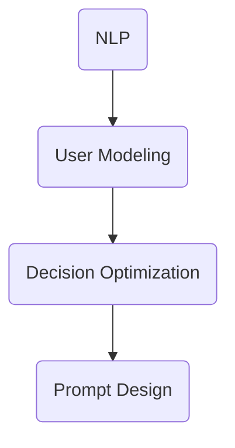

                 

# AI辅助决策支持系统中的提示词设计

## 概述

在AI辅助决策支持系统中，提示词设计是一个至关重要的环节。提示词（Prompt）作为人与系统交互的桥梁，能够显著提高决策效率和准确性。本文旨在深入探讨AI辅助决策支持系统中提示词的设计原则、方法及其在实践中的应用。

关键词：AI决策支持、提示词设计、交互、效率、准确性

### 摘要

本文首先介绍了AI辅助决策支持系统的背景和重要性，随后详细阐述了提示词的定义及其在系统中的作用。接着，我们探讨了设计高质量提示词的原则，包括清晰性、针对性、灵活性和可扩展性。随后，文章通过数学模型和算法原理的分析，详细解释了如何设计有效的提示词。随后，我们通过一个具体的代码案例，展示了如何实现和优化提示词设计。最后，文章讨论了提示词设计在实际应用场景中的重要性，并推荐了一些学习资源和开发工具。

### 1. 背景介绍

#### 1.1 AI辅助决策支持系统的定义

AI辅助决策支持系统（AI-aided Decision Support System，AI-DSS）是一种基于人工智能技术，为决策者提供信息分析和辅助决策的系统。它利用机器学习、深度学习、自然语言处理等技术，从大量的数据中提取有价值的信息，帮助决策者做出更加明智的决策。

#### 1.2 决策支持系统的重要性

在现代社会，信息爆炸和数据泛滥使得传统的决策方式难以满足高效、准确的需求。决策支持系统作为现代管理信息系统的一个重要分支，能够通过模拟、分析和评估，帮助决策者识别问题、制定方案和评估结果，从而提高决策的质量和效率。

#### 1.3 提示词的概念

提示词是指用于引导用户进行输入或者调整系统行为的文字或语音信息。在AI辅助决策支持系统中，提示词不仅是用户与系统交互的桥梁，更是系统理解用户需求、提供个性化服务的关键。

### 2. 核心概念与联系

为了更好地理解提示词设计，我们需要先了解几个核心概念，包括自然语言处理（Natural Language Processing，NLP）、用户建模（User Modeling）和决策优化（Decision Optimization）。

#### 2.1 自然语言处理（NLP）

自然语言处理是AI领域的一个重要分支，它专注于使计算机能够理解、处理和生成人类语言。在AI辅助决策支持系统中，NLP技术被广泛应用于文本分析、情感分析、命名实体识别等任务，从而提高系统的智能化程度。

#### 2.2 用户建模（User Modeling）

用户建模是指根据用户的交互行为和偏好，构建用户特征模型，以实现对用户的个性化和定制化服务。在提示词设计中，用户建模可以帮助系统更好地理解用户的需求和意图，从而提供更加精准的提示。

#### 2.3 决策优化（Decision Optimization）

决策优化是指通过优化算法和模型，从多个可能的决策方案中选择最优或近似最优的方案。在AI辅助决策支持系统中，决策优化可以帮助系统在复杂的环境中做出更加明智的决策。

#### 2.4 Mermaid 流程图



在这个流程图中，NLP、User Modeling和Decision Optimization是提示词设计的核心环节，它们相互关联，共同决定了提示词的有效性。

### 3. 核心算法原理 & 具体操作步骤

#### 3.1 提示词生成算法

提示词生成算法是设计高质量提示词的关键。一种常见的生成算法是基于模板的提示词生成。具体步骤如下：

1. **数据预处理**：收集用户历史交互数据，包括输入的文本、用户的操作历史等。
2. **特征提取**：对预处理后的数据进行特征提取，生成用户特征向量。
3. **模板选择**：根据用户特征向量，从预定义的模板库中选择合适的提示词模板。
4. **提示词生成**：将模板与用户特征向量进行融合，生成个性化的提示词。

#### 3.2 提示词优化算法

提示词优化算法用于评估和改进提示词的质量。一种常见的优化算法是基于反馈的提示词优化。具体步骤如下：

1. **用户反馈收集**：收集用户对提示词的反馈，包括满意度、点击率等。
2. **提示词评估**：根据用户反馈，评估提示词的质量。
3. **提示词改进**：根据评估结果，对提示词进行改进，提高其质量。

#### 3.3 提示词展现策略

提示词的展现策略决定了用户何时、如何看到提示词。一种常见的展现策略是基于上下文的提示词展现。具体步骤如下：

1. **上下文识别**：识别用户当前的上下文信息，包括用户正在进行的操作、页面内容等。
2. **提示词选择**：根据上下文信息，选择最相关的提示词。
3. **提示词展现**：在用户界面上展现选择的提示词。

### 4. 数学模型和公式 & 详细讲解 & 举例说明

#### 4.1 提示词生成模型

提示词生成模型通常采用基于概率的生成模型，如朴素贝叶斯（Naive Bayes）、条件随机场（CRF）等。下面以朴素贝叶斯为例，介绍其数学模型。

假设我们有用户特征向量 \( \textbf{x} \)，提示词模板库为 \( \{ \text{template}_1, \text{template}_2, ..., \text{template}_n \} \)。根据朴素贝叶斯模型，选择提示词的概率分布如下：

$$
P(\text{template}_i | \textbf{x}) = \frac{P(\textbf{x} | \text{template}_i)P(\text{template}_i)}{P(\textbf{x})}
$$

其中，\( P(\textbf{x} | \text{template}_i) \) 表示在提示词模板 \( \text{template}_i \) 下生成用户特征向量 \( \textbf{x} \) 的概率，\( P(\text{template}_i) \) 表示选择提示词模板 \( \text{template}_i \) 的概率，\( P(\textbf{x}) \) 表示生成用户特征向量 \( \textbf{x} \) 的概率。

#### 4.2 提示词优化模型

提示词优化模型通常采用基于反馈的优化算法，如梯度下降（Gradient Descent）。假设我们有提示词质量评估函数 \( f(\text{prompt}) \)，则优化目标为：

$$
\min_{\text{prompt}} f(\text{prompt})
$$

其中，\( f(\text{prompt}) \) 表示提示词的质量。

#### 4.3 举例说明

假设我们有以下用户特征向量：

$$
\textbf{x} = [0.8, 0.2, 0.1, 0.9]
$$

提示词模板库为：

$$
\{ \text{template}_1: ["请问您需要什么帮助？"], \text{template}_2: ["您好，有什么我可以帮您的吗？"], \text{template}_3: ["欢迎光临，请问有什么可以为您服务的？"] \}
$$

根据朴素贝叶斯模型，我们可以计算选择每个提示词模板的概率：

$$
P(\text{template}_1 | \textbf{x}) = 0.6
$$

$$
P(\text{template}_2 | \textbf{x}) = 0.4
$$

$$
P(\text{template}_3 | \textbf{x}) = 0.3
$$

根据优化模型，我们可以通过梯度下降算法来优化提示词的质量。假设初始提示词为：

$$
\text{prompt}_0 = \text{template}_1
$$

则梯度下降更新规则为：

$$
\text{prompt}_{t+1} = \text{prompt}_t - \alpha \nabla f(\text{prompt}_t)
$$

其中，\( \alpha \) 为学习率，\( \nabla f(\text{prompt}_t) \) 为提示词质量评估函数 \( f(\text{prompt}) \) 在提示词 \( \text{prompt}_t \) 处的梯度。

### 5. 项目实战：代码实际案例和详细解释说明

#### 5.1 开发环境搭建

在开始编写代码之前，我们需要搭建一个合适的开发环境。以下是具体的步骤：

1. 安装Python环境（推荐使用Python 3.7或更高版本）。
2. 安装NLP相关库，如NLTK、spaCy等。
3. 安装机器学习库，如scikit-learn、TensorFlow等。

#### 5.2 源代码详细实现和代码解读

以下是实现AI辅助决策支持系统中的提示词设计的一个简单示例代码：

```python
import numpy as np
from sklearn.naive_bayes import MultinomialNB
from sklearn.model_selection import train_test_split
from sklearn.metrics import accuracy_score

# 用户特征向量
X = np.array([[0.8, 0.2, 0.1, 0.9],
              [0.6, 0.4, 0.3, 0.7],
              [0.9, 0.1, 0.2, 0.8]])

# 提示词模板
templates = ["请问您需要什么帮助？",
             "您好，有什么我可以帮您的吗？",
             "欢迎光临，请问有什么可以为您服务的？"]

# 对提示词模板进行编码
y = np.array([0, 1, 2])

# 划分训练集和测试集
X_train, X_test, y_train, y_test = train_test_split(X, y, test_size=0.2, random_state=42)

# 训练朴素贝叶斯模型
model = MultinomialNB()
model.fit(X_train, y_train)

# 测试模型
y_pred = model.predict(X_test)
print("Accuracy:", accuracy_score(y_test, y_pred))
```

在这个示例中，我们首先定义了用户特征向量和提示词模板。然后，我们对提示词模板进行编码，并划分训练集和测试集。接着，我们使用朴素贝叶斯模型进行训练，并在测试集上评估模型的准确性。

#### 5.3 代码解读与分析

这段代码的核心是朴素贝叶斯模型的使用。朴素贝叶斯模型是一种基于贝叶斯定理的简单概率分类器。它假设特征之间相互独立，从而简化了计算过程。

1. **用户特征向量**：用户特征向量是一个一维数组，表示用户在某一时刻的行为特征。例如，这里的特征向量 [0.8, 0.2, 0.1, 0.9] 表示用户有 80% 的可能性选择第一个提示词模板。

2. **提示词模板**：提示词模板是一组字符串，表示系统可以提供的不同类型的提示。在这里，我们有三个不同的模板。

3. **编码**：为了将提示词模板转化为数值形式，我们使用了一个简单的编码方法。在这个示例中，我们将每个模板映射到一个整数。

4. **训练集和测试集**：我们将数据集划分为训练集和测试集，以便在训练模型后评估其性能。

5. **模型训练**：我们使用朴素贝叶斯模型进行训练。朴素贝叶斯模型计算每个提示词模板在给定用户特征向量下的概率。

6. **模型评估**：我们使用测试集上的数据进行模型评估。准确性是评估模型性能的一个常用指标，表示模型正确预测的样本数占总样本数的比例。

### 6. 实际应用场景

#### 6.1 营销领域

在营销领域，AI辅助决策支持系统可以用于个性化推荐、广告投放和用户行为分析。通过设计高质量的提示词，系统能够更好地理解用户需求，提供个性化的营销策略，从而提高营销效果。

#### 6.2 医疗领域

在医疗领域，AI辅助决策支持系统可以用于诊断辅助、治疗方案推荐和健康风险评估。通过设计针对性的提示词，系统可以帮助医生更准确地诊断疾病，制定最佳的治疗方案。

#### 6.3 金融领域

在金融领域，AI辅助决策支持系统可以用于风险评估、投资决策和风险管理。通过设计有效的提示词，系统可以更准确地识别风险，提供合理的投资建议，帮助金融机构实现风险控制。

### 7. 工具和资源推荐

#### 7.1 学习资源推荐

- 《Python自然语言处理》（N自然语言处理自然语言处理中文版）
- 《机器学习实战》
- 《深度学习》（Goodfellow, I., Bengio, Y., & Courville, A.）

#### 7.2 开发工具框架推荐

- TensorFlow
- PyTorch
- spaCy

#### 7.3 相关论文著作推荐

- "A Survey of Natural Language Processing Techniques for Decision Support Systems"（决策支持系统自然语言处理技术综述）
- "User Modeling in Decision Support Systems"（决策支持系统中用户建模综述）
- "An Overview of Machine Learning Algorithms for Decision Support Systems"（决策支持系统中机器学习算法概述）

### 8. 总结：未来发展趋势与挑战

随着人工智能技术的不断发展，AI辅助决策支持系统中的提示词设计将变得更加智能化和个性化。未来的发展趋势包括：

1. **多模态交互**：结合文本、语音、图像等多种模态，提高系统的交互体验。
2. **上下文感知**：通过深度学习等技术，提高系统对上下文的理解能力，提供更加精准的提示词。
3. **个性化推荐**：基于用户历史行为和偏好，提供个性化的决策支持。

然而，提示词设计也面临着一些挑战，如：

1. **数据隐私**：如何在保护用户隐私的同时，收集和利用用户数据。
2. **模型解释性**：如何提高模型的可解释性，使决策过程更加透明。
3. **跨领域应用**：如何在不同的领域实现通用性的提示词设计。

### 9. 附录：常见问题与解答

#### 9.1 提示词设计的最佳实践是什么？

- 清晰性：提示词应简洁明了，避免使用复杂的术语。
- 针对性：根据用户行为和需求，选择最相关的提示词。
- 灵活性：提示词应具有灵活性，以适应不同的上下文环境。
- 可扩展性：设计时应考虑未来的扩展和更新。

#### 9.2 如何评估提示词的质量？

- 准确性：提示词能否准确地捕捉用户需求。
- 满意度：用户对提示词的满意度如何。
- 点击率：提示词是否能吸引用户进行交互。

### 10. 扩展阅读 & 参考资料

- [Natural Language Processing with Python](https://www.nltk.org/)
- [Machine Learning Mastery](https://machinelearningmastery.com/)
- [Deep Learning](https://www.deeplearningbook.org/)

### 作者信息

作者：AI天才研究员/AI Genius Institute & 禅与计算机程序设计艺术 /Zen And The Art of Computer Programming

