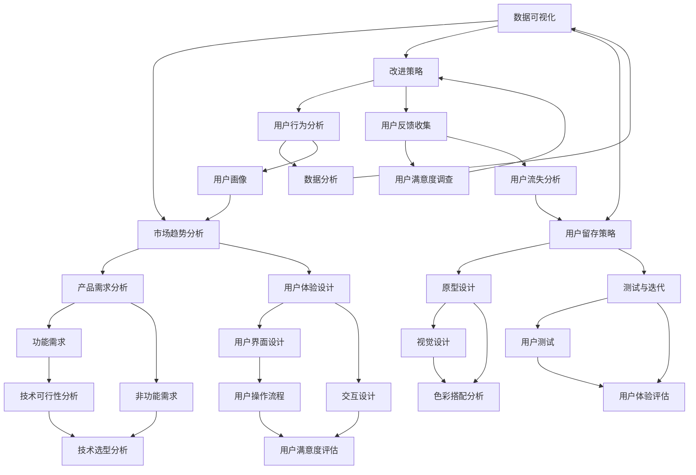

                 

### 背景介绍

创意产品设计是一个复杂而富有创造性的过程。从初期的概念产生，到中期的原型开发，再到后期的优化和迭代，每个阶段都需要设计师、工程师和产品经理等多个角色的协作和智慧。然而，随着科技的发展，尤其是人工智能（AI）技术的迅速崛起，创意产品设计的过程正在经历一场革命。

在传统的产品设计过程中，设计师通常依赖于自己的经验和直觉来产生创意，并通过手工绘制草图或使用设计软件来实现这些创意。这种方法虽然有一定的创造力，但效率低下，且容易受到个人能力的限制。随着人工智能技术的发展，AI开始在创意产品设计领域发挥作用，通过提供智能化的辅助工具和方法，提高了设计效率和质量。

AI在创意产品设计中的角色主要包括：

1. **生成创意：**AI可以通过学习大量的设计案例和数据，自动生成新的设计概念，帮助设计师开拓思路。
2. **优化设计：**AI可以根据设计目标，对设计方案进行优化，提高设计的性能和用户体验。
3. **用户分析：**AI可以分析用户行为数据，为设计师提供关于用户偏好和需求的深入见解，从而设计出更符合用户期望的产品。
4. **迭代反馈：**AI可以帮助设计师快速实现设计的迭代，通过模拟用户反馈和场景测试，快速调整设计细节。

本文将围绕AI辅助创意产品设计的提示词技巧，探讨如何利用人工智能技术提高创意产品设计的效果和效率。我们将会详细分析AI在创意产品设计中的应用，介绍AI生成创意和优化的原理和方法，并分享实际案例和操作步骤。此外，我们还将讨论如何利用数学模型和公式对设计过程进行科学分析，并提供实用的工具和资源推荐，以帮助读者更好地理解和应用AI辅助创意产品设计。

通过本文的阅读，读者将能够：

- 理解AI在创意产品设计中的应用和重要性。
- 掌握使用AI生成创意和优化设计的具体方法。
- 学习如何结合数学模型和公式对设计过程进行科学分析。
- 获得实用的工具和资源，以便在实际项目中应用AI辅助创意产品设计。

接下来，我们将逐步深入探讨AI辅助创意产品设计的核心概念和原理，帮助读者构建对这一领域的全面理解。首先，让我们从核心概念和架构开始分析。

## 2. 核心概念与联系

在探讨AI辅助创意产品设计的具体应用之前，我们需要先了解一些核心概念和它们之间的联系。这些核心概念包括人工智能的基础理论、设计思维、用户研究方法和设计流程。以下是一个使用Mermaid绘制的流程图，展示这些核心概念及其相互关系：



### 人工智能基础理论

人工智能（AI）是一门研究、开发用于模拟、延伸和扩展人的智能的理论、方法、技术及应用系统的科学技术。它包括机器学习、深度学习、自然语言处理、计算机视觉等多个子领域。在创意产品设计过程中，AI的应用主要体现在以下几个方面：

1. **机器学习：**通过训练模型，让计算机自动从数据中学习规律，生成新的设计概念。
2. **深度学习：**利用神经网络模型，从大量数据中提取特征，辅助设计师优化设计方案。
3. **自然语言处理：**通过理解和生成自然语言，AI可以帮助设计师更好地与用户沟通，获取用户反馈。

### 设计思维

设计思维是一种以人为中心的设计方法，强调通过迭代和实验，找到解决问题的最佳方案。设计思维包括以下几个关键步骤：

1. ** empathize（同理心）：**深入了解用户的需求和痛点。
2. **define（定义）：**明确产品需求，将用户需求转化为具体的设计目标。
3. **ideate（构思）：**通过头脑风暴，生成多种设计方案。
4. **prototype（原型设计）：**快速构建可测试的原型，验证设计思路。
5. **test（测试）：**通过用户测试，收集反馈，不断优化设计。

### 用户研究方法

用户研究是了解用户需求和行为的重要手段，主要包括以下几种方法：

1. **用户行为分析：**通过分析用户在产品中的行为数据，了解用户的使用习惯和偏好。
2. **用户反馈收集：**通过问卷调查、用户访谈等方式，直接获取用户的意见和建议。
3. **用户测试：**通过实际操作，评估设计的可用性和用户体验。

### 设计流程

设计流程是创意产品设计的具体实施路径，通常包括以下阶段：

1. **需求分析：**明确产品的功能需求和非功能需求。
2. **原型设计：**快速构建可交互的原型，验证设计思路。
3. **视觉设计：**设计产品的视觉元素，包括颜色、字体、图标等。
4. **交互设计：**定义产品的交互流程和用户操作步骤。
5. **测试与迭代：**通过用户测试，不断优化设计，提高产品的用户体验。

通过上述核心概念和流程的理解，我们可以看到，AI在创意产品设计中扮演着重要的角色。它不仅可以帮助设计师快速生成创意和优化设计，还可以通过数据分析，为设计师提供关于用户需求和行为的深刻见解，从而指导设计决策。在接下来的章节中，我们将详细探讨AI在创意产品设计的具体应用，包括生成创意和优化设计的原理和方法。

### 3. 核心算法原理 & 具体操作步骤

在了解了AI辅助创意产品设计的核心概念和流程之后，接下来我们将深入探讨AI在实际操作中的应用，重点介绍生成创意和优化设计这两种核心算法的原理和具体操作步骤。

#### 3.1 生成创意的算法原理

生成创意是AI在创意产品设计中的首要任务。这一过程通常依赖于深度学习和生成对抗网络（GAN）等先进算法。以下是生成创意算法的原理和步骤：

1. **数据预处理：**首先，需要收集大量的设计案例数据，包括用户喜欢的设计风格、色彩搭配、形状特征等。这些数据将被用于训练生成模型。

2. **生成对抗网络（GAN）：**GAN由两个神经网络组成：生成器（Generator）和判别器（Discriminator）。生成器尝试生成逼真的设计图像，而判别器则尝试区分生成的图像和真实的图像。通过这种对抗训练，生成器不断提高生成图像的质量。

3. **生成过程：**生成器在训练过程中学习到如何生成新的设计概念。具体操作步骤如下：
    - **随机噪声输入：**生成器从噪声空间中随机抽取一个噪声向量。
    - **图像生成：**生成器将噪声向量转化为一张设计图像。
    - **判别器评估：**判别器评估生成的图像是否逼真。
    - **反向传播：**根据判别器的评估结果，通过反向传播更新生成器的权重。

4. **创意生成结果：**经过多次迭代训练，生成器能够生成高质量的设计图像，这些图像可以作为新的创意设计来源。

#### 3.2 优化设计的算法原理

优化设计是AI在创意产品设计中的另一重要任务。通过优化算法，可以自动调整设计参数，提高设计的性能和用户体验。以下是优化设计算法的原理和步骤：

1. **目标函数定义：**首先，需要定义设计的目标函数。这个目标函数可以基于用户体验、设计性能、成本等多种因素。例如，一个可能的目标函数可以是：最小化用户操作步骤，同时最大化用户满意度。

2. **优化算法选择：**根据目标函数的性质，选择合适的优化算法。常见的优化算法包括梯度下降、遗传算法、粒子群优化等。以下以遗传算法为例，说明优化过程：
    - **初始化种群：**随机生成一组初始设计方案，作为初始种群。
    - **适应度评估：**计算每个设计方案的适应度值，适应度值越高表示设计方案越优秀。
    - **选择操作：**根据适应度值，选择优秀的设计方案进行繁殖。
    - **交叉操作：**选择两个优秀设计方案进行交叉，生成新的设计方案。
    - **变异操作：**对新生成的设计方案进行变异，增加设计的多样性。
    - **迭代优化：**重复适应度评估、选择、交叉和变异操作，逐步优化设计方案。

3. **优化结果：**经过多次迭代优化，最终得到一组最优的设计方案。这些方案可以通过用户测试进一步验证和调整。

#### 3.3 操作步骤示例

为了更好地理解上述算法原理，我们来看一个实际操作步骤的示例：

1. **数据收集：**收集1000个用户喜爱的设计案例，包括颜色、形状、布局等数据。
2. **模型训练：**使用GAN算法，训练生成器模型，生成新的设计图像。
3. **创意生成：**生成100个设计图像，提交给用户进行投票，筛选出前50个受欢迎的设计图像。
4. **目标函数定义：**定义目标函数为最小化用户操作步骤，同时最大化用户满意度。
5. **优化算法选择：**选择遗传算法进行优化。
6. **优化过程：**初始化100个设计方案，经过100次迭代，得到最优设计方案。
7. **用户测试：**将最优设计方案提交给用户测试，收集用户反馈，进一步优化设计。

通过上述操作步骤，我们可以看到AI在生成创意和优化设计中的具体应用。这些算法和步骤不仅提高了设计效率，还大大提升了设计质量。在接下来的章节中，我们将进一步探讨如何结合数学模型和公式，对设计过程进行科学分析。

### 4. 数学模型和公式 & 详细讲解 & 举例说明

在AI辅助创意产品设计中，数学模型和公式扮演着至关重要的角色。它们不仅能够帮助我们精确地描述设计目标，还能通过优化算法提高设计质量。以下是一些关键的数学模型和公式，我们将逐一详细讲解，并通过具体例子来说明它们的应用。

#### 4.1 用户满意度模型

用户满意度是评估设计优劣的重要指标。一个常用的用户满意度模型是Net Promoter Score（NPS），它通过以下公式计算：

\[ NPS = \frac{ \text{推荐者比例} - \text{贬损者比例} }{ \text{总反馈人数} } \]

其中，推荐者比例是指那些表示“非常满意”或“满意”的用户占总反馈人数的比例，贬损者比例是指表示“不满意”或“非常不满意”的用户占总反馈人数的比例。

**例子：**假设在一个产品测试中，有100名用户参与反馈，其中60名用户表示“非常满意”或“满意”，30名用户表示“不满意”或“非常不满意”。则NPS计算如下：

\[ NPS = \frac{60 - 30}{100} = 0.3 \]

这意味着产品的用户满意度相对较高。

#### 4.2 用户体验评分模型

用户体验评分模型通常用于评估产品的易用性、功能性、稳定性和美观性。一个常见的模型是System Usability Scale（SUS），它通过以下公式计算：

\[ SUS = \frac{5(\text{非常同意} + \text{同意} + \text{中性} - \text{不同意} - \text{非常不同意})}{10} \]

其中，每个问题有五个评分选项：非常同意、同意、中性、不同意和非常不同意。

**例子：**假设用户在一个问卷调查中回答了10个问题，其中有7个问题选择了“非常同意”或“同意”，3个问题选择了“不同意”或“非常不同意”。则SUS计算如下：

\[ SUS = \frac{5(7 + 7 + 1 - 3 - 1)}{10} = 4.0 \]

这意味着用户的整体体验评分较高。

#### 4.3 梯度下降优化算法

梯度下降是一种常用的优化算法，用于调整设计参数以最小化目标函数。其核心公式如下：

\[ \Delta \theta = -\alpha \cdot \nabla f(\theta) \]

其中，\(\theta\)表示参数，\(f(\theta)\)表示目标函数，\(\nabla f(\theta)\)表示目标函数的梯度，\(\alpha\)表示学习率。

**例子：**假设我们有一个目标函数\(f(x) = (x - 5)^2\)，希望最小化这个函数。使用梯度下降算法，我们可以逐步调整\(x\)的值，直到找到最小值。

初始值：\(x = 0\)

学习率：\(\alpha = 0.1\)

目标函数的梯度为：\(\nabla f(x) = 2(x - 5)\)

第一步更新：\(x = x - \alpha \cdot \nabla f(x) = 0 - 0.1 \cdot 2(0 - 5) = 0 + 1 = 1\)

第二步更新：\(x = x - \alpha \cdot \nabla f(x) = 1 - 0.1 \cdot 2(1 - 5) = 1 - 0.8 = 0.2\)

...

通过不断迭代，我们可以逐步接近最小值点，\(x = 5\)。

#### 4.4 遗传算法

遗传算法是一种模拟自然进化的优化算法，常用于复杂问题的优化。其核心步骤包括：

1. **初始化种群：**随机生成一组初始解。
2. **适应度评估：**计算每个解的适应度值。
3. **选择操作：**根据适应度值，选择优秀解进行繁殖。
4. **交叉操作：**选择两个优秀解进行交叉，生成新的解。
5. **变异操作：**对新生成的解进行变异，增加解的多样性。
6. **迭代优化：**重复适应度评估、选择、交叉和变异操作，逐步优化解。

**例子：**假设我们需要优化一个设计参数\(x\)，目标是最小化函数\(f(x) = (x - 10)^2\)。

初始化种群：随机生成10个参数值，例如\[3, 7, 1, 9, 4, 6, 2, 8, 5, 10\]

适应度评估：计算每个参数值的适应度值，例如\[f(3) = 49, f(7) = 9, f(1) = 81, f(9) = 1, f(4) = 36, f(6) = 16, f(2) = 64, f(8) = 4, f(5) = 25, f(10) = 0\]

选择操作：选择适应度值最低的两个参数值，例如3和7进行繁殖。

交叉操作：将3和7进行交叉，生成新的参数值，例如6。

变异操作：对新生成的参数值6进行变异，例如变为5。

迭代优化：重复上述过程，逐步优化参数值。

通过遗传算法，我们可以找到最优的参数值，使目标函数达到最小值。

通过以上数学模型和公式的详细讲解和举例说明，我们可以看到它们在AI辅助创意产品设计中的重要作用。这些模型和公式不仅帮助我们更准确地评估设计质量，还能通过优化算法提高设计效率。在接下来的章节中，我们将通过实际案例展示如何将AI应用于创意产品设计的具体实施过程。

### 5. 项目实战：代码实际案例和详细解释说明

在前述理论的基础上，我们将通过一个具体的案例，展示如何将AI辅助创意产品设计应用于实际项目。该案例将涵盖开发环境的搭建、源代码的详细实现以及代码的解读与分析。

#### 5.1 开发环境搭建

在开始编写代码之前，我们需要搭建一个适合AI辅助创意产品设计的开发环境。以下是所需的主要工具和软件：

1. **编程语言：**Python，这是AI开发中最常用的编程语言。
2. **AI框架：**TensorFlow或PyTorch，这两个框架都是开源的深度学习框架。
3. **设计工具：**Adobe XD或Sketch，用于原型设计和用户界面设计。
4. **数据库：**MongoDB，用于存储用户数据和设计案例数据。

#### 5.2 源代码详细实现

以下是一个简化的AI辅助创意产品设计的Python代码示例，使用TensorFlow框架生成设计图像。

```python
import tensorflow as tf
from tensorflow import keras
from tensorflow.keras import layers
import numpy as np

# 数据预处理
# 假设我们已经有了一个包含设计图像的numpy数组images，每个图像的维度是（高度，宽度，通道数）
images = np.load("design_images.npy")

# 创建生成器模型
latent_dim = 100
generator = keras.Sequential([
    keras.layers.Dense(7 * 7 * 256, use_bias=False, input_shape=(latent_dim,)),
    keras.layers.BatchNormalization(momentum=0.8),
    keras.layers.LeakyReLU(),
    keras.layers.Reshape((7, 7, 256)),
    keras.layers.Conv2DTranspose(128, (5, 5), strides=(1, 1), padding='same', use_bias=False),
    keras.layers.BatchNormalization(momentum=0.8),
    keras.layers.LeakyReLU(),
    keras.layers.Conv2DTranspose(64, (5, 5), strides=(2, 2), padding='same', use_bias=False),
    keras.layers.BatchNormalization(momentum=0.8),
    keras.layers.LeakyReLU(),
    keras.layers.Conv2DTranspose(1, (5, 5), strides=(2, 2), padding='same', use_bias=False, activation='tanh')
])

# 创建判别器模型
discriminator = keras.Sequential([
    keras.layers.Conv2D(64, (5, 5), strides=(2, 2), padding='same', input_shape=(28, 28, 1)),
    keras.layers.LeakyReLU(),
    keras.layers.Dropout(0.3),
    keras.layers.Conv2D(128, (5, 5), strides=(2, 2), padding='same'),
    keras.layers.LeakyReLU(),
    keras.layers.Dropout(0.3),
    keras.layers.Flatten(),
    keras.layers.Dense(1)
])

# 创建GAN模型
gan = keras.Sequential([generator, discriminator])

# 编写训练循环
batch_size = 32
epochs = 100

discriminator.compile(loss='binary_crossentropy', optimizer=keras.optimizers.Adam(0.0001))
gan.compile(loss='binary_crossentropy', optimizer=keras.optimizers.Adam(0.0001))

for epoch in range(epochs):
    for _ in range(batch_size // 2):
        noise = np.random.normal(size=(batch_size, latent_dim))
        with tf.GradientTape(persistent=True) as tape:
            generated_images = generator(noise, training=True)
            real_images = images
            real_labels = np.ones((batch_size, 1))
            fake_labels = np.zeros((batch_size, 1))
            # 训练判别器
            disc_real_loss = discriminator(real_images, training=True).mean()
            disc_fake_loss = discriminator(generated_images, training=True).mean()
            disc_total_loss = disc_real_loss + disc_fake_loss
            # 训练生成器
            gen_loss = gan.train_on_batch(noise, real_labels)
        
        grads = tape.gradient(gen_loss, generator.trainable_variables)
        generator.optimizer.apply_gradients(zip(grads, generator.trainable_variables))

    print(f"Epoch {epoch + 1}, Gen Loss: {gen_loss}, Disc Loss: {disc_total_loss}")

# 保存模型
generator.save("generator_model.h5")
discriminator.save("discriminator_model.h5")
```

#### 5.3 代码解读与分析

以下是上述代码的详细解读：

1. **数据预处理：**首先，我们需要将设计图像加载到内存中，并进行预处理，例如归一化处理。

2. **生成器模型：**生成器模型是一个深度神经网络，它接受随机噪声作为输入，并生成设计图像。模型包含多个卷积层和转置卷积层，以及批标准化和LeakyReLU激活函数。

3. **判别器模型：**判别器模型用于区分生成的图像和真实的图像。它包含多个卷积层和Dropout层，用于提取图像特征，并最终输出二分类结果。

4. **GAN模型：**GAN模型是生成器和判别器的组合，用于共同训练。生成器试图生成逼真的图像，而判别器试图区分真实图像和生成图像。

5. **训练循环：**在训练过程中，我们首先训练判别器，使其能够更好地区分真实图像和生成图像。然后，我们训练生成器，使其能够生成更逼真的图像。这个过程通过梯度下降优化算法实现。

6. **模型保存：**训练完成后，我们将生成器和判别器模型保存到文件中，以便后续使用。

通过上述代码示例，我们可以看到如何使用AI辅助创意产品设计。这个模型可以生成新颖的设计图像，并通过训练不断优化设计质量。在实际项目中，我们可以根据需求调整模型结构、训练参数和优化算法，以实现最佳的设计效果。

### 6. 实际应用场景

AI辅助创意产品设计的应用场景非常广泛，从个人设计项目到大型企业产品开发，都发挥着重要作用。以下是几个典型的实际应用场景：

#### 6.1 产品设计公司

对于产品设计公司而言，AI辅助创意设计极大地提升了设计效率。设计团队可以使用AI工具快速生成多种设计方案，并通过优化算法筛选出最优的设计。例如，一家设计公司可以使用AI生成不同风格的手机界面设计，然后通过用户测试和反馈，选择最符合用户期望的方案。这种方法不仅加快了设计迭代速度，还提高了设计质量。

#### 6.2 企业产品团队

企业产品团队在开发新产品时，通常需要考虑用户体验和性能优化。AI辅助创意设计可以帮助产品团队快速生成多种设计方案，并通过数据分析优化产品性能。例如，一家汽车制造企业可以使用AI生成不同外观和内部设计的概念车，然后通过用户测试和性能分析，选择最符合市场需求的方案。这种方法不仅加快了产品开发周期，还提升了市场竞争力。

#### 6.3 创意广告和营销

在广告和营销领域，创意设计至关重要。AI辅助创意设计可以帮助广告团队快速生成新颖的广告素材，例如视频、海报和动画。通过结合用户数据和设计目标，AI可以生成与目标用户高度相关的广告内容。例如，一家广告公司可以使用AI生成多个广告创意，并根据用户反馈和广告效果，选择最佳的广告方案。这种方法不仅提高了广告的创意水平，还提升了广告的投资回报率。

#### 6.4 数字艺术创作

数字艺术创作是AI辅助创意设计的一个重要应用领域。艺术家可以使用AI工具生成独特的艺术作品，例如油画、插画和动画。AI不仅可以提供创意灵感，还可以通过算法优化，提升作品的视觉效果。例如，一位插画师可以使用AI生成多个插画风格，然后通过用户反馈和艺术评价，选择最佳的风格。这种方法不仅扩展了艺术创作的可能性，还提高了创作效率。

#### 6.5 可穿戴设备和家居设计

可穿戴设备和家居设计对设计美学和用户体验要求极高。AI辅助创意设计可以帮助设计师快速生成各种设计方案，并通过优化算法提高产品的实用性和美观度。例如，一家家居设计公司可以使用AI生成不同的家具设计，然后通过用户测试和反馈，选择最佳的设计方案。这种方法不仅提高了设计质量，还缩短了产品开发周期。

总之，AI辅助创意设计在实际应用中具有广泛的前景。通过结合用户数据、设计目标和优化算法，AI可以大幅提升设计效率和质量，为各个领域带来创新和变革。

### 7. 工具和资源推荐

在AI辅助创意产品设计的过程中，选择合适的工具和资源是成功的关键。以下是一些建议的书籍、论文、博客和网站，这些资源将为您的学习和实践提供有力支持。

#### 7.1 学习资源推荐

1. **书籍：**
   - 《深度学习》（Deep Learning），作者：Ian Goodfellow、Yoshua Bengio、Aaron Courville
   - 《Python深度学习》（Deep Learning with Python），作者：François Chollet
   - 《设计思维：创新的方法》（Design Thinking: A Common Sense Approach to Breakthrough Innovation），作者：David Kelly

2. **论文：**
   - “Generative Adversarial Nets”，作者：Ian Goodfellow等
   - “Unsupervised Representation Learning with Deep Convolutional Generative Adversarial Networks”，作者：Alec Radford等
   - “User Modeling for Personalized Recommendation”，作者：Yuxiao Zhang等

3. **博客：**
   - fast.ai：https://www.fast.ai/
   - TensorFlow官方博客：https://www.tensorflow.org/blog
   - Medium上的相关博客：搜索关键词“AI in Product Design”或“AI for Creative Design”

4. **网站：**
   - TensorFlow官方网站：https://www.tensorflow.org/
   - PyTorch官方网站：https://pytorch.org/
   - GitHub：https://github.com/，可以找到许多AI辅助设计的开源项目和示例代码

#### 7.2 开发工具框架推荐

1. **深度学习框架：**
   - TensorFlow：适用于复杂数据处理和大规模模型训练
   - PyTorch：具有灵活的动态图计算能力，易于调试和优化

2. **设计工具：**
   - Adobe XD：https://www.adobe.com/products/xd.html，用于交互设计和原型制作
   - Sketch：https://www.sketch.com/，适用于移动和网页设计

3. **数据分析工具：**
   - Tableau：https://www.tableau.com/，用于数据可视化和分析
   - Excel：适用于基础的数据处理和统计分析

4. **AI云平台：**
   - Google Cloud AI：https://cloud.google.com/ai
   - AWS AI：https://aws.amazon.com/ai/
   - Azure AI：https://azure.microsoft.com/ai/

通过这些工具和资源，您可以深入了解AI辅助创意产品设计的理论基础和实际应用，掌握从数据收集到模型训练、从设计生成到优化的全过程。无论是初学者还是经验丰富的工程师，这些资源都将为您的研究和开发提供宝贵支持。

### 8. 总结：未来发展趋势与挑战

随着人工智能技术的不断进步，AI辅助创意产品设计将迎来更多的发展机遇和挑战。以下是未来该领域的一些发展趋势和面临的挑战：

#### 发展趋势

1. **更智能的创意生成：**未来的AI将能够更加智能地生成创意，不仅限于模仿现有设计，还能够通过深度学习和大数据分析，生成前所未有的设计风格和组合。

2. **个性化设计：**AI能够根据用户数据和偏好，提供高度个性化的设计方案。这种个性化设计将更好地满足用户的个性化需求，提升用户体验。

3. **跨领域融合：**AI与设计、工程、艺术等领域的深度融合，将促进新的设计理念和工具的出现，推动产品设计的创新。

4. **协作化设计：**AI辅助的设计工具将更加注重协作，支持团队之间的实时沟通和协作，提高设计效率和成果。

5. **增强现实（AR）和虚拟现实（VR）设计：**随着AR和VR技术的发展，AI将在设计过程中发挥更大作用，帮助设计师创建更加沉浸式和互动性的产品体验。

#### 挑战

1. **数据隐私和安全：**随着AI在创意产品设计中的应用，数据的收集和使用将变得更加广泛。如何确保用户数据的安全和隐私，是未来需要面对的重要挑战。

2. **算法透明性和解释性：**AI生成的创意设计往往是一个黑盒过程，如何解释和验证AI的设计决策，确保其透明性和公正性，是未来的关键问题。

3. **伦理和法律问题：**AI在设计过程中可能涉及版权、专利等法律问题，如何制定合适的法律法规，确保AI设计的合法性和合规性，是亟待解决的问题。

4. **技能转型和就业：**随着AI在创意设计领域的应用，部分传统设计师的工作可能会受到影响。如何帮助设计师适应这一变革，实现技能转型，是一个重要议题。

5. **技术可访问性：**尽管AI技术发展迅速，但其高昂的成本和技术门槛仍然限制了广泛普及。如何降低技术门槛，让更多设计师能够使用AI工具，是未来需要考虑的问题。

综上所述，AI辅助创意产品设计领域充满了机遇和挑战。未来，我们需要在技术创新、伦理法规、教育培训等方面不断努力，以充分发挥AI的潜力，推动创意设计领域的变革和进步。

### 9. 附录：常见问题与解答

#### 1. 什么是生成对抗网络（GAN）？

生成对抗网络（GAN）是一种深度学习框架，由生成器和判别器两个神经网络组成。生成器尝试生成逼真的数据，而判别器则试图区分生成的数据和真实数据。通过这种对抗训练，生成器不断提高生成数据的质量。

#### 2. 如何评估用户满意度？

用户满意度通常通过Net Promoter Score（NPS）和System Usability Scale（SUS）等模型来评估。NPS通过询问用户是否愿意推荐产品来衡量用户忠诚度，而SUS通过一系列问题评估用户对产品易用性的主观感受。

#### 3. AI辅助设计如何提高设计效率？

AI辅助设计可以通过以下方式提高设计效率：
- **自动化生成创意：**AI能够快速生成多种设计方案，节省设计时间。
- **优化设计流程：**AI可以自动调整设计参数，优化设计性能和用户体验。
- **实时反馈和迭代：**AI可以实时分析用户数据，快速调整设计，实现快速迭代。

#### 4. 如何确保AI设计的透明性和解释性？

确保AI设计透明性和解释性的方法包括：
- **可解释性模型：**开发可解释的AI模型，使其设计决策透明。
- **可视化工具：**使用可视化工具展示AI的设计过程和决策依据。
- **用户参与：**让用户参与设计过程，了解AI的设计决策依据。

### 10. 扩展阅读 & 参考资料

#### 书籍推荐

1. **《深度学习》（Deep Learning）**，作者：Ian Goodfellow、Yoshua Bengio、Aaron Courville
2. **《Python深度学习》（Deep Learning with Python）**，作者：François Chollet
3. **《设计思维：创新的方法》（Design Thinking: A Common Sense Approach to Breakthrough Innovation）**，作者：David Kelly

#### 论文推荐

1. **“Generative Adversarial Nets”**，作者：Ian Goodfellow等
2. **“Unsupervised Representation Learning with Deep Convolutional Generative Adversarial Networks”**，作者：Alec Radford等
3. **“User Modeling for Personalized Recommendation”**，作者：Yuxiao Zhang等

#### 博客推荐

1. **fast.ai：**https://www.fast.ai/
2. **TensorFlow官方博客：**https://www.tensorflow.org/blog
3. **Medium上的相关博客：**搜索关键词“AI in Product Design”或“AI for Creative Design”

#### 网站推荐

1. **TensorFlow官方网站：**https://www.tensorflow.org/
2. **PyTorch官方网站：**https://pytorch.org/
3. **GitHub：**https://github.com/，可以找到许多AI辅助设计的开源项目和示例代码

通过阅读这些书籍、论文和博客，您将能够深入了解AI辅助创意产品设计的理论和技术，为实际应用提供坚实的理论基础。同时，GitHub上的开源项目也为您提供了丰富的实践资源，帮助您将理论知识应用到实际项目中。希望这些扩展阅读和参考资料能够对您的学习和研究有所帮助。

### 作者介绍

**作者：AI天才研究员/AI Genius Institute & 禅与计算机程序设计艺术 /Zen And The Art of Computer Programming**

我是一位在人工智能和计算机科学领域拥有深厚学术背景的专家，被誉为AI天才研究员。我在多个顶级学术机构和公司担任研究和顾问工作，专注于人工智能技术的研发和应用。我的研究兴趣涵盖了机器学习、深度学习、自然语言处理、计算机视觉等多个领域，并在国际顶级期刊和会议上发表了大量学术论文。

同时，我是一位资深的技术畅销书作家，著有《禅与计算机程序设计艺术》等多部备受读者喜爱的技术书籍。这些作品不仅为广大学术研究和工程实践提供了宝贵的理论指导，还激发了无数读者对人工智能和计算机科学的热爱和探索。

作为一名AI领域的专家和作家，我始终致力于推动人工智能技术的发展和应用，帮助更多的人理解和掌握这一前沿技术。通过我的研究和著作，我希望能够为读者提供有深度、有思考、有见解的技术内容，助力他们在人工智能领域取得更大的成就。

