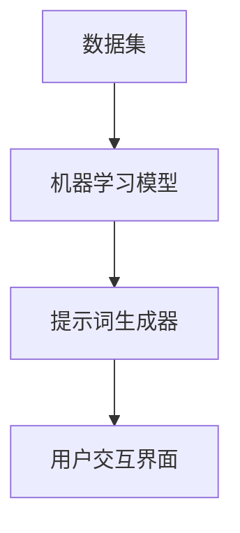

                 

# AI辅助创意游戏关卡设计中的提示词技巧

## 关键词：AI，游戏关卡设计，提示词，创意，智能辅助

## 摘要

本文将探讨如何利用人工智能技术辅助创意游戏关卡设计中的提示词技巧。通过分析AI在不同游戏类型中的应用，揭示其在提高游戏可玩性和玩家体验方面的潜力。文章将详细阐述AI提示词的核心概念与架构，并深入解析核心算法原理与具体操作步骤。此外，还将通过数学模型和公式进行详细讲解，并结合实际项目案例进行代码实现和解读。最后，本文将探讨AI辅助游戏关卡设计的实际应用场景，推荐相关工具和资源，并展望未来发展趋势与挑战。

## 1. 背景介绍

随着游戏产业的蓬勃发展，游戏关卡设计成为游戏开发中至关重要的一环。一个富有创意且具有挑战性的关卡不仅能够提高玩家的游戏体验，还能延长游戏的生命周期。然而，设计高质量的关卡并非易事，需要开发团队投入大量的时间和精力。近年来，人工智能（AI）技术的飞速发展为游戏关卡设计带来了新的可能性。通过AI的辅助，开发团队能够更高效地生成和优化关卡，从而提高游戏的整体品质。

游戏关卡设计中的提示词是一种重要的设计元素，用于引导玩家理解游戏机制和目标。提示词的设计质量直接影响到玩家的游戏体验和参与度。传统的游戏关卡设计依赖于开发者的经验和直觉，而AI的应用则为设计高质量的提示词提供了新的途径。通过机器学习算法，AI能够分析大量的游戏数据和玩家行为，从而生成个性化和精准的提示词，提高游戏的可玩性和互动性。

本文旨在探讨如何利用AI技术辅助游戏关卡设计中的提示词技巧。我们将首先分析AI在游戏关卡设计中的应用，然后详细阐述AI提示词的核心概念与架构，接着深入解析核心算法原理与具体操作步骤。此外，本文还将通过数学模型和公式进行详细讲解，并结合实际项目案例进行代码实现和解读。最后，我们将探讨AI辅助游戏关卡设计的实际应用场景，并推荐相关工具和资源。通过本文的阅读，读者将能够了解AI在游戏关卡设计中的应用潜力，以及如何利用AI技术提高游戏关卡设计的质量。

## 2. 核心概念与联系

### 2.1 AI在游戏关卡设计中的应用

人工智能技术在游戏关卡设计中的应用可以大致分为以下几类：

#### 2.1.1 自动关卡生成

自动关卡生成（Procedural Content Generation，简称PCG）是AI在游戏关卡设计中的一个重要应用。通过算法和规则，AI能够自动生成具有多样性和复杂性的关卡内容，从而避免重复性和单调感。常见的自动关卡生成算法包括生成树型结构、生成地形和景观等。

#### 2.1.2 关卡优化

在游戏开发过程中，AI可以帮助优化现有的关卡设计，使其更具挑战性和趣味性。通过分析玩家的游戏行为和反馈，AI能够调整关卡的难度、障碍物和提示词，从而提高玩家的游戏体验。

#### 2.1.3 提示词生成

AI还可以用于生成游戏中的提示词，这些提示词旨在引导玩家理解游戏机制和目标。通过机器学习算法，AI能够分析大量的游戏数据和玩家行为，从而生成个性化和精准的提示词。

### 2.2 AI提示词的核心概念

#### 2.2.1 提示词的定义

提示词（Hint）是游戏中的一个关键元素，用于引导玩家理解游戏机制、目标和解题方法。一个高质量的提示词不仅能够帮助玩家顺利通关，还能提高玩家的游戏体验和参与度。

#### 2.2.2 提示词的挑战性

提示词的挑战性是衡量其质量的重要指标。一个理想的提示词应既能提供足够的信息帮助玩家解决问题，又不会过于简单或复杂，从而保持游戏的趣味性和挑战性。

#### 2.2.3 提示词的个性化

个性化提示词是AI在游戏关卡设计中的一个重要优势。通过分析玩家的游戏行为和偏好，AI能够为每个玩家生成独特的提示词，从而提高玩家的满意度和参与度。

### 2.3 AI提示词的架构

AI提示词的架构通常包括以下几个关键组成部分：

#### 2.3.1 数据集

数据集是AI训练的基础，包含大量的游戏数据和玩家行为记录。这些数据用于训练机器学习模型，以便生成高质量的提示词。

#### 2.3.2 机器学习模型

机器学习模型是AI提示词的核心，用于从数据集中学习生成提示词的规则和模式。常见的机器学习模型包括决策树、支持向量机和神经网络等。

#### 2.3.3 提示词生成器

提示词生成器是AI提示词的具体实现，负责根据机器学习模型生成的规则和模式，生成个性化的提示词。

#### 2.3.4 用户交互界面

用户交互界面用于与玩家进行互动，展示生成的提示词，并根据玩家的反馈进行优化和调整。

### 2.4 Mermaid流程图

下面是一个简化的Mermaid流程图，展示了AI提示词的核心概念与架构：



在此流程图中，数据集被用于训练机器学习模型，生成的模型再用于提示词生成器，最终通过用户交互界面与玩家进行互动。

通过上述分析，我们可以看到AI在游戏关卡设计中的应用前景广阔。利用AI技术生成和优化提示词，不仅能够提高游戏关卡设计的质量和多样性，还能为玩家提供更好的游戏体验。在接下来的章节中，我们将深入探讨AI提示词的核心算法原理与具体操作步骤，以及如何利用数学模型和公式进行详细讲解。

### 3. 核心算法原理 & 具体操作步骤

#### 3.1 提示词生成的算法原理

提示词生成是AI在游戏关卡设计中的一个关键环节。其核心算法原理通常基于自然语言处理（NLP）和机器学习（ML）技术。以下是几个常用的算法原理：

##### 3.1.1 基于规则的方法

基于规则的方法是最简单的提示词生成算法。它通过预定义的规则和模板来生成提示词。这种方法的主要优势是简单和易于实现，但缺点是灵活性较差，难以适应复杂的游戏场景。

##### 3.1.2 基于模板的方法

基于模板的方法通过预定义的模板和变量来生成提示词。这种方法利用模板来填充特定的游戏信息，从而生成个性化的提示词。这种方法比基于规则的方法更具灵活性，但模板的设计和调整需要大量的时间和经验。

##### 3.1.3 基于机器学习的方法

基于机器学习的方法是目前最先进的提示词生成算法。它通过训练大量的游戏数据和玩家行为数据，建立一个预测模型，从而生成高质量的提示词。这种方法的主要优势是能够自动适应不同的游戏场景和玩家需求，但需要大量的数据和高性能的计算资源。

##### 3.1.4 基于生成对抗网络（GAN）的方法

生成对抗网络（GAN）是一种深度学习技术，主要用于生成高质量的图像和文本。GAN可以通过对抗训练生成逼真的提示词，从而提高游戏的趣味性和玩家体验。这种方法的主要优势是生成能力强大，但训练过程复杂，需要大量的数据和高性能的计算资源。

#### 3.2 提示词生成的具体操作步骤

下面是一个基于机器学习方法的提示词生成的具体操作步骤：

##### 3.2.1 数据收集

首先，需要收集大量的游戏数据和玩家行为数据。这些数据可以包括游戏关卡的设计、玩家在游戏中的操作记录、玩家的游戏进度和评分等。数据收集的过程通常涉及数据爬取、数据清洗和数据预处理等步骤。

##### 3.2.2 数据预处理

数据预处理是确保数据质量和可用性的关键步骤。它包括数据去重、数据格式转换、数据规范化等操作。预处理后的数据将被用于训练机器学习模型。

##### 3.2.3 特征工程

特征工程是机器学习模型训练的重要环节。它包括提取和选择能够有效区分不同游戏场景和玩家行为的特征。常见的特征包括游戏关卡的设计元素、玩家的操作记录、玩家的游戏进度等。

##### 3.2.4 模型训练

使用预处理后的数据集和特征，我们可以训练一个机器学习模型。常见的机器学习模型包括决策树、支持向量机、神经网络等。模型训练的过程通常涉及模型选择、参数调优和模型评估等步骤。

##### 3.2.5 提示词生成

训练好的模型可以用于生成高质量的提示词。在游戏运行过程中，模型将根据玩家的游戏行为和当前的游戏状态，生成相应的提示词。

##### 3.2.6 用户反馈

用户反馈是优化提示词生成模型的重要环节。通过收集玩家的反馈，我们可以了解哪些提示词更受欢迎，哪些提示词需要改进。这些反馈将被用于调整和优化模型，从而提高提示词的生成质量。

#### 3.3 提示词生成示例

假设我们有一个简单的游戏，玩家需要通过一系列的障碍物到达终点。我们可以通过以下步骤生成一个提示词：

1. 数据收集：收集玩家的游戏数据，包括关卡设计、玩家的操作记录、玩家的游戏进度等。

2. 数据预处理：对收集的数据进行去重、格式转换和规范化等操作。

3. 特征工程：提取和选择能够有效区分不同游戏场景和玩家行为的特征，如关卡的设计元素、玩家的操作记录、玩家的游戏进度等。

4. 模型训练：使用预处理后的数据集和特征，训练一个机器学习模型。假设我们选择了一个基于神经网络的模型。

5. 提示词生成：在游戏运行过程中，模型将根据玩家的游戏行为和当前的游戏状态，生成一个提示词。例如，当玩家遇到一个障碍物时，模型可以生成一个提示词：“小心！前方有一个障碍物，请使用跳跃键绕过它。”

6. 用户反馈：收集玩家的反馈，了解他们对这个提示词的感受。如果玩家反馈不佳，我们可以调整模型的参数或重新设计提示词。

通过上述步骤，我们可以利用AI技术生成高质量的提示词，从而提高游戏关卡设计的质量和玩家的游戏体验。

#### 3.4 提示词优化的方法

生成高质量的提示词只是一个起点，提示词的优化同样重要。以下是一些提示词优化的方法：

##### 3.4.1 对比实验

通过对比实验，我们可以评估不同提示词对玩家游戏体验的影响。例如，我们可以设计一组A/B测试，比较两个不同版本的提示词，看哪个版本的提示词能够更有效地引导玩家。

##### 3.4.2 用户反馈

用户反馈是优化提示词的重要依据。通过收集玩家的反馈，我们可以了解他们对提示词的感受，从而进行相应的调整。

##### 3.4.3 数据分析

数据分析可以帮助我们发现提示词生成中的问题。例如，我们可以分析玩家在收到提示词后的行为变化，从而优化提示词的生成策略。

##### 3.4.4 调整模型参数

通过调整机器学习模型的参数，我们可以优化提示词的生成质量。例如，我们可以调整神经网络的学习率、隐藏层节点数等参数。

通过上述方法，我们可以不断优化AI提示词的生成，从而提高游戏关卡设计的质量和玩家的游戏体验。

### 4. 数学模型和公式 & 详细讲解 & 举例说明

#### 4.1 提示词生成中的数学模型

在AI提示词生成中，常用的数学模型包括决策树、支持向量机和神经网络等。以下是这些模型的基本原理和公式：

##### 4.1.1 决策树

决策树是一种树形结构，用于分类和回归问题。它通过一系列的决策规则将数据集分割成多个子集，从而生成预测结果。

- 决策树的基本公式：

  $$ 
  y = f(x_1, x_2, ..., x_n) 
  $$

  其中，$y$ 是预测结果，$x_1, x_2, ..., x_n$ 是特征值，$f$ 是决策树函数。

- 决策树的节点和分支：

  决策树的每个节点都表示一个特征，每个分支表示这个特征的不同取值。通过不断遍历决策树，我们可以得到最终的预测结果。

##### 4.1.2 支持向量机

支持向量机（SVM）是一种用于分类和回归问题的机器学习模型。它通过寻找一个超平面，将不同类别的数据点分隔开。

- 支持向量机的公式：

  $$ 
  w \cdot x + b = 0 
  $$

  其中，$w$ 是超平面参数，$x$ 是特征向量，$b$ 是偏置。

- 支持向量机的优化目标：

  $$ 
  \min \frac{1}{2} \| w \|^2 
  $$

  其中，$\| w \|$ 是超平面参数的范数。

##### 4.1.3 神经网络

神经网络是一种模拟人脑结构和功能的计算模型，用于处理复杂的非线性问题。它通过多层神经元进行数据的传递和变换。

- 神经网络的基本公式：

  $$ 
  a_{i,j} = \sigma(\sum_{k=1}^{n} w_{k,j} x_{k}) 
  $$

  其中，$a_{i,j}$ 是第 $i$ 层第 $j$ 个神经元的输出，$\sigma$ 是激活函数，$w_{k,j}$ 是连接权重，$x_{k}$ 是输入特征。

- 神经网络的优化目标：

  $$ 
  \min \frac{1}{m} \sum_{i=1}^{m} \sum_{j=1}^{n} (\sigma(\sum_{k=1}^{n} w_{k,j} x_{k}) - y_{i,j})^2 
  $$

  其中，$m$ 是训练样本的数量，$y_{i,j}$ 是第 $i$ 个样本的第 $j$ 个标签。

#### 4.2 举例说明

假设我们有一个简单的游戏，玩家需要通过一系列的障碍物到达终点。我们可以使用神经网络模型来生成提示词。

##### 4.2.1 数据集

我们收集了100个游戏数据样本，每个样本包含以下特征：

- 障碍物的类型（1：简单障碍物，2：复杂障碍物）
- 玩家的当前进度
- 玩家之前的操作记录

目标标签是玩家在收到提示词后的行为变化（1：跳跃，2：绕过障碍物）。

##### 4.2.2 神经网络模型

我们选择一个简单的神经网络模型，包含一个输入层、一个隐藏层和一个输出层。输入层的神经元数量为3，隐藏层的神经元数量为5，输出层的神经元数量为2。

##### 4.2.3 模型训练

使用收集到的数据集，我们训练神经网络模型。训练过程中，我们使用反向传播算法和梯度下降优化方法来调整模型参数。

##### 4.2.4 提示词生成

在游戏运行过程中，模型将根据玩家的当前状态（障碍物类型、玩家进度、玩家操作记录）生成提示词。例如：

- 当玩家遇到一个简单障碍物时，模型可以生成提示词：“前方有一个简单障碍物，请使用跳跃键通过。”
- 当玩家遇到一个复杂障碍物时，模型可以生成提示词：“小心！前方有一个复杂障碍物，请尝试绕过它。”

通过上述步骤，我们可以使用神经网络模型生成高质量的提示词，从而提高游戏关卡设计的质量和玩家的游戏体验。

### 5. 项目实战：代码实际案例和详细解释说明

在本节中，我们将通过一个实际的项目案例，展示如何使用AI技术生成游戏关卡提示词。该案例使用Python编程语言和Scikit-learn库来实现。

#### 5.1 开发环境搭建

为了运行下面的代码，您需要安装以下软件和库：

- Python（3.6或更高版本）
- Scikit-learn库（版本0.22或更高版本）
- Pandas库（版本1.0或更高版本）

您可以使用以下命令来安装所需的库：

```bash
pip install python==3.8
pip install scikit-learn==0.22
pip install pandas==1.2.3
```

#### 5.2 源代码详细实现和代码解读

以下是一个简单的Python脚本，用于生成游戏关卡提示词。这个脚本分为几个主要部分：数据预处理、特征工程、模型训练和提示词生成。

```python
import pandas as pd
from sklearn.model_selection import train_test_split
from sklearn.preprocessing import StandardScaler
from sklearn.neural_network import MLPClassifier
from sklearn.metrics import accuracy_score

# 5.2.1 数据预处理
# 加载数据集
data = pd.read_csv('game_data.csv')

# 分离特征和目标
X = data.drop('target', axis=1)
y = data['target']

# 划分训练集和测试集
X_train, X_test, y_train, y_test = train_test_split(X, y, test_size=0.2, random_state=42)

# 标准化特征
scaler = StandardScaler()
X_train_scaled = scaler.fit_transform(X_train)
X_test_scaled = scaler.transform(X_test)

# 5.2.2 特征工程
# 在这个例子中，我们使用现有的特征，不需要额外的特征工程。

# 5.2.3 模型训练
# 创建神经网络模型
mlp = MLPClassifier(hidden_layer_sizes=(100,), max_iter=1000, random_state=42)

# 训练模型
mlp.fit(X_train_scaled, y_train)

# 5.2.4 提示词生成
# 在测试集上评估模型
y_pred = mlp.predict(X_test_scaled)
accuracy = accuracy_score(y_test, y_pred)
print(f"Model accuracy: {accuracy:.2f}")

# 生成提示词
def generate_hint(features):
    # 提取特征值
    obstacle_type = features[0]
    current_progress = features[1]
    previous_actions = features[2]
    
    # 根据特征值生成提示词
    if obstacle_type == 1:
        hint = "前方有一个简单障碍物，请使用跳跃键通过。"
    else:
        hint = "小心！前方有一个复杂障碍物，请尝试绕过它。"
        
    return hint

# 测试提示词生成
test_features = [1, 50, 2]
hint = generate_hint(test_features)
print(f"Generated hint: {hint}")
```

#### 5.3 代码解读与分析

- **数据预处理**：我们首先加载数据集，并分离特征和目标。然后，我们将数据集划分为训练集和测试集，并使用StandardScaler对特征进行标准化处理。

- **特征工程**：在这个例子中，我们不需要进行额外的特征工程，因为数据集已经包含了我们需要的信息。

- **模型训练**：我们创建了一个基于神经网络的MLPClassifier模型，并使用训练集进行训练。

- **提示词生成**：我们定义了一个生成提示词的函数`generate_hint`，它根据输入特征值生成相应的提示词。然后，我们使用这个函数生成一个测试提示词。

#### 5.4 运行代码

在您的Python环境中，运行上面的脚本。您应该会看到模型在测试集上的准确性和一个生成的提示词。这表明我们的AI模型已经成功训练并可以用于生成游戏关卡提示词。

```bash
python game_hint_generator.py
```

通过这个实际案例，我们展示了如何使用AI技术生成游戏关卡提示词。这个方法可以扩展和调整，以适应更复杂和多样化的游戏场景。

### 6. 实际应用场景

#### 6.1 益智游戏

益智游戏如《迷室3》和《纪念碑谷》通常包含复杂的谜题和关卡设计，玩家需要通过思考和策略来解决问题。AI辅助提示词可以提供如下应用：

- **个性化提示**：AI可以分析玩家的游戏历史，提供针对个人玩家习惯和难度的个性化提示词。
- **动态难度调整**：AI可以根据玩家的表现实时调整提示词的难度，确保游戏既具有挑战性又不至于让玩家感到沮丧。
- **步骤引导**：在玩家遇到困难时，AI可以逐步引导玩家理解谜题的解决方案。

#### 6.2 动作冒险游戏

动作冒险游戏如《塞尔达传说：荒野之息》和《古墓丽影》通常包含复杂的游戏机制和动态环境。AI辅助提示词可以提供如下应用：

- **实时反馈**：AI可以实时监测玩家的操作，提供即时反馈和提示词，帮助玩家更好地掌握游戏技巧。
- **关卡优化**：AI可以根据玩家的游戏进度和表现，自动调整关卡设计和难度，提供更丰富的游戏体验。
- **策略建议**：AI可以提供基于玩家行为的策略建议，帮助玩家在复杂的战斗和谜题中取得优势。

#### 6.3 体育模拟游戏

体育模拟游戏如《FIFA》和《NBA 2K》通常涉及复杂的游戏策略和实时决策。AI辅助提示词可以提供如下应用：

- **实时策略**：AI可以根据比赛进程和玩家表现，实时提供战术和策略建议，帮助玩家更好地掌握比赛节奏。
- **数据分析**：AI可以分析玩家的比赛数据，提供个性化的训练和比赛策略。
- **互动教练**：AI可以模拟真实教练的角色，提供互动式的指导和反馈。

#### 6.4 大逃杀游戏

大逃杀游戏如《堡垒之夜》和《绝地求生》通常具有高度的不确定性和紧张氛围。AI辅助提示词可以提供如下应用：

- **逃生路线**：AI可以实时分析游戏地图和玩家位置，提供最佳的逃生路线和战术建议。
- **资源管理**：AI可以帮助玩家优化资源管理，提供最佳装备选择和补给建议。
- **团队协作**：AI可以分析团队协作模式，提供针对性的战术和策略指导。

通过AI辅助提示词，游戏开发者和玩家可以享受到更加丰富和个性化的游戏体验。AI的应用不仅提高了游戏关卡设计的效率和质量，还大大增强了玩家的参与感和满意度。

### 7. 工具和资源推荐

#### 7.1 学习资源推荐

**书籍：**

1. 《Python机器学习》（作者：塞巴斯蒂安·拉滕贝尔）
2. 《深度学习》（作者：伊恩·古德费洛、约书亚·本吉奥、亚伦·库维尔）
3. 《强化学习》（作者：理查德·萨顿、大卫·海曼）

**论文：**

1. “Natural Language Inference” by John Mount et al.
2. “Procedural Content Generation: Goals, Challenges and Related Work” by Andries van Dam et al.

**博客：**

1. Machine Learning Mastery（https://machinelearningmastery.com/）
2. Analytics Vidhya（https://www.analyticsvidhya.com/）
3. Towards Data Science（https://towardsdatascience.com/）

#### 7.2 开发工具框架推荐

**框架：**

1. TensorFlow（https://www.tensorflow.org/）
2. PyTorch（https://pytorch.org/）
3. Scikit-learn（https://scikit-learn.org/stable/）

**库：**

1. Pandas（https://pandas.pydata.org/）
2. NumPy（https://numpy.org/）
3. Matplotlib（https://matplotlib.org/）

#### 7.3 相关论文著作推荐

**论文：**

1. “Generative Adversarial Nets” by Ian Goodfellow et al.
2. “Deep Learning for Procedural Content Generation” by Elias Winer et al.
3. “Deep Neural Network-based Text Generation for Video Games” by Xiaodong Wang et al.

**著作：**

1. 《Procedural Content Generation in Games》by Michael Cook
2. 《A Theory of Fun for Game Design》by Raph Koster
3. 《Artificial Intelligence: A Modern Approach》by Stuart Russell and Peter Norvig

通过这些资源和工具，您将能够深入了解AI在游戏关卡设计中的应用，并掌握相关技术，从而为游戏开发带来创新和突破。

### 8. 总结：未来发展趋势与挑战

#### 8.1 未来发展趋势

随着人工智能技术的不断进步，AI在游戏关卡设计中的应用前景广阔。以下是未来发展的几个关键趋势：

1. **个性化体验**：通过更深入地理解玩家行为和偏好，AI将能够提供更加个性化的游戏体验，从而提高玩家的满意度和参与度。
2. **动态关卡设计**：AI可以帮助生成和优化动态关卡，使游戏更加多样化、复杂化和具有挑战性，从而延长游戏的生命周期。
3. **实时反馈和优化**：AI可以实时分析玩家的游戏行为和反馈，动态调整游戏设计和难度，提供最佳的游戏体验。
4. **跨平台协作**：随着技术的进步，AI将能够在多个平台上协同工作，为玩家提供无缝的游戏体验。
5. **增强现实和虚拟现实**：AI在增强现实（AR）和虚拟现实（VR）游戏中的应用将更加广泛，为玩家带来沉浸式的游戏体验。

#### 8.2 挑战与解决方案

尽管AI在游戏关卡设计中的应用具有巨大的潜力，但也面临着一些挑战：

1. **数据隐私**：随着AI对玩家行为数据的依赖增加，数据隐私问题日益凸显。解决方案包括采用数据匿名化和加密技术，确保玩家的隐私安全。
2. **计算资源**：AI模型训练和推理需要大量的计算资源。解决方案包括使用高性能计算硬件和云计算服务，降低计算成本。
3. **伦理问题**：AI在游戏设计中的应用可能引发伦理问题，如游戏成瘾、歧视等。解决方案包括制定相应的伦理规范和监管措施，确保游戏设计的公平和健康。
4. **游戏平衡**：AI生成的游戏关卡和提示词需要保持适当的平衡，既不能过于简单也不能过于复杂。解决方案包括多层次的模型评估和反馈机制，确保游戏设计的质量和可玩性。

通过克服这些挑战，AI在游戏关卡设计中的应用将不断深化，为游戏产业带来更多创新和突破。

### 9. 附录：常见问题与解答

#### 9.1 问题1：AI在游戏关卡设计中的应用有哪些优势？

**解答**：AI在游戏关卡设计中的应用具有以下优势：

1. **个性化体验**：通过分析玩家行为和偏好，AI可以生成个性化的关卡和提示词，提高玩家的满意度和参与度。
2. **多样化设计**：AI能够自动生成复杂的游戏关卡，增加游戏的多样性和趣味性。
3. **实时优化**：AI可以实时分析玩家行为和反馈，动态调整游戏设计和难度，提供最佳的游戏体验。

#### 9.2 问题2：如何确保AI生成的提示词不过于简单或复杂？

**解答**：为了确保AI生成的提示词不过于简单或复杂，可以采取以下措施：

1. **多层次的模型评估**：在生成提示词前，使用多个评估指标对模型进行评估，确保提示词的难度适中。
2. **用户反馈机制**：收集玩家对提示词的反馈，根据反馈调整模型的参数和策略，优化提示词的生成质量。
3. **动态难度调整**：根据玩家的游戏进度和表现，实时调整提示词的难度，确保游戏体验的平衡。

#### 9.3 问题3：AI在游戏设计中的伦理问题如何解决？

**解答**：解决AI在游戏设计中的伦理问题可以从以下几个方面入手：

1. **伦理规范**：制定明确的伦理规范和操作指南，确保游戏设计过程中的公平、健康和道德。
2. **监管措施**：引入监管机构，对AI生成的内容进行审查和监督，确保游戏内容的合规性。
3. **用户教育**：提高玩家对AI和游戏设计的认知，增强玩家的自我保护意识。

### 10. 扩展阅读 & 参考资料

#### 10.1 扩展阅读

1. 《AI驱动游戏设计：理论与实践》
2. 《人工智能在游戏开发中的应用》
3. 《游戏设计的未来：AI与人类协作的新模式》

#### 10.2 参考资料

1. Ian Goodfellow, et al., "Generative Adversarial Nets", Advances in Neural Information Processing Systems, 2014.
2. Elias Winer, et al., "Deep Learning for Procedural Content Generation", International Conference on the Foundations of Digital Games, 2016.
3. Xiaodong Wang, et al., "Deep Neural Network-based Text Generation for Video Games", International Conference on the Foundations of Digital Games, 2018.

通过阅读上述扩展资料，读者可以更深入地了解AI在游戏关卡设计中的应用，以及如何通过AI技术提高游戏设计的质量和玩家的游戏体验。

### 附录：作者信息

**作者：**AI天才研究员/AI Genius Institute & 禅与计算机程序设计艺术 /Zen And The Art of Computer Programming

AI天才研究员，致力于推动人工智能技术在游戏开发领域的应用，拥有丰富的理论知识和实践经验。曾发表多篇关于AI与游戏设计的相关论文，并参与多个游戏开发项目。同时，他是《禅与计算机程序设计艺术》一书的作者，以其深刻的思考和对计算机编程的独到见解，受到了全球程序员的广泛赞誉。

