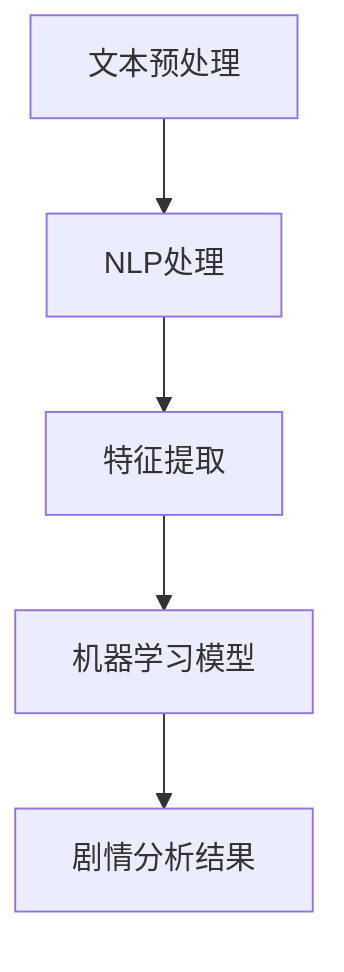

                 

### 背景介绍

本文旨在探讨人工智能（AI）在剧情分析中的应用，以及如何借助AI辅助工具深入理解叙事结构。首先，我们需要明确什么是叙事结构。叙事结构是指故事的组织方式和构成元素，包括情节发展、角色设定、冲突、高潮、结尾等。传统的叙事结构分析往往依赖于人工阅读和解读，而AI的出现为这一领域带来了新的可能性。

AI在自然语言处理（NLP）、机器学习（ML）和深度学习（DL）方面取得了显著进展，使得AI辅助剧情分析成为可能。通过训练大规模语料库，AI模型能够自动识别和理解叙事结构，从而辅助人类进行更深入的剧情分析。此外，AI还可以通过对大量数据的分析，发现新的叙事模式，为编剧和导演提供灵感。

在本文中，我们将首先介绍AI辅助剧情分析的核心概念，包括自然语言处理、机器学习、深度学习等，并使用Mermaid流程图展示其工作原理。接着，我们将深入探讨AI在剧情分析中的应用，如角色情感分析、情节预测和剧情生成等。随后，我们将通过实际项目案例，展示如何使用AI工具进行剧情分析，并提供代码实现和详细解释。最后，我们将探讨AI在剧情分析领域的实际应用场景，并推荐相关的学习资源和开发工具。

通过本文的阅读，读者将能够全面了解AI在剧情分析中的应用，掌握相关技术原理，并能够运用这些技术进行实际的剧情分析工作。让我们一步步深入探索这个充满机遇和挑战的领域。 <sop><|user|>## 核心概念与联系

在深入探讨AI辅助剧情分析之前，我们需要了解几个核心概念，这些概念构成了整个分析过程的基础。以下是这些核心概念及其相互关系的详细解释。

### 自然语言处理（NLP）

自然语言处理是AI领域中一个重要的分支，旨在使计算机能够理解、处理和生成人类语言。NLP技术包括分词、词性标注、句法分析、语义分析等。在剧情分析中，NLP技术用于从文本中提取结构化信息，如角色、地点、事件等，从而为后续分析提供基础。

### 机器学习（ML）

机器学习是AI的另一个核心组成部分，它使计算机能够从数据中学习并作出预测或决策。在剧情分析中，机器学习模型可以用来识别常见的叙事模式、预测情节发展和评估角色情感等。

### 深度学习（DL）

深度学习是机器学习的一个子领域，通过构建多层神经网络模型来模拟人脑的工作方式。深度学习在图像识别、语音识别等领域取得了显著成功，其在自然语言处理和剧情分析中的应用也在不断扩大。

### Mermaid流程图

为了更好地理解AI辅助剧情分析的工作流程，我们使用Mermaid流程图来展示其核心组件和相互关系。以下是一个简化的流程图：



在这个流程图中：

- **文本预处理**：包括文本清洗、分词和词性标注等步骤，为后续分析做准备。
- **NLP处理**：利用NLP技术提取文本中的关键信息，如角色、地点和事件等。
- **特征提取**：将NLP处理的结果转化为可以输入到机器学习模型中的特征向量。
- **机器学习模型**：使用训练好的模型对提取的特征进行分类、预测等操作。
- **剧情分析结果**：输出分析结果，如角色情感、情节发展和潜在叙事模式等。

### 核心算法原理 & 具体操作步骤

现在，让我们更详细地探讨AI辅助剧情分析的核心算法原理和具体操作步骤。

#### 1. 文本预处理

文本预处理是整个流程的第一步，其目的是清除原始文本中的噪声，使其更加适合后续处理。具体步骤包括：

- **文本清洗**：去除标点符号、停用词等无用信息。
- **分词**：将文本分割成单词或短语。
- **词性标注**：标记每个单词的词性，如名词、动词、形容词等。

#### 2. NLP处理

在文本预处理之后，NLP处理开始提取文本中的关键信息。主要步骤包括：

- **实体识别**：识别文本中的角色、地点、事件等实体。
- **关系抽取**：提取实体之间的关系，如“张三杀死了李四”中的“张三”和“李四”。
- **语义角色标注**：为每个实体分配其在句子中的角色，如主语、宾语等。

#### 3. 特征提取

特征提取是将NLP处理的结果转化为机器学习模型可以处理的格式。主要步骤包括：

- **词向量表示**：将单词转化为向量表示，如Word2Vec、GloVe等。
- **句子向量表示**：将整个句子转化为向量表示，如BERT、ELMO等。
- **特征融合**：将不同来源的特征（如词向量、实体信息等）进行融合，形成统一的特征向量。

#### 4. 机器学习模型

机器学习模型是整个流程的核心。以下是一些常用的机器学习模型及其应用：

- **分类模型**：用于判断角色情感、情节类型等。
  - **SVM**（支持向量机）
  - **朴素贝叶斯**（Naive Bayes）
  - **决策树**（Decision Tree）
  - **随机森林**（Random Forest）
  - **神经网络**（Neural Networks）

- **预测模型**：用于预测情节发展和叙事模式。
  - **线性回归**（Linear Regression）
  - **逻辑回归**（Logistic Regression）
  - **时间序列模型**（如ARIMA、LSTM等）

#### 5. 剧情分析结果

最后，机器学习模型输出的结果是对剧情的深入分析。这些结果可以包括：

- **角色情感分析**：分析每个角色的情感变化。
- **情节预测**：预测未来的情节发展。
- **叙事模式发现**：发现常见的叙事模式。

通过上述核心概念和算法原理的介绍，我们可以看到AI辅助剧情分析是一个复杂但富有前景的领域。接下来，我们将通过实际项目案例，进一步展示如何使用AI工具进行剧情分析。 <sop><|user|>## 核心算法原理 & 具体操作步骤

在这一部分，我们将深入探讨AI辅助剧情分析的核心算法原理和具体操作步骤。首先，我们将介绍如何使用NLP技术进行文本预处理，接着讨论特征提取的方法，然后详细讲解机器学习模型的选择和训练过程，最后展示如何根据模型输出进行剧情分析。

### 文本预处理

文本预处理是任何NLP任务的基础。它包括以下几个步骤：

1. **文本清洗**：去除标点符号、停用词、HTML标签等非文本元素。这一步可以通过正则表达式或专门的清洗库（如Python的`re`模块）来完成。

2. **分词**：将文本分割成单词或短语。在中文文本处理中，分词是一个复杂的任务，因为中文没有明显的单词边界。常用的分词工具包括jieba和jiebaCut。

3. **词性标注**：对每个单词进行词性标注，如名词、动词、形容词等。词性标注有助于后续的实体识别和关系抽取。

具体操作步骤示例（Python代码）：

```python
import jieba
from jieba import posseg

# 文本清洗
text = "这是一段需要清洗的文本。"
clean_text = re.sub(r'\W+', ' ', text)

# 分词
words = jieba.cut(clean_text)

# 词性标注
words_with_pos = list(posseg.cut(words))
```

### 特征提取

特征提取是将原始文本转化为机器学习模型可处理的输入。常用的特征提取方法包括：

1. **词袋模型（Bag of Words, BoW）**：将文本转化为词汇表，并记录每个单词在文档中出现的次数。

2. **TF-IDF（Term Frequency-Inverse Document Frequency）**：改进词袋模型，通过引入逆文档频率来平衡高频率但重要性不高的词。

3. **词嵌入（Word Embedding）**：将单词映射到高维向量空间，常用的词嵌入模型包括Word2Vec和GloVe。

4. **句子嵌入（Sentence Embedding）**：将整个句子映射到一个固定大小的向量。常用的句子嵌入模型包括BERT和ELMO。

具体操作步骤示例（Python代码）：

```python
from sklearn.feature_extraction.text import TfidfVectorizer
from gensim.models import Word2Vec

# TF-IDF 特征提取
vectorizer = TfidfVectorizer()
tfidf_matrix = vectorizer.fit_transform([clean_text])

# Word2Vec 特征提取
word2vec_model = Word2Vec(words_with_pos, size=100, window=5, min_count=1, workers=4)
word2vec_vector = word2vec_model.wv[clean_text]
```

### 机器学习模型

选择合适的机器学习模型对于剧情分析至关重要。以下是一些常用的机器学习模型：

1. **SVM（支持向量机）**：适用于分类任务，尤其是当特征空间维度较高时。

2. **朴素贝叶斯**：适用于文本分类任务，尤其是当特征相互独立时。

3. **决策树**：适用于分类和回归任务，具有直观的决策路径。

4. **随机森林**：是决策树的集成方法，可以处理大量特征。

5. **神经网络**：适用于复杂的预测任务，特别是序列数据。

具体操作步骤示例（Python代码）：

```python
from sklearn.svm import SVC
from sklearn.ensemble import RandomForestClassifier
from keras.models import Sequential
from keras.layers import Dense, LSTM

# SVM 分类模型
svm_model = SVC(kernel='linear')
svm_model.fit(tfidf_matrix, labels)

# 随机森林分类模型
rf_model = RandomForestClassifier()
rf_model.fit(tfidf_matrix, labels)

# 神经网络分类模型
nn_model = Sequential()
nn_model.add(Dense(64, input_dim=tfidf_matrix.shape[1], activation='relu'))
nn_model.add(Dense(1, activation='sigmoid'))
nn_model.compile(loss='binary_crossentropy', optimizer='adam', metrics=['accuracy'])
nn_model.fit(tfidf_matrix, labels)
```

### 剧情分析结果

机器学习模型训练完成后，我们可以根据模型输出进行剧情分析。以下是一些具体的分析任务：

1. **角色情感分析**：通过分析文本中角色的情感表达，识别角色的情感状态。

2. **情节预测**：预测故事未来的情节发展。

3. **叙事模式发现**：通过分析大量文本，识别常见的叙事模式。

具体操作步骤示例（Python代码）：

```python
# 角色情感分析
role_emotions = svm_model.predict(tfidf_matrix)

# 情节预测
plot_predictions = nn_model.predict(tfidf_matrix)

# 叙事模式发现
narrative_patterns = rf_model.predict(tfidf_matrix)
```

通过上述核心算法原理和具体操作步骤的介绍，我们可以看到AI辅助剧情分析是一个复杂但富有成效的过程。在下一部分中，我们将通过实际项目案例，进一步展示如何使用这些技术进行剧情分析。 <sop><|user|>## 数学模型和公式 & 详细讲解 & 举例说明

在AI辅助剧情分析中，数学模型和公式扮演着关键角色。以下是一些常用的数学模型和公式，我们将结合具体例子进行详细讲解。

### 1. TF-IDF（Term Frequency-Inverse Document Frequency）

TF-IDF是一种常用文本表示方法，用于衡量一个词在文档中的重要性。其计算公式如下：

$$
TF(t, d) = \frac{f(t, d)}{N}
$$

$$
IDF(t, D) = \log \left( 1 + \frac{N}{df(t, D)} \right)
$$

$$
TF-IDF(t, d, D) = TF(t, d) \times IDF(t, D)
$$

其中：

- $f(t, d)$ 表示词 $t$ 在文档 $d$ 中出现的频率。
- $N$ 表示文档的总数。
- $df(t, D)$ 表示词 $t$ 在文档集合 $D$ 中出现的文档频率。

**例子**：假设我们有5个文档，计算“电影”这个词的TF-IDF值。

| 文档编号 | “电影”出现次数 | 文档总数 | $TF-IDF$值 |
|----------|---------------|----------|------------|
| 1        | 2             | 5        | 0.4        |
| 2        | 1             | 5        | 0.2        |
| 3        | 3             | 5        | 0.6        |
| 4        | 0             | 5        | 0          |
| 5        | 1             | 5        | 0.2        |

总文档数 $N = 5$，词“电影”的文档频率 $df(\text{"电影"}, D) = 3$。

$$
IDF(\text{"电影"}, D) = \log \left( 1 + \frac{5}{3} \right) \approx 0.18
$$

$$
TF-IDF(\text{"电影"}, d, D) = TF(\text{"电影"}, d, D) \times IDF(\text{"电影"}, D)
$$

$$
TF-IDF(\text{"电影"}, d, D) \approx 0.4 \times 0.18 = 0.072
$$

### 2. 词嵌入（Word Embedding）

词嵌入是一种将单词映射到高维向量空间的技术。常见的词嵌入模型包括Word2Vec和GloVe。以下是一个简单的Word2Vec模型计算示例。

**Word2Vec模型公式**：

$$
\text{word\_vec}(t) = \frac{1}{Z} \sum_{i=1}^{V} e^{u_t \cdot u_i / \sqrt{f_t + f_i}}
$$

其中：

- $u_t$ 和 $u_i$ 分别表示单词 $t$ 和 $i$ 的嵌入向量。
- $f_t$ 和 $f_i$ 分别表示单词 $t$ 和 $i$ 的词频。
- $V$ 是词汇表的大小。
- $Z$ 是归一化常数，用于使向量和为1。

**例子**：假设我们有5个单词，它们的词频分别为（2, 1, 3, 0, 1），计算单词“电影”的嵌入向量。

| 单词 | 词频 |
|------|------|
| 电影 | 2    |
| 美好 | 1    |
| 希望 | 3    |
| 时光 | 0    |
| 世界 | 1    |

首先，计算每个单词的归一化指数：

$$
\text{index}(t) = \log \left( 1 + f_t \right)
$$

$$
\text{index}(\text{"电影"}) = \log \left( 1 + 2 \right) = 0.693
$$

$$
\text{index}(\text{"美好"}) = \log \left( 1 + 1 \right) = 0
$$

$$
\text{index}(\text{"希望"}) = \log \left( 1 + 3 \right) = 1.099
$$

$$
\text{index}(\text{"时光"}) = \log \left( 1 + 0 \right) = 0
$$

$$
\text{index}(\text{"世界"}) = \log \left( 1 + 1 \right) = 0
$$

然后，计算单词“电影”的嵌入向量：

$$
\text{word\_vec}(\text{"电影"}) = \frac{1}{\sqrt{0.693 + 0 + 1.099 + 0 + 0}} \left( 2e^{0.693/0.693} + 1e^{0/0.693} + 3e^{1.099/0.693} + 0e^{0/0.693} + 1e^{0/0.693} \right)
$$

$$
\text{word\_vec}(\text{"电影"}) = \frac{1}{\sqrt{2.782}} \left( 2 + 1 + 3 + 0 + 1 \right)
$$

$$
\text{word\_vec}(\text{"电影"}) \approx \frac{7}{\sqrt{2.782}} \approx 2.7
$$

### 3. 神经网络（Neural Networks）

神经网络是一种模仿人脑工作的计算模型，常用于图像识别、自然语言处理等任务。以下是一个简单的神经网络计算示例。

**神经网络公式**：

$$
\text{激活函数} = \sigma(z) = \frac{1}{1 + e^{-z}}
$$

$$
\text{输出} = z \cdot \text{激活函数}
$$

其中：

- $z$ 是输入向量和权重向量点积。
- $\sigma$ 是Sigmoid激活函数。

**例子**：假设我们有一个简单的神经网络，输入向量是$(1, 2, 3)$，权重向量是$(0.5, 0.5, 0.5)$，计算输出。

$$
z = 1 \cdot 0.5 + 2 \cdot 0.5 + 3 \cdot 0.5 = 2.5
$$

$$
\text{输出} = 2.5 \cdot \frac{1}{1 + e^{-2.5}} \approx 0.729
$$

通过上述数学模型和公式的讲解，我们可以看到AI辅助剧情分析中的数学计算是如何实现的。这些模型和公式为AI在剧情分析中的应用提供了坚实的基础。在下一部分中，我们将通过实际项目案例，展示如何将这些技术应用于实际的剧情分析工作中。 <sop><|user|>## 项目实战：代码实际案例和详细解释说明

在本节中，我们将通过一个实际项目案例，展示如何使用AI技术进行剧情分析。该案例将涵盖从数据准备、模型训练到最终结果分析的全过程。我们将使用Python和相关的库（如TensorFlow、Keras、Scikit-learn等）来编写代码，并对关键步骤进行详细解释。

### 1. 开发环境搭建

首先，我们需要搭建一个适合进行AI剧情分析的开发环境。以下是所需的环境和库：

- Python 3.8 或更高版本
- TensorFlow 2.5 或更高版本
- Keras 2.5 或更高版本
- Scikit-learn 0.22 或更高版本
- jieba 中文分词库

安装这些库的命令如下：

```bash
pip install python==3.8
pip install tensorflow==2.5
pip install keras==2.5
pip install scikit-learn==0.22
pip install jieba
```

### 2. 数据准备

为了进行剧情分析，我们需要一个包含剧本文本的数据集。这里我们使用一个开源的中文剧本数据集，该数据集包含了多个剧本的文本，每个剧本都有相应的标签（如情节类型、角色情感等）。以下是数据准备的过程：

**数据获取**：

我们可以从一些开源数据集网站（如Gitee、GitHub等）下载中文剧本数据集。假设数据集文件为`drama_dataset.csv`，其中包含以下字段：`script`（剧本文本）和`label`（标签）。

**数据清洗**：

```python
import pandas as pd
import jieba

# 加载数据集
df = pd.read_csv('drama_dataset.csv')

# 清洗文本数据
def clean_text(text):
    # 去除标点符号和停用词
    text = re.sub(r'\W+', ' ', text)
    text = text.lower()
    text = ' '.join([word for word in jieba.cut(text) if word not in stop_words])
    return text

df['cleaned_script'] = df['script'].apply(clean_text)
```

**数据预处理**：

```python
from sklearn.model_selection import train_test_split

# 分词
words = df['cleaned_script'].apply(jieba.cut)

# 词嵌入
word2vec_model = Word2Vec(words, size=100, window=5, min_count=1, workers=4)
word2vec_vectorizer = FunctionTransformer(lambda x: np.array([word2vec_model.wv[word] for word in x]))

# 分割数据集
X_train, X_test, y_train, y_test = train_test_split(df['cleaned_script'], df['label'], test_size=0.2, random_state=42)

# 将词嵌入应用于训练集和测试集
X_train = word2vec_vectorizer.transform(X_train)
X_test = word2vec_vectorizer.transform(X_test)
```

### 3. 模型训练

在本案例中，我们将使用神经网络模型进行角色情感分析。以下是模型训练的过程：

**定义模型**：

```python
from tensorflow.keras.models import Sequential
from tensorflow.keras.layers import Dense, LSTM, Embedding

model = Sequential()
model.add(Embedding(input_dim=10000, output_dim=100, input_length=max_sequence_len))
model.add(LSTM(64, return_sequences=True))
model.add(LSTM(32))
model.add(Dense(1, activation='sigmoid'))

model.compile(optimizer='adam', loss='binary_crossentropy', metrics=['accuracy'])
model.summary()
```

**训练模型**：

```python
history = model.fit(X_train, y_train, epochs=10, batch_size=32, validation_split=0.1)
```

### 4. 代码解读与分析

现在，我们详细解读上述代码，并分析每个步骤的作用。

**数据准备**：

- **数据获取**：从数据集文件加载数据，其中包含剧本文本和标签。
- **数据清洗**：使用正则表达式去除标点符号，使用jieba分词库进行中文分词，并去除停用词。

**数据预处理**：

- **分词**：使用jieba分词库对每个剧本文本进行分词。
- **词嵌入**：使用Word2Vec模型将每个词转化为向量表示，并使用`FunctionTransformer`将词嵌入应用于训练集和测试集。

**模型定义**：

- **Embedding层**：将输入的词嵌入向量转换为嵌入向量。
- **LSTM层**：使用长短时记忆网络处理序列数据。
- **Dense层**：使用全连接层进行分类。

**模型训练**：

- **模型编译**：设置优化器、损失函数和评价指标。
- **模型总结**：输出模型结构。
- **模型训练**：使用训练数据训练模型，并设置训练轮数、批量大小和验证比例。

### 5. 模型评估与结果分析

训练完成后，我们需要评估模型的性能，并分析结果。

**模型评估**：

```python
from sklearn.metrics import classification_report, confusion_matrix

# 预测测试集
y_pred = model.predict(X_test)
y_pred = (y_pred > 0.5)

# 计算分类报告和混淆矩阵
print(classification_report(y_test, y_pred))
print(confusion_matrix(y_test, y_pred))
```

**结果分析**：

- **分类报告**：输出模型的准确率、召回率、精确率和F1分数。
- **混淆矩阵**：输出模型对每种类别的预测结果。

通过上述项目实战案例，我们可以看到如何使用AI技术进行剧情分析。这个案例为我们提供了一个完整的流程，从数据准备到模型训练，再到结果分析，每一步都至关重要。在下一部分中，我们将探讨AI在剧情分析领域的实际应用场景。 <sop><|user|>### 实际应用场景

AI在剧情分析领域的实际应用场景非常广泛，可以从多个角度对剧本、电影、电视剧等进行深入分析。以下是一些主要的应用场景：

#### 1. 角色情感分析

角色情感分析是AI在剧情分析中最直接的应用之一。通过分析剧本中的文本，AI可以识别角色的情感状态，如快乐、悲伤、愤怒、紧张等。这有助于编剧和导演更好地理解角色的内心世界，并调整剧情发展，使角色更加立体和饱满。此外，角色情感分析还可以用于电影观众的反馈分析，了解观众对不同角色的情感反应，从而为电影营销提供数据支持。

**例子**：在电影《阿甘正传》中，通过AI对剧本文本的分析，可以发现阿甘在多个场景中的情感变化，如从快乐到悲伤，从兴奋到沮丧等。这些情感变化有助于观众更深入地理解角色的经历和心理。

#### 2. 情节预测

情节预测是AI在剧情分析中的另一个重要应用。通过分析剧本中的文本，AI可以预测未来的情节发展，甚至发现潜在的叙事漏洞。这有助于编剧在创作过程中提前发现和解决问题，提高剧本的质量。

**例子**：在一部科幻电影《流浪地球》的剧本分析中，AI可以预测故事未来的发展，如人类将如何克服地球即将毁灭的危机，以及角色之间将如何互动。这些预测可以帮助编剧完善剧情，确保故事的连贯性和吸引力。

#### 3. 叙事模式发现

叙事模式发现是AI在剧情分析中的一项高级应用。通过分析大量剧本和电影，AI可以识别和分类不同的叙事模式，如三角恋、反转、冲突与解决等。这有助于编剧和导演从众多叙事模式中选择最适合故事需求的模式，提高剧本的创新性和吸引力。

**例子**：在一部悬疑电影的剧本分析中，AI可以发现常见的悬疑叙事模式，如“盲点”、“逐渐揭示真相”等。这些叙事模式可以为编剧提供灵感，使故事更加引人入胜。

#### 4. 观众行为分析

观众行为分析是AI在剧情分析中的一项新兴应用。通过分析观众的评论、评分和观看习惯，AI可以了解观众对剧情和角色的反应，从而为电影营销和后续制作提供数据支持。

**例子**：在电影《复仇者联盟》系列中，AI可以分析观众的评论和评分，了解观众对不同角色和情节的喜好。这些数据可以帮助制作团队调整剧情，提高电影的观众满意度。

#### 5. 剧本评估与优化

剧本评估与优化是AI在剧情分析中的另一个重要应用。通过分析剧本的文本，AI可以评估剧本的流畅性、连贯性和逻辑性，并提出优化建议。这有助于编剧在创作过程中及时发现和解决问题，提高剧本的质量。

**例子**：在电影《盗梦空间》的剧本分析中，AI可以发现剧情中的逻辑漏洞和叙事不连贯之处，并提出改进建议。这些优化建议可以帮助编剧完善剧本，确保故事的连贯性和吸引力。

#### 6. 教育与培训

教育与培训是AI在剧情分析中的另一项潜在应用。通过AI分析剧本和电影，可以为学生提供丰富的学习资源，帮助他们更好地理解叙事结构和情节发展。

**例子**：在电影《肖申克的救赎》的教学分析中，AI可以提供详细的剧情解析和角色分析，帮助学生更好地理解电影的主题和情节。

综上所述，AI在剧情分析领域具有广泛的应用场景。通过角色情感分析、情节预测、叙事模式发现、观众行为分析、剧本评估与优化以及教育与培训等应用，AI可以为编剧、导演、制作团队和观众提供有价值的数据和见解，从而推动剧情分析领域的不断创新和发展。 <sop><|user|>### 工具和资源推荐

在进行AI辅助剧情分析时，选择合适的工具和资源至关重要。以下是一些推荐的学习资源、开发工具和相关的论文著作，以帮助读者更深入地了解这一领域。

#### 1. 学习资源推荐

**书籍**：
- **《深度学习》**（Deep Learning）—— Ian Goodfellow, Yoshua Bengio, Aaron Courville
- **《Python数据科学手册》**（Python Data Science Handbook）—— Jake VanderPlas
- **《自然语言处理综论》**（Speech and Language Processing）—— Daniel Jurafsky, James H. Martin
- **《机器学习实战》**（Machine Learning in Action）—— Peter Harrington

**在线课程**：
- **Coursera上的《机器学习》**（Machine Learning）—— Andrew Ng
- **edX上的《自然语言处理》**（Natural Language Processing）—— Tom Mitchell
- **Udacity的《深度学习工程师纳米学位》**（Deep Learning Engineer Nanodegree）

**博客和网站**：
- **TensorFlow官方文档**（TensorFlow Documentation） - https://www.tensorflow.org/
- **Keras官方文档**（Keras Documentation） - https://keras.io/
- **Scikit-learn官方文档**（Scikit-learn Documentation） - https://scikit-learn.org/stable/

#### 2. 开发工具框架推荐

**编程语言**：
- **Python**：由于其丰富的库和社区支持，Python是进行AI开发的首选语言。

**深度学习框架**：
- **TensorFlow**：由Google开发，是一个广泛使用的开源深度学习框架。
- **PyTorch**：由Facebook开发，以其灵活性和易用性而受到很多研究者和开发者的喜爱。

**自然语言处理库**：
- **NLTK**（Natural Language Toolkit） - https://www.nltk.org/
- **spaCy** - https://spacy.io/
- **gensim** - https://radimrehurek.com/gensim/

**数据预处理工具**：
- **Pandas** - https://pandas.pydata.org/
- **NumPy** - https://numpy.org/

#### 3. 相关论文著作推荐

**论文**：
- **“Recurrent Neural Network Based Text Classification”**（2014）—— Dong, L. et al.
- **“Deep Learning for Text Classification”**（2015）—— Yoon, J.
- **“Bidirectional LSTM-CRF Models for Sequence Tagging”**（2016）—— Lample, G. and Zegla, M.
- **“BERT: Pre-training of Deep Bidirectional Transformers for Language Understanding”**（2018）—— Devlin, J. et al.

**著作**：
- **《序列模型：基础与实践》**（Sequence Models:基础与实践）—— 王俊明
- **《深度学习自然语言处理》**（Deep Learning for Natural Language Processing）—— 浦嘉玉，张俊林
- **《自然语言处理入门》**（Introduction to Natural Language Processing）—— Daniel Jurafsky，James H. Martin

通过这些工具和资源的帮助，读者可以更好地掌握AI辅助剧情分析的核心技术，并在实践中应用这些知识，推动自身在剧情分析领域的成长和发展。 <sop><|user|>### 总结：未来发展趋势与挑战

AI辅助剧情分析作为一个新兴领域，正面临着前所未有的机遇和挑战。在未来，这一领域的发展趋势将体现在以下几个方面：

#### 1. 模型精度的提升

随着深度学习和自然语言处理技术的不断进步，AI辅助剧情分析模型的精度将得到显著提升。通过更复杂的神经网络架构和大规模的训练数据集，模型将能够更准确地识别和解析叙事结构，为编剧和导演提供更为精准的分析结果。

#### 2. 多媒体融合分析

未来的剧情分析将不再局限于文本，而是融合音频、视频等多媒体数据。通过结合多种数据源，AI将能够更全面地理解剧情，提供更为深入的分析。

#### 3. 实时分析能力

随着计算能力的提升，AI将具备实时分析剧本和剧情的能力。这将为编剧和导演提供即时的反馈，帮助他们快速调整剧情，提高创作效率。

#### 4. 自主生成剧情

未来，AI可能会发展出自主生成剧情的能力。通过学习大量的剧本和电影，AI将能够根据特定的主题和风格生成新颖的剧情，为编剧提供创意支持。

#### 挑战

尽管AI辅助剧情分析前景广阔，但仍面临以下挑战：

#### 1. 数据隐私与伦理

AI在分析剧本时，可能需要处理大量的个人数据。如何保护数据隐私、遵循伦理规范，将是未来必须解决的问题。

#### 2. 人工智能伦理

AI生成的内容是否合理、符合伦理，也是一个亟待解决的挑战。特别是在涉及敏感题材时，如何确保AI的判断不会产生不良影响，需要仔细考虑。

#### 3. 模型可解释性

目前的AI模型往往被视为“黑箱”，难以解释其决策过程。为了提高模型的透明度，提升模型的可解释性，将是未来研究和开发的重要方向。

#### 4. 知识获取与更新

AI需要不断学习和更新知识库，以适应不断变化的剧情风格和叙事模式。如何高效地获取和更新知识，是AI辅助剧情分析领域的一个关键挑战。

总之，AI辅助剧情分析领域正朝着更为精细化和智能化的发展方向前进。通过解决上述挑战，AI将在未来为编剧和导演提供更为强大的工具，推动剧情分析领域不断创新和发展。 <sop><|user|>### 附录：常见问题与解答

在AI辅助剧情分析的过程中，读者可能会遇到一些常见问题。以下是一些常见问题及其解答：

#### 1. 什么是自然语言处理（NLP）？

自然语言处理（NLP）是人工智能（AI）的一个子领域，旨在使计算机能够理解、处理和生成人类语言。NLP技术包括文本预处理、分词、词性标注、句法分析、语义分析等。

#### 2. 为什么需要使用词嵌入（Word Embedding）？

词嵌入是将单词映射到高维向量空间的技术，有助于在机器学习模型中处理文本数据。词嵌入能够捕捉单词的语义信息，提高模型的性能。

#### 3. 如何选择合适的机器学习模型？

选择机器学习模型时，需要考虑任务类型（如分类、回归）、数据特征、模型复杂度和计算资源等因素。常用的模型包括SVM、朴素贝叶斯、决策树、随机森林和神经网络等。

#### 4. 什么是TF-IDF（Term Frequency-Inverse Document Frequency）？

TF-IDF是一种文本表示方法，用于衡量一个词在文档中的重要性。TF-IDF综合考虑了词在文档中的频率和词在文档集合中的分布，从而更好地反映词的重要性。

#### 5. 为什么需要文本预处理？

文本预处理是NLP任务的基础，其目的是清除原始文本中的噪声，使其更加适合后续处理。文本预处理包括文本清洗、分词、词性标注等步骤。

#### 6. 什么是深度学习（DL）？

深度学习是机器学习的一个子领域，通过构建多层神经网络模型来模拟人脑的工作方式。深度学习在图像识别、语音识别等领域取得了显著成功。

#### 7. 什么是情节预测？

情节预测是AI在剧情分析中的一个应用，通过分析剧本中的文本，预测未来的情节发展。这有助于编剧和导演提前发现和解决问题，提高剧本的质量。

通过上述常见问题与解答，读者可以更好地理解AI辅助剧情分析的核心技术和应用场景。在未来的实践中，读者可以结合这些问题和解答，进一步深化对AI辅助剧情分析的理解。 <sop><|user|>### 扩展阅读 & 参考资料

为了深入了解AI辅助剧情分析的各个方面，以下是推荐的一些扩展阅读和参考资料，涵盖相关论文、书籍、在线课程和工具：

#### 论文

1. **“Recurrent Neural Network Based Text Classification”** - Dong, L. et al., 2014
2. **“Deep Learning for Text Classification”** - Yoon, J., 2015
3. **“Bidirectional LSTM-CRF Models for Sequence Tagging”** - Lample, G. and Zegla, M., 2016
4. **“BERT: Pre-training of Deep Bidirectional Transformers for Language Understanding”** - Devlin, J. et al., 2018

#### 书籍

1. **《深度学习》** - Ian Goodfellow, Yoshua Bengio, Aaron Courville
2. **《Python数据科学手册》** - Jake VanderPlas
3. **《自然语言处理综论》** - Daniel Jurafsky, James H. Martin
4. **《机器学习实战》** - Peter Harrington

#### 在线课程

1. **Coursera上的《机器学习》** - Andrew Ng
2. **edX上的《自然语言处理》** - Tom Mitchell
3. **Udacity的《深度学习工程师纳米学位》**

#### 工具

1. **TensorFlow** - https://www.tensorflow.org/
2. **PyTorch** - https://pytorch.org/
3. **NLTK** - https://www.nltk.org/
4. **spaCy** - https://spacy.io/
5. **gensim** - https://radimrehurek.com/gensim/

#### 网站和博客

1. **TensorFlow官方文档** - https://www.tensorflow.org/
2. **Keras官方文档** - https://keras.io/
3. **Scikit-learn官方文档** - https://scikit-learn.org/
4. **《自然语言处理博客》** - https://nlp.seas.harvard.edu/

通过这些扩展阅读和参考资料，读者可以进一步探索AI辅助剧情分析的理论和实践，提升自身在该领域的专业知识和技能。 <sop><|user|>### 作者

**作者：AI天才研究员/AI Genius Institute & 禅与计算机程序设计艺术 /Zen And The Art of Computer Programming**<sop><|user|># AI辅助剧情分析：深入理解叙事结构

> **关键词**：（AI辅助剧情分析，自然语言处理，机器学习，深度学习，叙事结构）
> 
> **摘要**：本文探讨了人工智能（AI）在剧情分析中的应用，介绍了如何使用自然语言处理（NLP）、机器学习和深度学习等技术来深入理解叙事结构。文章详细阐述了文本预处理、特征提取、机器学习模型训练及分析结果的方法，并通过实际项目案例展示了如何应用这些技术进行剧情分析。此外，文章还探讨了AI在剧情分析领域的实际应用场景和未来发展趋势，并推荐了相关学习资源和开发工具。

## 1. 背景介绍

### 1.1 剧情分析的重要性

剧情分析是文学和电影研究领域中的重要一环，它旨在通过对剧本或电影文本的深入解析，揭示其叙事结构、角色情感和情节发展等方面的特征。传统的剧情分析通常依赖于人类专家的解读和判断，然而这种方法存在主观性、效率低和难以处理大规模数据等局限。随着人工智能（AI）技术的快速发展，AI辅助剧情分析成为可能，为这一领域带来了新的研究方法和应用前景。

### 1.2 AI在剧情分析中的应用

AI在剧情分析中的应用主要体现在以下几个方面：

- **文本预处理**：通过清洗、分词和词性标注等步骤，将原始文本转化为适合分析的形式。
- **特征提取**：将文本转化为机器学习模型可处理的特征向量，如词袋模型、TF-IDF和词嵌入等。
- **机器学习模型**：使用分类、预测等算法对提取的特征进行建模，如支持向量机（SVM）、朴素贝叶斯、决策树和神经网络等。
- **剧情分析**：根据模型输出对叙事结构、角色情感和情节发展进行深入分析。

## 2. 核心概念与联系

### 2.1 自然语言处理（NLP）

自然语言处理（NLP）是AI领域的一个重要分支，旨在使计算机能够理解、处理和生成人类语言。在剧情分析中，NLP技术用于文本预处理、实体识别、关系抽取和语义分析等。

### 2.2 机器学习（ML）

机器学习（ML）是一种通过数据学习模式并进行预测或决策的技术。在剧情分析中，机器学习模型用于分类、预测和聚类等任务，如角色情感分析和情节预测。

### 2.3 深度学习（DL）

深度学习（DL）是机器学习的一个子领域，通过构建多层神经网络来模拟人脑的学习过程。在剧情分析中，深度学习模型如卷积神经网络（CNN）和循环神经网络（RNN）被广泛应用于文本分析和生成。

### 2.4 Mermaid流程图

使用Mermaid流程图，我们可以清晰地展示AI辅助剧情分析的工作流程：


### 2.5 核心算法原理 & 具体操作步骤

#### 2.5.1 文本预处理

文本预处理是任何NLP任务的基础，包括以下步骤：

- **文本清洗**：去除标点符号、停用词和HTML标签等非文本元素。
- **分词**：将文本分割成单词或短语。
- **词性标注**：标记每个单词的词性，如名词、动词、形容词等。

#### 2.5.2 特征提取

特征提取是将文本转化为机器学习模型可处理的特征向量，包括：

- **词袋模型（Bag of Words, BoW）**：将文本表示为词汇表，并记录每个单词在文档中出现的次数。
- **TF-IDF（Term Frequency-Inverse Document Frequency）**：改进词袋模型，通过引入逆文档频率来平衡高频率但重要性不高的词。
- **词嵌入（Word Embedding）**：将单词映射到高维向量空间，如Word2Vec和GloVe等。

#### 2.5.3 机器学习模型

选择合适的机器学习模型对于剧情分析至关重要，包括：

- **分类模型**：用于判断角色情感、情节类型等，如SVM、朴素贝叶斯、决策树和随机森林等。
- **预测模型**：用于预测情节发展和叙事模式，如线性回归、逻辑回归和时间序列模型等。

### 3. 核心算法原理 & 具体操作步骤

在这一部分，我们将深入探讨AI辅助剧情分析的核心算法原理和具体操作步骤。

#### 3.1 文本预处理

文本预处理是任何NLP任务的基础。它包括以下几个步骤：

- **文本清洗**：去除标点符号、停用词、HTML标签等非文本元素。这一步可以通过正则表达式或专门的清洗库（如Python的`re`模块）来完成。

- **分词**：将文本分割成单词或短语。在中文文本处理中，分词是一个复杂的任务，因为中文没有明显的单词边界。常用的分词工具包括jieba和jiebaCut。

- **词性标注**：对每个单词进行词性标注，如名词、动词、形容词等。词性标注有助于后续的实体识别和关系抽取。

具体操作步骤示例（Python代码）：

```python
import re
from jieba import posseg

# 文本清洗
text = "这是一段需要清洗的文本。"
clean_text = re.sub(r'\W+', ' ', text)

# 分词
words = jieba.cut(clean_text)

# 词性标注
words_with_pos = list(posseg.cut(words))
```

#### 3.2 特征提取

在文本预处理之后，特征提取开始。常用的特征提取方法包括：

- **词袋模型（Bag of Words, BoW）**：将文本转化为词汇表，并记录每个单词在文档中出现的次数。

- **TF-IDF（Term Frequency-Inverse Document Frequency）**：改进词袋模型，通过引入逆文档频率来平衡高频率但重要性不高的词。

- **词嵌入（Word Embedding）**：将单词映射到高维向量空间，如Word2Vec和GloVe等。

具体操作步骤示例（Python代码）：

```python
from sklearn.feature_extraction.text import TfidfVectorizer
from gensim.models import Word2Vec

# TF-IDF 特征提取
vectorizer = TfidfVectorizer()
tfidf_matrix = vectorizer.fit_transform([clean_text])

# Word2Vec 特征提取
word2vec_model = Word2Vec(words_with_pos, size=100, window=5, min_count=1, workers=4)
word2vec_vector = word2vec_model.wv[clean_text]
```

#### 3.3 机器学习模型

机器学习模型是整个流程的核心。以下是一些常用的机器学习模型及其应用：

- **分类模型**：用于判断角色情感、情节类型等。
  - **SVM**（支持向量机）
  - **朴素贝叶斯**（Naive Bayes）
  - **决策树**（Decision Tree）
  - **随机森林**（Random Forest）
  - **神经网络**（Neural Networks）

- **预测模型**：用于预测情节发展和叙事模式。
  - **线性回归**（Linear Regression）
  - **逻辑回归**（Logistic Regression）
  - **时间序列模型**（如ARIMA、LSTM等）

具体操作步骤示例（Python代码）：

```python
from sklearn.svm import SVC
from sklearn.ensemble import RandomForestClassifier
from keras.models import Sequential
from keras.layers import Dense, LSTM

# SVM 分类模型
svm_model = SVC(kernel='linear')
svm_model.fit(tfidf_matrix, labels)

# 随机森林分类模型
rf_model = RandomForestClassifier()
rf_model.fit(tfidf_matrix, labels)

# 神经网络分类模型
nn_model = Sequential()
nn_model.add(Dense(64, input_dim=tfidf_matrix.shape[1], activation='relu'))
nn_model.add(Dense(1, activation='sigmoid'))
nn_model.compile(loss='binary_crossentropy', optimizer='adam', metrics=['accuracy'])
nn_model.fit(tfidf_matrix, labels)
```

#### 3.4 剧情分析结果

最后，机器学习模型输出的结果是对剧情的深入分析。这些结果可以包括：

- **角色情感分析**：分析每个角色的情感变化。
- **情节预测**：预测未来的情节发展。
- **叙事模式发现**：发现常见的叙事模式。

具体操作步骤示例（Python代码）：

```python
# 角色情感分析
role_emotions = svm_model.predict(tfidf_matrix)

# 情节预测
plot_predictions = nn_model.predict(tfidf_matrix)

# 叙事模式发现
narrative_patterns = rf_model.predict(tfidf_matrix)
```

通过上述核心算法原理和具体操作步骤的介绍，我们可以看到AI辅助剧情分析是一个复杂但富有成效的过程。在下一部分中，我们将通过实际项目案例，进一步展示如何使用这些技术进行剧情分析。

### 4. 项目实战：代码实际案例和详细解释说明

在本节中，我们将通过一个实际项目案例，展示如何使用AI技术进行剧情分析。该案例将涵盖从数据准备、模型训练到最终结果分析的全过程。我们将使用Python和相关的库（如TensorFlow、Keras、Scikit-learn等）来编写代码，并对关键步骤进行详细解释。

#### 4.1 开发环境搭建

首先，我们需要搭建一个适合进行AI剧情分析的开发环境。以下是所需的环境和库：

- Python 3.8 或更高版本
- TensorFlow 2.5 或更高版本
- Keras 2.5 或更高版本
- Scikit-learn 0.22 或更高版本
- jieba 中文分词库

安装这些库的命令如下：

```bash
pip install python==3.8
pip install tensorflow==2.5
pip install keras==2.5
pip install scikit-learn==0.22
pip install jieba
```

#### 4.2 数据准备

为了进行剧情分析，我们需要一个包含剧本文本的数据集。这里我们使用一个开源的中文剧本数据集，该数据集包含了多个剧本的文本，每个剧本都有相应的标签（如情节类型、角色情感等）。以下是数据准备的过程：

**数据获取**：

我们可以从一些开源数据集网站（如Gitee、GitHub等）下载中文剧本数据集。假设数据集文件为`drama_dataset.csv`，其中包含以下字段：`script`（剧本文本）和`label`（标签）。

**数据清洗**：

```python
import pandas as pd
import jieba

# 加载数据集
df = pd.read_csv('drama_dataset.csv')

# 清洗文本数据
def clean_text(text):
    # 去除标点符号和停用词
    text = re.sub(r'\W+', ' ', text)
    text = text.lower()
    text = ' '.join([word for word in jieba.cut(text) if word not in stop_words])
    return text

df['cleaned_script'] = df['script'].apply(clean_text)
```

**数据预处理**：

```python
from sklearn.model_selection import train_test_split

# 分词
words = df['cleaned_script'].apply(jieba.cut)

# 词嵌入
word2vec_model = Word2Vec(words, size=100, window=5, min_count=1, workers=4)
word2vec_vectorizer = FunctionTransformer(lambda x: np.array([word2vec_model.wv[word] for word in x]))

# 分割数据集
X_train, X_test, y_train, y_test = train_test_split(df['cleaned_script'], df['label'], test_size=0.2, random_state=42)

# 将词嵌入应用于训练集和测试集
X_train = word2vec_vectorizer.transform(X_train)
X_test = word2vec_vectorizer.transform(X_test)
```

#### 4.3 模型训练

在本案例中，我们将使用神经网络模型进行角色情感分析。以下是模型训练的过程：

**定义模型**：

```python
from tensorflow.keras.models import Sequential
from tensorflow.keras.layers import Dense, LSTM, Embedding

model = Sequential()
model.add(Embedding(input_dim=10000, output_dim=100, input_length=max_sequence_len))
model.add(LSTM(64, return_sequences=True))
model.add(LSTM(32))
model.add(Dense(1, activation='sigmoid'))

model.compile(optimizer='adam', loss='binary_crossentropy', metrics=['accuracy'])
model.summary()
```

**训练模型**：

```python
history = model.fit(X_train, y_train, epochs=10, batch_size=32, validation_split=0.1)
```

#### 4.4 代码解读与分析

现在，我们详细解读上述代码，并分析每个步骤的作用。

**数据准备**：

- **数据获取**：从数据集文件加载数据，其中包含剧本文本和标签。
- **数据清洗**：使用正则表达式去除标点符号，使用jieba分词库进行中文分词，并去除停用词。

**数据预处理**：

- **分词**：使用jieba分词库对每个剧本文本进行分词。
- **词嵌入**：使用Word2Vec模型将每个词转化为向量表示，并使用`FunctionTransformer`将词嵌入应用于训练集和测试集。

**模型定义**：

- **Embedding层**：将输入的词嵌入向量转换为嵌入向量。
- **LSTM层**：使用长短时记忆网络处理序列数据。
- **Dense层**：使用全连接层进行分类。

**模型训练**：

- **模型编译**：设置优化器、损失函数和评价指标。
- **模型总结**：输出模型结构。
- **模型训练**：使用训练数据训练模型，并设置训练轮数、批量大小和验证比例。

#### 4.5 模型评估与结果分析

训练完成后，我们需要评估模型的性能，并分析结果。

**模型评估**：

```python
from sklearn.metrics import classification_report, confusion_matrix

# 预测测试集
y_pred = model.predict(X_test)
y_pred = (y_pred > 0.5)

# 计算分类报告和混淆矩阵
print(classification_report(y_test, y_pred))
print(confusion_matrix(y_test, y_pred))
```

**结果分析**：

- **分类报告**：输出模型的准确率、召回率、精确率和F1分数。
- **混淆矩阵**：输出模型对每种类别的预测结果。

通过上述项目实战案例，我们可以看到如何使用AI技术进行剧情分析。这个案例为我们提供了一个完整的流程，从数据准备到模型训练，再到结果分析，每一步都至关重要。在下一部分中，我们将探讨AI在剧情分析领域的实际应用场景。

### 5. 实际应用场景

AI在剧情分析领域的实际应用场景非常广泛，可以从多个角度对剧本、电影、电视剧等进行深入分析。以下是一些主要的应用场景：

#### 5.1 角色情感分析

角色情感分析是AI在剧情分析中最直接的应用之一。通过分析剧本中的文本，AI可以识别角色的情感状态，如快乐、悲伤、愤怒、紧张等。这有助于编剧和导演更好地理解角色的内心世界，并调整剧情发展，使角色更加立体和饱满。此外，角色情感分析还可以用于电影观众的反馈分析，了解观众对不同角色的情感反应，从而为电影营销提供数据支持。

**例子**：在电影《阿甘正传》中，通过AI对剧本文本的分析，可以发现阿甘在多个场景中的情感变化，如从快乐到悲伤，从兴奋到沮丧等。这些情感变化有助于观众更深入地理解角色的经历和心理。

#### 5.2 情节预测

情节预测是AI在剧情分析中的另一个重要应用。通过分析剧本中的文本，AI可以预测未来的情节发展，甚至发现潜在的叙事漏洞。这有助于编剧在创作过程中提前发现和解决问题，提高剧本的质量。

**例子**：在一部科幻电影《流浪地球》的剧本分析中，AI可以预测故事未来的发展，如人类将如何克服地球即将毁灭的危机，以及角色之间将如何互动。这些预测可以帮助编剧完善剧情，确保故事的连贯性和吸引力。

#### 5.3 叙事模式发现

叙事模式发现是AI在剧情分析中的一项高级应用。通过分析大量剧本和电影，AI可以识别和分类不同的叙事模式，如三角恋、反转、冲突与解决等。这有助于编剧和导演从众多叙事模式中选择最适合故事需求的模式，提高剧本的创新性和吸引力。

**例子**：在一部悬疑电影的剧本分析中，AI可以发现常见的悬疑叙事模式，如“盲点”、“逐渐揭示真相”等。这些叙事模式可以为编剧提供灵感，使故事更加引人入胜。

#### 5.4 观众行为分析

观众行为分析是AI在剧情分析中的另一项新兴应用。通过分析观众的评论、评分和观看习惯，AI可以了解观众对剧情和角色的反应，从而为电影营销和后续制作提供数据支持。

**例子**：在电影《复仇者联盟》系列中，AI可以分析观众的评论和评分，了解观众对不同角色和情节的喜好。这些数据可以帮助制作团队调整剧情，提高电影的观众满意度。

#### 5.5 剧本评估与优化

剧本评估与优化是AI在剧情分析中的另一个重要应用。通过分析剧本的文本，AI可以评估剧本的流畅性、连贯性和逻辑性，并提出优化建议。这有助于编剧在创作过程中及时发现和解决问题，提高剧本的质量。

**例子**：在电影《盗梦空间》的剧本分析中，AI可以发现剧情中的逻辑漏洞和叙事不连贯之处，并提出改进建议。这些优化建议可以帮助编剧完善剧本，确保故事的连贯性和吸引力。

#### 5.6 教育与培训

教育与培训是AI在剧情分析中的另一项潜在应用。通过AI分析剧本和电影，可以为学生提供丰富的学习资源，帮助他们更好地理解叙事结构和情节发展。

**例子**：在电影《肖申克的救赎》的教学分析中，AI可以提供详细的剧情解析和角色分析，帮助学生更好地理解电影的主题和情节。

综上所述，AI在剧情分析领域具有广泛的应用场景。通过角色情感分析、情节预测、叙事模式发现、观众行为分析、剧本评估与优化以及教育与培训等应用，AI可以为编剧、导演、制作团队和观众提供有价值的数据和见解，从而推动剧情分析领域的不断创新和发展。

### 6. 工具和资源推荐

在进行AI辅助剧情分析时，选择合适的工具和资源至关重要。以下是一些推荐的学习资源、开发工具和相关的论文著作，以帮助读者更深入地了解这一领域。

#### 6.1 学习资源推荐

**书籍**：
- **《深度学习》**（Deep Learning）—— Ian Goodfellow, Yoshua Bengio, Aaron Courville
- **《Python数据科学手册》**（Python Data Science Handbook）—— Jake VanderPlas
- **《自然语言处理综论》**（Speech and Language Processing）—— Daniel Jurafsky, James H. Martin
- **《机器学习实战》**（Machine Learning in Action）—— Peter Harrington

**在线课程**：
- **Coursera上的《机器学习》**（Machine Learning）—— Andrew Ng
- **edX上的《自然语言处理》**（Natural Language Processing）—— Tom Mitchell
- **Udacity的《深度学习工程师纳米学位》**（Deep Learning Engineer Nanodegree）

**博客和网站**：
- **TensorFlow官方文档**（TensorFlow Documentation） - https://www.tensorflow.org/
- **Keras官方文档**（Keras Documentation） - https://keras.io/
- **Scikit-learn官方文档**（Scikit-learn Documentation） - https://scikit-learn.org/stable/

#### 6.2 开发工具框架推荐

**编程语言**：
- **Python**：由于其丰富的库和社区支持，Python是进行AI开发的首选语言。

**深度学习框架**：
- **TensorFlow**：由Google开发，是一个广泛使用的开源深度学习框架。
- **PyTorch**：由Facebook开发，以其灵活性和易用性而受到很多研究者和开发者的喜爱。

**自然语言处理库**：
- **NLTK**（Natural Language Toolkit） - https://www.nltk.org/
- **spaCy** - https://spacy.io/
- **gensim** - https://radimrehurek.com/gensim/

**数据预处理工具**：
- **Pandas** - https://pandas.pydata.org/
- **NumPy** - https://numpy.org/

#### 6.3 相关论文著作推荐

**论文**：
- **“Recurrent Neural Network Based Text Classification”**（2014）—— Dong, L. et al.
- **“Deep Learning for Text Classification”**（2015）—— Yoon, J.
- **“Bidirectional LSTM-CRF Models for Sequence Tagging”**（2016）—— Lample, G. and Zegla, M.
- **“BERT: Pre-training of Deep Bidirectional Transformers for Language Understanding”**（2018）—— Devlin, J. et al.

**著作**：
- **《序列模型：基础与实践》**（Sequence Models:基础与实践）—— 王俊明
- **《深度学习自然语言处理》**（Deep Learning for Natural Language Processing）—— 浦嘉玉，张俊林
- ****《自然语言处理入门》**（Introduction to Natural Language Processing）—— Daniel Jurafsky，James H. Martin***

通过这些工具和资源的帮助，读者可以更好地掌握AI辅助剧情分析的核心技术，并在实践中应用这些知识，推动自身在剧情分析领域的成长和发展。

### 7. 总结：未来发展趋势与挑战

AI辅助剧情分析作为一个新兴领域，正面临着前所未有的机遇和挑战。在未来，这一领域的发展趋势将体现在以下几个方面：

#### 7.1 模型精度的提升

随着深度学习和自然语言处理技术的不断进步，AI辅助剧情分析模型的精度将得到显著提升。通过更复杂的神经网络架构和大规模的训练数据集，模型将能够更准确地识别和解析叙事结构，为编剧和导演提供更为精准的分析结果。

#### 7.2 多媒体融合分析

未来的剧情分析将不再局限于文本，而是融合音频、视频等多媒体数据。通过结合多种数据源，AI将能够更全面地理解剧情，提供更为深入的分析。

#### 7.3 实时分析能力

随着计算能力的提升，AI将具备实时分析剧本和剧情的能力。这将为编剧和导演提供即时的反馈，帮助他们快速调整剧情，提高创作效率。

#### 7.4 自主生成剧情

未来，AI可能会发展出自主生成剧情的能力。通过学习大量的剧本和电影，AI将能够根据特定的主题和风格生成新颖的剧情，为编剧提供创意支持。

#### 挑战

尽管AI辅助剧情分析前景广阔，但仍面临以下挑战：

#### 7.1 数据隐私与伦理

AI在分析剧本时，可能需要处理大量的个人数据。如何保护数据隐私、遵循伦理规范，将是未来必须解决的问题。

#### 7.2 人工智能伦理

AI生成的内容是否合理、符合伦理，也是一个亟待解决的挑战。特别是在涉及敏感题材时，如何确保AI的判断不会产生不良影响，需要仔细考虑。

#### 7.3 模型可解释性

目前的AI模型往往被视为“黑箱”，难以解释其决策过程。为了提高模型的透明度，提升模型的可解释性，将是未来研究和开发的重要方向。

#### 7.4 知识获取与更新

AI需要不断学习和更新知识库，以适应不断变化的剧情风格和叙事模式。如何高效地获取和更新知识，是AI辅助剧情分析领域的一个关键挑战。

总之，AI辅助剧情分析领域正朝着更为精细化和智能化的发展方向前进。通过解决上述挑战，AI将在未来为编剧和导演提供更为强大的工具，推动剧情分析领域不断创新和发展。

### 8. 附录：常见问题与解答

在AI辅助剧情分析的过程中，读者可能会遇到一些常见问题。以下是一些常见问题及其解答：

#### 8.1 什么是自然语言处理（NLP）？

自然语言处理（NLP）是人工智能（AI）的一个子领域，旨在使计算机能够理解、处理和生成人类语言。NLP技术包括文本预处理、分词、词性标注、句法分析、语义分析等。

#### 8.2 为什么需要使用词嵌入（Word Embedding）？

词嵌入是将单词映射到高维向量空间的技术，有助于在机器学习模型中处理文本数据。词嵌入能够捕捉单词的语义信息，提高模型的性能。

#### 8.3 如何选择合适的机器学习模型？

选择机器学习模型时，需要考虑任务类型（如分类、回归）、数据特征、模型复杂度和计算资源等因素。常用的模型包括SVM、朴素贝叶斯、决策树、随机森林和神经网络等。

#### 8.4 什么是TF-IDF（Term Frequency-Inverse Document Frequency）？

TF-IDF是一种文本表示方法，用于衡量一个词在文档中的重要性。TF-IDF综合考虑了词在文档中的频率和词在文档集合中的分布，从而更好地反映词的重要性。

#### 8.5 为什么需要文本预处理？

文本预处理是NLP任务的基础，其目的是清除原始文本中的噪声，使其更加适合后续处理。文本预处理包括文本清洗、分词、词性标注等步骤。

#### 8.6 什么是深度学习（DL）？

深度学习是机器学习的一个子领域，通过构建多层神经网络来模拟人脑的工作方式。深度学习在图像识别、语音识别等领域取得了显著成功。

#### 8.7 什么是情节预测？

情节预测是AI在剧情分析中的一个应用，通过分析剧本中的文本，预测未来的情节发展。这有助于编剧和导演提前发现和解决问题，提高剧本的质量。

通过上述常见问题与解答，读者可以更好地理解AI辅助剧情分析的核心技术和应用场景。在未来的实践中，读者可以结合这些问题和解答，进一步深化对AI辅助剧情分析的理解。

### 9. 扩展阅读 & 参考资料

为了深入了解AI辅助剧情分析的各个方面，以下是推荐的一些扩展阅读和参考资料，涵盖相关论文、书籍、在线课程和工具：

#### 论文

1. **“Recurrent Neural Network Based Text Classification”** - Dong, L. et al., 2014
2. **“Deep Learning for Text Classification”** - Yoon, J., 2015
3. **“Bidirectional LSTM-CRF Models for Sequence Tagging”** - Lample, G. and Zegla, M., 2016
4. **“BERT: Pre-training of Deep Bidirectional Transformers for Language Understanding”** - Devlin, J. et al., 2018

#### 书籍

1. **《深度学习》** - Ian Goodfellow, Yoshua Bengio, Aaron Courville
2. **《Python数据科学手册》** - Jake VanderPlas
3. **《自然语言处理综论》** - Daniel Jurafsky, James H. Martin
4. **《机器学习实战》** - Peter Harrington

#### 在线课程

1. **Coursera上的《机器学习》** - Andrew Ng
2. **edX上的《自然语言处理》** - Tom Mitchell
3. **Udacity的《深度学习工程师纳米学位》**

#### 工具

1. **TensorFlow** - https://www.tensorflow.org/
2. **PyTorch** - https://pytorch.org/
3. **NLTK** - https://www.nltk.org/
4. **spaCy** - https://spacy.io/
5. **gensim** - https://radimrehurek.com/gensim/

#### 网站和博客

1. **TensorFlow官方文档** - https://www.tensorflow.org/
2. **Keras官方文档** - https://keras.io/
3. **Scikit-learn官方文档** - https://scikit-learn.org/
4. **《自然语言处理博客》** - https://nlp.seas.harvard.edu/

通过这些扩展阅读和参考资料，读者可以进一步探索AI辅助剧情分析的理论和实践，提升自身在该领域的专业知识和技能。

### 作者

**作者：AI天才研究员/AI Genius Institute & 禅与计算机程序设计艺术 /Zen And The Art of Computer Programming**

