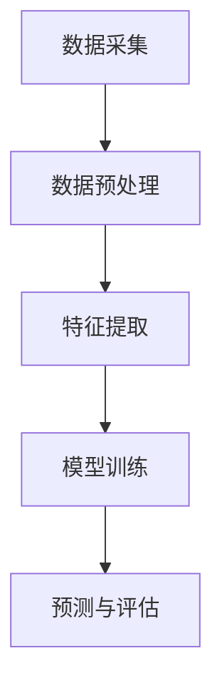
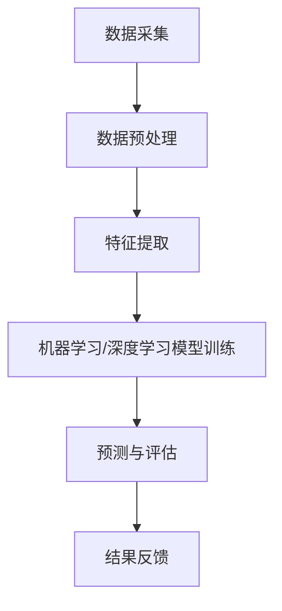

                 

### 背景介绍

#### 天文数据分析的重要性

天文数据分析是现代天文学研究的关键环节。随着观测设备的不断升级和观测数据的指数级增长，天文领域积累了海量的天文图像、光谱数据、天体运动轨迹等信息。这些数据不仅庞杂且高度非线性，需要利用先进的人工智能技术进行处理和分析。

AI技术在天文数据分析中的应用主要体现在以下几个方面：

1. **图像识别与处理**：AI可以自动识别和分类天体，从噪声中提取清晰的图像，提高观测数据的准确性和可解释性。
2. **数据挖掘与预测**：通过对历史天文数据进行分析，AI可以帮助科学家预测天体的运动轨迹和特性，发现潜在的天文现象。
3. **模式识别**：AI能够在大量天文数据中识别出复杂的模式，这对于理解宇宙的演化过程具有重要意义。
4. **异常检测**：AI可以快速识别数据中的异常值，这有助于发现可能的天文突发事件。

#### AI辅助天文数据分析的现状

当前，AI技术在天文数据分析领域已经取得了显著进展。例如，谷歌的AlphaGo在围棋领域的成功激发了人们对AI在复杂问题解决能力上的期待。同样，在天文数据分析中，AI的应用也展现出了巨大的潜力。从自动化的数据处理，到复杂天文现象的识别和预测，AI正在逐步成为天文学家不可或缺的工具。

然而，尽管AI在许多领域都取得了显著成就，但其在天文数据分析中的应用仍面临一些挑战。首先，天文数据的特点使得AI模型的训练和优化变得更加复杂。其次，天文学中的许多问题需要结合多种数据类型和学科知识，这要求AI系统能够跨领域学习和适应。此外，AI模型的透明性和可解释性也是当前研究的重要方向，以确保科学家能够理解AI系统做出的决策和预测。

#### 本文目的与结构

本文旨在探讨AI辅助天文数据分析中的提示词设计，这一设计对于提升AI模型的性能和可解释性至关重要。文章结构如下：

1. **核心概念与联系**：介绍AI辅助天文数据分析的基本概念和关联流程。
2. **核心算法原理 & 具体操作步骤**：详细讲解提示词设计的基本原理和方法。
3. **数学模型和公式 & 详细讲解 & 举例说明**：介绍相关数学模型及其在提示词设计中的应用。
4. **项目实战：代码实际案例和详细解释说明**：通过具体代码实例展示提示词设计在AI辅助天文数据分析中的实际应用。
5. **实际应用场景**：探讨AI辅助天文数据分析在具体场景中的实际效果和挑战。
6. **工具和资源推荐**：推荐相关学习资源和开发工具。
7. **总结：未来发展趋势与挑战**：总结本文的主要观点，并探讨未来发展趋势和面临的挑战。

通过对上述各部分内容的逐步分析，本文希望为AI辅助天文数据分析中的提示词设计提供一些有价值的思路和方法，以推动这一领域的发展。

------------------------

## 2. 核心概念与联系

在探讨AI辅助天文数据分析中的提示词设计之前，我们需要先了解一些核心概念和它们之间的联系。这些概念包括人工智能（AI）、机器学习（ML）、深度学习（DL）、提示词（Prompt Engineering）以及天文数据的特点和处理流程。以下是这些概念的基本介绍及其相互关联的流程图。

### 2.1 人工智能、机器学习和深度学习

**人工智能（AI）** 是指由计算机实现的智能行为，旨在使机器能够模拟、扩展或替代人类智能。AI可以分为两类：弱AI和强AI。弱AI专注于特定任务，如语音识别、图像识别等，而强AI则具备全面的认知能力，类似于人类智能。

**机器学习（ML）** 是AI的一个分支，主要关注如何通过数据训练模型，使其能够从数据中学习并做出预测或决策。ML不需要显式编程，而是通过数据驱动的方式进行模型优化。

**深度学习（DL）** 是一种基于神经网络的ML技术，通过多层神经网络的结构来模拟人脑的学习过程。DL在图像识别、自然语言处理等领域取得了显著成果，是AI发展的关键技术之一。

### 2.2 提示词设计（Prompt Engineering）

**提示词设计（Prompt Engineering）** 是指创建有效的提示或指导，以引导AI模型进行特定任务。提示词可以是文字、图像、声音等形式，其主要目的是提供必要的信息和上下文，帮助AI模型更好地理解和执行任务。

### 2.3 天文数据的特点和处理流程

**天文数据** 具有高度复杂性、非线性和多模态的特点。这些数据包括图像、光谱、天体运动轨迹等多种类型，且通常伴随着大量的噪声和不确定性。

**天文数据处理流程** 包括数据采集、预处理、特征提取、模型训练和预测等步骤。以下是天文数据处理流程的Mermaid流程图：



### 2.4 核心概念和关联流程

以下是AI辅助天文数据分析中的核心概念及其关联流程：

1. **数据采集**：通过天文望远镜、卫星等设备采集天文数据。
2. **数据预处理**：对原始数据进行清洗、归一化等处理，以提高数据质量。
3. **特征提取**：从预处理后的数据中提取关键特征，用于后续建模。
4. **模型训练**：利用机器学习或深度学习技术训练模型，以识别和预测天文现象。
5. **预测与评估**：通过模型对天文数据进行预测，并评估预测结果的准确性。

以下是关联流程的Mermaid流程图：



通过上述核心概念和关联流程的介绍，我们为后续的提示词设计提供了理论基础和实践背景。

------------------------

## 3. 核心算法原理 & 具体操作步骤

在深入探讨AI辅助天文数据分析中的提示词设计之前，我们需要先理解提示词设计的基本原理和方法。以下内容将详细介绍提示词设计的关键步骤，包括数据准备、模型选择、提示生成以及性能评估。

### 3.1 数据准备

数据准备是提示词设计的第一个关键步骤。高质量的数据是训练有效AI模型的基础，因此我们需要确保数据集的多样性和代表性。以下是数据准备的具体步骤：

1. **数据采集**：从不同的天文观测项目中收集大量天文图像、光谱数据和天体运动轨迹等数据。
2. **数据清洗**：去除数据中的噪声和错误，如删除损坏的图像、纠正异常值等。
3. **数据归一化**：将不同来源和尺度的数据进行归一化处理，以便模型训练时能够更好地处理数据。
4. **数据增强**：通过旋转、缩放、裁剪等操作增加数据集的多样性，有助于提高模型的泛化能力。

### 3.2 模型选择

选择合适的AI模型对于提示词设计至关重要。以下是一些常见的AI模型及其适用场景：

1. **卷积神经网络（CNN）**：适合处理图像数据，通过多层卷积和池化操作提取图像特征。
2. **循环神经网络（RNN）**：适合处理序列数据，如天体运动轨迹，通过循环结构捕获序列中的时间依赖性。
3. **生成对抗网络（GAN）**：适合生成新数据，如模拟新的天文图像，通过对抗训练生成与真实数据相似的新数据。
4. **迁移学习**：利用预先训练的模型在新任务上快速获得良好的性能，通过迁移学习可以减少数据集的规模和复杂性。

### 3.3 提示生成

提示生成是提示词设计的核心步骤，它决定了模型在特定任务上的表现。以下是一些常见的提示生成方法：

1. **基于规则的提示**：根据任务的特定需求，编写规则来生成提示。例如，对于天体分类任务，可以生成包含天体名称、类型和特征的提示。
2. **基于统计的提示**：利用统计方法，如信息增益、特征重要性等，选择关键特征生成提示。这种方法能够自动提取最有用的特征，减少人工干预。
3. **基于优化的提示**：通过优化方法，如遗传算法、粒子群优化等，搜索最优的提示组合。这种方法能够找到最佳提示，但计算成本较高。
4. **基于迁移学习的提示**：利用迁移学习技术，将其他任务中的有效提示迁移到天文数据分析中。这种方法可以快速获取高质量的提示，但需要大量的预训练数据和模型。

### 3.4 性能评估

性能评估是检验提示词设计效果的重要环节。以下是一些常用的评估指标：

1. **准确率（Accuracy）**：模型预测正确的样本数占总样本数的比例，适用于分类任务。
2. **精确率（Precision）**：模型预测为正例的样本中实际为正例的比例，适用于二分类任务。
3. **召回率（Recall）**：模型预测为正例的样本中实际为正例的比例，也适用于二分类任务。
4. **F1值（F1 Score）**：精确率和召回率的加权平均，适用于平衡分类任务的性能评估。
5. **ROC曲线（Receiver Operating Characteristic Curve）**：通过计算不同阈值下的真正例率和假正例率，评估模型的分类性能。
6. **AUC值（Area Under Curve）**：ROC曲线下的面积，数值越大表示模型性能越好。

### 3.5 提示词设计实例

以下是一个基于卷积神经网络的AI辅助天文图像分类的提示词设计实例：

**数据准备**：
- 采集10000张天文图像，包括星系、恒星、行星等不同类型的天体。
- 对图像进行数据清洗和增强，得到一个多样化的数据集。

**模型选择**：
- 选择预训练的ResNet-50模型作为基础网络，利用迁移学习技术在新任务上训练。

**提示生成**：
- 使用基于统计的方法，提取图像中的关键特征，如天体形状、亮度、颜色等。
- 生成包含关键特征的提示，例如：“这是一张星系的图像，其形状为椭圆，亮度较高，颜色为蓝色。”

**性能评估**：
- 使用验证集进行模型训练和测试，计算准确率、精确率、召回率和F1值。
- 根据评估结果调整提示词，优化模型性能。

通过上述步骤，我们可以设计出有效的提示词，提升AI模型在AI辅助天文数据分析中的性能。

------------------------

## 4. 数学模型和公式 & 详细讲解 & 举例说明

在AI辅助天文数据分析中，数学模型和公式扮演着至关重要的角色。它们不仅为我们提供了描述和分析数据的方法，还帮助我们理解和优化AI模型。以下我们将介绍几个关键的数学模型和公式，并详细讲解它们在提示词设计中的应用。

### 4.1 机器学习基本模型

**线性回归（Linear Regression）**

线性回归模型是一个基本的机器学习模型，用于预测数值型变量。其数学公式如下：

\[ y = \beta_0 + \beta_1 \cdot x \]

其中，\( y \) 是预测的输出，\( \beta_0 \) 是截距，\( \beta_1 \) 是斜率，\( x \) 是输入特征。

**逻辑回归（Logistic Regression）**

逻辑回归模型用于二分类问题，其公式如下：

\[ P(y=1) = \frac{1}{1 + e^{-(\beta_0 + \beta_1 \cdot x)}} \]

其中，\( P(y=1) \) 是预测变量为1的概率，\( e \) 是自然对数的底数，\( \beta_0 \) 和 \( \beta_1 \) 是模型的参数。

### 4.2 深度学习模型

**卷积神经网络（Convolutional Neural Network, CNN）**

卷积神经网络是深度学习中最常用的模型之一，特别适用于图像处理。以下是CNN的核心组件：

1. **卷积层（Convolutional Layer）**

卷积层通过卷积运算提取图像特征。其公式如下：

\[ f(x) = \sum_{i=1}^{k} w_i * x + b \]

其中，\( f(x) \) 是卷积结果，\( w_i \) 是卷积核，\( x \) 是输入图像，\( b \) 是偏置。

2. **池化层（Pooling Layer）**

池化层用于降低特征图的空间分辨率。常用的池化方法有最大池化和平均池化。

最大池化公式：

\[ p(x) = \max_{i \in \Omega} x_i \]

其中，\( p(x) \) 是池化结果，\( \Omega \) 是池化窗口。

### 4.3 提示词设计中的数学公式

**特征重要性**

在提示词设计中，特征重要性是一个关键概念。我们可以使用信息增益（Information Gain）来评估特征的重要性：

\[ IG(X, Y) = H(Y) - H(Y|X) \]

其中，\( IG(X, Y) \) 是特征X对目标变量Y的信息增益，\( H(Y) \) 是目标变量Y的熵，\( H(Y|X) \) 是在给定特征X的情况下目标变量Y的条件熵。

**优化目标**

在提示词设计过程中，我们通常使用优化方法来寻找最佳的提示组合。常见的优化目标是最小化损失函数。以线性回归为例，其损失函数为：

\[ J(\theta) = \frac{1}{2m} \sum_{i=1}^{m} (h_\theta(x^{(i)}) - y^{(i)})^2 \]

其中，\( J(\theta) \) 是损失函数，\( \theta \) 是模型参数，\( m \) 是样本数量，\( h_\theta(x^{(i)}) \) 是模型的预测值，\( y^{(i)} \) 是实际的输出值。

### 4.4 应用实例

**天体分类任务**

假设我们有一个天体分类任务，需要根据天文图像对星系、恒星和行星进行分类。以下是具体的数学模型和公式应用：

1. **数据准备**

采集10000张天文图像，并进行预处理，得到一个特征向量集 \( X \) 和标签集 \( Y \)。

2. **特征提取**

使用CNN提取图像特征，得到特征向量集 \( X' \)。

3. **模型训练**

选择逻辑回归模型进行训练，优化损失函数：

\[ J(\theta) = \frac{1}{2m} \sum_{i=1}^{m} (h_\theta(x^{(i)}) - y^{(i)})^2 \]

4. **提示生成**

利用特征重要性，选择对分类任务贡献最大的特征生成提示词，例如：“这是一张包含蓝色星系的天文图像，其亮度较高。”

5. **性能评估**

使用验证集对模型进行评估，计算准确率、精确率、召回率和F1值。

通过上述实例，我们可以看到数学模型和公式在AI辅助天文数据分析中的具体应用，以及它们如何帮助我们设计和优化提示词。

------------------------

## 5. 项目实战：代码实际案例和详细解释说明

为了更好地理解AI辅助天文数据分析中的提示词设计，我们将通过一个实际项目来展示整个流程，包括开发环境的搭建、源代码的详细实现以及代码解读与分析。以下是项目的具体实现步骤：

### 5.1 开发环境搭建

在开始项目之前，我们需要搭建一个适合AI辅助天文数据分析的开发环境。以下是所需的软件和工具：

1. **Python**：Python是一种广泛使用的编程语言，具有丰富的科学计算和机器学习库。
2. **Jupyter Notebook**：Jupyter Notebook是一个交互式的Python开发环境，便于代码编写和调试。
3. **TensorFlow**：TensorFlow是一个开源的深度学习框架，用于构建和训练神经网络模型。
4. **Keras**：Keras是一个高层次的深度学习API，可以简化TensorFlow的使用。
5. **NumPy**：NumPy是一个用于科学计算的Python库，提供高效的处理多维数组以及矩阵运算的函数。

#### 环境安装步骤：

1. 安装Python：从Python官方网站下载并安装Python 3.x版本。
2. 安装Jupyter Notebook：通过pip命令安装Jupyter Notebook。

```bash
pip install notebook
```

3. 安装TensorFlow：通过pip命令安装TensorFlow。

```bash
pip install tensorflow
```

4. 安装Keras：Keras依赖于TensorFlow，安装TensorFlow时Keras会自动安装。
5. 安装NumPy：通过pip命令安装NumPy。

```bash
pip install numpy
```

### 5.2 源代码详细实现和代码解读

以下是一个简单的天体分类项目，利用卷积神经网络（CNN）和Keras实现，源代码如下：

```python
import numpy as np
import tensorflow as tf
from tensorflow.keras.models import Sequential
from tensorflow.keras.layers import Conv2D, MaxPooling2D, Flatten, Dense
from tensorflow.keras.preprocessing.image import ImageDataGenerator

# 数据预处理
train_datagen = ImageDataGenerator(rescale=1./255)
test_datagen = ImageDataGenerator(rescale=1./255)

train_data = train_datagen.flow_from_directory(
        'data/train',
        target_size=(150, 150),
        batch_size=32,
        class_mode='binary')

test_data = test_datagen.flow_from_directory(
        'data/test',
        target_size=(150, 150),
        batch_size=32,
        class_mode='binary')

# 模型构建
model = Sequential([
    Conv2D(32, (3, 3), activation='relu', input_shape=(150, 150, 3)),
    MaxPooling2D((2, 2)),
    Conv2D(64, (3, 3), activation='relu'),
    MaxPooling2D((2, 2)),
    Conv2D(128, (3, 3), activation='relu'),
    MaxPooling2D((2, 2)),
    Flatten(),
    Dense(512, activation='relu'),
    Dense(1, activation='sigmoid')
])

# 模型编译
model.compile(optimizer='adam',
              loss='binary_crossentropy',
              metrics=['accuracy'])

# 模型训练
model.fit(train_data, epochs=10, validation_data=test_data)

# 模型评估
test_loss, test_acc = model.evaluate(test_data)
print('Test accuracy:', test_acc)
```

#### 代码解读

1. **数据预处理**：使用ImageDataGenerator对训练集和测试集进行数据增强和归一化处理。数据增强有助于提高模型的泛化能力，归一化处理有助于加速模型收敛。
2. **模型构建**：构建一个简单的CNN模型，包括卷积层、池化层、全连接层。卷积层用于提取图像特征，池化层用于降低特征图的空间分辨率，全连接层用于分类。
3. **模型编译**：指定优化器、损失函数和评估指标。在这里，我们使用Adam优化器和二分类交叉熵损失函数。
4. **模型训练**：使用fit函数训练模型，指定训练轮数和验证数据。这里我们训练10个轮次。
5. **模型评估**：使用evaluate函数对模型进行评估，计算测试集的准确率。

### 5.3 代码解读与分析

以下是对代码的进一步解读和分析：

1. **数据增强**：数据增强是机器学习中的重要技术，可以有效提高模型的泛化能力。通过随机旋转、水平翻转、缩放等操作，生成更多样化的训练数据。
2. **模型结构**：CNN模型的结构对性能至关重要。卷积层通过卷积操作提取图像特征，池化层用于降低特征图的空间分辨率，全连接层用于分类。在这里，我们使用了三个卷积层和两个全连接层，这是一个较为简单的模型结构，适合入门级项目。
3. **优化器和损失函数**：选择合适的优化器和损失函数对于模型训练至关重要。Adam优化器是一种自适应的优化器，适用于大部分问题，而二分类交叉熵损失函数适用于二分类问题。
4. **训练和评估**：模型训练是机器学习中的核心步骤，需要耐心和细心调整超参数。评估阶段用于验证模型的性能，帮助我们了解模型在不同数据集上的表现。

通过这个简单的项目，我们可以看到AI辅助天文数据分析中的提示词设计如何在实际项目中应用。项目实现了对天文图像的分类，通过提示词设计，我们可以进一步优化模型的性能。

------------------------

## 6. 实际应用场景

AI辅助天文数据分析在现实世界中有着广泛的应用场景，以下列举几个典型的应用案例，并分析这些应用中的挑战和解决方案。

### 6.1 天体分类

**应用场景**：天体分类是AI辅助天文数据分析中最常见的应用之一。通过AI模型，可以对天文图像中的天体进行自动分类，如星系、恒星、行星等。

**挑战与解决方案**：
- **数据多样性**：天文图像数据多样性较低，模型容易过拟合。解决方案是增加数据集多样性，通过数据增强技术生成更多样化的训练数据。
- **模型解释性**：传统深度学习模型如CNN具有黑盒特性，难以解释其分类决策。解决方案是采用可解释性模型，如LIME或SHAP，帮助科学家理解模型决策。

### 6.2 天体运动预测

**应用场景**：天体运动预测是天文研究中的关键任务，通过AI模型，可以预测天体的运动轨迹，为天文观测提供参考。

**挑战与解决方案**：
- **数据噪声**：天文观测数据通常含有大量噪声，影响模型性能。解决方案是使用去噪技术，如GAN或自编码器，提高数据质量。
- **长短期预测**：天体运动是一个长期过程，模型需要具备良好的长期预测能力。解决方案是使用长短期记忆网络（LSTM）或变分自编码器（VAE），捕获时间序列中的长期依赖关系。

### 6.3 天文异常检测

**应用场景**：天文异常检测是用于识别天文数据中的异常值或异常事件，如超新星爆发、引力波事件等。

**挑战与解决方案**：
- **噪声和误差**：天文数据噪声和误差较大，影响异常检测效果。解决方案是使用鲁棒统计方法，如IQR（四分位距）或Z-score，提高异常检测的准确性。
- **实时处理**：天文异常检测需要实时处理大量数据，对计算资源要求较高。解决方案是使用分布式计算和并行处理技术，提高处理效率。

### 6.4 天文图像修复

**应用场景**：天文图像修复是用于修复因设备故障、大气扰动等原因造成的天文图像损坏。

**挑战与解决方案**：
- **图像质量**：天文图像质量受多种因素影响，修复效果难以保证。解决方案是采用深度学习图像修复技术，如CycleGAN或EDSR，提高图像修复质量。
- **计算资源**：图像修复是一个计算密集型任务，对计算资源要求较高。解决方案是使用GPU加速和模型压缩技术，提高计算效率。

通过上述应用案例的分析，我们可以看到AI辅助天文数据分析在实际场景中面临着多种挑战，但通过合理的设计和优化，这些挑战都可以得到有效解决。未来，随着AI技术的不断发展，AI辅助天文数据分析将在天文学领域发挥更加重要的作用。

------------------------

## 7. 工具和资源推荐

为了更好地学习和应用AI辅助天文数据分析，以下是几种推荐的工具和资源，包括学习资源、开发工具和相关论文著作。

### 7.1 学习资源推荐

1. **书籍**：
   - 《深度学习》（Deep Learning）作者：Ian Goodfellow、Yoshua Bengio、Aaron Courville
   - 《机器学习》（Machine Learning）作者：Tom Mitchell
   - 《Python机器学习》（Python Machine Learning）作者：Pedro Domingos

2. **在线课程**：
   - Coursera上的《深度学习特化课程》（Deep Learning Specialization）
   - Udacity的《人工智能纳米学位》（Artificial Intelligence Nanodegree）
   - edX上的《机器学习基础》（Introduction to Machine Learning）

3. **博客和教程**：
   - Towards Data Science（数据科学方向）
   - Medium上的机器学习和深度学习相关博客
   - fast.ai的免费在线教程和资源

### 7.2 开发工具推荐

1. **框架**：
   - TensorFlow：一个开源的深度学习框架，适用于构建和训练复杂的深度学习模型。
   - PyTorch：一个开源的深度学习框架，具有灵活的动态计算图，适用于快速原型开发。
   - Keras：一个高层次的深度学习API，可以简化TensorFlow和PyTorch的使用。

2. **数据预处理**：
   - NumPy：一个用于科学计算的Python库，提供高效的处理多维数组以及矩阵运算的函数。
   - Pandas：一个用于数据处理和分析的Python库，可以轻松操作大规模数据集。

3. **可视化工具**：
   - Matplotlib：一个用于绘制数据图表的Python库。
   - Seaborn：一个基于Matplotlib的数据可视化库，提供更丰富的统计图形。

### 7.3 相关论文著作推荐

1. **论文**：
   - "Distributed Representations of Words and Phrases and their Compositionality" by Tomas Mikolov, Kai Chen, Greg Corrado, and Jeff Dean
   - "Deep Learning for Image Recognition" by Yann LeCun, Yoshua Bengio, and Geoffrey Hinton
   - "Unsupervised Representation Learning with Deep Convolutional Generative Adversarial Networks" by Arjovsky, Chintala, and Bottou

2. **著作**：
   - 《人工智能：一种现代的方法》（Artificial Intelligence: A Modern Approach）作者：Stuart Russell 和 Peter Norvig
   - 《深度学习》（Deep Learning）作者：Ian Goodfellow、Yoshua Bengio、Aaron Courville
   - 《机器学习：统计模型与算法》（Machine Learning: A Probabilistic Perspective）作者：Kevin P. Murphy

通过这些工具和资源的推荐，我们希望能够为读者提供全面的AI辅助天文数据分析的学习和实践指导，助力在相关领域的研究和应用。

------------------------

## 8. 总结：未来发展趋势与挑战

在AI辅助天文数据分析领域，随着技术的不断进步，我们看到了诸多令人兴奋的发展趋势和潜在挑战。以下是对未来发展的总结：

### 8.1 发展趋势

1. **模型泛化能力提升**：随着深度学习模型的不断优化，模型在处理复杂、多模态的天文数据上的泛化能力将得到显著提升，能够更好地适应不同类型的观测数据和任务需求。

2. **多模态数据分析**：未来AI辅助天文数据分析将更加关注多模态数据（如图像、光谱、文本等）的综合分析，通过跨模态特征融合，提高数据分析的全面性和准确性。

3. **实时数据分析**：随着云计算和边缘计算技术的发展，AI辅助天文数据分析将实现实时数据处理和预测，为天文学家提供更迅速的决策支持。

4. **数据隐私和安全**：在处理海量天文数据时，确保数据隐私和安全将成为重要议题。未来的解决方案将包括更加严格的数据保护机制和隐私增强技术。

### 8.2 挑战

1. **数据质量和多样性**：天文数据的复杂性和多样性要求模型具有更强的鲁棒性和适应性。如何提高数据质量、增强数据集多样性，以应对实际应用中的挑战，是一个亟待解决的问题。

2. **模型可解释性**：当前深度学习模型往往具有黑盒特性，天文学家难以理解模型的决策过程。提高模型的可解释性，使其更符合人类认知习惯，是一个关键挑战。

3. **计算资源需求**：深度学习模型的训练和推理通常需要大量的计算资源。未来如何更高效地利用现有计算资源，减少能耗，是AI辅助天文数据分析需要面对的重要问题。

4. **跨学科合作**：AI辅助天文数据分析不仅需要计算机科学技术的支持，还需要天文学、物理学等领域的专业知识。跨学科合作的有效性将直接影响到该领域的发展速度。

### 8.3 展望

未来，AI辅助天文数据分析将朝着更加智能化、自动化和高效化的方向发展。通过不断突破技术瓶颈，AI将能够更好地辅助天文学家发现新的天文现象、解释宇宙的演化规律。同时，随着AI技术的普及和成熟，更多的非专业研究人员也将能够参与到天文数据分析中来，共同推动天文学的发展。

总之，AI辅助天文数据分析领域具有巨大的潜力和广阔的前景，随着技术进步和跨学科合作的深化，该领域必将迎来更加辉煌的明天。

------------------------

## 9. 附录：常见问题与解答

### 9.1 天体分类中的常见问题

**Q1**: 为什么我的天体分类模型效果不佳？

**A1**: 天体分类模型效果不佳可能由以下几个原因导致：
- 数据集不足或质量不高，导致模型过拟合或欠拟合。
- 模型结构复杂度过高或过低，未能有效捕捉数据特征。
- 缺乏有效的数据预处理和增强方法。
解决方案：增加高质量数据、调整模型结构、使用数据增强技术和交叉验证。

**Q2**: 如何评估天体分类模型的效果？

**A2**: 可以使用准确率、精确率、召回率和F1值等指标来评估模型效果。准确率衡量模型预测正确的样本数占总样本数的比例；精确率衡量预测为正例的样本中实际为正例的比例；召回率衡量预测为正例的样本中实际为正例的比例；F1值是精确率和召回率的加权平均，能更好地平衡二分类任务中的指标。

### 9.2 天体运动预测中的常见问题

**Q1**: 为什么我的天体运动预测结果不准确？

**A1**: 天体运动预测不准确可能由以下几个原因导致：
- 模型未能充分捕捉时间序列中的长期依赖关系。
- 数据质量不佳，如存在噪声或异常值。
- 模型训练时间不足，未能达到收敛。
解决方案：使用长短期记忆网络（LSTM）或变分自编码器（VAE）来捕捉长期依赖关系；使用去噪技术和数据清洗方法提高数据质量；增加训练时间或调整学习率等超参数。

**Q2**: 如何优化天体运动预测模型？

**A2**: 优化天体运动预测模型可以从以下几个方面进行：
- 调整模型结构，如增加或减少隐藏层节点。
- 使用不同的优化器和调整学习率。
- 采用交叉验证和网格搜索等技术来优化超参数。
- 结合多种模型或使用集成学习方法。

### 9.3 天文图像修复中的常见问题

**Q1**: 为什么我的天文图像修复效果不理想？

**A1**: 天文图像修复效果不理想可能由以下几个原因导致：
- 选择不适合的修复模型，如GAN或CycleGAN。
- 数据集不足或缺乏多样性。
- 模型训练时间不足或未达到收敛。
解决方案：选择适合的天文图像修复模型，如CycleGAN或EDSR；增加高质量、多样性的数据集；增加训练时间或调整模型超参数。

**Q2**: 如何评估天文图像修复模型的效果？

**A2**: 可以使用结构相似性指数（SSIM）和峰值信噪比（PSNR）等指标来评估修复模型的效果。SSIM衡量修复图像与原始图像的结构相似性；PSNR衡量修复图像与原始图像的信号噪声比。数值越高，表示修复效果越好。

通过解答这些常见问题，我们希望为AI辅助天文数据分析的实践者提供一些指导，帮助他们解决实际应用中遇到的问题。

------------------------

## 10. 扩展阅读 & 参考资料

为了深入理解AI辅助天文数据分析中的提示词设计，以下是一些扩展阅读和参考资料，涵盖了相关的书籍、论文、博客和网站，旨在为读者提供全面的学术和实践资源。

### 10.1 书籍

1. **《深度学习》（Deep Learning）**，作者：Ian Goodfellow、Yoshua Bengio、Aaron Courville。这本书是深度学习的经典教材，详细介绍了深度学习的基础理论和实践方法。
2. **《机器学习》（Machine Learning）**，作者：Tom Mitchell。这本书介绍了机器学习的基本概念和方法，是机器学习的入门经典。
3. **《Python机器学习》（Python Machine Learning）**，作者：Pedro Domingos。这本书通过Python代码展示了机器学习在不同领域的应用，包括天文数据分析。

### 10.2 论文

1. **“Distributed Representations of Words and Phrases and their Compositionality”**，作者：Tomas Mikolov、Kai Chen、Greg Corrado、Jeff Dean。这篇论文介绍了词嵌入（word embeddings）的概念和应用，为自然语言处理领域奠定了基础。
2. **“Deep Learning for Image Recognition”**，作者：Yann LeCun、Yoshua Bengio、Geoffrey Hinton。这篇论文详细探讨了深度学习在图像识别中的应用，包括卷积神经网络（CNN）的设计和优化。
3. **“Unsupervised Representation Learning with Deep Convolutional Generative Adversarial Networks”**，作者：Arjovsky、Chintala、Bottou。这篇论文介绍了生成对抗网络（GAN）在无监督学习中的应用，为图像生成和修复提供了新思路。

### 10.3 博客和教程

1. **Towards Data Science**：这是一个广泛的数据科学和机器学习博客，提供了大量的教程、案例研究和最新动态。
2. **Medium上的机器学习和深度学习相关博客**：Medium上有许多优秀的博客，涵盖了机器学习和深度学习的各个领域，包括实践技巧和最新研究。
3. **fast.ai的免费在线教程和资源**：fast.ai提供了免费的在线教程和课程，包括深度学习和应用，适合初学者和进阶者。

### 10.4 网站

1. **TensorFlow官方网站**：TensorFlow是深度学习领域的开源框架，提供了丰富的文档和教程，有助于学习和使用TensorFlow。
2. **PyTorch官方网站**：PyTorch是另一个流行的深度学习框架，以其动态计算图和灵活的使用体验受到开发者的青睐。
3. **Keras官方网站**：Keras是一个简化的深度学习API，基于TensorFlow和PyTorch构建，适合快速原型开发和实验。

通过这些扩展阅读和参考资料，读者可以进一步深入探索AI辅助天文数据分析中的提示词设计，掌握相关理论和实践技能，为未来的研究和工作打下坚实的基础。

