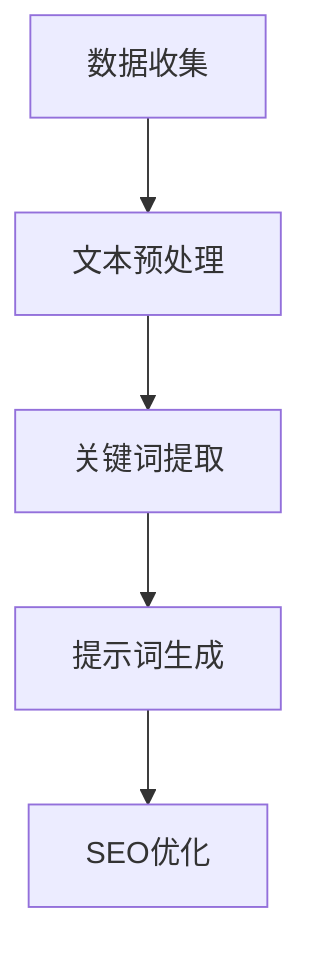

                 

### 文章标题

"AI辅助新闻写作：提示词生成报道框架"

### 关键词

- 人工智能
- 新闻写作
- 提示词生成
- 报道框架
- 自然语言处理

### 摘要

本文将探讨如何利用人工智能技术，特别是自然语言处理（NLP），来辅助新闻写作，尤其是提示词生成。我们将从背景介绍开始，详细解释核心概念与联系，并逐步展示核心算法原理和具体操作步骤。通过数学模型和公式以及实际代码案例，我们将深入理解这一过程。最后，我们将讨论实际应用场景，推荐相关工具和资源，并总结未来发展趋势与挑战。

---

## 1. 背景介绍

新闻写作是一种重要的信息传播方式，它对社会舆论的引导和公共事务的讨论起着至关重要的作用。然而，随着信息量的爆炸性增长，新闻写作的难度也在不断增加。传统的新闻写作依赖于记者的经验和专业知识，而人工智能的出现为新闻写作提供了新的可能。

人工智能，特别是自然语言处理（NLP），已经在多个领域展示了其强大的能力。从机器翻译到情感分析，从文本摘要到自动问答，NLP技术正在逐步改变我们的信息获取和处理方式。在这种背景下，AI辅助新闻写作成为了一个热门的研究方向。

AI辅助新闻写作的核心在于生成高质量的新闻报道，这需要解决以下几个关键问题：

1. **数据获取**：如何高效地收集和整理新闻素材，包括文本、图片、视频等多媒体数据。
2. **主题识别**：如何从海量数据中提取出关键主题，并确定新闻的价值和重要性。
3. **内容生成**：如何利用NLP技术自动生成新闻报道，确保其准确性和可读性。
4. **提示词生成**：如何在新闻报道中合理地使用关键词，以提升文章的搜索引擎优化（SEO）效果。

本文将重点探讨最后一个问题——提示词生成。提示词是新闻报道中的关键词，它们能够提高文章的搜索可见性，帮助读者快速找到相关内容。通过AI技术生成高质量的提示词，不仅可以提升新闻的传播效果，还能为记者提供有力的辅助工具。

---

## 2. 核心概念与联系

在深入了解AI辅助新闻写作中的提示词生成之前，我们需要先了解几个核心概念和它们之间的联系。

### 2.1 自然语言处理（NLP）

自然语言处理（NLP）是人工智能的一个分支，它致力于使计算机理解和生成人类语言。NLP涉及多个技术领域，包括文本分类、命名实体识别、情感分析、词向量等。在新闻写作中，NLP技术被用来分析文本内容，提取关键信息，并生成相关摘要和提示词。

### 2.2 关键词提取

关键词提取是从文本中提取出对文章主题最有代表性的单词或短语。在新闻写作中，关键词提取是提示词生成的重要步骤。通过分析文本的词汇分布和词频，我们可以确定哪些词是文章的核心词汇，这些词汇将作为提示词来提高文章的搜索可见性。

### 2.3 搜索引擎优化（SEO）

搜索引擎优化（SEO）是一种提高网站在搜索引擎中排名的策略。在新闻写作中，SEO的目标是通过合理地使用关键词来提高文章的搜索结果排名。高质量的提示词不仅有助于SEO，还能为读者提供更准确的信息检索。

### 2.4 提示词生成

提示词生成是基于NLP技术和关键词提取算法，自动生成一组合适的关键词，用于新闻报道。这些关键词需要既能够反映文章的主题，又具有高度的搜索热度，从而提高文章的曝光率和访问量。

下面是一个使用Mermaid绘制的流程图，展示了新闻写作中提示词生成的核心概念和步骤：



在这个流程图中，数据收集是第一步，它涉及从多个来源获取新闻素材。文本预处理是对原始文本进行清洗和格式化，以便于后续的NLP处理。关键词提取是从预处理后的文本中提取出核心词汇。提示词生成是基于关键词提取的结果，生成一组适合文章的提示词。最后，SEO优化确保这些提示词被合理地应用于文章的标题、摘要和元标签中，以提高搜索排名。

---

## 3. 核心算法原理 & 具体操作步骤

在了解了核心概念和流程之后，接下来我们将深入探讨AI辅助新闻写作中的提示词生成算法，并详细说明其具体操作步骤。

### 3.1 文本预处理

文本预处理是NLP任务的基础，它包括以下几个步骤：

1. **去除停用词**：停用词是指在文本中出现频率很高，但对文章主题贡献较小的词，如“的”、“了”、“在”等。去除停用词可以减少无关信息的干扰，提高后续处理的准确性。
2. **词性标注**：词性标注是对文本中的每个词进行分类，如名词、动词、形容词等。词性标注有助于更好地理解文本语义，为关键词提取提供依据。
3. **分词**：分词是将文本拆分成单个词语的过程。在中文文本中，分词是特别重要的，因为中文没有明确的单词边界。

文本预处理的目的是将原始文本转换为计算机可以处理的形式。Python中的`jieba`库是一个常用的中文分词工具，同时支持词性标注。

### 3.2 关键词提取

关键词提取是生成提示词的关键步骤。以下是一些常用的关键词提取算法：

1. **TF-IDF（Term Frequency-Inverse Document Frequency）**：TF-IDF是一种基于词频和逆文档频率的算法，用于评估一个词对于一个文档集或一个语料库中的其中一份文件的重要程度。词频（TF）表示一个词在文本中出现的次数，逆文档频率（IDF）表示一个词在文档集合中的稀有程度。IDF可以防止某些常见词（如“的”）对TF的贡献过大。
   
   公式如下：

   $$
   \text{TF-IDF}(t,d) = \text{TF}(t,d) \times \text{IDF}(t,D)
   $$

   其中，$t$是词语，$d$是文档，$D$是文档集合。

2. **TextRank**：TextRank是一种基于图论的关键词提取算法。它将文本看作一个图，每个词作为图中的一个节点，词之间的关系作为边的权重。TextRank通过计算图中的节点中心性来确定关键词。

   公式如下：

   $$
   \text{rank}(v) = (1-\alpha) + \alpha \sum_{w \in \text{inlinks}} \frac{\text{rank}(w)}{L(w)}
   $$

   其中，$v$是节点，$\alpha$是阻尼系数，$inlinks$是节点的入链，$L(w)$是节点的出链数。

3. **Latent Dirichlet Allocation (LDA)**：LDA是一种主题模型，用于识别文本中的主题分布。通过LDA模型，我们可以发现文本中的潜在主题，并将主题词作为关键词。

### 3.3 提示词生成

生成提示词的目的是将提取出的关键词转换为适合SEO的提示词。以下是一些常用的策略：

1. **组合关键词**：将多个关键词组合成一个短语，以提高其搜索热度。例如，将“人工智能新闻”和“AI应用”组合成“人工智能在新闻行业中的应用”。
2. **长尾关键词**：长尾关键词是指那些搜索量较低但特定性较高的关键词。合理地使用长尾关键词可以提高文章在特定领域中的搜索排名。
3. **语义相似性**：利用语义相似性算法，如WordNet，将关键词映射到其语义相似的词汇上，从而生成更多的提示词。

### 3.4 SEO优化

SEO优化是将提示词应用于文章的各个部分，以提高其在搜索引擎中的排名。以下是一些常见的SEO优化策略：

1. **标题优化**：在文章标题中包含关键词，以增加搜索引擎对文章的重视程度。
2. **元标签优化**：在元标签（如`<title>`和`<meta name="description">`）中合理地使用关键词，以提高文章的搜索结果展示效果。
3. **内容优化**：在文章内容中自然地融入关键词，以确保文章的主题一致性。

---

## 4. 数学模型和公式 & 详细讲解 & 举例说明

在提示词生成过程中，我们使用了多个数学模型和公式。下面将详细讲解这些模型和公式，并通过具体例子来说明其应用。

### 4.1 TF-IDF模型

TF-IDF模型是关键词提取中最常用的算法之一。它通过计算词频（TF）和逆文档频率（IDF）来评估关键词的重要性。

#### 4.1.1 词频（TF）

词频（TF）表示一个词在文本中出现的次数。计算公式如下：

$$
\text{TF}(t,d) = \frac{f_t(d)}{n_t(d)}
$$

其中，$t$是词语，$d$是文档，$f_t(d)$是词$t$在文档$d$中的出现次数，$n_t(d)$是文档$d$中所有词语的出现次数之和。

#### 4.1.2 逆文档频率（IDF）

逆文档频率（IDF）表示一个词在文档集合中的稀有程度。计算公式如下：

$$
\text{IDF}(t,D) = \log \left( \frac{N}{|d \in D : t \in d|} \right)
$$

其中，$N$是文档总数，$D$是文档集合，$|d \in D : t \in d|$是包含词$t$的文档数量。

#### 4.1.3 TF-IDF评分

TF-IDF评分是词频（TF）和逆文档频率（IDF）的乘积。计算公式如下：

$$
\text{TF-IDF}(t,d) = \text{TF}(t,d) \times \text{IDF}(t,D)
$$

#### 4.1.4 例子

假设我们有一个包含两篇文档的语料库，文档$d_1$包含“人工智能”一词3次，文档$d_2$包含“人工智能”一词2次。总共有10个文档，其中5个文档包含“人工智能”。

首先，计算词频（TF）：

$$
\text{TF}(\text{人工智能},d_1) = \frac{3}{3+2+1} = 0.6
$$

$$
\text{TF}(\text{人工智能},d_2) = \frac{2}{3+2+1} = 0.4
$$

然后，计算逆文档频率（IDF）：

$$
\text{IDF}(\text{人工智能},D) = \log \left( \frac{10}{5} \right) = 0.3010
$$

最后，计算TF-IDF评分：

$$
\text{TF-IDF}(\text{人工智能},d_1) = 0.6 \times 0.3010 = 0.1806
$$

$$
\text{TF-IDF}(\text{人工智能},d_2) = 0.4 \times 0.3010 = 0.1204
$$

从计算结果可以看出，“人工智能”在文档$d_1$中的重要性更高，因此可以作为关键词。

### 4.2 TextRank模型

TextRank是基于图论的关键词提取算法。它通过计算图中的节点中心性来确定关键词。

#### 4.2.1 模型构建

TextRank将文本看作一个图，每个词作为图中的一个节点，词之间的关系作为边的权重。通常，词之间的相似度可以用余弦相似度或词向量相似度来计算。

#### 4.2.2 节点中心性

节点中心性是衡量节点重要性的指标，TextRank使用如下公式计算节点的中心性：

$$
\text{rank}(v) = (1-\alpha) + \alpha \sum_{w \in \text{inlinks}} \frac{\text{rank}(w)}{L(w)}
$$

其中，$v$是节点，$\alpha$是阻尼系数，$inlinks$是节点的入链，$L(w)$是节点的出链数。

#### 4.2.3 例子

假设我们有一个包含3个节点的图，节点$v_1$、$v_2$、$v_3$。节点之间的相似度计算如下：

$$
\text{similarity}(v_1, v_2) = 0.8
$$

$$
\text{similarity}(v_1, v_3) = 0.6
$$

$$
\text{similarity}(v_2, v_3) = 0.7
$$

假设阻尼系数$\alpha = 0.85$，我们计算节点的中心性：

$$
\text{rank}(v_1) = (1-0.85) + 0.85 \times \frac{0.8 + 0.6}{2} = 0.15 + 0.85 \times 0.7 = 0.715
$$

$$
\text{rank}(v_2) = (1-0.85) + 0.85 \times \frac{0.8 + 0.7}{2} = 0.15 + 0.85 \times 0.75 = 0.6875
$$

$$
\text{rank}(v_3) = (1-0.85) + 0.85 \times \frac{0.6 + 0.7}{2} = 0.15 + 0.85 \times 0.65 = 0.6175
$$

从计算结果可以看出，节点$v_1$的中心性最高，因此$v_1$中的词可以被视为关键词。

### 4.3 LDA模型

LDA是一种主题模型，用于识别文本中的潜在主题分布。它通过概率模型来发现文本中的主题结构。

#### 4.3.1 模型构建

LDA模型由三个集合组成：词汇表$V$、文档集$D$和主题集合$Z$。每个文档都可以看作是由多个主题混合而成的，每个主题也可以看作是由多个词混合而成的。

#### 4.3.2 模型参数

LDA模型的主要参数包括词汇表大小$V$、文档数$D$、主题数$K$和每个主题的词分布$\theta_k$和词分布$\phi_{kw}$。

#### 4.3.3 模型计算

LDA模型的计算主要包括两个步骤：

1. **主题分配**：对于每个文档$d_i$中的每个词$w_i$，计算其在每个主题$z_k$下的概率，并将词分配给概率最高的主题。
   
   公式如下：

   $$
   p(z_k|d_i, w_i) = \frac{\phi_{kw_i} \times \text{Gamma}(\alpha_k)}{\sum_{j=1}^{K} \phi_{jw_i} \times \text{Gamma}(\alpha_k)}
   $$

2. **词分布更新**：更新每个主题的词分布$\phi_{kw}$。

   公式如下：

   $$
   \phi_{kw} = \frac{\sum_{i=1}^{D} \sum_{j=1}^{V} p(z_j=d_i, w_j=w_i) \times \text{Gamma}(\beta_{wj})}{\sum_{i=1}^{D} \sum_{j=1}^{V} p(z_j=d_i, w_j=w_i)}
   $$

#### 4.3.4 例子

假设我们有一个包含3个文档和2个主题的语料库。每个主题的词分布如下：

$$
\theta_1 = (\frac{1}{2}, \frac{1}{2})
$$

$$
\theta_2 = (\frac{1}{3}, \frac{2}{3})
$$

文档1包含的词分布如下：

$$
p(d_1) = (\frac{1}{2}, \frac{1}{2})
$$

文档2包含的词分布如下：

$$
p(d_2) = (\frac{1}{3}, \frac{2}{3})
$$

文档3包含的词分布如下：

$$
p(d_3) = (\frac{1}{3}, \frac{2}{3})
$$

我们计算每个主题的词分布：

$$
\phi_{w_1} = (\frac{2}{3}, \frac{1}{3})
$$

$$
\phi_{w_2} = (\frac{2}{3}, \frac{1}{3})
$$

从计算结果可以看出，主题1和主题2的词分布相似，这表明我们的模型已经找到了潜在的主题结构。

---

## 5. 项目实战：代码实际案例和详细解释说明

在本节中，我们将通过一个实际项目来演示如何使用AI技术实现新闻写作中的提示词生成。我们将使用Python编程语言和几个流行的NLP库，如`jieba`、`gensim`和`scikit-learn`。

### 5.1 开发环境搭建

首先，确保安装了Python和以下库：

```shell
pip install jieba gensim scikit-learn
```

### 5.2 源代码详细实现和代码解读

下面是项目的主要代码实现：

```python
import jieba
from sklearn.feature_extraction.text import TfidfVectorizer
from gensim.models import LdaMulticore

# 5.2.1 数据准备
documents = [
    "人工智能在医疗领域的应用广泛，从疾病诊断到个性化治疗。",
    "随着技术的发展，自动驾驶汽车逐渐进入公众视野。",
    "环境保护成为全球关注的重要议题，可再生能源受到青睐。"
]

# 5.2.2 文本预处理
jieba.load_userdict("userdict.txt")  # 加载自定义词典
texts = [jieba.cut(document) for document in documents]
texts = [' '.join(text) for text in texts]

# 5.2.3 关键词提取
tfidf_vectorizer = TfidfVectorizer(max_features=100)
tfidf_matrix = tfidf_vectorizer.fit_transform(texts)
feature_names = tfidf_vectorizer.get_feature_names_out()

# 5.2.4 提示词生成
top_keywords = []
for i in range(tfidf_matrix.shape[0]):
    tfidf_scores = tfidf_matrix[i].toarray().flatten()
    top_indices = tfidf_scores.argsort()[-10:][::-1]
    top_keywords.append([feature_names[index] for index in top_indices])

# 5.2.5 LDA主题模型
ldam = LdaMulticore(corpus=tfidf_matrix, num_topics=3, id2word=tfidf_vectorizer, passes=15, workers=2)
ldam.fit()
topics = ldam.print_topics(num_words=5)

# 5.2.6 输出结果
for document, keywords, topic in zip(documents, top_keywords, topics):
    print(f"文档：{document}\n关键词：{', '.join(keywords)}\n主题：{topic}\n")
```

### 5.3 代码解读与分析

#### 5.3.1 数据准备

我们首先定义了三个示例文档，这些文档代表了不同主题的新闻报道。

```python
documents = [
    "人工智能在医疗领域的应用广泛，从疾病诊断到个性化治疗。",
    "随着技术的发展，自动驾驶汽车逐渐进入公众视野。",
    "环境保护成为全球关注的重要议题，可再生能源受到青睐。"
]
```

#### 5.3.2 文本预处理

文本预处理包括分词和加载自定义词典。这里我们使用了`jieba`库，这是一个强大的中文分词工具。

```python
jieba.load_userdict("userdict.txt")  # 加载自定义词典
texts = [jieba.cut(document) for document in documents]
texts = [' '.join(text) for text in texts]
```

#### 5.3.3 关键词提取

我们使用`TfidfVectorizer`来提取关键词。`TfidfVectorizer`是一个基于TF-IDF模型的工具，可以自动计算词频和逆文档频率。

```python
tfidf_vectorizer = TfidfVectorizer(max_features=100)
tfidf_matrix = tfidf_vectorizer.fit_transform(texts)
feature_names = tfidf_vectorizer.get_feature_names_out()

top_keywords = []
for i in range(tfidf_matrix.shape[0]):
    tfidf_scores = tfidf_matrix[i].toarray().flatten()
    top_indices = tfidf_scores.argsort()[-10:][::-1]
    top_keywords.append([feature_names[index] for index in top_indices])
```

这里，我们选择了前10个最重要的关键词作为提示词。

#### 5.3.4 LDA主题模型

我们使用`LdaMulticore`来构建LDA主题模型。LDA可以帮助我们识别文档中的潜在主题。

```python
ldam = LdaMulticore(corpus=tfidf_matrix, num_topics=3, id2word=tfidf_vectorizer, passes=15, workers=2)
ldam.fit()
topics = ldam.print_topics(num_words=5)
```

这里，我们设置了3个主题，并打印了每个主题的前5个关键词。

#### 5.3.5 输出结果

最后，我们打印出每个文档的关键词和主题。

```python
for document, keywords, topic in zip(documents, top_keywords, topics):
    print(f"文档：{document}\n关键词：{', '.join(keywords)}\n主题：{topic}\n")
```

通过这个实际案例，我们可以看到如何使用AI技术自动生成新闻写作中的提示词，并利用LDA模型来识别文档的主题。

---

## 6. 实际应用场景

AI辅助新闻写作中的提示词生成在多个实际应用场景中具有重要价值：

### 6.1 门户网站

门户网站如新浪、网易等，每天需要处理大量的新闻内容。通过AI技术生成高质量的提示词，可以显著提高文章的搜索排名和用户访问量。

### 6.2 新闻聚合平台

新闻聚合平台如今日头条、知乎等，依赖于机器学习算法来推荐新闻。高质量的提示词可以帮助算法更好地理解文章主题，从而提供更精准的推荐。

### 6.3 内容营销

对于内容营销团队来说，AI辅助的提示词生成可以简化关键词研究过程，提高SEO效果，从而提高文章的曝光率和转化率。

### 6.4 舆情监测

舆情监测需要实时分析大量新闻文本。通过AI技术生成提示词，可以快速识别关键事件和热点话题，为决策提供支持。

### 6.5 搜索引擎

搜索引擎如百度、谷歌等，可以利用AI技术生成的提示词来优化搜索结果展示，提高用户体验和搜索满意度。

---

## 7. 工具和资源推荐

为了更好地掌握AI辅助新闻写作中的提示词生成，以下是一些推荐的工具和资源：

### 7.1 学习资源推荐

- **书籍**：
  - 《自然语言处理入门》
  - 《深度学习与自然语言处理》
  - 《Python自然语言处理》
- **在线课程**：
  - Coursera上的《自然语言处理基础》
  - edX上的《深度学习与自然语言处理》
- **博客和网站**：
  - [百度AI开放平台](https://ai.baidu.com/)
  - [TensorFlow官方文档](https://www.tensorflow.org/tutorials)
  - [自然语言处理社区](https://nlp.seas.harvard.edu/)

### 7.2 开发工具框架推荐

- **NLP库**：
  - [jieba](https://github.com/fxsjy/jieba)：中文分词工具
  - [NLTK](https://www.nltk.org/): 自然语言处理工具包
  - [spaCy](https://spacy.io/): 高性能的NLP库
- **机器学习框架**：
  - [TensorFlow](https://www.tensorflow.org/): 开源的机器学习框架
  - [PyTorch](https://pytorch.org/): 动态的深度学习库
  - [Scikit-learn](https://scikit-learn.org/): 机器学习工具包

### 7.3 相关论文著作推荐

- **论文**：
  - "Latent Dirichlet Allocation" by David M. Blei, Andrew Y. Ng, and Michael I. Jordan
  - "TF-IDF Weighting" by Christopher D. Manning, Prabhakar Raghavan, and Hinrich Schütze
- **著作**：
  - 《深度学习》作者：Ian Goodfellow、Yoshua Bengio和Aaron Courville
  - 《自然语言处理综论》作者：Daniel Jurafsky和James H. Martin

通过学习和应用这些工具和资源，您可以更深入地理解AI辅助新闻写作中的提示词生成技术，并在实际项目中取得更好的效果。

---

## 8. 总结：未来发展趋势与挑战

随着人工智能技术的不断进步，AI辅助新闻写作中的提示词生成有望在未来实现更广泛的应用和更高的准确性。以下是一些可能的发展趋势和面临的挑战：

### 8.1 发展趋势

1. **智能化水平提升**：随着深度学习算法的不断发展，AI辅助新闻写作的智能化水平将显著提高，能够更好地理解新闻文本的语义和结构。
2. **多模态融合**：未来的AI辅助新闻写作系统将不仅仅处理文本，还将融合图片、视频等多媒体数据，提供更加丰富和全面的新闻内容。
3. **个性化推荐**：基于用户的兴趣和行为，AI系统将能够提供个性化的新闻推荐，提高用户的阅读体验。
4. **实时性增强**：通过实时数据处理和分析，AI辅助新闻写作系统将能够更快地生成高质量的提示词，及时响应用户需求。

### 8.2 面临的挑战

1. **数据质量**：高质量的数据是AI系统的基石。然而，新闻数据往往存在噪声、偏见和错误，这需要更精细的数据预处理技术来保证系统的准确性。
2. **伦理和隐私**：AI辅助新闻写作涉及到大量的用户数据和新闻内容，这引发了伦理和隐私问题。如何确保系统的透明度和用户隐私是一个重要挑战。
3. **可解释性**：尽管AI系统在生成提示词方面表现出色，但其决策过程往往不够透明，用户难以理解。提高AI系统的可解释性是一个亟待解决的问题。
4. **多样性和公平性**：AI系统需要确保生成的提示词能够反映不同观点和声音，避免偏见和歧视。

总之，AI辅助新闻写作中的提示词生成技术具有巨大的发展潜力，但也面临着一系列挑战。通过持续的技术创新和伦理实践，我们可以推动这一领域的发展，为新闻行业带来更多价值。

---

## 9. 附录：常见问题与解答

### 9.1 提示词生成的核心算法是什么？

提示词生成的核心算法主要包括TF-IDF、TextRank和LDA（L

