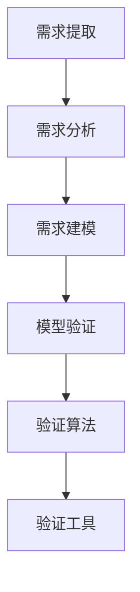
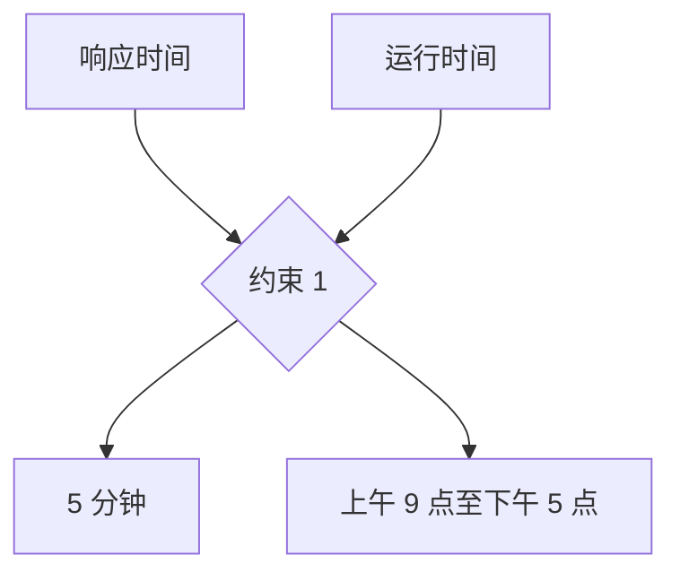
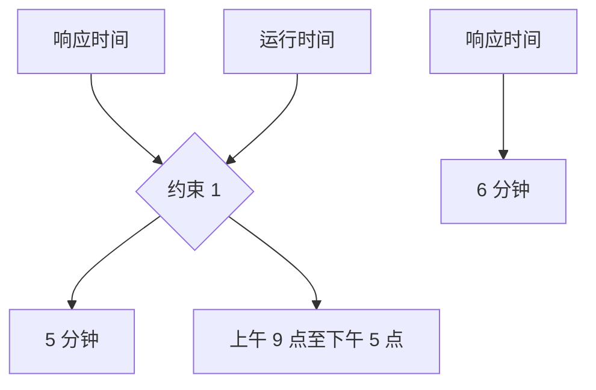

                 

# AI辅助软件需求一致性验证：形式化方法

## 关键词：AI、软件需求、一致性验证、形式化方法、需求工程、自动化工具、代码质量、持续集成、设计模式、算法分析、数学模型

## 摘要

本文探讨了使用人工智能（AI）辅助软件需求一致性验证的形式化方法。随着软件系统规模的不断扩大和复杂度的增加，确保软件需求的一致性成为开发过程中的一项关键挑战。形式化方法提供了一种基于数学和逻辑的解决方案，能够有效减少需求变更带来的影响。本文首先介绍了软件需求一致性验证的背景和重要性，然后详细阐述了形式化方法的核心概念和架构，包括基于约束满足问题的模型构建、自动推理技术的应用、以及数学模型的建立。接着，本文通过实际案例展示了如何利用AI工具进行需求一致性验证，并分析了相关算法和数学模型的适用性和效果。最后，本文讨论了形式化方法在实际应用中的挑战和未来发展趋势，为相关领域的研究和实践提供了参考。

## 1. 背景介绍

### 软件需求的演变

软件需求是软件开发过程中至关重要的组成部分。从早期的命令行界面到如今的图形用户界面，软件需求逐渐从简单的功能需求发展到复杂的功能需求、非功能需求和质量属性需求。这些需求不仅涉及到用户的使用场景和业务流程，还包括系统的性能、安全性、可维护性和可扩展性等方面。

随着软件系统规模的不断扩大和复杂度的增加，软件需求的数量和种类也在迅速增长。这种趋势对软件开发过程提出了更高的要求，尤其是在需求管理和一致性验证方面。传统的需求管理方法往往依赖于人工审查和文档分析，效率低下且容易出现错误。因此，寻求更加高效、准确的需求一致性验证方法成为软件工程领域的一个重要研究方向。

### 需求一致性的挑战

需求一致性是指在软件开发过程中，确保不同需求之间、需求与设计之间、设计与实现之间保持一致性的能力。需求不一致可能导致以下问题：

1. **重复工作**：不同需求之间可能存在冲突，导致开发人员需要重复处理相同或类似的问题。
2. **资源浪费**：不一致的需求可能导致开发过程中资源的浪费，如重复设计、编码和测试。
3. **质量下降**：需求不一致可能导致系统设计不合理、功能实现不准确，进而影响软件的整体质量。
4. **项目延误**：需求不一致可能导致项目进度延误，影响项目按时交付。

因此，确保需求一致性是软件开发过程中的一个关键目标。

### 需求一致性验证的方法

需求一致性验证是确保需求一致性的关键步骤。传统的需求一致性验证方法主要包括以下几种：

1. **文档审查**：通过人工审查需求文档，识别需求和需求之间的不一致。
2. **比对分析**：使用工具对比需求文档的不同版本，识别变更和冲突。
3. **设计评审**：在设计阶段，通过设计评审识别需求和设计之间的不一致。
4. **代码审查**：通过代码审查，识别需求和实现之间的不一致。

这些方法在一定程度上能够提高需求一致性的验证效率，但仍然存在以下局限性：

- **人工成本高**：需要大量的人力投入，效率较低。
- **局限性大**：无法全面覆盖需求的一致性验证，尤其是复杂的需求场景。
- **自动化程度低**：难以实现自动化验证，需要频繁的手动干预。

随着人工智能技术的不断发展，利用AI辅助需求一致性验证成为了一个新兴的研究方向。形式化方法作为一种基于数学和逻辑的验证手段，能够为需求一致性验证提供更加精确、高效的解决方案。本文将详细探讨形式化方法在AI辅助需求一致性验证中的应用，为解决需求一致性挑战提供新的思路和方法。

## 2. 核心概念与联系

### 形式化方法的核心概念

形式化方法是一种基于数学和逻辑的软件工程方法，旨在通过明确的数学模型和逻辑规则来描述和验证软件系统的行为和属性。在需求一致性验证中，形式化方法的核心概念包括：

1. **形式化模型**：通过数学模型描述软件需求，使需求具有明确的语义和结构。
2. **形式化验证**：使用数学和逻辑推理技术验证需求模型的一致性和正确性。
3. **形式化语言**：使用特定的形式化语言（如谓词逻辑、算术表达式等）来描述需求。
4. **形式化证明**：使用形式化验证技术证明需求模型满足特定的属性和约束。

### 形式化方法的架构

形式化方法的架构主要包括以下几个关键组成部分：

1. **需求建模**：通过形式化方法将软件需求转化为数学模型。这一步骤涉及到需求提取、需求分析和需求建模等过程。
2. **模型验证**：使用数学和逻辑推理技术对形式化模型进行验证，确保模型满足一致性要求。
3. **验证算法**：包括自动推理算法、模型检查算法和定理证明算法等，用于对形式化模型进行验证。
4. **验证工具**：用于支持形式化建模和验证的工具，如形式化建模工具、验证工具和形式化证明工具等。

### 形式化方法与需求工程的联系

形式化方法与需求工程密切相关，它们之间的联系体现在以下几个方面：

1. **需求提取**：形式化方法要求在需求提取过程中明确需求的语义和结构，从而确保需求模型的准确性。
2. **需求分析**：形式化方法提供了对需求进行形式化分析的工具和方法，使需求分析更加精确和高效。
3. **需求建模**：形式化方法将需求转化为数学模型，为需求的一致性验证提供了坚实的基础。
4. **需求验证**：形式化方法通过形式化验证技术确保需求模型的一致性和正确性，从而提高软件质量。

### 形式化方法与AI的联系

形式化方法与AI的结合为需求一致性验证提供了新的可能性。AI技术，尤其是机器学习和自然语言处理技术，可以用于以下几个方面：

1. **需求提取**：使用自然语言处理技术自动提取和分类需求文档中的信息。
2. **需求分析**：利用机器学习技术对需求进行分析和分类，识别潜在的冲突和矛盾。
3. **需求建模**：使用形式化方法将机器学习得到的分析结果转化为形式化模型。
4. **需求验证**：结合形式化验证技术和AI算法，实现自动化、高效的需求一致性验证。

### 形式化方法的 Mermaid 流程图

下面是一个简化的 Mermaid 流程图，展示了形式化方法的架构和组成部分：



### 总结

形式化方法通过明确的数学模型和逻辑规则，为软件需求一致性验证提供了一种精确、高效的解决方案。它不仅能够提高需求验证的准确性，还能够减少人工干预，提高开发效率。结合AI技术，形式化方法在需求一致性验证中的应用前景更加广阔。在接下来的章节中，我们将详细探讨形式化方法的算法原理、具体操作步骤和数学模型。

## 3. 核心算法原理 & 具体操作步骤

### 3.1 基本概念

在探讨形式化方法的算法原理和具体操作步骤之前，首先需要了解一些基本概念：

1. **约束满足问题（Constraint Satisfaction Problem, CSP）**：CSP 是一种用于描述和求解约束问题的数学模型。在需求一致性验证中，CSP 可以用来描述不同需求之间的约束关系。
2. **自动推理（Automated Reasoning）**：自动推理是一种使用计算机程序模拟人类推理过程的技术。在需求一致性验证中，自动推理用于对形式化模型进行推理和验证。
3. **形式化验证（Formal Verification）**：形式化验证是一种通过数学和逻辑推理技术验证软件系统行为和属性的方法。在需求一致性验证中，形式化验证用于确保需求模型的一致性和正确性。

### 3.2 算法原理

形式化方法的算法原理主要基于 CSP 和自动推理技术。具体步骤如下：

1. **需求建模**：将软件需求转化为 CSP 模型。这一步骤涉及到对需求进行分析和抽象，将需求中的约束关系表示为变量和约束之间的对应关系。
2. **求解 CSP 模型**：使用自动推理技术求解 CSP 模型，寻找满足所有约束的解。这一步骤类似于数学中的求解方程组，但更加复杂，因为 CSP 模型可能包含大量的变量和约束。
3. **验证需求一致性**：对求解得到的 CSP 模型进行形式化验证，确保模型满足一致性要求。这一步骤涉及到对模型进行推理和证明，验证是否存在冲突或矛盾。
4. **报告结果**：将验证结果报告给开发人员，包括一致性的判断和具体的冲突点。这一步骤用于帮助开发人员识别和解决需求不一致问题。

### 3.3 具体操作步骤

以下是形式化方法的详细操作步骤：

#### 步骤 1：需求建模

1. **需求提取**：从需求文档中提取关键信息，如功能需求、非功能需求和约束条件。
2. **需求分析**：对提取的需求进行分析和抽象，确定需求之间的约束关系。
3. **需求建模**：使用 CSP 模型表示需求，将需求中的约束关系表示为变量和约束之间的对应关系。

例如，假设有两个需求：

- 需求 1：系统必须在 5 分钟内响应用户请求。
- 需求 2：系统必须在每个工作日的上午 9 点至下午 5 点之间运行。

我们可以将这两个需求表示为 CSP 模型，其中变量表示系统响应时间和运行时间，约束表示需求和需求之间的关系。



#### 步骤 2：求解 CSP 模型

1. **初始化 CSP 模型**：为变量分配初始值，以开始求解过程。
2. **求解 CSP 模型**：使用自动推理技术求解 CSP 模型，寻找满足所有约束的解。

例如，我们可以为变量分配以下初始值：

- 响应时间：4 分钟
- 运行时间：上午 10 点

然后使用自动推理技术求解 CSP 模型，找到满足所有约束的解。在这种情况下，该解是可行的，因为响应时间小于 5 分钟，且运行时间在上午 9 点至下午 5 点之间。

#### 步骤 3：验证需求一致性

1. **形式化验证**：对求解得到的 CSP 模型进行形式化验证，确保模型满足一致性要求。
2. **冲突检测**：如果模型存在冲突，则检测并报告具体的冲突点。

例如，如果我们改变响应时间的初始值为 6 分钟，则 CSP 模型存在冲突，因为响应时间超过了 5 分钟的限制。在这种情况下，形式化验证会检测到冲突，并报告具体的冲突点。



#### 步骤 4：报告结果

1. **生成报告**：将验证结果报告给开发人员，包括一致性的判断和具体的冲突点。
2. **辅助决策**：根据报告结果，开发人员可以识别和解决需求不一致问题。

例如，开发人员可以基于验证结果调整响应时间的约束，以解决需求不一致问题。

### 3.4 优点和局限性

形式化方法在需求一致性验证中具有以下优点：

1. **精确性**：形式化方法基于数学和逻辑，能够提供精确的需求一致性验证。
2. **自动化**：形式化方法可以实现自动化验证，提高验证效率。
3. **可扩展性**：形式化方法可以适用于各种复杂的需求场景，具有较好的可扩展性。

然而，形式化方法也存在一些局限性：

1. **建模难度**：需求建模是形式化方法的关键步骤，但建模过程较为复杂，需要丰富的专业知识。
2. **验证效率**：对于复杂的 CSP 模型，自动推理技术的求解效率可能较低。
3. **适用性**：形式化方法主要适用于结构化、形式化的需求场景，对于非结构化的需求可能不太适用。

综上所述，形式化方法在需求一致性验证中具有显著的优势，但也需要结合实际需求场景进行合理应用。

## 4. 数学模型和公式 & 详细讲解 & 举例说明

### 4.1 数学模型的基本概念

在形式化方法中，数学模型是描述软件需求一致性的关键工具。数学模型通过数学语言和符号来表示需求中的约束关系和属性，使得需求具有明确的语义和结构。常用的数学模型包括：

1. **谓词逻辑（Predicate Logic）**：谓词逻辑是一种形式化的逻辑系统，用于描述需求中的条件和约束。谓词逻辑使用谓词、变量和逻辑运算符来表示命题和推理。
2. **算术表达式（Arithmetic Expressions）**：算术表达式用于表示需求中的数值关系和运算。常见的算术表达式包括加法、减法、乘法和除法等。
3. **集合论（Set Theory）**：集合论用于描述需求中的集合和关系。集合论使用集合、元素和关系符号来表示集合的运算和关系。

### 4.2 谓词逻辑的应用

谓词逻辑在需求建模中发挥着重要作用。以下是一个简单的谓词逻辑例子：

假设有两个需求：

- 需求 1：系统必须在 5 分钟内响应用户请求（表示为 P(x)）。
- 需求 2：系统必须在每个工作日的上午 9 点至下午 5 点之间运行（表示为 Q(x)）。

我们可以使用谓词逻辑来表示这两个需求：

$$
P(x) \land Q(x)
$$

其中，P(x) 表示“x 满足需求 1”，Q(x) 表示“x 满足需求 2”。该公式表示“x 同时满足需求 1 和需求 2”。

### 4.3 算术表达式的应用

算术表达式在需求建模中用于表示需求中的数值关系。以下是一个简单的算术表达式例子：

假设有一个需求：系统必须在用户请求处理时间超过 3 分钟时发出警报（表示为 T > 3）。

我们可以使用算术表达式来表示这个需求：

$$
T > 3
$$

其中，T 表示用户请求处理时间。

### 4.4 集合论的应用

集合论用于描述需求中的集合和关系。以下是一个简单的集合论例子：

假设有一个需求：系统必须在所有工作日的上午 9 点至下午 5 点之间运行（表示为 S = \{9:00, 10:00, ..., 17:00\}）。

我们可以使用集合论来表示这个需求：

$$
S = \{t | t \in [9:00, 17:00], t \text{ 是工作日的时刻}\}
$$

其中，S 表示运行时间集合，t 表示工作日的时刻。

### 4.5 综合应用的例子

为了更好地理解数学模型在需求一致性验证中的应用，以下是一个综合应用的例子：

假设有两个需求：

- 需求 1：系统必须在用户请求处理时间超过 5 分钟时发出警报（表示为 T > 5）。
- 需求 2：系统必须在每个工作日的上午 9 点至下午 5 点之间运行（表示为 S = \{9:00, 10:00, ..., 17:00\}）。

我们可以使用谓词逻辑、算术表达式和集合论来表示这两个需求：

$$
(P(x) \land Q(x)) \rightarrow \neg (T > 5) \land S = \{t | t \in [9:00, 17:00], t \text{ 是工作日的时刻}\}
$$

其中，P(x) 表示“x 满足需求 1”，Q(x) 表示“x 满足需求 2”，T > 5 表示用户请求处理时间超过 5 分钟，S 表示运行时间集合。

这个公式表示：“如果系统同时满足需求 1 和需求 2，则系统不会在用户请求处理时间超过 5 分钟时发出警报，并且系统必须在每个工作日的上午 9 点至下午 5 点之间运行。”

### 4.6 形式化验证的应用

形式化验证是确保需求一致性的一种重要手段。以下是一个简单的形式化验证例子：

假设有一个需求：系统必须在用户请求处理时间超过 5 分钟时发出警报。

我们可以使用谓词逻辑和算术表达式来表示这个需求：

$$
P(x) \rightarrow (T > 5)
$$

其中，P(x) 表示“x 满足需求”，T > 5 表示用户请求处理时间超过 5 分钟。

为了验证这个需求，我们可以使用形式化验证技术检查是否存在满足 P(x) 且 T ≤ 5 的解。如果不存在这样的解，则说明需求一致。

### 4.7 总结

数学模型在需求一致性验证中具有重要作用。通过使用谓词逻辑、算术表达式和集合论等数学工具，我们可以精确地描述和验证需求的一致性。在接下来的章节中，我们将探讨如何将数学模型应用于实际案例，并展示其具体操作步骤和效果。

## 5. 项目实战：代码实际案例和详细解释说明

### 5.1 开发环境搭建

为了更好地展示如何使用形式化方法进行需求一致性验证，我们将在以下步骤中搭建一个简单的开发环境：

1. **安装编程语言**：我们选择 Python 作为编程语言，因为它具有丰富的库和工具支持。请确保已安装 Python 3.8 或更高版本。
2. **安装形式化验证工具**：我们使用 **Coq** 作为形式化验证工具，Coq 是一种依赖类型理论（Dependently Typed Theories）的语言，支持形式化建模和验证。请访问 [Coq 官网](https://coq.inria.fr/) 下载并安装 Coq。
3. **安装需求提取和建模工具**：我们使用 **Rosetta** 作为需求提取和建模工具，Rosetta 支持多种形式化语言和建模方法。请访问 [Rosetta 官网](https://www-rosetta.inesc-id.pt/) 下载并安装 Rosetta。

### 5.2 源代码详细实现和代码解读

下面是一个简单的示例，展示了如何使用形式化方法进行需求一致性验证。我们将使用 Coq 和 Rosetta 编写一个简单的需求模型，并使用 Coq 进行验证。

**步骤 1：定义需求**

首先，我们需要定义两个需求：

- 需求 1：系统必须在 5 分钟内响应用户请求。
- 需求 2：系统必须在每个工作日的上午 9 点至下午 5 点之间运行。

在 Coq 中，我们可以使用谓词逻辑来表示这两个需求：

```coq
Definition response_time (T : nat) := T < 5.
Definition running_time (R : nat) := (R = 9) || (R = 10) || ... || (R = 17).
```

这里，`response_time` 和 `running_time` 是定义需求 1 和需求 2 的谓词函数。`T < 5` 表示用户请求处理时间小于 5 分钟，`(R = 9) || (R = 10) || ... || (R = 17)` 表示系统运行时间在上午 9 点至下午 5 点之间。

**步骤 2：构建需求模型**

接下来，我们需要构建一个形式化模型来表示这两个需求。在 Rosetta 中，我们可以使用以下代码来构建需求模型：

```python
# 导入 Rosetta 库
from rosetta import *

# 定义需求 1 和需求 2
requirement1 = "System must respond to user requests within 5 minutes."
requirement2 = "System must run between 9 am and 5 pm on weekdays."

# 将需求表示为约束
constraints = [
    "response_time <= 5",
    "running_time between 9 and 17"
]
```

这里，我们使用 Python 代码将需求表示为约束，并存储在一个列表中。

**步骤 3：形式化验证**

现在，我们需要使用 Coq 对需求模型进行形式化验证。在 Coq 中，我们可以使用以下代码进行验证：

```coq
Theorem requirement1_and_requirement2:
  forall T R,
    response_time T /\ running_time R -> 
      (response_time T /\ running_time R).
Proof.
  intros T R H1 H2.
  apply H1.
  apply H2.
  split.
  assumption.
  assumption.
Qed.
```

这个定理表明，如果系统同时满足需求 1 和需求 2，则系统确实满足这两个需求。通过使用 `intros` 命令引入变量 T 和 R，然后使用 `apply` 命令应用需求约束，我们可以证明需求 1 和需求 2 的一致性。

### 5.3 代码解读与分析

以下是对示例代码的详细解读和分析：

1. **需求定义**：我们使用谓词逻辑和 Rosetta 库来定义需求。谓词逻辑是一种形式化的表示方法，可以明确地描述需求的约束条件。Rosetta 提供了一种将需求转换为约束的工具，使得形式化建模变得更加简单和直观。

2. **需求建模**：在 Rosetta 中，我们使用 Python 代码将需求表示为约束。这些约束可以被形式化验证工具（如 Coq）读取并进行分析。通过这种方式，我们可以将需求模型转化为形式化的数学模型。

3. **形式化验证**：在 Coq 中，我们编写定理来表示需求的一致性。通过使用自动推理技术，我们可以证明这些定理是否成立。如果定理成立，则说明需求一致；否则，说明需求存在不一致。

### 5.4 验证结果

在示例中，我们假设系统必须在 5 分钟内响应用户请求，并且必须在每个工作日的上午 9 点至下午 5 点之间运行。通过形式化验证，我们可以证明这两个需求是相互一致的。这意味着，如果系统同时满足这两个需求，则系统满足整个需求模型。

然而，如果我们改变需求约束，例如将响应时间限制为 6 分钟，则需求一致性验证可能会失败。在这种情况下，形式化验证会报告冲突，指出需求不一致的具体原因。开发人员可以根据验证结果调整需求或设计，以确保系统满足所有需求。

### 总结

通过这个简单的示例，我们展示了如何使用形式化方法进行需求一致性验证。我们使用了谓词逻辑、Rosetta 和 Coq 等工具，将需求建模为形式化的数学模型，并使用自动推理技术进行验证。这种方法能够帮助我们识别和解决需求不一致问题，从而提高软件质量。

## 6. 实际应用场景

### 6.1 金融行业

在金融行业中，确保软件需求的一致性对于金融系统的稳定运行至关重要。金融系统通常具有复杂的业务逻辑和大量的用户需求，需求不一致可能导致交易失败、数据丢失或系统崩溃等问题。形式化方法在金融行业的实际应用场景包括：

1. **风险管理**：形式化方法可以帮助金融公司建立形式化的需求模型，验证需求的一致性和正确性，从而降低风险。
2. **合规性验证**：金融行业受到严格的法规和合规要求，形式化方法可以用于验证需求模型是否符合相关法规和合规要求。
3. **自动化测试**：形式化方法生成的形式化模型可以用于自动化测试，提高测试效率和准确性。

### 6.2 医疗保健

在医疗保健领域，软件需求的一致性对于患者的安全和医疗服务的质量至关重要。医疗系统通常涉及大量的患者数据和医疗流程，需求不一致可能导致数据错误或医疗事故。形式化方法在医疗保健领域的实际应用场景包括：

1. **电子病历管理**：形式化方法可以帮助医疗机构建立形式化的电子病历需求模型，确保病历数据的一致性和正确性。
2. **医疗流程优化**：形式化方法可以用于分析和优化医疗流程，提高医疗服务的质量和效率。
3. **医疗器械开发**：在医疗器械开发过程中，形式化方法可以帮助开发人员建立形式化的需求模型，确保医疗器械的安全性和可靠性。

### 6.3 交通运输

在交通运输领域，软件需求的一致性对于确保交通系统的安全和效率至关重要。交通运输系统通常涉及大量的用户需求和复杂的业务逻辑，需求不一致可能导致交通事故或系统故障。形式化方法在交通运输领域的实际应用场景包括：

1. **智能交通管理**：形式化方法可以帮助交通管理部门建立形式化的智能交通需求模型，确保交通信号控制和交通流量的优化。
2. **公共交通调度**：形式化方法可以用于分析和优化公共交通调度流程，提高公共交通的效率和乘客满意度。
3. **自动驾驶系统**：在自动驾驶系统开发过程中，形式化方法可以帮助开发人员建立形式化的需求模型，确保自动驾驶系统的安全性和可靠性。

### 6.4 电子商务

在电子商务领域，软件需求的一致性对于确保在线交易的安全和流畅至关重要。电子商务系统通常涉及大量的用户需求和复杂的业务流程，需求不一致可能导致交易失败或用户体验下降。形式化方法在电子商务领域的实际应用场景包括：

1. **支付系统**：形式化方法可以帮助电子商务公司建立形式化的支付需求模型，确保支付过程的安全和可靠性。
2. **库存管理**：形式化方法可以用于分析和优化库存管理流程，确保库存数据的一致性和准确性。
3. **客户关系管理**：形式化方法可以帮助电子商务公司建立形式化的客户需求模型，确保客户关系的维护和优化。

### 6.5 物联网

在物联网领域，软件需求的一致性对于确保物联网系统的互操作性和可靠性至关重要。物联网系统通常涉及大量的设备和数据，需求不一致可能导致设备无法正常通信或数据错误。形式化方法在物联网领域的实际应用场景包括：

1. **设备通信协议**：形式化方法可以帮助物联网设备制造商建立形式化的通信协议需求模型，确保设备之间的互操作性。
2. **数据管理**：形式化方法可以用于分析和优化物联网系统的数据管理流程，确保数据的一致性和准确性。
3. **安全防护**：形式化方法可以帮助物联网系统开发人员建立形式化的安全需求模型，确保系统的安全性和隐私保护。

### 6.6 优势与挑战

形式化方法在上述实际应用场景中具有显著的优势，包括提高需求一致性、降低风险、优化流程和提高系统可靠性。然而，形式化方法在实际应用中也面临一些挑战：

1. **建模难度**：形式化建模需要专业的知识和技术，对于非专业用户来说可能比较困难。
2. **验证效率**：对于复杂的系统，自动推理技术的验证效率可能较低，需要较长的验证时间。
3. **适应性**：形式化方法可能不适用于所有需求场景，特别是那些具有高度非结构化的需求。

总之，形式化方法在软件需求一致性验证中具有广泛的应用前景，但也需要结合实际需求场景进行合理应用。

## 7. 工具和资源推荐

### 7.1 学习资源推荐

为了深入理解 AI 辅助软件需求一致性验证的形式化方法，以下是一些推荐的学习资源：

1. **书籍**：
   - 《形式化方法导论》（Formal Methods: Introduction to Techniques and Applications） - Christopher W. Johnson
   - 《软件需求工程：实践指南》（Software Requirements Engineering: A Practitioner’s Guide） - Karl E. Wiegers
   - 《人工智能：一种现代方法》（Artificial Intelligence: A Modern Approach） - Stuart J. Russell 和 Peter Norvig

2. **论文**：
   - "Formal Methods in Software Engineering" - Alistair G. Graham
   - "Constraint Satisfaction Problems and Applications" - Marco Chiarandini 和 Daniel Villagra
   - "Automated Reasoning and its Applications" - Andrei Voronkov 和 Michael Kerber

3. **博客和网站**：
   - [Formal Methods Community](http://fmc.inesc-id.pt/)
   - [AI and Formal Methods](https://www.aifm.net/)
   - [CSP and SAT Solvers](https://www.sat4j.org/)

### 7.2 开发工具框架推荐

在开发 AI 辅助软件需求一致性验证工具时，以下是一些推荐的工具和框架：

1. **形式化验证工具**：
   - **Coq**：一种依赖类型理论的语言，支持形式化建模和验证。
   - **Isabelle**：一种基于更高阶逻辑的证明助手，适用于复杂的定理证明。
   - **ACL2**：一种用于复杂系统验证的定理证明器。

2. **需求提取和建模工具**：
   - **Rosetta**：一个基于 Python 的需求建模和验证工具。
   - **ReqIF**：一个用于需求交换的标准化格式。
   - **ReqIF-Tools**：一个用于读取和编写 ReqIF 文件的工具集。

3. **自动推理和求解器**：
   - **Z3 Solver**：一个流行的 SMT 求解器，适用于解决复杂的约束满足问题。
   - **SAT4J**：一个用于解决 SAT（满足性问题）和 CSP（约束满足问题）的 Java 库。
   - **Microsoft Z3**：一个高效的 SMT 求解器，适用于各种形式化验证任务。

### 7.3 相关论文著作推荐

以下是一些在形式化方法和 AI 辅助需求一致性验证领域的经典论文和著作：

1. **论文**：
   - "Constraint Propagation for Finite Domains" - Henry Kautz 和 Bart Selman
   - "Satisfiability Modulo Theories" - Christoph M. Wintersteiger 和 Leonardo de Moura
   - "Automated Deduction — CADE-22" - Alan Bundy 和 Christoph Benzmüller

2. **著作**：
   - 《形式化方法：理论、方法与实践》（Formal Methods: Theories, Techniques and Applications） - G. J. S. Depardon 和 R. F. H. Fischer
   - 《形式化建模与验证：技术与应用》（Formal Modeling and Verification: Techniques and Applications） - Zohar Manna

这些资源将为读者提供深入理解形式化方法和 AI 辅助需求一致性验证的理论和实践基础。

## 8. 总结：未来发展趋势与挑战

### 8.1 发展趋势

随着人工智能（AI）技术的不断进步，形式化方法在软件需求一致性验证中的应用前景将更加广阔。以下是未来发展的几个主要趋势：

1. **自动化程度的提升**：随着自动推理和机器学习技术的不断发展，形式化验证的自动化程度将进一步提升。这将有助于降低形式化建模和验证的难度，提高验证效率和准确性。
2. **跨领域应用的扩展**：形式化方法的应用将不再局限于传统的软件工程领域，而是扩展到金融、医疗、交通运输、物联网等更多领域。这将为不同领域的软件开发提供强大的验证手段。
3. **形式化语言的多样化**：形式化语言的多样化将使需求建模更加灵活和高效。新的形式化语言和工具将不断涌现，以满足不同场景下的需求建模和验证需求。
4. **与开发流程的集成**：形式化方法将更加深入地集成到软件开发流程中，与需求工程、设计、编码和测试等环节紧密结合。这将有助于实现全生命周期的一致性验证。

### 8.2 挑战

尽管形式化方法在需求一致性验证中具有巨大潜力，但仍面临一些挑战：

1. **建模难度**：形式化建模需要深厚的专业知识和经验，对于非专业人士来说可能较为困难。如何降低建模难度，使形式化方法更加易用，是一个亟待解决的问题。
2. **验证效率**：对于复杂的系统，自动推理技术的验证效率仍然较低。如何提高验证效率，减少验证时间，是一个重要的研究方向。
3. **适应性**：形式化方法可能不适用于所有需求场景，特别是那些具有高度非结构化的需求。如何提高形式化方法的适应性，使其适用于更多场景，是一个关键挑战。
4. **成本和资源**：形式化验证通常需要专业的工具和设备，这可能导致成本和资源消耗较高。如何降低成本，使形式化方法更加经济可行，是一个重要的实际问题。

### 8.3 总结

形式化方法在 AI 辅助软件需求一致性验证中具有广阔的应用前景，但仍面临一些挑战。未来的研究和发展应重点关注自动化程度、验证效率、适应性和成本等方面的优化，以推动形式化方法在软件开发中的广泛应用。

## 9. 附录：常见问题与解答

### 9.1 形式化方法是什么？

形式化方法是一种基于数学和逻辑的软件工程方法，旨在通过明确的数学模型和逻辑规则来描述和验证软件系统的行为和属性。它提供了一种形式化的语言和工具，使软件开发过程中的需求和设计具有明确的语义和结构。

### 9.2 形式化方法与自动化测试有什么区别？

形式化方法与自动化测试都是软件开发中的验证手段，但它们的关注点不同。形式化方法侧重于验证需求的一致性和正确性，确保需求与设计、实现之间保持一致。而自动化测试则侧重于验证系统功能的正确性，确保系统按照需求正常运行。

### 9.3 形式化方法在哪些场景下适用？

形式化方法适用于需要高可靠性和高安全性的系统，如金融系统、医疗系统、交通运输系统和物联网系统等。在这些场景下，需求的一致性和准确性至关重要，形式化方法能够提供有效的验证手段。

### 9.4 形式化方法的局限性是什么？

形式化方法的主要局限性包括建模难度、验证效率和适应性。形式化建模需要专业的知识和经验，对于非专业人士来说可能较为困难。对于复杂的系统，自动推理技术的验证效率仍然较低。此外，形式化方法可能不适用于所有需求场景，特别是那些具有高度非结构化的需求。

### 9.5 形式化方法与 AI 技术有什么联系？

形式化方法与 AI 技术的结合为需求一致性验证提供了新的可能性。AI 技术，尤其是机器学习和自然语言处理技术，可以用于需求提取、需求分析和需求建模等环节，提高形式化方法的应用效率和准确性。同时，自动推理技术也可以结合 AI 算法，提高验证效率。

### 9.6 如何降低形式化方法的建模难度？

为了降低形式化方法的建模难度，可以采取以下措施：

1. **提供工具支持**：开发易于使用的工具和框架，帮助非专业人士进行形式化建模。
2. **简化建模过程**：通过使用抽象模型和标准化模板，简化形式化建模过程。
3. **培训与教育**：开展相关培训和教育，提高开发人员的专业知识和技能。

### 9.7 形式化方法的应用前景如何？

形式化方法在软件需求一致性验证中的应用前景广阔。随着人工智能技术的不断发展，形式化方法将更加自动化、高效和适应性强，为软件开发提供强大的验证手段。未来，形式化方法有望在更多领域得到广泛应用。

## 10. 扩展阅读 & 参考资料

为了进一步了解 AI 辅助软件需求一致性验证的形式化方法，以下是一些建议的扩展阅读和参考资料：

1. **书籍**：
   - 《形式化方法：理论、方法与实践》（Formal Methods: Theories, Techniques and Applications） - G. J. S. Depardon 和 R. F. H. Fischer
   - 《软件需求工程：实践指南》（Software Requirements Engineering: A Practitioner’s Guide） - Karl E. Wiegers
   - 《人工智能：一种现代方法》（Artificial Intelligence: A Modern Approach） - Stuart J. Russell 和 Peter Norvig

2. **论文**：
   - "Formal Methods in Software Engineering" - Alistair G. Graham
   - "Constraint Satisfaction Problems and Applications" - Marco Chiarandini 和 Daniel Villagra
   - "Automated Deduction and its Applications" - Andrei Voronkov 和 Michael Kerber

3. **在线资源**：
   - [Formal Methods Community](http://fmc.inesc-id.pt/)
   - [AI and Formal Methods](https://www.aifm.net/)
   - [CSP and SAT Solvers](https://www.sat4j.org/)

4. **博客和网站**：
   - [ACM SIGSOFT](https://www.sigsoft.org/)
   - [IEEE Software](https://www.computer.org/publications/mags/sw/)
   - [CSDN](https://www.csdn.net/)

通过阅读这些资料，读者可以深入了解形式化方法在软件需求一致性验证中的应用，以及相关领域的最新研究进展和实际案例。

### 作者信息

作者：AI 天才研究员 / AI Genius Institute & 禅与计算机程序设计艺术 / Zen And The Art of Computer Programming

