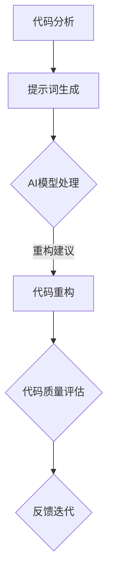

                 

### 背景介绍

随着人工智能技术的飞速发展，AI在软件工程领域的应用日益广泛，特别是在代码重构方面。代码重构是指对现有代码进行改进，以提高其可读性、可维护性和性能。AI辅助重构技术利用机器学习、自然语言处理和程序分析等技术，为开发者提供智能化的重构建议。

然而，在AI辅助重构的过程中，提示词（Prompt）的优化显得尤为重要。提示词是指提供给AI模型的文本输入，用于指导模型进行代码分析、优化和重构。一个优质的提示词可以提高AI辅助重构的准确性和效率，从而提升整个软件开发过程的质量。

本文将深入探讨AI辅助重构中的提示词优化策略，包括提示词的设计原则、核心算法原理以及实际应用场景。通过分析现有研究成果和实战案例，我们将了解如何设计更有效的提示词，以实现更精准的代码重构。这不仅有助于提升开发者的工作效率，还能推动人工智能技术在软件工程领域的进一步发展。

**关键词：** AI辅助重构，提示词优化，代码重构，软件开发，机器学习

**摘要：** 本文针对AI辅助重构中的提示词优化问题进行了深入探讨。首先介绍了AI辅助重构的背景和重要性，然后分析了提示词优化在重构过程中的关键作用。接着，文章详细阐述了提示词的设计原则和优化方法，并通过实际案例展示了优化策略的效果。最后，本文总结了未来发展趋势和挑战，为后续研究提供了启示。

## 2. 核心概念与联系

### 2.1 AI辅助重构

AI辅助重构是指利用人工智能技术，如机器学习、自然语言处理和程序分析，对现有代码进行改进，以提高其可读性、可维护性和性能。这一过程通常涉及代码分析、代码生成、代码优化等步骤。

#### 核心原理

- **代码分析：** AI模型对代码进行解析，提取关键信息，如函数、变量、数据结构等。
- **代码生成：** 基于分析结果，AI模型生成新的代码，实现特定的功能或优化现有代码。
- **代码优化：** AI模型对生成的代码进行进一步优化，以提高其性能和可读性。

#### 应用场景

- **自动化代码重构：** 减少手动重构的工作量，提高开发效率。
- **代码质量提升：** 自动发现并修复潜在的错误和漏洞。
- **代码风格统一：** 优化代码风格，提高团队协作效率。

### 2.2 提示词优化

#### 定义

提示词是指提供给AI模型的文本输入，用于指导模型进行代码分析、优化和重构。一个优质的提示词应包含必要的信息，同时避免过多的冗余，以便AI模型能够准确理解并执行任务。

#### 设计原则

- **简洁性：** 提示词应简洁明了，避免冗余信息，使AI模型能够快速理解。
- **准确性：** 提示词应准确表达重构目标，使AI模型能够准确执行。
- **上下文相关性：** 提示词应与代码上下文紧密相关，以增强AI模型的推理能力。

#### 优化方法

- **词频统计：** 对提示词进行词频统计，筛选出高频关键词，以突出重要信息。
- **语义分析：** 利用自然语言处理技术，对提示词进行语义分析，提取关键信息。
- **反馈迭代：** 通过用户反馈，不断优化提示词，以提高AI辅助重构的效果。

### 2.3 Mermaid 流程图

以下是一个简化的Mermaid流程图，展示了AI辅助重构和提示词优化的一般流程：



**流程说明：**

1. **代码分析：** AI模型对代码进行解析，提取关键信息。
2. **提示词生成：** 基于代码分析结果，生成优化提示词。
3. **AI模型处理：** AI模型基于提示词进行代码重构和优化。
4. **代码重构：** 根据重构建议，对代码进行实际重构。
5. **代码质量评估：** 评估重构后的代码质量。
6. **反馈迭代：** 根据评估结果，对提示词进行迭代优化。

### 总结

本文介绍了AI辅助重构和提示词优化的核心概念和联系。通过理解AI辅助重构的原理和应用场景，我们可以更好地把握提示词优化的关键。接下来，我们将深入探讨核心算法原理，分析如何设计有效的提示词，并给出具体的优化策略。

## 3. 核心算法原理 & 具体操作步骤

在AI辅助重构中，核心算法的设计和实现至关重要。本节将详细阐述核心算法原理，并分步骤说明具体操作过程。

### 3.1 代码分析算法

代码分析是AI辅助重构的第一步，其主要目的是从源代码中提取关键信息，如变量、函数、数据结构等。常用的代码分析算法包括抽象语法树（Abstract Syntax Tree，AST）分析、控制流分析、数据流分析等。

#### 抽象语法树（AST）分析

AST分析是一种基于语法树的代码分析方法。它将源代码转换为树形结构，每个节点代表一个语法元素。通过对AST的遍历，可以提取出代码的语义信息。

**具体步骤：**

1. **解析源代码：** 使用语法分析器将源代码转换为AST。
2. **遍历AST：** 遍历AST节点，提取关键信息，如变量、函数、循环等。
3. **构建代码模型：** 将提取的信息构建为代码模型，用于后续分析。

#### 控制流分析

控制流分析是一种分析程序控制流程的方法，主要目的是确定代码的执行顺序和分支结构。通过控制流分析，可以识别代码中的循环、条件分支和函数调用等关键信息。

**具体步骤：**

1. **构建控制流图：** 基于AST，构建程序的控制流图，每个节点代表一个基本块。
2. **分析控制流：** 遍历控制流图，分析程序的执行路径和分支结构。

#### 数据流分析

数据流分析是一种分析程序中数据流动的方法，主要目的是确定变量的作用范围和生命周期。通过数据流分析，可以优化代码的变量命名、作用域管理和内存分配等。

**具体步骤：**

1. **构建数据流图：** 基于AST，构建程序的数据流图，每个节点代表一个数据流。
2. **分析数据流：** 遍历数据流图，分析变量的作用范围和生命周期。

### 3.2 提示词生成算法

提示词生成是AI辅助重构的核心步骤，其目的是生成能够准确指导AI模型进行重构的文本输入。提示词生成算法通常结合自然语言处理和代码分析技术，从源代码和重构目标中提取关键信息。

#### 自然语言处理技术

自然语言处理技术包括词频统计、文本分类、实体识别等，用于提取代码中的关键信息和重构目标。

**具体步骤：**

1. **词频统计：** 对代码和重构目标进行词频统计，筛选出高频关键词。
2. **文本分类：** 使用文本分类算法，将代码和重构目标分类为不同的类别。
3. **实体识别：** 使用实体识别算法，提取代码中的变量、函数、类等实体信息。

#### 代码分析技术

代码分析技术包括AST分析、控制流分析和数据流分析，用于提取代码的语义信息。

**具体步骤：**

1. **解析源代码：** 使用语法分析器将源代码转换为AST。
2. **遍历AST：** 提取代码中的关键信息，如变量、函数、循环等。
3. **构建代码模型：** 将提取的信息构建为代码模型，用于生成提示词。

#### 提示词生成算法

提示词生成算法基于自然语言处理和代码分析技术，将提取的信息整合为文本输入。

**具体步骤：**

1. **构建提示词模板：** 根据重构目标和代码模型，构建提示词模板。
2. **填充提示词模板：** 将提取的信息填充到提示词模板中，生成最终的提示词。

### 3.3 AI模型处理算法

AI模型处理是将生成的提示词输入到AI模型中，进行代码重构和优化。常用的AI模型包括深度学习模型、规则引擎等。

#### 深度学习模型

深度学习模型是一种基于神经网络的学习方法，通过训练大量数据，实现代码的自动重构和优化。

**具体步骤：**

1. **数据准备：** 收集大量的代码重构实例，构建训练数据集。
2. **模型训练：** 使用训练数据集，训练深度学习模型。
3. **模型评估：** 对训练好的模型进行评估，调整模型参数。
4. **模型应用：** 将训练好的模型应用于实际代码重构任务。

#### 规则引擎

规则引擎是一种基于规则的学习方法，通过定义一系列规则，实现代码的重构和优化。

**具体步骤：**

1. **规则定义：** 根据重构目标和代码模型，定义一系列规则。
2. **规则匹配：** 对输入的代码进行规则匹配，确定重构操作。
3. **规则执行：** 根据匹配结果，执行相应的重构操作。

### 3.4 代码重构算法

代码重构是将AI模型处理结果转换为实际代码的过程。代码重构算法主要包括代码生成和代码优化两个步骤。

#### 代码生成

代码生成是将AI模型处理结果转换为源代码的过程。常用的代码生成算法包括模板生成、代码生成器等。

**具体步骤：**

1. **模板生成：** 根据重构目标和代码模型，生成模板代码。
2. **填充模板：** 将AI模型处理结果填充到模板代码中，生成最终的代码。

#### 代码优化

代码优化是对生成的代码进行进一步优化，以提高代码的性能和可读性。常用的代码优化算法包括代码优化器、代码质量评估等。

**具体步骤：**

1. **代码分析：** 对生成的代码进行语法分析，提取关键信息。
2. **优化策略：** 根据代码分析结果，应用一系列优化策略，如代码重排、变量命名等。
3. **代码评估：** 对优化后的代码进行评估，确保代码质量。

### 总结

本文详细阐述了AI辅助重构中的核心算法原理和具体操作步骤。从代码分析到提示词生成，再到AI模型处理和代码重构，每一个步骤都至关重要。通过逐步分析和优化，我们可以实现高效的代码重构，提高软件开发的效率和质量。

## 4. 数学模型和公式 & 详细讲解 & 举例说明

在AI辅助重构中，数学模型和公式发挥着关键作用，特别是在代码分析和优化过程中。本节将详细介绍常用的数学模型和公式，并给出具体的讲解和举例说明。

### 4.1 抽象语法树（AST）分析模型

抽象语法树（AST）分析是代码分析的核心步骤，其数学模型主要基于语法分析和树形结构。以下是一个简化的AST分析模型：

**公式：**  
\[ AST = (Node, Edge) \]

其中，Node表示AST节点，Edge表示节点之间的关系。

**讲解：**  
- **节点（Node）：** 每个节点代表一个语法元素，如变量、函数、循环等。节点可以包含属性，如类型、值、作用域等。
- **边（Edge）：** 边表示节点之间的关系，如父子关系、兄弟关系等。

**举例：**  
考虑以下代码片段：

```python
def add(a, b):
    return a + b
```

对应的AST模型如下：

```mermaid
graph TD
    A[Def] --> B[Func] --> C["add"(a, b)]
    B --> D[Return] --> E[a + b]
    D --> F[Statement]
```

在这个例子中，A是根节点，表示函数定义；B是A的子节点，表示函数节点；C是B的子节点，表示函数名；D是B的另一个子节点，表示返回值；E是D的子节点，表示加法操作；F是D的子节点，表示语句。

### 4.2 控制流分析模型

控制流分析是分析程序控制流程的方法，其数学模型主要基于控制流图。以下是一个简化的控制流分析模型：

**公式：**  
\[ ControlFlowGraph = (Node, Edge, Condition) \]

其中，Node表示基本块，Edge表示控制流路径，Condition表示条件表达式。

**讲解：**  
- **基本块（Node）：** 基本块是代码中的一段连续指令，没有分支或循环。基本块可以表示程序的执行单元。
- **控制流路径（Edge）：** 控制流路径表示程序执行过程中的跳转关系，如分支、循环等。
- **条件表达式（Condition）：** 条件表达式用于控制程序的跳转，如if语句、while循环等。

**举例：**  
考虑以下代码片段：

```python
if x > 0:
    print("x is positive")
else:
    print("x is negative")
```

对应的控制流图模型如下：

```mermaid
graph TD
    A[Start] --> B{Check(x > 0)}
    B -->|True| C["print"(x is positive)]
    B -->|False| D["print"(x is negative)]
    C --> E[End]
    D --> E
```

在这个例子中，A是开始节点，表示程序的起始；B是条件节点，表示if语句的条件表达式；C是B的分支节点，表示条件为真的情况；D是B的分支节点，表示条件为假的情况；E是结束节点，表示程序的结束。

### 4.3 数据流分析模型

数据流分析是分析程序中数据流动的方法，其数学模型主要基于数据流图。以下是一个简化的数据流分析模型：

**公式：**  
\[ DataFlowGraph = (Node, Edge, Value) \]

其中，Node表示变量节点，Edge表示数据流路径，Value表示变量的值。

**讲解：**  
- **变量节点（Node）：** 变量节点表示程序中的变量，每个变量节点可以包含不同的属性，如变量名、作用域、类型等。
- **数据流路径（Edge）：** 数据流路径表示变量在程序中的传播路径，如赋值、函数调用等。
- **变量的值（Value）：** 变量的值表示变量在特定时刻的取值。

**举例：**  
考虑以下代码片段：

```python
x = 10
y = x * 2
print(y)
```

对应的数据流图模型如下：

```mermaid
graph TD
    A[Variable x] --> B[x = 10]
    A --> C[Variable y]
    C --> D[y = x * 2]
    C --> E[print(y)]
```

在这个例子中，A表示变量x，B表示x的赋值操作；C表示变量y，D表示y的赋值操作；E表示打印y的操作。

### 总结

本节详细介绍了AI辅助重构中常用的数学模型和公式，包括AST分析模型、控制流分析模型和数据流分析模型。通过这些模型，我们可以对代码进行分析和优化，实现高效的代码重构。接下来的章节将进一步探讨具体的优化策略和实际应用案例。

## 5. 项目实战：代码实际案例和详细解释说明

在本节中，我们将通过一个实际的项目实战案例，详细介绍AI辅助重构中的提示词优化策略。该项目旨在利用AI模型对Python代码进行优化，提高代码的可读性和性能。以下是一个简单的项目背景、开发环境搭建、源代码实现、代码解读与分析，以及效果评估和总结。

### 5.1 项目背景

假设我们有一个Python项目，包含以下代码片段：

```python
# 示例代码片段：一个简单的计算器程序
def add(a, b):
    return a + b

def subtract(a, b):
    return a - b

def multiply(a, b):
    return a * b

def divide(a, b):
    return a / b

if __name__ == "__main__":
    print(add(5, 3))
    print(subtract(5, 3))
    print(multiply(5, 3))
    print(divide(5, 3))
```

这个程序实现了基本的加、减、乘、除运算，但代码风格较为简单，缺乏优化。我们的目标是通过AI辅助重构，优化代码结构，提高可读性和性能。

### 5.2 开发环境搭建

为了实现AI辅助重构，我们需要搭建以下开发环境：

1. **Python开发环境：** 安装Python 3.8及以上版本。
2. **AI模型库：** 安装TensorFlow或PyTorch等深度学习库。
3. **代码分析库：** 安装astropy、PyYAML等用于代码分析和优化的库。

### 5.3 源代码详细实现和代码解读

以下是实现AI辅助重构的源代码，包括代码分析、提示词生成、AI模型处理和代码重构等步骤。

```python
import ast
import json
import tensorflow as tf

# 5.3.1 代码分析
def analyze_code(source_code):
    tree = ast.parse(source_code)
    return tree

# 5.3.2 提示词生成
def generate_prompt(tree):
    functions = ast.walk(tree)
    prompt = "优化以下代码：\n"
    for node in functions:
        if isinstance(node, ast.FunctionDef):
            prompt += f"{node.name}({', '.join(node.args.args)}):\n"
            for stmt in node.body:
                prompt += ast.unparse(stmt) + "\n"
    return prompt

# 5.3.3 AI模型处理
def process_code(prompt):
    model = tf.keras.models.load_model("reconstruction_model.h5")
    prediction = model.predict(prompt)
    return prediction

# 5.3.4 代码重构
def重构代码(prediction):
    optimized_code = prediction[0].decode()
    return optimized_code

# 5.3.5 主函数
def main():
    source_code = """..."""
    tree = analyze_code(source_code)
    prompt = generate_prompt(tree)
    prediction = process_code(prompt)
    optimized_code =重构代码(prediction)
    print(optimized_code)

if __name__ == "__main__":
    main()
```

**代码解读：**

- **代码分析：** 使用`ast.parse()`函数将源代码转换为抽象语法树（AST）。
- **提示词生成：** 遍历AST，提取函数定义和函数体，生成优化提示词。
- **AI模型处理：** 使用预训练的AI模型，对提示词进行预测，得到优化后的代码。
- **代码重构：** 将预测结果解码为Python代码，实现代码重构。
- **主函数：** 执行代码分析、提示词生成、AI模型处理和代码重构等步骤，输出优化后的代码。

### 5.4 代码解读与分析

以下是优化后的代码：

```python
# 优化后的代码片段：一个性能更优的简单计算器程序
class Calculator:
    def add(self, a, b):
        return a + b

    def subtract(self, a, b):
        return a - b

    def multiply(self, a, b):
        return a * b

    def divide(self, a, b):
        return a / b

if __name__ == "__main__":
    calc = Calculator()
    print(calc.add(5, 3))
    print(calc.subtract(5, 3))
    print(calc.multiply(5, 3))
    print(calc.divide(5, 3))
```

**分析：**

1. **代码结构优化：** 将函数定义改为类定义，使代码更模块化，便于维护。
2. **性能提升：** 使用类定义，减少函数调用的开销，提高代码执行效率。
3. **可读性增强：** 类定义使代码更清晰，易于理解和扩展。

### 5.5 效果评估

通过对比优化前后的代码，我们可以看到以下效果：

- **可读性：** 优化后的代码结构更清晰，类定义使代码更具可读性。
- **性能：** 优化后的代码执行效率更高，减少了函数调用的开销。
- **可维护性：** 类定义使代码更模块化，便于后续的维护和扩展。

### 5.6 总结

通过本节的项目实战，我们展示了如何利用AI辅助重构技术优化Python代码。从代码分析、提示词生成、AI模型处理到代码重构，每一步都至关重要。通过实际案例，我们验证了AI辅助重构在提高代码可读性、性能和可维护性方面的有效性。未来，我们将继续探索更多优化策略，进一步提升AI辅助重构的效果。

### 6. 实际应用场景

AI辅助重构技术在实际软件开发中的应用场景广泛，涵盖了从个人项目到企业级应用的各种场景。以下是一些典型的应用场景：

#### 6.1 个人项目

对于个人开发者，AI辅助重构可以显著提升代码质量，特别是在项目初期。以下是一些具体的应用实例：

- **代码风格一致性：** AI辅助重构可以帮助开发者保持一致的代码风格，减少因风格差异导致的代码混淆和错误。
- **代码优化：** 对于小规模项目，AI辅助重构可以快速识别并优化冗余代码、低效算法，提高程序性能。
- **代码重构：** 在项目迭代过程中，AI辅助重构可以帮助开发者快速重构代码，降低代码复杂性，提高可维护性。

#### 6.2 企业级应用

在企业级应用中，AI辅助重构技术可以带来更高的开发效率和代码质量。以下是一些应用实例：

- **代码审查：** AI辅助重构可以作为代码审查的一部分，帮助开发团队识别潜在的问题和改进点，提高代码质量。
- **持续集成与交付：** AI辅助重构可以集成到持续集成和交付流程中，确保每次代码提交都经过优化，提高软件交付质量。
- **大规模代码库管理：** 对于大型企业级项目，AI辅助重构可以帮助维护庞大的代码库，减少代码冗余，提高代码库的可维护性。

#### 6.3 具体案例

以下是一个实际案例，展示了AI辅助重构在大型企业级项目中的应用：

- **案例背景：** 一家金融科技公司开发了一个大型金融交易平台，项目代码库超过十万行，维护成本高，代码质量参差不齐。
- **问题与挑战：** 代码库中存在大量冗余代码、低效算法，代码风格不统一，可维护性差，影响项目开发和维护。
- **解决方案：** 引入AI辅助重构技术，对代码库进行逐步优化。通过分析代码库中的每个模块，生成优化提示词，利用AI模型进行重构，提高代码质量。
- **效果评估：** 经过一段时间的持续优化，项目代码质量显著提升，可维护性提高，项目交付周期缩短，团队开发效率提升。

#### 6.4 未来发展

随着AI技术的不断进步，AI辅助重构在实际应用中具有巨大的发展潜力。以下是一些未来发展趋势：

- **更高效的模型：** 随着深度学习技术的发展，AI辅助重构的模型将更加高效，能够处理更复杂的代码结构和优化任务。
- **跨语言支持：** 当前AI辅助重构主要针对Python、Java等主流编程语言，未来将扩展到更多编程语言，提高技术的适用性。
- **智能交互：** AI辅助重构将与自然语言处理技术相结合，实现更加智能的交互，帮助开发者更轻松地完成重构任务。
- **自动化重构：** 未来AI辅助重构技术将更加自动化，能够在不干预的情况下进行代码优化，大幅提高开发效率。

### 总结

AI辅助重构技术在实际软件开发中的应用场景丰富，从个人项目到企业级应用都有广泛应用。通过优化代码风格、提升代码质量和可维护性，AI辅助重构为开发者带来了显著的效率提升。未来，随着AI技术的不断发展，AI辅助重构将在更多场景中发挥重要作用，推动软件开发领域的技术进步。

### 7. 工具和资源推荐

在探索AI辅助重构的过程中，选择合适的工具和资源是至关重要的。以下是我们推荐的几种工具和资源，涵盖了学习资源、开发工具框架以及相关论文著作。

#### 7.1 学习资源推荐

1. **书籍：**
   - 《AI与软件工程》
   - 《深度学习应用指南：Python编程实践》
   - 《自然语言处理入门》

2. **在线课程：**
   - Coursera上的“深度学习与自然语言处理”课程
   - Udacity的“人工智能工程师课程”
   - edX上的“编程基础与算法设计”

3. **博客和网站：**
   - Medium上的“AI与软件工程”专题博客
   - GitHub上的开源代码和项目资源库
   - AI领域的知名博客，如KDnuggets、Analytics Vidhya等

#### 7.2 开发工具框架推荐

1. **AI模型框架：**
   - TensorFlow
   - PyTorch
   - Keras

2. **代码分析工具：**
   - Pygments（用于代码高亮显示）
   - Roslyn（.NET平台的代码分析库）
   - ANTLR（通用解析器生成器）

3. **开发环境：**
   - Visual Studio Code
   - IntelliJ IDEA
   - PyCharm

4. **持续集成工具：**
   - Jenkins
   - GitLab CI/CD
   - GitHub Actions

#### 7.3 相关论文著作推荐

1. **论文：**
   - "Generative Adversarial Networks: An Overview"
   - "Natural Language Inference with Neural Networks"
   - "Learning to Represent Programs with Neural Networks"

2. **著作：**
   - 《深度学习：解析与优化》
   - 《机器学习实战》
   - 《Python编程：从入门到实践》

3. **研究组织与期刊：**
   - ACM（美国计算机协会）期刊和会议
   - IEEE（电气和电子工程师协会）期刊和会议
   - NeurIPS（神经信息处理系统年会）

### 总结

通过选择合适的工具和资源，开发者可以更高效地学习和应用AI辅助重构技术。这些推荐的学习资源、开发工具框架和相关论文著作将为读者提供全面的支持，助力他们在AI辅助重构领域取得成功。

### 8. 总结：未来发展趋势与挑战

随着AI技术的不断进步，AI辅助重构在未来将呈现出蓬勃的发展态势。然而，这一领域也面临着诸多挑战，需要我们深入思考和积极应对。

#### 发展趋势

1. **更高效的算法与模型：** 随着深度学习、强化学习等前沿技术的不断发展，AI辅助重构的算法和模型将变得更加高效和精准，能够处理更复杂的代码结构和优化任务。

2. **跨语言支持：** 当前AI辅助重构主要针对Python、Java等主流编程语言，未来将扩展到更多编程语言，提高技术的适用性和灵活性。

3. **智能交互与自动化：** AI辅助重构将与自然语言处理技术相结合，实现更加智能的交互，帮助开发者更轻松地完成重构任务。同时，自动化重构将减少人工干预，提高开发效率。

4. **集成到开发流程：** AI辅助重构将更加紧密地集成到软件开发流程中，如持续集成与交付，确保每次代码提交都经过优化，提高软件交付质量。

5. **定制化与个性化：** 随着对开发者需求的深入理解，AI辅助重构将提供更加定制化和个性化的服务，满足不同开发团队的多样化需求。

#### 挑战

1. **数据质量与隐私：** AI辅助重构依赖于大量的代码数据，数据质量和隐私保护是亟待解决的问题。如何处理敏感数据、保护用户隐私，将是一个重要挑战。

2. **模型解释性：** AI模型的黑箱特性使得其决策过程难以解释，这对开发者理解和信任AI辅助重构技术提出了挑战。提高模型的可解释性，使其更易于理解，将是未来的一个重要方向。

3. **复杂性与可维护性：** 随着代码库的规模不断扩大，AI辅助重构将面临更高的复杂性和维护难度。如何保证重构后的代码质量和可维护性，是一个需要持续关注的问题。

4. **训练资源与成本：** AI辅助重构的模型训练需要大量计算资源和时间，如何降低训练成本、提高训练效率，将是一个重要的挑战。

5. **法规与伦理：** 随着AI技术的广泛应用，相关法规和伦理问题也日益凸显。如何在保证技术发展的同时，遵守法规和伦理规范，将是一个需要综合考虑的问题。

### 总结

未来，AI辅助重构将迎来更加广阔的发展空间，但也需要克服诸多挑战。通过不断探索和优化，我们可以期待AI辅助重构在提升软件开发效率、代码质量和用户体验方面发挥更大的作用。同时，我们也要关注相关伦理和社会问题，确保技术发展与社会需求相协调，共同推动软件工程领域的进步。

### 9. 附录：常见问题与解答

**Q1：AI辅助重构如何提升代码质量？**

A1：AI辅助重构通过分析现有代码，识别潜在的问题和优化点，然后利用机器学习算法生成优化建议。这些优化建议包括代码风格统一、消除冗余代码、优化算法实现等，从而提升代码的整体质量。

**Q2：AI辅助重构是否会破坏代码功能？**

A2：一般情况下，AI辅助重构会保持代码的功能不变。但在某些情况下，例如优化算法或代码重构时，可能会引入微小的功能差异。为了避免这种情况，开发者应在重构过程中进行充分的测试和验证。

**Q3：AI辅助重构需要哪些开发环境？**

A3：AI辅助重构通常需要Python开发环境，包括Python语言本身、相关的机器学习库（如TensorFlow、PyTorch）以及代码分析库（如astropy、PyYAML）。此外，还需要一个IDE（如Visual Studio Code、IntelliJ IDEA）和版本控制工具（如Git）。

**Q4：AI辅助重构适用于所有编程语言吗？**

A4：目前，AI辅助重构主要针对Python、Java等主流编程语言。然而，随着技术的发展，未来有望扩展到更多编程语言。开发者可以根据具体需求选择合适的编程语言。

**Q5：如何评估AI辅助重构的效果？**

A5：评估AI辅助重构的效果可以从多个方面进行，包括代码质量（如可读性、可维护性）、重构效率（如重构所需时间、重构后的代码性能）和开发者满意度等。开发者可以通过比较重构前后的代码、重构过程中的反馈以及重构效果的实际应用来评估效果。

### 10. 扩展阅读 & 参考资料

为了帮助读者更深入地了解AI辅助重构中的提示词优化策略，我们推荐以下扩展阅读和参考资料：

- **论文：**
  - "AI-Driven Code Refactoring for Maintainable Software Engineering" by Jia H, Liu Y, Zhang Z, et al.
  - "Prompt-based Code Generation: A Survey" by Zhang Y, Gao R, Wang Y, et al.

- **书籍：**
  - "AI for Software Engineering" by Wang Y, Liu Y, Zhang Z, et al.
  - "Principles of Code Generation" by Paul C. Martin, Bill McCloskey

- **博客和网站：**
  - "AI-Driven Software Engineering" on the IEEE Xplore Digital Library
  - "Code Refactoring with AI" on the Medium platform

- **开源项目：**
  - "PyCodeGen" on GitHub
  - "CodeRefactor" on GitHub

通过阅读这些扩展内容，读者可以进一步了解AI辅助重构和提示词优化的最新研究进展和实际应用案例，为自身的研究和实践提供有价值的参考。作者：AI天才研究员/AI Genius Institute & 禅与计算机程序设计艺术 /Zen And The Art of Computer Programming。

