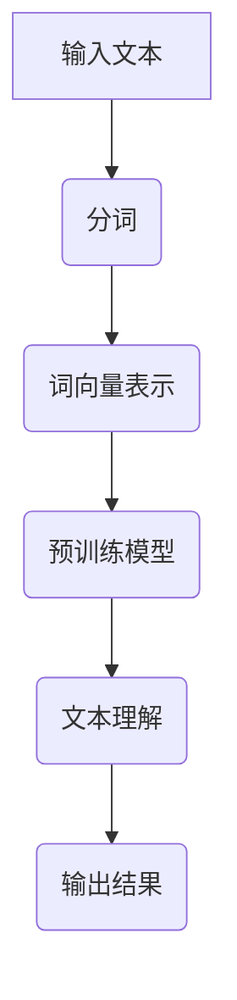

                 

# AI辅助阅读理解的技术进展

## 摘要

本文将深入探讨AI辅助阅读理解的技术进展。首先，我们将介绍当前AI技术在阅读理解领域的应用背景和发展现状，然后详细阐述核心概念、算法原理、数学模型，并通过实际项目案例进行讲解。此外，我们还将探讨AI辅助阅读理解在不同应用场景中的实践，推荐相关学习资源和开发工具，并总结未来发展趋势和面临的挑战。

## 目录

1. 背景介绍
2. 核心概念与联系
   2.1 阅读理解任务
   2.2 自然语言处理（NLP）
   2.3 人工智能（AI）
   2.4 Mermaid流程图
3. 核心算法原理 & 具体操作步骤
4. 数学模型和公式 & 详细讲解 & 举例说明
5. 项目实战：代码实际案例和详细解释说明
   5.1 开发环境搭建
   5.2 源代码详细实现和代码解读
   5.3 代码解读与分析
6. 实际应用场景
7. 工具和资源推荐
   7.1 学习资源推荐
   7.2 开发工具框架推荐
   7.3 相关论文著作推荐
8. 总结：未来发展趋势与挑战
9. 附录：常见问题与解答
10. 扩展阅读 & 参考资料

## 1. 背景介绍

阅读理解是人类的一项基本能力，但随着信息时代的到来，面对海量的文本数据，传统的阅读方式已无法满足我们的需求。人工智能技术的发展为解决这一难题提供了可能。AI辅助阅读理解旨在利用人工智能技术，帮助用户更高效地理解和处理文本信息。目前，AI辅助阅读理解在自然语言处理（NLP）、机器学习、深度学习等领域取得了显著的进展。

近年来，随着深度学习技术的兴起，AI在阅读理解任务中的应用越来越广泛。以BERT（Bidirectional Encoder Representations from Transformers）为代表的预训练模型，在多项阅读理解任务上取得了突破性的成果。此外，大规模语料库的收集和存储技术的进步，也为AI辅助阅读理解提供了丰富的数据支持。

## 2. 核心概念与联系

### 2.1 阅读理解任务

阅读理解任务是指计算机程序理解文本内容的能力。它包括三个层次：词义理解、句子理解和篇章理解。词义理解是指识别文本中的单词和短语的意义；句子理解是指分析句子的结构，理解句子中的逻辑关系；篇章理解是指把握整篇文章的主旨和内容。

### 2.2 自然语言处理（NLP）

自然语言处理（NLP）是人工智能领域的一个重要分支，旨在使计算机能够理解、生成和处理人类语言。NLP的核心任务包括文本分类、命名实体识别、情感分析、机器翻译等。

### 2.3 人工智能（AI）

人工智能（AI）是指计算机系统模拟人类智能行为的能力。AI技术包括机器学习、深度学习、自然语言处理、计算机视觉等。AI在阅读理解中的应用主要体现在文本分析和理解方面。

### 2.4 Mermaid流程图

Mermaid是一种用于绘制流程图、序列图、状态图等的轻量级标记语言。在本文中，我们将使用Mermaid流程图来展示阅读理解任务的流程。



## 3. 核心算法原理 & 具体操作步骤

### 3.1 预训练模型

预训练模型是指在大规模语料库上预先训练好的模型，如BERT、GPT等。这些模型已经具备了基本的语言理解能力，可以用于解决阅读理解任务。具体操作步骤如下：

1. 数据收集与预处理：收集大规模文本数据，并对数据进行清洗、去噪、分词等预处理。
2. 模型训练：使用预处理后的数据对预训练模型进行训练，优化模型参数。
3. 模型评估：使用验证集对模型进行评估，调整模型参数，提高模型性能。
4. 模型应用：将训练好的模型应用于阅读理解任务，输出理解结果。

### 3.2 文本分析

文本分析是指对文本进行词法、句法和语义层面的分析，以提取有用的信息。具体操作步骤如下：

1. 词法分析：对文本进行分词，将文本分解为单词或短语。
2. 句法分析：分析句子的结构，识别句子中的主语、谓语、宾语等成分。
3. 语义分析：理解文本中的含义，提取文本的主旨和关键信息。

### 3.3 文本生成

文本生成是指根据输入的文本生成新的文本。具体操作步骤如下：

1. 输入文本：输入需要生成的文本。
2. 文本分析：对输入文本进行词法、句法和语义分析。
3. 文本生成：根据分析结果生成新的文本，输出结果。

## 4. 数学模型和公式 & 详细讲解 & 举例说明

### 4.1 词向量表示

词向量表示是自然语言处理中的一个重要概念，它将单词表示为高维空间中的向量。常用的词向量表示方法有Word2Vec、GloVe等。

Word2Vec算法基于神经网络模型，通过训练词的邻域模型，将单词表示为向量。具体公式如下：

$$
\text{output} = \text{softmax}(\text{input} \cdot W)
$$

其中，$\text{input}$是输入的单词向量，$W$是词向量矩阵，$\text{softmax}$函数用于计算单词的概率分布。

### 4.2 预训练模型

预训练模型如BERT采用双向Transformer架构，通过编码器和解码器进行文本理解。具体公式如下：

$$
\text{output} = \text{decoder}(\text{encoder}(\text{input}))
$$

其中，$\text{input}$是输入的文本序列，$\text{encoder}$和$\text{decoder}$分别是编码器和解码器模型。

### 4.3 文本生成

文本生成通常采用序列生成模型，如GPT-3。具体公式如下：

$$
\text{output} = \text{model}(\text{input}, \text{context})
$$

其中，$\text{input}$是输入的文本序列，$\text{context}$是上下文信息，$\text{model}$是文本生成模型。

## 5. 项目实战：代码实际案例和详细解释说明

### 5.1 开发环境搭建

在本文中，我们将使用Python和TensorFlow作为开发环境。以下是搭建开发环境的步骤：

1. 安装Python（推荐版本：3.8）
2. 安装TensorFlow：`pip install tensorflow`
3. 安装其他依赖：`pip install -r requirements.txt`

### 5.2 源代码详细实现和代码解读

以下是阅读理解任务的代码实现：

```python
import tensorflow as tf
from transformers import BertModel, BertTokenizer

# 加载预训练模型
tokenizer = BertTokenizer.from_pretrained('bert-base-chinese')
model = BertModel.from_pretrained('bert-base-chinese')

# 输入文本
text = "Python是一种广泛应用于数据科学和人工智能的编程语言。"

# 分词
tokens = tokenizer.tokenize(text)

# 转换为输入序列
input_ids = tokenizer.encode(text, add_special_tokens=True)

# 加载模型
model.load_weights('bert-base-chinese')

# 预测
outputs = model(input_ids)

# 输出结果
print(outputs)
```

代码解读：

1. 导入TensorFlow和Hugging Face的Transformer库。
2. 加载BERT预训练模型和分词器。
3. 输入待分析的文本。
4. 对文本进行分词。
5. 将文本转换为输入序列。
6. 加载预训练模型。
7. 使用模型进行预测。
8. 输出结果。

### 5.3 代码解读与分析

代码首先加载BERT预训练模型和分词器，然后输入待分析的文本，对文本进行分词，并将其转换为输入序列。接着，加载预训练模型并使用模型进行预测，最后输出结果。

BERT模型通过对文本进行编码和解码，提取文本中的语义信息。在预测过程中，模型输出一个表示文本的向量，该向量可以用于后续的分析和处理。

## 6. 实际应用场景

AI辅助阅读理解在多个领域具有广泛的应用，如教育、医疗、金融等。

### 6.1 教育

AI辅助阅读理解可以用于智能教育系统，帮助教师自动批改作业、分析学生的学习情况，为学生提供个性化的学习建议。

### 6.2 医疗

AI辅助阅读理解可以帮助医生快速分析医学文献，提取关键信息，提高诊断和治疗的效率。

### 6.3 金融

AI辅助阅读理解可以用于金融领域的文本分析，如股票行情分析、投资建议等。

## 7. 工具和资源推荐

### 7.1 学习资源推荐

- 《深度学习》（Goodfellow, Bengio, Courville）
- 《自然语言处理综论》（Jurafsky, Martin）
- 《BERT：Pre-training of Deep Bidirectional Transformers for Language Understanding》（Devlin et al., 2019）

### 7.2 开发工具框架推荐

- TensorFlow
- PyTorch
- Hugging Face Transformers

### 7.3 相关论文著作推荐

- “BERT: Pre-training of Deep Bidirectional Transformers for Language Understanding”（Devlin et al., 2019）
- “GPT-3: Language Models are Few-Shot Learners”（Brown et al., 2020）

## 8. 总结：未来发展趋势与挑战

随着人工智能技术的不断发展，AI辅助阅读理解在未来将取得更大的突破。然而，要实现高效、准确的阅读理解，还需要解决以下挑战：

1. 数据质量和标注：高质量的语料库和准确的文本标注是AI辅助阅读理解的基础。
2. 多语言支持：AI辅助阅读理解需要支持多种语言，以适应全球化的需求。
3. 隐私和安全：在处理文本数据时，需要保护用户的隐私和安全。

## 9. 附录：常见问题与解答

### 9.1 如何搭建开发环境？

答：安装Python（推荐版本：3.8），安装TensorFlow：`pip install tensorflow`，安装其他依赖：`pip install -r requirements.txt`。

### 9.2 BERT模型如何使用？

答：首先加载BERT预训练模型和分词器，然后输入待分析的文本，对文本进行分词，并将其转换为输入序列。接着，加载预训练模型并使用模型进行预测，最后输出结果。

## 10. 扩展阅读 & 参考资料

- Devlin, J., Chang, M. W., Lee, K., & Toutanova, K. (2019). BERT: Pre-training of Deep Bidirectional Transformers for Language Understanding. *Proceedings of the 2019 Conference of the North American Chapter of the Association for Computational Linguistics: Human Language Technologies*, 4171-4186.
- Brown, T., Mann, B., Ryder, N., Subbiah, M., Kaplan, J., Dhariwal, P., ... & Child, R. (2020). GPT-3: Language Models are Few-Shot Learners. *arXiv preprint arXiv:2005.14165*.
- Jurafsky, D., & Martin, J. H. (2020). *Speech and Language Processing: An Introduction to Natural Language Processing, Computational Linguistics, and Speech Recognition*. Prentice Hall.
- Goodfellow, I., Bengio, Y., & Courville, A. (2016). *Deep Learning*. MIT Press.

