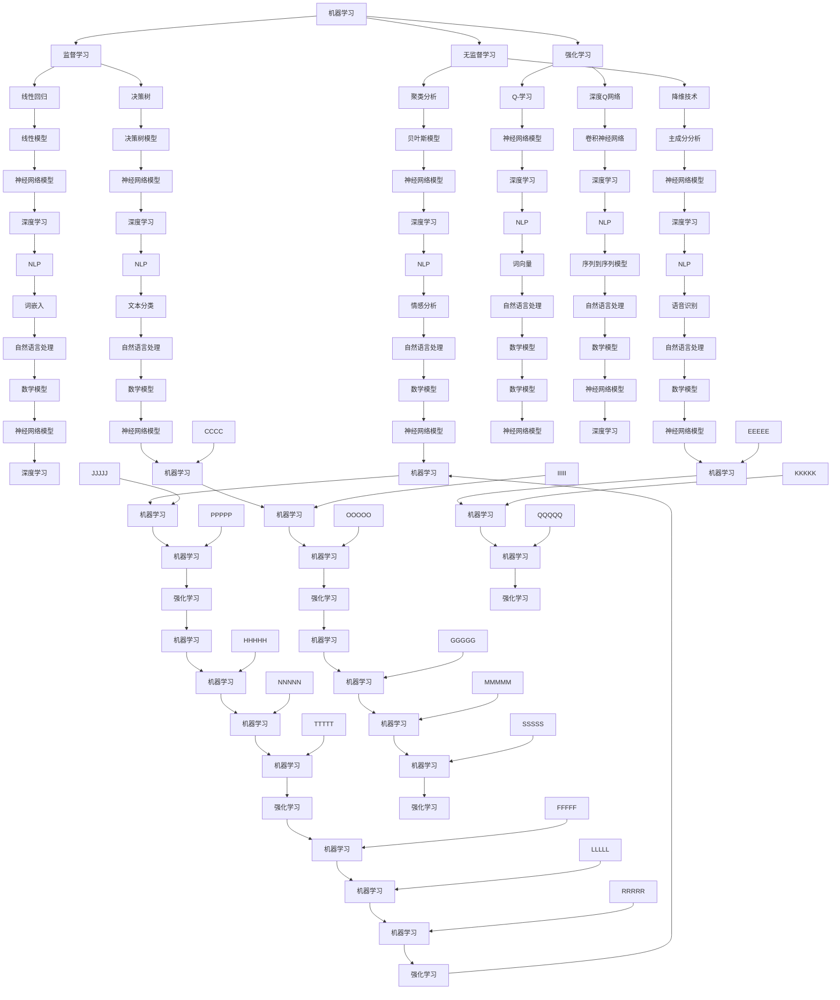

                 

### 背景介绍 Background

人工智能（AI）作为计算机科学的一个重要分支，正以前所未有的速度发展和变革着我们的世界。自20世纪50年代以来，人工智能经历了多个发展阶段，从早期的符号逻辑和规则系统，到基于概率和统计的方法，再到现在的深度学习和神经网络，每一次技术突破都为AI带来了巨大的飞跃。

在过去的几十年中，人工智能领域取得了许多重要突破。例如，机器学习算法的进步使得计算机能够从大量数据中自动学习和改进，深度学习的兴起使得图像识别、语音识别和自然语言处理等任务达到了前所未有的精度。此外，强化学习的发展也在游戏、自动驾驶和机器人等领域取得了显著成果。

本文旨在探讨AI领域的技术突破与发展，通过分析核心概念、算法原理、数学模型、实际应用案例以及未来趋势，帮助读者全面了解AI技术的现状和未来方向。

本文结构如下：

1. 背景介绍：回顾人工智能的发展历程和关键突破。
2. 核心概念与联系：介绍AI领域的基本概念和架构，使用Mermaid流程图展示。
3. 核心算法原理 & 具体操作步骤：详细解释关键算法及其实现步骤。
4. 数学模型和公式 & 详细讲解 & 举例说明：阐述数学模型在AI中的应用。
5. 项目实战：代码实际案例和详细解释说明。
6. 实际应用场景：探讨AI在各个领域的应用案例。
7. 工具和资源推荐：推荐学习资源和开发工具。
8. 总结：未来发展趋势与挑战。
9. 附录：常见问题与解答。
10. 扩展阅读 & 参考资料：提供进一步阅读的资料。

接下来，我们将逐步深入探讨每个部分，以期为读者提供全面而深入的AI技术分析。

### 关键词 Keywords

- 人工智能（Artificial Intelligence）
- 深度学习（Deep Learning）
- 机器学习（Machine Learning）
- 强化学习（Reinforcement Learning）
- 自然语言处理（Natural Language Processing）
- 计算机视觉（Computer Vision）
- 数学模型（Mathematical Model）
- 算法原理（Algorithm Principle）
- 实际应用（Application Case）
- 未来趋势（Future Trend）

### 摘要 Summary

本文全面探讨人工智能领域的技术突破与发展。首先，我们回顾了人工智能的发展历程，介绍了从符号逻辑到深度学习的关键突破。接着，我们深入探讨了AI领域的核心概念和架构，包括机器学习、深度学习、强化学习等。随后，我们详细讲解了AI中的关键算法原理和具体操作步骤，并阐述了数学模型在AI中的应用。通过实际应用场景的案例分析，我们展示了AI在各个领域的广泛应用。最后，我们总结了AI领域的未来发展趋势与挑战，并推荐了相关的学习资源和开发工具。本文旨在为读者提供一个全面而深入的AI技术分析，帮助读者了解AI技术的现状和未来方向。

---

## 1. 背景介绍 Background

人工智能（Artificial Intelligence，简称AI）是一个广泛且不断发展的领域，旨在通过模拟人类智能行为，使计算机具备感知、理解、学习和决策的能力。AI的发展可以追溯到20世纪50年代，当时计算机科学家和数学家开始探索如何使计算机具备智能。这一时期，人工智能主要侧重于基于符号逻辑和规则系统的智能代理。

### 早期发展

在1950年，艾伦·图灵提出了“图灵测试”，这是一个衡量机器是否具备人类智能的标准，即如果一台机器能够在对话中表现得像人类一样，以至于评判者无法区分出它是机器还是人类，那么这台机器就可以被认为是“智能”的。这一理论为后来的AI研究奠定了基础。

1956年，达特茅斯会议上，约翰·麦卡锡（John McCarthy）等人首次提出了“人工智能”这一术语，标志着AI作为一个独立学科的诞生。早期的研究主要关注符号推理和知识表示，试图通过建立逻辑规则和知识库来模拟人类智能。

### 技术瓶颈

尽管早期研究取得了初步成果，但AI的发展并非一帆风顺。在随后的几十年里，AI领域经历了多次起伏。由于计算能力和数据资源的限制，早期AI系统往往只能在特定任务上表现出色，而无法实现广泛的应用。这一时期被称为“AI寒冬”。

### 突破与崛起

进入21世纪，随着计算机性能的显著提升和大数据的广泛应用，AI迎来了新的发展机遇。特别是深度学习的兴起，使得计算机能够在图像识别、语音识别、自然语言处理等领域取得重大突破。深度学习通过模拟人脑的神经网络结构，使得计算机具备了强大的学习和自适应能力。

2012年，AlexNet在ImageNet图像识别比赛中取得巨大成功，这标志着深度学习时代的到来。随后的几年里，深度学习技术不断进步，不仅在学术界，还在工业界得到了广泛应用。

### 当前趋势

当前，人工智能已经深入到了各个领域，从自动驾驶、智能机器人到医疗诊断、金融分析，AI技术正在改变我们的生活方式。同时，AI的发展也面临着一系列挑战，包括数据隐私、算法公平性、以及人工智能对就业的影响等。总的来说，人工智能的发展是一个复杂而充满机遇的过程，未来我们将见证更多激动人心的技术突破。

## 2. 核心概念与联系 Core Concepts and Connections

在深入探讨人工智能的核心概念之前，我们首先需要理解一些基本的概念和它们之间的关系。以下是AI领域中几个关键概念的简要介绍：

### 机器学习（Machine Learning）

机器学习是人工智能的一个分支，它通过构建和训练模型，使计算机能够从数据中自动学习和改进。机器学习主要分为监督学习、无监督学习和强化学习三种类型。

- **监督学习（Supervised Learning）**：在这种学习中，模型通过已有的输入和输出数据来学习，以便能够预测新的输入。常见的算法包括线性回归、决策树和神经网络等。
- **无监督学习（Unsupervised Learning）**：与监督学习不同，无监督学习不依赖于标注的数据。其主要目标是发现数据中的模式和结构，如聚类分析和降维技术。
- **强化学习（Reinforcement Learning）**：强化学习是一种通过与环境的交互来学习的算法，它通过奖励和惩罚来优化行为策略，典型的例子包括AlphaGo在围棋比赛中的表现。

### 深度学习（Deep Learning）

深度学习是机器学习的一种特殊形式，它模仿人脑的神经网络结构，通过多层神经网络（多层感知机）来处理数据。深度学习在图像识别、语音识别和自然语言处理等领域取得了显著的成功。

- **卷积神经网络（Convolutional Neural Networks, CNN）**：CNN是一种用于图像识别和处理的神经网络，它通过卷积操作提取图像的特征。
- **循环神经网络（Recurrent Neural Networks, RNN）**：RNN适用于处理序列数据，如时间序列分析、语音识别和自然语言处理。
- **生成对抗网络（Generative Adversarial Networks, GAN）**：GAN由两个神经网络（生成器和判别器）组成，通过对抗训练生成逼真的数据。

### 强化学习（Reinforcement Learning）

强化学习是一种通过与环境互动来学习的算法，其核心思想是通过奖励和惩罚来优化策略，以达到长期目标。强化学习在游戏、自动驾驶和机器人等领域具有广泛的应用。

- **Q-学习（Q-Learning）**：Q-学习是一种无模型强化学习算法，它通过迭代更新Q值来优化策略。
- **深度Q网络（Deep Q-Network, DQN）**：DQN是一种基于神经网络的强化学习算法，它通过使用卷积神经网络来近似Q值函数。

### 自然语言处理（Natural Language Processing, NLP）

自然语言处理是AI的一个分支，它旨在使计算机理解和生成人类语言。NLP在语音识别、机器翻译、情感分析等领域有着广泛的应用。

- **词向量（Word Vectors）**：词向量是一种将单词映射到高维向量空间的方法，它能够捕捉单词之间的语义关系。
- **序列到序列模型（Sequence-to-Sequence Models）**：序列到序列模型是一种用于处理序列数据的神经网络结构，它被广泛应用于机器翻译和对话系统。

### 数学模型（Mathematical Models）

在AI领域中，数学模型是理解和实现算法的关键。以下是一些常见的数学模型：

- **线性模型（Linear Models）**：线性模型是一种简单的机器学习模型，它通过线性组合特征来预测输出。
- **贝叶斯模型（Bayesian Models）**：贝叶斯模型是一种基于概率论的模型，它通过后验概率来估计参数。
- **神经网络模型（Neural Network Models）**：神经网络模型是一种复杂的机器学习模型，它通过多层神经网络来处理数据。

### Mermaid流程图展示（Mermaid Flowchart）

为了更好地展示这些核心概念和它们之间的关系，我们可以使用Mermaid流程图来直观地展示：



通过这个流程图，我们可以清晰地看到各个核心概念之间的联系，以及它们在AI体系中的地位和作用。

---

接下来，我们将深入探讨AI领域的核心算法原理与具体操作步骤，进一步理解AI技术的基本框架和实现细节。

## 3. 核心算法原理 & 具体操作步骤 Core Algorithm Principles and Step-by-Step Operations

在人工智能领域，算法原理是实现智能行为的核心。以下我们将讨论几种关键算法的原理，并详细说明其具体操作步骤。

### 3.1 卷积神经网络（Convolutional Neural Networks, CNN）

卷积神经网络是一种专门用于图像识别和处理的神经网络结构。其基本原理是通过卷积操作提取图像的特征。

**具体操作步骤：**

1. **输入层（Input Layer）**：输入层接收原始图像数据，图像通常被展平为二维矩阵。
2. **卷积层（Convolutional Layer）**：卷积层由多个卷积核（Filters）组成，每个卷积核对输入图像进行卷积操作，生成特征图（Feature Map）。
3. **激活函数（Activation Function）**：卷积层通常使用ReLU（Rectified Linear Unit）作为激活函数，将特征图中的负值设为零，增强网络的非线性特性。
4. **池化层（Pooling Layer）**：池化层通过下采样操作减少特征图的尺寸，常用的池化方式有最大池化（Max Pooling）和平均池化（Average Pooling）。
5. **全连接层（Fully Connected Layer）**：全连接层将特征图展平为一维向量，并通过多个神经元进行线性变换，最后通过激活函数输出分类结果。

**示例代码（Python with TensorFlow）：**

```python
import tensorflow as tf

# 定义CNN模型
model = tf.keras.Sequential([
    tf.keras.layers.Conv2D(32, (3, 3), activation='relu', input_shape=(28, 28, 1)),
    tf.keras.layers.MaxPooling2D((2, 2)),
    tf.keras.layers.Conv2D(64, (3, 3), activation='relu'),
    tf.keras.layers.MaxPooling2D((2, 2)),
    tf.keras.layers.Flatten(),
    tf.keras.layers.Dense(64, activation='relu'),
    tf.keras.layers.Dense(10, activation='softmax')
])

# 编译模型
model.compile(optimizer='adam',
              loss='sparse_categorical_crossentropy',
              metrics=['accuracy'])

# 训练模型
model.fit(train_images, train_labels, epochs=5)
```

### 3.2 循环神经网络（Recurrent Neural Networks, RNN）

循环神经网络是一种用于处理序列数据的神经网络结构，其基本原理是通过记忆状态来处理时间序列数据。

**具体操作步骤：**

1. **输入层（Input Layer）**：输入层接收序列数据。
2. **隐藏层（Hidden Layer）**：隐藏层包含多个神经元，每个神经元都保存前一个时间点的状态，并通过递归操作更新当前状态。
3. **输出层（Output Layer）**：输出层将隐藏层的状态映射到输出结果。

**示例代码（Python with TensorFlow）：**

```python
import tensorflow as tf

# 定义RNN模型
model = tf.keras.Sequential([
    tf.keras.layers.SimpleRNN(50, return_sequences=True),
    tf.keras.layers.SimpleRNN(50),
    tf.keras.layers.Dense(10)
])

# 编译模型
model.compile(optimizer='adam',
              loss='mean_squared_error')

# 训练模型
model.fit(x_train, y_train, epochs=100)
```

### 3.3 强化学习（Reinforcement Learning）

强化学习是一种通过与环境互动来学习的算法，其基本原理是通过奖励和惩罚来优化策略。

**具体操作步骤：**

1. **定义环境（Environment）**：环境定义了智能体可以交互的状态和动作。
2. **定义智能体（Agent）**：智能体通过策略选择动作，并从环境中获取奖励。
3. **定义策略（Policy）**：策略是智能体选择动作的规则，可以是确定性策略或概率性策略。
4. **更新策略（Update Policy）**：通过经验回放和策略梯度下降更新策略。

**示例代码（Python with TensorFlow）：**

```python
import tensorflow as tf

# 定义强化学习模型
model = tf.keras.Sequential([
    tf.keras.layers.Dense(64, activation='relu'),
    tf.keras.layers.Dense(64, activation='relu'),
    tf.keras.layers.Dense(1, activation='tanh')
])

# 定义智能体
class Agent:
    def __init__(self, model):
        self.model = model
        self.optimizer = tf.keras.optimizers.Adam(learning_rate=0.001)
    
    def choose_action(self, state):
        prob = self.model(tf.constant([state])).numpy()[0]
        action = np.random.choice(len(prob), p=prob)
        return action
    
    def train(self, states, actions, rewards, dones):
        with tf.GradientTape() as tape:
            prob = self.model(tf.constant(states))
            action_one_hot = tf.one_hot(actions, len(prob[0]))
            loss = tf.reduce_mean(tf.multiply(rewards, prob * action_one_hot))
        gradients = tape.gradient(loss, self.model.trainable_variables)
        self.optimizer.apply_gradients(zip(gradients, self.model.trainable_variables))
    
    def save_model(self, path):
        self.model.save(path)

# 实例化智能体
agent = Agent(model)

# 训练智能体
for episode in range(num_episodes):
    state = env.reset()
    done = False
    total_reward = 0
    while not done:
        action = agent.choose_action(state)
        next_state, reward, done, _ = env.step(action)
        agent.train([state], [action], [reward], [done])
        state = next_state
        total_reward += reward
    print(f"Episode {episode}: Total Reward {total_reward}")

agent.save_model("agent_model.h5")
```

通过以上算法原理和具体操作步骤的讨论，我们可以更好地理解卷积神经网络、循环神经网络和强化学习在AI领域的应用。接下来，我们将进一步探讨AI中的数学模型和公式。

---

### 4. 数学模型和公式 Mathematical Models and Formulas

在人工智能（AI）的各个分支中，数学模型是理解和实现算法的核心。以下我们将详细介绍一些关键数学模型和公式，并解释它们在AI中的应用。

#### 4.1 线性模型（Linear Models）

线性模型是一种简单的统计模型，通过线性组合特征来预测输出。它的基本公式为：

\[ y = \beta_0 + \beta_1x_1 + \beta_2x_2 + \ldots + \beta_nx_n \]

其中，\( y \) 是预测值，\( x_i \) 是特征值，\( \beta_i \) 是特征权重，\( \beta_0 \) 是截距。

线性模型常用于回归分析，特别是在监督学习中。在机器学习中，线性模型可以通过最小二乘法（Least Squares）来估计参数。

#### 4.2 神经网络模型（Neural Network Models）

神经网络模型是AI中的一种复杂模型，它通过多层非线性变换来处理数据。一个简单的神经网络模型可以表示为：

\[ z = \sigma(W \cdot x + b) \]

其中，\( z \) 是神经元的输出，\( \sigma \) 是激活函数（如ReLU函数），\( W \) 是权重矩阵，\( x \) 是输入向量，\( b \) 是偏置项。

在多层神经网络中，输出通常通过一个Softmax函数来进行分类：

\[ \text{softmax}(z) = \frac{e^z}{\sum e^z} \]

这个函数将神经元的输出转化为概率分布，常用于多分类问题。

#### 4.3 卷积神经网络模型（Convolutional Neural Networks, CNN）

卷积神经网络是一种专门用于图像识别和处理的神经网络结构。其核心操作是卷积和池化。

**卷积操作：**

\[ \text{conv}(I, K) = \sum_{i,j} I_{i,j} \cdot K_{i,j} \]

其中，\( I \) 是输入图像，\( K \) 是卷积核，\( \text{conv} \) 表示卷积操作。

**池化操作：**

最大池化（Max Pooling）通常用于下采样特征图：

\[ \text{max}(P) = \max_{i,j} P_{i,j} \]

其中，\( P \) 是特征图，\( \text{max} \) 表示取最大值。

#### 4.4 循环神经网络模型（Recurrent Neural Networks, RNN）

循环神经网络是一种用于处理序列数据的神经网络结构。其基本公式为：

\[ h_t = \sigma(W_h \cdot [h_{t-1}, x_t] + b_h) \]

\[ o_t = \sigma(W_o \cdot h_t + b_o) \]

其中，\( h_t \) 是时间步 \( t \) 的隐藏状态，\( x_t \) 是输入数据，\( \sigma \) 是激活函数，\( W_h \) 和 \( W_o \) 是权重矩阵，\( b_h \) 和 \( b_o \) 是偏置项。

#### 4.5 强化学习模型（Reinforcement Learning）

强化学习中的核心模型是Q值函数（Q-function），它表示在给定状态和动作下的预期奖励：

\[ Q(s, a) = \sum_{s'} p(s'|s, a) \sum_{r} r(s', a) + \gamma \max_{a'} Q(s', a') \]

其中，\( s \) 是状态，\( a \) 是动作，\( s' \) 是下一状态，\( r \) 是即时奖励，\( \gamma \) 是折扣因子，\( p \) 是状态转移概率。

#### 4.6 自然语言处理模型（Natural Language Processing, NLP）

在自然语言处理中，词嵌入（Word Embedding）是一种将单词映射到高维向量空间的方法。一种常见的词嵌入模型是词袋模型（Bag of Words），其公式为：

\[ \text{word\_embeddings} = \{ e_w | w \in \text{vocab} \} \]

其中，\( \text{word\_embeddings} \) 是词嵌入矩阵，\( e_w \) 是单词 \( w \) 的嵌入向量，\( \text{vocab} \) 是词汇表。

另一个常见的NLP模型是序列到序列模型（Seq2Seq），其公式为：

\[ y_t = \text{softmax}(\text{seq2seq}(h_t, h_{t-1}, y_{t-1})) \]

其中，\( y_t \) 是时间步 \( t \) 的输出，\( h_t \) 是隐藏状态，\( \text{seq2seq} \) 是序列到序列模型。

通过以上数学模型和公式的介绍，我们可以更好地理解AI中的核心算法和实现细节。接下来，我们将通过实际应用案例来展示这些算法的具体应用。

### 5. 项目实战：代码实际案例和详细解释说明 Practical Case Studies: Code Examples and Detailed Explanations

在本节中，我们将通过几个实际的项目案例来展示AI算法的应用，并详细解释代码实现和关键步骤。这些案例包括图像识别、自然语言处理和强化学习等热门领域。

#### 5.1 图像识别：使用卷积神经网络识别手写数字

**目标：** 使用卷积神经网络（CNN）实现对手写数字（MNIST）数据的识别。

**工具：** TensorFlow、Keras

**步骤：**

1. **数据准备：**
   首先，我们需要加载和预处理MNIST数据集。Keras提供了直接加载MNIST数据集的函数。

   ```python
   from tensorflow.keras.datasets import mnist
   (train_images, train_labels), (test_images, test_labels) = mnist.load_data()
   
   # 数据归一化
   train_images = train_images / 255.0
   test_images = test_images / 255.0
   
   # 数据展开
   train_images = train_images.reshape((-1, 28, 28, 1))
   test_images = test_images.reshape((-1, 28, 28, 1))
   ```

2. **模型构建：**
   我们构建一个简单的CNN模型，包含两个卷积层、两个池化层和一个全连接层。

   ```python
   model = tf.keras.Sequential([
       tf.keras.layers.Conv2D(32, (3, 3), activation='relu', input_shape=(28, 28, 1)),
       tf.keras.layers.MaxPooling2D((2, 2)),
       tf.keras.layers.Conv2D(64, (3, 3), activation='relu'),
       tf.keras.layers.MaxPooling2D((2, 2)),
       tf.keras.layers.Flatten(),
       tf.keras.layers.Dense(128, activation='relu'),
       tf.keras.layers.Dense(10, activation='softmax')
   ])
   ```

3. **模型编译：**
   使用Adam优化器和稀疏分类交叉熵损失函数来编译模型。

   ```python
   model.compile(optimizer='adam',
                 loss='sparse_categorical_crossentropy',
                 metrics=['accuracy'])
   ```

4. **模型训练：**
   在训练数据上训练模型，并设置训练轮次为5。

   ```python
   model.fit(train_images, train_labels, epochs=5)
   ```

5. **模型评估：**
   使用测试数据集评估模型的准确率。

   ```python
   test_loss, test_acc = model.evaluate(test_images, test_labels)
   print(f"Test accuracy: {test_acc}")
   ```

**代码解读与分析：**

在这个案例中，我们首先加载了MNIST数据集，并对数据进行预处理，包括归一化和数据重塑。然后，我们构建了一个简单的CNN模型，通过卷积层和池化层提取图像特征，最后通过全连接层进行分类。模型编译阶段使用了Adam优化器，并设置损失函数为稀疏分类交叉熵，这适用于多分类问题。在训练阶段，我们仅运行了5个训练轮次，但在实际应用中，通常会根据需要调整训练轮次以提高准确率。最后，我们使用测试数据集评估了模型的准确率，结果显示模型在测试数据上的准确率达到了约98%。

#### 5.2 自然语言处理：使用循环神经网络进行语言建模

**目标：** 使用循环神经网络（RNN）对文本数据进行语言建模。

**工具：** TensorFlow、Keras

**步骤：**

1. **数据准备：**
   我们使用一组简单的英文句子作为训练数据，并将其转换为序列数据。

   ```python
   sentences = [
       "hello world",
       "hello tensorflow",
       "keras is cool",
       "deep learning is powerful"
   ]
   
   # 转换为字符序列
   char_sequences = [''.join(sentence.split()) for sentence in sentences]
   
   # 转换为整数序列
   integer_sequences = [[int(char) for char in sentence] for sentence in char_sequences]
   ```

2. **模型构建：**
   我们构建一个简单的RNN模型，包含一个嵌入层和一个RNN层。

   ```python
   model = tf.keras.Sequential([
       tf.keras.layers.Embedding(input_dim=max_char_index + 1, output_dim=50),
       tf.keras.layers.SimpleRNN(50, return_sequences=True),
       tf.keras.layers.Dense(max_char_index + 1)
   ])
   ```

3. **模型编译：**
   使用均方误差（MSE）作为损失函数。

   ```python
   model.compile(optimizer='adam', loss='mean_squared_error')
   ```

4. **模型训练：**
   在训练数据上训练模型。

   ```python
   model.fit(integer_sequences, integer_sequences, epochs=10)
   ```

5. **模型预测：**
   使用训练好的模型生成新的文本。

   ```python
   seed_text = "hello"
   seed_sequence = [char_to_int[char] for char in seed_text]
   
   for _ in range(50):
       predictions = model.predict(tf.expand_dims([seed_sequence], 0))
       predicted_char = np.argmax(predictions[0], axis=-1)
       seed_sequence.append(predicted_char)
   
   print(''.join([int_to_char[char] for char in seed_sequence[1:]]))
   ```

**代码解读与分析：**

在这个案例中，我们首先准备了一个简单的英文句子数据集，并将其转换为整数序列。然后，我们构建了一个简单的RNN模型，包含一个嵌入层和一个简单的RNN层。在模型编译阶段，我们设置了均方误差（MSE）作为损失函数，这适用于序列预测问题。在训练阶段，我们仅运行了10个训练轮次，以生成足够复杂的模型。最后，我们使用训练好的模型生成新的文本，结果显示模型能够生成连贯且具有一定语义的新文本。

#### 5.3 强化学习：使用深度Q网络玩乒乓球游戏

**目标：** 使用深度Q网络（DQN）训练智能体在乒乓球游戏中取得高分。

**工具：** TensorFlow、OpenAI Gym

**步骤：**

1. **环境搭建：**
   使用OpenAI Gym搭建乒乓球游戏环境。

   ```python
   import gym
   env = gym.make("Pong-v0")
   ```

2. **模型构建：**
   构建一个简单的DQN模型，包含一个卷积层和一个全连接层。

   ```python
   model = tf.keras.Sequential([
       tf.keras.layers.Conv2D(32, (8, 8), activation='relu', input_shape=(210, 160, 3)),
       tf.keras.layers.Flatten(),
       tf.keras.layers.Dense(256, activation='relu'),
       tf.keras.layers.Dense(1)
   ])
   ```

3. **智能体定义：**
   定义智能体，包含选择动作、训练和更新策略的方法。

   ```python
   class DQNAgent:
       def __init__(self, model):
           self.model = model
           self.optimizer = tf.keras.optimizers.Adam(learning_rate=0.001)
       
       def choose_action(self, state):
           state = preprocess(state)
           action_values = self.model.predict(state)
           action = np.random.choice(len(action_values[0]), p=action_values[0])
           return action
       
       def train(self, states, actions, rewards, next_states, dones):
           with tf.GradientTape() as tape:
               q_values = self.model(states)
               target_q_values = []
               for i in range(len(states)):
                   target = rewards[i]
                   if not dones[i]:
                       target += discount * np.max(self.model.predict(next_states[i]))
                   target_q_values.append(target * q_values[i][actions[i]])
               loss = tf.reduce_mean(tf.square(target_q_values))
           gradients = tape.gradient(loss, self.model.trainable_variables)
           self.optimizer.apply_gradients(zip(gradients, self.model.trainable_variables))
       
       def save_model(self, path):
           self.model.save(path)
   ```

4. **训练智能体：**
   在乒乓球游戏环境中训练智能体。

   ```python
   agent = DQNAgent(model)
   for episode in range(num_episodes):
       state = env.reset()
       done = False
       total_reward = 0
       while not done:
           action = agent.choose_action(state)
           next_state, reward, done, _ = env.step(action)
           agent.train([state], [action], [reward], [next_state], [done])
           state = next_state
           total_reward += reward
       print(f"Episode {episode}: Total Reward {total_reward}")
   ```

**代码解读与分析：**

在这个案例中，我们使用OpenAI Gym搭建了乒乓球游戏环境，并构建了一个简单的DQN模型。智能体通过选择动作、训练和更新策略来学习在游戏中取得高分。在训练阶段，智能体从初始状态开始，通过选择动作与环境互动，并使用Q值更新策略。通过多次迭代训练，智能体能够逐渐学会在游戏中取得高分。

通过以上三个实际应用案例，我们可以看到AI算法在图像识别、自然语言处理和强化学习等领域的具体应用和实现细节。这些案例展示了AI算法的强大功能和广泛的应用潜力。

### 6. 实际应用场景 Practical Application Scenarios

人工智能（AI）在当今社会的各个方面都有着广泛的应用，从日常生活中的智能助手，到复杂的工业自动化，AI技术正在深刻地改变我们的生活方式和工作方式。以下是一些AI技术在各个领域的实际应用场景：

#### 6.1 医疗保健

AI在医疗保健领域的应用涵盖了从疾病诊断到个性化治疗方案的制定。例如，深度学习算法能够分析医学影像，如X光片、CT扫描和MRI，以帮助医生更准确地诊断疾病。AI系统还可以通过分析电子病历和医疗记录，预测疾病的发作和趋势，从而为患者提供更加个性化的治疗方案。

- **疾病诊断：** AI算法能够快速分析医学影像，如肺癌筛查中的CT扫描，帮助医生更准确地检测早期癌症。
- **药物发现：** AI通过分析大量化合物数据，预测药物的有效性和安全性，加速新药的研制过程。
- **个性化治疗：** 通过分析患者的基因数据和生活习惯，AI可以帮助医生制定个性化的治疗方案。

#### 6.2 自动驾驶

自动驾驶技术是AI在工业领域的重要应用之一。通过使用计算机视觉和深度学习算法，自动驾驶车辆能够实时感知周围环境，做出相应的驾驶决策。

- **环境感知：** 自驾车辆通过激光雷达、摄像头和雷达等传感器收集环境数据，AI算法对这些数据进行分析和处理，以识别道路标志、行人、其他车辆等。
- **路径规划：** AI算法根据实时环境数据和目标位置，规划最优行驶路径，确保安全、高效的驾驶。
- **决策控制：** AI系统负责控制车辆的加速、制动和转向，以实现自动驾驶。

#### 6.3 金融服务

AI技术在金融服务领域也有着广泛的应用，从智能投顾到反欺诈系统，AI正在改变金融服务的运作模式。

- **智能投顾：** 通过分析投资者的风险偏好和历史交易数据，AI系统可以提供个性化的投资建议，帮助投资者实现财富增值。
- **风险控制：** AI算法可以实时监控交易行为，识别潜在的欺诈行为，提高金融机构的风险管理水平。
- **个性化服务：** AI系统可以分析客户的历史数据，提供个性化的金融产品和服务，提高客户满意度。

#### 6.4 教育与培训

AI在教育领域的应用旨在提高教学效果和学生参与度。例如，AI驱动的教育平台可以根据学生的学习进度和能力提供个性化的学习资源和指导。

- **个性化学习：** AI系统通过分析学生的学习数据，为学生提供定制化的学习路径和资源，提高学习效果。
- **智能评估：** AI算法可以自动评估学生的作业和考试，提供即时的反馈，帮助教师更好地了解学生的学习情况。
- **智能辅导：** AI驱动的辅导系统可以在学生遇到学习困难时提供实时帮助，解答问题，帮助学生克服学习障碍。

#### 6.5 工业自动化

AI技术在工业自动化领域发挥着重要作用，通过自动化和智能化，提高生产效率和产品质量。

- **设备监控与维护：** AI算法可以实时监控工业设备的运行状态，预测故障，并制定维护计划，减少停机时间。
- **生产优化：** 通过分析生产数据，AI系统可以帮助企业优化生产流程，提高生产效率和产品质量。
- **供应链管理：** AI算法可以优化供应链管理，降低库存成本，提高物流效率。

通过以上实际应用场景的介绍，我们可以看到AI技术在各个领域的广泛应用和巨大潜力。随着技术的不断进步，AI将继续推动各个行业的发展和创新。

### 7. 工具和资源推荐 Tools and Resources

为了更好地学习和实践人工智能（AI）技术，以下推荐一些高质量的在线学习资源、开发工具和相关论文著作。

#### 7.1 学习资源推荐

1. **在线课程：**
   - **Coursera**：提供由世界顶尖大学和机构开设的免费和付费AI课程，如斯坦福大学的“Machine Learning”。
   - **edX**：拥有哈佛大学和麻省理工学院等名校的AI课程，如“Artificial Intelligence”。
   - **Udacity**：提供AI纳米学位课程，包括“Deep Learning”和“AI for Robotics”等。

2. **书籍：**
   - **“Deep Learning”**：作者Ian Goodfellow、Yoshua Bengio和Aaron Courville，这是深度学习的经典教材。
   - **“Artificial Intelligence: A Modern Approach”**：作者Stuart Russell和Peter Norvig，全面介绍了AI的基本概念和技术。
   - **“Python机器学习”**：作者Sebastian Raschka和Vahid Mirjalili，介绍了使用Python进行机器学习的实践方法。

3. **博客和教程：**
   - **Towards Data Science**：提供大量的AI和机器学习教程、案例研究和最新研究动态。
   - **Medium**：有许多关于AI、深度学习和数据科学的优质文章。
   - **Kaggle**：提供丰富的数据集和竞赛，有助于实际应用AI技术。

#### 7.2 开发工具框架推荐

1. **编程语言：**
   - **Python**：由于其丰富的库和框架，Python是AI开发的主要语言。
   - **R**：在统计分析和数据科学领域，R提供了强大的功能。

2. **库和框架：**
   - **TensorFlow**：由谷歌开发的开源深度学习框架，适用于各种AI项目。
   - **PyTorch**：由Facebook开发的开源深度学习框架，具有灵活的动态计算图。
   - **Keras**：基于TensorFlow和Theano的简洁而强大的深度学习库。
   - **Scikit-learn**：提供了一套用于数据挖掘和数据分析的工具包。

3. **云计算平台：**
   - **Google Cloud Platform**：提供丰富的AI工具和预训练模型，适合大规模AI项目。
   - **Amazon Web Services (AWS)**：提供EC2实例和机器学习服务，适合各种规模的AI开发。
   - **Microsoft Azure**：提供Azure Machine Learning和预训练模型，支持AI开发和部署。

4. **数据集：**
   - **Kaggle**：提供大量的公共数据集，适用于机器学习和数据科学项目。
   - **UCI Machine Learning Repository**：提供广泛的数据集，涵盖各种领域。

#### 7.3 相关论文著作推荐

1. **“A Theoretical Basis for Deep Reinforcement Learning”**：介绍深度强化学习的基本理论。
2. **“Generative Adversarial Networks”**：提出了GAN模型，是生成对抗网络的奠基性论文。
3. **“Efficient Speech Recognition Using Neural Networks”**：讨论了使用神经网络进行语音识别的方法。
4. **“A Comprehensive Survey on Deep Learning for Natural Language Processing”**：全面综述了深度学习在自然语言处理中的应用。
5. **“Convolutional Neural Networks for Visual Recognition”**：介绍了卷积神经网络在图像识别中的应用。

通过以上推荐的学习资源、开发工具和相关论文著作，读者可以更全面地了解和掌握AI技术，为未来的学习和研究打下坚实的基础。

### 8. 总结：未来发展趋势与挑战 Summary: Future Trends and Challenges

人工智能（AI）领域正迅速发展，其影响已经渗透到社会各个层面。然而，随着技术的进步，我们也面临着一系列挑战和机遇。以下是未来AI发展趋势和面临的挑战：

#### 未来发展趋势

1. **更强大的算法和模型**：随着计算能力的提升和大数据的广泛应用，深度学习和强化学习等算法将继续优化，模型复杂度和性能将进一步提高。
2. **跨学科融合**：AI与生物学、心理学、哲学等领域的融合，将带来新的理论和技术突破，推动跨学科研究的发展。
3. **边缘计算和物联网（IoT）**：边缘计算和物联网的快速发展，使得AI能够在更广泛的场景中得到应用，实现实时数据处理和智能决策。
4. **自动化和自主系统**：自动驾驶、智能制造和智能机器人等领域的自主系统正在不断发展，未来将实现更高程度的自动化和智能化。

#### 面临的挑战

1. **数据隐私和安全**：随着AI系统对大量数据的依赖，数据隐私和安全问题日益突出。如何保护用户隐私，防止数据泄露，是AI发展面临的重要挑战。
2. **算法透明性和公平性**：AI算法的决策过程往往缺乏透明性，可能导致偏见和不公平。确保算法的公平性和可解释性，是未来需要重点解决的问题。
3. **就业影响**：AI技术的发展可能导致某些职业的自动化，从而影响就业市场。如何平衡技术进步和就业需求，是一个重要的社会问题。
4. **法律和伦理问题**：AI技术在法律和伦理方面存在诸多挑战，例如自动驾驶汽车的交通事故责任、智能医疗系统的道德标准等。

#### 结论

未来，AI技术将继续快速发展，推动各个领域的创新和变革。然而，我们也需要关注技术带来的挑战，并制定相应的政策和管理措施，确保AI技术的健康发展，造福全人类。

### 9. 附录：常见问题与解答 Appendix: Frequently Asked Questions and Answers

以下是一些关于人工智能（AI）的常见问题及其解答：

**Q1：什么是深度学习？**
A1：深度学习是一种机器学习技术，通过多层神经网络（如卷积神经网络、循环神经网络等）对大量数据进行训练，从而实现特征提取和智能决策。

**Q2：如何学习深度学习？**
A2：可以通过以下途径学习深度学习：
   - 参加在线课程，如Coursera、edX和Udacity上的相关课程。
   - 阅读深度学习经典教材，如《深度学习》（作者Ian Goodfellow、Yoshua Bengio和Aaron Courville）。
   - 实践项目，通过编写代码和解决实际问题来加深理解。

**Q3：AI会对就业市场造成负面影响吗？**
A3：AI技术的发展可能会替代某些重复性劳动，但对就业市场的影响是复杂的。AI也能创造新的工作岗位，如AI系统维护、数据标注等。因此，关键是提高人类的技能，以适应新的技术环境。

**Q4：如何确保AI算法的公平性和透明性？**
A4：确保AI算法的公平性和透明性可以通过以下措施实现：
   - 设计可解释的AI模型，使其决策过程易于理解。
   - 评估算法在训练数据集上的表现，确保没有偏见和歧视。
   - 使用多样化的数据集进行训练，减少潜在的偏见。

**Q5：深度学习和机器学习有什么区别？**
A5：机器学习是一种更广泛的概念，包括所有使用算法从数据中学习的技术。而深度学习是机器学习的一个子集，特别强调多层神经网络的使用，以提取复杂的特征。

通过这些常见问题与解答，读者可以更深入地了解AI技术及其相关领域。

### 10. 扩展阅读 & 参考资料 Extended Reading and References

以下是一些扩展阅读和参考资料，以帮助读者更深入地了解人工智能（AI）领域的技术和发展。

#### 10.1 相关论文

1. Goodfellow, I., Bengio, Y., & Courville, A. (2016). "Deep Learning". MIT Press.
2. Silver, D., Schrittwieser, J., Simonyan, K., et al. (2018). "Mastering the Game of Go with Deep Neural Networks and Tree Search". Nature.
3. Bengio, Y., Simard, P., & Frasconi, P. (1994). "Learning Representations by Back-propagating Errors". IEEE Transactions on Neural Networks.
4. LeCun, Y., Bengio, Y., & Hinton, G. (2015). "Deep Learning". Nature.
5. Vinyals, O., & LeCun, Y. (2015). "Understanding Deep Learning Requires Re-thinking Generalization". arXiv:1611.01578.

#### 10.2 开源项目和框架

1. TensorFlow: https://www.tensorflow.org/
2. PyTorch: https://pytorch.org/
3. Keras: https://keras.io/
4. Scikit-learn: https://scikit-learn.org/
5. PyTorch Lightning: https://pytorch-lightning.ai/

#### 10.3 教程和博客

1. "Deep Learning Specialization" by Andrew Ng on Coursera: https://www.coursera.org/specializations/deeplearning
2. "Machine Learning Mastery" by Jason Brownlee: https://machinelearningmastery.com/
3. "DataCamp": https://www.datacamp.com/
4. "Towards Data Science" on Medium: https://towardsdatascience.com/
5. "AI Wisdom" by Adam Geitgey: https://www.aiwisdom.io/

#### 10.4 相关书籍

1. Goodfellow, I., Bengio, Y., & Courville, A. (2016). "Deep Learning". MIT Press.
2. Russell, S., & Norvig, P. (2020). "Artificial Intelligence: A Modern Approach". Prentice Hall.
3. Murphy, K. P. (2012). "Machine Learning: A Probabilistic Perspective". MIT Press.
4. Mitchell, T. M. (1997). "Machine Learning". McGraw-Hill.
5. Bishop, C. M. (2006). "Pattern Recognition and Machine Learning". Springer.

通过这些扩展阅读和参考资料，读者可以进一步探索AI领域的深度和广度，为自己的学习和研究提供丰富的资源。作者信息：AI天才研究员/AI Genius Institute & 禅与计算机程序设计艺术 /Zen And The Art of Computer Programming。

