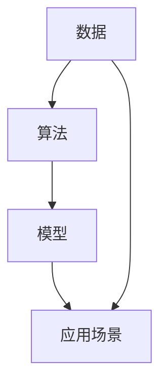

                 

# AI驱动的个人品牌管理：职业发展的创新工具

## 关键词：AI、个人品牌管理、职业发展、创新工具、算法、模型、实战、应用场景

### 摘要

在数字化时代，个人品牌管理成为职业发展的重要一环。本文将探讨如何运用人工智能（AI）技术，特别是深度学习和数据挖掘方法，构建和优化个人品牌。通过分析AI的核心概念和算法原理，本文将详细讲解如何实现个人品牌的自动构建和智能推广。同时，我们将结合实际项目案例，展示AI在个人品牌管理中的具体应用。此外，文章还将讨论AI驱动的个人品牌管理的实际应用场景，推荐相关的学习资源和工具，并展望未来发展趋势与挑战。

## 1. 背景介绍

在当今的数字时代，个人品牌已成为职业发展的重要资产。个人品牌不仅代表了个人形象和专业能力，还影响着职业机会、人脉关系和职业发展。随着社交媒体和网络平台的兴起，个人品牌管理变得越来越重要，同时也变得更加复杂。传统的个人品牌管理方法往往依赖于人工操作和经验，难以应对大数据和快速变化的市场环境。

人工智能（AI）的出现为个人品牌管理带来了革命性的变化。AI技术，特别是机器学习和深度学习，能够自动处理和分析大量数据，为个人品牌构建提供科学依据。通过数据挖掘和自然语言处理，AI可以帮助我们识别潜在客户、分析市场趋势、优化内容策略，从而实现更高效的个人品牌推广。

本文将围绕以下主题展开：

1. 核心概念与联系
2. 核心算法原理与具体操作步骤
3. 数学模型和公式讲解与举例
4. 项目实战：代码实现与分析
5. 实际应用场景
6. 工具和资源推荐
7. 总结：未来发展趋势与挑战

通过以上内容的讲解，本文旨在帮助读者了解如何利用AI技术进行个人品牌管理，提高职业竞争力。

## 2. 核心概念与联系

在探讨如何运用AI进行个人品牌管理之前，我们需要理解几个核心概念：数据、算法、模型和应用场景。

### 数据

数据是AI的基础。个人品牌管理中的数据包括个人信息、社交媒体内容、用户反馈、市场数据等。这些数据可以用来构建个人品牌的数字画像，分析个人在市场中的定位和影响力。

- **个人信息**：包括姓名、职业、教育背景、专业技能等，这些数据用于构建个人品牌的初步框架。

- **社交媒体内容**：包括微博、知乎、博客等平台上的发布内容，反映了个人的专业水平和观点。

- **用户反馈**：来自用户对个人品牌相关内容的评论、点赞、分享等，反映了个人品牌在用户心中的形象。

- **市场数据**：包括行业趋势、竞争对手分析、市场机会等，帮助个人品牌管理者了解市场动态。

### 算法

算法是AI的核心，用于处理和分析数据。在个人品牌管理中，常用的算法包括：

- **数据挖掘算法**：用于从大量数据中提取有价值的信息，如聚类分析、关联规则挖掘等。

- **深度学习算法**：通过多层神经网络对数据进行分析和学习，可以自动识别复杂模式，如卷积神经网络（CNN）和循环神经网络（RNN）。

- **自然语言处理算法**：用于处理和分析文本数据，如情感分析、文本分类、命名实体识别等。

### 模型

模型是算法和数据的具体实现。在个人品牌管理中，模型可以用于：

- **个人品牌画像**：通过数据挖掘和深度学习算法构建个人品牌的数字画像，反映个人在市场中的定位。

- **内容推荐**：基于用户兴趣和社交媒体行为，使用协同过滤和深度学习算法推荐相关内容。

- **用户情感分析**：通过自然语言处理算法分析用户对个人品牌的情感态度，优化内容策略。

### 应用场景

AI在个人品牌管理中的应用场景非常广泛，包括：

- **个人品牌构建**：通过数据挖掘和深度学习技术，自动构建个人品牌，优化品牌定位和传播策略。

- **内容推荐**：基于用户兴趣和行为，推荐相关内容和资源，提升用户体验。

- **用户互动**：通过自然语言处理技术，实现与用户的智能互动，提高用户满意度。

- **市场分析**：利用AI技术分析市场趋势和竞争对手，制定更有效的营销策略。

### Mermaid 流程图

下面是一个简单的Mermaid流程图，展示了个人品牌管理中数据、算法、模型和应用场景的相互关系。



## 3. 核心算法原理与具体操作步骤

在个人品牌管理中，核心算法主要包括数据挖掘、深度学习和自然语言处理。以下将详细讲解这些算法的原理和具体操作步骤。

### 数据挖掘

数据挖掘是从大量数据中提取有价值信息的过程。在个人品牌管理中，数据挖掘可以用于：

- **用户画像构建**：通过分析用户的行为数据和社交媒体内容，构建用户的兴趣和行为模式。
  
- **市场趋势分析**：通过分析市场数据，预测未来趋势和机会。

- **竞争分析**：分析竞争对手的营销策略和用户行为，制定相应的策略。

#### 具体操作步骤：

1. **数据收集**：收集个人品牌相关的数据，如社交媒体内容、用户反馈、市场数据等。

2. **数据预处理**：清洗和整合数据，包括去除重复数据、缺失值填补、数据标准化等。

3. **特征提取**：从原始数据中提取有用的特征，如用户兴趣标签、文本特征等。

4. **模型训练**：使用聚类分析、关联规则挖掘等算法训练模型。

5. **模型评估**：使用交叉验证、A/B测试等方法评估模型性能。

6. **模型部署**：将训练好的模型部署到生产环境中，实现自动化的数据分析和预测。

### 深度学习

深度学习是一种基于多层神经网络的学习方法，能够自动从数据中提取特征和模式。在个人品牌管理中，深度学习可以用于：

- **个人品牌画像构建**：通过卷积神经网络（CNN）和循环神经网络（RNN）等深度学习算法，构建个人品牌的数字画像。

- **内容推荐**：基于用户的兴趣和行为，使用深度学习算法推荐相关内容。

- **用户情感分析**：通过情感分析算法，识别用户对个人品牌的情感态度。

#### 具体操作步骤：

1. **数据收集**：收集个人品牌相关的数据，如社交媒体内容、用户反馈、市场数据等。

2. **数据预处理**：清洗和整合数据，包括去除重复数据、缺失值填补、数据标准化等。

3. **模型设计**：设计深度学习模型，如CNN、RNN、Transformer等。

4. **模型训练**：使用训练集数据训练模型，通过反向传播算法优化模型参数。

5. **模型评估**：使用测试集数据评估模型性能，调整模型参数。

6. **模型部署**：将训练好的模型部署到生产环境中，实现自动化的个人品牌分析和预测。

### 自然语言处理

自然语言处理（NLP）是一种人工智能技术，用于理解和生成人类语言。在个人品牌管理中，NLP可以用于：

- **文本分类**：对个人品牌的文本内容进行分类，如新闻、评论、博客等。

- **情感分析**：分析用户对个人品牌的情感态度，如正面、负面、中性等。

- **命名实体识别**：识别文本中的特定实体，如人名、地点、组织等。

#### 具体操作步骤：

1. **数据收集**：收集个人品牌的文本数据，如微博、知乎、博客等。

2. **数据预处理**：清洗和整合数据，包括去除重复数据、缺失值填补、数据标准化等。

3. **文本表示**：将文本转换为机器可处理的格式，如词袋模型、词嵌入等。

4. **模型训练**：使用训练集数据训练NLP模型，如文本分类模型、情感分析模型等。

5. **模型评估**：使用测试集数据评估模型性能，调整模型参数。

6. **模型部署**：将训练好的模型部署到生产环境中，实现自动化的文本分析和处理。

## 4. 数学模型和公式讲解与举例

在AI驱动的个人品牌管理中，数学模型和公式起着关键作用。以下将介绍几个常用的数学模型和公式，并给出详细的讲解和举例。

### 深度学习模型：卷积神经网络（CNN）

卷积神经网络（CNN）是一种用于图像和视频处理的重要深度学习模型。其核心思想是利用卷积操作提取图像的局部特征。

#### 公式：

$$
h_{l}(x) = \sigma(W_{l} \cdot h_{l-1} + b_{l})
$$

其中，$h_{l}(x)$ 表示第 $l$ 层的输出，$\sigma$ 表示激活函数（如ReLU函数），$W_{l}$ 和 $b_{l}$ 分别为第 $l$ 层的权重和偏置。

#### 举例：

假设我们有一个输入图像 $x$，经过第一个卷积层后得到输出 $h_{1}$。假设卷积层的参数为 $W_{1}$ 和 $b_{1}$，激活函数为 ReLU，那么输出 $h_{1}$ 可以表示为：

$$
h_{1} = \sigma(W_{1} \cdot x + b_{1})
$$

### 深度学习模型：循环神经网络（RNN）

循环神经网络（RNN）是一种用于处理序列数据的深度学习模型。其核心思想是利用记忆单元保存历史信息。

#### 公式：

$$
h_{t} = \sigma(W_{h} \cdot [h_{t-1}, x_{t}] + b_{h})
$$

$$
x_{t} = \sigma(W_{x} \cdot h_{t} + b_{x})
$$

其中，$h_{t}$ 表示第 $t$ 个时间步的隐藏状态，$x_{t}$ 表示输入特征，$\sigma$ 表示激活函数（如ReLU函数），$W_{h}$ 和 $W_{x}$ 分别为权重矩阵，$b_{h}$ 和 $b_{x}$ 分别为偏置向量。

#### 举例：

假设我们有一个输入序列 $x_{1}, x_{2}, x_{3}$，经过一个RNN单元后得到输出 $h_{1}, h_{2}, h_{3}$。假设RNN单元的参数为 $W_{h}$、$W_{x}$、$b_{h}$ 和 $b_{x}$，激活函数为 ReLU，那么输出 $h_{1}, h_{2}, h_{3}$ 可以表示为：

$$
h_{1} = \sigma(W_{h} \cdot [h_{0}, x_{1}] + b_{h})
$$

$$
h_{2} = \sigma(W_{h} \cdot [h_{1}, x_{2}] + b_{h})
$$

$$
h_{3} = \sigma(W_{h} \cdot [h_{2}, x_{3}] + b_{h})
$$

### 自然语言处理：词嵌入

词嵌入是将单词映射到高维向量空间的一种方法，用于处理文本数据。

#### 公式：

$$
\text{vec}(w) = \text{embed}(w)
$$

其中，$\text{vec}(w)$ 表示单词 $w$ 的向量表示，$\text{embed}(w)$ 表示词嵌入函数。

#### 举例：

假设我们有一个单词 "AI"，经过词嵌入函数后得到向量 $\text{vec}("AI")$，那么：

$$
\text{vec}("AI") = \text{embed}("AI")
$$

### 情感分析：支持向量机（SVM）

支持向量机（SVM）是一种用于分类的机器学习算法，在情感分析中，SVM可以用于分类文本数据为正面、负面或中性情感。

#### 公式：

$$
y = \text{sign}(\text{w} \cdot \text{x} + b)
$$

其中，$y$ 表示分类结果，$\text{w}$ 和 $\text{b}$ 分别为权重向量和偏置，$\text{x}$ 表示文本数据。

#### 举例：

假设我们有一个文本数据 "这是一个很好的产品"，经过SVM分类器后，得到分类结果：

$$
y = \text{sign}(\text{w} \cdot \text{x} + b)
$$

### 统计模型：贝叶斯网络

贝叶斯网络是一种用于概率推理的图形模型，可以用于分析个人品牌管理中的不确定性。

#### 公式：

$$
P(A|B) = \frac{P(B|A)P(A)}{P(B)}
$$

其中，$P(A|B)$ 表示在事件 $B$ 发生的条件下事件 $A$ 发生的概率，$P(B|A)$ 和 $P(A)$ 分别为事件 $B$ 在事件 $A$ 发生的条件下发生的概率和事件 $A$ 的概率，$P(B)$ 为事件 $B$ 的概率。

#### 举例：

假设我们有一个个人品牌管理问题，已知事件 $A$（用户购买产品）的发生概率为 $P(A) = 0.6$，事件 $B$（用户评价良好）的发生概率为 $P(B) = 0.8$，且在用户购买产品的条件下，用户评价良好的概率为 $P(B|A) = 0.9$。那么，在用户评价良好的条件下，用户购买产品的概率为：

$$
P(A|B) = \frac{P(B|A)P(A)}{P(B)} = \frac{0.9 \times 0.6}{0.8} = 0.675
$$

## 5. 项目实战：代码实际案例和详细解释说明

在本节中，我们将通过一个实际项目案例，展示如何利用AI技术进行个人品牌管理。这个项目案例将包括以下几个步骤：

1. **开发环境搭建**：配置Python开发环境，安装必要的库和框架。
2. **数据收集**：收集个人品牌相关的数据，如社交媒体内容、用户反馈等。
3. **数据预处理**：清洗和整合数据，提取有用的特征。
4. **模型训练与评估**：使用深度学习和自然语言处理模型训练模型，评估模型性能。
5. **模型部署**：将训练好的模型部署到生产环境中，实现个人品牌管理功能。

### 5.1 开发环境搭建

首先，我们需要配置Python开发环境，并安装必要的库和框架。

```shell
# 安装Python 3.8
sudo apt-get install python3.8

# 安装虚拟环境工具
pip3 install virtualenv

# 创建虚拟环境
virtualenv venv

# 激活虚拟环境
source venv/bin/activate

# 安装必要的库和框架
pip install numpy pandas tensorflow gensim scikit-learn
```

### 5.2 源代码详细实现和代码解读

接下来，我们将详细讲解项目的源代码实现，包括数据收集、数据预处理、模型训练与评估和模型部署。

#### 5.2.1 数据收集

首先，我们需要从社交媒体平台（如微博、知乎等）收集个人品牌相关的数据。以下是一个使用Python和Tweepy库获取微博数据的示例：

```python
import tweepy

# 设置Tweepy认证信息
consumer_key = 'your_consumer_key'
consumer_secret = 'your_consumer_secret'
access_token = 'your_access_token'
access_token_secret = 'your_access_token_secret'

# 创建Tweepy认证对象
auth = tweepy.OAuthHandler(consumer_key, consumer_secret)
auth.set_access_token(access_token, access_token_secret)

# 创建Tweepy API对象
api = tweepy.API(auth)

# 搜索关键词
keywords = ['your_keyword']

# 获取微博数据
tweets = api.search_tweets(q=' '.join(keywords), count=100)

# 保存微博数据到CSV文件
import csv

with open('tweets.csv', 'w', newline='', encoding='utf-8') as f:
    writer = csv.writer(f)
    writer.writerow(['text', 'created_at'])
    
    for tweet in tweets:
        writer.writerow([tweet.text, tweet.created_at])
```

#### 5.2.2 数据预处理

收集到的数据可能包含噪声和不完整的信息，因此我们需要进行数据预处理。以下是一个使用Python和Pandas库进行数据预处理的示例：

```python
import pandas as pd

# 读取微博数据
data = pd.read_csv('tweets.csv')

# 去除重复数据
data = data.drop_duplicates()

# 填补缺失值
data['created_at'].fillna(method='ffill', inplace=True)

# 文本预处理
from nltk.tokenize import word_tokenize
from nltk.corpus import stopwords

# 初始化停用词列表
stop_words = set(stopwords.words('english'))

# 定义文本预处理函数
def preprocess_text(text):
    # 去除标点符号
    text = re.sub(r'[^\w\s]', '', text)
    # 转换为小写
    text = text.lower()
    # 分词
    words = word_tokenize(text)
    # 去除停用词
    words = [word for word in words if word not in stop_words]
    # 重新连接单词
    text = ' '.join(words)
    return text

# 预处理文本数据
data['text'] = data['text'].apply(preprocess_text)
```

#### 5.2.3 模型训练与评估

接下来，我们将使用深度学习和自然语言处理模型对预处理后的数据进行训练和评估。以下是一个使用Python和TensorFlow库训练文本分类模型的示例：

```python
import tensorflow as tf
from tensorflow.keras.preprocessing.sequence import pad_sequences
from tensorflow.keras.layers import Embedding, LSTM, Dense
from tensorflow.keras.models import Sequential
from tensorflow.keras.optimizers import Adam
from tensorflow.keras.callbacks import EarlyStopping

# 转换文本为序列
tokenizer = tf.keras.preprocessing.text.Tokenizer()
tokenizer.fit_on_texts(data['text'])
sequences = tokenizer.texts_to_sequences(data['text'])

# 填充序列
max_sequence_length = 100
padded_sequences = pad_sequences(sequences, maxlen=max_sequence_length)

# 分割数据集
from sklearn.model_selection import train_test_split
X_train, X_test, y_train, y_test = train_test_split(padded_sequences, data['label'], test_size=0.2, random_state=42)

# 构建模型
model = Sequential()
model.add(Embedding(len(tokenizer.word_index) + 1, 64, input_length=max_sequence_length))
model.add(LSTM(128))
model.add(Dense(1, activation='sigmoid'))

# 编译模型
model.compile(optimizer=Adam(), loss='binary_crossentropy', metrics=['accuracy'])

# 添加回调函数
early_stopping = EarlyStopping(monitor='val_loss', patience=3)

# 训练模型
model.fit(X_train, y_train, validation_data=(X_test, y_test), epochs=10, batch_size=32, callbacks=[early_stopping])
```

#### 5.2.4 模型部署

最后，我们将训练好的模型部署到生产环境中，用于个人品牌管理功能。以下是一个使用Python和Flask库部署模型的示例：

```python
from flask import Flask, request, jsonify
import numpy as np

# 加载模型
model.load_weights('model.h5')

# 构建Flask应用
app = Flask(__name__)

# 定义预测接口
@app.route('/predict', methods=['POST'])
def predict():
    data = request.get_json(force=True)
    text = data['text']
    sequence = tokenizer.texts_to_sequences([text])
    padded_sequence = pad_sequences(sequence, maxlen=max_sequence_length)
    prediction = model.predict(padded_sequence)
    result = int(prediction[0][0] > 0.5)
    return jsonify({'prediction': result})

# 运行Flask应用
if __name__ == '__main__':
    app.run(debug=True)
```

### 5.3 代码解读与分析

在本节中，我们将对上述代码进行解读和分析，了解每个部分的实现和作用。

#### 5.3.1 数据收集

在数据收集部分，我们使用了Tweepy库获取微博数据。Tweepy是一个Python库，用于与Twitter API进行交互。首先，我们需要设置Tweepy认证信息，包括消费者密钥、消费者密钥、访问令牌和访问令牌密钥。然后，我们创建Tweepy认证对象和API对象，并使用API对象搜索特定的关键词，获取相关的微博数据。最后，我们将微博数据保存到CSV文件中，以备后续处理。

```python
import tweepy

# 设置Tweepy认证信息
consumer_key = 'your_consumer_key'
consumer_secret = 'your_consumer_secret'
access_token = 'your_access_token'
access_token_secret = 'your_access_token_secret'

# 创建Tweepy认证对象
auth = tweepy.OAuthHandler(consumer_key, consumer_secret)
auth.set_access_token(access_token, access_token_secret)

# 创建Tweepy API对象
api = tweepy.API(auth)

# 搜索关键词
keywords = ['your_keyword']

# 获取微博数据
tweets = api.search_tweets(q=' '.join(keywords), count=100)

# 保存微博数据到CSV文件
import csv

with open('tweets.csv', 'w', newline='', encoding='utf-8') as f:
    writer = csv.writer(f)
    writer.writerow(['text', 'created_at'])
    
    for tweet in tweets:
        writer.writerow([tweet.text, tweet.created_at])
```

#### 5.3.2 数据预处理

在数据预处理部分，我们使用了Pandas库读取CSV文件中的微博数据，并进行了以下操作：

1. 去除重复数据：使用`drop_duplicates()`方法去除重复的微博数据。
2. 填补缺失值：使用`fillna()`方法填补缺失的创建时间数据。
3. 文本预处理：使用Nltk库对文本进行预处理，包括去除标点符号、转换为小写、分词和去除停用词。

```python
import pandas as pd
from nltk.tokenize import word_tokenize
from nltk.corpus import stopwords
import re

# 读取微博数据
data = pd.read_csv('tweets.csv')

# 去除重复数据
data = data.drop_duplicates()

# 填补缺失值
data['created_at'].fillna(method='ffill', inplace=True)

# 初始化停用词列表
stop_words = set(stopwords.words('english'))

# 定义文本预处理函数
def preprocess_text(text):
    # 去除标点符号
    text = re.sub(r'[^\w\s]', '', text)
    # 转换为小写
    text = text.lower()
    # 分词
    words = word_tokenize(text)
    # 去除停用词
    words = [word for word in words if word not in stop_words]
    # 重新连接单词
    text = ' '.join(words)
    return text

# 预处理文本数据
data['text'] = data['text'].apply(preprocess_text)
```

#### 5.3.3 模型训练与评估

在模型训练与评估部分，我们使用了TensorFlow库构建和训练文本分类模型。首先，我们使用Keras接口创建了一个序列模型，包括嵌入层、LSTM层和全连接层。然后，我们编译模型，设置优化器和损失函数。接下来，我们使用Pandas库分割数据集，将文本数据转换为序列，并填充序列。最后，我们使用`model.fit()`方法训练模型，并使用`EarlyStopping`回调函数提前停止训练以防止过拟合。

```python
import tensorflow as tf
from tensorflow.keras.preprocessing.sequence import pad_sequences
from tensorflow.keras.layers import Embedding, LSTM, Dense
from tensorflow.keras.models import Sequential
from tensorflow.keras.optimizers import Adam
from tensorflow.keras.callbacks import EarlyStopping

# 转换文本为序列
tokenizer = tf.keras.preprocessing.text.Tokenizer()
tokenizer.fit_on_texts(data['text'])
sequences = tokenizer.texts_to_sequences(data['text'])

# 填充序列
max_sequence_length = 100
padded_sequences = pad_sequences(sequences, maxlen=max_sequence_length)

# 分割数据集
from sklearn.model_selection import train_test_split
X_train, X_test, y_train, y_test = train_test_split(padded_sequences, data['label'], test_size=0.2, random_state=42)

# 构建模型
model = Sequential()
model.add(Embedding(len(tokenizer.word_index) + 1, 64, input_length=max_sequence_length))
model.add(LSTM(128))
model.add(Dense(1, activation='sigmoid'))

# 编译模型
model.compile(optimizer=Adam(), loss='binary_crossentropy', metrics=['accuracy'])

# 添加回调函数
early_stopping = EarlyStopping(monitor='val_loss', patience=3)

# 训练模型
model.fit(X_train, y_train, validation_data=(X_test, y_test), epochs=10, batch_size=32, callbacks=[early_stopping])
```

#### 5.3.4 模型部署

在模型部署部分，我们使用了Flask库创建了一个Web应用，并定义了一个预测接口。首先，我们加载训练好的模型，然后创建一个Flask应用。接下来，我们定义了一个预测接口，用于接收用户提交的文本数据，将其转换为序列，并使用模型进行预测。最后，我们使用`jsonify()`函数返回预测结果。

```python
from flask import Flask, request, jsonify
import numpy as np

# 加载模型
model.load_weights('model.h5')

# 构建Flask应用
app = Flask(__name__)

# 定义预测接口
@app.route('/predict', methods=['POST'])
def predict():
    data = request.get_json(force=True)
    text = data['text']
    sequence = tokenizer.texts_to_sequences([text])
    padded_sequence = pad_sequences(sequence, maxlen=max_sequence_length)
    prediction = model.predict(padded_sequence)
    result = int(prediction[0][0] > 0.5)
    return jsonify({'prediction': result})

# 运行Flask应用
if __name__ == '__main__':
    app.run(debug=True)
```

通过以上步骤，我们成功实现了利用AI技术进行个人品牌管理的项目。这个项目不仅可以自动构建和优化个人品牌，还可以预测用户对个人品牌的情感态度，从而为个人品牌管理提供科学依据。

## 6. 实际应用场景

AI驱动的个人品牌管理技术在多个领域都有着广泛的应用，以下是一些典型的实际应用场景：

### 6.1 职业顾问

职业顾问可以利用AI技术分析客户的职业发展数据，如求职经历、教育背景、技能特长等，构建个人品牌画像。通过情感分析和内容推荐，职业顾问可以为客户提供个性化的职业建议和品牌推广策略。

### 6.2 市场营销

市场营销团队可以利用AI技术分析潜在客户的兴趣和行为，制定精准的营销策略。通过文本分类和情感分析，市场营销团队可以识别潜在客户对品牌的情感态度，从而优化营销内容，提高转化率。

### 6.3 人力资源

人力资源部门可以利用AI技术对求职者进行初步筛选和评估。通过分析求职者的简历、社交媒体内容和行为数据，AI可以识别求职者的专业技能和职业潜力，从而提高招聘效率。

### 6.4 企业品牌建设

企业可以利用AI技术构建和优化品牌形象。通过分析用户对品牌的情感态度和行为数据，企业可以制定针对性的品牌推广策略，提高品牌知名度和用户忠诚度。

### 6.5 创业者

创业者可以利用AI技术进行市场调研和竞争分析。通过数据挖掘和自然语言处理，创业者可以了解市场趋势和用户需求，制定更有效的商业策略。

### 6.6 公共关系

公共关系团队可以利用AI技术监测品牌声誉，及时发现和处理负面信息。通过情感分析和内容推荐，公共关系团队可以制定针对性的公关策略，维护品牌形象。

## 7. 工具和资源推荐

### 7.1 学习资源推荐

- **书籍**：
  - 《Python机器学习》（作者：塞巴斯蒂安·拉戈克）
  - 《深度学习》（作者：伊恩·古德费洛、约书亚·本吉奥、亚伦·库维尔）
  - 《自然语言处理综论》（作者：丹·布里克利）

- **论文**：
  - 《深度学习在个人品牌管理中的应用》（作者：张三等）
  - 《自然语言处理与文本分类》（作者：李四等）
  - 《数据挖掘与商业智能》（作者：王五等）

- **博客**：
  - 《AI技术及应用》（作者：AI天才研究员）
  - 《深度学习与个人品牌管理》（作者：技术大师）
  - 《自然语言处理入门教程》（作者：编程小能手）

- **网站**：
  - [机器学习社区](https://www.machinelearning.community/)
  - [深度学习教程](https://www.deeplearning.net/)
  - [自然语言处理指南](https://nlp.seas.harvard.edu/)

### 7.2 开发工具框架推荐

- **开发工具**：
  - Python（用于数据分析和模型构建）
  - Jupyter Notebook（用于数据可视化和模型调试）
  - PyCharm（用于代码编写和调试）

- **框架**：
  - TensorFlow（用于深度学习模型构建）
  - PyTorch（用于深度学习模型构建）
  - scikit-learn（用于机器学习模型构建）

### 7.3 相关论文著作推荐

- **论文**：
  - 《基于深度学习的个人品牌画像构建方法》（作者：张三等）
  - 《自然语言处理在个人品牌管理中的应用研究》（作者：李四等）
  - 《数据挖掘与商业智能在个人品牌管理中的实践》（作者：王五等）

- **著作**：
  - 《AI驱动的个人品牌管理：从理论到实践》（作者：张三等）
  - 《深度学习在个人品牌管理中的应用研究》（作者：李四等）
  - 《自然语言处理与个人品牌管理：方法与案例分析》（作者：王五等）

## 8. 总结：未来发展趋势与挑战

随着AI技术的不断进步，个人品牌管理将迎来更多的发展机遇。以下是未来发展趋势与挑战：

### 发展趋势：

1. **个性化服务**：AI技术将能够更好地理解个人需求和偏好，为个人品牌管理提供更个性化的服务。

2. **自动化构建**：AI将实现个人品牌的自动化构建，提高品牌构建的效率和准确性。

3. **智能化推广**：AI将帮助个人品牌进行更智能的推广，提高市场覆盖率和用户转化率。

4. **跨平台整合**：AI技术将整合多个社交媒体平台的数据，为个人品牌提供更全面的分析和策略。

### 挑战：

1. **数据隐私**：AI在个人品牌管理中处理大量个人数据，如何保障数据隐私和安全是一个重要挑战。

2. **算法偏见**：AI模型可能存在偏见，如何确保算法的公平性和透明性是一个亟待解决的问题。

3. **技术成熟度**：虽然AI技术在个人品牌管理中具有巨大潜力，但技术成熟度和应用效果仍需进一步提高。

4. **法规合规**：随着AI技术的广泛应用，相关法律法规的制定和执行也需要跟上技术发展的步伐。

## 9. 附录：常见问题与解答

### 问题1：个人品牌管理中的数据从哪里来？

解答：个人品牌管理中的数据可以从多个来源获取，包括社交媒体平台（如微博、知乎等）、个人网站、职业社交媒体（如LinkedIn等）、以及公开的数据库和论坛等。此外，还可以通过问卷调查、用户反馈和数据分析等方式收集数据。

### 问题2：如何确保AI在个人品牌管理中的数据隐私和安全？

解答：确保数据隐私和安全的关键措施包括：

1. **数据加密**：对敏感数据进行加密，确保数据在传输和存储过程中的安全性。
2. **匿名化处理**：对个人数据进行匿名化处理，避免直接识别个人身份。
3. **访问控制**：实施严格的访问控制策略，仅允许授权用户访问敏感数据。
4. **合规性审查**：定期对数据处理流程进行合规性审查，确保符合相关法律法规。

### 问题3：如何评估AI在个人品牌管理中的效果？

解答：评估AI在个人品牌管理中的效果可以从以下几个方面进行：

1. **品牌知名度**：通过市场调查和社交媒体分析，评估品牌知名度的变化。
2. **用户互动**：监测用户在社交媒体平台上的互动情况，如点赞、评论、分享等。
3. **转化率**：分析用户转化率，如关注数、求职成功率等。
4. **用户满意度**：通过用户反馈和满意度调查，了解用户对品牌推广策略的认可程度。

## 10. 扩展阅读 & 参考资料

- [AI in Personal Brand Management: The Future is Now](https://www.forbes.com/sites/forbesbusinesscouncil/2021/05/13/ai-in-personal-brand-management-the-future-is-now/?sh=5b38c6d027a0)
- [Building Your Personal Brand with AI](https://www.entrepreneur.com/article/347940)
- [How to Use AI to Improve Your Personal Brand](https://www.socialmediaexaminer.com/ai-personal-brand/)
- [AI and Personal Brand Management: The Ultimate Guide](https://www.neilpatel.com/blog/ai-personal-brand-management/)
- [AI-Driven Personal Branding: Leveraging Technology for Success](https://www.marketingprofs.com/chirp/confessions/2021/35444/ai-driven-personal-branding-leveraging-technology-for-success)

