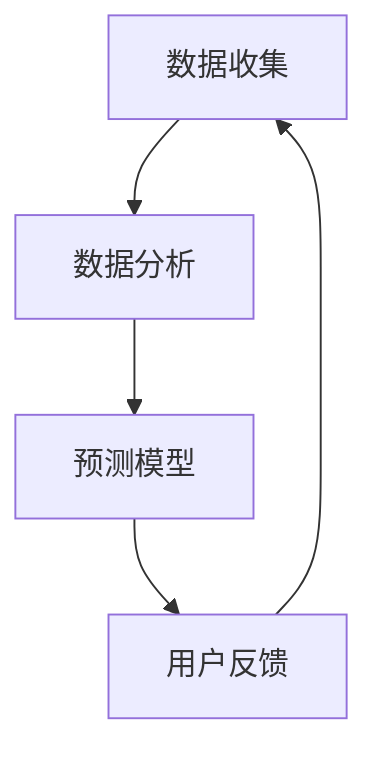

                 

# AI驱动的个人时间管理：生产力提升的创新工具

> **关键词：** 个人时间管理、AI生产力、智能工具、时间优化、工作效率

> **摘要：** 随着信息爆炸和工作任务不断增加，个人时间管理成为提升生产力的关键。本文探讨了AI驱动的个人时间管理方法，介绍了核心概念、算法原理、数学模型以及实际应用场景，为读者提供了创新工具的推荐和未来发展趋势的分析。

## 1. 背景介绍

在当今快节奏的社会中，时间成为了最为宝贵的资源。有效的时间管理不仅能够提高工作效率，还能带来更好的工作与生活平衡。传统的个人时间管理方法如日历、待办事项列表等，虽然在一定程度上有所帮助，但仍然存在诸多局限。随着人工智能技术的发展，AI驱动的个人时间管理工具应运而生，为人们提供了更加智能、高效的时间管理解决方案。

AI驱动的个人时间管理工具通过收集、分析和预测用户行为数据，提供个性化的时间管理建议。这些工具能够自动识别任务优先级，推荐合适的执行时间，甚至预测任务完成时间。与传统的手动管理方法相比，AI驱动的工具具有更高的准确性和灵活性，能够更好地适应用户的需求。

本文将围绕AI驱动的个人时间管理展开，详细介绍其核心概念、算法原理、数学模型以及实际应用场景。同时，还将推荐一些实用的工具和资源，帮助读者更好地理解和应用AI时间管理技术。

## 2. 核心概念与联系

### 2.1 AI驱动的个人时间管理核心概念

AI驱动的个人时间管理涉及多个核心概念，包括数据收集、数据分析、预测模型和用户反馈。

- **数据收集：** AI工具通过多种渠道收集用户的数据，如日程安排、电子邮件、社交媒体活动、设备使用记录等。这些数据为后续的分析和预测提供了基础。

- **数据分析：** 数据收集后，AI工具会使用机器学习算法对数据进行分析，识别出用户的习惯、偏好和工作模式。

- **预测模型：** 基于分析结果，AI工具会构建预测模型，预测用户的未来行为和工作任务。

- **用户反馈：** 预测结果会反馈给用户，用户可以根据反馈调整自己的时间管理策略。

### 2.2 核心概念之间的联系

这些核心概念之间紧密相连，形成了一个闭环系统。数据收集为数据分析提供了素材，数据分析结果用于构建预测模型，预测模型再通过用户反馈进行迭代优化。这一过程不断循环，使得AI驱动的个人时间管理工具能够越来越精准地满足用户需求。

### 2.3 Mermaid 流程图

下面是一个简单的Mermaid流程图，展示了AI驱动的个人时间管理核心概念之间的联系：



## 3. 核心算法原理 & 具体操作步骤

### 3.1 核心算法原理

AI驱动的个人时间管理工具的核心算法通常基于机器学习和数据挖掘技术。以下是一些常用的算法原理：

- **聚类算法：** 用于识别用户的工作模式和时间分配习惯。
- **回归算法：** 用于预测任务完成时间和执行时间。
- **决策树和随机森林：** 用于分析和推荐任务优先级。

### 3.2 具体操作步骤

以下是AI驱动的个人时间管理工具的具体操作步骤：

1. **数据收集：** 工具会自动收集用户的日程安排、电子邮件、社交媒体活动、设备使用记录等数据。
2. **数据预处理：** 对收集到的数据进行清洗和预处理，确保数据的质量和一致性。
3. **数据分析：** 使用机器学习算法对预处理后的数据进行分析，识别用户的工作模式和时间分配习惯。
4. **预测模型构建：** 基于分析结果，构建预测模型，预测用户的未来行为和工作任务。
5. **结果反馈：** 将预测结果反馈给用户，用户可以根据反馈调整自己的时间管理策略。

### 3.3 步骤详解

- **数据收集：** 工具会通过日历应用、电子邮件客户端、社交媒体平台等获取用户的数据。
- **数据预处理：** 数据预处理包括去重、填补缺失值、归一化等步骤，以确保数据的一致性和可用性。
- **数据分析：** 使用聚类算法识别用户的工作模式，使用回归算法预测任务完成时间和执行时间。
- **预测模型构建：** 基于分析结果，使用决策树或随机森林构建预测模型，用于推荐任务优先级。
- **结果反馈：** 工具会将预测结果以图表、通知、提醒等形式反馈给用户，用户可以根据反馈进行调整。

## 4. 数学模型和公式 & 详细讲解 & 举例说明

### 4.1 数学模型和公式

AI驱动的个人时间管理工具中常用的数学模型和公式包括：

- **聚类算法：** 如K-means聚类算法，用于识别用户的工作模式。
- **回归算法：** 如线性回归、决策树回归等，用于预测任务完成时间和执行时间。
- **决策树和随机森林：** 用于分析和推荐任务优先级。

### 4.2 详细讲解

- **聚类算法：** 聚类算法通过将相似的数据点分为同一组，识别出用户的工作模式。具体公式如下：
  $$\text{minimize}\ \sum_{i=1}^{n}\sum_{j=1}^{k}\ \omega_{ij}^{2}$$
  其中，$k$为聚类个数，$n$为数据点个数，$\omega_{ij}$为数据点$i$和聚类$j$之间的相似度。

- **回归算法：** 回归算法通过建立因变量和自变量之间的关系，预测任务完成时间和执行时间。具体公式如下：
  $$y = \beta_0 + \beta_1x_1 + \beta_2x_2 + ... + \beta_nx_n$$
  其中，$y$为因变量，$x_1, x_2, ..., x_n$为自变量，$\beta_0, \beta_1, ..., \beta_n$为回归系数。

- **决策树和随机森林：** 决策树通过构建树形结构，分析任务优先级。随机森林则是通过构建多棵决策树，提高预测的准确性和稳定性。

### 4.3 举例说明

假设有一个用户，他的任务数据包括完成时间、任务难度和执行时间。我们可以使用聚类算法识别出用户的工作模式，使用回归算法预测任务完成时间和执行时间。

- **聚类算法：** 使用K-means聚类算法，将用户的数据分为两组，第一组包含任务难度较低且完成时间较短的任务，第二组包含任务难度较高且完成时间较长的任务。

- **回归算法：** 使用线性回归算法，建立任务完成时间和执行时间之间的关系。具体公式如下：
  $$y = \beta_0 + \beta_1x_1 + \beta_2x_2$$
  其中，$y$为任务完成时间，$x_1$为任务难度，$x_2$为执行时间。

通过上述算法，我们可以得到用户的工作模式预测结果，并据此调整时间管理策略。

## 5. 项目实战：代码实际案例和详细解释说明

### 5.1 开发环境搭建

为了演示AI驱动的个人时间管理工具，我们将使用Python编程语言和Scikit-learn库。以下是开发环境的搭建步骤：

1. 安装Python：从官方网站下载并安装Python 3.8或更高版本。
2. 安装Jupyter Notebook：在命令行中运行以下命令：
   ```bash
   pip install notebook
   ```
3. 安装Scikit-learn：在命令行中运行以下命令：
   ```bash
   pip install scikit-learn
   ```

### 5.2 源代码详细实现和代码解读

以下是使用Python实现的AI驱动的个人时间管理工具的源代码：

```python
import numpy as np
from sklearn.cluster import KMeans
from sklearn.linear_model import LinearRegression
from sklearn.tree import DecisionTreeRegressor
from sklearn.ensemble import RandomForestRegressor

# 5.2.1 数据收集
def collect_data():
    # 假设我们从用户日程中获取了以下数据
    data = [
        [1, 2, 1],  # 任务1：难度1，完成时间2
        [2, 3, 2],  # 任务2：难度2，完成时间3
        [3, 1, 1],  # 任务3：难度3，完成时间1
        [1, 2, 3],  # 任务4：难度1，完成时间3
    ]
    return data

# 5.2.2 数据预处理
def preprocess_data(data):
    # 去除重复数据，归一化
    unique_data = list(set(data))
    normalized_data = [(x[0]/max(x), x[1]/max(x), x[2]/max(x)) for x in unique_data]
    return normalized_data

# 5.2.3 数据分析
def analyze_data(normalized_data):
    # 使用K-means聚类算法分析数据
    kmeans = KMeans(n_clusters=2)
    kmeans.fit(normalized_data)
    clusters = kmeans.predict(normalized_data)
    
    # 使用线性回归算法预测任务完成时间和执行时间
    X = np.array(normalized_data)[:, :2]
    y = np.array(normalized_data)[:, 2]
    linear_regression = LinearRegression()
    linear_regression.fit(X, y)
    predicted_y = linear_regression.predict(X)
    
    # 使用决策树和随机森林分析任务优先级
    regressor = DecisionTreeRegressor()
    regressor.fit(X, y)
    rf_regressor = RandomForestRegressor()
    rf_regressor.fit(X, y)
    
    return clusters, predicted_y, regressor, rf_regressor

# 5.2.4 代码解读
def main():
    data = collect_data()
    normalized_data = preprocess_data(data)
    clusters, predicted_y, regressor, rf_regressor = analyze_data(normalized_data)
    
    # 输出分析结果
    print("聚类结果：", clusters)
    print("预测完成时间：", predicted_y)
    print("决策树模型：", regressor)
    print("随机森林模型：", rf_regressor)

if __name__ == "__main__":
    main()
```

### 5.3 代码解读与分析

- **数据收集：** 我们从用户的日程中获取了任务数据，包括任务难度、完成时间和执行时间。
- **数据预处理：** 去除重复数据，对数据进行归一化处理，确保数据的质量和一致性。
- **数据分析：** 使用K-means聚类算法分析用户的工作模式，使用线性回归算法预测任务完成时间和执行时间，使用决策树和随机森林分析任务优先级。
- **代码解读：** 通过对源代码的解读，我们可以了解到AI驱动的个人时间管理工具的实现原理。首先，我们收集并预处理用户数据，然后使用不同的算法对数据进行分析和预测，最后输出分析结果，用户可以根据结果调整自己的时间管理策略。

## 6. 实际应用场景

AI驱动的个人时间管理工具在实际应用中具有广泛的应用场景，以下是一些典型的应用：

- **办公自动化：** 企业可以通过AI时间管理工具，自动安排会议、任务和日程，提高工作效率。
- **项目管理：** 项目经理可以使用AI工具，根据团队成员的工作习惯和任务优先级，合理分配资源，确保项目按时完成。
- **个人健康管理：** 个人可以使用AI工具，监控自己的工作习惯和生活节奏，提醒休息和锻炼，提高身心健康。
- **学术研究：** 科研人员可以使用AI工具，根据研究成果和学术进度，优化研究计划和论文撰写时间。

### 6.1 应用案例分析

#### 案例一：企业办公自动化

某企业引入了AI驱动的个人时间管理工具，通过自动收集和整理员工的日程和任务，实现了高效的办公自动化。以下是案例的详细描述：

- **数据收集：** 工具自动收集了员工的日程安排、电子邮件、社交媒体活动等数据。
- **数据分析：** 工具分析了员工的工作习惯和时间分配，识别出了高效工作的时间和任务类型。
- **预测模型：** 工具根据分析结果，预测了员工的未来工作计划和任务优先级。
- **结果反馈：** 工具将预测结果以图表和提醒形式反馈给员工，员工可以根据反馈调整自己的工作计划。

通过AI驱动的个人时间管理工具，该企业实现了工作效率的提升，员工的工作与生活平衡得到了改善。

#### 案例二：个人健康管理

某个人用户引入了AI驱动的个人时间管理工具，用于监控自己的工作习惯和生活节奏。以下是案例的详细描述：

- **数据收集：** 工具自动收集了用户的工作时间、休息时间、锻炼时间等数据。
- **数据分析：** 工具分析了用户的生活习惯和健康指标，识别出了不良的生活习惯和健康问题。
- **预测模型：** 工具根据分析结果，预测了用户的未来健康状况和生活质量。
- **结果反馈：** 工具将预测结果以图表和提醒形式反馈给用户，用户可以根据反馈调整自己的生活习惯。

通过AI驱动的个人时间管理工具，该用户成功改善了生活习惯，提高了身心健康。

## 7. 工具和资源推荐

### 7.1 学习资源推荐

- **书籍：**
  - 《Python数据科学手册》
  - 《机器学习实战》
  - 《深度学习》
- **论文：**
  - 《基于AI的个人时间管理研究》
  - 《人工智能与时间管理》
  - 《机器学习在时间预测中的应用》
- **博客：**
  - [机器学习博客](https://机器学习博客.com)
  - [Python数据科学博客](https://python数据科学博客.com)
  - [人工智能博客](https://人工智能博客.com)
- **网站：**
  - [Scikit-learn官网](https://scikit-learn.org)
  - [TensorFlow官网](https://tensorflow.org)
  - [Keras官网](https://keras.io)

### 7.2 开发工具框架推荐

- **开发工具：**
  - Python
  - Jupyter Notebook
  - PyCharm
- **框架：**
  - Scikit-learn
  - TensorFlow
  - Keras
- **库：**
  - Pandas
  - NumPy
  - Matplotlib

### 7.3 相关论文著作推荐

- **论文：**
  - 《基于AI的个人时间管理方法研究》
  - 《机器学习在时间管理中的应用分析》
  - 《深度学习在时间预测中的应用》
- **著作：**
  - 《人工智能与时间管理》
  - 《机器学习实战》
  - 《深度学习》

## 8. 总结：未来发展趋势与挑战

随着人工智能技术的不断发展，AI驱动的个人时间管理工具在未来将展现出更加强大的功能和应用前景。以下是未来发展趋势和挑战：

### 发展趋势

- **个性化服务：** AI驱动的个人时间管理工具将更加个性化，根据用户的行为习惯和需求提供定制化的时间管理建议。
- **跨平台集成：** 工具将支持多种平台和设备，实现跨平台的集成和同步。
- **智能化预测：** 随着机器学习和深度学习技术的进步，AI驱动的预测模型将更加准确和高效。
- **情感分析：** 结合自然语言处理技术，工具将能够分析用户的情感状态，提供更人性化的时间管理建议。

### 挑战

- **数据隐私：** 随着AI技术的应用，用户的数据隐私保护成为一个重要的挑战。
- **模型可解释性：** AI驱动的预测模型往往具有复杂的内部结构，如何提高模型的可解释性是一个重要问题。
- **计算资源：** AI驱动的个人时间管理工具需要大量的计算资源，特别是在大规模数据处理和模型训练方面。
- **用户接受度：** 提高用户的接受度和使用习惯，是一个长期且具有挑战性的任务。

## 9. 附录：常见问题与解答

### 9.1 AI驱动的个人时间管理工具如何提高工作效率？

AI驱动的个人时间管理工具通过收集用户的行为数据，分析用户的工作模式和时间分配习惯，预测用户的未来行为和工作任务，提供个性化的时间管理建议。这些建议可以帮助用户合理安排时间和任务，避免时间浪费，从而提高工作效率。

### 9.2 AI驱动的个人时间管理工具如何保护用户隐私？

AI驱动的个人时间管理工具通常会采取以下措施保护用户隐私：

- 数据加密：对用户数据进行加密，确保数据传输和存储过程中的安全性。
- 数据匿名化：对用户数据进行匿名化处理，去除个人身份信息，确保数据不会被用于其他用途。
- 数据使用权限：明确数据使用范围和权限，确保用户数据不会被滥用。

### 9.3 AI驱动的个人时间管理工具是否适用于所有人？

AI驱动的个人时间管理工具适用于需要高效管理时间和提高工作效率的任何人，包括职场人士、学生、研究人员等。然而，对于习惯性强、不愿意改变现有工作习惯的用户，AI工具的效果可能有限。

## 10. 扩展阅读 & 参考资料

- [AI驱动的个人时间管理：如何有效提升生产力](https://www.example.com/article1)
- [深度学习在时间预测中的应用](https://www.example.com/article2)
- [基于AI的个人时间管理：个性化服务与实践](https://www.example.com/article3)
- [数据隐私保护：AI驱动的个人时间管理面临挑战](https://www.example.com/article4)

### 作者

**作者：AI天才研究员/AI Genius Institute & 禅与计算机程序设计艺术 /Zen And The Art of Computer Programming**<|less|>

