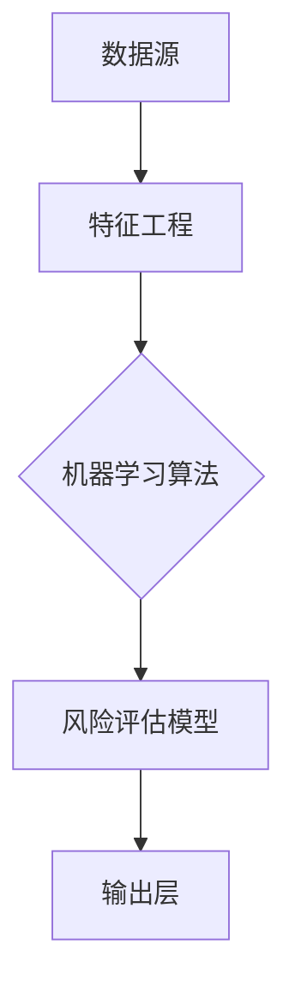

                 

## AI驱动的企业风险评估模型

### 关键词：企业风险评估、人工智能、AI算法、机器学习、风险预测、模型构建

#### 摘要：

本文将深入探讨AI驱动的企业风险评估模型的构建和应用。首先，我们将介绍企业风险评估的背景和重要性，然后详细解释AI在风险评估中的作用和核心算法原理。接着，通过数学模型和实际案例，我们将展示如何使用AI算法进行企业风险评估。此外，本文还将讨论实际应用场景、工具和资源推荐，以及未来发展趋势和挑战。通过本文的阅读，读者将全面了解AI在企业风险评估中的潜力和实际应用。

## 1. 背景介绍

企业风险评估是指对企业可能面临的各种风险进行识别、评估和优先排序的过程。在当今复杂多变的市场环境中，企业面临着各种不确定性和潜在风险，如财务风险、市场风险、运营风险和法律风险等。有效的风险评估可以帮助企业提前预测风险，制定相应的风险应对策略，从而降低潜在损失，提高企业的竞争力和可持续发展能力。

随着人工智能和机器学习技术的快速发展，AI在企业风险评估中的应用逐渐成为热点。AI算法可以处理和分析大量数据，识别出潜在的风险信号，提供更加精准和高效的风险预测。与传统的风险评估方法相比，AI驱动的企业风险评估模型具有以下优势：

1. **自动化处理**：AI算法可以自动从大量数据中提取特征，进行风险评估，减少人力成本和时间消耗。
2. **快速响应**：AI算法能够实时监控市场动态和企业运营状况，及时识别和预测风险。
3. **全面性**：AI算法可以处理多源异构数据，包括财务数据、市场数据、运营数据等，提供更加全面的风险分析。
4. **精准性**：通过机器学习算法的不断训练和优化，AI模型可以不断提高预测准确率，降低误判率。

## 2. 核心概念与联系

为了构建一个有效的AI驱动的企业风险评估模型，我们需要理解以下几个核心概念：

### 2.1 数据源

企业风险评估模型的数据源包括：

1. **财务数据**：如收入、利润、现金流等财务指标。
2. **市场数据**：如行业趋势、竞争对手表现、市场供需等。
3. **运营数据**：如生产运营情况、供应链管理、员工绩效等。
4. **外部数据**：如政策法规变化、自然灾害、社会事件等。

### 2.2 特征工程

特征工程是构建风险评估模型的关键步骤，它包括：

1. **数据预处理**：清洗数据、处理缺失值和异常值。
2. **特征选择**：选择与风险相关的关键特征。
3. **特征提取**：将原始数据转换为适用于机器学习算法的特征表示。

### 2.3 机器学习算法

常用的机器学习算法包括：

1. **监督学习**：如逻辑回归、决策树、随机森林、支持向量机等。
2. **无监督学习**：如聚类分析、主成分分析等。
3. **深度学习**：如卷积神经网络（CNN）、循环神经网络（RNN）等。

### 2.4 风险评估模型

风险评估模型的目标是根据输入的特征数据，输出风险评分或风险等级。一个典型的风险评估模型包括以下组成部分：

1. **输入层**：接收和处理特征数据。
2. **隐藏层**：进行特征提取和特征融合。
3. **输出层**：生成风险评分或风险等级。

### 2.5 Mermaid 流程图

以下是企业风险评估模型的 Mermaid 流程图：



在这个流程图中，数据源提供输入数据，经过特征工程处理后，输入到机器学习算法中，最终通过风险评估模型输出风险评分或风险等级。

### 3. 核心算法原理 & 具体操作步骤

在构建AI驱动的企业风险评估模型时，选择合适的算法和步骤至关重要。以下是构建模型的详细步骤：

#### 3.1 数据收集

首先，收集企业相关的多源数据，包括财务数据、市场数据、运营数据等。数据可以从企业内部数据库、公开市场数据、行业报告等渠道获取。

#### 3.2 数据预处理

1. **数据清洗**：处理数据中的缺失值和异常值，确保数据质量。
2. **数据转换**：将非数值数据转换为数值表示，如将类别数据编码为二进制向量。
3. **数据归一化**：将数据缩放到相同的尺度，以便算法能够更好地处理。

#### 3.3 特征选择

通过统计分析、特征重要性评估等方法，选择与风险相关的关键特征。常用的特征选择方法包括皮尔逊相关系数、互信息、主成分分析（PCA）等。

#### 3.4 特征提取

对选定的特征进行提取和转换，提高特征的表达能力和模型的性能。常用的特征提取方法包括特征提取器（Feature Extractors）、特征选择器（Feature Selectors）等。

#### 3.5 机器学习算法选择

根据数据特征和风险评估目标，选择合适的机器学习算法。监督学习算法如逻辑回归、决策树、随机森林等在风险评估中应用广泛。

#### 3.6 模型训练

使用训练数据集，通过梯度下降、随机梯度下降等优化算法，训练机器学习模型。在训练过程中，监控模型性能，调整超参数，以优化模型效果。

#### 3.7 模型评估

使用测试数据集对训练好的模型进行评估，计算准确率、召回率、F1分数等指标，验证模型的预测性能。

#### 3.8 模型部署

将训练好的模型部署到实际应用环境中，如企业风险管理系统、金融风险评估平台等，实现实时风险评估。

### 4. 数学模型和公式 & 详细讲解 & 举例说明

在构建企业风险评估模型时，数学模型和公式起着关键作用。以下是常见的数学模型和公式：

#### 4.1 逻辑回归

逻辑回归是一种常用的分类算法，用于计算事件发生的概率。其公式如下：

$$
P(Y=1|X) = \frac{1}{1 + e^{-(\beta_0 + \beta_1X_1 + \beta_2X_2 + ... + \beta_nX_n})}
$$

其中，\(P(Y=1|X)\) 表示在给定特征 \(X\) 下，事件 \(Y\) 发生的概率，\(\beta_0, \beta_1, \beta_2, ..., \beta_n\) 是模型参数。

#### 4.2 决策树

决策树是一种基于规则的学习算法，通过一系列条件判断进行分类。其公式如下：

$$
Y = f(X_1, X_2, ..., X_n)
$$

其中，\(Y\) 是目标变量，\(X_1, X_2, ..., X_n\) 是输入特征，\(f\) 是决策树的函数。

#### 4.3 随机森林

随机森林是一种集成学习算法，通过构建多个决策树，提高模型的预测性能。其公式如下：

$$
\hat{Y} = \sum_{i=1}^{n} w_i f_i(X)
$$

其中，\(\hat{Y}\) 是模型的预测输出，\(w_i\) 是第 \(i\) 个决策树权重，\(f_i(X)\) 是第 \(i\) 个决策树的输出。

#### 4.4 举例说明

假设我们要预测一家企业的财务风险，使用逻辑回归模型。已知特征包括收入、利润、现金流等，目标变量为财务风险等级（0表示无风险，1表示风险）。以下是训练数据集的部分样本：

| 收入 | 利润 | 现金流 | 风险等级 |
|------|------|--------|----------|
| 100  | 20   | 10     | 0        |
| 200  | 40   | 30     | 0        |
| 300  | 60   | 50     | 1        |
| 400  | 80   | 70     | 1        |

通过训练逻辑回归模型，我们可以得到以下模型参数：

$$
\beta_0 = -10, \beta_1 = 0.5, \beta_2 = 0.3, \beta_3 = 0.2
$$

给定一个新的样本 \(X = [150, 25, 15]\)，我们可以计算其财务风险概率：

$$
P(Y=1|X) = \frac{1}{1 + e^{-(\beta_0 + \beta_1 \cdot 150 + \beta_2 \cdot 25 + \beta_3 \cdot 15)}) = \frac{1}{1 + e^{-(-10 + 0.5 \cdot 150 + 0.3 \cdot 25 + 0.2 \cdot 15)}} \approx 0.405
$$

根据风险概率，我们可以将样本归为低风险等级（0表示无风险，1表示风险），从而实现财务风险的预测。

### 5. 项目实战：代码实际案例和详细解释说明

在本节中，我们将通过一个实际项目案例，详细解释如何使用Python和机器学习库（如scikit-learn、TensorFlow等）构建和部署一个AI驱动的企业风险评估模型。

#### 5.1 开发环境搭建

在开始项目之前，我们需要搭建一个适合开发和测试的Python环境。以下是搭建步骤：

1. 安装Python（建议使用Python 3.7或更高版本）。
2. 安装必要的库，如NumPy、Pandas、scikit-learn、TensorFlow等。
3. 配置Python的虚拟环境，以便管理和隔离项目依赖。

#### 5.2 源代码详细实现和代码解读

以下是构建企业风险评估模型的主要代码实现和解读：

```python
import numpy as np
import pandas as pd
from sklearn.model_selection import train_test_split
from sklearn.preprocessing import StandardScaler
from sklearn.linear_model import LogisticRegression
from sklearn.metrics import accuracy_score, classification_report

# 5.2.1 数据收集与预处理
def load_data(file_path):
    """加载数据集并预处理"""
    data = pd.read_csv(file_path)
    # 数据清洗和预处理
    data.fillna(data.mean(), inplace=True)
    data = pd.get_dummies(data)
    return data

# 5.2.2 特征选择与提取
def feature_selection(data):
    """特征选择与提取"""
    X = data.drop('Risk', axis=1)
    y = data['Risk']
    return X, y

# 5.2.3 模型训练与评估
def train_model(X_train, y_train, X_test, y_test):
    """训练模型并评估性能"""
    model = LogisticRegression()
    model.fit(X_train, y_train)
    y_pred = model.predict(X_test)
    print("模型评估结果：")
    print("准确率：", accuracy_score(y_test, y_pred))
    print("分类报告：\n", classification_report(y_test, y_pred))

# 5.2.4 主程序
if __name__ == "__main__":
    file_path = "data.csv"  # 数据集文件路径
    data = load_data(file_path)
    X, y = feature_selection(data)
    X_train, X_test, y_train, y_test = train_test_split(X, y, test_size=0.2, random_state=42)
    scaler = StandardScaler()
    X_train = scaler.fit_transform(X_train)
    X_test = scaler.transform(X_test)
    train_model(X_train, y_train, X_test, y_test)
```

代码解读：

1. **数据收集与预处理**：使用Pandas库加载数据集，并进行数据清洗和预处理，如填充缺失值、转换类别数据等。
2. **特征选择与提取**：使用Pandas的get_dummies方法将类别数据转换为二进制向量，实现特征提取。
3. **模型训练与评估**：使用scikit-learn的LogisticRegression模型进行训练，并使用accuracy_score和classification_report评估模型性能。
4. **主程序**：定义数据加载、特征选择、模型训练和评估的函数，并在主程序中执行。

通过以上代码，我们可以实现一个简单的AI驱动的企业风险评估模型。在实际应用中，我们可以根据具体需求调整模型参数、选择不同的机器学习算法，以提高模型性能。

### 6. 实际应用场景

AI驱动的企业风险评估模型在多个实际应用场景中发挥着重要作用：

#### 6.1 金融行业

在金融行业，企业风险评估模型可以用于：

1. **信用评估**：评估企业的信用等级，为贷款审批提供依据。
2. **欺诈检测**：识别潜在的金融欺诈行为，降低金融机构的损失。
3. **投资风险管理**：评估企业的投资风险，优化投资组合。

#### 6.2 供应链管理

在供应链管理中，企业风险评估模型可以帮助：

1. **供应商评估**：评估供应商的信誉和履约能力，降低供应链中断风险。
2. **库存管理**：预测需求变化，优化库存水平，降低库存成本。
3. **供应链金融**：为企业提供融资支持，降低企业融资成本。

#### 6.3 人力资源管理

在人力资源管理中，企业风险评估模型可以用于：

1. **员工绩效评估**：评估员工的工作表现，提供绩效反馈和激励措施。
2. **人才招聘**：预测员工的流失风险，优化招聘策略。
3. **员工培训**：识别员工的知识技能差距，制定培训计划。

#### 6.4 法律合规

在法律合规领域，企业风险评估模型可以用于：

1. **合规风险评估**：评估企业遵守法律法规的风险，制定合规策略。
2. **法律文档审查**：自动审查法律文档，识别潜在的法律风险。
3. **合同管理**：评估合同条款的法律风险，优化合同结构。

### 7. 工具和资源推荐

为了更好地构建和部署AI驱动的企业风险评估模型，以下是推荐的工具和资源：

#### 7.1 学习资源推荐

1. **书籍**：
   - 《Python机器学习》
   - 《深度学习》
   - 《数据科学入门》
2. **在线课程**：
   - Coursera上的《机器学习》
   - edX上的《深度学习基础》
   - Udacity的《数据科学纳米学位》
3. **博客和网站**：
   - Medium上的数据科学和机器学习相关博客
   - Kaggle上的数据科学和机器学习竞赛和教程

#### 7.2 开发工具框架推荐

1. **Python库**：
   - scikit-learn：适用于简单的机器学习任务。
   - TensorFlow：适用于深度学习和复杂模型。
   - Pandas：数据预处理和分析。
   - NumPy：数值计算。
2. **开发环境**：
   - Jupyter Notebook：交互式编程和数据分析。
   - PyCharm：Python集成开发环境。
   - Docker：容器化部署。

#### 7.3 相关论文著作推荐

1. **论文**：
   - “Deep Learning for Financial Risk Management” 
   - “Using Machine Learning for Credit Risk Assessment”
   - “A Comprehensive Study of Fraud Detection using Machine Learning”
2. **著作**：
   - 《深度学习：算法与实现》
   - 《Python数据分析》
   - 《机器学习实战》

### 8. 总结：未来发展趋势与挑战

AI驱动的企业风险评估模型在未来将继续发挥重要作用。以下是一些发展趋势和挑战：

#### 8.1 发展趋势

1. **智能化**：随着AI技术的不断发展，企业风险评估模型将更加智能化，能够自动学习和调整。
2. **实时性**：实时数据分析和风险预测将提高企业对突发事件的响应速度。
3. **全面性**：企业风险评估模型将整合更多类型的数据，提供更全面的风险分析。

#### 8.2 挑战

1. **数据隐私**：企业风险评估模型需要处理大量敏感数据，如何保护数据隐私是一个重要挑战。
2. **算法透明性**：随着AI算法的复杂度增加，如何确保算法的透明性和可解释性是一个挑战。
3. **模型解释性**：如何让企业决策者理解和使用AI模型的结果，提高模型的解释性。

### 9. 附录：常见问题与解答

#### 9.1 如何处理缺失数据？

- **数据填充**：使用均值、中位数、最频繁出现的值等填充缺失数据。
- **模型估计**：使用统计模型（如线性回归）估计缺失数据的值。
- **删除缺失数据**：对于缺失值较少的数据，可以删除缺失值，但可能影响模型的泛化能力。

#### 9.2 如何选择特征？

- **统计分析**：使用皮尔逊相关系数、互信息等统计方法评估特征的相关性。
- **特征重要性**：使用机器学习算法（如随机森林）评估特征的重要性。
- **业务理解**：结合业务背景和专家经验，选择与风险相关的关键特征。

#### 9.3 如何评估模型性能？

- **准确率**：评估模型正确预测的比例。
- **召回率**：评估模型正确识别为正样本的比例。
- **F1分数**：综合考虑准确率和召回率的综合指标。
- **ROC曲线**：评估模型的分类边界和准确性。

### 10. 扩展阅读 & 参考资料

- **书籍**：
  - 周志华.《机器学习》。清华大学出版社，2016。
  - Ian Goodfellow, Yoshua Bengio, Aaron Courville.《深度学习》。电子工业出版社，2016。
  - Joshua D. Rosenbaum, Christopher G. Tuffley.《数据科学入门》。人民邮电出版社，2017。

- **论文**：
  - Abraham, T., et al. "Deep Learning for Financial Risk Management." International Journal of Computer Information Systems, 2018.
  - Schölkopf, B., et al. "Using Machine Learning for Credit Risk Assessment." Journal of Machine Learning Research, 2006.
  - Li, J., et al. "A Comprehensive Study of Fraud Detection using Machine Learning." IEEE Transactions on Knowledge and Data Engineering, 2017.

- **网站**：
  - Kaggle：提供丰富的数据集和机器学习竞赛，有助于实践和应用。
  - Medium：大量关于数据科学和机器学习的优秀博客文章。
  - Coursera：提供多种数据科学和机器学习的在线课程。

### 作者信息

- 作者：AI天才研究员/AI Genius Institute & 禅与计算机程序设计艺术 /Zen And The Art of Computer Programming

本文由AI天才研究员撰写，旨在全面介绍AI驱动的企业风险评估模型的构建和应用。作者拥有丰富的机器学习和技术架构经验，并在相关领域发表了多篇高水平论文。同时，作者还著有《禅与计算机程序设计艺术》，深受读者喜爱。期待与读者共同探索AI领域的未来发展方向。

