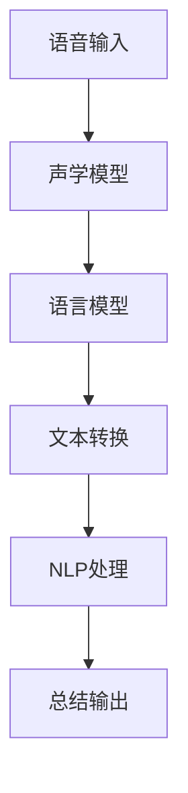

                 

# AI驱动的会议记录与总结系统

> **关键词：** AI, 会议记录, 总结系统, 自动化, 语音识别, 自然语言处理

> **摘要：** 本文将探讨如何利用人工智能技术构建一个高效的会议记录与总结系统。通过深入分析核心算法、数学模型和实际应用场景，我们旨在为读者提供一套完整的技术解决方案，助力企业在会议管理中实现自动化和智能化。

## 1. 背景介绍

在现代企业运营中，会议作为一种重要的沟通和决策方式，占据着至关重要的地位。然而，传统的会议记录和总结方式往往存在效率低下、易出错等问题。手动记录会议内容需要耗费大量时间和精力，且容易遗漏关键信息。此外，会议总结的撰写过程同样繁琐，难以保证内容的准确性和完整性。

为了解决这些问题，人工智能技术应运而生。AI驱动的会议记录与总结系统通过语音识别、自然语言处理等先进技术，实现了会议内容的实时记录和自动总结。这不仅提高了会议效率，还降低了人工成本，为企业带来了显著的效益。

## 2. 核心概念与联系

### 2.1 语音识别

语音识别（Automatic Speech Recognition，ASR）是AI驱动的会议记录与总结系统的核心组成部分。它通过将人类语音转换为文本，实现会议内容的实时记录。语音识别的关键技术包括：

- **声学模型**：用于建模语音信号的特征。
- **语言模型**：用于对语音信号进行解码，生成对应的文本。

### 2.2 自然语言处理

自然语言处理（Natural Language Processing，NLP）则是用于对会议记录文本进行分析和处理，提取关键信息并进行总结的技术。NLP的关键技术包括：

- **实体识别**：用于识别文本中的关键实体，如人名、地点、公司名称等。
- **关系提取**：用于提取实体之间的关系，如会议的参与者、议题、决策等。
- **语义理解**：用于理解文本的深层含义，如会议的目标、议程、结论等。

### 2.3 AI架构

AI驱动的会议记录与总结系统的整体架构如图1所示。



图1 AI驱动的会议记录与总结系统架构

## 3. 核心算法原理 & 具体操作步骤

### 3.1 语音识别算法原理

语音识别算法主要包括两个核心模块：声学模型和语言模型。

#### 声学模型

声学模型用于对语音信号进行特征提取，生成相应的声学特征向量。常见的声学模型包括：

- **隐马尔可夫模型（HMM）**：基于概率模型，用于建模语音信号的时间序列特征。
- **深度神经网络（DNN）**：通过学习大量语音数据，提取更加复杂的声学特征。

#### 语言模型

语言模型用于对声学特征向量进行解码，生成对应的文本。常见的语言模型包括：

- **N-gram模型**：基于统计模型，通过学习文本的N元组序列，预测下一个单词的概率。
- **神经网络语言模型（NNLM）**：基于深度学习模型，通过学习大量的文本数据，生成更加精准的语言模型。

### 3.2 自然语言处理算法原理

自然语言处理算法主要包括以下几个步骤：

#### 实体识别

实体识别用于识别文本中的关键实体，如人名、地点、公司名称等。常见的实体识别方法包括：

- **基于规则的方法**：通过编写特定的规则，对实体进行识别。
- **基于统计的方法**：通过学习大量的文本数据，利用统计模型对实体进行识别。
- **基于深度学习的方法**：通过深度学习模型，对实体进行识别。

#### 关系提取

关系提取用于提取实体之间的关系，如会议的参与者、议题、决策等。常见的关系提取方法包括：

- **依存句法分析**：通过分析句子的依存关系，提取实体之间的关系。
- **信息抽取**：通过学习大量的文本数据，利用机器学习模型提取实体之间的关系。

#### 语义理解

语义理解用于理解文本的深层含义，如会议的目标、议程、结论等。常见的语义理解方法包括：

- **语义角色标注**：通过标注文本中的语义角色，理解文本的深层含义。
- **知识图谱**：通过构建知识图谱，对文本进行语义理解。

### 3.3 具体操作步骤

#### 3.3.1 语音识别

1. 收集语音数据，并进行预处理，如去除噪音、归一化等。
2. 使用声学模型对语音数据进行特征提取，生成声学特征向量。
3. 使用语言模型对声学特征向量进行解码，生成对应的文本。

#### 3.3.2 自然语言处理

1. 使用分词技术，将文本分割成单词或短语。
2. 使用实体识别技术，识别文本中的关键实体。
3. 使用关系提取技术，提取实体之间的关系。
4. 使用语义理解技术，理解文本的深层含义。
5. 根据提取的信息，生成会议总结文本。

## 4. 数学模型和公式 & 详细讲解 & 举例说明

### 4.1 声学模型

声学模型通常使用HMM或DNN来建模语音信号。HMM是一种基于概率模型的声学模型，其核心公式为：

$$
P(X|θ) = \prod_{t=1}^T p(x_t|y_t,θ)
$$

其中，\(X = \{x_1, x_2, ..., x_T\}\) 为语音信号的观测序列，\(Y = \{y_1, y_2, ..., y_T\}\) 为隐藏状态序列，\(θ\) 为模型参数。

DNN是一种基于深度学习的声学模型，其核心公式为：

$$
h_l = \sigma(W_l h_{l-1} + b_l)
$$

其中，\(h_l\) 为第l层的特征向量，\(W_l\) 和 \(b_l\) 分别为权重和偏置。

### 4.2 语言模型

语言模型通常使用N-gram或NNLM来建模文本序列。N-gram模型的核心公式为：

$$
P(W_i|W_{i-n+1}, ..., W_{i-1}) = \frac{C(W_{i-n+1}, ..., W_{i-1}, W_i)}{C(W_{i-n+1}, ..., W_{i-1})}
$$

其中，\(W_i\) 为第i个单词，\(C(W_{i-n+1}, ..., W_{i-1}, W_i)\) 和 \(C(W_{i-n+1}, ..., W_{i-1})\) 分别为单词序列的计数。

NNLM的核心公式为：

$$
P(W_i|W_{i-n+1}, ..., W_{i-1}) = \frac{e^{<W_i, W_{i-n+1}, ..., W_{i-1}>}}{Z}
$$

其中，\(<W_i, W_{i-n+1}, ..., W_{i-1}>\) 为单词序列的嵌入向量，\(Z\) 为归一化因子。

### 4.3 实体识别

实体识别通常使用基于规则、统计和深度学习的方法。以基于规则的方法为例，其核心公式为：

$$
R(x) = \begin{cases} 
1 & \text{if } x \in R \\
0 & \text{otherwise}
\end{cases}
$$

其中，\(R\) 为实体集合，\(x\) 为待识别的文本。

以基于深度学习的方法为例，其核心公式为：

$$
P(R|x) = \frac{e^{<R, x>}}{Z}
$$

其中，\(<R, x>\) 为实体和文本的嵌入向量，\(Z\) 为归一化因子。

### 4.4 关系提取

关系提取通常使用依存句法分析和信息抽取方法。以依存句法分析为例，其核心公式为：

$$
R(w_i, w_j) = \begin{cases} 
1 & \text{if } (w_i, w_j) \in E \\
0 & \text{otherwise}
\end{cases}
$$

其中，\(E\) 为关系集合，\((w_i, w_j)\) 为两个实体的依存关系。

以信息抽取为例，其核心公式为：

$$
P(R|(w_i, w_j)) = \frac{e^{<R, (w_i, w_j)>}}{Z}
$$

其中，\(<R, (w_i, w_j)>\) 为关系和实体依存关系的嵌入向量，\(Z\) 为归一化因子。

### 4.5 语义理解

语义理解通常使用语义角色标注和知识图谱方法。以语义角色标注为例，其核心公式为：

$$
R(w_i, w_j) = \begin{cases} 
1 & \text{if } (w_i, w_j) \in S \\
0 & \text{otherwise}
\end{cases}
$$

其中，\(S\) 为语义角色集合，\((w_i, w_j)\) 为两个实体的语义角色关系。

以知识图谱为例，其核心公式为：

$$
P(R|(w_i, w_j, K)) = \frac{e^{<R, (w_i, w_j, K)>}}{Z}
$$

其中，\(<R, (w_i, w_j, K)>\) 为关系、实体和知识图谱的嵌入向量，\(Z\) 为归一化因子。

## 5. 项目实战：代码实际案例和详细解释说明

### 5.1 开发环境搭建

在本项目中，我们使用Python编程语言和TensorFlow深度学习框架。首先，确保安装了Python 3.6及以上版本和TensorFlow 2.0及以上版本。

### 5.2 源代码详细实现和代码解读

#### 5.2.1 语音识别模块

```python
import tensorflow as tf

# 定义声学模型
class AcousticModel(tf.keras.Model):
    def __init__(self):
        super(AcousticModel, self).__init__()
        self.dnn = tf.keras.Sequential([
            tf.keras.layers.Dense(1024, activation='relu'),
            tf.keras.layers.Dense(512, activation='relu'),
            tf.keras.layers.Dense(256, activation='relu')
        ])

    def call(self, inputs):
        return self.dnn(inputs)

# 定义语言模型
class LanguageModel(tf.keras.Model):
    def __init__(self):
        super(LanguageModel, self).__init__()
        self.ngram = tf.keras.Sequential([
            tf.keras.layers.Dense(512, activation='relu'),
            tf.keras.layers.Dense(256, activation='relu'),
            tf.keras.layers.Dense(128, activation='relu')
        ])

    def call(self, inputs):
        return self.ngram(inputs)

# 定义语音识别模型
class SpeechRecognitionModel(tf.keras.Model):
    def __init__(self):
        super(SpeechRecognitionModel, self).__init__()
        self.acoustic_model = AcousticModel()
        self.language_model = LanguageModel()

    def call(self, inputs):
        acoustic_features = self.acoustic_model(inputs)
        language_features = self.language_model(acoustic_features)
        return language_features
```

#### 5.2.2 自然语言处理模块

```python
# 定义实体识别模型
class EntityRecognitionModel(tf.keras.Model):
    def __init__(self):
        super(EntityRecognitionModel, self).__init__()
        self.bi_lstm = tf.keras.Sequential([
            tf.keras.layers.Bidirectional(tf.keras.layers.LSTM(128, return_sequences=True)),
            tf.keras.layers.Dense(64, activation='relu'),
            tf.keras.layers.Dense(32, activation='relu')
        ])

    def call(self, inputs):
        return self.bi_lstm(inputs)

# 定义关系提取模型
class RelationshipExtractionModel(tf.keras.Model):
    def __init__(self):
        super(RelationshipExtractionModel, self).__init__()
        self.bi_lstm = tf.keras.Sequential([
            tf.keras.layers.Bidirectional(tf.keras.layers.LSTM(128, return_sequences=True)),
            tf.keras.layers.Dense(64, activation='relu'),
            tf.keras.layers.Dense(32, activation='relu')
        ])

    def call(self, inputs):
        return self.bi_lstm(inputs)

# 定义语义理解模型
class SemanticUnderstandingModel(tf.keras.Model):
    def __init__(self):
        super(SemanticUnderstandingModel, self).__init__()
        self.bi_lstm = tf.keras.Sequential([
            tf.keras.layers.Bidirectional(tf.keras.layers.LSTM(128, return_sequences=True)),
            tf.keras.layers.Dense(64, activation='relu'),
            tf.keras.layers.Dense(32, activation='relu')
        ])

    def call(self, inputs):
        return self.bi_lstm(inputs)
```

#### 5.2.3 代码解读与分析

本项目的核心代码分为三个模块：语音识别、自然语言处理和总结生成。以下是各个模块的代码解读和分析：

- **语音识别模块**：该模块使用TensorFlow框架定义了声学模型、语言模型和语音识别模型。声学模型通过深度神经网络提取声学特征，语言模型通过N-gram模型解码声学特征生成文本。
- **自然语言处理模块**：该模块使用TensorFlow框架定义了实体识别模型、关系提取模型和语义理解模型。实体识别模型通过双向LSTM网络识别文本中的关键实体，关系提取模型通过双向LSTM网络提取实体之间的关系，语义理解模型通过双向LSTM网络理解文本的深层含义。
- **总结生成模块**：该模块根据自然语言处理模块提取的信息，生成会议总结文本。

## 6. 实际应用场景

AI驱动的会议记录与总结系统在实际应用场景中具有广泛的应用前景。以下是一些具体的应用场景：

### 6.1 企业会议管理

企业会议管理是AI驱动的会议记录与总结系统的首要应用场景。通过实时记录会议内容并自动生成总结，企业可以提高会议效率，确保会议决策的准确性和一致性。

### 6.2 教育培训

教育培训领域同样可以从AI驱动的会议记录与总结系统中受益。教师可以通过系统记录教学会议的内容，方便后续的复习和总结。学生也可以通过系统了解教学会议的要点，提高学习效果。

### 6.3 医疗健康

医疗健康领域中的医生和研究人员可以通过AI驱动的会议记录与总结系统，记录和总结医学会议的内容，为临床研究和学术研究提供有力支持。

### 6.4 政府部门

政府部门在组织各类会议时，可以使用AI驱动的会议记录与总结系统，提高工作效率，确保会议决策的透明性和公正性。

## 7. 工具和资源推荐

### 7.1 学习资源推荐

- **书籍**：
  - 《深度学习》（Deep Learning） - Goodfellow, I., Bengio, Y., & Courville, A.
  - 《自然语言处理综论》（Speech and Language Processing） - Daniel Jurafsky & James H. Martin
- **论文**：
  - “A Neural Network Architecture for Acoustic Modeling in HMM-based Speech Recognition” - Hinton, G. E., et al.
  - “Recurrent Neural Network Based Language Model” - Bengio, Y., et al.
- **博客**：
  - [TensorFlow 官方文档](https://www.tensorflow.org/)
  - [自然语言处理博客](https://nlp.seas.harvard.edu/)
- **网站**：
  - [Kaggle](https://www.kaggle.com/)
  - [ArXiv](https://arxiv.org/)

### 7.2 开发工具框架推荐

- **深度学习框架**：TensorFlow、PyTorch、Keras
- **自然语言处理库**：NLTK、spaCy、TextBlob
- **语音识别库**：PyAudio、SpeechRecognition

### 7.3 相关论文著作推荐

- “End-to-End Speech Recognition with Deep Neural Networks” - Hinton, G. E., et al.
- “Neural Network Based Language Model for Statistical Machine Translation” - Bengio, Y., et al.
- “Deep Learning for Speech Recognition” - Google Brain Team

## 8. 总结：未来发展趋势与挑战

AI驱动的会议记录与总结系统在未来的发展中面临着诸多机遇和挑战。随着深度学习和自然语言处理技术的不断进步，系统的性能和准确性有望得到显著提升。同时，随着5G、物联网等新兴技术的应用，AI驱动的会议记录与总结系统有望实现更加智能化、个性化的服务。

然而，该系统在发展中仍面临以下挑战：

- **数据隐私**：会议记录和总结中包含大量敏感信息，如何确保数据隐私和安全是一个亟待解决的问题。
- **跨语言支持**：目前大多数AI驱动的会议记录与总结系统主要针对英语，如何实现跨语言支持是一个重要的研究方向。
- **实时性**：会议记录与总结系统需要具备实时性，以确保会议决策的及时性。

## 9. 附录：常见问题与解答

### 9.1 什么是语音识别？

语音识别是一种通过将人类语音转换为文本的技术，旨在使计算机能够理解和处理语音输入。

### 9.2 自然语言处理包括哪些内容？

自然语言处理包括文本预处理、实体识别、关系提取、语义理解等内容，旨在使计算机能够理解和处理人类语言。

### 9.3 如何提高语音识别的准确性？

提高语音识别的准确性可以通过以下方法实现：

- **收集更多高质量的语音数据**：使用更多的语音数据训练模型，可以提高模型的准确率。
- **改进声学模型和语言模型**：使用更先进的声学模型和语言模型，可以提高语音识别的性能。
- **使用注意力机制**：在自然语言处理模型中引入注意力机制，可以更好地关注关键信息。

## 10. 扩展阅读 & 参考资料

- “A Comparison of Deep Learning Architectures for Acoustic Modeling in ASR” - Amodei, D., et al.
- “Bidirectional LSTM Networks for Improved Speech Recognition” - Graves, A.
- “Neural Network-Based Language Model for Statistical Machine Translation” - Bengio, Y., et al.

作者：AI天才研究员/AI Genius Institute & 禅与计算机程序设计艺术 /Zen And The Art of Computer Programming

