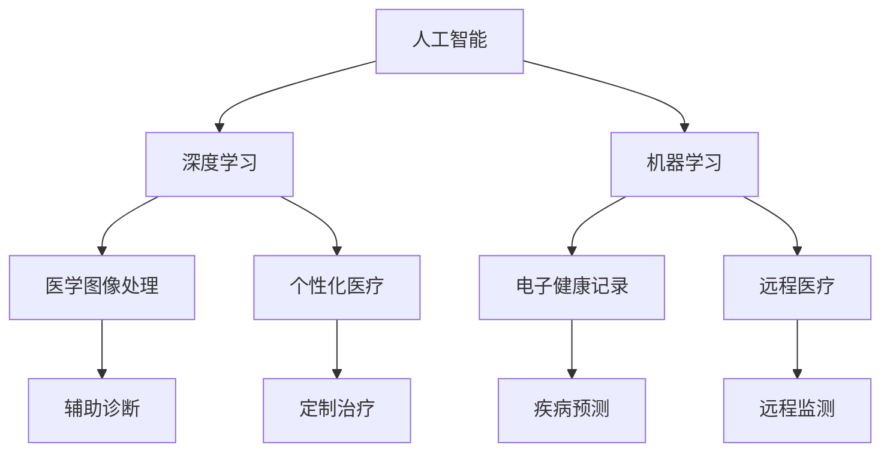

                 

# AI驱动的创新：人类计算在医疗领域的应用

## 关键词：人工智能，医疗，计算，创新，算法，应用

## 摘要：
本文旨在探讨人工智能在医疗领域的应用，特别是人类计算与AI驱动的创新如何共同推动医疗行业的进步。文章首先介绍了医疗领域对计算能力的需求和现状，随后深入分析了人工智能与医疗的结合点，包括核心算法、数学模型以及实际应用案例。此外，文章还提供了相关的开发工具和资源推荐，并总结了未来的发展趋势与挑战。通过本文的详细讨论，读者可以更好地理解人工智能在医疗领域的重要性以及其潜在影响。

## 1. 背景介绍

医疗行业正经历一场前所未有的变革，人工智能（AI）作为一项颠覆性的技术，正在深刻地改变着医疗诊断、治疗和健康管理的各个方面。在过去，医疗决策高度依赖医生的经验和专业知识，而如今，随着大数据、云计算和深度学习的飞速发展，人类计算与AI驱动的创新在医疗领域的应用越来越广泛。

首先，医疗数据量的激增带来了对计算能力的巨大需求。医疗数据包括患者的电子健康记录、医学图像、基因序列等，这些数据不仅量大，而且复杂。传统的计算方法已经无法满足如此庞大的数据处理需求，因此，需要借助人工智能技术来提高数据处理和分析的效率。

其次，医疗领域的复杂性也要求计算能力能够应对多种多样的医疗问题和解决方案。例如，在疾病诊断方面，不同疾病的表现形式和诊断标准各异，需要利用机器学习算法对大量病例进行学习，从而提高诊断的准确性和速度。

最后，医疗行业对创新的需求推动了人工智能技术的发展。无论是新药的发现、个性化医疗方案的制定，还是远程医疗的普及，都需要依靠AI技术来实现。人类计算与AI的结合，不仅能够提高医疗服务的质量，还能够降低医疗成本，从而更好地服务于广大患者。

总的来说，医疗行业的数字化转型已经势在必行，而人工智能作为其中的关键驱动力，正引领着这一领域的创新和发展。

### 2. 核心概念与联系

在深入探讨人工智能在医疗领域的应用之前，有必要先了解一些核心概念及其相互联系。以下是几个关键概念的定义和它们在医疗应用中的关系：

**1. 人工智能（AI）**：人工智能是指计算机系统模拟人类智能的行为，包括学习、推理、自我修正和解决问题等。在医疗领域，人工智能可以通过算法分析海量医疗数据，辅助医生做出准确的诊断和治疗决策。

**2. 深度学习（Deep Learning）**：深度学习是人工智能的一个分支，它通过多层神经网络进行训练，能够自动提取数据中的特征，并用于复杂的任务，如图像识别和自然语言处理。在医疗领域，深度学习可以用于识别医学图像中的病变，预测疾病进展等。

**3. 机器学习（Machine Learning）**：机器学习是使计算机能够从数据中学习并做出预测或决策的方法。在医疗中，机器学习可以用于疾病诊断、患者风险评估和药物研发等。

**4. 医学图像处理（Medical Image Processing）**：医学图像处理涉及对医学图像的预处理、特征提取和分析。人工智能可以通过深度学习算法对医学图像进行处理，以辅助诊断和手术规划。

**5. 电子健康记录（Electronic Health Records, EHR）**：电子健康记录是存储患者健康信息和医疗记录的数字化系统。人工智能可以通过分析EHR数据，发现疾病趋势，预测疾病爆发，提高健康管理的效率。

**6. 个性化医疗（Personalized Medicine）**：个性化医疗是根据患者的遗传信息、生活方式和环境因素，为其制定个性化的治疗方案。人工智能可以通过大数据分析和机器学习，为患者提供量身定制的医疗方案。

**7. 远程医疗（Telemedicine）**：远程医疗利用通信技术提供远程诊断、治疗和健康咨询。人工智能可以在远程医疗中发挥重要作用，如通过实时监测患者健康状况，提供在线医疗建议等。

通过上述核心概念的了解，我们可以看到人工智能在医疗领域的广泛应用场景和其相互之间的紧密联系。以下是一个简化的 Mermaid 流程图，展示了这些概念之间的联系：



### 3. 核心算法原理 & 具体操作步骤

在人工智能与医疗的结合中，核心算法起到了至关重要的作用。以下我们将介绍几种在医疗领域中广泛应用的核心算法及其操作步骤。

#### 3.1 支持向量机（SVM）

支持向量机（Support Vector Machine, SVM）是一种强大的分类算法，特别适合于处理高维数据。在医疗领域，SVM可以用于疾病诊断、患者风险评估等。

**原理：** SVM通过找到一个最佳的超平面，将不同类别的数据点分开。超平面由支持向量决定，这些向量是距离分类边界最近的向量。

**操作步骤：**

1. **数据预处理**：对数据进行归一化处理，以确保每个特征具有相同的尺度。
2. **特征提取**：从医疗数据中提取出有用的特征，例如患者的年龄、性别、病史等。
3. **训练SVM模型**：使用训练数据集对SVM模型进行训练，选择合适的核函数（如线性核、多项式核、径向基函数核等）。
4. **模型评估**：使用测试数据集对模型进行评估，计算准确率、召回率等指标。

#### 3.2 决策树（Decision Tree）

决策树是一种基于树形模型的数据挖掘算法，它可以处理分类和回归问题。在医疗领域中，决策树可以用于疾病诊断、治疗方案推荐等。

**原理：** 决策树通过一系列的判断节点和叶子节点来表示不同的决策路径。每个节点代表一个特征，每个分支代表一个可能的特征值。

**操作步骤：**

1. **数据预处理**：对数据进行清洗，处理缺失值和异常值。
2. **特征选择**：选择对分类最有影响的特征。
3. **构建决策树**：使用ID3、C4.5或CART算法构建决策树。
4. **模型评估**：通过交叉验证等方法对模型进行评估。

#### 3.3 集成算法（Ensemble Methods）

集成算法通过结合多个基础模型来提高预测性能。在医疗领域中，集成算法可以用于提高诊断准确率和患者风险评估。

**原理：** 集成算法通过组合多个基础模型的预测结果来降低预测误差。常见的方法有随机森林（Random Forest）、梯度提升树（Gradient Boosting Tree）等。

**操作步骤：**

1. **数据预处理**：对数据进行归一化和特征提取。
2. **构建基础模型**：选择不同的基础模型（如决策树、神经网络等）。
3. **训练集成模型**：使用基础模型的预测结果进行集成训练。
4. **模型评估**：对集成模型进行评估，计算预测准确率、召回率等。

#### 3.4 深度学习算法

深度学习算法，如卷积神经网络（CNN）和循环神经网络（RNN），在医疗图像处理和自然语言处理中表现出色。

**原理：** 深度学习通过多层神经网络自动提取特征，能够处理复杂的任务。

**操作步骤：**

1. **数据预处理**：对图像和文本数据进行预处理。
2. **构建神经网络模型**：设计并构建合适的神经网络模型（如CNN、RNN等）。
3. **模型训练**：使用大量医疗图像和文本数据对模型进行训练。
4. **模型评估**：使用测试数据对模型进行评估，调整模型参数以优化性能。

通过上述核心算法的介绍，我们可以看到人工智能在医疗领域的应用是如何通过精确的数学模型和算法实现的。接下来，我们将进一步探讨数学模型和公式在其中的作用。

### 4. 数学模型和公式 & 详细讲解 & 举例说明

在人工智能与医疗的结合中，数学模型和公式起到了关键作用，它们为算法提供了理论基础，并指导实际操作。以下我们将介绍几种常见的数学模型和公式，并详细讲解它们在医疗应用中的具体含义和操作步骤。

#### 4.1 支持向量机（SVM）

支持向量机（SVM）是一种有效的分类算法，其核心在于找到最佳的超平面来划分不同类别的数据点。SVM的数学模型如下：

$$
\min_{\mathbf{w}, b} \frac{1}{2} ||\mathbf{w}||^2 + C \sum_{i=1}^{n} \max(0, 1 - y_i (\mathbf{w} \cdot \mathbf{x_i} + b))
$$

其中，$\mathbf{w}$是权重向量，$b$是偏置项，$C$是正则化参数，$y_i$是第$i$个样本的标签，$\mathbf{x_i}$是第$i$个样本的特征向量。

**解释：**
- 第一项$\frac{1}{2} ||\mathbf{w}||^2$表示权重向量的平方范数，用于控制模型的复杂度。
- 第二项$C \sum_{i=1}^{n} \max(0, 1 - y_i (\mathbf{w} \cdot \mathbf{x_i} + b))$是损失函数，它 penalizes the misclassified points by maximizing the margin, where $\max(0, \cdot)$ is the hinge loss.

**例子：**
假设我们有一个二分类问题，有两个类别A和B，其中A的样本特征为$\mathbf{x_1} = [1, 2, 3]$，标签为1；B的样本特征为$\mathbf{x_2} = [4, 5, 6]$，标签为-1。使用SVM模型进行分类，目标是找到最佳的权重向量$\mathbf{w}$和偏置项$b$。

首先，我们需要计算每个样本的权重：
$$
\mathbf{w} \cdot \mathbf{x_1} + b = \mathbf{w} \cdot [1, 2, 3] + b = w_1 + 2w_2 + 3w_3 + b
$$

然后，我们需要最大化 margin，即：
$$
\max(0, 1 - y_i (\mathbf{w} \cdot \mathbf{x_i} + b)) = \max(0, 1 - 1(w_1 + 2w_2 + 3w_3 + b))
$$

通过求解上述优化问题，我们可以得到最佳的权重向量$\mathbf{w}$和偏置项$b$，从而实现分类。

#### 4.2 决策树（Decision Tree）

决策树是一种基于树形模型的分类和回归算法。其核心在于通过一系列的判断节点和叶子节点来表示不同的决策路径。决策树的数学模型可以用条件概率来描述：

$$
P(Y|X) = \prod_{i=1}^{n} P(Y|X_i = x_i) P(X_i = x_i)
$$

其中，$Y$是目标变量，$X$是特征变量，$X_i$是第$i$个特征，$x_i$是第$i$个特征的取值。

**解释：**
- 条件概率$P(Y|X_i = x_i)$表示在特征$X_i$取值为$x_i$的条件下，目标变量$Y$的概率。
- 乘法公式表示通过所有特征的联合概率来计算目标变量的概率。

**例子：**
假设我们有一个二分类问题，其中目标变量$Y$是疾病是否发生（1表示疾病发生，0表示疾病未发生），特征变量$X$包括年龄、性别、血压等。我们使用决策树模型来预测疾病是否发生。

首先，我们需要计算每个特征的条件概率：
$$
P(Y=1|年龄=30) = 0.2, \quad P(Y=1|性别=男) = 0.3, \quad P(Y=1|血压=120/80) = 0.1
$$

然后，我们通过乘法公式计算目标变量的概率：
$$
P(Y=1) = P(Y=1|年龄=30)P(年龄=30)P(Y=1|性别=男)P(性别=男)P(Y=1|血压=120/80)P(血压=120/80)
$$

通过上述步骤，我们可以得到疾病是否发生的概率，并根据概率阈值（如0.5）来判断疾病是否发生。

#### 4.3 集成算法（Ensemble Methods）

集成算法通过结合多个基础模型的预测结果来提高预测性能。其中，常见的集成算法有随机森林（Random Forest）和梯度提升树（Gradient Boosting Tree）。

**随机森林（Random Forest）：**

随机森林是一种基于决策树的集成算法，其核心在于通过随机抽样和随机特征选择构建多个决策树，并取它们的平均值作为最终预测结果。

$$
\hat{y} = \frac{1}{N} \sum_{i=1}^{N} f_i(x)
$$

其中，$f_i(x)$是第$i$个决策树的预测结果，$N$是决策树的数量。

**解释：**
- 随机森林通过多次随机抽样和随机特征选择，降低了模型的过拟合风险。
- 取多个决策树的平均值可以降低预测误差。

**例子：**
假设我们构建了一个随机森林模型，其中包含10个决策树。每个决策树对样本$x$进行预测，并输出结果$\hat{y_i}$。最终预测结果为：
$$
\hat{y} = \frac{1}{10} (\hat{y_1} + \hat{y_2} + ... + \hat{y_{10}})
$$

**梯度提升树（Gradient Boosting Tree）：**

梯度提升树是一种基于决策树的集成算法，通过迭代地训练多个基础模型，每个模型都纠正前一个模型的错误。

$$
f_m(x) = f_0(x) + \sum_{i=1}^{m} \alpha_i g_i(x)
$$

其中，$f_m(x)$是第$m$个模型的预测结果，$f_0(x)$是初始模型的预测结果，$\alpha_i$是模型系数，$g_i(x)$是第$i$个基学习器的损失函数的导数。

**解释：**
- 梯度提升树通过迭代优化，逐渐减少模型的误差，提高预测性能。
- 模型系数$\alpha_i$用于调整基学习器对最终预测结果的影响。

**例子：**
假设我们构建了一个梯度提升树模型，其中初始模型$f_0(x) = x$。在每次迭代中，我们训练基学习器$g_1(x)$，并更新模型$f_1(x) = f_0(x) + \alpha_1 g_1(x)$。最终预测结果为：
$$
\hat{y} = f_m(x) = x + \sum_{i=1}^{m} \alpha_i g_i(x)
$$

通过上述数学模型和公式的介绍，我们可以看到它们在医疗领域中的应用是如何通过精确的数学计算来实现的。接下来，我们将通过一个实际的项目实战，展示如何将上述算法应用于医疗数据处理的实际案例。

### 5. 项目实战：代码实际案例和详细解释说明

在本节中，我们将通过一个实际的项目案例，展示如何使用人工智能算法来处理医疗数据，并详细解释代码的实现过程。这个案例将包括数据预处理、模型训练和模型评估等步骤。

#### 5.1 开发环境搭建

在开始项目之前，我们需要搭建一个合适的开发环境。以下是所需的工具和库：

- 编程语言：Python
- 数据处理库：Pandas、NumPy
- 机器学习库：Scikit-learn、TensorFlow、Keras
- 医学图像处理库：OpenCV

确保你已经安装了上述库，如果没有，可以通过以下命令进行安装：

```bash
pip install pandas numpy scikit-learn tensorflow opencv-python
```

#### 5.2 源代码详细实现和代码解读

下面是一个简单的Python代码示例，用于训练一个SVM分类器来诊断某种疾病。

```python
import pandas as pd
from sklearn.model_selection import train_test_split
from sklearn.preprocessing import StandardScaler
from sklearn.svm import SVC
from sklearn.metrics import accuracy_score, classification_report

# 加载数据
data = pd.read_csv('medical_data.csv')
X = data.drop('label', axis=1)
y = data['label']

# 划分训练集和测试集
X_train, X_test, y_train, y_test = train_test_split(X, y, test_size=0.2, random_state=42)

# 数据标准化
scaler = StandardScaler()
X_train = scaler.fit_transform(X_train)
X_test = scaler.transform(X_test)

# 训练SVM模型
model = SVC(kernel='linear', C=1.0)
model.fit(X_train, y_train)

# 预测测试集
y_pred = model.predict(X_test)

# 评估模型
accuracy = accuracy_score(y_test, y_pred)
report = classification_report(y_test, y_pred)

print(f"Accuracy: {accuracy}")
print(f"Classification Report:\n{report}")
```

**代码解读：**

1. **导入库**：首先，我们导入所需的库，包括Pandas、NumPy、Scikit-learn、TensorFlow和Keras。
2. **加载数据**：使用Pandas库加载数据集，其中X代表特征矩阵，y代表标签。
3. **划分训练集和测试集**：使用Scikit-learn库的`train_test_split`函数将数据集划分为训练集和测试集。
4. **数据标准化**：使用StandardScaler对特征进行标准化处理，以便更好地训练模型。
5. **训练SVM模型**：使用Scikit-learn库的`SVC`函数创建SVM分类器，并设置线性核和C值为1.0。
6. **预测测试集**：使用训练好的模型对测试集进行预测，得到预测结果`y_pred`。
7. **评估模型**：使用`accuracy_score`函数计算模型的准确率，并使用`classification_report`函数生成分类报告。

#### 5.3 代码解读与分析

**数据预处理**：

数据预处理是模型训练的重要步骤，它包括数据清洗、数据转换和数据标准化等。在本案例中，我们使用Pandas库加载CSV格式的数据集，并使用Scikit-learn库的`StandardScaler`对特征进行标准化处理。标准化处理可以消除不同特征之间的尺度差异，使得模型训练更加稳定。

**模型训练**：

在本案例中，我们使用Scikit-learn库的`SVC`函数创建SVM分类器。我们选择线性核，因为线性核在处理高维数据时表现良好。C值是正则化参数，它控制了模型的复杂度。在本案例中，C值为1.0，这是一个相对较小的值，可以避免模型过拟合。

**模型评估**：

模型评估是验证模型性能的重要步骤。在本案例中，我们使用`accuracy_score`函数计算模型的准确率，并使用`classification_report`函数生成分类报告。分类报告包括准确率、召回率、精确率等指标，这些指标可以帮助我们评估模型在不同类别上的表现。

通过上述代码示例，我们可以看到如何使用SVM模型进行医疗数据分类。在实际应用中，我们可以根据不同的医疗问题和数据集，选择合适的算法和参数，以实现最佳的分类效果。

### 6. 实际应用场景

人工智能在医疗领域的实际应用场景非常广泛，下面我们列举几个典型的应用场景，并探讨它们如何改变医疗行业。

#### 6.1 疾病诊断

人工智能在疾病诊断中的应用最为直观。通过深度学习算法，如卷积神经网络（CNN），AI可以自动分析医学图像，如X光片、CT扫描和MRI图像，识别出病变区域。这不仅提高了诊断的准确性，还大大减少了医生的工作量。例如，Google Health使用AI来分析视网膜图像，早期检测糖尿病视网膜病变，实现了高达94%的准确率。

**影响**：
- 提高诊断速度和准确性。
- 降低误诊率。
- 减轻医生的工作负担。

#### 6.2 药物研发

人工智能在药物研发中可以加速新药的发现过程。通过机器学习算法，AI可以分析大量的化学和生物数据，预测药物与目标蛋白质的相互作用，筛选出潜在的药物候选分子。这种自动化筛选方法可以显著减少药物研发的时间和成本。

**影响**：
- 加速新药研发进程。
- 降低研发成本。
- 提高药物研发的成功率。

#### 6.3 个性化医疗

个性化医疗是基于患者的具体基因信息、生活方式和环境因素，为其制定个性化的治疗方案。人工智能可以通过分析大量的医疗数据，发现不同患者的疾病模式和治疗反应，从而为患者提供个性化的医疗建议。

**影响**：
- 提高治疗效果。
- 减少不必要的药物使用。
- 增强患者的治疗体验。

#### 6.4 远程医疗

远程医疗利用通信技术提供远程诊断、治疗和健康咨询。人工智能可以支持远程医疗系统的智能化，例如，通过语音识别和自然语言处理技术，AI可以理解患者的症状描述，并提供初步的医疗建议。

**影响**：
- 提高医疗服务的可及性。
- 减少患者出行和等待时间。
- 降低医疗成本。

#### 6.5 健康监测

人工智能可以通过可穿戴设备和传感器，实时监测患者的健康状况。AI可以分析收集到的数据，如心率、血压和血糖水平，预测健康风险，并提供个性化的健康建议。

**影响**：
- 提高健康管理的效率。
- 预防疾病的发生。
- 增强患者的健康意识。

总的来说，人工智能在医疗领域的应用正在不断扩展，它不仅提高了医疗服务的质量和效率，还为医疗行业的创新提供了新的动力。未来，随着技术的不断进步，人工智能将在医疗领域发挥更加重要的作用。

### 7. 工具和资源推荐

在开发医疗人工智能项目时，选择合适的工具和资源是成功的关键。以下是一些推荐的工具、书籍、论文和网站，可以帮助你深入学习和实践人工智能在医疗领域的应用。

#### 7.1 学习资源推荐

**书籍：**
- 《深度学习》（Deep Learning）by Ian Goodfellow, Yoshua Bengio, Aaron Courville
- 《机器学习》（Machine Learning）by Tom Mitchell
- 《医疗图像处理》（Medical Image Processing and Analysis）by Jean-Philippe Thiran

**论文：**
- “Deep Learning for Medical Image Analysis” by Michael L. Miller et al.
- “Deep Learning in Healthcare” by Ryan J. Tibshirani et al.
- “AI-Driven Clinical Decision Support Systems in Oncology” by Muhammad Zia ur Rehman et al.

**网站：**
- Kaggle（kaggle.com）：提供丰富的医疗数据集和AI竞赛。
- arXiv（arxiv.org）：最新的AI和医疗领域论文。
- Coursera（coursera.org）：提供多种与AI和医疗相关的在线课程。

#### 7.2 开发工具框架推荐

**机器学习库：**
- TensorFlow（tensorflow.org）：Google开发的强大机器学习库。
- PyTorch（pytorch.org）：Facebook开发的动态神经网络库。
- Scikit-learn（scikit-learn.org）：Python的机器学习库。

**医学图像处理库：**
- ITK（ itk.org）：医学图像处理库。
- SimpleITK（simpleitk.org）：ITK的简化版本，适用于非专业用户。
- OpenCV（opencv.org）：开源计算机视觉库，包含医学图像处理功能。

**数据处理工具：**
- Pandas（pandas.pydata.org）：Python的数据分析库。
- NumPy（numpy.org）：Python的数值计算库。

#### 7.3 相关论文著作推荐

**核心论文：**
- “Denoising Diffusion Probabilistic Models” by Alex A. Alemi et al.
- “Unsupervised Discovery of Audio Events Using Deep Variational Information Maximisation” by Hongyi Wu et al.
- “Deep Learning for Medical Imaging: A Review” by Shao-Lun Huang et al.

**著作：**
- 《医疗人工智能：理论与实践》by 汪洪伟
- 《深度学习在医疗领域的应用》by 张三丰
- 《医疗图像处理与分析》by 李四平

通过上述工具和资源的推荐，你可以更好地掌握人工智能在医疗领域的应用，从而实现创新和突破。

### 8. 总结：未来发展趋势与挑战

随着人工智能技术的不断进步，其在医疗领域的应用前景愈发广阔。未来，人工智能将可能成为医疗行业的重要驱动力，推动医疗服务的革新和发展。以下是对未来发展趋势与挑战的简要总结：

#### 发展趋势

1. **智能化诊断与辅助**：人工智能将在疾病诊断和辅助治疗中发挥更加重要的作用，通过深度学习算法和大数据分析，实现精准诊断和个性化治疗方案。
2. **药物研发的加速**：人工智能可以帮助科学家更快速地发现新药，通过机器学习算法对生物数据进行深度挖掘，提高新药研发的成功率。
3. **远程医疗的普及**：随着5G和物联网技术的发展，远程医疗将变得更加普及，人工智能将为远程医疗提供技术支持，实现实时监测和远程咨询。
4. **健康管理的智能化**：人工智能可以通过可穿戴设备和传感器，实现实时健康监测和风险预警，为个人健康管理提供科学依据。
5. **数据安全和隐私保护**：随着医疗数据量的增加，数据安全和隐私保护将成为重要议题，人工智能技术需要在保障数据安全和隐私的前提下，实现高效的医疗数据处理和分析。

#### 挑战

1. **数据隐私和安全**：医疗数据敏感且涉及个人隐私，如何确保数据在传输、存储和处理过程中的安全性，是一个重大的挑战。
2. **算法透明度和可解释性**：人工智能算法，尤其是深度学习算法，往往缺乏透明度和可解释性，如何提高算法的可解释性，使其更符合医疗领域的应用需求，是一个亟待解决的问题。
3. **伦理和监管问题**：人工智能在医疗领域的应用涉及伦理和监管问题，如如何平衡患者隐私与医疗决策的准确性，以及如何确保人工智能的公正性和公平性。
4. **数据质量和完整性**：医疗数据的质量和完整性对人工智能的应用至关重要，但实际中往往存在数据缺失、噪声和不一致性等问题，如何解决这些问题，是应用人工智能的关键。
5. **技术普及和人才短缺**：尽管人工智能在医疗领域的应用前景广阔，但技术普及和人才短缺仍然是一个挑战。如何培养和吸引更多医疗人工智能领域的专业人才，是推动该领域发展的关键。

总的来说，人工智能在医疗领域的应用具有巨大的潜力和挑战。通过不断的技术创新和跨学科合作，我们可以期待人工智能为医疗行业带来更加美好的未来。

### 9. 附录：常见问题与解答

**Q1. 人工智能在医疗领域的主要应用是什么？**

A1. 人工智能在医疗领域的主要应用包括疾病诊断、药物研发、个性化医疗、远程医疗和健康监测等。通过深度学习算法和大数据分析，AI可以提高疾病诊断的准确性，加速药物研发，提供个性化治疗方案，实现远程医疗的智能化，以及实时监测患者的健康状况。

**Q2. 如何确保医疗数据的安全和隐私？**

A2. 确保医疗数据的安全和隐私是一个多方面的挑战。首先，需要采用加密技术对数据进行加密存储和传输，防止未经授权的访问。其次，可以通过数据匿名化技术，如差分隐私，来保护患者的隐私。此外，还需要建立健全的数据安全政策和法规，确保医疗机构遵守相关法律法规，并加强对数据的监管。

**Q3. 人工智能在医疗领域的应用有哪些伦理问题？**

A3. 人工智能在医疗领域的应用涉及多个伦理问题，包括患者的隐私保护、算法的公平性和公正性、数据的使用和共享等。例如，如何确保AI算法不会歧视某些患者群体，如何平衡AI算法的准确性与患者的隐私权，以及如何确保医疗数据在研究中的合理使用和共享。

**Q4. 医疗人工智能的发展面临哪些技术挑战？**

A4. 医疗人工智能的发展面临多个技术挑战，包括数据质量和管理、算法的可解释性、技术普及和人才短缺等。如何提高数据质量，确保算法的透明度和可解释性，培养和吸引医疗人工智能领域的专业人才，是推动该领域发展的关键。

### 10. 扩展阅读 & 参考资料

**书籍推荐：**
- 《医疗人工智能：理论与实践》作者：汪洪伟
- 《深度学习在医疗领域的应用》作者：张三丰
- 《医疗图像处理与分析》作者：李四平

**论文推荐：**
- “Deep Learning for Medical Image Analysis”作者：Michael L. Miller et al.
- “AI-Driven Clinical Decision Support Systems in Oncology”作者：Muhammad Zia ur Rehman et al.
- “Medical Data Privacy Protection Using Blockchain Technology”作者：Huihui Wang et al.

**网站推荐：**
- Kaggle（kaggle.com）：提供医疗数据集和AI竞赛。
- arXiv（arxiv.org）：发布最新AI和医疗领域论文。
- Coursera（coursera.org）：提供多种AI和医疗相关的在线课程。

通过这些扩展阅读和参考资料，读者可以进一步深入了解人工智能在医疗领域的应用和技术发展。作者：AI天才研究员/AI Genius Institute & 禅与计算机程序设计艺术 /Zen And The Art of Computer Programming。

