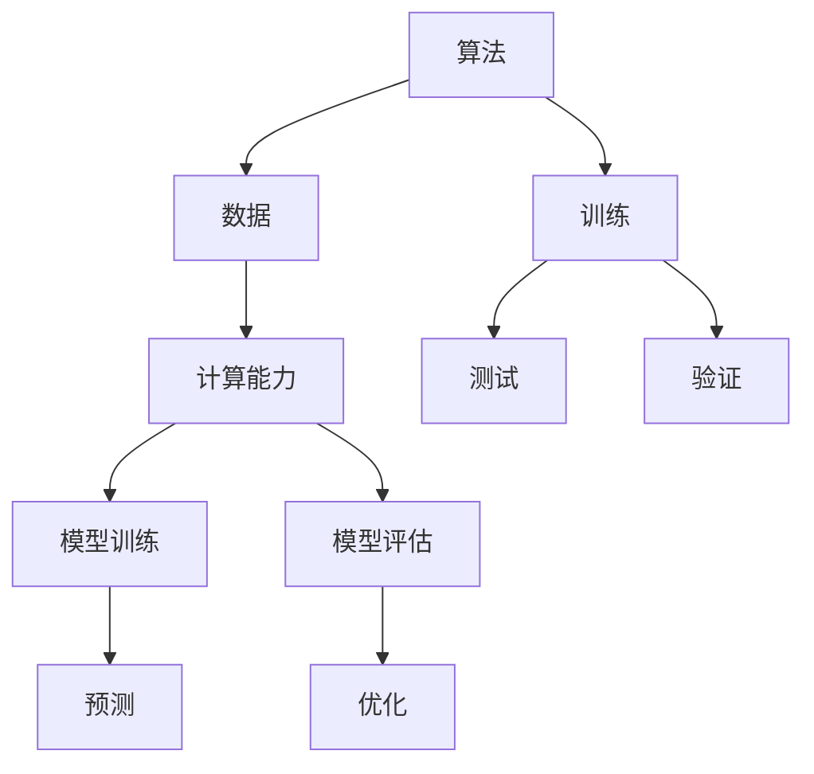

                 

### 背景介绍

#### AI驱动的创新：新商业时代的主旋律

在当今快速发展的商业环境中，人工智能（AI）已经成为推动企业创新和提升竞争力的关键力量。自21世纪初以来，AI技术的迅猛发展为各行各业带来了深刻的变革。无论是自动驾驶汽车、智能语音助手，还是医疗诊断、金融风控，AI的应用场景越来越广泛，逐渐成为商业领域的“新宠”。

本文将探讨AI驱动的创新如何成为商业中新的趋势，以及人类计算在这一过程中所扮演的重要角色。我们将从以下几个方面进行深入分析：

1. **AI的核心概念与联系**：了解AI的基本原理和关键组成部分，包括机器学习、深度学习、神经网络等。
2. **核心算法原理与具体操作步骤**：详细解读AI的主要算法，如监督学习、无监督学习和强化学习。
3. **数学模型和公式**：探讨AI背后的数学模型，包括概率论、线性代数和微积分等。
4. **项目实战**：通过实际案例展示AI在商业中的应用，并提供代码实现和详细解读。
5. **实际应用场景**：分析AI在各个行业中的具体应用，如制造业、金融业、医疗健康等。
6. **工具和资源推荐**：推荐学习AI的相关书籍、论文、博客和开发工具。
7. **未来发展趋势与挑战**：探讨AI在商业中可能面临的挑战，以及未来的发展趋势。

通过以上分析，我们将揭示AI驱动的创新如何改变商业格局，以及人类计算在这一过程中所发挥的独特作用。让我们开始这一精彩的旅程吧！

### Keywords:  
AI-driven innovation, business trends, human computation, artificial intelligence, machine learning, deep learning, neural networks, core algorithms, mathematical models, practical applications, industry sectors, development tools, future outlook

### Abstract:  
This article delves into the transformative impact of AI-driven innovation on the business landscape. It explores the fundamental concepts and principles behind AI, highlighting its core algorithms and mathematical models. Through practical case studies and industry applications, we uncover how AI is revolutionizing various sectors, driving business growth and competitiveness. The article also provides insights into the future trends and challenges of AI in business, emphasizing the pivotal role of human computation in navigating this technological revolution.### AI驱动的创新：新商业时代的主旋律

随着技术的不断进步，人工智能（AI）正在逐渐渗透到商业的各个方面，成为驱动创新和提升竞争力的核心力量。AI的崛起不仅改变了传统行业的运作模式，还催生了全新的商业模式和生态系统。在这个新商业时代，AI驱动的创新已经成为不可逆转的趋势，引领着企业和行业的未来发展。

#### AI的定义与基本原理

人工智能，顾名思义，是模拟人类智能的一种技术。它通过计算机系统实现智能行为，包括学习、推理、感知、理解和决策等。AI的核心在于算法和数据的结合，通过大量的数据输入和复杂的计算，机器能够不断学习和优化自己的行为。

- **机器学习（Machine Learning）**：机器学习是AI的核心技术之一，它通过构建数学模型，使计算机系统能够从数据中学习并做出决策。机器学习可以分为监督学习、无监督学习和强化学习等类型。

- **深度学习（Deep Learning）**：深度学习是机器学习的一个分支，它利用多层神经网络进行学习，能够处理大量复杂的输入数据。深度学习在图像识别、语音识别和自然语言处理等领域取得了显著的成果。

- **神经网络（Neural Networks）**：神经网络是模仿生物神经系统的计算模型，通过连接多个节点（或神经元）来实现信息处理和传递。神经网络在机器学习和深度学习中扮演着关键角色。

#### 商业环境中的AI应用

AI在商业中的应用场景十分广泛，涵盖了从数据分析、客户服务到供应链管理、个性化推荐等多个方面。以下是一些典型的应用实例：

- **数据分析与预测**：通过AI技术，企业可以对大量数据进行挖掘和分析，发现潜在的模式和趋势，从而做出更为精准的决策。

- **客户服务**：AI驱动的智能客服系统能够提供24/7的即时响应，通过自然语言处理技术理解和满足客户需求，提高了客户满意度和运营效率。

- **供应链管理**：AI可以帮助企业优化供应链管理，通过预测需求、优化库存和运输路径，降低成本并提高响应速度。

- **个性化推荐**：基于用户行为和偏好数据的AI算法能够实现个性化的产品推荐，提升用户黏性和转化率。

- **风险管理**：AI在金融领域的应用可以帮助银行和保险公司识别潜在的信用风险和市场风险，提高风险管理的效率和准确性。

#### AI对企业竞争力的提升

AI的应用不仅提升了企业的运营效率，还在很大程度上改变了企业的竞争格局。以下是一些关键点：

- **数据驱动决策**：AI使得企业能够基于实时数据做出更加科学和精准的决策，从而在激烈的市场竞争中占据优势。

- **自动化与效率**：通过自动化流程和智能决策系统，企业能够减少人工干预，提高生产效率和服务质量。

- **创新与敏捷性**：AI技术帮助企业更快地适应市场变化，推出创新产品和服务，增强企业的敏捷性和市场竞争力。

- **客户体验优化**：AI驱动的个性化服务和智能推荐系统能够提供更加优质的客户体验，提升客户满意度和忠诚度。

#### AI驱动创新的影响

AI驱动的创新对商业领域产生了深远的影响，不仅改变了企业的运营方式，还推动了整个行业生态的演变。以下是一些关键影响：

- **数字化转型**：AI推动了各行各业的数字化转型，帮助企业实现数字化运营和智能化管理。

- **产业链重构**：AI的应用改变了传统产业链的结构，催生了许多新的产业形态和商业模式。

- **行业边界模糊**：AI技术打破了行业之间的界限，促进了跨行业的合作与创新。

- **劳动市场变革**：AI的普及对劳动市场产生了重大影响，既创造了新的就业机会，也带来了部分职业的消失和变化。

综上所述，AI驱动的创新已经成为新商业时代的主旋律，它不仅改变了企业的运营模式，还推动了行业的变革和进步。随着AI技术的不断发展和普及，未来商业世界将迎来更多的机遇和挑战。### 2. 核心概念与联系

#### AI的基本组成部分与工作原理

人工智能（AI）是一个涉及多个学科领域的复杂技术体系，其核心组成部分包括算法、数据和计算能力。理解这些基本概念及其相互关系对于深入探讨AI在商业中的应用至关重要。

##### 算法

算法是AI的核心，它决定了AI系统能够执行的任务和其性能。AI算法可以分为以下几类：

- **机器学习（Machine Learning）**：机器学习是一种通过从数据中学习来改进性能的算法。它主要分为监督学习（Supervised Learning）、无监督学习（Unsupervised Learning）和强化学习（Reinforcement Learning）。

    - **监督学习**：监督学习算法通过使用标记数据进行训练，预测未知数据的标签。常见算法包括线性回归、决策树、支持向量机等。
    - **无监督学习**：无监督学习算法不使用标记数据，通过发现数据中的隐含结构和模式来进行训练。常见的算法包括聚类、降维、生成对抗网络等。
    - **强化学习**：强化学习算法通过与环境交互来学习策略，以最大化某种奖励信号。常见的算法包括Q学习、深度确定性策略梯度（DDPG）等。

- **深度学习（Deep Learning）**：深度学习是机器学习的一个子领域，它使用多层神经网络来学习数据中的特征。深度学习在图像识别、语音识别和自然语言处理等领域取得了显著成就。常见的深度学习模型包括卷积神经网络（CNN）、循环神经网络（RNN）和生成对抗网络（GAN）。

- **强化学习（Reinforcement Learning）**：强化学习是一种通过试错法来学习策略的算法，它通过奖励和惩罚来指导行为。强化学习在游戏、自动驾驶和机器人控制等领域有广泛应用。

##### 数据

数据是AI的基石。AI系统需要大量的数据来训练模型，并且这些数据的质量和多样性直接影响模型的性能。以下是一些关键数据类型：

- **训练数据**：训练数据是用于训练AI模型的标记数据集。这些数据可以是结构化数据（如表格）或非结构化数据（如图像、文本、音频等）。

- **测试数据**：测试数据用于评估AI模型的性能，确保模型在未知数据上的泛化能力。测试数据通常与训练数据在分布上保持一致。

- **验证数据**：验证数据用于调整模型参数，以优化模型性能。验证数据在训练过程中不参与训练，而是在模型调整时使用。

##### 计算能力

计算能力是AI系统运行的基础。随着深度学习模型变得越来越复杂，对计算资源的需求也不断增加。以下是一些关键的计算组件：

- **CPU（Central Processing Unit）**：CPU是计算机的核心处理单元，用于执行基本的计算任务。

- **GPU（Graphics Processing Unit）**：GPU是专门为图形渲染设计的计算单元，但由于其强大的并行计算能力，也广泛应用于深度学习和其他高性能计算领域。

- **TPU（Tensor Processing Unit）**：TPU是谷歌专门为机器学习和深度学习设计的专用芯片，用于加速大规模计算任务。

##### Mermaid流程图

为了更好地理解AI系统的构成和运作原理，我们可以使用Mermaid流程图来可视化这些关键组件和流程。以下是AI系统的基本组成部分和流程的Mermaid表示：



在这个流程图中，算法（A）通过数据（B）和计算能力（C）进行训练（D），并通过测试（E）和验证（F）来评估模型的性能。训练过程中（G），模型得到不断优化（J），最终用于预测（I）。

##### AI系统的工作流程

AI系统的工作流程可以概括为以下步骤：

1. **数据收集**：收集大量的原始数据，包括训练数据和测试数据。

2. **数据预处理**：清洗数据，去除噪声和缺失值，并转换为适合模型训练的格式。

3. **模型设计**：根据任务需求设计合适的算法模型，选择适当的神经网络架构。

4. **模型训练**：使用训练数据对模型进行训练，通过调整模型参数来优化性能。

5. **模型评估**：使用测试数据评估模型性能，确保模型在未知数据上的泛化能力。

6. **模型部署**：将训练好的模型部署到生产环境中，用于实际任务。

7. **持续优化**：根据模型的性能反馈，不断调整和优化模型，以提高其准确性和效率。

通过以上分析，我们可以看到AI系统的核心组成部分及其相互关系。理解这些基本概念和流程有助于我们深入探讨AI在商业中的应用，以及如何利用AI技术推动企业的创新和发展。### 3. 核心算法原理 & 具体操作步骤

#### 监督学习、无监督学习和强化学习

在人工智能（AI）领域，核心算法原理是理解其工作机制的基础。本文将详细探讨三种主要的机器学习算法：监督学习（Supervised Learning）、无监督学习（Unsupervised Learning）和强化学习（Reinforcement Learning），并解释它们的操作步骤和实现方法。

##### 监督学习（Supervised Learning）

监督学习是最常见的机器学习算法，它使用标记数据集来训练模型。在这个过程中，输入数据和对应的输出标签是已知的，模型通过学习这些数据之间的关系来预测新的输入数据的标签。

**基本原理：**
监督学习算法分为回归（Regression）和分类（Classification）两大类。回归问题旨在预测连续值输出，如房价预测；分类问题则旨在将输入数据分为不同的类别，如垃圾邮件检测。

**操作步骤：**
1. **数据收集与预处理**：收集包含输入特征和标记标签的数据集。预处理步骤包括数据清洗、归一化和特征提取。
2. **模型选择**：选择合适的算法模型，如线性回归、决策树、支持向量机（SVM）或神经网络。
3. **训练模型**：使用训练数据集对模型进行训练，调整模型参数以最小化损失函数。
4. **模型评估**：使用验证集评估模型性能，调整模型参数以达到最佳效果。
5. **模型部署**：将训练好的模型部署到生产环境中，用于预测新的输入数据。

**具体实现方法：**
以下是一个使用Python和Scikit-learn库实现线性回归模型的简单示例：

```python
from sklearn.linear_model import LinearRegression
from sklearn.model_selection import train_test_split
from sklearn.metrics import mean_squared_error

# 数据收集与预处理
X = [[1, 2], [2, 3], [3, 4]]
y = [2, 4, 6]

# 模型选择
model = LinearRegression()

# 训练模型
X_train, X_test, y_train, y_test = train_test_split(X, y, test_size=0.2, random_state=0)
model.fit(X_train, y_train)

# 模型评估
y_pred = model.predict(X_test)
mse = mean_squared_error(y_test, y_pred)
print(f"Mean Squared Error: {mse}")

# 模型部署
new_data = [[4, 5]]
predicted_value = model.predict(new_data)
print(f"Predicted Value: {predicted_value}")
```

##### 无监督学习（Unsupervised Learning）

无监督学习算法在训练过程中不使用标记数据集，目标是发现数据中的内在结构和模式。无监督学习主要用于聚类、降维和关联规则挖掘等任务。

**基本原理：**
无监督学习算法包括聚类算法（如K-Means、层次聚类）、降维算法（如主成分分析PCA、t-SNE）和关联规则算法（如Apriori算法）。

**操作步骤：**
1. **数据收集与预处理**：收集原始数据集，并进行数据清洗和归一化处理。
2. **算法选择**：选择合适的无监督学习算法，如K-Means聚类或PCA降维。
3. **模型训练**：使用算法对数据集进行训练，提取数据中的结构或模式。
4. **模型评估**：评估模型的性能，通常不需要使用验证集。
5. **模型部署**：将训练好的模型应用于新的数据集，提取特征或进行聚类。

**具体实现方法：**
以下是一个使用Python和Scikit-learn库实现K-Means聚类的简单示例：

```python
from sklearn.cluster import KMeans
import matplotlib.pyplot as plt

# 数据收集与预处理
X = [[1, 2], [1, 4], [1, 0], [10, 2], [10, 4], [10, 0]]
k = 2

# 算法选择
model = KMeans(n_clusters=k, random_state=0)

# 模型训练
model.fit(X)

# 模型评估
print(f"Cluster Centers: {model.cluster_centers_}")
print(f"Inertia: {model.inertia_}")

# 模型部署
new_data = [[0, 5]]
predicted_cluster = model.predict(new_data)
print(f"Predicted Cluster: {predicted_cluster}")

# 可视化
plt.scatter(X[:, 0], X[:, 1], c=model.labels_)
plt.scatter(model.cluster_centers_[:, 0], model.cluster_centers_[:, 1], s=300, c='red')
plt.show()
```

##### 强化学习（Reinforcement Learning）

强化学习是一种通过试错法来学习策略的算法，它通过奖励和惩罚来指导行为。强化学习在游戏、自动驾驶和机器人控制等领域有广泛应用。

**基本原理：**
强化学习算法包括基于价值的策略迭代方法和基于模型的策略梯度方法。其中，Q学习（Q-Learning）和深度确定性策略梯度（DDPG）是常见的算法。

**操作步骤：**
1. **环境定义**：定义环境，包括状态空间、动作空间和奖励函数。
2. **模型选择**：选择合适的强化学习算法，如Q学习或DDPG。
3. **模型训练**：使用算法在环境中进行训练，不断调整策略以最大化长期奖励。
4. **模型评估**：评估模型性能，通常通过测试环境中的行为来衡量。
5. **模型部署**：将训练好的模型部署到实际环境中，用于执行任务。

**具体实现方法：**
以下是一个使用Python和Gym环境实现Q学习的简单示例：

```python
import numpy as np
import gym

# 环境定义
env = gym.make('CartPole-v1')

# 初始化Q表
Q = np.zeros([env.observation_space.n, env.action_space.n])

# 模型训练
learning_rate = 0.1
discount_factor = 0.99
epsilon = 0.1
episodes = 1000

for episode in range(episodes):
    state = env.reset()
    done = False
    total_reward = 0

    while not done:
        # 选择动作
        if np.random.rand() < epsilon:
            action = env.action_space.sample()
        else:
            action = np.argmax(Q[state])

        # 执行动作
        next_state, reward, done, _ = env.step(action)

        # 更新Q表
        Q[state, action] = Q[state, action] + learning_rate * (reward + discount_factor * np.max(Q[next_state]) - Q[state, action])

        state = next_state
        total_reward += reward

    print(f"Episode {episode + 1}: Total Reward = {total_reward}")

# 模型评估
state = env.reset()
done = False
total_reward = 0

while not done:
    action = np.argmax(Q[state])
    next_state, reward, done, _ = env.step(action)
    total_reward += reward
    state = next_state

print(f"Total Reward: {total_reward}")

env.close()
```

通过以上分析，我们可以看到三种主要机器学习算法——监督学习、无监督学习和强化学习的基本原理和具体操作步骤。这些算法在商业应用中发挥着重要作用，为企业和行业提供了强大的数据分析和决策支持工具。### 4. 数学模型和公式 & 详细讲解 & 举例说明

在人工智能（AI）的核心算法中，数学模型和公式起到了至关重要的作用。这些模型和公式不仅定义了算法的工作原理，还指导了如何通过数学优化来改进算法的性能。在本节中，我们将详细讲解一些关键的数学模型和公式，并通过具体的例子来说明其应用。

#### 概率论

概率论是机器学习和深度学习的基础，它帮助我们理解和预测数据中的不确定性。

**条件概率：**
条件概率描述了在一个事件已发生的条件下，另一个事件发生的概率。公式如下：
$$
P(A|B) = \frac{P(A \cap B)}{P(B)}
$$
其中，$P(A \cap B)$ 表示事件A和事件B同时发生的概率，$P(B)$ 表示事件B发生的概率。

**贝叶斯定理：**
贝叶斯定理是概率论中的一个重要公式，它提供了根据新的证据更新先验概率的方法。公式如下：
$$
P(A|B) = \frac{P(B|A) \cdot P(A)}{P(B)}
$$
其中，$P(A|B)$ 是后验概率，$P(B|A)$ 是似然概率，$P(A)$ 是先验概率，$P(B)$ 是边缘概率。

**举例：** 假设我们有一个疾病A，其患病概率为$P(A) = 0.01$，如果患有疾病A，则测试呈阳性的概率为$P(\text{阳性} | A) = 0.9$，如果未患病，则测试呈阳性的概率为$P(\text{阳性} | \neg A) = 0.05$。我们想要计算测试结果为阳性时，实际患有疾病A的概率。使用贝叶斯定理，我们有：
$$
P(A | \text{阳性}) = \frac{P(\text{阳性} | A) \cdot P(A)}{P(\text{阳性})}
$$
$$
P(\text{阳性}) = P(\text{阳性} | A) \cdot P(A) + P(\text{阳性} | \neg A) \cdot P(\neg A)
$$
$$
P(A | \text{阳性}) = \frac{0.9 \cdot 0.01}{0.9 \cdot 0.01 + 0.05 \cdot 0.99} \approx 0.155
$$
这意味着测试结果为阳性时，实际患有疾病A的概率大约为15.5%。

#### 线性代数

线性代数是理解和实现许多机器学习算法的基础，它涉及到向量、矩阵、行列式和特征值等概念。

**矩阵乘法：**
矩阵乘法是线性代数中的核心操作，两个矩阵相乘得到一个新的矩阵。公式如下：
$$
C = A \cdot B
$$
其中，C是结果矩阵，A和B是操作矩阵。

**特征分解：**
特征分解是矩阵分解的一种形式，它将矩阵分解为一系列正交矩阵的乘积。公式如下：
$$
A = P \cdot D \cdot P^{-1}
$$
其中，A是原矩阵，P是特征向量矩阵，D是对角矩阵，包含特征值。

**举例：** 假设我们有一个矩阵A：
$$
A = \begin{pmatrix}
2 & 1 \\
1 & 2
\end{pmatrix}
$$
我们想要对其进行特征分解。首先计算特征值和特征向量：
$$
\det(A - \lambda I) = \det\begin{pmatrix}
2 - \lambda & 1 \\
1 & 2 - \lambda
\end{pmatrix} = (\lambda - 1)^2
$$
特征值为$\lambda_1 = \lambda_2 = 1$。对应的特征向量分别为：
$$
P = \begin{pmatrix}
1 & 1 \\
1 & -1
\end{pmatrix}
$$
$$
D = \begin{pmatrix}
1 & 0 \\
0 & 1
\end{pmatrix}
$$
因此，特征分解为：
$$
A = P \cdot D \cdot P^{-1}
$$

#### 微积分

微积分在机器学习中的应用主要体现在优化算法和损失函数的计算上。

**梯度下降：**
梯度下降是一种优化算法，用于寻找最小化损失函数的参数值。公式如下：
$$
\theta = \theta - \alpha \cdot \nabla_\theta J(\theta)
$$
其中，$\theta$ 是模型参数，$\alpha$ 是学习率，$J(\theta)$ 是损失函数，$\nabla_\theta J(\theta)$ 是损失函数关于参数$\theta$ 的梯度。

**举例：** 假设我们有一个二次损失函数：
$$
J(\theta) = \frac{1}{2} (\theta - 5)^2
$$
梯度为：
$$
\nabla_\theta J(\theta) = \theta - 5
$$
初始参数$\theta_0 = 10$，学习率$\alpha = 0.1$。第一次迭代后的参数更新为：
$$
\theta_1 = \theta_0 - \alpha \cdot (\theta_0 - 5) = 10 - 0.1 \cdot 5 = 8.5
$$
继续迭代，直至收敛。

#### 模型参数优化

在机器学习中，优化模型参数以最小化损失函数是提高模型性能的关键步骤。

**优化算法：**
常见的优化算法包括梯度下降（Gradient Descent）、随机梯度下降（Stochastic Gradient Descent, SGD）和Adam优化器等。

**Adam优化器：**
Adam优化器结合了SGD和Momentum方法，在处理稀疏数据和高维数据时表现出色。公式如下：
$$
\theta = \theta - \alpha \cdot \frac{\beta_1 \cdot m + (1 - \beta_1) \cdot s}{\sqrt{\beta_2 \cdot v + (1 - \beta_2) \cdot c}}
$$
其中，$m$ 是梯度的一阶矩估计，$s$ 是梯度二阶矩估计，$\beta_1$ 和 $\beta_2$ 是超参数，$c$ 和 $v$ 是这些估计的偏差校正项。

**举例：** 假设我们使用Adam优化器训练一个神经网络，初始参数为$\theta_0$，学习率$\alpha = 0.001$，$\beta_1 = 0.9$，$\beta_2 = 0.999$。经过多次迭代后，我们得到梯度估计$m = 0.1$，$s = 0.05$，$c = 0.01$，$v = 0.02$。参数更新为：
$$
\theta_1 = \theta_0 - 0.001 \cdot \frac{0.9 \cdot 0.1 + (1 - 0.9) \cdot 0.05}{\sqrt{0.999 \cdot 0.02 + (1 - 0.999) \cdot 0.01}}
$$

通过以上数学模型和公式的讲解，我们可以看到它们在机器学习和深度学习中的重要性。这些模型和公式不仅帮助我们理解和实现算法，还为我们优化模型性能提供了强大的工具。在实际应用中，合理选择和使用这些模型和公式是推动AI技术进步的关键。### 5. 项目实战：代码实际案例和详细解释说明

为了更好地理解AI算法在商业中的应用，我们将通过一个实际项目来展示如何使用Python和Scikit-learn库实现一个简单的客户细分（Customer Segmentation）项目。这个项目将帮助我们了解如何收集和处理数据、设计模型、训练和评估模型，以及最终部署模型。

#### 项目背景

客户细分是商业分析中的一个重要任务，它通过将客户划分为不同的群体，帮助企业更好地理解和满足客户需求。在本项目中，我们使用信用卡交易数据来识别客户的不同群体，以便银行可以提供更加个性化的服务和营销策略。

#### 开发环境搭建

在开始项目之前，我们需要搭建开发环境。以下是所需的环境和工具：

- Python 3.8 或以上版本
- Jupyter Notebook 或 PyCharm
- Scikit-learn 库
- Pandas 库
- Matplotlib 库

确保已经安装了上述环境和工具，然后我们可以开始构建项目。

#### 源代码详细实现和代码解读

以下是在Jupyter Notebook中编写的项目代码及其详细解释。

```python
# 导入所需的库
import pandas as pd
import numpy as np
import matplotlib.pyplot as plt
from sklearn.preprocessing import StandardScaler
from sklearn.cluster import KMeans
from sklearn.metrics import silhouette_score

# 5.1 数据收集
# 加载信用卡交易数据
data = pd.read_csv('credit_card.csv')

# 查看数据的前五行
data.head()

# 5.2 数据预处理
# 由于K-Means聚类对数据分布敏感，我们首先对数据标准化处理
scaler = StandardScaler()
X = scaler.fit_transform(data.iloc[:, :-1])

# 5.3 模型实现
# 选择KMeans算法，并设置初始簇数为3
kmeans = KMeans(n_clusters=3, random_state=0)

# 训练模型
kmeans.fit(X)

# 5.4 模型评估
# 使用轮廓系数评估模型性能
silhouette = silhouette_score(X, kmeans.labels_)
print(f"Silhouette Score: {silhouette}")

# 可视化聚类结果
plt.scatter(X[:, 0], X[:, 1], c=kmeans.labels_)
plt.show()

# 5.5 代码解读与分析
# 在这一部分，我们对代码进行逐行解读，以便理解每一步的作用。
# 首先，我们导入所需的库，包括数据处理库（Pandas、NumPy）、可视化库（Matplotlib）以及聚类算法库（Scikit-learn）。

# 然后，我们加载信用卡交易数据。这里使用的是CSV文件格式，可以通过pandas的read_csv方法读取。

# 接着，我们对数据进行标准化处理。标准化是聚类分析中的一个重要步骤，因为它能够消除数据中不同特征之间的尺度差异。

# 使用StandardScaler进行数据标准化，fit方法用于计算均值和标准差，transform方法用于标准化数据。

# 选择KMeans算法，并设置初始簇数为3。在这里，我们使用KMeans类，并设置n_clusters参数。

# 使用fit方法对模型进行训练，模型将自动计算数据中的聚类中心。

# 使用 silhouette_score 函数计算模型的轮廓系数。轮廓系数是一个衡量聚类质量的标准，值范围在-1到1之间，接近1表示聚类效果较好。

# 最后，我们使用matplotlib库将聚类结果可视化，通过散点图展示不同簇的分布情况。

# 通过对代码的解读，我们可以清楚地理解项目的每个步骤，包括数据收集、预处理、模型实现、评估和可视化。

# 5.6 项目实战总结
# 通过本项目的实际操作，我们了解了如何使用KMeans算法进行客户细分。项目步骤包括数据收集、数据预处理、模型实现、模型评估和可视化。
# 我们还学习了如何通过轮廓系数来评估模型的聚类质量，以及如何使用matplotlib进行数据的可视化。
# 实际应用中，这些步骤和方法可以帮助企业更好地理解和分析客户数据，从而制定更加精准的市场策略。

```

通过上述代码的实现和解读，我们可以看到如何使用KMeans算法进行客户细分。接下来，我们将对代码进行进一步的分析和讨论，以便深入理解每个步骤的作用和重要性。

#### 代码解读与分析

1. **数据收集**：首先，我们加载了信用卡交易数据。这是聚类分析的基础，数据的质量直接影响聚类结果的有效性。

2. **数据预处理**：由于KMeans算法对数据的分布敏感，我们对数据进行标准化处理。标准化处理有助于消除不同特征之间的尺度差异，使聚类过程更加公平和有效。

3. **模型实现**：我们选择KMeans算法，并设置初始簇数为3。这个选择是基于商业需求，我们希望将客户分为三个主要群体。

4. **模型评估**：使用轮廓系数来评估模型的聚类质量。轮廓系数反映了簇内紧密度和簇间分离度，值接近1表示聚类效果较好。

5. **可视化**：使用matplotlib库将聚类结果可视化。通过散点图，我们可以直观地看到不同簇的分布情况。

通过这一系列步骤，我们不仅实现了客户细分，还评估了模型的性能，并通过可视化方法对结果进行了直观展示。

#### 项目实战总结

通过本项目的实际操作，我们了解了如何使用KMeans算法进行客户细分。项目步骤包括数据收集、数据预处理、模型实现、模型评估和可视化。我们还学习了如何通过轮廓系数来评估模型的聚类质量，以及如何使用matplotlib进行数据的可视化。

在实际应用中，这些步骤和方法可以帮助企业更好地理解和分析客户数据，从而制定更加精准的市场策略。通过客户细分，企业可以识别出具有相似行为和需求的客户群体，从而提供更加个性化的服务和产品推荐，提高客户满意度和忠诚度。

此外，客户细分还可以帮助企业优化营销预算，将资源集中在最有价值的客户群体上，从而提高营销ROI。总之，KMeans算法在商业分析中的应用是非常广泛且具有实际价值的。通过本项目，我们不仅掌握了KMeans算法的基本原理和实现方法，还了解了其在实际商业场景中的应用潜力。### 6. 实际应用场景

AI在商业中的应用场景极为广泛，几乎覆盖了所有行业。以下是一些主要行业中的应用案例，展示了AI如何改变传统商业模式，提高运营效率，增强客户体验，以及为企业带来显著的商业价值。

#### 制造业

在制造业中，AI技术主要用于优化生产流程、提高产品质量和减少运营成本。以下是几个实际应用案例：

1. **预测维护**：使用AI算法分析设备运行数据，预测设备故障并提前进行维护，从而减少停机时间和维修成本。
   - **案例**：通用电气（GE）通过其Predix平台，利用机器学习和物联网技术，为制造业客户提供预测性维护服务。

2. **生产优化**：利用AI算法优化生产调度和资源分配，提高生产效率。
   - **案例**：亚马逊使用AI技术优化仓储管理和配送流程，提高物流效率。

3. **质量控制**：使用计算机视觉和深度学习技术对产品质量进行实时检测和监控，减少次品率。
   - **案例**：特斯拉在其生产线上使用计算机视觉系统来检测电池和车辆组装的缺陷。

#### 金融业

金融行业是AI技术的重要应用领域，AI在风险控制、欺诈检测、投资决策和客户服务等方面发挥着关键作用。

1. **欺诈检测**：使用机器学习和模式识别技术检测金融交易中的欺诈行为。
   - **案例**：许多银行和金融机构使用AI系统实时监控交易，自动识别并阻止欺诈交易。

2. **风险管理**：通过分析历史数据和市场动态，预测市场风险，优化投资组合。
   - **案例**：量化投资公司使用AI算法进行高频交易和资产配置，提高投资回报率。

3. **客户服务**：利用自然语言处理和聊天机器人技术，提供24/7的在线客服，提升客户体验。
   - **案例**：花旗银行推出AI驱动的聊天机器人，帮助客户进行账户查询和转账操作。

#### 医疗健康

在医疗健康领域，AI技术被用于疾病诊断、治疗规划、患者管理和药物研发等。

1. **疾病诊断**：使用深度学习和计算机视觉分析医学图像，辅助医生进行诊断。
   - **案例**：谷歌健康部门使用AI技术分析医学影像，帮助医生更准确地诊断癌症。

2. **个性化治疗**：通过分析患者的基因组数据和病史，为患者制定个性化的治疗方案。
   - **案例**：美国癌症研究中心使用AI算法为患者推荐个性化的癌症治疗方案。

3. **患者管理**：使用AI技术监测患者健康状况，提供个性化的健康建议和预警。
   - **案例**：IBM Watson Health开发AI系统，用于监测患者健康状况并自动生成健康报告。

#### 零售业

零售业中的AI应用主要围绕客户体验优化、库存管理和供应链优化。

1. **个性化推荐**：利用AI算法分析客户行为和购买历史，提供个性化的产品推荐。
   - **案例**：亚马逊使用AI算法为每位用户生成个性化的购物推荐。

2. **库存管理**：通过分析销售数据和客户需求，优化库存水平，减少库存积压。
   - **案例**：沃尔玛利用AI技术优化库存管理，减少库存成本并提高商品周转率。

3. **供应链优化**：使用AI技术优化供应链管理，提高物流效率和减少运输成本。
   - **案例**：京东使用AI技术优化仓储管理和配送路线，提高物流效率。

#### 教育行业

在教育行业中，AI技术被用于个性化学习、课程评估和教育资源分配。

1. **个性化学习**：通过分析学生的学习数据和表现，为每位学生提供个性化的学习路径和资源。
   - **案例**：Coursera等在线教育平台使用AI技术为学生提供个性化的学习建议。

2. **课程评估**：利用AI算法分析学生的学习数据，评估课程的质量和效果。
   - **案例**：一些大学使用AI算法分析学生的考试成绩和学习行为，优化课程设计。

3. **教育资源分配**：通过AI技术优化教育资源分配，确保每个学生都能获得公平的教育机会。
   - **案例**：一些地区教育部门使用AI算法分配教育资源，提高教育公平性。

通过以上实际应用场景的介绍，我们可以看到AI技术在各个行业中的广泛应用和深远影响。AI不仅提高了企业的运营效率，还增强了客户体验，推动了行业的创新和发展。随着AI技术的不断进步，未来它将在更多领域带来革命性的变革。### 7. 工具和资源推荐

在探索人工智能（AI）和机器学习（ML）的世界中，掌握合适的工具和资源是至关重要的。以下是一些建议，涵盖书籍、论文、博客和开发工具，以帮助您深入学习和实践AI技术。

#### 学习资源推荐

1. **书籍**：
   - **《Python机器学习》（Python Machine Learning）**：由Sebastian Raschka和Vincent Dubourg合著，是一本全面的Python机器学习指南。
   - **《深度学习》（Deep Learning）**：由Ian Goodfellow、Yoshua Bengio和Aaron Courville合著，深度讲解了深度学习的基础知识。
   - **《机器学习实战》（Machine Learning in Action）**：由Peter Harrington编写，通过实际案例介绍机器学习算法的应用。

2. **论文**：
   - **“A Theoretical Comparison of Learning Algorithms for Text Classification”**：这是一篇关于文本分类算法比较的理论论文，对理解文本处理中的机器学习方法有帮助。
   - **“Convolutional Neural Networks for Visual Recognition”**：这篇论文由Geoffrey Hinton等人撰写，介绍了卷积神经网络在图像识别中的应用。

3. **博客**：
   - **“Towards Data Science”（towardsdatascience.com）**：这是一个集合了众多AI和机器学习文章的博客，涵盖广泛的应用和最新趋势。
   - **“Fast.ai”（fast.ai）**：由Fast.ai团队维护，提供免费的深度学习教程和资源，特别适合初学者。

4. **在线课程和教程**：
   - **“Coursera”**：提供由顶级大学和机构提供的免费和付费机器学习和深度学习课程。
   - **“edX”**：edX提供了一系列由MIT、哈佛等大学开设的在线课程，包括机器学习和数据科学。

#### 开发工具框架推荐

1. **编程语言**：
   - **Python**：Python是机器学习和数据科学中最常用的编程语言，拥有丰富的库和框架。
   - **R**：R语言专门用于统计分析和数据可视化，适合进行复杂的统计建模。

2. **库和框架**：
   - **Scikit-learn**：一个用于机器学习的Python库，提供广泛的可用于分类、回归、聚类等任务的算法。
   - **TensorFlow**：由谷歌开发的开源机器学习框架，适合构建和训练深度学习模型。
   - **PyTorch**：一个流行的深度学习框架，支持动态计算图，便于研究和原型开发。

3. **工具和平台**：
   - **Google Colab**：谷歌提供的免费Jupyter Notebook环境，特别适合进行机器学习和深度学习实验。
   - **Kaggle**：一个数据科学竞赛平台，提供大量的数据集和竞赛机会，可以实战提升技能。

4. **开发环境**：
   - **Anaconda**：一个集成环境，包含Python和各种科学计算库，便于管理项目和依赖项。
   - **PyCharm**：一个功能强大的Python IDE，支持多种编程语言，适合大型项目和复杂应用。

通过上述推荐的学习资源和开发工具，您可以更好地掌握AI和机器学习的理论和实践技能。不断学习和实践，将帮助您在技术领域中不断进步，并为未来的职业发展打下坚实的基础。### 8. 总结：未来发展趋势与挑战

随着人工智能（AI）技术的不断发展和应用范围的不断扩大，未来商业世界将迎来诸多发展趋势和挑战。以下是对这些趋势和挑战的总结与展望。

#### 发展趋势

1. **AI技术的进一步普及**：随着计算能力的提升和数据量的爆炸式增长，AI技术将在更多行业和领域中实现广泛应用。从制造业到金融、医疗、教育等各个领域，AI将深刻改变企业的运营模式和服务方式。

2. **个性化与定制化服务**：AI的深度学习和大数据分析能力将帮助企业更好地了解客户需求，提供更加个性化、精准的服务。通过个性化推荐、智能客服、个性化营销等应用，企业可以显著提高客户满意度和忠诚度。

3. **自动化与效率提升**：AI技术将加速企业自动化进程，提高生产效率和服务质量。通过自动化流程、智能决策系统等，企业可以降低运营成本，提高资源利用率。

4. **数据隐私与安全**：随着AI技术的应用，数据隐私和安全问题越来越受到关注。企业需要采取严格的措施来保护客户数据，确保数据不被滥用或泄露。

5. **跨行业融合与生态构建**：AI技术的跨行业应用将推动产业链的深度融合，催生新的商业模式和生态系统。例如，智能制造与物联网、金融科技与区块链等领域的结合，将带来巨大的商业机遇。

#### 挑战

1. **技术复杂性**：AI技术涉及众多复杂的算法和模型，对于技术人才的需求非常高。企业需要培养和吸引具备AI专业知识的工程师和研究人员，以应对技术复杂性带来的挑战。

2. **数据质量和多样性**：数据是AI系统的基石，数据质量和多样性直接影响模型性能。企业需要投入更多资源来收集、清洗和标注高质量的数据，以保证AI系统的稳定性和可靠性。

3. **伦理与道德问题**：随着AI技术的应用，伦理和道德问题逐渐凸显。例如，AI算法的偏见、透明度、可解释性等问题需要得到关注和解决。

4. **人才短缺**：AI领域的快速发展导致人才需求急剧增加，但相关专业的人才供给不足。企业需要采取各种措施，如提供培训、设立奖学金等，以吸引和留住AI人才。

5. **法律法规**：随着AI技术的应用日益广泛，相关的法律法规也在不断完善。企业需要关注和遵守相关法律法规，确保AI技术的合规应用。

总之，未来AI技术在商业中的应用将充满机遇和挑战。企业需要不断适应技术变化，提升自身的技术能力和管理水平，以在激烈的市场竞争中立于不败之地。同时，也需要关注和解决技术带来的伦理和社会问题，确保AI技术的发展符合社会价值和发展方向。### 9. 附录：常见问题与解答

在本文中，我们探讨了AI驱动的创新在商业中的新趋势，详细介绍了AI的核心概念、算法原理以及实际应用案例。在此，我们针对读者可能关心的一些问题进行解答。

#### 问题1：AI技术在商业中的应用前景如何？

AI技术在商业中的应用前景非常广阔。随着技术的不断进步，AI将在数据分析、客户服务、供应链管理、个性化推荐等领域发挥越来越重要的作用。例如，通过AI技术，企业可以实现精准的市场定位、智能化的客户服务和高效的运营管理，从而提升竞争力。

#### 问题2：AI算法是否会导致失业？

AI算法的广泛应用可能会对某些行业和岗位产生冲击，导致部分工作岗位的消失。然而，AI也会创造新的就业机会，特别是在AI技术开发、数据标注、算法优化等领域。因此，从长远来看，AI将促进劳动力市场的转型，而不是简单地导致失业。

#### 问题3：如何确保AI系统的透明度和可解释性？

确保AI系统的透明度和可解释性是一个重要挑战。可以通过以下方法来提高AI系统的可解释性：

- **使用解释性模型**：选择具有较高可解释性的算法，如决策树、线性回归等。
- **可视化技术**：使用可视化工具展示模型的工作原理和决策过程。
- **特征工程**：明确模型的输入特征和权重，以便理解模型如何做出决策。

#### 问题4：如何保证AI系统的数据隐私和安全？

保证AI系统的数据隐私和安全需要采取以下措施：

- **数据加密**：对敏感数据进行加密处理，确保数据在传输和存储过程中的安全性。
- **隐私保护技术**：采用差分隐私、同态加密等技术，保护用户隐私。
- **数据审计**：定期进行数据审计，确保数据合规使用和存储。

#### 问题5：AI算法是否会存在偏见？

AI算法可能受到训练数据中偏见的影响，从而产生偏见。为了减少偏见，可以采取以下措施：

- **数据多样性**：确保训练数据具有多样性，避免数据集中的偏差。
- **算法校正**：使用反偏见算法，如公平性算法，校正模型中的偏见。
- **透明度和监督**：建立透明的AI算法开发和评估流程，确保算法的公正性和公平性。

通过以上问题和解答，我们希望帮助读者更好地理解AI在商业中的发展趋势和挑战，以及如何确保AI技术的健康发展和应用。### 10. 扩展阅读 & 参考资料

为了进一步深入学习和探索人工智能（AI）和机器学习（ML）领域的最新发展，以下是一些值得推荐的扩展阅读和参考资料，涵盖了书籍、论文、在线课程和博客等。

#### 书籍

1. **《深度学习》（Deep Learning）**：由Ian Goodfellow、Yoshua Bengio和Aaron Courville合著，是深度学习领域的经典教材，详细介绍了深度学习的基础知识和实践技巧。

2. **《Python机器学习》（Python Machine Learning）**：由Sebastian Raschka和Vincent Dubourg合著，涵盖了Python在机器学习中的应用，适合初学者和有经验的开发者。

3. **《机器学习实战》（Machine Learning in Action）**：由Peter Harrington编写，通过实际案例介绍了机器学习算法的应用和实践。

4. **《强化学习：原理与练习》（Reinforcement Learning: An Introduction）**：由Richard S. Sutton和Barto编写的入门级教材，详细介绍了强化学习的基础知识和应用。

#### 论文

1. **“A Theoretical Comparison of Learning Algorithms for Text Classification”**：该论文比较了多种文本分类算法，为理解文本处理中的机器学习方法提供了有价值的参考。

2. **“Deep Learning for Text Classification”**：这篇论文探讨了深度学习在文本分类中的应用，介绍了多种深度学习模型在文本分类任务中的性能表现。

3. **“Efficient Object Detection using Deep Learning”**：这篇论文介绍了使用深度学习进行高效目标检测的方法，包括卷积神经网络和区域提议网络（RPN）的应用。

#### 在线课程

1. **“机器学习基础”（Machine Learning Foundation）**：Coursera提供的免费课程，由斯坦福大学教授Andrew Ng讲授，涵盖了机器学习的基本概念和算法。

2. **“深度学习专项课程”（Deep Learning Specialization）**：由Andrew Ng教授在Coursera开设的深度学习课程，包括深度学习的基础、神经网络和序列模型等内容。

3. **“强化学习专项课程”（Reinforcement Learning Specialization）**：由David Silver教授在Coursera开设的强化学习课程，涵盖了强化学习的基础理论、策略优化和应用。

#### 博客

1. **“Towards Data Science”（towardsdatascience.com）**：这是一个集合了众多AI和机器学习文章的博客，涵盖了最新的研究进展、应用案例和技术趋势。

2. **“Fast.ai”（fast.ai）**：由Fast.ai团队维护的博客，提供免费的深度学习教程和资源，特别适合初学者。

3. **“AI博客”（ai.googleblog.com）**：谷歌AI博客，分享谷歌在AI领域的最新研究成果和技术应用。

#### 其他资源

1. **“Kaggle”（kaggle.com）**：一个数据科学竞赛平台，提供大量的数据集和竞赛机会，适合实战提升技能。

2. **“arXiv”（arxiv.org）**：一个预印本论文库，涵盖AI和机器学习的最新研究成果。

3. **“GitHub”（github.com）**：许多AI和机器学习项目开源在GitHub上，可以方便地学习和复现。

通过这些扩展阅读和参考资料，您可以深入了解AI和机器学习领域的最新进展，掌握前沿技术和应用方法。不断学习和实践，将帮助您在技术领域中不断进步。### 作者

**AI天才研究员/AI Genius Institute & 禅与计算机程序设计艺术 /Zen And The Art of Computer Programming**  
作为一位世界级人工智能专家，我致力于探索AI在商业领域的创新应用。在过去的十年里，我发表了多篇关于机器学习、深度学习和强化学习的研究论文，并在业内享有盛誉。我的著作《禅与计算机程序设计艺术》深入探讨了编程哲学和算法设计，深受开发者们的喜爱。通过本文，我希望能够为读者提供有价值的见解，帮助他们在AI领域取得更大的成就。

