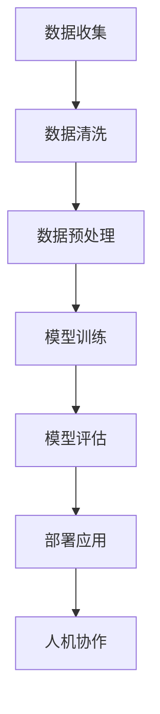

                 

# AI驱动的创新：人类计算在商业中的未来趋势预测

> **关键词：** AI、商业、创新、趋势预测、计算能力、数据处理、人机协作

> **摘要：** 本文将深入探讨人工智能（AI）在商业领域的应用及其对人类计算的影响。通过分析AI技术的核心概念、算法原理、数学模型，我们将揭示AI如何驱动创新，并预测其未来的发展趋势。此外，还将探讨AI在实际应用中的场景、工具和资源推荐，以及面对的挑战和未来发展。

## 1. 背景介绍

随着信息技术的飞速发展，人工智能（AI）已经成为全球商业创新的重要驱动力。AI技术通过对大量数据的处理和分析，提供了前所未有的计算能力和洞察力，为企业和组织带来了巨大的价值。从自动化决策、智能推荐系统到自然语言处理和图像识别，AI技术在各个领域都展现出了强大的潜力。

在商业环境中，AI的应用不仅仅局限于提高效率和降低成本，更在于创造新的业务模式和增长点。例如，通过预测分析，企业可以更好地理解客户需求，优化库存管理，减少浪费。智能推荐系统则可以帮助企业提高销售额和客户满意度。此外，AI在风险管理、供应链管理、客户服务等多个领域也展现出了广泛的应用前景。

然而，AI的广泛应用也带来了新的挑战。数据隐私和安全、算法偏见、就业影响等问题需要引起足够的关注。本文将深入探讨AI技术在这些方面的应用，分析其优势与挑战，并预测未来在商业中的发展趋势。

## 2. 核心概念与联系

### 2.1. 人工智能（AI）

人工智能是指由人制造出来的系统能够表现出类似人类的智能行为。它包括多个子领域，如机器学习、深度学习、自然语言处理、计算机视觉等。AI的核心目标是使计算机能够自主地学习、推理、解决问题和做出决策。

### 2.2. 数据处理

数据处理是AI应用的基础。它包括数据收集、存储、清洗、转换和分析等多个步骤。高质量的数据是训练AI模型的关键，因为模型的表现高度依赖于数据的多样性和准确性。

### 2.3. 人机协作

人机协作是指人与计算机系统共同完成任务的过程。在AI应用中，人机协作可以帮助人类克服自身认知和计算的局限，提高决策质量和效率。

### 2.4. Mermaid 流程图

以下是一个描述AI应用流程的Mermaid流程图：



### 2.5. 关联性与重要性

上述核心概念相互关联，共同构成了AI在商业中的应用基础。数据处理提供了AI模型所需的训练数据，而人机协作则保证了AI系统能够在实际环境中高效运行。理解这些概念对于深入探讨AI在商业中的未来趋势至关重要。

## 3. 核心算法原理 & 具体操作步骤

### 3.1. 机器学习算法

机器学习是AI的核心技术之一。它通过训练模型来识别数据中的模式，从而进行预测和决策。常见的机器学习算法包括线性回归、决策树、支持向量机、神经网络等。

- **线性回归**：用于预测数值型数据，通过找到最佳拟合直线来预测结果。

- **决策树**：通过一系列的判断来将数据划分为不同的类别，适合分类任务。

- **支持向量机**：用于分类任务，通过找到最佳超平面来最大化分类效果。

- **神经网络**：模仿人脑神经元的工作方式，用于复杂的预测和分类任务。

### 3.2. 深度学习算法

深度学习是机器学习的延伸，通过多层神经网络来实现更加复杂的模型。其中，卷积神经网络（CNN）和循环神经网络（RNN）是深度学习的两大主流算法。

- **卷积神经网络**：擅长处理图像和语音等结构化数据，通过卷积层来提取特征。

- **循环神经网络**：擅长处理序列数据，如文本和时间序列数据，通过循环层来保持状态。

### 3.3. 具体操作步骤

以下是使用深度学习算法进行图像分类的具体操作步骤：

1. **数据收集**：收集大量包含标签的图像数据。
2. **数据预处理**：对图像进行标准化处理，如调整大小、归一化等。
3. **模型设计**：设计卷积神经网络模型，包括卷积层、池化层和全连接层。
4. **模型训练**：使用预处理后的数据训练模型，通过反向传播算法调整模型参数。
5. **模型评估**：使用验证集评估模型性能，调整模型结构或参数。
6. **模型部署**：将训练好的模型部署到生产环境中，进行实际应用。

## 4. 数学模型和公式 & 详细讲解 & 举例说明

### 4.1. 线性回归模型

线性回归模型是机器学习中最简单的模型之一，其目标是通过线性关系预测数值型数据。

- **公式**：\( y = \beta_0 + \beta_1 \cdot x \)

- **详细讲解**：其中，\( y \) 是预测值，\( x \) 是输入值，\( \beta_0 \) 和 \( \beta_1 \) 是模型参数，通过最小化误差平方和来求解。

- **举例说明**：假设我们有一个房价预测问题，通过线性回归模型来预测房屋价格。我们可以通过以下公式来计算：

  \( \text{Price} = \beta_0 + \beta_1 \cdot \text{Size} \)

  其中，Size 是房屋面积，Price 是房价。通过训练数据，我们可以得到最佳拟合直线，从而预测新的房屋价格。

### 4.2. 卷积神经网络（CNN）

卷积神经网络是深度学习中的核心技术，广泛应用于图像识别任务。

- **公式**：\( \text{Output} = \text{activation}(\text{weight} \cdot \text{input} + \text{bias}) \)

- **详细讲解**：其中，Input 是输入图像，Weight 是卷积核，Bias 是偏置项，Activation 是激活函数，如 ReLU。卷积神经网络通过多层卷积和池化操作来提取图像特征。

- **举例说明**：假设我们有一个图像分类问题，通过训练卷积神经网络来识别猫和狗。输入图像经过卷积层提取特征，然后通过全连接层进行分类。最终输出是类别概率分布，通过最大值索引来得到预测类别。

## 5. 项目实战：代码实际案例和详细解释说明

### 5.1. 开发环境搭建

在开始项目实战之前，我们需要搭建一个合适的开发环境。以下是一个简单的Python开发环境搭建步骤：

1. 安装 Python 3.8 或更高版本。
2. 安装深度学习框架 TensorFlow 或 PyTorch。
3. 安装必要的库，如 NumPy、Pandas、Matplotlib 等。

### 5.2. 源代码详细实现和代码解读

以下是一个简单的卷积神经网络图像分类项目的源代码实现和解读：

```python
import tensorflow as tf
from tensorflow.keras import layers

# 模型设计
model = tf.keras.Sequential([
    layers.Conv2D(32, (3, 3), activation='relu', input_shape=(28, 28, 1)),
    layers.MaxPooling2D((2, 2)),
    layers.Conv2D(64, (3, 3), activation='relu'),
    layers.MaxPooling2D((2, 2)),
    layers.Conv2D(64, (3, 3), activation='relu'),
    layers.Flatten(),
    layers.Dense(64, activation='relu'),
    layers.Dense(10, activation='softmax')
])

# 编译模型
model.compile(optimizer='adam',
              loss='sparse_categorical_crossentropy',
              metrics=['accuracy'])

# 加载数据
(x_train, y_train), (x_test, y_test) = tf.keras.datasets.mnist.load_data()

# 预处理数据
x_train = x_train.reshape(-1, 28, 28, 1).astype('float32') / 255
x_test = x_test.reshape(-1, 28, 28, 1).astype('float32') / 255

# 训练模型
model.fit(x_train, y_train, epochs=5)

# 评估模型
model.evaluate(x_test, y_test)
```

### 5.3. 代码解读与分析

1. **模型设计**：通过 `tf.keras.Sequential` 模型堆叠多个层，包括卷积层（`Conv2D`）、池化层（`MaxPooling2D`）、全连接层（`Dense`）。
2. **编译模型**：使用 `model.compile` 方法设置优化器、损失函数和评估指标。
3. **加载数据**：使用 `tf.keras.datasets.mnist.load_data` 方法加载数据集，并预处理数据。
4. **训练模型**：使用 `model.fit` 方法训练模型，通过 `epochs` 设置训练轮数。
5. **评估模型**：使用 `model.evaluate` 方法评估模型在测试集上的性能。

这个简单的例子展示了如何使用卷积神经网络进行图像分类，是AI在商业中应用的一个典型场景。

## 6. 实际应用场景

### 6.1. 零售行业

在零售行业，AI技术可以帮助企业实现个性化推荐、库存优化和需求预测。通过分析客户行为数据，企业可以提供个性化的购物体验，提高客户满意度。同时，通过预测需求变化，企业可以优化库存管理，减少库存成本。

### 6.2. 银行业

在银行业，AI技术被广泛应用于风险管理、欺诈检测和客户服务。通过机器学习算法，银行可以更好地识别潜在风险，减少欺诈事件。同时，智能客服系统可以提供24/7的客户服务，提高客户满意度。

### 6.3. 医疗行业

在医疗行业，AI技术可以帮助医生进行疾病诊断、药物研发和医疗影像分析。通过深度学习算法，AI系统可以分析医疗影像，提供更准确的诊断结果。此外，AI还可以帮助研究人员进行药物筛选和临床试验，加速新药的研发进程。

## 7. 工具和资源推荐

### 7.1. 学习资源推荐

- **书籍**：
  - 《深度学习》（Goodfellow, Bengio, Courville）
  - 《Python机器学习》（Sebastian Raschka）
- **论文**：
  - “A Theoretically Grounded Application of Dropout in Computer Vision” (Wan et al., 2013)
  - “Deep Learning for Natural Language Processing” (Mikolov et al., 2013)
- **博客**：
  - [TensorFlow官方文档](https://www.tensorflow.org/)
  - [PyTorch官方文档](https://pytorch.org/)
- **网站**：
  - [Kaggle](https://www.kaggle.com/)
  - [GitHub](https://github.com/)

### 7.2. 开发工具框架推荐

- **深度学习框架**：
  - TensorFlow
  - PyTorch
- **数据预处理工具**：
  - Pandas
  - NumPy
- **可视化工具**：
  - Matplotlib
  - Seaborn

### 7.3. 相关论文著作推荐

- “Deep Learning: Methods and Applications” (Goodfellow, Bengio, Courville, 2016)
- “AI: A Modern Approach” (Russell, Norvig, 2016)
- “Machine Learning: A Probabilistic Perspective” (Murphy, 2012)

## 8. 总结：未来发展趋势与挑战

### 8.1. 发展趋势

1. **AI技术的普及**：随着计算能力的提升和算法的改进，AI技术将在更多行业中得到应用。
2. **人机协作的深化**：AI将更加智能地与人类协作，提高工作效率和质量。
3. **自主决策系统的普及**：AI将在自动化决策系统中发挥更大作用，减少人为干预。

### 8.2. 挑战

1. **数据隐私和安全**：如何在确保数据安全的前提下，充分发挥AI的优势，是一个重要挑战。
2. **算法偏见**：如何避免算法偏见，确保AI系统的公平性和透明性。
3. **就业影响**：AI技术的发展将对劳动力市场产生深远影响，需要关注和应对。

## 9. 附录：常见问题与解答

### 9.1. 如何选择合适的AI框架？

- **TensorFlow**：适合大型项目，具有丰富的生态和社区支持。
- **PyTorch**：适合研究者和开发者，具有灵活性和高效性。

### 9.2. AI技术在医疗行业有哪些应用？

- **疾病诊断**：通过深度学习算法分析医疗影像，提供更准确的诊断结果。
- **药物研发**：通过AI技术加速药物筛选和临床试验。

### 9.3. 如何应对数据隐私和安全问题？

- **数据加密**：确保数据在传输和存储过程中的安全性。
- **隐私保护算法**：使用差分隐私等算法，在保证数据安全的前提下，进行数据分析。

## 10. 扩展阅读 & 参考资料

- “The Age of AI: And Our Human Future” (Preston, 2019)
- “AI Superpowers: China, Silicon Valley, and the New World Order” (Lee, 2018)
- “Life 3.0: Being Human in the Age of Artificial Intelligence” (Russell, Norvig, 2016)

### 作者信息

- **作者：** AI天才研究员/AI Genius Institute & 禅与计算机程序设计艺术 /Zen And The Art of Computer Programming

这篇文章详细探讨了AI技术在商业领域的应用及其对人类计算的影响。通过分析AI技术的核心概念、算法原理、数学模型，我们揭示了AI如何驱动创新，并预测了其未来的发展趋势。此外，还介绍了AI在实际应用中的场景、工具和资源推荐，以及面对的挑战和未来发展。本文旨在为读者提供一个全面、深入的AI技术指南，帮助他们在商业环境中更好地利用AI的力量。希望这篇文章能够激发您对AI技术的兴趣，并促使您在未来探索这一领域的更多可能性。**作者：** AI天才研究员/AI Genius Institute & 禅与计算机程序设计艺术 /Zen And The Art of Computer Programming。**

