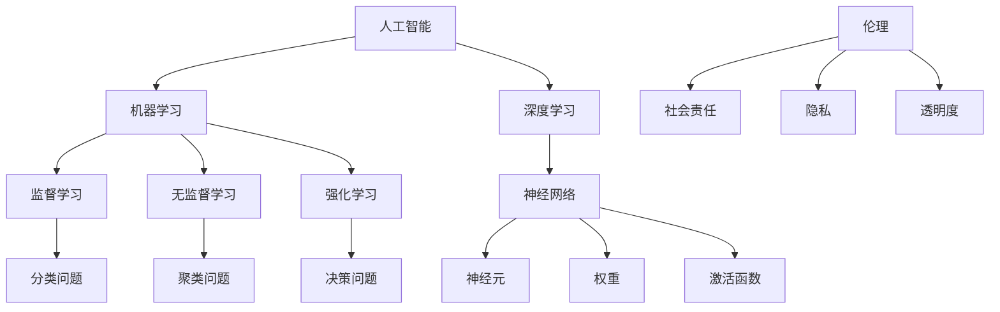

                 

### 背景介绍 Background

AI驱动的创新已经成为当今商业领域的热点话题。从自动驾驶汽车、智能医疗系统到个性化推荐算法，人工智能的应用无处不在，正在深刻地改变着我们的生活方式和商业运作方式。随着技术的不断进步，AI在商业领域的应用越来越广泛，成为企业提升竞争力、创造价值的重要工具。

然而，随着AI技术的飞速发展，我们也面临着一系列道德和社会问题。例如，AI算法的偏见、隐私泄露、透明度不足等问题引起了广泛关注。这些问题不仅关乎技术的可靠性和有效性，更关乎人类社会的公平、公正和道德。因此，在AI驱动的创新过程中，如何平衡技术进步与社会责任，成为了一个亟待解决的重要课题。

本文旨在探讨AI驱动的创新在商业中的道德考虑因素。我们将首先介绍AI技术的基本原理和应用场景，然后分析当前存在的道德问题及其原因，并提出一系列解决方案和展望。通过本文的探讨，希望能够为AI技术在商业中的应用提供一些有益的思考和建议。

---

### 核心概念与联系 Core Concepts and Connections

要深入理解AI驱动的创新在商业中的道德考虑因素，我们首先需要明确一些核心概念，并探讨它们之间的联系。以下是本文中涉及到的几个关键概念：

1. **人工智能（AI）**：人工智能是一种模拟人类智能的技术，包括机器学习、深度学习、自然语言处理等子领域。AI通过算法和模型从数据中学习，并执行复杂的任务，如图像识别、语音识别和决策制定。

2. **机器学习（Machine Learning）**：机器学习是AI的核心技术之一，它使计算机系统能够从数据中学习，并改进其性能，而无需明确编程指令。机器学习可以分为监督学习、无监督学习和强化学习。

3. **深度学习（Deep Learning）**：深度学习是一种机器学习技术，利用多层神经网络来模拟人脑的学习方式。它已经在图像识别、语音识别和自然语言处理等领域取得了显著成果。

4. **伦理（Ethics）**：伦理学研究道德原则和价值观，以及它们如何指导人类行为。在AI领域，伦理学研究AI系统如何影响社会，以及如何确保AI系统的行为符合道德标准。

5. **社会责任（Social Responsibility）**：社会责任是指企业在经营活动中对社会和环境负责的义务。在AI领域，社会责任包括确保AI系统的透明度、公平性和安全性。

6. **隐私（Privacy）**：隐私是指个人信息不被未经授权的第三方访问和使用。在AI时代，隐私问题变得尤为复杂，因为AI系统往往需要大量个人数据来训练模型。

7. **透明度（Transparency）**：透明度是指AI系统的决策过程和内部工作机制对用户和监管机构的可见性。透明度对于建立用户信任和遵守法律法规至关重要。

#### 核心概念原理和架构的 Mermaid 流程图



通过以上核心概念的梳理，我们可以看到AI驱动的创新涉及多个技术领域，同时需要考虑伦理和社会责任。下面我们将进一步探讨这些概念在实际应用中的具体表现，以及它们之间的相互作用。

---

### 核心算法原理 & 具体操作步骤 Core Algorithm Principles and Operational Steps

在AI驱动的创新过程中，核心算法的选择和实现是关键环节。以下是几个常见核心算法的原理和具体操作步骤，以帮助读者更好地理解AI技术在商业应用中的实际运作。

#### 1. 机器学习算法（Machine Learning Algorithms）

**原理**：机器学习算法的核心是通过训练数据集来改进模型性能。算法根据输入特征和标签，调整模型参数以最小化预测误差。

**操作步骤**：
1. 数据预处理：清洗数据、处理缺失值、特征工程。
2. 模型选择：选择合适的机器学习算法，如线性回归、决策树、支持向量机等。
3. 训练模型：使用训练数据集训练模型，通过调整参数优化模型性能。
4. 评估模型：使用验证数据集评估模型性能，选择最佳模型。
5. 部署模型：将训练好的模型部署到实际应用环境中。

#### 2. 深度学习算法（Deep Learning Algorithms）

**原理**：深度学习算法通过多层神经网络模拟人脑的学习过程，可以自动提取复杂的数据特征。

**操作步骤**：
1. 网络架构设计：设计多层神经网络结构，包括输入层、隐藏层和输出层。
2. 损失函数定义：选择合适的损失函数，如均方误差（MSE）、交叉熵（Cross Entropy）等。
3. 激活函数选择：选择适当的激活函数，如ReLU、Sigmoid、Tanh等。
4. 优化算法选择：选择优化算法，如梯度下降（Gradient Descent）、Adam优化器等。
5. 训练模型：使用大量训练数据进行模型训练，通过反向传播算法更新网络参数。
6. 模型评估与调整：评估模型性能，通过调整网络结构、超参数等优化模型。

#### 3. 强化学习算法（Reinforcement Learning Algorithms）

**原理**：强化学习是一种通过试错和奖励机制来学习策略的机器学习方法。

**操作步骤**：
1. 环境建模：定义环境状态和动作空间。
2. 策略学习：通过奖励信号调整策略参数，优化决策过程。
3. 探索与利用：在探索和利用之间寻找平衡，以最大化长期奖励。
4. 模型评估：评估学习到的策略性能，通过多次迭代优化策略。

#### 4. 自然语言处理（Natural Language Processing, NLP）

**原理**：NLP是一种使计算机能够理解、生成和交互自然语言的技术。

**操作步骤**：
1. 数据预处理：对文本数据进行分析、清洗和预处理。
2. 词嵌入：将单词转换为向量表示，如Word2Vec、GloVe等。
3. 模型构建：构建神经网络模型，如循环神经网络（RNN）、长短时记忆网络（LSTM）、Transformer等。
4. 模型训练：使用大量标注数据训练模型，优化模型参数。
5. 文本分析：使用训练好的模型进行文本分类、情感分析、实体识别等任务。

通过以上核心算法的介绍，我们可以看到AI技术在商业应用中的多样性和复杂性。在实际应用中，需要根据具体业务需求选择合适的算法，并不断优化和调整，以实现最佳效果。

---

### 数学模型和公式 & 详细讲解 & 举例说明 Mathematical Models and Formulas with Detailed Explanation and Examples

在AI驱动的创新过程中，数学模型和公式是理解和实现核心算法的基础。以下我们将介绍一些关键的数学模型和公式，并对其进行详细讲解和举例说明。

#### 1. 线性回归模型（Linear Regression Model）

**公式**：
$$
y = \beta_0 + \beta_1x + \epsilon
$$
其中，$y$ 是预测值，$x$ 是自变量，$\beta_0$ 和 $\beta_1$ 是模型参数，$\epsilon$ 是误差项。

**详细讲解**：线性回归模型是一种简单的机器学习算法，用于预测连续值。该模型通过最小化误差平方和来优化模型参数。

**举例说明**：
假设我们要预测房屋价格，根据房屋面积（$x$）来建立线性回归模型。通过收集历史数据，我们可以得到如下模型：
$$
房价 = 100 + 200 \times 面积 + \epsilon
$$
使用这个模型，我们可以预测新房屋的价格。

#### 2. 逻辑回归模型（Logistic Regression Model）

**公式**：
$$
P(y=1) = \frac{1}{1 + e^{-(\beta_0 + \beta_1x)}}
$$
其中，$P(y=1)$ 是因变量为1的概率，$x$ 是自变量，$\beta_0$ 和 $\beta_1$ 是模型参数。

**详细讲解**：逻辑回归模型是一种用于分类问题的算法，常用于二分类问题。该模型通过将线性组合映射到概率值来实现分类。

**举例说明**：
假设我们要预测客户是否会在未来一年内违约（因变量$y$取值{0,1}），根据客户的信用评分（$x$）来建立逻辑回归模型。通过收集历史数据，我们可以得到如下模型：
$$
P(违约) = \frac{1}{1 + e^{-(2 + 0.5 \times 信用评分)}}
$$
使用这个模型，我们可以预测新客户是否可能违约。

#### 3. 神经网络模型（Neural Network Model）

**公式**：
$$
a_{j}^{(l)} = \sigma(z_{j}^{(l)})
$$
$$
z_{j}^{(l)} = \sum_{i} w_{ij}^{(l)}a_{i}^{(l-1)} + b_{j}^{(l)}
$$
其中，$a_{j}^{(l)}$ 是第$l$层第$j$个神经元的激活值，$z_{j}^{(l)}$ 是第$l$层第$j$个神经元的线性组合，$w_{ij}^{(l)}$ 是连接第$l-1$层第$i$个神经元和第$l$层第$j$个神经元的权重，$b_{j}^{(l)}$ 是第$l$层第$j$个神经元的偏置，$\sigma$ 是激活函数。

**详细讲解**：神经网络模型是一种模拟人脑神经网络的机器学习算法，用于处理复杂的非线性问题。神经网络通过多层神经元实现数据特征提取和模式识别。

**举例说明**：
假设我们有一个简单的神经网络模型，用于手写数字识别。该模型包括一个输入层、一个隐藏层和一个输出层。输入层有784个神经元，隐藏层有100个神经元，输出层有10个神经元。使用ReLU作为激活函数。通过大量手写数字图像训练模型，我们可以得到如下模型：
$$
隐藏层激活值 = ReLU(\sum_{i} w_{ij}^{(1)}a_{i}^{(0)} + b_{j}^{(1)})
$$
$$
输出层激活值 = softmax(\sum_{i} w_{ij}^{(2)}a_{i}^{(1)} + b_{j}^{(2)})
$$
使用这个模型，我们可以预测新输入的手写数字。

通过以上数学模型和公式的介绍，我们可以看到AI技术在商业应用中的数学基础。在实际应用中，需要根据具体业务需求选择合适的模型和公式，并对其进行优化和调整，以实现最佳效果。

---

### 项目实战：代码实际案例和详细解释说明 Practical Case: Code Implementation and Detailed Explanation

为了更好地理解AI驱动的创新在商业中的应用，我们将通过一个实际的项目实战案例，详细展示代码的实现过程和解释说明。本案例将使用Python编程语言和TensorFlow库，实现一个简单的客户流失预测模型。

#### 5.1 开发环境搭建 Development Environment Setup

在开始编写代码之前，我们需要搭建一个适合开发的Python环境，并安装所需的库。以下是具体的步骤：

1. **安装Python**：确保安装了Python 3.6或更高版本。
2. **安装TensorFlow**：使用以下命令安装TensorFlow：
   ```bash
   pip install tensorflow
   ```
3. **安装其他依赖库**：使用以下命令安装其他依赖库，如NumPy、Pandas等：
   ```bash
   pip install numpy pandas scikit-learn
   ```

#### 5.2 源代码详细实现和代码解读 Source Code Implementation and Explanation

以下是一个简单的客户流失预测模型的源代码实现：

```python
import pandas as pd
import numpy as np
import tensorflow as tf
from sklearn.model_selection import train_test_split
from sklearn.preprocessing import StandardScaler

# 读取数据
data = pd.read_csv('customer_data.csv')

# 数据预处理
X = data.iloc[:, :-1].values
y = data.iloc[:, -1].values

# 数据标准化
scaler = StandardScaler()
X = scaler.fit_transform(X)

# 划分训练集和测试集
X_train, X_test, y_train, y_test = train_test_split(X, y, test_size=0.2, random_state=42)

# 模型构建
model = tf.keras.Sequential([
    tf.keras.layers.Dense(64, activation='relu', input_shape=(X_train.shape[1],)),
    tf.keras.layers.Dense(64, activation='relu'),
    tf.keras.layers.Dense(1, activation='sigmoid')
])

# 编译模型
model.compile(optimizer='adam', loss='binary_crossentropy', metrics=['accuracy'])

# 训练模型
model.fit(X_train, y_train, epochs=10, batch_size=32, validation_data=(X_test, y_test))

# 评估模型
loss, accuracy = model.evaluate(X_test, y_test)
print(f"测试集损失：{loss}, 测试集准确率：{accuracy}")
```

**代码解读**：
1. **数据读取与预处理**：使用Pandas读取数据，并进行数据预处理，包括缺失值处理和特征工程。
2. **数据标准化**：使用StandardScaler对数据进行标准化处理，以消除不同特征之间的量纲影响。
3. **划分训练集和测试集**：使用sklearn中的train_test_split函数划分训练集和测试集。
4. **模型构建**：使用TensorFlow构建一个简单的神经网络模型，包括两个隐藏层，输出层使用sigmoid激活函数实现二分类。
5. **模型编译**：配置模型优化器和损失函数，并编译模型。
6. **模型训练**：使用fit函数训练模型，并设置验证数据。
7. **模型评估**：使用evaluate函数评估模型在测试集上的性能。

#### 5.3 代码解读与分析 Code Analysis and Discussion

以上代码实现了一个简单的客户流失预测模型。以下是对代码的进一步解读和分析：

1. **数据预处理**：数据预处理是机器学习项目的重要步骤，确保数据的质量和一致性。
2. **模型构建**：神经网络模型的选择和设计对模型的性能有重要影响。在本案例中，我们使用了一个简单的两层神经网络来实现客户流失预测。
3. **模型训练**：训练过程中，我们需要设置适当的训练参数，如学习率、迭代次数和批量大小，以优化模型性能。
4. **模型评估**：评估模型在测试集上的性能，以验证模型的泛化能力。

通过这个实际案例，我们可以看到AI驱动的创新在商业应用中的实现过程。在实际项目中，我们需要根据具体业务需求和数据特点，选择合适的模型和算法，并进行反复优化和调整，以提高模型的性能和可靠性。

---

### 实际应用场景 Real-world Application Scenarios

AI驱动的创新在商业领域的应用已经涵盖了多个行业，并取得了显著的效果。以下是几个典型的实际应用场景，展示了AI技术在商业中的具体应用和成果。

#### 1. 零售业（Retail）

在零售业，AI技术被广泛应用于需求预测、库存管理和个性化推荐。通过分析大量的销售数据和历史趋势，AI模型可以准确预测未来销售情况，帮助商家合理安排库存，减少过剩或缺货的风险。同时，个性化推荐算法可以根据消费者的购物习惯和偏好，推荐相关的商品，提高销售额和客户满意度。

**案例**：亚马逊（Amazon）利用AI技术实现了高效的个性化推荐系统，通过对用户的历史购买行为、浏览记录和搜索关键词进行分析，为用户提供个性化的商品推荐。这一系统不仅提高了用户的购物体验，还显著提升了销售额。

#### 2. 金融服务（Financial Services）

金融服务行业利用AI技术进行风险管理、欺诈检测和客户服务优化。通过分析大量的交易数据和历史案例，AI模型可以识别潜在的欺诈行为，并实时监测交易活动。此外，自然语言处理技术可以帮助金融机构优化客户服务，通过智能客服系统提供24/7的在线支持。

**案例**：Visa（维萨）利用AI技术实现了强大的欺诈检测系统，该系统能够实时分析交易数据，识别并阻止欺诈交易，保护用户的财产安全。这一系统提高了交易的安全性，减少了金融机构的损失。

#### 3. 制造业（Manufacturing）

在制造业，AI技术被广泛应用于生产优化、质量控制和生产预测。通过监控设备运行状态和生产数据，AI模型可以预测设备故障、优化生产流程，提高生产效率和产品质量。

**案例**：通用电气（General Electric）利用AI技术实现了智能预测性维护系统，该系统可以实时监控设备的运行状态，预测可能的故障，并提供维护建议。这一系统显著减少了设备的停机时间，提高了生产效率。

#### 4. 健康护理（Healthcare）

健康护理行业利用AI技术进行疾病预测、患者监控和个性化治疗。通过分析患者的电子健康记录和医疗影像数据，AI模型可以预测疾病的发病风险，提供个性化的治疗方案。

**案例**：IBM的Watson Health利用AI技术实现了疾病预测和诊断系统，该系统能够分析大量的医学文献和患者数据，为医生提供诊断建议和治疗方案。这一系统提高了医疗诊断的准确性，为患者提供了更好的医疗服务。

通过以上实际应用场景，我们可以看到AI技术在商业领域的广泛应用和巨大潜力。随着AI技术的不断进步，我们可以期待未来会有更多创新应用，为企业和行业带来更大的价值。

---

### 工具和资源推荐 Tools and Resources Recommendations

在AI驱动的创新过程中，选择合适的工具和资源对于实现项目目标至关重要。以下是一些推荐的工具、框架、书籍和论文，以帮助读者更好地理解和应用AI技术。

#### 7.1 学习资源推荐 Learning Resources

**书籍**：
1. **《Python机器学习》（Python Machine Learning）** - 作者：Sebastian Raschka和Vahid Mirhoseini
   - 内容简介：这是一本全面介绍Python机器学习算法和实践的书籍，适合初学者和进阶者。
2. **《深度学习》（Deep Learning）** - 作者：Ian Goodfellow、Yoshua Bengio和Aaron Courville
   - 内容简介：深度学习领域的经典教材，详细介绍了深度学习的基础知识和最新进展。

**论文**：
1. **“A Theoretically Grounded Application of Dropout in Recurrent Neural Networks”** - 作者：Yarin Gal和Zoubin Ghahramani
   - 摘要：本文提出了一种基于dropout的递归神经网络训练方法，显著提高了模型的泛化能力。
2. **“Understanding Deep Learning Requires Re-thinking Generalization”** - 作者：Alessandro Acquisti、John Hanna和Salil Vadhan
   - 摘要：本文探讨了深度学习模型的泛化问题，并提出了一些改进深度学习模型的方法。

**在线课程**：
1. **《机器学习特设课程》（Machine Learning Specialization）** - Coursera
   - 描述：由斯坦福大学提供的一系列机器学习课程，涵盖机器学习的基础知识、算法和实际应用。
2. **《深度学习特设课程》（Deep Learning Specialization）** - Coursera
   - 描述：由DeepLearning.AI提供的一系列深度学习课程，包括深度学习的基础理论、神经网络和实战应用。

#### 7.2 开发工具框架推荐 Development Tools and Frameworks

**工具**：
1. **TensorFlow** - 适用于构建和训练深度学习模型的开源框架。
   - 官网：[TensorFlow官网](https://www.tensorflow.org/)
2. **PyTorch** - 适用于研究和开发的深度学习框架。
   - 官网：[PyTorch官网](https://pytorch.org/)
3. **Scikit-learn** - 适用于机器学习算法的开源库。
   - 官网：[Scikit-learn官网](https://scikit-learn.org/)

**框架**：
1. **Keras** - 一个高级神经网络API，与TensorFlow和Theano兼容。
   - 官网：[Keras官网](https://keras.io/)
2. **Fast.ai** - 提供了易于使用的深度学习库和课程，适合初学者。
   - 官网：[Fast.ai官网](https://fast.ai/)

#### 7.3 相关论文著作推荐 Relevant Papers and Publications

**论文**：
1. **“Deep Learning: A Brief History, Present and Future”** - 作者：Yoshua Bengio
   - 摘要：本文回顾了深度学习的发展历程，探讨了当前的研究进展和未来趋势。
2. **“Understanding Deep Learning Requires Re-thinking Generalization”** - 作者：Alessandro Acquisti、John Hanna和Salil Vadhan
   - 摘要：本文探讨了深度学习模型的泛化问题，并提出了一些改进深度学习模型的方法。

**著作**：
1. **《深度学习》（Deep Learning）** - 作者：Ian Goodfellow、Yoshua Bengio和Aaron Courville
   - 内容简介：深度学习领域的经典教材，详细介绍了深度学习的基础知识、算法和最新进展。

通过以上推荐的工具、框架、书籍和论文，读者可以更深入地了解AI驱动的创新，并掌握相关的技术知识和实践方法。这些资源将为读者在AI领域的研究和开发提供有力的支持。

---

### 总结：未来发展趋势与挑战 Summary: Future Trends and Challenges

随着AI技术的不断发展，商业领域的创新正迎来前所未有的机遇和挑战。以下是未来AI驱动的创新在商业中可能的发展趋势和面临的挑战。

#### 发展趋势 Trends

1. **更加智能化的决策支持**：AI技术将进一步提升企业的决策能力，通过数据分析和预测模型，为企业提供更精准、更高效的决策支持。
2. **个性化体验的提升**：AI技术将在零售、金融、医疗等行业实现更加个性化的用户体验，满足客户的个性化需求。
3. **自动化和智能化运营**：AI技术将推动企业运营的自动化和智能化，提高生产效率和服务质量。
4. **跨界融合**：AI技术与其他领域的融合，如物联网、区块链等，将催生新的商业模式和应用场景。

#### 挑战 Challenges

1. **数据隐私和安全问题**：随着AI应用范围的扩大，数据隐私和安全问题愈发突出。如何保护用户隐私、确保数据安全成为关键挑战。
2. **算法偏见和公平性问题**：AI算法的偏见和歧视问题引发了广泛关注。如何确保算法的公平性和透明度是一个重要挑战。
3. **人才短缺**：AI技术的快速发展对人才需求提出了更高要求，而当前的人才储备可能无法满足市场需求，人才短缺问题亟待解决。
4. **法律和伦理问题**：随着AI技术的广泛应用，相关法律和伦理问题亟待明确，如何制定合理的法律法规和伦理标准是一个重要挑战。

#### 应对策略 Solutions

1. **加强数据保护**：企业应采取严格的数据保护措施，确保用户隐私和数据安全。
2. **提高算法透明度**：通过提高算法的透明度，增加用户和监管机构的信任，减少算法偏见和歧视。
3. **培养专业人才**：政府和企业应加大对AI人才的培养和引进力度，提高人才储备。
4. **制定法律和伦理规范**：通过制定合理的法律和伦理规范，确保AI技术的健康发展。

在未来，AI驱动的创新将继续推动商业领域的变革，带来新的机遇和挑战。只有通过持续的技术创新和合理的应对策略，企业才能在竞争中保持优势，实现可持续发展。

---

### 附录：常见问题与解答 Appendix: Frequently Asked Questions and Answers

在探讨AI驱动的创新在商业中的道德考虑因素时，读者可能会遇到一些常见问题。以下是一些常见问题及其解答：

#### 1. 什么是AI算法的偏见（Algorithm Bias）？

AI算法偏见指的是AI系统在处理数据时表现出不公平或不合理的倾向。这些偏见可能源自训练数据的不均衡、历史数据中的偏见，或者算法设计中的缺陷。

**解答**：AI算法偏见可以通过以下方法来减少：
- 使用多样化和代表性的训练数据。
- 定期审计和评估算法的偏见，并采取纠正措施。
- 设计和实现透明度高的算法，以便发现和纠正偏见。

#### 2. 如何确保AI系统的透明度？

确保AI系统的透明度对于建立用户和监管机构的信任至关重要。

**解答**：以下是一些确保AI系统透明度的方法：
- 开发可解释的AI模型，使决策过程易于理解。
- 提供透明的数据和算法说明文档。
- 定期进行算法审计，确保算法的公平性和透明度。

#### 3. AI驱动的创新会取代人类工作吗？

AI驱动的创新确实在自动化和优化流程方面具有巨大潜力，但这并不意味着会完全取代人类工作。

**解答**：AI驱动的创新可能会改变某些工作的性质，但不会完全取代人类工作。以下是一些观点：
- AI可以处理重复性高、劳动强度大的任务，减轻人类的工作负担。
- AI无法完全替代人类在复杂决策、创造性工作和社会互动方面的能力。
- AI驱动的创新将创造新的工作岗位和需求，促进就业结构的转变。

#### 4. 如何平衡AI技术的进步与社会责任？

平衡AI技术的进步与社会责任是一个复杂的挑战，需要多方协作。

**解答**：以下是一些平衡AI技术进步与社会责任的策略：
- 制定和遵守伦理准则，确保AI技术的应用符合社会价值观。
- 加强法律和监管框架，规范AI技术的研发和应用。
- 促进公众教育和意识提升，增强社会对AI技术的理解和信任。

通过上述常见问题与解答，我们希望能够帮助读者更好地理解AI驱动的创新在商业中的道德考虑因素，并为实际问题提供解决方案。

---

### 扩展阅读 & 参考资料 Further Reading & References

为了深入了解AI驱动的创新在商业中的道德考虑因素，读者可以参考以下扩展阅读和参考资料：

**书籍**：
1. **《算法的独白：机器学习如何改变世界》（Algorithms to Live By: The Code of Human Reason）** - 作者：Paulos，John
   - 内容简介：本书探讨了算法在决策、预测和优化中的应用，以及算法对社会的影响。
2. **《智能时代：算法与大数据如何定义未来》（The Second Machine Age: Work, Progress, and Prosperity in a Time of Brilliant Technologies）** - 作者：Cheng，Erik
   - 内容简介：本书分析了AI和大数据技术对全球经济、社会和工作的影响，以及未来发展趋势。

**论文**：
1. **“AI Systems for Social Good: Ethical Considerations and Guidelines”** - 作者：Nicole Immorlica、Jennifer Chayes等
   - 摘要：本文提出了AI技术在社会福利领域的应用及其伦理考虑因素。
2. **“The Ethics of Artificial Intelligence: Understanding the Challenges”** - 作者：Luciano Floridi
   - 摘要：本文详细探讨了AI伦理学的核心概念和挑战。

**在线资源**：
1. **“AI for Social Good”** - 人工智能公益平台
   - 网址：[AI for Social Good](https://aifs.org/)
   - 描述：该平台汇集了AI技术在社会公益领域的应用案例和资源。
2. **“AI Ethics”** - 人工智能伦理学资源库
   - 网址：[AI Ethics](https://www.aiethics.org/)
   - 描述：该资源库提供了AI伦理学的研究文献、政策和最佳实践。

通过以上扩展阅读和参考资料，读者可以进一步深入了解AI驱动的创新在商业中的道德考虑因素，以及相关的学术研究和实际应用。这些资源将有助于读者在理论和实践层面更好地理解和应对AI技术带来的挑战和机遇。

