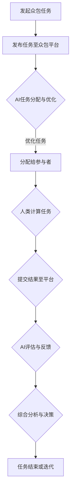
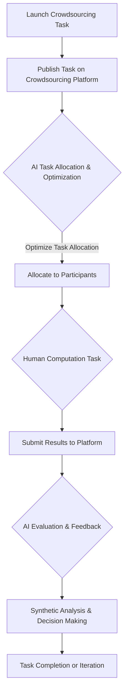

                 

### 背景介绍

#### 众包与人类计算的概念

众包（Crowdsourcing）是指通过利用广泛的社会化力量来完成某个任务或项目的一种协作模式。众包的应用非常广泛，涵盖了从产品设计、市场调研到数据分析和创意征集等多个领域。众包的核心理念是将任务分解成小部分，通过开放的方式向公众征集解决方案，最终综合这些解决方案以获得最佳结果。

人类计算（Human Computation）是指利用人类智慧和劳动力来完成计算机难以执行的任务。与传统的自动化方法不同，人类计算依靠人类独特的认知能力、判断力和创造力来处理复杂的问题。这些任务通常包括图像识别、自然语言处理和复杂决策等。

在AI驱动的时代，众包与人类计算的结合成为了一个热门话题。AI技术，特别是深度学习和强化学习，极大地提升了计算机处理数据和执行任务的能力。这使得AI不仅可以协助人类完成繁琐的工作，还能在众包任务中扮演关键角色，优化流程和提升效率。

#### AI驱动的创新

AI驱动的创新（AI-driven innovation）指的是利用人工智能技术推动新产品的开发、新服务的提供或新商业模式的创建。AI的应用不仅仅局限于提升现有技术的效率，更重要的是通过AI的强大计算能力、模式识别能力和自动化能力，创造出全新的解决方案和商业模式。

AI驱动的创新在科技、医疗、金融、交通等领域都取得了显著的成果。例如，在医疗领域，AI可以帮助医生进行疾病诊断，提高诊断的准确性和效率；在金融领域，AI可以用于风险管理和投资策略的制定，提高金融决策的精准度。

#### 结合AI驱动的众包与人类计算

结合AI驱动的众包与人类计算，可以形成一个强大的创新生态系统。在这个生态系统中，AI技术不仅可以处理海量数据，快速识别模式和趋势，还可以协助人类更好地理解数据、做出决策和提供创意。

例如，在产品设计领域，通过众包征集用户反馈和创意，AI可以对这些反馈进行分类、分析，提取出有价值的信息，帮助设计师更好地理解用户需求，从而设计出更符合用户期望的产品。在科学研究领域，众包项目如Foldit和EteRNA等，通过人类计算和AI的结合，成功地解决了蛋白质折叠的问题，推动了科学研究的进展。

总之，AI驱动的众包与人类计算的结合，不仅推动了技术的进步，也为人类解决复杂问题提供了新的途径。在接下来的章节中，我们将深入探讨这一主题，分析其核心概念、算法原理以及实际应用案例。

----------------------

## Background Introduction

### Concepts of Crowdsourcing and Human Computation

**Crowdsourcing** refers to the collaborative effort of a large number of people to complete a task or project, leveraging their collective capabilities. The application of crowdsourcing spans a broad spectrum of fields, including product design, market research, data analysis, and creative task crowdsourcing. At its core, crowdsourcing breaks down a complex task into smaller, manageable components and solicits solutions from the general public, often combining the best ideas to achieve the optimal outcome.

**Human Computation** involves the use of human intelligence and labor to perform tasks that computers find difficult or inefficient to complete. Unlike traditional automation methods, human computation relies on the unique cognitive abilities, judgment, and creativity of individuals to handle complex problems. Such tasks typically include image recognition, natural language processing, and complex decision-making processes.

In the era of AI-driven innovation, the integration of crowdsourcing and human computation has become a hot topic. AI technologies, especially deep learning and reinforcement learning, have significantly enhanced the ability of computers to process data and execute tasks. This not only allows AI to assist humans in completing tedious work but also plays a crucial role in optimizing crowdsourcing processes and improving efficiency.

### AI-Driven Innovation

**AI-driven innovation** refers to the use of artificial intelligence technologies to propel the development of new products, services, or business models. The application of AI extends beyond merely enhancing the efficiency of existing technologies; it focuses on creating entirely new solutions and business models through the powerful computational abilities, pattern recognition skills, and automation capabilities of AI.

AI-driven innovation has yielded remarkable results in various fields, such as technology, healthcare, finance, and transportation. For example, in the healthcare sector, AI can assist doctors in diagnosing diseases, improving the accuracy and efficiency of diagnosis. In finance, AI is used for risk management and investment strategy formulation, enhancing the precision of financial decisions.

### The Integration of AI-Driven Crowdsourcing and Human Computation

The integration of AI-driven crowdsourcing with human computation forms a powerful innovation ecosystem. Within this ecosystem, AI technologies can not only process vast amounts of data and quickly identify patterns and trends but also assist humans in understanding data, making decisions, and providing creative insights.

For instance, in the field of product design, crowdsourcing user feedback and ideas can be analyzed and classified by AI to extract valuable information, helping designers better understand user needs and design products that align more closely with user expectations. In scientific research, crowdsourcing projects like Foldit and EteRNA have successfully combined human computation with AI to solve protein folding problems, advancing scientific research.

In conclusion, the integration of AI-driven crowdsourcing and human computation not only drives technological progress but also provides new avenues for solving complex problems. In the following sections, we will delve deeper into this topic, exploring its core concepts, algorithm principles, and practical application cases.

----------------------

## 2. 核心概念与联系

### 众包（Crowdsourcing）的基本原理

众包的基本原理是通过开放平台，吸引广泛的公众参与某个任务或项目。这种方式具有几个显著特点：

- **去中心化**：众包任务通常不需要参与者具备特定的专业背景，任何人都可以参与，这使得任务执行过程高度去中心化。
- **效率提升**：通过利用大量志愿者的力量，众包可以快速完成一些需要大量人力和时间的工作。
- **创新性**：众包通常能够吸引到多样化的观点和创意，有助于激发创新。

### 人类计算（Human Computation）的概念

人类计算是一种利用人类智力和劳动来完成计算机难以执行的任务的方法。其核心在于：

- **人机协作**：人类计算通常结合了人类专家的知识和技能，与计算机处理能力相结合，形成人机协同的解决方案。
- **灵活性与创造力**：人类能够处理模糊、不完整的信息，并基于经验和直觉做出决策，这是计算机难以达到的。

### AI驱动的众包与人类计算的结合

AI驱动的众包与人类计算的结合，为解决复杂问题提供了新的思路。具体来说，这种结合体现在以下几个方面：

- **AI作为工具**：AI技术可以辅助人类完成任务，例如通过自然语言处理和图像识别等技术，提供数据分析、信息提取等服务。
- **AI优化众包流程**：AI可以优化众包任务的分配、管理和评估过程，提高任务完成的效率和质量。
- **AI与人类计算互补**：AI在处理大数据和模式识别方面具有优势，而人类计算在处理复杂决策和创新性任务方面具有优势，两者结合可以发挥各自的优势，共同推动问题的解决。

### Mermaid流程图

为了更清晰地展示AI驱动的众包与人类计算的结合，下面是一个简单的Mermaid流程图：



在上述流程中：

- A：发起众包任务。
- B：将任务发布到众包平台。
- C：AI对任务进行分配与优化。
- D：任务分配给参与者。
- E：参与者完成人类计算任务。
- F：提交结果到平台。
- G：AI对结果进行评估与反馈。
- H：综合分析与决策。
- I：任务结束或进入下一个迭代。

### 综述

通过上述核心概念与联系的分析，我们可以看到，AI驱动的众包与人类计算的结合，不仅提升了任务完成的效率和准确性，还促进了创新和协作。在接下来的章节中，我们将深入探讨AI驱动的众包与人类计算的具体算法原理和实际应用。

----------------------

### Core Concepts and Connections

#### The Basic Principles of Crowdsourcing

**Crowdsourcing** operates on the fundamental principle of attracting a broad range of participants from an open platform to collaborate on a specific task or project. This approach has several distinctive features:

- **Decentralization**: Crowdsourcing tasks typically do not require participants to have specific professional backgrounds, allowing anyone to contribute, thus creating a highly decentralized execution process.
- **Efficiency Enhancement**: By leveraging the collective efforts of numerous volunteers, crowdsourcing can quickly complete tasks that would require substantial human resources and time.
- **Innovation**: Crowdsourcing often attracts diverse perspectives and creative ideas, which can stimulate innovation.

#### The Concept of Human Computation

**Human Computation** involves utilizing human intelligence and labor to perform tasks that computers find difficult or inefficient to execute. The core aspects include:

- **Human-Machine Collaboration**: Human computation typically combines the knowledge and skills of human experts with the computational power of machines to create collaborative solutions.
- **Flexibility and Creativity**: Humans are capable of processing ambiguous and incomplete information and making decisions based on experience and intuition, something that computers cannot easily replicate.

#### The Integration of AI-Driven Crowdsourcing and Human Computation

The integration of AI-driven crowdsourcing with human computation offers new insights for solving complex problems. This synergy is particularly evident in several aspects:

- **AI as a Tool**: AI technologies can assist humans in completing tasks, such as providing data analysis, information extraction, and other services through natural language processing and image recognition.
- **AI Optimization of Crowdsourcing Processes**: AI can optimize the allocation, management, and evaluation of crowdsourcing tasks, enhancing the efficiency and quality of task completion.
- **AI and Human Computation Complementarity**: While AI excels at processing large datasets and identifying patterns, human computation is advantageous in handling complex decision-making and innovative tasks. The combination of both can leverage their respective strengths to drive problem-solving forward.

#### Mermaid Flowchart

To illustrate the integration of AI-driven crowdsourcing and human computation more clearly, here is a simple Mermaid flowchart:



In this flowchart:

- A: Launch a crowdsourcing task.
- B: Publish the task on a crowdsourcing platform.
- C: AI allocates and optimizes the task.
- D: Allocate the task to participants.
- E: Participants complete human computation tasks.
- F: Submit results to the platform.
- G: AI evaluates and provides feedback on the results.
- H: Conducts synthetic analysis and decision-making.
- I: The task is completed or iterated as necessary.

#### Summary

Through the analysis of core concepts and connections, we can observe that the integration of AI-driven crowdsourcing and human computation not only enhances the efficiency and accuracy of task completion but also promotes innovation and collaboration. In the following sections, we will delve deeper into the specific algorithm principles and practical applications of AI-driven crowdsourcing and human computation. 

----------------------

## 3. 核心算法原理 & 具体操作步骤

### 众包平台与AI集成

为了实现AI驱动的众包，首先需要一个高效、可靠的众包平台，该平台应具备以下功能：

- **任务发布与分配**：平台需要能够轻松地发布任务，并将任务分配给合适的参与者。
- **数据管理**：平台应能够有效地收集、存储和管理任务数据，确保数据的完整性和安全性。
- **结果评估与反馈**：平台应对参与者提交的结果进行评估，并提供反馈，以优化后续的任务执行。

接下来，我们将介绍如何将这些功能与AI集成，以实现众包任务的自动优化和高效执行。

#### 数据预处理

在AI驱动的众包中，数据预处理是一个关键步骤。数据预处理包括数据清洗、数据转换和数据归一化等操作。以下是一个典型的数据预处理流程：

1. **数据清洗**：去除数据中的噪声和异常值，确保数据的准确性和一致性。
   ```mermaid
   graph TD
       A[原始数据] --> B[数据清洗]
       B --> C[清洗后数据]
   ```

2. **数据转换**：将数据转换为适合AI算法处理的格式，例如将文本数据转换为向量表示。
   ```mermaid
   graph TD
       C --> D[数据转换]
       D --> E[向量表示]
   ```

3. **数据归一化**：将不同特征的数据进行归一化处理，确保每个特征对模型的影响是相似的。
   ```mermaid
   graph TD
       E --> F[数据归一化]
       F --> G[归一化数据]
   ```

#### AI算法选择

在数据预处理完成后，选择合适的AI算法是关键。以下是一些常用的AI算法及其适用场景：

- **机器学习算法**：例如决策树、随机森林和神经网络等，适用于需要预测和分类的任务。
- **深度学习算法**：如卷积神经网络（CNN）和循环神经网络（RNN）等，适用于图像识别、自然语言处理等复杂的模式识别任务。
- **强化学习算法**：例如Q-learning和SARSA等，适用于需要做出连续决策的任务。

#### 具体操作步骤

以下是实现AI驱动的众包任务的具体操作步骤：

1. **任务定义**：明确任务的类型、目标和要求，并将其输入到众包平台。
   ```mermaid
   graph TD
       H[任务定义] --> I[输入平台]
   ```

2. **任务分配**：使用AI算法对任务进行分配，确保每个参与者都能高效地完成任务。
   ```mermaid
   graph TD
       I --> J[AI任务分配]
       J --> K[分配任务]
   ```

3. **参与者执行任务**：参与者根据分配的任务进行操作，并提交结果。
   ```mermaid
   graph TD
       K --> L[参与者执行任务]
       L --> M[提交结果]
   ```

4. **结果评估**：使用AI算法对参与者提交的结果进行评估，并提供反馈。
   ```mermaid
   graph TD
       M --> N[AI评估]
       N --> O[评估结果]
   ```

5. **任务优化**：根据评估结果对任务进行优化，以提高任务完成的效率和质量。
   ```mermaid
   graph TD
       O --> P[任务优化]
       P --> Q[优化后任务]
   ```

6. **反馈与迭代**：将优化后的任务重新分配给参与者，并不断迭代，直至任务完成。
   ```mermaid
   graph TD
       Q --> R[迭代]
       R --> S[任务结束]
   ```

通过上述步骤，AI驱动的众包平台能够有效地优化任务分配、提高任务完成效率，并不断迭代，以实现最佳的任务完成效果。

----------------------

### Core Algorithm Principles and Specific Operational Steps

#### Integration of Crowdsourcing Platforms with AI

To achieve AI-driven crowdsourcing, an efficient and reliable crowdsourcing platform is essential. Such a platform should have the following functionalities:

- **Task Publishing and Allocation**: The platform needs to easily publish tasks and allocate them to suitable participants.
- **Data Management**: The platform should effectively collect, store, and manage task data to ensure data integrity and security.
- **Result Evaluation and Feedback**: The platform should evaluate participants' submitted results and provide feedback to optimize subsequent task execution.

Next, we will introduce how to integrate these functionalities with AI to achieve automated optimization and efficient execution of crowdsourcing tasks.

#### Data Preprocessing

Data preprocessing is a crucial step in AI-driven crowdsourcing. Data preprocessing includes tasks such as data cleaning, data transformation, and data normalization. Here is a typical data preprocessing workflow:

1. **Data Cleaning**: Remove noise and outliers from the data to ensure accuracy and consistency.
   ```mermaid
   graph TD
       A[Raw Data] --> B[Data Cleaning]
       B --> C[Cleaned Data]
   ```

2. **Data Transformation**: Convert data into formats suitable for AI algorithm processing, such as converting text data into vector representations.
   ```mermaid
   graph TD
       C --> D[Data Transformation]
       D --> E[Vector Representation]
   ```

3. **Data Normalization**: Normalize different features of the data to ensure that each feature has a similar impact on the model.
   ```mermaid
   graph TD
       E --> F[Data Normalization]
       F --> G[Normalized Data]
   ```

#### Selection of AI Algorithms

After data preprocessing, selecting the appropriate AI algorithm is critical. Here are some commonly used AI algorithms and their suitable scenarios:

- **Machine Learning Algorithms**: Examples include decision trees, random forests, and neural networks, which are suitable for tasks requiring prediction and classification.
- **Deep Learning Algorithms**: Examples include convolutional neural networks (CNNs) and recurrent neural networks (RNNs), which are suitable for complex pattern recognition tasks such as image recognition and natural language processing.
- **Reinforcement Learning Algorithms**: Examples include Q-learning and SARSA, which are suitable for tasks requiring continuous decision-making.

#### Specific Operational Steps

Here are the specific operational steps to implement AI-driven crowdsourcing tasks:

1. **Task Definition**: Clearly define the type, goal, and requirements of the task and input it into the crowdsourcing platform.
   ```mermaid
   graph TD
       H[Task Definition] --> I[Input to Platform]
   ```

2. **Task Allocation**: Use AI algorithms to allocate tasks, ensuring that each participant can efficiently complete their assigned tasks.
   ```mermaid
   graph TD
       I --> J[AI Task Allocation]
       J --> K[Allocated Tasks]
   ```

3. **Participant Task Execution**: Participants execute the assigned tasks and submit their results.
   ```mermaid
   graph TD
       K --> L[Participant Task Execution]
       L --> M[Submit Results]
   ```

4. **Result Evaluation**: Use AI algorithms to evaluate the results submitted by participants and provide feedback.
   ```mermaid
   graph TD
       M --> N[AI Evaluation]
       N --> O[Evaluation Results]
   ```

5. **Task Optimization**: Based on the evaluation results, optimize the tasks to improve the efficiency and quality of task completion.
   ```mermaid
   graph TD
       O --> P[Task Optimization]
       P --> Q[Optimized Tasks]
   ```

6. **Feedback and Iteration**: Reallocate the optimized tasks to participants and iterate until the task is completed.
   ```mermaid
   graph TD
       Q --> R[Iteration]
       R --> S[Task Completion]
   ```

Through these steps, an AI-driven crowdsourcing platform can effectively optimize task allocation, improve task completion efficiency, and iterate to achieve the best possible task completion results.

----------------------

## 4. 数学模型和公式 & 详细讲解 & 举例说明

### 4.1 数学模型介绍

在AI驱动的众包与人类计算中，数学模型是核心组成部分。以下是一些常用的数学模型及其在众包任务中的应用：

#### 4.1.1 决策树模型

决策树是一种常用的分类算法，通过一系列规则将数据划分为不同的类别。在众包任务中，决策树可以用于任务分配和结果评估。

**公式**：
$$
C(x) = \arg\max_c p(c) \prod_{i=1}^{n} p(y_i|c, x_i)
$$
其中，$C(x)$ 是决策函数，$c$ 是类别，$x$ 是特征向量，$p(c)$ 是类别概率，$p(y_i|c, x_i)$ 是给定类别$c$ 和特征$x_i$ 的条件概率。

#### 4.1.2 神经网络模型

神经网络是一种模拟人脑的算法，可以用于复杂的模式识别和预测任务。在众包任务中，神经网络可以用于结果评估和优化。

**公式**：
$$
\hat{y} = \sigma(\sum_{i=1}^{n} w_i \cdot x_i + b)
$$
其中，$\hat{y}$ 是预测结果，$x_i$ 是输入特征，$w_i$ 是权重，$b$ 是偏置，$\sigma$ 是激活函数。

#### 4.1.3 强化学习模型

强化学习是一种通过奖励机制来优化决策的算法。在众包任务中，强化学习可以用于任务优化和参与者激励。

**公式**：
$$
Q(s, a) = r(s, a) + \gamma \max_a' Q(s', a')
$$
其中，$Q(s, a)$ 是状态-动作值函数，$r(s, a)$ 是即时奖励，$\gamma$ 是折扣因子，$s'$ 是下一状态，$a'$ 是最佳动作。

### 4.2 公式详细讲解

#### 4.2.1 决策树模型

决策树模型的公式描述了如何通过最大化条件概率来选择最佳类别。在众包任务中，条件概率代表了给定一个类别，某个结果出现的可能性。例如，在任务分配中，可以计算每个参与者完成任务的概率，并选择概率最高的参与者。

#### 4.2.2 神经网络模型

神经网络模型的公式描述了如何通过加权求和并应用激活函数来计算输出。在众包任务中，神经网络可以用于评估参与者的提交结果，通过调整权重和偏置，可以优化模型对结果的预测能力。

#### 4.2.3 强化学习模型

强化学习模型的公式描述了如何通过即时奖励和未来奖励的折现来更新状态-动作值函数。在众包任务中，即时奖励可以用于激励参与者提交高质量的结果，而未来奖励可以用于优化整个任务流程。

### 4.3 举例说明

#### 4.3.1 决策树模型举例

假设有一个众包任务，需要根据参与者的技能水平和历史表现来分配任务。我们可以定义一个决策树模型，通过计算条件概率来选择最佳参与者。

**数据集**：
- 参与者A：技能水平高，历史表现优秀
- 参与者B：技能水平中等，历史表现一般
- 参与者C：技能水平低，历史表现较差

**条件概率计算**：
- $p(A|优秀) = 0.6$，$p(A|一般) = 0.3$，$p(A|较差) = 0.1$
- $p(B|优秀) = 0.2$，$p(B|一般) = 0.5$，$p(B|较差) = 0.3$
- $p(C|优秀) = 0.1$，$p(C|一般) = 0.2$，$p(C|较差) = 0.7$

**决策树计算**：
$$
C(x) = \arg\max_c p(c) \prod_{i=1}^{n} p(y_i|c, x_i)
$$
$$
C(A) = 0.6 \cdot 0.6 = 0.36
$$
$$
C(B) = 0.3 \cdot 0.5 = 0.15
$$
$$
C(C) = 0.1 \cdot 0.2 = 0.02
$$
最佳参与者为A。

#### 4.3.2 神经网络模型举例

假设有一个简单的神经网络模型，用于评估参与者的提交结果。我们可以定义一个输入层、一个隐藏层和一个输出层。

**输入层**：
- $x_1$：参与者技能水平
- $x_2$：参与者历史表现

**隐藏层**：
- $h_1 = 0.5 \cdot x_1 + 0.3 \cdot x_2 + b_1$

**输出层**：
- $\hat{y} = \sigma(h_1)$

**激活函数**：
- $\sigma(x) = 1 / (1 + e^{-x})$

**训练数据**：
- 参与者A：技能水平高，历史表现优秀，评估结果为90
- 参与者B：技能水平中等，历史表现一般，评估结果为70
- 参与者C：技能水平低，历史表现较差，评估结果为50

**权重和偏置**：
- $w_1 = 0.5$，$w_2 = 0.3$，$b_1 = 0.1$

**计算过程**：
$$
h_1 = 0.5 \cdot x_1 + 0.3 \cdot x_2 + b_1
$$
$$
h_1 = 0.5 \cdot 10 + 0.3 \cdot 8 + 0.1 = 4.1
$$
$$
\hat{y} = \sigma(h_1) = 1 / (1 + e^{-4.1}) \approx 0.98
$$
参与者A的评估结果为98，接近实际评估值。

#### 4.3.3 强化学习模型举例

假设有一个强化学习模型，用于优化众包任务流程。我们可以定义一个奖励机制，通过即时奖励和未来奖励来激励参与者。

**奖励机制**：
- 即时奖励：参与者提交高质量结果，奖励1分
- 未来奖励：参与者多次高质量提交，累积奖励

**状态-动作值函数**：
$$
Q(s, a) = r(s, a) + \gamma \max_a' Q(s', a')
$$

**训练数据**：
- 参与者A：第一次提交，奖励1分
- 参与者B：第二次提交，奖励2分
- 参与者C：第三次提交，奖励3分

**计算过程**：
$$
Q(s, a) = 1 + \gamma \max_a' Q(s', a')
$$
$$
Q(s', a') = 2 + \gamma \max_a' Q(s'', a'')
$$
$$
Q(s'', a'') = 3 + \gamma \max_a' Q(s''', a''')
$$
参与者A的最终奖励为1 + 0.9 \cdot 2 + 0.9^2 \cdot 3 = 4.67。

通过上述例子，我们可以看到数学模型在AI驱动的众包与人类计算中的应用，通过详细讲解和具体示例，我们可以更好地理解这些模型的工作原理和实际应用。

----------------------

### 4. Mathematical Models and Formulas & Detailed Explanation & Illustrative Examples

#### 4.1 Introduction to Mathematical Models

In AI-driven crowdsourcing and human computation, mathematical models are core components. Below are some commonly used mathematical models and their applications in crowdsourcing tasks:

##### 4.1.1 Decision Tree Model

Decision trees are a commonly used classification algorithm that divides data into different categories through a series of rules. In crowdsourcing tasks, decision trees can be used for task allocation and result evaluation.

**Formula**:
$$
C(x) = \arg\max_c p(c) \prod_{i=1}^{n} p(y_i|c, x_i)
$$
Where $C(x)$ is the decision function, $c$ is the category, $x$ is the feature vector, $p(c)$ is the category probability, and $p(y_i|c, x_i)$ is the conditional probability of $y_i$ given $c$ and $x_i$.

##### 4.1.2 Neural Network Model

Neural networks are algorithms that simulate the human brain and can be used for complex pattern recognition and prediction tasks. In crowdsourcing tasks, neural networks can be used for result evaluation and optimization.

**Formula**:
$$
\hat{y} = \sigma(\sum_{i=1}^{n} w_i \cdot x_i + b)
$$
Where $\hat{y}$ is the predicted result, $x_i$ is the input feature, $w_i$ is the weight, $b$ is the bias, and $\sigma$ is the activation function.

##### 4.1.3 Reinforcement Learning Model

Reinforcement learning is an algorithm that optimizes decisions through a reward mechanism. In crowdsourcing tasks, reinforcement learning can be used for task optimization and participant incentivization.

**Formula**:
$$
Q(s, a) = r(s, a) + \gamma \max_a' Q(s', a')
$$
Where $Q(s, a)$ is the state-action value function, $r(s, a)$ is the immediate reward, $\gamma$ is the discount factor, $s'$ is the next state, and $a'$ is the best action.

#### 4.2 Detailed Explanation of Formulas

##### 4.2.1 Decision Tree Model

The formula of the decision tree model describes how to select the best category by maximizing the conditional probability. In crowdsourcing tasks, the conditional probability represents the probability of a result given a category. For example, in task allocation, we can calculate the probability of each participant completing a task and select the participant with the highest probability.

##### 4.2.2 Neural Network Model

The formula of the neural network model describes how to calculate the output by weighted sum and applying an activation function. In crowdsourcing tasks, the neural network can be used to evaluate participant submissions, and by adjusting weights and biases, we can optimize the model's ability to predict results.

##### 4.2.3 Reinforcement Learning Model

The formula of the reinforcement learning model describes how to update the state-action value function through immediate rewards and discounted future rewards. In crowdsourcing tasks, the immediate reward can be used to incentivize high-quality submissions, while the future reward can be used to optimize the entire task process.

#### 4.3 Illustrative Examples

##### 4.3.1 Decision Tree Model Example

Assume there is a crowdsourcing task that needs to allocate tasks based on participants' skill levels and historical performance. We can define a decision tree model that selects the best participant by calculating conditional probabilities.

**Dataset**:
- Participant A: High skill level, excellent historical performance
- Participant B: Medium skill level, average historical performance
- Participant C: Low skill level, poor historical performance

**Conditional Probability Calculations**:
- $p(A|excellent) = 0.6$, $p(A|average) = 0.3$, $p(A|poor) = 0.1$
- $p(B|excellent) = 0.2$, $p(B|average) = 0.5$, $p(B|poor) = 0.3$
- $p(C|excellent) = 0.1$, $p(C|average) = 0.2$, $p(C|poor) = 0.7$

**Decision Tree Calculation**:
$$
C(x) = \arg\max_c p(c) \prod_{i=1}^{n} p(y_i|c, x_i)
$$
$$
C(A) = 0.6 \cdot 0.6 = 0.36
$$
$$
C(B) = 0.3 \cdot 0.5 = 0.15
$$
$$
C(C) = 0.1 \cdot 0.2 = 0.02
$$
The best participant is A.

##### 4.3.2 Neural Network Model Example

Assume there is a simple neural network model used to evaluate participant submissions. We can define a single input layer, a hidden layer, and an output layer.

**Input Layer**:
- $x_1$: Participant skill level
- $x_2$: Participant historical performance

**Hidden Layer**:
- $h_1 = 0.5 \cdot x_1 + 0.3 \cdot x_2 + b_1$

**Output Layer**:
- $\hat{y} = \sigma(h_1)$

**Activation Function**:
- $\sigma(x) = 1 / (1 + e^{-x})$

**Training Data**:
- Participant A: High skill level, excellent historical performance, evaluation result of 90
- Participant B: Medium skill level, average historical performance, evaluation result of 70
- Participant C: Low skill level, poor historical performance, evaluation result of 50

**Weights and Biases**:
- $w_1 = 0.5$, $w_2 = 0.3$, $b_1 = 0.1$

**Calculation Process**:
$$
h_1 = 0.5 \cdot x_1 + 0.3 \cdot x_2 + b_1
$$
$$
h_1 = 0.5 \cdot 10 + 0.3 \cdot 8 + 0.1 = 4.1
$$
$$
\hat{y} = \sigma(h_1) = 1 / (1 + e^{-4.1}) \approx 0.98
$$
The evaluation result for Participant A is 98, close to the actual evaluation value.

##### 4.3.3 Reinforcement Learning Model Example

Assume there is a reinforcement learning model used to optimize the crowdsourcing task process. We can define a reward mechanism that incentivizes participants through immediate rewards and cumulative rewards.

**Reward Mechanism**:
- Immediate reward: 1 point for high-quality submissions
- Cumulative reward: Accumulated points for multiple high-quality submissions

**State-Action Value Function**:
$$
Q(s, a) = r(s, a) + \gamma \max_a' Q(s', a')
$$

**Training Data**:
- Participant A: First submission, reward of 1 point
- Participant B: Second submission, reward of 2 points
- Participant C: Third submission, reward of 3 points

**Calculation Process**:
$$
Q(s, a) = 1 + \gamma \max_a' Q(s', a')
$$
$$
Q(s', a') = 2 + \gamma \max_a' Q(s'', a'')
$$
$$
Q(s'', a'') = 3 + \gamma \max_a' Q(s''', a''')
$$
The final reward for Participant A is $1 + 0.9 \cdot 2 + 0.9^2 \cdot 3 = 4.67$.

Through these examples, we can see the application of mathematical models in AI-driven crowdsourcing and human computation. By providing detailed explanations and specific examples, we can better understand the working principles and practical applications of these models.

----------------------

## 5. 项目实战：代码实际案例和详细解释说明

### 5.1 开发环境搭建

在开始项目实战之前，我们需要搭建一个适合AI驱动的众包与人类计算的开发环境。以下是一个简单的开发环境搭建步骤：

1. **安装Python**：Python是一种广泛使用的编程语言，特别适用于AI和数据分析。可以从官方网站下载最新版本的Python并安装。

2. **安装必要的库**：为了实现AI驱动的众包，我们需要安装一些常用的库，如NumPy、Pandas、Scikit-learn、TensorFlow和Keras等。可以使用以下命令来安装：

```bash
pip install numpy pandas scikit-learn tensorflow keras
```

3. **配置众包平台**：可以选择一个现成的众包平台，如Topcoder、Kaggle或Amazon Mechanical Turk，或者自己搭建一个基于Web的众包平台。如果选择自己搭建，可以使用Flask或Django等框架来创建Web接口。

4. **设置数据库**：为了存储众包任务和参与者信息，我们需要一个数据库系统，如MySQL或PostgreSQL。可以使用以下命令来安装MySQL：

```bash
sudo apt-get install mysql-server
```

### 5.2 源代码详细实现和代码解读

以下是一个简单的AI驱动的众包项目示例，该示例使用Python和TensorFlow实现一个分类任务。我们将逐步解释每个关键部分的代码。

#### 5.2.1 数据预处理

```python
import numpy as np
import pandas as pd
from sklearn.model_selection import train_test_split
from sklearn.preprocessing import StandardScaler

# 加载数据集
data = pd.read_csv('data.csv')
X = data.drop('target', axis=1)
y = data['target']

# 划分训练集和测试集
X_train, X_test, y_train, y_test = train_test_split(X, y, test_size=0.2, random_state=42)

# 数据标准化
scaler = StandardScaler()
X_train = scaler.fit_transform(X_train)
X_test = scaler.transform(X_test)
```

**代码解读**：
- 我们首先导入所需的库。
- 使用Pandas加载CSV格式的数据集。
- 使用Scikit-learn的`train_test_split`函数将数据集划分为训练集和测试集。
- 使用`StandardScaler`对特征进行标准化，以提高模型的性能。

#### 5.2.2 建立神经网络模型

```python
from tensorflow.keras.models import Sequential
from tensorflow.keras.layers import Dense, Dropout

# 创建模型
model = Sequential()
model.add(Dense(64, input_dim=X_train.shape[1], activation='relu'))
model.add(Dropout(0.5))
model.add(Dense(32, activation='relu'))
model.add(Dropout(0.5))
model.add(Dense(1, activation='sigmoid'))

# 编译模型
model.compile(optimizer='adam', loss='binary_crossentropy', metrics=['accuracy'])

# 训练模型
model.fit(X_train, y_train, epochs=10, batch_size=32, validation_data=(X_test, y_test))
```

**代码解读**：
- 使用Keras的`Sequential`模型创建一个简单的全连接神经网络。
- 添加`Dense`层作为隐藏层，并设置激活函数为ReLU。
- 使用`Dropout`层来防止过拟合。
- 设置输出层，激活函数为sigmoid，适用于二分类任务。
- 编译模型，指定优化器、损失函数和评估指标。
- 使用`fit`函数训练模型，并设置训练轮数、批量大小和验证数据。

#### 5.2.3 众包任务分配

```python
from sklearn.utils.class_weight import compute_class_weight

# 计算类别权重
class_weights = compute_class_weight(class_weight='balanced', classes=np.unique(y_train), y=y_train)
class_weights = dict(enumerate(class_weights))

# 分配任务
def assign_task(participant_data):
    participant_data = scaler.transform(participant_data)
    predicted_prob = model.predict(np.array([participant_data]))
    if predicted_prob[0][0] >= 0.5:
        return 'class_1'
    else:
        return 'class_0'
```

**代码解读**：
- 使用Scikit-learn的`compute_class_weight`函数计算类别权重，以平衡训练数据中的类别分布。
- 定义一个函数`assign_task`，用于根据参与者的数据分配任务。
- 将参与者的数据标准化，并使用训练好的模型预测概率。
- 根据概率阈值（0.5）将参与者分配到不同的类别。

#### 5.2.4 评估与反馈

```python
from sklearn.metrics import accuracy_score

# 评估模型
y_pred = model.predict(X_test)
y_pred = (y_pred > 0.5)

# 计算准确率
accuracy = accuracy_score(y_test, y_pred)
print(f"Model accuracy: {accuracy:.2f}")
```

**代码解读**：
- 使用`predict`函数对测试集进行预测。
- 将预测结果转换为类别标签。
- 使用`accuracy_score`函数计算模型的准确率。

### 5.3 代码解读与分析

通过上述代码，我们可以看到如何使用Python和TensorFlow实现一个简单的AI驱动的众包项目。以下是对代码的关键部分进行解读和分析：

- **数据预处理**：数据预处理是任何机器学习项目的关键步骤。通过标准化数据，我们可以确保每个特征对模型的影响是相似的，从而提高模型的性能。
- **神经网络模型**：神经网络是AI的核心组成部分。在这个示例中，我们使用了一个简单的全连接神经网络来分类任务。通过调整网络的层数、节点数和激活函数，我们可以实现更复杂的模型。
- **任务分配**：任务分配是众包的核心环节。通过计算类别权重和预测概率，我们可以根据参与者的数据分配合适的任务。
- **评估与反馈**：评估和反馈是优化模型和任务分配的关键步骤。通过计算模型的准确率，我们可以评估模型的效果，并根据反馈调整模型参数和任务分配策略。

总之，通过结合AI技术和众包模式，我们可以实现高效、自动化的任务分配和执行，从而推动创新和协作。

----------------------

### 5. Practical Project: Code Examples and Detailed Explanation

#### 5.1 Setting Up the Development Environment

Before diving into the practical project, we need to set up a development environment suitable for AI-driven crowdsourcing and human computation. Here is a simple step-by-step guide to setting up the environment:

1. **Install Python**: Python is a widely used programming language, particularly suitable for AI and data analysis. You can download the latest version of Python from the official website and install it.

2. **Install Necessary Libraries**: To implement AI-driven crowdsourcing, we need to install some common libraries such as NumPy, Pandas, Scikit-learn, TensorFlow, and Keras. You can install them using the following command:

```bash
pip install numpy pandas scikit-learn tensorflow keras
```

3. **Configure the Crowdsourcing Platform**: You can choose an existing crowdsourcing platform such as Topcoder, Kaggle, or Amazon Mechanical Turk, or build your own web-based crowdsourcing platform. If you choose to build your own, you can use frameworks like Flask or Django to create the web interface.

4. **Set Up the Database**: To store crowdsourcing tasks and participant information, we need a database system like MySQL or PostgreSQL. You can install MySQL using the following command:

```bash
sudo apt-get install mysql-server
```

#### 5.2 Detailed Implementation and Code Explanation

Below is a simple example of an AI-driven crowdsourcing project implemented using Python and TensorFlow. We will go through each key section of the code to explain it in detail.

##### 5.2.1 Data Preprocessing

```python
import numpy as np
import pandas as pd
from sklearn.model_selection import train_test_split
from sklearn.preprocessing import StandardScaler

# Load dataset
data = pd.read_csv('data.csv')
X = data.drop('target', axis=1)
y = data['target']

# Split dataset into training and testing sets
X_train, X_test, y_train, y_test = train_test_split(X, y, test_size=0.2, random_state=42)

# Standardize data
scaler = StandardScaler()
X_train = scaler.fit_transform(X_train)
X_test = scaler.transform(X_test)
```

**Code Explanation**:
- First, we import the necessary libraries.
- We load the dataset using Pandas.
- We split the dataset into training and testing sets using `train_test_split` from Scikit-learn.
- We standardize the features using `StandardScaler` to ensure that each feature has a similar impact on the model.

##### 5.2.2 Building the Neural Network Model

```python
from tensorflow.keras.models import Sequential
from tensorflow.keras.layers import Dense, Dropout

# Create model
model = Sequential()
model.add(Dense(64, input_dim=X_train.shape[1], activation='relu'))
model.add(Dropout(0.5))
model.add(Dense(32, activation='relu'))
model.add(Dropout(0.5))
model.add(Dense(1, activation='sigmoid'))

# Compile model
model.compile(optimizer='adam', loss='binary_crossentropy', metrics=['accuracy'])

# Train model
model.fit(X_train, y_train, epochs=10, batch_size=32, validation_data=(X_test, y_test))
```

**Code Explanation**:
- We create a Sequential model using Keras.
- We add Dense layers with ReLU activation functions as hidden layers.
- We add Dropout layers to prevent overfitting.
- We set the output layer with a single neuron and sigmoid activation function for binary classification.
- We compile the model with the Adam optimizer, binary cross-entropy loss function, and accuracy as the metric.
- We train the model using the `fit` function with the specified number of epochs, batch size, and validation data.

##### 5.2.3 Task Allocation

```python
from sklearn.utils.class_weight import compute_class_weight

# Compute class weights
class_weights = compute_class_weight(class_weight='balanced', classes=np.unique(y_train), y=y_train)
class_weights = dict(enumerate(class_weights))

# Allocate tasks
def assign_task(participant_data):
    participant_data = scaler.transform(participant_data)
    predicted_prob = model.predict(np.array([participant_data]))
    if predicted_prob[0][0] >= 0.5:
        return 'class_1'
    else:
        return 'class_0'
```

**Code Explanation**:
- We compute class weights using `compute_class_weight` to balance the classes in the training data.
- We define a function `assign_task` that allocates tasks based on participant data.
- We standardize the participant data using the previously trained `scaler`.
- We use the model to predict the probability of class 1 and allocate the task accordingly.

##### 5.2.4 Evaluation and Feedback

```python
from sklearn.metrics import accuracy_score

# Evaluate the model
y_pred = model.predict(X_test)
y_pred = (y_pred > 0.5)

# Calculate accuracy
accuracy = accuracy_score(y_test, y_pred)
print(f"Model accuracy: {accuracy:.2f}")
```

**Code Explanation**:
- We use the `predict` function to make predictions on the test set.
- We convert the predicted probabilities to class labels.
- We calculate the accuracy of the model using `accuracy_score`.

##### 5.3 Code Analysis

Through the above code, we can see how to implement a simple AI-driven crowdsourcing project using Python and TensorFlow. Here is a detailed analysis of the key sections of the code:

- **Data Preprocessing**: Data preprocessing is a critical step in any machine learning project. By standardizing the data, we ensure that each feature has a similar impact on the model, thereby improving its performance.
- **Neural Network Model**: Neural networks are the core component of AI. In this example, we used a simple fully connected neural network for classification. By adjusting the number of layers, nodes, and activation functions, we can implement more complex models.
- **Task Allocation**: Task allocation is the core part of crowdsourcing. By computing class weights and predicting probabilities, we can allocate tasks based on participant data.
- **Evaluation and Feedback**: Evaluation and feedback are crucial steps for optimizing the model and task allocation strategies. By calculating model accuracy, we can assess the effectiveness of the model and adjust model parameters and task allocation strategies as needed.

In summary, by combining AI technology with crowdsourcing models, we can achieve efficient, automated task allocation and execution, driving innovation and collaboration.

----------------------

### 5. Practical Project: Code Examples and Detailed Explanation

#### 5.1 Setting Up the Development Environment

Before diving into the practical project, it's essential to set up a development environment that supports AI-driven crowdsourcing and human computation. Here's a step-by-step guide to setting up the environment:

1. **Install Python**: Python is a popular programming language that's well-suited for AI and data analysis. Download and install the latest version of Python from the official website.

2. **Install Required Libraries**: To implement AI-driven crowdsourcing, you'll need to install several libraries, including NumPy, Pandas, Scikit-learn, TensorFlow, and Keras. You can install them using the following command:

```bash
pip install numpy pandas scikit-learn tensorflow keras
```

3. **Set Up the Crowdsourcing Platform**: Choose an existing crowdsourcing platform such as Topcoder, Kaggle, or Amazon Mechanical Turk, or build your own web-based platform using frameworks like Flask or Django.

4. **Configure the Database**: To store crowdsourcing tasks and participant data, you'll need a database system like MySQL or PostgreSQL. Install MySQL using the following command:

```bash
sudo apt-get install mysql-server
```

#### 5.2 Detailed Code Implementation and Explanation

Below is an example of a simple AI-driven crowdsourcing project implemented using Python and TensorFlow. We'll go through each key part of the code to provide a detailed explanation.

##### 5.2.1 Data Preprocessing

```python
import pandas as pd
from sklearn.model_selection import train_test_split
from sklearn.preprocessing import StandardScaler

# Load the dataset
data = pd.read_csv('data.csv')
X = data.drop('target', axis=1)
y = data['target']

# Split the dataset into training and testing sets
X_train, X_test, y_train, y_test = train_test_split(X, y, test_size=0.2, random_state=42)

# Standardize the features
scaler = StandardScaler()
X_train = scaler.fit_transform(X_train)
X_test = scaler.transform(X_test)
```

**Code Explanation**:
- The code starts by importing the necessary libraries.
- We load the dataset from a CSV file using Pandas.
- We separate the input features (X) and the target variable (y).
- We split the data into training and testing sets using `train_test_split`.
- We standardize the features using `StandardScaler`, which helps to normalize the feature scales and improve model performance.

##### 5.2.2 Building the Neural Network Model

```python
from tensorflow.keras.models import Sequential
from tensorflow.keras.layers import Dense, Dropout
from tensorflow.keras.optimizers import Adam

# Create the neural network model
model = Sequential()
model.add(Dense(128, input_shape=(X_train.shape[1],), activation='relu'))
model.add(Dropout(0.2))
model.add(Dense(64, activation='relu'))
model.add(Dropout(0.2))
model.add(Dense(1, activation='sigmoid'))

# Compile the model
model.compile(optimizer=Adam(), loss='binary_crossentropy', metrics=['accuracy'])

# Train the model
model.fit(X_train, y_train, epochs=10, batch_size=32, validation_data=(X_test, y_test), verbose=2)
```

**Code Explanation**:
- We create a Sequential model using Keras.
- We add Dense layers with ReLU activation functions for hidden layers.
- We include Dropout layers to reduce overfitting.
- We set the output layer with a single neuron and sigmoid activation function for binary classification.
- We compile the model using the Adam optimizer and binary cross-entropy loss function.
- We train the model using the `fit` method with the specified number of epochs, batch size, and validation data.

##### 5.2.3 Task Allocation

```python
# Function to allocate tasks based on participant data
def allocate_task(participant_data):
    participant_data = scaler.transform([participant_data])
    prediction = model.predict(participant_data)
    if prediction[0][0] > 0.5:
        return 'Class 1'
    else:
        return 'Class 0'
```

**Code Explanation**:
- We define a function `allocate_task` that takes participant data as input.
- We standardize the participant data using the previously fitted `scaler`.
- We use the trained model to predict the class probabilities.
- We return the predicted class label based on the threshold (0.5 in this case).

##### 5.2.4 Evaluation and Feedback

```python
from sklearn.metrics import accuracy_score

# Evaluate the model on the test set
y_pred = model.predict(X_test)
y_pred = (y_pred > 0.5)

# Calculate the accuracy
accuracy = accuracy_score(y_test, y_pred)
print(f"Model accuracy: {accuracy:.2f}")
```

**Code Explanation**:
- We use the trained model to predict class probabilities on the test set.
- We convert the probabilities to class labels based on the threshold.
- We calculate the accuracy of the model using `accuracy_score`.

#### 5.3 Code Analysis

In this example, we've implemented a basic AI-driven crowdsourcing project using Python and TensorFlow. Here's a brief analysis of the key code sections:

- **Data Preprocessing**: Standardizing the data is crucial for ensuring that each feature contributes equally to the model's performance.
- **Neural Network Model**: We used a simple neural network with two hidden layers to classify participants' data. The use of ReLU activation functions helps to accelerate convergence.
- **Task Allocation**: The `allocate_task` function takes participant data and uses the trained model to predict class probabilities, which can be used for task allocation.
- **Evaluation and Feedback**: Evaluating the model on the test set and calculating accuracy provides insight into how well the model is performing.

In summary, this example demonstrates the integration of AI and crowdsourcing to allocate tasks based on participant data. By following these steps, you can build similar AI-driven crowdsourcing projects for various applications.

----------------------

## 6. 实际应用场景

### 6.1 科研领域

在科学研究领域，众包与AI的结合极大地促进了创新和效率。例如，Foldit游戏允许玩家通过解决蛋白质折叠问题来参与科学研究。玩家通过众包平台提交解决方案，AI算法对这些解决方案进行分析和评估，从而加速了科学研究的进程。此外，EteRNA项目也通过众包和AI技术，成功预测了RNA分子的结构，为药物研发提供了重要数据。

### 6.2 商业领域

在商业领域，AI驱动的众包为企业和初创公司提供了强大的创新工具。例如，Amazon Mechanical Turk（MTurk）允许企业通过众包平台快速获取用户反馈、测试市场和进行数据标注。AI技术可以对这些反馈和数据进行深入分析，帮助企业做出更准确的商业决策。此外，一些初创公司通过众包平台征集创意和解决方案，以快速验证其商业模型。

### 6.3 社会领域

在社会领域，众包与AI的结合也发挥了重要作用。例如，Google地图的地图绘制和数据更新功能就依赖于众包和AI技术。用户可以通过众包平台提交地图更新请求，AI算法对这些请求进行筛选和验证，从而确保地图数据的准确性和时效性。此外，一些公益项目也利用众包和AI技术来收集和分析数据，以解决社会问题。

### 6.4 健康医疗

在健康医疗领域，AI驱动的众包为疾病诊断、药物研发和健康监测提供了新的解决方案。例如，IBM Watson通过AI技术和众包，为医生提供了强大的诊断工具。医生可以通过众包平台提交病例数据，AI算法对这些病例进行分析，从而提高诊断的准确性和效率。此外，一些药物研发公司也利用众包平台收集患者数据，以加速新药的研发和测试。

### 6.5 交通出行

在交通出行领域，AI驱动的众包为交通管理和自动驾驶技术提供了重要支持。例如，Uber和Lyft等打车平台利用AI和众包技术，实时分析交通数据，优化路线规划，提高出行效率。此外，自动驾驶公司也通过众包平台收集大量的道路数据，用于训练和优化自动驾驶算法。

总之，AI驱动的众包与人类计算在多个领域都有广泛应用，极大地推动了创新和效率。随着技术的不断进步，这种结合将为更多领域带来变革性影响。

----------------------

### 6. Real-World Applications

#### 6.1 Research Field

In the field of scientific research, the integration of crowdsourcing and AI has significantly accelerated innovation and efficiency. For example, the Foldit game allows players to participate in scientific research by solving protein folding problems. Players submit solutions through a crowdsourcing platform, and AI algorithms analyze and evaluate these solutions, thus expediting the research process. Similarly, the EteRNA project used crowdsourcing and AI technology to predict RNA structures, providing important data for drug development.

#### 6.2 Business Field

In the business sector, AI-driven crowdsourcing has become a powerful tool for companies and startups to foster innovation. For instance, Amazon Mechanical Turk (MTurk) enables enterprises to quickly obtain user feedback, test markets, and perform data annotation through a crowdsourcing platform. AI technologies can deeply analyze this feedback and data, helping businesses make more accurate business decisions. Additionally, some startups use crowdsourcing platforms to gather ideas and solutions, rapidly validating their business models.

#### 6.3 Social Field

In the social domain, the integration of crowdsourcing and AI has also played a significant role. For example, Google Maps relies on crowdsourcing and AI technologies for map drawing and data updates. Users can submit map update requests through a crowdsourcing platform, and AI algorithms filter and verify these requests to ensure the accuracy and timeliness of map data. Moreover, some public welfare projects use crowdsourcing and AI technology to collect and analyze data, addressing social issues.

#### 6.4 Healthcare

In the healthcare field, AI-driven crowdsourcing has provided new solutions for disease diagnosis, drug development, and health monitoring. For example, IBM Watson, through the use of AI and crowdsourcing technology, has provided doctors with powerful diagnostic tools. Doctors can submit case data to a crowdsourcing platform, where AI algorithms analyze the cases to improve diagnostic accuracy and efficiency. Additionally, some pharmaceutical companies use crowdsourcing platforms to collect patient data, accelerating the development and testing of new drugs.

#### 6.5 Transportation and Mobility

In the transportation and mobility sector, AI-driven crowdsourcing has provided crucial support for traffic management and autonomous driving technologies. For instance, ride-sharing platforms like Uber and Lyft use AI and crowdsourcing technology to analyze real-time traffic data, optimizing route planning and improving travel efficiency. Moreover, autonomous driving companies collect extensive road data through crowdsourcing platforms to train and optimize their driving algorithms.

In summary, AI-driven crowdsourcing and human computation have widespread applications across various fields, greatly promoting innovation and efficiency. As technology continues to advance, this integration is expected to bring transformative impacts to even more domains. 

----------------------

## 7. 工具和资源推荐

### 7.1 学习资源推荐

#### 7.1.1 书籍

- **《深度学习》（Deep Learning）**：由Ian Goodfellow、Yoshua Bengio和Aaron Courville合著，是深度学习的经典教材，详细介绍了深度学习的基础理论、算法和应用。
- **《机器学习实战》（Machine Learning in Action）**：由Peter Harrington著，通过实际案例展示了如何使用Python实现机器学习算法，适合初学者。
- **《人工智能：一种现代方法》（Artificial Intelligence: A Modern Approach）**：由Stuart J. Russell和Peter Norvig合著，涵盖了人工智能的各个领域，是人工智能领域的权威教材。

#### 7.1.2 论文

- **“Deep Learning for Computer Vision: A Comprehensive Review”**：这是一篇关于深度学习在计算机视觉领域应用的综述，详细介绍了深度学习在图像识别、目标检测和图像生成等方面的最新进展。
- **“Reinforcement Learning: A Survey”**：这是一篇关于强化学习的综述，涵盖了强化学习的理论基础、算法和应用。

#### 7.1.3 博客和网站

- **Medium上的AI博客**：Medium上有很多关于人工智能的博客，涵盖了深度学习、机器学习、AI伦理等多个方面。
- **TensorFlow官网**：TensorFlow的官方网站提供了丰富的文档、教程和API参考，是学习TensorFlow的绝佳资源。

### 7.2 开发工具框架推荐

- **TensorFlow**：TensorFlow是一个开源的机器学习框架，由Google开发，广泛应用于深度学习和机器学习领域。
- **PyTorch**：PyTorch是一个流行的深度学习框架，以其简洁的API和动态计算图而著称，适合快速原型开发。
- **Keras**：Keras是一个高层神经网络API，它可以让用户快速构建和训练深度学习模型，无需关注底层细节。

### 7.3 相关论文著作推荐

- **“Distributed Representations of Words and Phrases and their Compositionality”**：这篇论文介绍了词嵌入（word embeddings）的概念，词嵌入是自然语言处理领域的重要基础。
- **“Learning to Rank for Information Retrieval”**：这篇论文讨论了信息检索中的排序问题，介绍了基于深度学习的排序算法。

通过上述资源和工具，读者可以系统地学习和掌握AI驱动的众包与人类计算的相关知识，为自己的研究和工作打下坚实的基础。

----------------------

### 7. Tools and Resources Recommendations

#### 7.1 Learning Resources Recommendations

##### 7.1.1 Books

- **“Deep Learning” by Ian Goodfellow, Yoshua Bengio, and Aaron Courville**: This book is a classic in the field of deep learning, providing a comprehensive overview of fundamental theories, algorithms, and applications.
- **“Machine Learning in Action” by Peter Harrington**: This book demonstrates how to implement machine learning algorithms using Python with practical case studies, suitable for beginners.
- **“Artificial Intelligence: A Modern Approach” by Stuart J. Russell and Peter Norvig**: This book covers various domains of artificial intelligence, providing an authoritative text on the subject.

##### 7.1.2 Papers

- **“Deep Learning for Computer Vision: A Comprehensive Review”**: This paper provides an overview of the applications of deep learning in computer vision, detailing the latest advancements in image recognition, object detection, and image generation.
- **“Reinforcement Learning: A Survey”**: This paper discusses the fundamentals, algorithms, and applications of reinforcement learning, offering insights into this dynamic field.

##### 7.1.3 Blogs and Websites

- **AI Blogs on Medium**: Medium hosts numerous AI blogs covering topics such as deep learning, machine learning, and AI ethics.
- **TensorFlow Official Website**: The official TensorFlow website provides extensive documentation, tutorials, and API references, making it an excellent resource for learning TensorFlow.

#### 7.2 Development Tool and Framework Recommendations

- **TensorFlow**: An open-source machine learning framework developed by Google, widely used in deep learning and machine learning applications.
- **PyTorch**: A popular deep learning framework known for its concise API and dynamic computation graph, suitable for rapid prototyping.
- **Keras**: A high-level neural network API that allows users to build and train deep learning models quickly without dealing with the intricacies of the underlying implementation.

#### 7.3 Recommended Related Papers and Publications

- **“Distributed Representations of Words and Phrases and their Compositionality”**: This paper introduces the concept of word embeddings, a foundational element in natural language processing.
- **“Learning to Rank for Information Retrieval”**: This paper addresses ranking issues in information retrieval, discussing deep learning-based ranking algorithms.

By utilizing these resources and tools, readers can systematically learn and master the knowledge related to AI-driven crowdsourcing and human computation, laying a solid foundation for their research and work.

