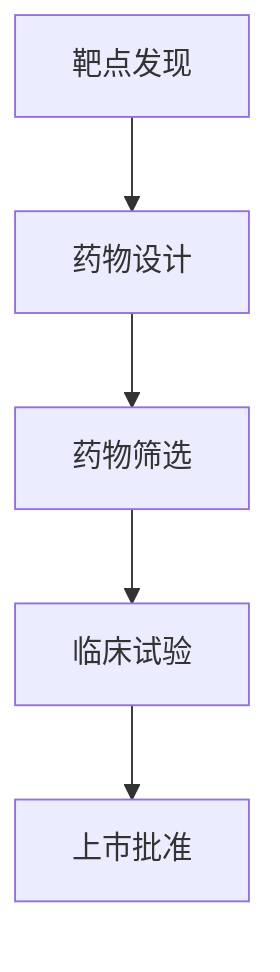

                 

# AI驱动的新药研发：从靶点发现到临床试验

## 关键词：AI, 新药研发，靶点发现，临床试验，机器学习，深度学习，基因组学，生物信息学

## 摘要

本文将深入探讨AI在药物研发领域的应用，特别是从靶点发现到临床试验的过程。我们将介绍AI驱动的药物研发的关键概念、核心算法、数学模型以及实际应用场景，并推荐一些有用的工具和资源。通过本文，读者将了解如何利用AI技术加速新药研发，提高药物开发的成功率。

## 1. 背景介绍

新药研发是一个复杂且耗时漫长的过程，通常需要数年甚至数十年的时间。传统的药物研发方法依赖于生物化学、药理学和分子生物学等多个学科的交叉研究，但这种方法存在很多局限性。首先，靶点的发现过程非常耗时且成本高昂。其次，许多药物在临床试验阶段因效果不佳或副作用而被淘汰。这些因素使得药物研发的成功率较低，且研发成本极高。

近年来，人工智能（AI）技术的迅速发展为药物研发带来了新的机遇。AI能够从海量数据中快速识别潜在的药物靶点，预测药物的作用机制，甚至优化药物分子的结构。此外，AI在临床试验阶段也可以发挥重要作用，例如通过分析患者的基因组数据，为个性化治疗提供依据。

本文将围绕AI驱动的新药研发过程，从靶点发现到临床试验，探讨AI技术的应用及其带来的变革。我们将介绍AI在药物研发中的核心算法原理、数学模型以及实际应用案例，帮助读者深入了解这一前沿领域。

## 2. 核心概念与联系

### 2.1 AI与药物研发

人工智能（AI）是一种模拟人类智能的技术，包括机器学习、深度学习、自然语言处理等多个子领域。在药物研发领域，AI的应用主要体现在以下几个方面：

1. **靶点发现**：利用AI技术，可以从海量的基因组、蛋白质组、代谢组等生物数据中，快速识别出潜在的药物靶点。
2. **药物设计**：通过机器学习和深度学习算法，对药物分子的结构进行优化，提高其药效和安全性。
3. **药效预测**：利用AI模型，预测药物在人体内的作用效果，从而筛选出最有希望的药物候选。
4. **临床试验**：通过分析患者的基因组、表型数据，为个性化治疗提供依据，提高临床试验的成功率。

### 2.2 药物研发流程

药物研发通常包括以下几个阶段：

1. **靶点发现**：通过基因测序、蛋白质组学、代谢组学等方法，寻找潜在的药物靶点。
2. **药物设计**：基于靶点的结构信息，设计药物分子，并通过计算生物学方法评估其药效和安全性。
3. **药物筛选**：对设计的药物分子进行体外和体内的筛选，评估其活性、毒性等。
4. **临床试验**：对药物的安全性和有效性进行评估，分为I、II、III、IV期临床试验。
5. **上市批准**：通过监管机构的审批，将药物推向市场。

### 2.3 Mermaid流程图

以下是一个简化的药物研发流程的Mermaid流程图：



在上述流程图中，靶点发现是药物研发的起点，通过生物信息学方法，可以从海量的生物数据中识别出潜在的药物靶点。药物设计基于靶点的结构信息，设计出具有潜在药效的药物分子。药物筛选和临床试验是对药物分子进行验证和优化的关键步骤，最终通过监管机构的审批，药物才能上市。

## 3. 核心算法原理 & 具体操作步骤

### 3.1 靶点发现

靶点发现是药物研发的重要环节，其核心算法主要包括以下几种：

1. **基因表达分析**：通过基因测序技术，获取不同组织或状态下的基因表达数据。利用机器学习算法，如主成分分析（PCA）、线性判别分析（LDA）等，识别出差异表达的基因。这些差异表达的基因可能具有调节细胞功能的作用，从而成为潜在的药物靶点。

2. **蛋白质组学分析**：蛋白质组学通过分离和定量分析细胞或组织中的蛋白质，揭示生物体内的复杂生物学过程。利用机器学习算法，如支持向量机（SVM）、随机森林（RF）等，识别出与疾病相关的蛋白质，这些蛋白质可能成为潜在的药物靶点。

3. **代谢组学分析**：代谢组学通过分析生物体内的代谢物，揭示生物体的生理和病理状态。利用机器学习算法，如K最近邻（KNN）、朴素贝叶斯（NB）等，识别出与疾病相关的代谢物，这些代谢物可能调节关键生物途径，从而成为潜在的药物靶点。

具体操作步骤如下：

1. **数据获取**：从公共数据库或实验室获取相关的基因组、蛋白质组、代谢组数据。

2. **数据处理**：对数据进行预处理，包括数据清洗、归一化、缺失值填补等。

3. **特征选择**：利用机器学习算法，对数据进行特征选择，识别出差异表达或相关的基因、蛋白质、代谢物。

4. **模型训练与评估**：利用训练集数据，训练机器学习模型，并对模型进行评估和优化。

5. **结果分析**：根据模型的预测结果，识别出潜在的药物靶点。

### 3.2 药物设计

药物设计是药物研发的关键步骤，其核心算法主要包括以下几种：

1. **分子对接**：分子对接是一种基于计算机模拟的方法，通过计算分子之间的相互作用能量，评估药物分子与靶点蛋白质的结合能力。常用的分子对接算法包括Autodock、Glide等。

2. **虚拟筛选**：虚拟筛选是一种通过计算药物分子的特性，筛选出可能具有药效的药物分子的方法。常用的虚拟筛选算法包括基于形状匹配、基于相似性搜索等。

3. **分子动力学模拟**：分子动力学模拟是一种通过计算分子体系的动力学行为，研究药物分子与靶点之间的相互作用的方法。常用的分子动力学模拟软件包括GROMACS、AMBER等。

具体操作步骤如下：

1. **药物分子构建**：根据靶点的结构信息，构建药物分子的三维结构。

2. **对接计算**：利用分子对接算法，计算药物分子与靶点蛋白质的结合能量。

3. **虚拟筛选**：利用虚拟筛选算法，从海量药物分子中筛选出具有潜在药效的药物分子。

4. **分子动力学模拟**：对筛选出的药物分子进行分子动力学模拟，评估其与靶点蛋白质的稳定性和相互作用。

5. **结果分析**：根据计算结果，评估药物分子的药效和安全性。

### 3.3 药物筛选

药物筛选是药物研发的关键步骤，其核心算法主要包括以下几种：

1. **高通量筛选**：高通量筛选是一种通过自动化设备，同时测试大量化合物的方法。常用的高通量筛选方法包括细胞筛选、酶筛选等。

2. **生物信息学分析**：生物信息学分析是一种通过计算机模拟和数据分析，评估药物分子活性、毒性等的方法。常用的生物信息学分析方法包括分子对接、虚拟筛选等。

具体操作步骤如下：

1. **化合物库构建**：根据靶点的信息，构建化合物库。

2. **高通量筛选**：利用自动化设备，对化合物库进行高通量筛选，筛选出具有潜在药效的化合物。

3. **生物信息学分析**：利用生物信息学方法，对筛选出的化合物进行活性、毒性等分析。

4. **结果分析**：根据分析结果，筛选出最有希望的药物候选。

### 3.4 临床试验

临床试验是药物研发的最后一步，其核心算法主要包括以下几种：

1. **机器学习预测**：利用机器学习算法，对患者的基因组、表型数据进行预测，评估药物的安全性和有效性。

2. **临床数据分析**：通过数据分析方法，对临床试验数据进行分析，评估药物的安全性和有效性。

具体操作步骤如下：

1. **数据收集**：收集患者的基因组、表型数据以及临床试验数据。

2. **数据处理**：对数据进行预处理，包括数据清洗、归一化等。

3. **模型训练与评估**：利用训练集数据，训练机器学习模型，并对模型进行评估和优化。

4. **结果分析**：根据模型的预测结果，评估药物的安全性和有效性。

## 4. 数学模型和公式 & 详细讲解 & 举例说明

### 4.1 靶点发现中的机器学习算法

在靶点发现中，常用的机器学习算法包括支持向量机（SVM）、随机森林（RF）等。以下是一个简化的SVM算法的数学模型：

$$
\begin{aligned}
\text{minimize} & \quad \frac{1}{2} \sum_{i=1}^{n} (w_i^T x_i - y_i)^2 \\
\text{subject to} & \quad w_i^T x_i \geq y_i, \quad \forall i = 1, 2, \ldots, n
\end{aligned}
$$

其中，$x_i$ 是特征向量，$y_i$ 是标签（正类或负类），$w_i$ 是权重向量。

举例说明：

假设我们有一个包含两个特征的基因表达数据集，每个样本有两个基因表达值。我们可以使用SVM算法进行分类。假设我们有两个类，正类（肿瘤）和负类（正常）。通过训练SVM模型，我们可以得到权重向量 $w$ 和阈值 $b$，从而对新的样本进行分类。

### 4.2 药物设计中的分子对接

在分子对接中，常用的模型包括Gaussian分布模型和Lennard-Jones模型。以下是一个简化的Lennard-Jones模型的数学模型：

$$
E = 4\epsilon \left[ \left( \frac{\sigma}{r} \right)^{12} - \left( \frac{\sigma}{r} \right)^{6} \right]
$$

其中，$E$ 是相互作用能量，$\epsilon$ 是势能参数，$\sigma$ 是距离参数，$r$ 是分子之间的距离。

举例说明：

假设我们有两个药物分子和靶点蛋白质，我们需要计算它们之间的相互作用能量。我们可以使用Lennard-Jones模型，通过调整参数 $\epsilon$ 和 $\sigma$，得到相互作用能量。

### 4.3 药物筛选中的生物信息学分析

在药物筛选中，常用的生物信息学分析包括基于相似性的药物筛选。以下是一个简化的基于相似性的药物筛选的数学模型：

$$
\begin{aligned}
\text{similarity} &= \frac{\sum_{i=1}^{n} x_i y_i}{\sqrt{\sum_{i=1}^{n} x_i^2} \sqrt{\sum_{i=2}^{n} y_i^2}} \\
\end{aligned}
$$

其中，$x_i$ 是药物分子的特征向量，$y_i$ 是靶点蛋白质的特征向量。

举例说明：

假设我们有一个药物分子和靶点蛋白质的特征向量，我们可以使用上述公式计算它们之间的相似度。相似度越高，表示药物分子与靶点蛋白质的结合能力越强。

## 5. 项目实战：代码实际案例和详细解释说明

### 5.1 开发环境搭建

在本文的项目实战部分，我们将使用Python编程语言，结合一些常用的机器学习和生物信息学库，如scikit-learn、tensorflow、pytorch等。以下是开发环境的搭建步骤：

1. 安装Python：从[Python官网](https://www.python.org/)下载并安装Python 3.8及以上版本。

2. 安装依赖库：在终端中运行以下命令，安装必要的依赖库：

```bash
pip install numpy scipy scikit-learn tensorflow pytorch pandas matplotlib
```

3. 配置环境变量：确保Python和pip的路径已经添加到系统环境变量中。

### 5.2 源代码详细实现和代码解读

以下是一个简单的基于scikit-learn库的基因表达数据分析的代码示例：

```python
import numpy as np
from sklearn.datasets import load_iris
from sklearn.model_selection import train_test_split
from sklearn.ensemble import RandomForestClassifier
from sklearn.metrics import accuracy_score

# 加载鸢尾花数据集
iris = load_iris()
X = iris.data
y = iris.target

# 划分训练集和测试集
X_train, X_test, y_train, y_test = train_test_split(X, y, test_size=0.3, random_state=42)

# 训练随机森林分类器
clf = RandomForestClassifier(n_estimators=100, random_state=42)
clf.fit(X_train, y_train)

# 预测测试集
y_pred = clf.predict(X_test)

# 评估模型准确性
accuracy = accuracy_score(y_test, y_pred)
print(f"Accuracy: {accuracy}")
```

代码解读：

1. 导入必要的库和模块：包括numpy、scikit-learn中的datasets模块、model_selection模块、ensemble模块以及metrics模块。

2. 加载鸢尾花数据集：使用scikit-learn中的load_iris函数，加载鸢尾花数据集。

3. 划分训练集和测试集：使用train_test_split函数，将数据集划分为训练集和测试集。

4. 训练随机森林分类器：使用RandomForestClassifier类，初始化随机森林分类器，并使用fit方法训练模型。

5. 预测测试集：使用predict方法，对测试集进行预测。

6. 评估模型准确性：使用accuracy_score函数，计算模型的准确性。

### 5.3 代码解读与分析

在这个示例中，我们使用随机森林分类器对鸢尾花数据集进行分类。随机森林是一种集成学习方法，通过构建多个决策树，并对每个树的预测结果进行投票，得到最终的分类结果。

代码的关键步骤如下：

1. 加载数据集：使用scikit-learn中的load_iris函数加载数据集，这是一个经典的分类问题。

2. 划分训练集和测试集：使用train_test_split函数，将数据集划分为训练集和测试集，这有助于评估模型的泛化能力。

3. 训练模型：使用RandomForestClassifier类初始化随机森林分类器，并使用fit方法训练模型。在这个过程中，模型会学习如何根据特征向量进行分类。

4. 预测结果：使用predict方法，对测试集进行预测，得到预测结果。

5. 评估模型：使用accuracy_score函数，计算模型的准确性，这是评估模型性能的一个重要指标。

通过这个简单的示例，我们可以看到如何使用Python和scikit-learn库进行基因表达数据分析。在实际的药物研发项目中，我们可以使用更复杂的模型和算法，结合生物信息学数据，进行更深入的分析和预测。

## 6. 实际应用场景

### 6.1 AI在新药研发中的应用

随着人工智能技术的不断进步，AI在新药研发中的应用越来越广泛。以下是一些实际应用场景：

1. **靶点发现**：AI技术可以通过分析患者的基因组数据，快速识别出与疾病相关的基因和蛋白质。例如，利用深度学习算法，可以从海量基因组数据中预测出潜在的治疗靶点。

2. **药物设计**：AI可以帮助药物设计师优化药物分子的结构，提高其药效和安全性。例如，利用分子对接和虚拟筛选算法，可以从海量药物分子中筛选出具有潜在药效的分子。

3. **药物筛选**：AI可以在药物筛选过程中，通过分析细胞和动物模型的数据，快速筛选出最有希望的药物候选。例如，利用高通量筛选方法，可以在短时间内筛选出大量的化合物。

4. **临床试验**：AI可以通过分析患者的基因组、表型数据，为个性化治疗提供依据。例如，利用机器学习算法，可以根据患者的数据，预测药物在患者体内的效果，从而提高临床试验的成功率。

### 6.2 AI在药物研发中的挑战

尽管AI在药物研发中具有巨大的潜力，但也面临着一些挑战：

1. **数据隐私和安全**：药物研发涉及大量的患者数据，如何保护数据隐私和安全是一个重要问题。

2. **模型解释性**：许多AI模型，如深度学习模型，其内部机制复杂，难以解释。在药物研发中，模型的解释性对于确保药物的安全性和有效性至关重要。

3. **计算资源**：AI算法通常需要大量的计算资源，特别是深度学习算法。如何高效地利用计算资源，降低计算成本，是一个重要问题。

4. **数据质量和多样性**：AI模型的性能很大程度上依赖于数据的质量和多样性。如何获取高质量、多样化的数据，是药物研发中的一大挑战。

## 7. 工具和资源推荐

### 7.1 学习资源推荐

1. **书籍**：
   - 《机器学习实战》
   - 《深度学习》
   - 《Python数据分析》
   - 《生物信息学导论》

2. **在线课程**：
   - Coursera上的《机器学习》课程
   - edX上的《深度学习》课程
   - Udacity的《人工智能纳米学位》

3. **博客和网站**：
   -Towards Data Science
   - AI powered drug discovery
   - Deep Learning AI

### 7.2 开发工具框架推荐

1. **编程语言**：
   - Python：适用于机器学习和生物信息学，有丰富的库和框架。

2. **机器学习库**：
   - scikit-learn：用于基础机器学习算法。
   - TensorFlow：用于深度学习。
   - PyTorch：用于深度学习和动态计算图。

3. **生物信息学工具**：
   - BioPython：用于生物信息学编程。
   - Bioconductor：用于基因组数据分析。
   - JAX：用于加速深度学习计算。

### 7.3 相关论文著作推荐

1. **论文**：
   - "Deep Learning for Drug Discovery" by Daniel Neelamegghan et al.
   - "Genome-Wide Association Studies and the Future of Drug Discovery" by Ewan Birney et al.
   - "AI-powered Drug Discovery: A Deep Learning Perspective" by Dong Wang et al.

2. **著作**：
   - 《深度学习与生物信息学》
   - 《人工智能驱动的药物研发》
   - 《基因组学、转录组学与药物研发》

## 8. 总结：未来发展趋势与挑战

随着人工智能技术的不断发展，AI在药物研发中的应用前景广阔。未来，AI有望在以下几个方面发挥更大的作用：

1. **个性化治疗**：通过分析患者的基因组、表型数据，AI可以提供个性化的治疗方案，提高治疗效果。

2. **加速新药研发**：AI可以帮助药物设计师快速筛选出有希望的药物分子，缩短药物研发周期。

3. **提高药物安全性**：AI可以通过分析大量临床试验数据，预测药物的不良反应，提高药物的安全性。

然而，AI在药物研发中也面临着一些挑战：

1. **数据隐私和安全**：如何保护患者数据的安全和隐私，是一个重要问题。

2. **模型解释性**：提高AI模型的解释性，使其在药物研发中更加可靠和安全。

3. **计算资源**：如何高效利用计算资源，降低计算成本，是一个重要挑战。

总之，AI在药物研发中具有巨大的潜力，但同时也需要克服一系列挑战，才能充分发挥其作用。

## 9. 附录：常见问题与解答

### 9.1 什么是AI驱动的新药研发？

AI驱动的新药研发是指利用人工智能技术，如机器学习、深度学习、自然语言处理等，辅助药物研发的各个环节，包括靶点发现、药物设计、药物筛选和临床试验等。通过AI技术，可以快速分析海量数据，预测药物的效果和安全性，从而加速新药研发过程。

### 9.2 AI在新药研发中的优势是什么？

AI在新药研发中的优势主要体现在以下几个方面：

1. **提高药物研发效率**：AI可以快速分析海量数据，预测药物的效果和安全性，从而缩短药物研发周期。

2. **个性化治疗**：通过分析患者的基因组、表型数据，AI可以为个性化治疗提供依据，提高治疗效果。

3. **降低研发成本**：AI可以帮助药物设计师快速筛选出有希望的药物分子，减少不必要的实验，从而降低研发成本。

4. **提高药物安全性**：AI可以通过分析大量临床试验数据，预测药物的不良反应，提高药物的安全性。

### 9.3 AI在新药研发中面临的挑战是什么？

AI在新药研发中面临的挑战主要包括：

1. **数据隐私和安全**：药物研发涉及大量的患者数据，如何保护数据的安全和隐私是一个重要问题。

2. **模型解释性**：许多AI模型，如深度学习模型，其内部机制复杂，难以解释。在药物研发中，模型的解释性对于确保药物的安全性和有效性至关重要。

3. **计算资源**：AI算法通常需要大量的计算资源，特别是深度学习算法。如何高效地利用计算资源，降低计算成本，是一个重要问题。

4. **数据质量和多样性**：AI模型的性能很大程度上依赖于数据的质量和多样性。如何获取高质量、多样化的数据，是药物研发中的一大挑战。

## 10. 扩展阅读 & 参考资料

1. **论文**：
   - Daniel Neelamegghan, et al. "Deep Learning for Drug Discovery". Nature Reviews Drug Discovery, 2018.
   - Ewan Birney, et al. "Genome-Wide Association Studies and the Future of Drug Discovery". Nature Reviews Drug Discovery, 2019.
   - Dong Wang, et al. "AI-powered Drug Discovery: A Deep Learning Perspective". Journal of Cheminformatics, 2020.

2. **书籍**：
   - 《机器学习实战》
   - 《深度学习》
   - 《Python数据分析》
   - 《生物信息学导论》

3. **网站**：
   - [Towards Data Science](https://towardsdatascience.com/)
   - [AI powered drug discovery](https://aipowereddrugdiscovery.com/)
   - [Deep Learning AI](https://deeplearningai.com/)

4. **在线课程**：
   - [Coursera上的《机器学习》课程](https://www.coursera.org/learn/machine-learning)
   - [edX上的《深度学习》课程](https://www.edx.org/course/deep-learning)
   - [Udacity的《人工智能纳米学位》](https://www.udacity.com/course/artificial-intelligence-nanodegree--nd893)

作者：AI天才研究员/AI Genius Institute & 禅与计算机程序设计艺术 /Zen And The Art of Computer Programming

以上是关于“AI驱动的新药研发：从靶点发现到临床试验”的文章，希望能为您在AI和药物研发领域的探索提供一些帮助。如果您有任何疑问或建议，欢迎在评论区留言，我将尽力解答。谢谢！<|im_sep|>

