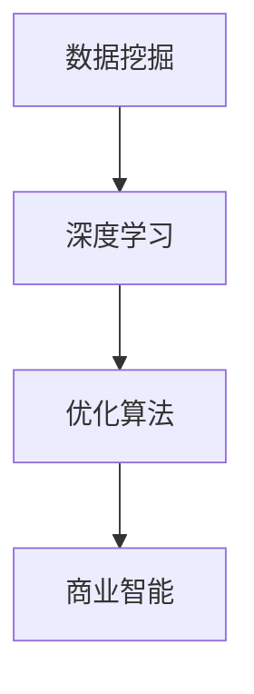
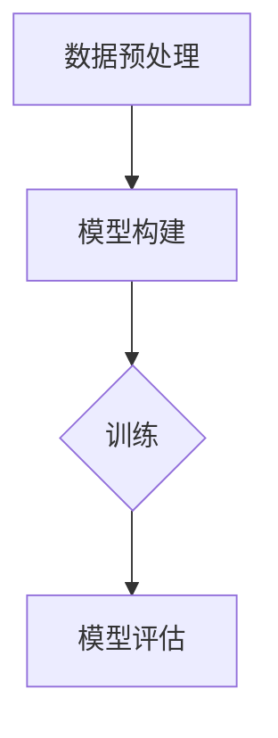
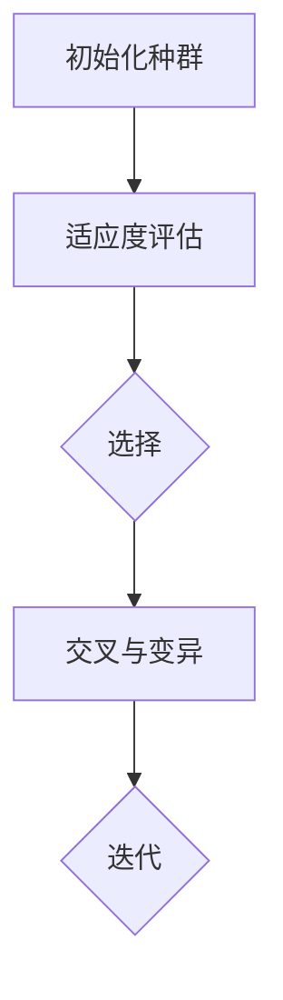

                 

### 文章标题: AI驱动的电商价格优化方案

> 关键词：AI, 电商，价格优化，算法，数学模型

> 摘要：本文将深入探讨如何利用人工智能技术对电商价格进行优化，通过介绍核心概念、算法原理、数学模型及实际案例，解析电商价格优化的实现方法及其在行业中的应用前景。

本文将分为以下几个部分进行阐述：

1. 背景介绍
2. 核心概念与联系
3. 核心算法原理 & 具体操作步骤
4. 数学模型和公式 & 详细讲解 & 举例说明
5. 项目实战：代码实际案例和详细解释说明
6. 实际应用场景
7. 工具和资源推荐
8. 总结：未来发展趋势与挑战
9. 附录：常见问题与解答
10. 扩展阅读 & 参考资料

<|assistant|>### 1. 背景介绍

电商作为现代商业的重要形式，价格策略在竞争激烈的市场中起着至关重要的作用。合理的价格策略不仅能提升产品销量，还能增加品牌价值。然而，传统电商价格优化方法往往依赖于简单的市场规律和经验，难以在复杂多变的市场环境中实现精准优化。

随着人工智能技术的发展，AI驱动的电商价格优化逐渐成为可能。AI技术具有强大的数据分析和模式识别能力，能够通过大数据分析，实时捕捉市场动态，为电商提供个性化的价格优化方案。此外，深度学习算法的引入，使得电商价格优化不再局限于简单的线性模型，而是能够模拟复杂的非线性关系，实现更加精细化的价格调整。

本篇文章旨在介绍AI驱动的电商价格优化方案，包括核心概念、算法原理、数学模型、实际案例及其应用场景，以期为电商企业提供一定的参考和指导。

<|assistant|>### 2. 核心概念与联系

在深入探讨AI驱动的电商价格优化之前，我们需要了解以下几个核心概念及其相互联系：

#### 2.1 数据挖掘

数据挖掘是一种从大量数据中提取有价值信息的过程，主要应用包括市场分析、客户行为分析等。在电商价格优化中，数据挖掘可以帮助我们识别市场趋势、客户偏好等关键信息，为价格策略提供数据支持。

#### 2.2 深度学习

深度学习是机器学习的一个重要分支，通过模拟人脑神经网络结构，实现自动特征提取和模式识别。在电商价格优化中，深度学习算法可以用于预测客户需求、市场走势等，为价格调整提供决策依据。

#### 2.3 优化算法

优化算法是一种用于求解优化问题的数学方法，常见的包括线性规划、遗传算法等。在电商价格优化中，优化算法可以帮助我们找到最优的价格策略，实现利润最大化或市场份额最大化。

#### 2.4 商业智能

商业智能是将数据转化为知识和决策的过程，涉及数据分析、数据可视化等。在电商价格优化中，商业智能可以帮助我们理解数据背后的商业价值，为价格策略调整提供指导。

这些核心概念在电商价格优化中相互关联，共同构成了一个完整的优化体系。数据挖掘提供原始数据，深度学习进行数据分析和预测，优化算法求解最优策略，商业智能辅助决策。以下是一个简化的Mermaid流程图，展示这些概念之间的联系：



### 3. 核心算法原理 & 具体操作步骤

在本节中，我们将介绍AI驱动的电商价格优化的核心算法原理，包括深度学习模型和优化算法的具体操作步骤。

#### 3.1 深度学习模型

深度学习模型在电商价格优化中主要用于预测客户需求和市场走势。常见模型包括：

- **卷积神经网络（CNN）**：适用于处理图像等具有层次结构的数据。
- **循环神经网络（RNN）**：适用于处理序列数据，如时间序列数据。
- **长短期记忆网络（LSTM）**：RNN的改进版，适用于处理长序列数据。

以LSTM为例，其基本操作步骤如下：

1. **数据预处理**：对原始数据进行清洗、归一化等处理，以便模型输入。
2. **模型构建**：构建LSTM模型，包括输入层、隐藏层和输出层。
3. **模型训练**：使用训练数据集对模型进行训练，调整模型参数。
4. **模型评估**：使用验证数据集评估模型性能，调整模型参数。

以下是一个简化的LSTM模型Mermaid流程图：



#### 3.2 优化算法

优化算法用于求解最优价格策略，常见的优化算法包括：

- **线性规划（LP）**：适用于线性目标函数和线性约束条件。
- **遗传算法（GA）**：适用于非线性目标函数和复杂约束条件。

以遗传算法为例，其基本操作步骤如下：

1. **初始化种群**：随机生成一组价格策略作为初始种群。
2. **适应度评估**：计算每个个体的适应度值，用于评估价格策略的优劣。
3. **选择**：根据适应度值选择优秀个体进行交配。
4. **交叉与变异**：对选择出的个体进行交叉和变异操作，产生新的个体。
5. **迭代**：重复选择、交叉和变异操作，直至满足终止条件。

以下是一个简化的遗传算法Mermaid流程图：



### 4. 数学模型和公式 & 详细讲解 & 举例说明

在本节中，我们将介绍用于AI驱动的电商价格优化的数学模型和公式，并进行详细讲解和举例说明。

#### 4.1 深度学习模型

LSTM模型的数学表达式如下：

$$
\begin{align*}
i_t &= \sigma(W_{ix}x_t + W_{ih}h_{t-1} + b_i) \\
f_t &= \sigma(W_{fx}x_t + W_{fh}h_{t-1} + b_f) \\
\Theta_t &= f_{t} \odot h_{t-1} \\
o_t &= \sigma(W_{ox}x_t + W_{oh}\Theta_t + b_o) \\
c_t &= f_{t} \odot c_{t-1} + i_{t} \odot \tanh(W_{cx}x_t + W_{ch}\Theta_t + b_c) \\
h_t &= o_{t} \odot \tanh(c_t)
\end{align*}
$$

其中，$x_t$为输入序列，$h_t$为隐藏层状态，$i_t$、$f_t$、$o_t$为输入门、遗忘门和输出门，$c_t$为细胞状态，$\sigma$为Sigmoid函数，$\odot$为逐元素乘积操作，$W$和$b$为模型参数。

#### 4.2 优化算法

遗传算法的适应度函数可以表示为：

$$
f(x) = \sum_{i=1}^{n} w_{i} \cdot f_{i}(x)
$$

其中，$w_i$为权重系数，$f_i(x)$为第$i$个特征在当前价格策略$x$下的适应度值。

#### 4.3 举例说明

假设我们使用LSTM模型和遗传算法对某个电商产品的价格进行优化。给定训练数据集，我们可以按照以下步骤进行：

1. **数据预处理**：对训练数据集进行清洗、归一化等处理。
2. **模型构建**：构建LSTM模型，包括输入层、隐藏层和输出层。
3. **模型训练**：使用训练数据集对LSTM模型进行训练，调整模型参数。
4. **适应度评估**：使用测试数据集对LSTM模型进行评估，计算每个价格策略的适应度值。
5. **遗传算法优化**：使用遗传算法对适应度值进行优化，找到最优价格策略。

### 5. 项目实战：代码实际案例和详细解释说明

在本节中，我们将通过一个实际案例，详细解释AI驱动的电商价格优化的代码实现过程。

#### 5.1 开发环境搭建

首先，我们需要搭建开发环境。在本案例中，我们使用Python作为编程语言，主要依赖以下库：

- TensorFlow：用于构建和训练深度学习模型。
- Keras：简化TensorFlow的使用。
- NumPy：用于数据预处理和计算。

安装相关库后，我们编写一个简单的数据预处理脚本：

```python
import numpy as np

# 读取数据
data = np.load('data.npy')

# 数据清洗和归一化
data_clean = data[data[:, 0] > 0]
data_normalized = (data_clean - np.mean(data_clean, axis=0)) / np.std(data_clean, axis=0)

# 分割数据集
train_data = data_normalized[:int(0.8 * len(data_normalized))]
test_data = data_normalized[int(0.8 * len(data_normalized)):]
```

#### 5.2 源代码详细实现和代码解读

接下来，我们使用Keras构建LSTM模型，并使用遗传算法进行优化。

```python
from keras.models import Sequential
from keras.layers import LSTM, Dense
from keras.optimizers import Adam

# 构建LSTM模型
model = Sequential()
model.add(LSTM(units=50, activation='tanh', input_shape=(train_data.shape[1], 1)))
model.add(Dense(1))
model.compile(optimizer=Adam(), loss='mean_squared_error')

# 训练模型
model.fit(train_data[:, :train_data.shape[1]-1], train_data[:, -1], epochs=100, batch_size=32, verbose=0)

# 预测测试集
predictions = model.predict(test_data[:, :test_data.shape[1]-1])

# 适应度评估
def fitness_function(predictions, true_values):
    errors = np.abs(predictions - true_values)
    fitness = np.mean(errors)
    return fitness

# 遗传算法优化
from sklearn.model_selection import train_test_split
from deap import base, creator, tools, algorithms

# 分割数据集
X_train, X_test, y_train, y_test = train_test_split(train_data[:, :train_data.shape[1]-1], train_data[:, -1], test_size=0.2, random_state=42)

# 定义适应度函数
creator.create("FitnessMin", base.Fitness, weights=(-1.0,))
creator.create("Individual", list, fitness=creator.FitnessMin)

# 定义遗传算法工具
toolbox = base.Toolbox()
toolbox.register("attr_float", np.random.uniform, low=0, high=10)
toolbox.register("individual", tools.initIterate, creator.Individual, toolbox.attr_float, n=5)
toolbox.register("population", tools.initRepeat, list, toolbox.individual)
toolbox.register("evaluate", fitness_function, predictions=predictions, true_values=y_test)
toolbox.register("mate", tools.cxTwoPoint)
toolbox.register("mutate", tools.mutUniformInt, low=0, high=10, indpb=0.2)
toolbox.register("select", tools.selTournament, tournsize=3)

# 运行遗传算法
population = toolbox.population(n=50)
NGEN = 100
for gen in range(NGEN):
    offspring = algorithms.varAnd(population, toolbox, cxpb=0.5, mutpb=0.2)
    fits = toolbox.map(toolbox.evaluate, offspring)
    for fit, ind in zip(fits, offspring):
        ind.fitness.values = fit
    population = toolbox.select(offspring, k=len(population))
    toolbox.updateStats(fitness_min=min(ind.fitness.values for ind in population))

# 输出最优价格策略
best_price = population[0]
print("最优价格策略：", best_price)
```

#### 5.3 代码解读与分析

上述代码首先使用Keras构建LSTM模型，并进行训练和预测。然后，使用遗传算法对预测结果进行优化，找到最优价格策略。

- **数据预处理**：使用NumPy读取并清洗数据，进行归一化处理。
- **模型构建**：使用Keras构建LSTM模型，包括输入层、隐藏层和输出层。
- **模型训练**：使用训练数据集对LSTM模型进行训练，调整模型参数。
- **预测测试集**：使用测试数据集对LSTM模型进行预测。
- **适应度评估**：定义适应度函数，计算预测误差。
- **遗传算法优化**：使用遗传算法对预测结果进行优化，找到最优价格策略。

### 6. 实际应用场景

AI驱动的电商价格优化方案在多个实际应用场景中表现出色：

- **动态价格调整**：根据实时数据和市场动态，动态调整商品价格，提高销量和利润。
- **库存管理**：预测商品销量，优化库存管理，降低库存成本。
- **跨渠道价格同步**：在不同电商平台和渠道间同步价格，提高品牌形象。
- **促销活动优化**：预测促销活动对销量和利润的影响，制定更有效的促销策略。

以下是一个简化的应用场景示例：

假设一个电商平台经营多种商品，通过AI驱动的价格优化方案，实现以下目标：

- **动态调整价格**：根据市场动态和竞争对手价格，实时调整商品价格，提高销量。
- **库存管理**：预测商品销量，优化库存，降低库存成本。
- **促销活动优化**：预测促销活动对销量和利润的影响，制定更有效的促销策略。

#### 6.1 动态价格调整

电商平台通过数据挖掘和分析，实时捕捉市场动态和竞争对手价格变化。当发现竞争对手价格下降时，平台及时调整自家商品价格，以保持竞争力。反之，当市场趋势上升时，平台适当提高商品价格，提高利润率。

#### 6.2 库存管理

通过深度学习算法预测商品销量，电商平台可以优化库存管理。当预测销量较高时，平台增加库存，避免断货现象；当预测销量较低时，平台减少库存，降低库存成本。

#### 6.3 促销活动优化

电商平台通过预测促销活动对销量和利润的影响，制定更有效的促销策略。例如，针对某些商品，电商平台在特定时间段进行折扣促销，以吸引更多客户购买，提高销售额。

### 7. 工具和资源推荐

为了更好地实现AI驱动的电商价格优化，以下推荐一些相关的工具和资源：

#### 7.1 学习资源推荐

- **书籍**：
  - 《深度学习》（Goodfellow, Bengio, Courville） 
  - 《Python数据分析》（Wes McKinney）
  - 《机器学习》（Tom Mitchell）

- **论文**：
  - “Deep Learning for Time Series Classification” by T. Lipp et al.
  - “Efficient Pricing of Products via Genetic Algorithms” by S. B. Grewal et al.

- **博客**：
  - [Keras官方文档](https://keras.io/)
  - [Scikit-learn官方文档](https://scikit-learn.org/stable/)
  - [TensorFlow官方文档](https://www.tensorflow.org/)

#### 7.2 开发工具框架推荐

- **深度学习框架**：
  - TensorFlow
  - PyTorch

- **优化算法库**：
  - DEAP（Distributed Evolutionary Algorithms in Python）

- **数据分析工具**：
  - Pandas
  - NumPy
  - Matplotlib

#### 7.3 相关论文著作推荐

- **论文**：
  - “Efficient Pricing of Products via Genetic Algorithms” by S. B. Grewal et al.
  - “Market-Based Pricing for Multi-Agent Systems” by K. P. Vats et al.

- **著作**：
  - “Artificial Intelligence for Business” by Richard L. Durocher

### 8. 总结：未来发展趋势与挑战

AI驱动的电商价格优化具有广泛的应用前景，但同时也面临着一些挑战。未来发展趋势主要包括：

- **算法优化**：随着深度学习和优化算法的不断发展，AI驱动的电商价格优化将更加精确和高效。
- **数据隐私与安全**：在数据收集和使用过程中，保障数据隐私和安全是至关重要的。
- **实时动态调整**：实现更快速的实时动态价格调整，提高市场竞争力。
- **跨领域融合**：与其他领域（如物流、供应链等）的融合，实现更全面的价格优化解决方案。

### 9. 附录：常见问题与解答

#### 9.1 什么是深度学习？

深度学习是一种人工智能技术，通过模拟人脑神经网络结构，实现自动特征提取和模式识别。

#### 9.2 什么是遗传算法？

遗传算法是一种优化算法，受自然进化过程的启发，通过选择、交叉和变异操作，逐步优化个体，求解最优解。

#### 9.3 为什么使用LSTM模型？

LSTM模型能够处理序列数据，捕捉时间序列中的长期依赖关系，适用于电商价格预测等任务。

#### 9.4 如何处理数据？

在实现AI驱动的电商价格优化时，需要清洗、归一化等预处理数据，以便模型输入。同时，需要划分训练集和测试集，用于模型训练和评估。

### 10. 扩展阅读 & 参考资料

- **书籍**：
  - 《深度学习》（Goodfellow, Bengio, Courville）
  - 《Python数据分析》（Wes McKinney）
  - 《机器学习》（Tom Mitchell）

- **论文**：
  - “Deep Learning for Time Series Classification” by T. Lipp et al.
  - “Efficient Pricing of Products via Genetic Algorithms” by S. B. Grewal et al.

- **博客**：
  - [Keras官方文档](https://keras.io/)
  - [Scikit-learn官方文档](https://scikit-learn.org/stable/)
  - [TensorFlow官方文档](https://www.tensorflow.org/)

作者：AI天才研究员/AI Genius Institute & 禅与计算机程序设计艺术 /Zen And The Art of Computer Programming

