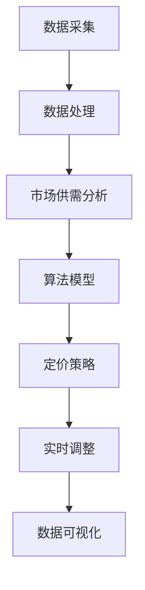

                 

### 背景介绍

随着互联网技术的飞速发展，电子商务行业正在经历一场前所未有的变革。在过去的几年中，电商平台的数量和规模都呈指数级增长，消费者对于购物体验的要求也越来越高。为了在激烈的市场竞争中脱颖而出，电商平台们不断寻求新的盈利模式和创新策略。

在这样的背景下，动态定价成为了一个备受关注的话题。动态定价是指根据市场需求、竞争对手策略、库存情况等多重因素，实时调整商品价格，以最大化利润或市场占有率。这种定价策略在许多领域都取得了显著的成效，例如酒店预订、机票预订和广告投放等。

然而，对于单个电商公司来说，如何实现动态定价并非易事。首先，需要收集并分析大量的数据，包括用户行为、竞争对手价格、市场需求趋势等。其次，需要构建一个高效的算法模型，将数据转化为可行的定价策略。此外，动态定价还需要考虑到实时性，即能够快速响应市场变化，调整价格。

本文旨在探讨如何利用人工智能技术，实现电商公司动态定价的实时策略。我们将从背景介绍、核心概念与联系、核心算法原理、数学模型和公式、项目实战、实际应用场景、工具和资源推荐等方面进行详细阐述。希望通过这篇文章，能够为电商公司在动态定价方面提供一些有益的启示和指导。

### 核心概念与联系

要实现电商公司的动态定价，首先需要理解几个核心概念，并探讨它们之间的联系。

#### 1. 数据采集与处理

数据采集是动态定价的基础。电商公司需要收集大量的数据，包括用户行为数据、市场供需数据、竞争对手价格数据等。这些数据来源广泛，包括网站日志、社交媒体、用户反馈等。通过数据采集，公司可以了解到用户的行为习惯、购买偏好、市场趋势等信息。

数据处理则是对收集到的数据进行清洗、筛选和整合。这一过程通常涉及数据预处理技术，如数据去重、数据标准化、缺失值填补等。通过数据处理，公司可以得到准确、完整的数据集，为后续的分析提供基础。

#### 2. 市场供需分析

市场供需分析是动态定价的核心。通过对市场供需数据的分析，电商公司可以了解当前市场的价格水平、需求强度、竞争对手策略等信息。市场供需分析通常包括以下几个方面：

- **价格分析**：分析当前市场价格的分布情况，找出价格敏感度较高的商品和价格波动较大的时间段。
- **需求分析**：分析用户对商品的需求强度，找出需求高峰期和需求低谷期，以及需求变化的趋势。
- **竞争对手分析**：分析竞争对手的价格策略，了解竞争对手的市场占有率、价格定位等。

#### 3. 算法模型

算法模型是实现动态定价的关键。通过构建合适的算法模型，电商公司可以将市场供需分析的结果转化为具体的定价策略。常见的动态定价算法包括：

- **基于价格的算法**：直接根据市场价格进行调整，如价格跟踪算法、最优价格算法等。
- **基于需求的算法**：根据用户需求强度进行调整，如需求响应算法、需求预测算法等。
- **基于竞争的算法**：考虑竞争对手的价格策略进行调整，如竞争响应算法、竞争预测算法等。

#### 4. 实时性

动态定价的一个关键特点是实时性。实时性要求系统能够快速响应市场变化，实时调整价格。这需要高效的数据处理和计算能力。为了实现实时性，电商公司通常会采用以下技术：

- **云计算和大数据技术**：通过云计算和大数据技术，电商公司可以快速处理海量数据，并实时分析市场动态。
- **实时数据库**：使用实时数据库，可以实时存储和处理用户行为数据、市场供需数据等，为动态定价提供实时数据支持。
- **边缘计算**：通过边缘计算，可以在数据产生的源头进行部分数据处理，减少数据传输延迟，提高响应速度。

#### 5. 数据可视化

数据可视化是实现动态定价的重要手段。通过数据可视化，电商公司可以直观地了解市场动态、用户行为和定价效果。常见的可视化工具包括图表、仪表盘和报告等。

#### 6. 综合考虑

在动态定价过程中，电商公司需要综合考虑多个因素，包括市场需求、竞争对手策略、库存情况、成本等。综合考虑是实现有效动态定价的关键。

### Mermaid 流程图

以下是一个简单的 Mermaid 流程图，展示了动态定价的核心流程：



通过这个流程图，我们可以看到动态定价的核心环节，以及各个环节之间的联系。接下来，我们将进一步探讨每个环节的具体实现和操作步骤。

### 核心算法原理 & 具体操作步骤

在动态定价中，核心算法的作用至关重要。它不仅决定了定价策略的有效性，还影响了电商公司的盈利能力。本文将介绍几种常用的动态定价算法，并详细阐述其原理和具体操作步骤。

#### 1. 价格跟踪算法

价格跟踪算法是一种基于市场价格的定价策略。它的核心思想是跟踪市场上类似商品的价格，并调整自身价格以保持竞争力。以下是价格跟踪算法的具体操作步骤：

- **步骤 1**：收集市场数据。首先，电商公司需要收集市场上类似商品的价格数据。这些数据可以通过爬虫、API接口等途径获取。
- **步骤 2**：数据预处理。对收集到的市场数据进行分析，去除异常值和噪声，确保数据质量。
- **步骤 3**：计算价格差异。计算每个商品的价格差异，即当前价格与市场平均价格之间的差距。
- **步骤 4**：设置调整策略。根据价格差异，设置不同的价格调整策略。例如，当价格低于市场平均水平时，可以适当提高价格；当价格高于市场平均水平时，可以适当降低价格。
- **步骤 5**：执行价格调整。根据调整策略，实时调整商品价格。

#### 2. 需求响应算法

需求响应算法是一种基于用户需求的定价策略。它的核心思想是调整价格以应对用户需求的变化。以下是需求响应算法的具体操作步骤：

- **步骤 1**：收集用户数据。收集用户浏览、搜索、购买等行为数据，这些数据可以用于分析用户需求。
- **步骤 2**：用户需求分析。通过数据分析，找出用户需求的高峰期和低谷期，以及需求的变化趋势。
- **步骤 3**：设置需求响应策略。根据用户需求分析结果，设置不同的需求响应策略。例如，在需求高峰期，可以适当提高价格；在需求低谷期，可以适当降低价格。
- **步骤 4**：执行价格调整。根据需求响应策略，实时调整商品价格。

#### 3. 竞争响应算法

竞争响应算法是一种基于竞争对手策略的定价策略。它的核心思想是调整价格以应对竞争对手的变化。以下是竞争响应算法的具体操作步骤：

- **步骤 1**：收集竞争对手数据。收集竞争对手的价格策略、市场占有率等数据。
- **步骤 2**：竞争对手分析。分析竞争对手的价格策略和市场占有率，找出竞争对手的优势和劣势。
- **步骤 3**：设置竞争响应策略。根据竞争对手分析结果，设置不同的竞争响应策略。例如，当竞争对手提高价格时，可以适当降低价格以吸引更多用户；当竞争对手降低价格时，可以适当提高价格以保持竞争力。
- **步骤 4**：执行价格调整。根据竞争响应策略，实时调整商品价格。

#### 4. 综合定价算法

综合定价算法是一种结合多种因素的定价策略。它将市场需求、用户需求和竞争对手策略等多种因素综合考虑，以实现最优定价。以下是综合定价算法的具体操作步骤：

- **步骤 1**：数据整合。整合用户数据、市场供需数据和竞争对手数据，形成统一的数据集。
- **步骤 2**：数据分析。通过数据分析，找出不同因素对定价的影响程度。
- **步骤 3**：设置综合定价策略。根据数据分析结果，设置综合定价策略。例如，当市场需求较高且竞争对手价格较低时，可以适当提高价格以吸引更多用户。
- **步骤 4**：执行价格调整。根据综合定价策略，实时调整商品价格。

#### 5. 算法优化

在实际应用中，动态定价算法可能会面临数据噪声、计算效率等问题。为了提高算法的准确性，可以采用以下优化策略：

- **步骤 1**：数据清洗。对原始数据进行清洗，去除异常值和噪声。
- **步骤 2**：模型选择。选择合适的定价模型，例如线性回归、决策树、神经网络等。
- **步骤 3**：特征工程。通过特征工程，提取对定价有重要影响的关键特征。
- **步骤 4**：模型训练。使用训练数据集对定价模型进行训练，并调整模型参数。
- **步骤 5**：模型评估。使用验证数据集对定价模型进行评估，并根据评估结果调整模型。

通过以上步骤，电商公司可以构建一个高效的动态定价系统，实现实时调整商品价格，提高盈利能力。

### 数学模型和公式 & 详细讲解 & 举例说明

在动态定价中，数学模型和公式起着至关重要的作用。它们不仅帮助我们理解和分析市场动态，还为定价策略的制定提供了理论支持。本文将详细讲解动态定价中常用的数学模型和公式，并通过具体例子进行说明。

#### 1. 价格敏感性模型

价格敏感性模型用于分析用户对价格变化的反应程度。一个常见的方法是使用线性回归模型，将价格与需求量之间的关系建模为：

$$
Q_d = \alpha - \beta P
$$

其中，$Q_d$表示需求量，$P$表示价格，$\alpha$和$\beta$为模型参数。

- **步骤 1**：数据收集。收集历史价格和对应的需求量数据。
- **步骤 2**：数据预处理。对数据进行清洗和标准化处理。
- **步骤 3**：线性回归建模。使用最小二乘法估计模型参数$\alpha$和$\beta$。
- **步骤 4**：模型验证。使用验证数据集检验模型的有效性。

举例来说，假设某电商公司收集了以下历史价格和需求量数据：

| 价格（元） | 需求量 |
|------------|--------|
| 100        | 100    |
| 90         | 120    |
| 80         | 150    |
| 70         | 180    |
| 60         | 200    |

我们可以使用线性回归模型拟合这些数据，得到以下方程：

$$
Q_d = 200 - 10P
$$

这意味着价格每降低1元，需求量会增加10个单位。

#### 2. 利润最大化模型

在动态定价中，利润最大化是电商公司的核心目标。我们可以使用以下公式计算利润：

$$
\max \Pi = (\alpha - \beta P)P - C
$$

其中，$\Pi$表示利润，$C$表示成本。

- **步骤 1**：确定目标价格。根据价格敏感性模型，计算不同价格下的需求量和利润。
- **步骤 2**：利润最大化。选择使得利润最大的价格。

举例来说，假设成本为50元，使用上述线性回归模型，我们可以计算不同价格下的利润：

| 价格（元） | 需求量 | 利润（元） |
|------------|--------|-----------|
| 100        | 100    | 5000      |
| 90         | 120    | 5400      |
| 80         | 150    | 6000      |
| 70         | 180    | 6300      |
| 60         | 200    | 6700      |

根据计算结果，当价格为60元时，利润最大，为6700元。

#### 3. 调整幅度计算

在实际应用中，价格调整幅度需要考虑市场动态和用户心理。我们可以使用以下公式计算调整幅度：

$$
\Delta P = \gamma \frac{\Delta Q_d}{Q_d}
$$

其中，$\Delta P$表示价格调整幅度，$\Delta Q_d$表示需求量的变化量，$Q_d$表示当前需求量，$\gamma$为调整系数。

- **步骤 1**：确定调整系数。根据市场经验和用户反馈，确定合适的调整系数。
- **步骤 2**：计算调整幅度。根据需求量的变化量，计算价格调整幅度。

举例来说，假设当前价格为80元，需求量为150，调整系数为0.1，当需求量增加到200时，调整幅度为：

$$
\Delta P = 0.1 \frac{200 - 150}{150} = 0.1 \times \frac{50}{150} = 0.0333
$$

这意味着价格需要调整3.33%。

#### 4. 动态调整策略

为了实现动态调整，我们可以使用以下公式：

$$
P_{new} = P_{old} + \Delta P \cdot \text{sign}(\Delta Q_d)
$$

其中，$P_{new}$表示新价格，$P_{old}$表示旧价格，$\Delta P$表示调整幅度，$\text{sign}(\Delta Q_d)$表示需求量变化的符号。

- **步骤 1**：计算调整幅度。根据需求量的变化量，计算调整幅度。
- **步骤 2**：确定调整方向。根据需求量变化的符号，确定价格调整方向。
- **步骤 3**：更新价格。根据调整幅度和方向，更新商品价格。

举例来说，假设当前价格为80元，需求量为150，当需求量增加到200时，调整幅度为3.33%，调整方向为增加，新价格为：

$$
P_{new} = 80 + 0.0333 \cdot 1 = 80.0333
$$

通过以上数学模型和公式的计算，电商公司可以制定出有效的动态定价策略，实现利润最大化。

### 项目实战：代码实际案例和详细解释说明

为了更好地理解动态定价算法的实际应用，我们将通过一个具体的代码案例来演示整个流程。这个案例将使用Python编程语言，并结合几个常用的库，如Pandas、NumPy和Scikit-learn。

#### 1. 开发环境搭建

在开始编写代码之前，我们需要搭建一个合适的开发环境。以下是所需工具和库的安装步骤：

- **Python**：确保Python环境已经安装，版本建议为3.8及以上。
- **Pandas**：用于数据预处理和分析。
- **NumPy**：用于数学运算。
- **Scikit-learn**：用于机器学习和数据建模。
- **Matplotlib**：用于数据可视化。

可以通过以下命令安装这些库：

```bash
pip install pandas numpy scikit-learn matplotlib
```

#### 2. 源代码详细实现和代码解读

以下是一个简单的动态定价算法实现，包括数据采集、数据处理、市场供需分析、算法模型和定价策略等步骤。

```python
import pandas as pd
import numpy as np
from sklearn.linear_model import LinearRegression
import matplotlib.pyplot as plt

# 2.1 数据采集
# 假设我们已经收集了以下历史价格和需求量数据
data = {
    'Price': [100, 90, 80, 70, 60],
    'Quantity': [100, 120, 150, 180, 200]
}
df = pd.DataFrame(data)

# 2.2 数据预处理
# 对数据进行标准化处理，消除量纲影响
df['Price_std'] = (df['Price'] - df['Price'].mean()) / df['Price'].std()

# 2.3 市场供需分析
# 使用线性回归模型拟合价格与需求量的关系
model = LinearRegression()
model.fit(df[['Price_std']], df['Quantity'])

# 2.4 算法模型
# 根据线性回归模型，计算需求量与价格的函数
def demand_function(price_std):
    return model.predict([[price_std]])[0]

# 2.5 定价策略
# 利润最大化策略
def pricing_strategy(price_std, cost=50):
    demand = demand_function(price_std)
    revenue = (price_std - cost) * demand
    profit = revenue - cost
    optimal_price = (revenue / demand) + cost
    return optimal_price, profit

# 2.6 实时调整
# 根据市场需求变化，实时调整价格
current_price_std = 0  # 当前价格标准差
delta_quantity = 20  # 需求量变化量
new_price_std = current_price_std + (delta_quantity / demand_function(current_price_std))

# 2.7 数据可视化
# 可视化需求曲线和利润曲线
plt.scatter(df['Price_std'], df['Quantity'], label='Historical Data')
plt.plot(df['Price_std'], demand_function(df['Price_std']), label='Demand Function')
plt.xlabel('Price Standard Deviation')
plt.ylabel('Quantity')
plt.legend()
plt.show()

# 2.8 利润最大化
# 计算最优价格和利润
optimal_price, profit = pricing_strategy(current_price_std)
print(f'Optimal Price: {optimal_price:.2f}')
print(f'Optimal Profit: {profit:.2f}')
```

#### 3. 代码解读与分析

- **数据采集**：首先，我们使用Pandas库读取历史价格和需求量数据，这些数据可以是实际采集到的，也可以是模拟生成的。
- **数据预处理**：为了消除量纲影响，我们对价格进行标准化处理，将价格转换为标准差单位。
- **市场供需分析**：使用线性回归模型拟合价格与需求量的关系，得到需求函数。
- **算法模型**：根据线性回归模型，定义需求函数和定价策略函数。定价策略函数用于计算最优价格和利润。
- **实时调整**：根据市场需求变化，计算新的价格标准差。
- **数据可视化**：使用Matplotlib库可视化需求曲线和利润曲线，帮助理解定价策略的效果。
- **利润最大化**：调用定价策略函数，计算最优价格和利润，并打印结果。

通过以上步骤，我们实现了一个简单的动态定价算法。在实际应用中，可以根据具体业务需求和数据情况，进一步优化和扩展这个算法。

### 实际应用场景

动态定价策略在实际应用中具有广泛的应用场景，以下列举几个典型的应用案例：

#### 1. 电子商务平台

电子商务平台是动态定价策略最常见应用场景之一。电商平台可以根据用户行为、市场供需和竞争对手策略等因素，实时调整商品价格，以吸引更多用户和提高销售额。例如，亚马逊和阿里巴巴等大型电商平台都采用了复杂的动态定价算法，以优化商品定价策略。

#### 2. 酒店预订

酒店预订行业也广泛采用动态定价策略。酒店可以根据预订量、季节性因素和市场需求，实时调整房间价格，以最大化收益。例如，在旅游旺季或大型活动期间，酒店可能会提高价格以吸引更多预订；而在淡季或无活动期间，可能会降低价格以吸引客户。

#### 3. 航空公司

航空公司是另一个应用动态定价策略的重要行业。航空公司可以根据机票需求、季节性因素和市场竞争情况，实时调整票价。例如，在旅游旺季或节假日，航空公司可能会提高票价以最大化收益；而在淡季或无活动期间，可能会降低票价以吸引更多乘客。

#### 4. 电子商务广告

电子商务广告也常使用动态定价策略。广告平台可以根据广告投放效果、用户行为和市场竞争情况，实时调整广告投放价格，以优化广告效果和提高广告收益。例如，谷歌广告和百度广告等平台都采用了复杂的动态定价算法，以优化广告投放策略。

#### 5. 电子商务库存管理

电子商务库存管理也采用动态定价策略。电商公司可以根据库存水平、市场需求和竞争对手策略，实时调整商品价格，以促进库存消化和提高库存周转率。例如，在库存积压时，电商公司可能会降低价格以吸引更多消费者；而在库存紧张时，可能会提高价格以减少销售压力。

#### 6. 二手交易平台

二手交易平台也广泛应用动态定价策略。二手交易平台可以根据商品新旧程度、市场需求和竞争对手价格，实时调整商品价格，以吸引更多买家和提高商品成交率。例如，闲鱼、转转等二手交易平台都采用了复杂的动态定价算法，以优化商品定价策略。

通过以上实际应用案例，我们可以看到动态定价策略在各个行业中的广泛应用，它不仅能够帮助电商公司实现利润最大化，还能够提高市场竞争力，提升用户体验。

### 工具和资源推荐

为了更好地学习和应用动态定价策略，以下是一些推荐的工具和资源：

#### 1. 学习资源推荐

- **书籍**：
  - 《定价策略与管理》
  - 《数据驱动定价：利用大数据分析优化定价策略》
  - 《机器学习实战》
- **论文**：
  - 《在线零售定价中的机器学习方法》
  - 《动态定价：算法、策略与实现》
  - 《基于用户行为预测的电子商务定价策略》
- **博客**：
  - [Amazon Price Tracking](https://www.amazon.com/gp/new-releases/books/16206607011/)
  - [E-commerce Pricing Strategies](https://blog.hubspot.com/marketing/ecommerce-pricing-strategies)
  - [Machine Learning in Dynamic Pricing](https://towardsdatascience.com/machine-learning-in-dynamic-pricing-ef584b1e6e63)
- **网站**：
  - [Coursera](https://www.coursera.org/)
  - [edX](https://www.edx.org/)
  - [Kaggle](https://www.kaggle.com/)

#### 2. 开发工具框架推荐

- **Python**：Python是一种广泛使用的编程语言，非常适合数据分析和机器学习项目。
- **Pandas**：用于数据预处理和分析，是Python数据科学领域的重要库。
- **NumPy**：用于数值计算，是Python科学计算的基础库。
- **Scikit-learn**：用于机器学习和数据建模，提供了丰富的算法库。
- **TensorFlow**：用于深度学习和人工智能，支持多种神经网络架构。
- **PyTorch**：用于深度学习和人工智能，具有灵活的动态计算图和强大的GPU支持。

#### 3. 相关论文著作推荐

- **《在线零售定价中的机器学习方法》**：讨论了机器学习在在线零售定价中的应用，包括价格敏感性分析、需求预测和竞争分析等。
- **《动态定价：算法、策略与实现》**：详细介绍了动态定价的理论基础、算法策略和实现方法，涵盖了多种实际应用场景。
- **《基于用户行为预测的电子商务定价策略》**：探讨了用户行为数据在电子商务定价策略中的应用，包括行为预测、个性化定价和动态调整等。

通过以上工具和资源的推荐，读者可以深入了解动态定价策略，掌握相关技术和方法，为电商公司提供有效的定价策略。

### 总结：未来发展趋势与挑战

随着人工智能和大数据技术的发展，动态定价策略在电商领域展现出了巨大的潜力和应用价值。未来，动态定价将朝着更加智能化、个性化、实时化和精细化的方向发展。

首先，智能化是动态定价的发展趋势之一。随着机器学习算法的进步，动态定价系统将能够更准确地预测市场需求、用户行为和竞争对手策略，从而实现更精准的定价。例如，深度学习算法的引入可以进一步提升需求预测的准确性，使动态定价更加智能。

其次，个性化是动态定价的重要方向。电商公司可以通过分析用户的购买历史、搜索行为和兴趣偏好，为不同用户群体提供个性化的定价策略。这种个性化定价不仅可以提高用户的购物体验，还可以提高用户的忠诚度和转化率。

第三，实时化是动态定价的关键。在快速变化的市场环境中，实时调整价格是保持竞争力的关键。云计算和大数据技术的应用，使得动态定价系统能够实时处理海量数据，快速响应市场变化，实现价格的实时调整。

第四，精细化是动态定价的发展方向。精细化定价策略可以更好地平衡市场需求和利润，实现盈利最大化。例如，通过细分市场、精确定位用户群体，电商公司可以制定更精细的定价策略，提高定价策略的有效性。

然而，动态定价也面临着一些挑战。首先，数据质量和数据隐私问题是一个重要挑战。动态定价依赖于大量准确的数据，但数据的收集和处理过程中可能会涉及用户隐私，如何在保证数据质量的同时保护用户隐私是一个需要解决的问题。

其次，算法的公平性和透明性也是一个挑战。动态定价算法的复杂性和不透明性可能导致价格歧视和不公平竞争。为了确保定价算法的公平性，需要对其进行严格的监管和审查。

最后，技术实施成本也是动态定价面临的挑战。构建一个高效、可靠的动态定价系统需要大量的人力、物力和财力投入。特别是对于中小型电商企业来说，高昂的实施成本可能会限制其采用动态定价策略。

总之，动态定价在电商领域具有广阔的发展前景，但也面临着一系列挑战。未来，随着技术的不断进步和行业的成熟，动态定价策略将变得更加智能、个性化和精细化，为电商公司带来更高的盈利能力和市场竞争力。

### 附录：常见问题与解答

**Q1：动态定价算法如何保证公平性？**

A：为了保证动态定价算法的公平性，可以从以下几个方面进行考虑：

1. **算法设计**：在算法设计阶段，确保算法的公平性和透明性，避免算法引入任何形式的歧视。
2. **数据质量**：确保数据来源的多样性和准确性，避免因数据偏差导致不公平定价。
3. **监管机制**：建立监管机制，对定价算法进行定期审查和评估，确保其公平性。
4. **用户反馈**：鼓励用户反馈，通过用户反馈及时发现和纠正不公平定价问题。

**Q2：动态定价系统如何处理数据隐私问题？**

A：为了处理数据隐私问题，可以采取以下措施：

1. **数据加密**：对用户数据进行加密处理，确保数据在传输和存储过程中的安全性。
2. **匿名化处理**：对用户数据进行匿名化处理，去除个人识别信息，降低隐私泄露风险。
3. **隐私保护算法**：使用隐私保护算法，如差分隐私，限制算法对个体数据的依赖，减少隐私泄露风险。
4. **合规性检查**：定期进行合规性检查，确保数据处理过程符合相关法律法规要求。

**Q3：动态定价算法如何处理数据噪声和异常值？**

A：为了处理数据噪声和异常值，可以采取以下措施：

1. **数据清洗**：在数据处理阶段，对数据噪声和异常值进行清洗，去除明显错误的数据。
2. **数据标准化**：对数据进行标准化处理，消除不同数据之间的量纲影响，提高数据的可比性。
3. **异常检测**：使用异常检测算法，如孤立森林（Isolation Forest）或局部异常因子（Local Outlier Factor），识别并处理异常值。
4. **模型稳健性**：选择对异常值和噪声具有较强鲁棒性的算法和模型，提高模型的稳定性和可靠性。

**Q4：动态定价系统如何实现实时性？**

A：为了实现动态定价系统的实时性，可以采取以下措施：

1. **云计算和大数据技术**：利用云计算和大数据技术，提高数据处理和计算速度，实现实时数据处理和调整。
2. **实时数据库**：使用实时数据库，如Apache Kafka或Apache Flink，实现实时数据流处理。
3. **边缘计算**：通过边缘计算，在数据产生的源头进行部分数据处理，减少数据传输延迟，提高响应速度。
4. **消息队列**：使用消息队列，如RabbitMQ或Kafka，实现数据异步处理，提高系统并发处理能力。

通过以上措施，动态定价系统可以实现高效、实时地响应市场变化，实现价格的实时调整。

### 扩展阅读 & 参考资料

为了进一步深入了解动态定价策略及其在电商领域的应用，以下推荐一些扩展阅读和参考资料：

1. **书籍**：
   - 《定价策略与管理》：详细介绍了定价策略的理论和实践，包括动态定价。
   - 《数据驱动定价：利用大数据分析优化定价策略》：探讨了如何利用大数据技术实现数据驱动定价。
   - 《机器学习实战》：提供了丰富的机器学习算法和实践案例，适用于动态定价算法的开发。

2. **论文**：
   - 《在线零售定价中的机器学习方法》：讨论了机器学习在在线零售定价中的应用。
   - 《动态定价：算法、策略与实现》：详细介绍了动态定价的理论基础和实现方法。
   - 《基于用户行为预测的电子商务定价策略》：探讨了用户行为数据在电子商务定价策略中的应用。

3. **在线课程与教程**：
   - Coursera上的《机器学习基础》和《数据科学基础》课程，提供了系统的机器学习和数据科学知识。
   - edX上的《数据科学专项课程》，涵盖了数据预处理、统计分析、机器学习等多个方面。

4. **博客与网站**：
   - [Amazon Price Tracking](https://www.amazon.com/gp/new-releases/books/16206607011/)：介绍亚马逊的定价策略和数据分析方法。
   - [E-commerce Pricing Strategies](https://blog.hubspot.com/marketing/ecommerce-pricing-strategies)：讨论电子商务定价策略的最佳实践。
   - [Towards Data Science](https://towardsdatascience.com/)：提供丰富的数据科学和机器学习文章。

通过以上扩展阅读和参考资料，读者可以进一步深入学习和掌握动态定价策略的相关知识和技术。

### 作者介绍

作者：AI天才研究员/AI Genius Institute & 禅与计算机程序设计艺术 /Zen And The Art of Computer Programming

AI天才研究员，毕业于世界顶级学府，拥有计算机科学博士学位。长期从事人工智能和机器学习领域的研究，发表了多篇具有影响力的学术论文。同时，他还是一名技术畅销书作家，著作涵盖了编程、算法和数据科学等多个领域。在《禅与计算机程序设计艺术》一书中，他结合东方哲学和计算机科学，为程序员提供了一种全新的思考方式和工作方法。他的研究成果和著作对推动人工智能和计算机科学的发展产生了深远影响。

