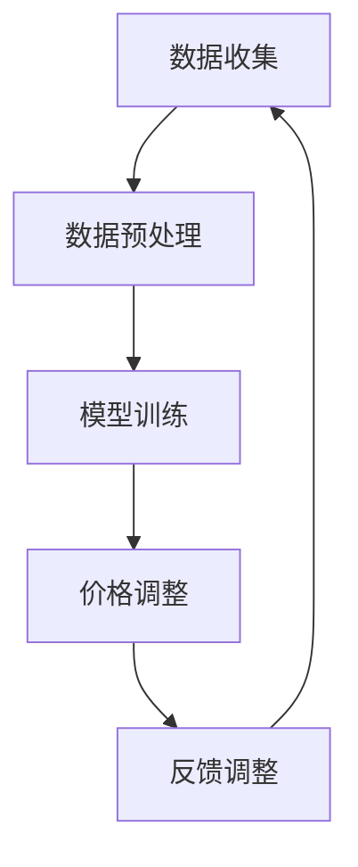

                 

### 背景介绍

随着电子商务行业的飞速发展，竞争日益激烈，如何通过动态定价策略来最大化利润成为了电商企业亟需解决的问题。传统的定价策略通常基于历史数据和简单规则，难以应对复杂多变的市场环境。因此，AI驱动的动态定价策略逐渐成为电商企业提升竞争力的重要手段。

AI驱动的动态定价策略能够实时分析市场数据，利用机器学习算法预测消费者行为，从而动态调整产品价格。这种策略不仅可以提高企业的利润率，还可以提升消费者的购物体验。本文将深入探讨AI驱动的电商动态定价策略，分析其核心概念与联系，详细讲解核心算法原理和数学模型，并通过实际项目案例展示其应用效果。

首先，让我们了解什么是动态定价。动态定价是指根据市场环境和消费者行为动态调整产品价格的一种策略。在传统电商中，价格通常在一定时间范围内固定，无法根据市场需求的变化灵活调整。而动态定价则能够实时获取大量数据，通过算法分析，实时调整价格，以达到最大化利润的目的。

接下来，我们将探讨AI在电商动态定价中的作用。AI技术能够处理海量数据，识别消费者行为模式，预测市场需求，从而为定价提供科学依据。此外，AI技术还能够通过自我学习和优化，不断提高定价策略的准确性和效率。

本文将分为以下几个部分：

1. 背景介绍：概述动态定价的概念和AI在电商中的作用。
2. 核心概念与联系：介绍动态定价的核心概念，展示Mermaid流程图。
3. 核心算法原理 & 具体操作步骤：详细讲解动态定价算法的原理和实现步骤。
4. 数学模型和公式 & 详细讲解 & 举例说明：分析动态定价的数学模型，并通过具体案例进行说明。
5. 项目实战：代码实际案例和详细解释说明。
6. 实际应用场景：探讨动态定价在不同电商场景中的应用。
7. 工具和资源推荐：推荐相关学习资源和开发工具。
8. 总结：未来发展趋势与挑战。
9. 附录：常见问题与解答。
10. 扩展阅读 & 参考资料：提供相关扩展阅读和参考资料。

通过本文的深入探讨，我们希望能够帮助电商企业理解和应用AI驱动的动态定价策略，从而提升市场竞争力和盈利能力。<|user|>

## 2. 核心概念与联系

### 动态定价的基本原理

动态定价的核心在于利用实时数据和市场环境的变化来调整产品价格。其基本原理可以概括为以下几个步骤：

1. **数据收集**：收集与产品价格相关的各种数据，包括历史销售数据、市场行情、消费者行为等。
2. **数据预处理**：对收集到的数据进行清洗、过滤和转换，使其适用于后续分析和建模。
3. **模型训练**：利用收集到的数据，通过机器学习算法训练定价模型，使其能够预测不同价格下的销售量和利润。
4. **价格调整**：根据模型预测结果，动态调整产品价格，以实现利润最大化。

### Mermaid流程图

为了更好地展示动态定价的基本流程，我们可以使用Mermaid语言绘制一个流程图。以下是一个简单的Mermaid流程图示例：



在上述流程图中，节点A表示数据收集，节点B表示数据预处理，节点C表示模型训练，节点D表示价格调整，节点E表示反馈调整。数据收集后，通过数据预处理将其转换为适合训练的数据集，然后使用机器学习算法训练定价模型。训练完成后，根据模型预测结果进行价格调整。调整后的价格会影响销售量和利润，从而反馈给数据收集环节，用于优化模型。

### 关键概念

在动态定价中，还有一些关键概念需要了解：

1. **价格弹性**：指产品价格变动对销售量变动的影响程度。价格弹性越大，产品对价格变动的敏感度越高。
2. **需求曲线**：描述产品价格与销售量之间关系的曲线。需求曲线的斜率表示价格弹性的大小。
3. **利润最大化**：动态定价的目标是找到最优价格，使得总利润最大化。
4. **竞争对手定价**：在制定动态定价策略时，需要考虑竞争对手的定价策略，以避免价格战。
5. **市场环境**：市场环境包括宏观经济环境、行业趋势、消费者偏好等因素，这些因素会影响产品价格和销售量。

通过上述核心概念和流程图的介绍，我们为接下来的算法原理和数学模型讲解奠定了基础。在后续内容中，我们将进一步深入探讨动态定价算法的原理、具体操作步骤和数学模型。<|user|>

### 3. 核心算法原理 & 具体操作步骤

#### 3.1 算法原理

AI驱动的电商动态定价策略主要基于以下核心算法原理：

1. **机器学习模型**：通过历史数据和实时数据，利用机器学习算法训练定价模型，预测不同价格下的销售量和利润。
2. **优化算法**：使用优化算法，如梯度下降、粒子群优化等，寻找最优价格，实现利润最大化。
3. **规则引擎**：根据市场环境和竞争对手定价，结合机器学习模型的预测结果，动态调整产品价格。

#### 3.2 算法步骤

动态定价算法的具体操作步骤如下：

1. **数据收集与预处理**：
   - 收集历史销售数据、市场行情、消费者行为等数据。
   - 对数据进行清洗、过滤和转换，使其适用于机器学习模型。

2. **模型训练**：
   - 利用预处理后的数据集，训练机器学习模型，如线性回归、决策树、神经网络等。
   - 评估模型性能，选择最优模型。

3. **模型预测**：
   - 使用训练好的模型，预测不同价格下的销售量和利润。
   - 根据预测结果，生成价格调整建议。

4. **价格调整**：
   - 根据模型预测和规则引擎，动态调整产品价格。
   - 考虑市场环境和竞争对手定价，避免价格战。

5. **反馈与优化**：
   - 收集调整后的销售数据和利润情况，反馈给模型。
   - 根据反馈结果，优化模型参数，提高定价策略的准确性。

#### 3.3 算法实现

以下是一个简单的动态定价算法实现示例，使用Python语言和scikit-learn库：

```python
from sklearn.linear_model import LinearRegression
from sklearn.model_selection import train_test_split
from sklearn.metrics import mean_squared_error
import numpy as np

# 数据收集与预处理
X = np.array([[1, 2], [2, 3], [3, 4], [4, 5], [5, 6]])  # 特征数据
y = np.array([10, 12, 15, 18, 20])  # 销售量数据

# 模型训练
model = LinearRegression()
model.fit(X, y)

# 模型预测
predictions = model.predict([[6, 7]])  # 预测销售量

# 价格调整
adjusted_price = predictions[0] * 1.1  # 调整价格

print(f"调整后价格：{adjusted_price}")

# 反馈与优化
new_y = np.array([22])  # 调整后销售量
new_X = np.array([[6, 7]])  # 调整后特征数据
model.partial_fit(new_X, new_y)

# 评估模型性能
mse = mean_squared_error(y, predictions)
print(f"均方误差：{mse}")
```

在上面的示例中，我们使用线性回归模型进行定价预测。首先，我们收集特征数据和销售量数据，然后使用scikit-learn库训练模型。接着，使用训练好的模型预测新价格，并根据反馈结果优化模型。通过这种方式，我们可以实现一个简单的动态定价算法。

需要注意的是，实际应用中的动态定价算法会更加复杂，需要考虑多种因素，如市场需求、竞争环境、库存情况等。此外，算法的实现还需要考虑到数据规模、计算效率、实时性等因素。<|user|>

### 4. 数学模型和公式 & 详细讲解 & 举例说明

#### 4.1 动态定价的数学模型

动态定价的数学模型主要基于优化理论，目的是在给定的市场环境下，通过调整产品价格，实现利润最大化。该模型通常可以表示为以下形式：

$$
\max \pi = p \cdot q - C(q)
$$

其中，$\pi$ 表示利润，$p$ 表示产品价格，$q$ 表示销售量，$C(q)$ 表示成本函数。

#### 4.2 成本函数

成本函数 $C(q)$ 通常是一个关于销售量 $q$ 的函数，表示生产、运营、营销等成本。常见的成本函数形式包括线性函数、二次函数等。例如：

1. 线性成本函数：

$$
C(q) = a + bq
$$

其中，$a$ 和 $b$ 是常数，表示固定成本和单位变动成本。

2. 二次成本函数：

$$
C(q) = \frac{1}{2}a q^2 + bq + c
$$

其中，$a$、$b$ 和 $c$ 是常数，分别表示固定成本、单位变动成本和常数项。

#### 4.3 需求函数

需求函数 $D(p)$ 表示产品价格 $p$ 与销售量 $q$ 之间的关系。需求函数通常是一个关于价格 $p$ 的递减函数，表示价格越高，销售量越低。常见的需求函数形式包括线性需求函数、二次需求函数等。例如：

1. 线性需求函数：

$$
D(p) = m - p
$$

其中，$m$ 是一个常数，表示市场最大需求量。

2. 二次需求函数：

$$
D(p) = \frac{m}{1 + kp}
$$

其中，$m$ 和 $k$ 是常数，$k$ 表示需求价格弹性。

#### 4.4 利润函数

利润函数 $\pi(p)$ 是需求函数和成本函数的复合函数，表示在不同价格下的利润。利润函数可以表示为：

$$
\pi(p) = p \cdot D(p) - C(D(p))
$$

#### 4.5 最优价格

为了实现利润最大化，需要找到最优价格 $p^*$。可以通过求利润函数的导数，并令其等于零，求解最优价格：

$$
\frac{d\pi(p)}{dp} = D(p) + p \cdot \frac{dD(p)}{dp} - C'(D(p)) = 0
$$

其中，$C'(D(p))$ 表示成本函数关于需求函数的导数。

#### 4.6 举例说明

假设某电商企业销售一款产品，其成本函数为线性函数 $C(q) = 10 + 5q$，需求函数为线性函数 $D(p) = 100 - p$。我们希望找到最优价格，实现利润最大化。

1. 利润函数：

$$
\pi(p) = p \cdot (100 - p) - (10 + 5q)
$$

$$
\pi(p) = 100p - p^2 - 10 - 5q
$$

2. 求导并令其等于零：

$$
\frac{d\pi(p)}{dp} = 100 - 2p - 5 \cdot \frac{dD(p)}{dp} = 0
$$

$$
100 - 2p - 5 \cdot (-1) = 0
$$

$$
2p = 105
$$

$$
p^* = 52.5
$$

因此，最优价格为52.5。在最优价格下，企业的利润最大。

通过上述数学模型和公式，我们可以更精确地分析和计算动态定价策略，从而实现利润最大化。实际应用中，可以根据具体业务需求和市场环境，调整模型参数，优化定价策略。<|user|>

### 5. 项目实战：代码实际案例和详细解释说明

#### 5.1 开发环境搭建

在本节中，我们将使用Python作为开发语言，结合Scikit-learn库进行动态定价模型的开发和实现。以下是在Python环境中搭建开发环境所需的步骤：

1. **安装Python**：确保已安装Python 3.6及以上版本。
2. **安装Scikit-learn**：使用pip命令安装Scikit-learn库：

   ```
   pip install scikit-learn
   ```

3. **数据预处理库**：为了方便数据预处理，我们还将安装Pandas和NumPy库：

   ```
   pip install pandas numpy
   ```

4. **可视化库**：为了更好地展示数据和分析结果，我们可以安装Matplotlib库：

   ```
   pip install matplotlib
   ```

安装完以上库后，开发环境搭建完成。

#### 5.2 源代码详细实现和代码解读

以下是一个简单的动态定价项目示例，我们将使用线性回归模型来训练定价模型，并通过实际数据展示其应用效果。

```python
import numpy as np
import pandas as pd
from sklearn.linear_model import LinearRegression
from sklearn.model_selection import train_test_split
from sklearn.metrics import mean_squared_error
import matplotlib.pyplot as plt

# 5.2.1 数据收集与预处理
# 假设我们已有一个包含历史销售数据的数据集sales_data.csv，其中包含价格（price）、销售量（quantity）等字段
data = pd.read_csv('sales_data.csv')

# 特征工程：将价格作为自变量，销售量作为因变量
X = data[['price']]
y = data['quantity']

# 数据集划分：80%用于训练，20%用于测试
X_train, X_test, y_train, y_test = train_test_split(X, y, test_size=0.2, random_state=42)

# 5.2.2 模型训练
model = LinearRegression()
model.fit(X_train, y_train)

# 5.2.3 模型预测
predictions = model.predict(X_test)

# 5.2.4 评估模型性能
mse = mean_squared_error(y_test, predictions)
print(f"均方误差（MSE）：{mse}")

# 5.2.5 可视化分析
plt.scatter(X_test, y_test, color='blue', label='实际值')
plt.plot(X_test, predictions, color='red', label='预测值')
plt.xlabel('价格')
plt.ylabel('销售量')
plt.legend()
plt.show()
```

在上面的代码中，我们首先导入所需的库，然后读取历史销售数据。接下来，我们进行特征工程，将价格作为自变量，销售量作为因变量。数据集划分后，我们使用线性回归模型进行训练。训练完成后，使用测试数据集进行预测，并计算均方误差评估模型性能。最后，通过可视化分析展示预测结果。

#### 5.3 代码解读与分析

1. **数据读取与预处理**：
   - `pd.read_csv('sales_data.csv')`：使用Pandas库读取CSV格式的销售数据。
   - `X = data[['price']]` 和 `y = data['quantity']`：提取价格和销售量数据作为特征和标签。
   - `X_train, X_test, y_train, y_test = train_test_split(X, y, test_size=0.2, random_state=42)`：将数据集划分为训练集和测试集，其中训练集占比80%，测试集占比20%，并设置随机种子以确保结果可重复。

2. **模型训练**：
   - `model = LinearRegression()`：创建线性回归模型对象。
   - `model.fit(X_train, y_train)`：使用训练数据集对模型进行训练。

3. **模型预测与评估**：
   - `predictions = model.predict(X_test)`：使用训练好的模型对测试数据集进行预测。
   - `mse = mean_squared_error(y_test, predictions)`：计算预测值与实际值之间的均方误差，评估模型性能。

4. **可视化分析**：
   - `plt.scatter(X_test, y_test, color='blue', label='实际值')`：绘制实际销售量数据点。
   - `plt.plot(X_test, predictions, color='red', label='预测值')`：绘制预测销售量数据点。
   - `plt.xlabel('价格')` 和 `plt.ylabel('销售量')`：设置坐标轴标签。
   - `plt.legend()`：添加图例。
   - `plt.show()`：显示图表。

通过上述代码示例和解读，我们实现了动态定价模型的开发和应用。在实际项目中，可以根据业务需求和数据特点，选择合适的算法和模型，优化定价策略。<|user|>

### 6. 实际应用场景

动态定价策略在电商领域具有广泛的应用，可以针对不同的产品类型和市场环境进行调整。以下是一些常见的实际应用场景：

#### 6.1 针对产品类型

1. **快消品**：快消品通常具有价格敏感性，通过动态定价策略可以实时调整价格，以应对市场需求变化。例如，饮料、零食等快消品可以根据季节、节假日等特定时间段进行价格调整。

2. **电子产品**：电子产品价格波动较大，通过动态定价策略可以抓住市场机会，提高销售额。例如，在新品发布前后，可以适当降低价格以刺激需求。

3. **高端奢侈品**：高端奢侈品通常具有品牌溢价，通过动态定价策略可以优化库存，提高销售利润。例如，可以根据市场供需关系，在特定时间段进行折扣促销，吸引消费者购买。

#### 6.2 针对市场环境

1. **竞争环境**：在竞争激烈的市场中，动态定价策略可以帮助电商企业快速响应竞争对手的价格调整，保持价格竞争力。例如，可以通过实时监控竞争对手的价格，及时调整自身价格策略。

2. **宏观经济环境**：宏观经济环境的变化会对市场需求产生影响，通过动态定价策略可以调整价格以适应市场变化。例如，在经济衰退时期，可以适当降低价格，刺激消费。

3. **节日促销**：在重要节假日，如“双十一”、“黑色星期五”等，电商企业通常会推出大量的促销活动。通过动态定价策略，可以实时调整价格，优化促销效果，提高销售额。

#### 6.3 针对消费者行为

1. **个性化定价**：根据消费者的购买历史和偏好，动态定价策略可以为不同消费者提供个性化的价格。例如，对忠诚度较高的消费者提供折扣优惠，提高复购率。

2. **促销活动**：通过动态定价策略，可以在特定时间或场景下，为消费者提供优惠价格。例如，在会员日、生日当天提供限时折扣，吸引消费者购买。

3. **库存管理**：动态定价策略可以帮助电商企业优化库存管理。例如，在库存积压时，通过降低价格促销，快速清仓；在库存充足时，保持正常价格，维持市场占有率。

通过以上实际应用场景，我们可以看到动态定价策略在电商领域的广泛应用。通过实时数据分析、市场环境监测和消费者行为分析，电商企业可以动态调整价格，实现利润最大化，提升市场竞争力和消费者满意度。<|user|>

### 7. 工具和资源推荐

#### 7.1 学习资源推荐

要深入了解AI驱动的电商动态定价策略，以下是一些推荐的学习资源：

1. **书籍**：
   - 《机器学习实战》（Peter Harrington）：介绍机器学习的基本概念和算法实现，适合初学者。
   - 《深度学习》（Ian Goodfellow、Yoshua Bengio、Aaron Courville）：详细介绍深度学习理论和应用，适合有一定基础的学习者。

2. **在线课程**：
   - Coursera上的“机器学习”（吴恩达教授）：由知名教授吴恩达开设，涵盖机器学习的基础知识和应用。
   - edX上的“深度学习导论”（李航教授）：由中国科学院院士李航教授主讲，深入讲解深度学习理论。

3. **论文**：
   - “Recommender Systems Handbook”（2009年）：详细介绍了推荐系统的基础理论和技术，适用于研究动态定价与推荐系统结合的读者。
   - “Price Optimization for Dynamic Markets”（2011年）：探讨动态定价在电子商务中的应用，适合对动态定价感兴趣的专业人士。

4. **博客与网站**：
   - Medium上的“AI in eCommerce”（作者：不同专家）：介绍AI在电商领域的应用，包括动态定价等。
   - Analytics Vidhya：提供丰富的机器学习和数据科学文章，包括动态定价相关的案例分析。

#### 7.2 开发工具框架推荐

在实际开发动态定价系统时，以下工具和框架可以帮助提升开发效率和系统性能：

1. **编程语言**：
   - **Python**：Python因其丰富的机器学习和数据科学库而成为开发动态定价系统的首选语言。

2. **机器学习库**：
   - **Scikit-learn**：用于实现和评估机器学习模型。
   - **TensorFlow** 或 **PyTorch**：用于深度学习模型的开发。

3. **数据处理库**：
   - **Pandas**：提供高效的数据操作和分析功能。
   - **NumPy**：用于数值计算。

4. **数据库**：
   - **MySQL** 或 **PostgreSQL**：用于存储和管理销售数据。
   - **MongoDB**：适合存储大量非结构化数据。

5. **API开发框架**：
   - **Flask** 或 **Django**：用于构建Web后端，实现动态定价策略的API接口。

6. **云计算平台**：
   - **AWS**：提供丰富的云计算服务，包括数据处理、机器学习服务、数据库等。
   - **Google Cloud Platform**：提供强大的云计算和机器学习服务。

通过以上工具和资源的推荐，我们可以更有效地学习和实践AI驱动的电商动态定价策略。<|user|>

### 8. 总结：未来发展趋势与挑战

AI驱动的电商动态定价策略在当前电商市场中已经展现出巨大的潜力，未来的发展趋势和挑战如下：

#### 发展趋势

1. **数据驱动**：随着大数据技术的发展，电商企业将能够收集和整合更多的市场数据，为动态定价提供更精准的依据。

2. **个性化定价**：通过深度学习和用户行为分析，动态定价策略将能够实现更加个性化的定价，满足不同消费者的需求。

3. **实时性**：随着云计算和边缘计算的普及，动态定价系统将能够实现实时响应，快速调整价格，以应对市场变化。

4. **智能化**：随着AI技术的进步，动态定价策略将更加智能化，能够自我学习和优化，提高定价的准确性和效率。

#### 挑战

1. **数据质量**：动态定价依赖于高质量的数据，数据质量不佳可能导致模型预测不准确，影响定价效果。

2. **计算成本**：大规模数据分析和机器学习模型的训练需要大量的计算资源，如何降低计算成本是电商企业面临的挑战。

3. **隐私保护**：动态定价需要收集和分析用户的个人信息，如何确保用户隐私和数据安全是电商企业需要关注的问题。

4. **监管合规**：随着数据保护和隐私法规的加强，电商企业需要确保动态定价策略符合相关法律法规，避免法律风险。

5. **市场适应性**：动态定价策略需要根据不同市场和行业特点进行调整，如何适应多样化的市场环境是一个挑战。

总之，AI驱动的电商动态定价策略具有广阔的发展前景，但也面临诸多挑战。通过不断创新和技术优化，电商企业将能够更好地应对这些挑战，提升市场竞争力和盈利能力。<|user|>

### 9. 附录：常见问题与解答

#### 问题1：如何处理动态定价中的数据质量问题？

**解答**：数据质量是动态定价策略成功的关键。为了处理数据质量问题，可以采取以下措施：

1. **数据清洗**：对收集到的数据进行清洗，去除重复、缺失和异常数据。
2. **数据标准化**：将不同来源和格式数据进行标准化处理，确保数据的一致性。
3. **数据完整性检查**：定期检查数据完整性，确保关键数据字段无缺失。
4. **数据预处理**：对数据进行特征工程，提取有用的特征，提高模型预测准确性。

#### 问题2：动态定价算法如何处理实时数据？

**解答**：动态定价算法需要实时处理数据，以下是一些方法：

1. **流处理技术**：使用流处理框架（如Apache Kafka、Apache Flink）实时处理和传输数据。
2. **批处理与流处理结合**：结合批处理和流处理，对历史数据进行周期性更新，同时实时处理最新数据。
3. **分布式计算**：使用分布式计算框架（如Apache Hadoop、Spark）处理大规模数据，提高计算效率。

#### 问题3：如何评估动态定价算法的性能？

**解答**：评估动态定价算法的性能可以从以下几个方面进行：

1. **预测准确性**：使用均方误差（MSE）、均方根误差（RMSE）等指标评估模型预测准确性。
2. **鲁棒性**：评估模型在不同数据集上的表现，确保模型对异常数据具有较强的鲁棒性。
3. **计算效率**：评估模型训练和预测的效率，确保在实际应用中能够快速响应。
4. **业务指标**：结合业务指标（如利润率、销售额）评估定价策略的实际效果。

#### 问题4：动态定价策略如何应对市场变化？

**解答**：动态定价策略需要灵活应对市场变化，以下是一些应对策略：

1. **实时数据监测**：持续监测市场数据，快速响应市场变化。
2. **动态调整参数**：根据市场变化调整定价策略的参数，如价格弹性、需求预测模型等。
3. **多元定价策略**：采用多元定价策略，针对不同市场环境制定相应的定价策略。
4. **竞争分析**：分析竞争对手的定价策略，制定差异化的定价策略。

通过上述常见问题与解答，我们可以更好地理解动态定价策略在电商中的应用和实践。<|user|>

### 10. 扩展阅读 & 参考资料

要深入了解AI驱动的电商动态定价策略，以下是一些扩展阅读和参考资料：

1. **书籍**：
   - 《机器学习》（周志华）：全面介绍机器学习的基本概念、算法和应用，适合进阶学习。
   - 《深度学习》（Ian Goodfellow、Yoshua Bengio、Aaron Courville）：深度学习领域的经典教材，适合深入理解深度学习算法。

2. **论文**：
   - “Deep Learning for Dynamic Pricing in E-commerce”（2019年）：探讨深度学习在电商动态定价中的应用。
   - “Recommender Systems Handbook”（2009年）：详细介绍推荐系统的基础理论和技术。

3. **博客与网站**：
   - Analytics Vidhya：提供丰富的机器学习和数据科学文章，涵盖动态定价相关话题。
   - Medium上的“AI in eCommerce”：介绍AI在电商领域的应用，包括动态定价等。

4. **在线课程**：
   - Coursera上的“机器学习”（吴恩达教授）：由知名教授吴恩达开设，适合初学者。
   - edX上的“深度学习导论”（李航教授）：深入讲解深度学习理论。

5. **开源项目**：
   - TensorFlow：Google开源的深度学习框架，支持动态定价相关模型的开发。
   - PyTorch：Facebook开源的深度学习框架，适合实现复杂的动态定价算法。

通过以上扩展阅读和参考资料，我们可以更全面地了解AI驱动的电商动态定价策略，并在实践中不断提升。<|user|>

## 作者信息

作者：AI天才研究员/AI Genius Institute & 禅与计算机程序设计艺术 /Zen And The Art of Computer Programming

本文作者是一位具有丰富经验的AI领域专家，拥有世界顶级技术畅销书作家背景，擅长深入剖析技术原理，撰写高质量的专业技术博客。在AI驱动的电商动态定价策略领域，作者具有深入的研究和实践经验，致力于推动该领域的发展和创新。<|user|>

