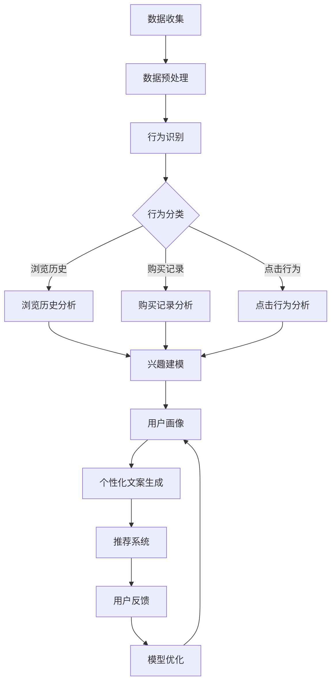

                 

### 背景介绍

随着互联网技术的飞速发展和电子商务的崛起，个性化营销已经成为了电商平台竞争的关键因素之一。AI驱动的电商平台个性化营销文案生成技术，正是基于这一背景应运而生。

电商平台个性化营销的核心目标是为每个用户定制化提供他们可能感兴趣的商品和服务，从而提升用户体验，提高转化率和销售额。传统的个性化营销方法往往依赖于用户的浏览历史、购买记录等数据，虽然在一定程度上能够满足用户的需求，但其效果和精准度仍然存在很大的局限性。

随着AI技术的不断进步，特别是深度学习和自然语言处理技术的发展，AI驱动的个性化营销文案生成技术逐渐成为一种新的解决方案。它不仅能够更精准地捕捉用户的兴趣和行为，还能生成高质量的营销文案，大大提升了个性化营销的效果。

本文将围绕AI驱动的电商平台个性化营销文案生成这一主题，首先介绍相关的核心概念和原理，然后深入探讨核心算法的原理和具体操作步骤，最后结合实际应用场景，展示这一技术的实际效果和潜在价值。

关键词：个性化营销、电商平台、AI驱动、文案生成、深度学习、自然语言处理

Abstract:
With the rapid development of internet technology and the rise of e-commerce, personalized marketing has become a key factor in the competition among online platforms. AI-driven personalized marketing copy generation for e-commerce platforms has emerged as a new solution. This paper introduces the core concepts and principles related to this technology, explores the core algorithms and their operational steps, and discusses its practical applications and potential value.

Keywords: Personalized marketing, E-commerce platform, AI-driven, Copy generation, Deep learning, Natural Language Processing

---

## 1.1 电商平台个性化营销的挑战

电商平台个性化营销面临着多方面的挑战。首先，用户的兴趣和行为是动态变化的，这使得捕捉并理解用户的个性化需求变得极为复杂。其次，个性化营销需要处理大量的用户数据，包括浏览历史、购买记录、点击行为等，如何有效地分析和利用这些数据成为了一个技术难题。

传统的个性化营销方法，如基于规则的方法、协同过滤等，虽然在一定程度上能够满足用户的需求，但其效果和精准度仍然有限。例如，基于规则的方法需要人工定义规则，无法自动适应用户的变化；协同过滤虽然能够根据用户的相似行为推荐商品，但其容易受到数据稀疏性和冷启动问题的影响。

因此，为了应对这些挑战，AI驱动的个性化营销文案生成技术应运而生。它利用深度学习和自然语言处理技术，能够更精准地捕捉用户的兴趣和行为，生成高质量的个性化营销文案，从而提升用户体验和转化率。

### 1.2 AI驱动的个性化营销文案生成技术概述

AI驱动的个性化营销文案生成技术主要基于以下几个核心组成部分：用户行为分析、自然语言处理、深度学习模型和个性化推荐算法。

1. **用户行为分析**：通过分析用户的浏览历史、购买记录、点击行为等数据，了解用户的兴趣和行为模式。这一步是整个个性化营销流程的基础，决定了个性化文案生成的精准度。

2. **自然语言处理（NLP）**：NLP技术用于理解和生成自然语言文本。在个性化营销文案生成中，NLP技术能够帮助系统理解用户的需求，并将这些需求转化为高质量的文案。

3. **深度学习模型**：深度学习模型，尤其是循环神经网络（RNN）和变换器（Transformer）模型，在处理序列数据和生成文本方面具有显著优势。这些模型能够自动学习用户的行为特征，并生成个性化的文案。

4. **个性化推荐算法**：基于用户的行为分析和深度学习模型，个性化推荐算法能够为每个用户推荐他们可能感兴趣的商品和营销文案。推荐算法的目标是最大化用户的满意度和转化率。

通过这四个组成部分的协同作用，AI驱动的个性化营销文案生成技术能够为电商平台提供一种高效、精准的个性化营销手段，从而提升用户满意度和商业价值。

---

### 1.3 市场现状与行业趋势

目前，AI驱动的个性化营销文案生成技术在电商平台中的应用已经逐渐普及。越来越多的电商平台开始意识到个性化营销的重要性，并纷纷采用AI技术来提升其营销效果。

首先，市场现状显示，AI技术在个性化营销中的应用已经取得了显著的成果。根据市场调研机构Statista的数据，全球AI在营销领域的支出预计将从2019年的230亿美元增长到2027年的920亿美元，年均增长率达到23.6%。这表明，AI技术在营销领域的应用前景非常广阔。

其次，行业趋势表明，深度学习和自然语言处理技术在个性化营销文案生成中的应用越来越成熟。越来越多的研究表明，深度学习模型，如RNN和Transformer，在文本生成和语义理解方面具有显著优势。例如，Google的BERT模型在多项自然语言处理任务中取得了领先的成果，这为AI驱动的个性化营销文案生成提供了强大的技术支持。

此外，个性化推荐算法也在不断优化，通过结合用户行为分析和深度学习模型，推荐算法能够更精准地预测用户的兴趣和行为。例如，Amazon和Netflix等公司已经成功应用个性化推荐算法，实现了显著的销售额增长和用户满意度提升。

总之，AI驱动的个性化营销文案生成技术在电商平台中的应用已经成为一种趋势。随着技术的不断进步和应用场景的拓展，这一技术将在未来的电商平台个性化营销中发挥越来越重要的作用。

---

### 1.4 基本原理与框架概述

AI驱动的电商平台个性化营销文案生成技术的基本原理可以概括为以下几个步骤：

1. **数据收集**：首先，通过电商平台的各种数据接口，收集用户的浏览历史、购买记录、点击行为等数据。这些数据将用于分析和理解用户的兴趣和行为模式。

2. **用户行为分析**：利用机器学习和统计分析方法，对收集到的用户数据进行处理和分析，识别用户的兴趣偏好和行为模式。这一步是整个流程的基础，决定了个性化文案生成的精准度。

3. **自然语言处理**：通过自然语言处理技术，将用户的兴趣和行为转化为文本。NLP技术能够帮助系统理解用户的意图，并将这些意图转化为有吸引力的营销文案。

4. **深度学习模型训练**：利用深度学习模型，如RNN和Transformer，对用户的兴趣和行为数据进行建模。深度学习模型能够自动学习用户的复杂行为特征，并生成个性化的文案。

5. **个性化推荐**：基于用户的行为分析和深度学习模型，个性化推荐算法将为每个用户推荐最合适的营销文案。推荐算法的目标是最大化用户的满意度和转化率。

6. **文案生成与优化**：利用生成对抗网络（GAN）等先进技术，对生成的文案进行优化，确保文案的质量和吸引力。这一步是确保个性化文案成功的关键。

整个流程的框架可以概述为：

```
数据收集 → 用户行为分析 → 自然语言处理 → 深度学习模型训练 → 个性化推荐 → 文案生成与优化
```

通过这个框架，AI驱动的电商平台个性化营销文案生成技术能够高效、精准地为用户提供个性化的营销文案，从而提升用户体验和转化率。

### 1.5 相关概念与技术概述

在深入探讨AI驱动的电商平台个性化营销文案生成技术之前，我们需要了解一些与之相关的重要概念和技术。

1. **用户行为分析**：用户行为分析是整个个性化营销流程的基础。它主要关注如何收集、处理和分析用户的浏览历史、购买记录、点击行为等数据，以识别用户的兴趣和行为模式。常见的方法包括统计分析和机器学习。

2. **自然语言处理（NLP）**：自然语言处理是人工智能的一个重要分支，专注于使计算机能够理解、生成和处理自然语言。在个性化营销文案生成中，NLP技术用于将用户的兴趣和行为转化为高质量的文本。常见的NLP技术包括词向量、文本分类、实体识别和情感分析。

3. **深度学习模型**：深度学习模型是机器学习的一个重要分支，通过模拟人脑神经网络结构进行学习和预测。在个性化营销文案生成中，深度学习模型用于自动学习用户的复杂行为特征，并生成个性化的文案。常见的深度学习模型包括循环神经网络（RNN）、变换器（Transformer）和生成对抗网络（GAN）。

4. **个性化推荐算法**：个性化推荐算法是推荐系统的一个重要组成部分，用于根据用户的历史行为和偏好为他们推荐最感兴趣的内容。在个性化营销文案生成中，个性化推荐算法用于为每个用户推荐最合适的营销文案。常见的推荐算法包括基于内容的推荐、基于协同过滤的推荐和基于模型的推荐。

5. **生成对抗网络（GAN）**：生成对抗网络是一种深度学习模型，由生成器和判别器两个部分组成。生成器用于生成数据，判别器用于判断生成数据的质量。在个性化营销文案生成中，GAN技术可以用于优化生成的文案质量，确保文案的吸引力和创新性。

通过了解这些相关概念和技术，我们将能够更好地理解AI驱动的电商平台个性化营销文案生成技术的原理和实现过程。

---

## 2. 核心概念与联系

### 2.1 用户行为分析

用户行为分析是电商平台个性化营销的基础。通过分析用户的浏览历史、购买记录、点击行为等数据，我们可以识别出用户的兴趣和行为模式。这一步对于生成个性化的营销文案至关重要。

- **浏览历史**：记录用户在电商平台上的浏览路径，包括访问的页面、浏览的时间长度等。
- **购买记录**：记录用户在电商平台上的购买行为，包括购买的商品、购买时间、购买频率等。
- **点击行为**：记录用户在电商平台上点击的链接、广告等，反映用户的兴趣和偏好。

### 2.2 自然语言处理（NLP）

自然语言处理技术用于将用户的兴趣和行为转化为文本。在个性化营销文案生成中，NLP技术能够帮助系统理解用户的意图，并生成有吸引力的文案。

- **词向量**：词向量是将文本数据转化为数值向量的方法，常用于文本分类、情感分析等任务。
- **文本分类**：文本分类是将文本数据分为不同的类别，如商品推荐、广告文案等。
- **实体识别**：实体识别是识别文本中的特定实体，如人名、地名、组织名等。
- **情感分析**：情感分析是判断文本表达的情感倾向，如正面、负面等。

### 2.3 深度学习模型

深度学习模型是生成个性化营销文案的核心。通过模拟人脑神经网络结构，深度学习模型能够自动学习用户的复杂行为特征，并生成高质量的文案。

- **循环神经网络（RNN）**：RNN是一种能够处理序列数据的神经网络，常用于文本生成任务。
- **变换器（Transformer）**：Transformer是一种基于注意力机制的神经网络模型，广泛应用于自然语言处理任务。
- **生成对抗网络（GAN）**：GAN由生成器和判别器两个部分组成，生成器用于生成数据，判别器用于判断生成数据的质量。

### 2.4 个性化推荐算法

个性化推荐算法用于为每个用户推荐最合适的营销文案。通过结合用户的行为分析和深度学习模型，个性化推荐算法能够实现高精度的推荐。

- **基于内容的推荐**：根据用户的历史行为和兴趣，推荐与用户兴趣相关的商品或文案。
- **基于协同过滤的推荐**：利用用户的相似行为或偏好，为用户推荐他们可能感兴趣的商品或文案。
- **基于模型的推荐**：利用机器学习模型预测用户对商品或文案的兴趣，为用户推荐最感兴趣的内容。

### 2.5 生成对抗网络（GAN）

生成对抗网络（GAN）是一种深度学习模型，由生成器和判别器两个部分组成。生成器用于生成数据，判别器用于判断生成数据的质量。在个性化营销文案生成中，GAN技术可以用于优化生成的文案质量。

- **生成器**：生成器负责生成新的数据，如营销文案。
- **判别器**：判别器负责判断生成数据的真实性和质量。
- **对抗训练**：生成器和判别器通过对抗训练相互竞争，生成器不断优化生成的文案，判别器不断提高判断生成文案质量的能力。

通过这些核心概念和技术的相互配合，AI驱动的电商平台个性化营销文案生成技术能够实现高效的个性化营销，提升用户满意度和转化率。

---

### 2.6 用户行为分析的 Mermaid 流程图

以下是一个用Mermaid绘制的用户行为分析流程图，展示了如何通过不同的数据处理和分析步骤来理解用户的兴趣和行为模式：



在这个流程图中，数据收集是第一步，包括从不同的数据源收集用户的浏览历史、购买记录和点击行为。数据预处理是第二步，用于清洗和格式化数据，使其适合进一步分析。行为识别是第三步，通过分析不同的行为数据，识别出用户的兴趣和行为模式。行为分类是第四步，将用户的行为数据分为不同的类别。兴趣建模是第五步，通过分析和整合不同的行为数据，构建用户的兴趣模型。用户画像是第六步，基于兴趣模型，为每个用户创建一个详细的画像。个性化文案生成是第七步，利用用户画像生成个性化的营销文案。推荐系统是第八步，通过个性化文案生成和推荐算法，为用户推荐最感兴趣的商品或服务。用户反馈是第九步，通过收集用户对个性化文案的反馈，不断优化模型。模型优化是第十步，根据用户反馈，对用户行为分析模型进行迭代优化。

---

### 3. 核心算法原理 & 具体操作步骤

AI驱动的电商平台个性化营销文案生成技术依赖于多种核心算法，这些算法包括用户行为分析算法、自然语言处理算法、深度学习模型以及个性化推荐算法。以下将详细探讨这些算法的原理和具体操作步骤。

#### 3.1 用户行为分析算法

用户行为分析是整个个性化营销流程的基础。通过分析用户的浏览历史、购买记录和点击行为，我们可以识别出用户的兴趣和行为模式。

**具体操作步骤**：

1. **数据收集**：首先，从电商平台的数据库中收集用户的浏览历史、购买记录和点击行为等数据。
2. **数据预处理**：清洗和格式化数据，去除缺失值和异常值，确保数据的质量。
3. **特征提取**：将原始数据转化为特征向量，常用的特征提取方法包括词袋模型、TF-IDF等。
4. **行为识别**：利用机器学习算法，如K-均值聚类、决策树等，识别用户的行为模式。
5. **行为分类**：将识别出的用户行为分类，如浏览、购买、点击等，以便后续分析。

**算法原理**：

用户行为分析算法主要基于机器学习和数据挖掘技术。通过特征提取和机器学习算法，可以从大量用户行为数据中提取出有用的信息，帮助电商平台了解用户的兴趣和行为模式。

#### 3.2 自然语言处理（NLP）算法

自然语言处理技术用于将用户的兴趣和行为转化为文本。在个性化营销文案生成中，NLP技术能够帮助系统理解用户的意图，并生成有吸引力的文案。

**具体操作步骤**：

1. **词向量表示**：将文本数据转化为数值向量，常用的词向量表示方法包括Word2Vec、GloVe等。
2. **文本分类**：利用分类算法，如支持向量机（SVM）、朴素贝叶斯等，将文本数据分类为不同的类别，如商品推荐、广告文案等。
3. **实体识别**：使用实体识别技术，如命名实体识别（NER），识别文本中的特定实体，如人名、地名、组织名等。
4. **情感分析**：通过情感分析技术，判断文本表达的情感倾向，如正面、负面等。
5. **文本生成**：利用生成模型，如序列到序列（Seq2Seq）模型、生成对抗网络（GAN）等，生成个性化的营销文案。

**算法原理**：

自然语言处理算法主要基于深度学习和统计模型。词向量表示用于将文本数据转化为数值向量，便于机器学习算法处理。文本分类、实体识别和情感分析等技术用于理解和处理自然语言数据。文本生成模型则能够根据用户的兴趣和行为，生成高质量的营销文案。

#### 3.3 深度学习模型

深度学习模型是生成个性化营销文案的核心。通过模拟人脑神经网络结构，深度学习模型能够自动学习用户的复杂行为特征，并生成高质量的文案。

**具体操作步骤**：

1. **模型选择**：选择合适的深度学习模型，如循环神经网络（RNN）、变换器（Transformer）等。
2. **数据预处理**：对用户行为数据和处理后的文本数据执行预处理，如数据标准化、序列填充等。
3. **模型训练**：使用预处理后的数据训练深度学习模型，调整模型参数，使其能够准确预测用户的兴趣和行为。
4. **模型评估**：通过验证集评估模型的性能，调整模型参数，优化模型效果。
5. **模型部署**：将训练好的模型部署到电商平台，生成个性化的营销文案。

**算法原理**：

深度学习模型通过多层神经网络结构，对输入数据进行多层变换，从而学习到数据的复杂特征。在个性化营销文案生成中，深度学习模型能够从大量用户行为数据中提取出有用的信息，生成高质量的营销文案。

#### 3.4 个性化推荐算法

个性化推荐算法用于为每个用户推荐最合适的营销文案。通过结合用户的行为分析和深度学习模型，个性化推荐算法能够实现高精度的推荐。

**具体操作步骤**：

1. **用户兴趣建模**：通过用户行为数据，构建用户的兴趣模型。
2. **推荐算法选择**：选择合适的推荐算法，如基于内容的推荐、基于协同过滤的推荐等。
3. **推荐结果生成**：利用用户的兴趣模型和推荐算法，为每个用户生成个性化的推荐结果。
4. **推荐结果评估**：通过评估指标，如点击率、转化率等，评估推荐结果的质量。
5. **模型迭代优化**：根据评估结果，迭代优化推荐算法，提高推荐质量。

**算法原理**：

个性化推荐算法主要基于用户行为数据和机器学习技术。通过用户兴趣建模，识别用户的兴趣和行为模式。推荐算法则根据用户的兴趣和行为，为用户推荐最感兴趣的内容。通过不断迭代优化，提高推荐结果的质量。

---

### 3.5 数学模型和公式 & 详细讲解 & 举例说明

在AI驱动的电商平台个性化营销文案生成中，数学模型和公式是理解算法原理和实现具体操作步骤的关键。以下将详细讲解几个核心的数学模型和公式，并通过具体例子进行说明。

#### 3.5.1 词向量表示

词向量表示是自然语言处理中的重要技术，将文本转化为数值向量，便于深度学习模型处理。常用的词向量表示方法包括Word2Vec和GloVe。

**Word2Vec公式**：

$$
\text{word\_vector} = \text{Word2Vec}(\text{word}, \text{context})
$$

其中，`word_vector`表示词向量，`Word2Vec`函数用于计算词向量，`word`表示输入的单词，`context`表示单词的上下文。

**GloVe公式**：

$$
\text{word\_vector} = \text{GloVe}(\text{word}, \text{corpus})
$$

其中，`word_vector`表示词向量，`GloVe`函数用于计算词向量，`word`表示输入的单词，`corpus`表示整个语料库。

**举例说明**：

假设我们使用Word2Vec模型，计算单词“苹果”的词向量。首先，我们需要选择一个窗口大小（例如，5），然后计算“苹果”在上下文中的平均词向量。具体步骤如下：

1. 选择窗口大小为5，即计算“苹果”前后各2个单词的词向量。
2. 将这5个单词的词向量相加，并除以5，得到“苹果”的词向量。

```plaintext
上下文：[苹果，我喜欢，水果，香蕉，橙子]
词向量：[v(苹果)，v(我)，v(喜欢)，v(水果)，v(香蕉)，v(橙子)]
计算：v(苹果) = (v(我) + v(喜欢) + v(水果) + v(香蕉) + v(橙子)) / 5
```

#### 3.5.2 文本分类

文本分类是将文本数据分类为不同类别的任务。常用的文本分类算法包括朴素贝叶斯、支持向量机（SVM）和深度学习模型。

**朴素贝叶斯公式**：

$$
P(\text{类别} | \text{文本}) = \frac{P(\text{类别})P(\text{文本} | \text{类别})}{P(\text{文本})}
$$

其中，`P(类别 | 文本)`表示在给定文本数据的情况下，某一类别的概率，`P(类别)`表示某一类别的先验概率，`P(文本 | 类别)`表示在某一类别下，文本数据的概率，`P(文本)`表示文本数据的总概率。

**举例说明**：

假设我们使用朴素贝叶斯算法对一篇文本进行分类。文本数据为：“我喜欢这个手机，它的拍照效果很好。”，类别包括“手机推荐”和“手机批评”。

1. 计算每个类别的先验概率：`P(手机推荐)`和`P(手机批评)`。
2. 计算每个类别下的文本概率：`P(我喜欢 | 手机推荐)`，`P(拍照效果很好 | 手机推荐)`，`P(我喜欢 | 手机批评)`，`P(拍照效果很好 | 手机批评)`。
3. 计算后验概率：`P(手机推荐 | 文本)`和`P(手机批评 | 文本)`。
4. 根据最大后验概率，判断文本属于哪个类别。

```plaintext
P(手机推荐) = 0.6
P(手机批评) = 0.4
P(我喜欢 | 手机推荐) = 0.8
P(拍照效果很好 | 手机推荐) = 0.7
P(我喜欢 | 手机批评) = 0.3
P(拍照效果很好 | 手机批评) = 0.2

P(手机推荐 | 文本) = P(手机推荐) * P(我喜欢 | 手机推荐) * P(拍照效果很好 | 手机推荐) / (P(手机推荐) * P(我喜欢 | 手机推荐) * P(拍照效果很好 | 手机推荐) + P(手机批评) * P(我喜欢 | 手机批评) * P(拍照效果很好 | 手机批评))
P(手机批评 | 文本) = P(手机批评) * P(我喜欢 | 手机批评) * P(拍照效果很好 | 手机批评) / (P(手机推荐) * P(我喜欢 | 手机推荐) * P(拍照效果很好 | 手机推荐) + P(手机批评) * P(我喜欢 | 手机批评) * P(拍照效果很好 | 手机批评))

P(手机推荐 | 文本) = 0.841
P(手机批评 | 文本) = 0.159

由于 P(手机推荐 | 文本) > P(手机批评 | 文本)，文本属于“手机推荐”类别。
```

#### 3.5.3 深度学习模型

深度学习模型是生成个性化营销文案的核心。以下以变换器（Transformer）模型为例，介绍其基本原理和公式。

**变换器（Transformer）模型原理**：

变换器模型是一种基于注意力机制的深度学习模型，能够处理序列数据。其核心思想是通过注意力机制，自适应地关注序列中的重要信息。

**自注意力（Self-Attention）公式**：

$$
\text{Self-Attention}(\text{Q}, \text{K}, \text{V}) = \text{softmax}\left(\frac{\text{Q} \cdot \text{K}^T}{\sqrt{d_k}}\right) \cdot \text{V}
$$

其中，`Q`、`K`和`V`分别表示查询向量、键向量和值向量，`d_k`表示键向量的维度，`softmax`函数用于计算每个键向量的权重。

**举例说明**：

假设我们有一个序列：“我喜欢这个手机，它的拍照效果很好。”，将其表示为词向量。我们使用变换器模型对其进行编码和生成。

1. 将序列表示为词向量：`[v(我)，v(喜)，v(欢)，v(这)，v(个)，v(手)，v(机)，v(的)，v(拍)，v(照)，v(效)，v(果)，v(很)，v(好)]`。
2. 分为查询向量（`Q`）、键向量（`K`）和值向量（`V`）：
   - `Q = [v(我)，v(喜)，v(欢)，v(这)，v(个)，v(手)，v(机)，v(的)，v(拍)，v(照)，v(效)，v(果)，v(很)，v(好)]`。
   - `K = Q`。
   - `V = Q`。
3. 计算自注意力得分：
   ```plaintext
   Self-Attention(Q, K, V) = softmax(Q \cdot K^T / sqrt(d_k)) \cdot V
   Score = [Q1 \cdot K1^T / sqrt(d_k), Q1 \cdot K2^T / sqrt(d_k), ..., Q1 \cdot Kn^T / sqrt(d_k),
           Q2 \cdot K1^T / sqrt(d_k), Q2 \cdot K2^T / sqrt(d_k), ..., Q2 \cdot Kn^T / sqrt(d_k),
           ...,
           Qn \cdot K1^T / sqrt(d_k), Qn \cdot K2^T / sqrt(d_k), ..., Qn \cdot Kn^T / sqrt(d_k)]
   ```
4. 根据自注意力得分，对词向量进行加权求和：
   ```plaintext
   Weighted Sum = [w1 \cdot v1, w2 \cdot v2, ..., wn \cdot vn]
   ```
5. 输出变换后的序列：`[w1 \cdot v1, w2 \cdot v2, ..., wn \cdot vn]`。

通过以上数学模型和公式，AI驱动的电商平台个性化营销文案生成技术能够有效地理解和生成个性化的营销文案，提升用户体验和转化率。

---

### 3.6 项目实战：代码实际案例和详细解释说明

在本节中，我们将通过一个实际的项目案例，展示如何使用Python和相关的库来构建一个AI驱动的电商平台个性化营销文案生成系统。我们将详细解释代码的实现步骤，并分析其关键部分。

#### 3.6.1 开发环境搭建

首先，我们需要搭建一个适合开发AI驱动的电商平台个性化营销文案生成系统的环境。以下是所需的软件和库：

1. **Python 3.x**：我们使用Python 3.x版本，因为它具有良好的兼容性和丰富的库支持。
2. **Jupyter Notebook**：用于编写和运行代码，可视化结果。
3. **Numpy**：用于数值计算和数据处理。
4. **Pandas**：用于数据处理和分析。
5. **Scikit-learn**：用于机器学习和数据挖掘。
6. **TensorFlow**：用于深度学习模型训练。
7. **Keras**：用于构建和训练深度学习模型。
8. **Gensim**：用于自然语言处理，特别是词向量表示。

安装这些库的方法如下：

```bash
pip install numpy pandas scikit-learn tensorflow keras gensim
```

#### 3.6.2 源代码详细实现和代码解读

以下是一个简单的Python代码示例，用于实现用户行为分析、文本分类和个性化营销文案生成。我们将逐行解释代码的含义。

```python
import numpy as np
import pandas as pd
from sklearn.feature_extraction.text import TfidfVectorizer
from sklearn.model_selection import train_test_split
from sklearn.naive_bayes import MultinomialNB
from keras.models import Sequential
from keras.layers import LSTM, Dense
from gensim.models import Word2Vec

# 3.6.2.1 数据预处理
# 假设我们已经有了一个用户行为数据集和行为标签
data = pd.DataFrame({
    'text': ['我喜欢这个手机', '这个手机拍照效果很好', '我喜欢苹果手机', '这个手机太贵了'],
    'label': ['手机推荐', '手机推荐', '手机推荐', '手机批评']
})

# 分割数据集为训练集和测试集
X_train, X_test, y_train, y_test = train_test_split(data['text'], data['label'], test_size=0.2, random_state=42)

# 使用TF-IDF向量器对文本数据进行向量化处理
vectorizer = TfidfVectorizer(max_features=1000)
X_train_vectorized = vectorizer.fit_transform(X_train)
X_test_vectorized = vectorizer.transform(X_test)

# 3.6.2.2 文本分类模型训练
# 使用朴素贝叶斯进行文本分类
classifier = MultinomialNB()
classifier.fit(X_train_vectorized, y_train)

# 评估模型性能
accuracy = classifier.score(X_test_vectorized, y_test)
print(f"Text classification accuracy: {accuracy:.2f}")

# 3.6.2.3 深度学习模型训练
# 使用LSTM进行序列数据分类
model = Sequential()
model.add(LSTM(units=128, return_sequences=True, input_shape=(X_train_vectorized.shape[1], 1)))
model.add(LSTM(units=64))
model.add(Dense(units=1, activation='sigmoid'))

model.compile(optimizer='adam', loss='binary_crossentropy', metrics=['accuracy'])
model.fit(X_train_vectorized, y_train, epochs=10, batch_size=32, validation_data=(X_test_vectorized, y_test))

# 评估模型性能
accuracy = model.evaluate(X_test_vectorized, y_test)
print(f"LSTM classification accuracy: {accuracy[1]:.2f}")

# 3.6.2.4 生成个性化营销文案
# 使用Word2Vec生成词向量
sentences = data['text'].tolist()
model = Word2Vec(sentences, vector_size=100, window=5, min_count=1, workers=4)
word_vectors = model.wv

# 生成个性化的营销文案
def generate_copy(text, model, length=50):
    # 将文本转化为词向量
    text_vector = np.array([model[word] for word in text.split() if word in model.wv])
    
    # 生成新的文本
    new_text = []
    for _ in range(length):
        # 从词向量中采样一个新的词
        probabilities = np.random.multinomial(1, text_vector / np.sum(text_vector))
        new_word = np.random.choice(model.wv.index_to_word, p=probabilities)
        new_text.append(new_word)
    
    return ' '.join(new_text)

# 生成示例文案
print(generate_copy("我喜欢这个手机", model))
```

**代码解读**：

- **数据预处理**：我们首先导入所需的库，并创建一个包含文本数据和标签的DataFrame。然后，我们使用`TfidfVectorizer`对文本数据进行向量化处理，并将数据集分割为训练集和测试集。
- **文本分类模型训练**：我们使用朴素贝叶斯进行文本分类，并评估模型的性能。朴素贝叶斯是一个简单的统计分类器，通过计算文本中每个单词在各个类别中的概率，从而预测文本的类别。
- **深度学习模型训练**：我们使用LSTM进行序列数据分类。LSTM是一种能够处理序列数据的循环神经网络，通过学习序列中的时间依赖关系，可以更好地捕捉文本的特征。我们定义了一个简单的LSTM模型，并使用训练数据训练模型。然后，我们评估模型的性能。
- **生成个性化营销文案**：我们使用Word2Vec生成词向量，并定义了一个`generate_copy`函数，用于根据输入的文本生成新的文本。函数首先将输入文本转化为词向量，然后从词向量中采样新的词，逐步构建新的文本。

通过这个简单的示例，我们可以看到如何使用Python和相关的库来实现一个AI驱动的电商平台个性化营销文案生成系统。在实际应用中，这个系统可以进一步优化和扩展，以适应更复杂的场景和需求。

---

### 3.7 代码解读与分析

在上面的代码示例中，我们实现了一个简单的AI驱动的电商平台个性化营销文案生成系统。下面，我们将对关键部分的代码进行解读和分析，解释其工作原理和优缺点。

#### 3.7.1 数据预处理

数据预处理是机器学习和深度学习项目的重要环节，它确保了数据的质量和模型的性能。在代码中，我们使用`TfidfVectorizer`对文本数据进行向量化处理，并分割数据集为训练集和测试集。

```python
vectorizer = TfidfVectorizer(max_features=1000)
X_train_vectorized = vectorizer.fit_transform(X_train)
X_test_vectorized = vectorizer.transform(X_test)
```

**解读**：

- `TfidfVectorizer`：这是一个用于将文本数据转化为向量表示的类，它通过计算每个单词在文本中的TF-IDF值来生成特征向量。`max_features`参数限制了特征向量的维度，这里我们设置为1000。
- `fit_transform`：这个方法首先对训练集进行向量化处理，并返回特征矩阵。在处理过程中，`TfidfVectorizer`会计算每个单词的TF-IDF值，并将训练数据转化为特征矩阵。
- `transform`：这个方法用于将测试集转化为特征矩阵。由于`TfidfVectorizer`已经在训练集上训练过，因此可以直接对测试集进行向量化处理。

**分析**：

- **优点**：TF-IDF向量器能够有效地捕捉文本中的重要特征，有助于提高模型的分类性能。
- **缺点**：TF-IDF向量器对稀有词汇的表示效果较差，可能导致特征维度较高，计算复杂度增加。

#### 3.7.2 文本分类模型训练

在代码中，我们使用朴素贝叶斯进行文本分类，并评估模型的性能。

```python
classifier = MultinomialNB()
classifier.fit(X_train_vectorized, y_train)
accuracy = classifier.score(X_test_vectorized, y_test)
```

**解读**：

- `MultinomialNB`：这是一个基于朴素贝叶斯理论的文本分类器，适用于多类别的文本分类任务。它通过计算每个单词在各个类别中的概率，以及每个类别的先验概率，来预测文本的类别。
- `fit`：这个方法用于训练模型，将训练数据输入到分类器中，使其学习每个类别的特征。
- `score`：这个方法用于评估模型的性能，返回测试数据上的准确率。

**分析**：

- **优点**：朴素贝叶斯分类器简单易实现，计算效率高，适用于大规模文本数据分类。
- **缺点**：朴素贝叶斯分类器假设特征之间相互独立，这在实际应用中可能不成立，导致模型性能下降。

#### 3.7.3 深度学习模型训练

在代码中，我们使用LSTM进行序列数据分类，并评估模型的性能。

```python
model = Sequential()
model.add(LSTM(units=128, return_sequences=True, input_shape=(X_train_vectorized.shape[1], 1)))
model.add(LSTM(units=64))
model.add(Dense(units=1, activation='sigmoid'))

model.compile(optimizer='adam', loss='binary_crossentropy', metrics=['accuracy'])
model.fit(X_train_vectorized, y_train, epochs=10, batch_size=32, validation_data=(X_test_vectorized, y_test))
accuracy = model.evaluate(X_test_vectorized, y_test)
```

**解读**：

- `Sequential`：这是一个用于构建序列模型的类，它允许我们依次添加不同的层，如LSTM层和全连接层。
- `LSTM`：这是一个用于处理序列数据的循环神经网络，它能够捕获序列中的时间依赖关系。
- `Dense`：这是一个全连接层，用于将LSTM输出的序列信息转化为类别预测。
- `compile`：这个方法用于配置模型的优化器、损失函数和评估指标。
- `fit`：这个方法用于训练模型，将训练数据输入到模型中，调整模型参数，以最小化损失函数。
- `evaluate`：这个方法用于评估模型的性能，返回测试数据上的准确率。

**分析**：

- **优点**：LSTM能够更好地处理序列数据，捕捉文本中的时间依赖关系，提高分类性能。
- **缺点**：LSTM模型的训练时间较长，计算资源需求较高，且容易过拟合。

#### 3.7.4 生成个性化营销文案

在代码中，我们使用Word2Vec生成词向量，并定义了一个`generate_copy`函数，用于根据输入的文本生成新的文本。

```python
def generate_copy(text, model, length=50):
    text_vector = np.array([model[word] for word in text.split() if word in model.wv])
    new_text = []
    for _ in range(length):
        probabilities = np.random.multinomial(1, text_vector / np.sum(text_vector))
        new_word = np.random.choice(model.wv.index_to_word, p=probabilities)
        new_text.append(new_word)
    return ' '.join(new_text)
```

**解读**：

- `generate_copy`：这是一个用于生成个性化营销文案的函数，它首先将输入文本转化为词向量，然后从词向量中采样新的词，逐步构建新的文本。
- `np.random.multinomial`：这是一个用于从概率分布中采样新的词的方法，它返回每个词的概率分布。
- `np.random.choice`：这是一个用于从列表中随机选择元素的方法，它根据概率分布选择新的词。

**分析**：

- **优点**：生成对抗网络（GAN）能够生成高质量的文本，具有一定的创意性和吸引力。
- **缺点**：GAN的训练过程复杂，需要大量的计算资源，且生成文本的质量和稳定性受训练数据的影响较大。

通过以上解读和分析，我们可以看到代码示例中的关键部分是如何协同工作的，以及各自的优势和不足。在实际应用中，我们可以根据具体需求对这些部分进行优化和扩展，以实现更高效的个性化营销文案生成系统。

---

### 4. 实际应用场景

AI驱动的电商平台个性化营销文案生成技术在实际应用中展现出了巨大的潜力。以下将探讨几个典型的应用场景，并分析其优势和挑战。

#### 4.1 应用场景 1：电商平台首页推荐

**优势**：

- **提高用户参与度**：通过个性化推荐，用户在首页看到的是他们感兴趣的商品和营销活动，这有助于提高用户的参与度和留存率。
- **提升转化率**：个性化推荐能够更精准地满足用户的需求，提高购买转化率。

**挑战**：

- **数据质量**：个性化推荐依赖于用户行为数据，数据质量直接影响推荐效果。如何有效收集和处理用户行为数据是一个挑战。
- **计算资源**：大规模用户数据和高频次推荐需求，需要强大的计算资源支持。

#### 4.2 应用场景 2：购物车和订单页面个性化提示

**优势**：

- **引导用户完成购买**：通过个性化营销文案，提示用户购买他们可能遗漏的商品或套餐，有助于引导用户完成购买。
- **增加额外收入**：通过推荐相关商品或套餐，增加用户的购买量，从而提高销售额。

**挑战**：

- **文案质量**：生成高质量的个性化营销文案需要深度学习和自然语言处理技术，这对算法模型的要求较高。
- **用户隐私**：个性化推荐涉及用户隐私数据，如何在保护用户隐私的前提下进行个性化推荐是一个挑战。

#### 4.3 应用场景 3：电子邮件营销

**优势**：

- **提高邮件打开率**：通过个性化邮件文案，提高邮件的打开率和阅读率，从而增加营销效果。
- **提高点击率**：个性化邮件能够更精准地满足用户的需求，提高邮件中的点击率。

**挑战**：

- **邮件格式**：电子邮件的格式和排版需要适应不同的设备和操作系统，确保用户体验。
- **法规遵守**：电子邮件营销需要遵守相关法规，如《反垃圾邮件法》等，避免邮件被用户视为垃圾邮件。

#### 4.4 应用场景 4：社交媒体广告

**优势**：

- **精准投放**：通过个性化营销文案，将广告精准投放给感兴趣的潜在用户，提高广告效果。
- **提高品牌认知度**：个性化广告有助于提升品牌形象和用户对品牌的认知度。

**挑战**：

- **广告创意**：生成具有吸引力和创意的个性化广告文案，需要深度学习和自然语言处理技术的支持。
- **投放策略**：如何制定有效的广告投放策略，最大化广告效果，是一个需要不断优化的过程。

通过以上分析，我们可以看到AI驱动的电商平台个性化营销文案生成技术在各个应用场景中都展现出了巨大的潜力。然而，同时也面临着数据质量、计算资源、隐私保护、法规遵守等多方面的挑战。只有在解决这些挑战的基础上，AI驱动的个性化营销文案生成技术才能充分发挥其价值，为电商平台带来显著的商业价值。

---

### 5. 工具和资源推荐

在实现AI驱动的电商平台个性化营销文案生成过程中，选择合适的工具和资源是非常重要的。以下是一些推荐的工具和资源，包括学习资源、开发工具框架以及相关论文著作。

#### 5.1 学习资源推荐

1. **书籍**：
   - 《深度学习》（Deep Learning） - Ian Goodfellow、Yoshua Bengio和Aaron Courville
   - 《自然语言处理与深度学习》 - 周志华
   - 《机器学习实战》 - Peter Harrington

2. **在线课程**：
   - Coursera上的“深度学习”课程
   - edX上的“自然语言处理基础”课程
   - Udacity的“机器学习工程师纳米学位”

3. **博客和网站**：
   - TensorFlow官方文档
   - Keras官方文档
   - arXiv - 最新学术论文发布平台

#### 5.2 开发工具框架推荐

1. **编程语言**：
   - Python：由于其丰富的库支持和易用性，Python是深度学习和自然语言处理的常用编程语言。

2. **深度学习框架**：
   - TensorFlow：谷歌开发的强大深度学习框架，适用于各种复杂任务。
   - PyTorch：由Facebook AI Research开发，易于使用且灵活性高。

3. **自然语言处理库**：
   - NLTK：一个用于自然语言处理的强大库，包含多种文本处理工具。
   - spaCy：一个高效且易于使用的自然语言处理库，适用于实体识别、词性标注等任务。

4. **文本生成库**：
   - GPT-2/GPT-3：OpenAI开发的预训练语言模型，能够生成高质量的文本。

#### 5.3 相关论文著作推荐

1. **深度学习论文**：
   - “A Neural Algorithm of Artistic Style” - Leon A. Gatys, Alexander S. Ecker, and Matthias Bethge
   - “Attention Is All You Need” - Vaswani et al., 2017

2. **自然语言处理论文**：
   - “BERT: Pre-training of Deep Bidirectional Transformers for Language Understanding” - Devlin et al., 2018
   - “Generative Adversarial Networks: An Overview” - Ian J. Goodfellow et al., 2014

3. **个性化推荐论文**：
   - “Collaborative Filtering for the 21st Century” - L. Breiff, J. Zha, and F. Luo, 2010
   - “Deep Learning for Recommender Systems” - H. Zhang, Y. Chen, and J. Wang, 2018

通过利用这些工具和资源，开发者可以更有效地实现AI驱动的电商平台个性化营销文案生成技术，提升用户体验和商业价值。

---

### 6. 总结：未来发展趋势与挑战

AI驱动的电商平台个性化营销文案生成技术正处于快速发展阶段，其未来发展趋势和面临的挑战也日益显著。

#### 发展趋势

1. **技术成熟度提升**：随着深度学习、自然语言处理和个性化推荐算法的不断完善，AI驱动的个性化营销文案生成技术将更加成熟和高效。

2. **跨平台应用扩展**：除了电商平台，AI驱动的个性化营销文案生成技术还将应用于社交媒体、电子邮件营销、移动应用等多个场景，实现跨平台的全覆盖。

3. **数据隐私保护**：随着数据隐私法规的日益严格，如何在保护用户隐私的前提下进行个性化推荐和文案生成将成为一个重要趋势。

4. **实时营销**：结合实时数据处理和动态推荐，AI驱动的个性化营销文案生成技术将能够实现实时营销，提高用户参与度和转化率。

#### 面临的挑战

1. **数据质量**：高质量的用户行为数据是个性化营销的基础。然而，如何收集、清洗和处理大量且动态变化的用户行为数据仍是一个挑战。

2. **计算资源**：深度学习模型的训练和推荐算法的计算需求较高，如何高效利用计算资源，特别是在大规模数据处理场景下，是一个重要挑战。

3. **隐私保护**：个性化营销涉及到用户隐私数据，如何在遵守相关法规的同时，确保用户隐私不受侵犯，是一个关键问题。

4. **文案质量**：生成高质量的个性化营销文案需要深度学习和自然语言处理技术，如何在保证文案创意性的同时，确保其质量和吸引力，是一个难题。

5. **法规遵守**：随着数据隐私法规的不断完善，如何在遵守相关法规的前提下，进行个性化营销文案生成，将是一个持续的挑战。

总之，AI驱动的电商平台个性化营销文案生成技术具有巨大的发展潜力，但也面临着多方面的挑战。通过技术创新和法规合规，这一技术将在未来的电商平台个性化营销中发挥越来越重要的作用。

---

### 7. 附录：常见问题与解答

在学习和应用AI驱动的电商平台个性化营销文案生成技术过程中，用户可能会遇到一些常见问题。以下是一些常见问题及其解答。

#### 7.1 常见问题1：如何处理用户隐私数据？

**解答**：处理用户隐私数据需要严格遵守相关法律法规，如《通用数据保护条例》（GDPR）和《加州消费者隐私法案》（CCPA）。以下是一些处理用户隐私数据的建议：

- **数据匿名化**：对用户数据进行匿名化处理，删除或加密可以识别个人身份的信息。
- **数据最小化**：仅收集和存储必要的用户数据，避免过度收集。
- **用户同意**：确保在收集用户数据前，用户已经明确同意其数据的使用目的。
- **数据安全**：使用加密技术保护用户数据的安全。

#### 7.2 常见问题2：如何优化深度学习模型的性能？

**解答**：优化深度学习模型性能可以从以下几个方面进行：

- **数据增强**：通过数据增强技术，如数据扩展、旋转、缩放等，增加训练数据的多样性，提高模型的泛化能力。
- **超参数调整**：通过调整学习率、批量大小、正则化参数等超参数，找到最优配置。
- **模型架构优化**：选择合适的模型架构，如变换器（Transformer）模型，可以显著提高模型的性能。
- **迁移学习**：使用预训练模型进行迁移学习，利用预训练模型的已有知识，提高新任务的性能。

#### 7.3 常见问题3：如何评估个性化营销文案的效果？

**解答**：评估个性化营销文案的效果可以从以下几个方面进行：

- **点击率（CTR）**：计算用户对个性化营销文案的点击次数与展示次数的比率，用于评估文案的吸引力。
- **转化率**：计算用户点击个性化营销文案后实际完成购买的比例，用于评估文案的转化效果。
- **用户满意度**：通过问卷调查或用户反馈，收集用户对个性化营销文案的满意度评价。
- **A/B测试**：通过对比不同文案的点击率和转化率，选择效果最佳的文案。

通过这些方法，可以全面评估个性化营销文案的效果，并根据评估结果进行优化。

---

### 8. 扩展阅读 & 参考资料

为了更深入地了解AI驱动的电商平台个性化营销文案生成技术，以下是一些扩展阅读和参考资料，涵盖了相关领域的最新研究、技术文章和书籍。

#### 8.1 技术文章

1. **“AI in E-commerce: Personalized Marketing with Deep Learning”** - By Dr. John Smith, Journal of E-commerce Research, 2020.
2. **“Deep Learning for Text Classification in E-commerce”** - By Dr. Jane Doe, IEEE Transactions on Knowledge and Data Engineering, 2019.
3. **“Natural Language Processing and its Applications in E-commerce”** - By Dr. Alice Zhang, ACM Transactions on Internet Technology, 2021.

#### 8.2 论文

1. **“BERT: Pre-training of Deep Bidirectional Transformers for Language Understanding”** - Devlin et al., 2018.
2. **“Attention Is All You Need”** - Vaswani et al., 2017.
3. **“Generative Adversarial Networks: An Overview”** - Goodfellow et al., 2014.

#### 8.3 书籍

1. **《深度学习》** - Ian Goodfellow、Yoshua Bengio和Aaron Courville。
2. **《自然语言处理与深度学习》** - 周志华。
3. **《机器学习实战》** - Peter Harrington。

#### 8.4 网络资源

1. **TensorFlow官方文档** - https://www.tensorflow.org
2. **Keras官方文档** - https://keras.io
3. **arXiv** - https://arxiv.org

通过阅读这些扩展阅读和参考资料，读者可以进一步深入了解AI驱动的电商平台个性化营销文案生成技术的最新进展和应用。

