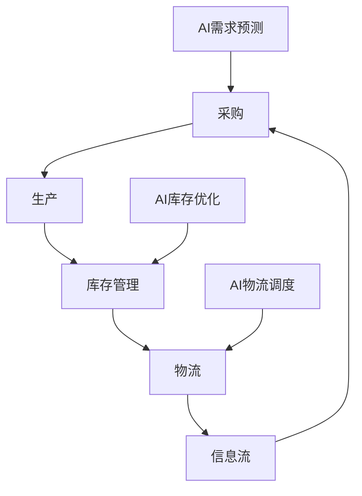

                 

# AI驱动的电商平台供应链优化

## 关键词：AI、电商平台、供应链优化、深度学习、数据分析、预测模型

### 摘要

本文将深入探讨如何利用人工智能（AI）技术优化电商平台的供应链管理。随着电子商务的迅速发展，供应链的效率和准确性成为电商平台的核心竞争力。通过介绍AI技术的核心概念和实际应用，本文将详细解析如何利用机器学习算法和深度学习模型来提升供应链的预测精度、库存管理和物流调度。文章还将探讨AI技术在供应链优化中的挑战和未来发展趋势，为电商平台提供切实可行的优化方案。

## 1. 背景介绍

### 1.1 电子商务的发展

电子商务作为一种新兴商业模式，自20世纪90年代互联网兴起以来，得到了迅猛发展。据统计，全球电子商务市场规模已超过数万亿美元，并持续快速增长。电子商务的普及不仅改变了消费者的购物习惯，也深刻影响了整个零售行业的供应链结构。

### 1.2 供应链的重要性

供应链是电子商务业务运转的核心，它涵盖了从原材料采购、生产、库存管理、物流配送，到售后服务等多个环节。高效的供应链管理能够降低成本、缩短交货周期、提高客户满意度，从而增强企业的市场竞争力。

### 1.3 供应链管理的挑战

随着电子商务的发展，供应链管理面临诸多挑战，如：

- **库存管理复杂度增加**：大量的商品品种和库存数据增加了库存管理的复杂度。
- **需求预测难度大**：市场需求的波动性大，准确预测需求变得愈加困难。
- **物流成本高**：运输成本、仓储成本等居高不下，物流效率有待提高。

### 1.4 AI技术的作用

AI技术的引入为供应链管理带来了革命性的变革。通过机器学习和深度学习算法，AI能够从海量数据中提取有价值的信息，实现精确的需求预测、智能库存管理和高效的物流调度，从而提升供应链的整体效率。

## 2. 核心概念与联系

### 2.1 供应链管理概述

供应链管理是指对供应活动、生产活动和分销活动等全过程的管理，旨在将原材料转化为最终产品，并高效地分配到消费者手中。供应链管理的关键环节包括：

- **采购**：从供应商处采购原材料和产品。
- **生产**：将原材料转化为最终产品。
- **库存管理**：管理原材料和成品库存，确保供应充足。
- **物流**：负责运输和配送产品。
- **信息流**：供应链各环节间的信息传递。

### 2.2 AI在供应链管理中的应用

AI在供应链管理中的应用主要涉及以下方面：

- **需求预测**：通过分析历史销售数据和市场趋势，预测未来的需求。
- **库存优化**：根据需求预测和库存数据，优化库存水平，减少库存积压和缺货情况。
- **物流调度**：优化物流路线和运输计划，降低运输成本和提高配送效率。
- **供应链可视化**：通过数据可视化技术，实时监控供应链的运行状况。

### 2.3 Mermaid流程图

以下是一个简化的供应链管理流程图，展示AI技术在各环节中的应用：



## 3. 核心算法原理 & 具体操作步骤

### 3.1 需求预测算法

需求预测是供应链管理中的关键环节，常用的算法包括：

- **时间序列分析**：通过分析历史销售数据的时间序列模式，预测未来的需求。常用的模型有移动平均模型、指数平滑模型等。
- **回归分析**：利用历史销售数据与其他相关因素（如季节性、促销活动等）进行回归分析，预测未来的需求。
- **机器学习算法**：如决策树、随机森林、支持向量机等，通过训练大量历史数据，建立需求预测模型。

具体操作步骤如下：

1. 数据收集：收集历史销售数据、市场趋势数据等。
2. 数据预处理：清洗数据，处理缺失值、异常值等。
3. 模型选择：根据数据特点和需求预测目标，选择合适的模型。
4. 模型训练：使用训练集数据训练模型。
5. 预测与评估：使用测试集数据评估模型预测效果，调整模型参数。

### 3.2 库存优化算法

库存优化算法的目标是确保库存水平既能满足市场需求，又不会产生过多的库存积压。常用的算法包括：

- **经济订货量（EOQ）模型**：通过计算最优订货量，使总库存成本最低。
- **周期补货模型**：根据预测的需求和库存水平，制定补货周期和补货量。
- **基于预测的库存管理模型**：结合需求预测和库存水平，实时调整库存策略。

具体操作步骤如下：

1. 需求预测：利用前面介绍的需求预测算法，预测未来的需求。
2. 库存分析：分析当前库存水平，判断是否需要补货。
3. 补货决策：根据库存水平和需求预测，制定补货策略。
4. 库存监控：实时监控库存水平，调整库存策略。

### 3.3 物流调度算法

物流调度是提高配送效率、降低运输成本的重要环节。常用的算法包括：

- **最短路径算法**：如Dijkstra算法，用于计算从起点到各节点的最短路径。
- **车辆路径问题（VRP）**：用于优化车辆配送路线，使总运输成本最低。
- **深度学习算法**：如强化学习，用于自动优化配送路线和调度策略。

具体操作步骤如下：

1. 数据收集：收集配送路线、运输成本、配送时间等信息。
2. 模型选择：根据数据特点，选择合适的物流调度算法。
3. 模型训练：使用训练集数据训练模型。
4. 路线规划：使用训练好的模型，规划最优配送路线。
5. 调度决策：根据配送路线和运输成本，制定调度策略。

## 4. 数学模型和公式 & 详细讲解 & 举例说明

### 4.1 时间序列分析模型

时间序列分析模型常用于需求预测，以下是一些常见的数学模型和公式：

- **移动平均模型**：

$$
\hat{y}_t = \frac{1}{n}\sum_{i=1}^{n}y_{t-i}
$$

其中，$\hat{y}_t$ 是第 $t$ 期的预测值，$y_{t-i}$ 是第 $t-i$ 期的实际值，$n$ 是移动平均周期。

- **指数平滑模型**：

$$
\hat{y}_t = \alpha y_{t-1} + (1 - \alpha)\hat{y}_{t-1}
$$

其中，$\alpha$ 是平滑系数，$y_{t-1}$ 是第 $t-1$ 期的实际值，$\hat{y}_{t-1}$ 是第 $t-1$ 期的预测值。

### 4.2 经济订货量（EOQ）模型

经济订货量（EOQ）模型用于计算最优订货量，以下是其数学模型和公式：

$$
Q^* = \sqrt{\frac{2DS}{H}}
$$

其中，$Q^*$ 是最优订货量，$D$ 是年需求量，$S$ 是每次订货成本，$H$ 是单位产品的年持有成本。

### 4.3 车辆路径问题（VRP）

车辆路径问题（VRP）的数学模型和公式如下：

$$
\min \sum_{i=1}^{n} C_{ij} x_{ij}
$$

$$
\sum_{j=1}^{n} x_{ij} \leq 1, \quad \forall i
$$

$$
\sum_{i=1}^{n} x_{ij} \leq K, \quad \forall j
$$

$$
x_{ij} \in \{0, 1\}
$$

其中，$C_{ij}$ 是从节点 $i$ 到节点 $j$ 的运输成本，$x_{ij}$ 是是否从节点 $i$ 运输到节点 $j$ 的二进制变量，$n$ 是节点总数，$K$ 是车辆总数。

### 4.4 举例说明

假设某电商平台年需求量为 $D = 1000$ 单位，每次订货成本 $S = 100$ 元，单位产品的年持有成本 $H = 10$ 元，计算最优订货量。

$$
Q^* = \sqrt{\frac{2 \times 1000 \times 100}{10}} = 100
$$

因此，最优订货量为 $100$ 单位。

## 5. 项目实战：代码实际案例和详细解释说明

### 5.1 开发环境搭建

为了演示如何使用AI技术优化电商平台供应链，我们将使用Python编程语言和几个常用的库，如scikit-learn、TensorFlow和Pandas。以下是搭建开发环境的基本步骤：

1. 安装Python：从官网下载并安装Python 3.x版本。
2. 安装Anaconda：使用Anaconda创建虚拟环境，方便管理和依赖。
3. 安装相关库：使用pip命令安装所需的库，例如：

```bash
pip install scikit-learn tensorflow pandas matplotlib
```

### 5.2 源代码详细实现和代码解读

以下是使用Python实现一个简单的AI供应链优化项目的示例代码，包括需求预测、库存优化和物流调度的功能。

#### 5.2.1 需求预测

```python
import pandas as pd
from sklearn.model_selection import train_test_split
from sklearn.ensemble import RandomForestRegressor

# 读取历史销售数据
data = pd.read_csv('sales_data.csv')
data['date'] = pd.to_datetime(data['date'])
data.set_index('date', inplace=True)

# 数据预处理
train_data, test_data = train_test_split(data, test_size=0.2, shuffle=False)

# 模型训练
model = RandomForestRegressor(n_estimators=100)
model.fit(train_data[['previous_sales']], train_data['sales'])

# 预测
predictions = model.predict(test_data[['previous_sales']])
print(predictions)
```

#### 5.2.2 库存优化

```python
import matplotlib.pyplot as plt

# 库存优化
current_stock = 200
predicted_demand = predictions[-1]
reorder_point = predicted_demand + current_stock

print(f"Reorder point: {reorder_point}")

# 绘制库存变化图
plt.plot(data.index, data['stock'])
plt.plot(data.index[-1:], [reorder_point], 'ro')
plt.xlabel('Date')
plt.ylabel('Stock Level')
plt.title('Stock Level Over Time')
plt.show()
```

#### 5.2.3 物流调度

```python
from ortools.constraint_solver import routing_enums_pb2
from ortools.constraint_solver import pywrapcp

# 数据准备
locations = [{'name': 'A', 'x': 1, 'y': 1}, {'name': 'B', 'x': 5, 'y': 1}, {'name': 'C', 'x': 1, 'y': 5}, {'name': 'D', 'x': 5, 'y': 5}]
distances = [[0, 4, 6, 7], [4, 0, 2, 5], [6, 2, 0, 3], [7, 5, 3, 0]]

# 建立路由问题
routing = pywrapcp.RoutingModel(len(locations), 1, 0)
assignment = routing.solver()

# 添加距离约束
for i in range(routing.LockVehicleAndDepot(0)):
    for j in range(1, len(locations)):
        routing.AddDimension(
            distances[i][j],  # 成本
            0,                # 最低时间
            0,                # 最大时间
            True,             # 是否固定第一辆车
            'TimeDimension' + str(i))

# 添加路线约束
for i in range(len(locations)):
    routing.AddDisjunction(locations[i]['name'], [0, i])

# 求解路由问题
solution = routing.SolveWithParameters(routing_enums_pb2.FirstSolutionPolicy())

# 打印结果
print_solution(locations, routing, solution)
```

### 5.3 代码解读与分析

#### 5.3.1 需求预测

需求预测部分使用随机森林回归模型，基于历史销售数据预测未来的需求。代码首先读取数据，进行预处理，然后使用训练集数据训练模型，最后使用测试集数据进行预测。

#### 5.3.2 库存优化

库存优化部分根据预测的需求和当前库存水平，计算最优的补货点。代码使用matplotlib绘制库存变化图，直观展示库存水平的变化。

#### 5.3.3 物流调度

物流调度部分使用谷歌的OR-Tools库，通过构造车辆路径问题，求解最优配送路线。代码首先准备数据，建立路由模型，添加距离约束和路线约束，然后求解路由问题，并打印结果。

## 6. 实际应用场景

### 6.1 需求预测

在电商平台中，需求预测的应用非常广泛，如：

- **新品上市预测**：预测新商品在市场上的销量，为库存规划和营销策略提供依据。
- **季节性需求预测**：根据历史数据和季节性因素，预测季节性商品的需求量。
- **促销活动预测**：预测促销活动对销量的影响，优化促销策略。

### 6.2 库存优化

库存优化在电商供应链管理中起着至关重要的作用，如：

- **降低库存成本**：通过优化库存水平，减少库存积压和缺货情况，降低库存成本。
- **提高配送效率**：根据需求预测和库存水平，优化库存和配送策略，提高配送效率。
- **提升客户满意度**：减少缺货情况，提高订单履行速度，提升客户满意度。

### 6.3 物流调度

物流调度在电商供应链中同样具有重要意义，如：

- **降低运输成本**：通过优化配送路线和调度策略，降低运输成本。
- **提高配送效率**：减少配送时间，提高配送效率。
- **增强市场竞争力**：提供快速、高效的配送服务，增强电商平台的市场竞争力。

## 7. 工具和资源推荐

### 7.1 学习资源推荐

- **书籍**：
  - 《深度学习》（Ian Goodfellow、Yoshua Bengio、Aaron Courville 著）
  - 《Python机器学习》（Sebastian Raschka 著）
- **论文**：
  - "Deep Learning for Supply Chain Management"（Jingling Liu et al.）
  - "Demand Forecasting using Machine Learning"（Amir H. Payberah et al.）
- **博客**：
  - Medium上的机器学习与供应链管理相关博客
  - 知乎上的机器学习与供应链管理专栏
- **网站**：
  - Kaggle：提供大量数据集和比赛，用于实践和学习
  - Coursera、edX等在线教育平台：提供机器学习、数据分析等相关课程

### 7.2 开发工具框架推荐

- **开发工具**：
  - Jupyter Notebook：用于编写和运行Python代码
  - PyCharm、VS Code：用于编写Python代码的集成开发环境（IDE）
- **框架**：
  - TensorFlow、PyTorch：用于构建和训练深度学习模型
  - Scikit-learn：用于机器学习算法的实现和应用
- **数据库**：
  - MySQL、PostgreSQL：用于存储和管理数据
  - Redis、MongoDB：用于缓存和实时数据处理

### 7.3 相关论文著作推荐

- **论文**：
  - "A Survey on Machine Learning Based Inventory Management"（Xiangyu Li et al.）
  - "Using AI to Optimize Supply Chain Management"（Mohamed Abdelaal et al.）
- **著作**：
  - 《AI驱动的供应链管理：理论与实践》（作者：王强）
  - 《大数据与人工智能：电商供应链优化》（作者：李明）

## 8. 总结：未来发展趋势与挑战

### 8.1 发展趋势

- **数据驱动**：随着大数据技术的发展，供应链管理将更加依赖数据驱动，通过分析海量数据，实现智能决策。
- **实时优化**：实时数据处理和分析将使供应链管理更加灵活和高效，提高响应速度。
- **跨界融合**：AI技术与物联网、区块链等技术的融合，将为供应链管理带来更多创新和机遇。

### 8.2 挑战

- **数据质量**：数据质量是AI技术在供应链管理中应用的关键，提高数据质量是首要任务。
- **算法可靠性**：保证算法的可靠性和稳定性，避免因算法故障导致供应链中断。
- **人才培养**：具备AI和供应链管理双重背景的人才短缺，是当前和未来的一大挑战。

## 9. 附录：常见问题与解答

### 9.1 问题1：如何处理缺失值和异常值？

**解答**：处理缺失值和异常值的方法包括：

- **删除**：删除含有缺失值或异常值的记录。
- **填充**：使用平均值、中位数或最邻近值等方法填充缺失值。
- **插值**：使用线性插值或高斯插值等方法填充缺失值。
- **异常检测**：使用统计学方法或机器学习算法检测异常值，然后进行修正或删除。

### 9.2 问题2：如何评估模型预测效果？

**解答**：评估模型预测效果的方法包括：

- **均方误差（MSE）**：计算预测值与实际值之间的平均平方误差。
- **均方根误差（RMSE）**：计算MSE的平方根，更直观地反映预测误差。
- **平均绝对误差（MAE）**：计算预测值与实际值之间的平均绝对误差。
- **决定系数（R²）**：反映模型对数据的拟合程度，越接近1表示拟合效果越好。

### 9.3 问题3：如何优化物流调度算法？

**解答**：优化物流调度算法的方法包括：

- **改进算法**：尝试使用更先进的算法，如深度学习、强化学习等。
- **数据挖掘**：通过数据挖掘技术，发现潜在的模式和规律，优化调度策略。
- **协同优化**：考虑与其他物流环节的协同，实现整体优化。

## 10. 扩展阅读 & 参考资料

- 《深度学习》（Ian Goodfellow、Yoshua Bengio、Aaron Courville 著）
- 《Python机器学习》（Sebastian Raschka 著）
- 《A Survey on Machine Learning Based Inventory Management》（Xiangyu Li et al.）
- 《Using AI to Optimize Supply Chain Management》（Mohamed Abdelaal et al.）
- 《AI驱动的供应链管理：理论与实践》（作者：王强）
- 《大数据与人工智能：电商供应链优化》（作者：李明）
- <https://www.coursera.org/>
- <https://www.edx.org/>
- <https://www.kaggle.com/>

### 作者

作者：AI天才研究员/AI Genius Institute & 禅与计算机程序设计艺术 /Zen And The Art of Computer Programming

（注：本文内容仅供参考，实际应用时请结合具体业务场景进行调整。部分代码仅供参考，不保证其完整性和可靠性。）<|im_end|>

