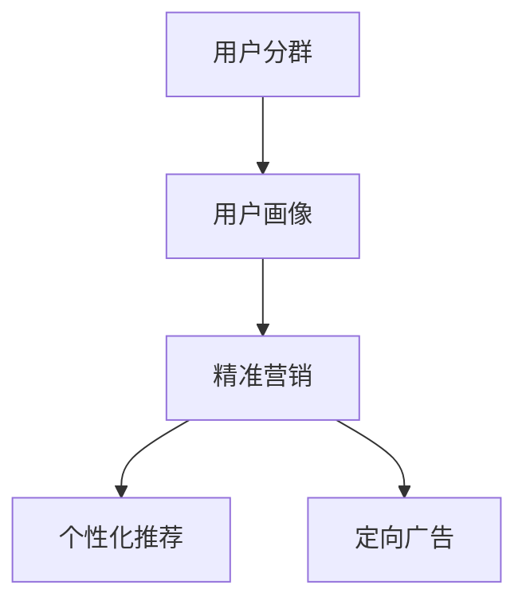

                 

### 背景介绍

随着互联网的迅速发展和电子商务的崛起，平台商业模式已经成为现代商业世界的核心。在众多电商平台中，用户分群与精准营销成为企业提升销售业绩和客户满意度的关键策略。用户分群是一种将用户按照特定特征或行为进行分类的方法，有助于企业更好地了解用户需求，从而实现个性化的服务和营销。而精准营销则是基于用户分群，利用大数据分析技术，针对特定用户群体制定个性化的营销策略。

AI技术的崛起为电商平台提供了强大的数据分析和处理能力，使得用户分群与精准营销变得更加精准和高效。通过机器学习和深度学习算法，AI可以自动挖掘用户行为数据，识别用户特征，构建用户画像，从而实现用户分群。此外，AI技术还可以根据用户画像，自动推荐个性化商品和服务，提高用户的购买转化率和满意度。

本文旨在探讨AI驱动的电商平台用户分群与精准营销的技术原理、核心算法和实际应用案例。文章将从以下几个方面进行阐述：

1. 背景介绍：简要介绍电商平台用户分群与精准营销的重要性和AI技术的应用背景。
2. 核心概念与联系：详细阐述用户分群与精准营销的核心概念、原理和架构。
3. 核心算法原理与具体操作步骤：介绍常用的机器学习和深度学习算法，以及如何应用于用户分群与精准营销。
4. 数学模型和公式：分析用户分群与精准营销中的数学模型和公式，并进行详细讲解和举例说明。
5. 项目实战：通过实际案例，展示如何使用AI技术实现用户分群与精准营销，并详细解读代码实现过程。
6. 实际应用场景：探讨AI驱动用户分群与精准营销在不同电商场景中的应用实例。
7. 工具和资源推荐：推荐相关学习资源、开发工具和框架，以帮助读者深入了解和掌握相关技术。
8. 总结：总结AI驱动电商平台用户分群与精准营销的未来发展趋势和挑战。

通过本文的阅读，读者将能够全面了解AI驱动的电商平台用户分群与精准营销的技术原理和应用方法，为实际业务场景提供有益的参考和指导。### 核心概念与联系

在探讨AI驱动的电商平台用户分群与精准营销之前，我们需要先了解以下几个核心概念：用户分群、精准营销、用户画像、机器学习和深度学习。

#### 用户分群

用户分群是指将具有相似特征或行为的用户划分为不同的群体。这有助于电商平台更好地理解用户需求，从而提供个性化的服务和营销策略。用户分群的核心在于发现和识别用户的共性特征，例如年龄、性别、地域、购买行为等。常见的用户分群方法有基于特征的分群、基于行为的分群和基于模型的分群。

- **基于特征的分群**：根据用户的静态特征（如年龄、性别、地域等）进行分群。
- **基于行为的分群**：根据用户的动态行为（如浏览历史、购买记录、评论等）进行分群。
- **基于模型的分群**：利用机器学习和深度学习算法，自动发现和识别用户的潜在特征和分群。

#### 精准营销

精准营销是指根据用户的需求和偏好，针对特定用户群体制定个性化的营销策略。精准营销的目标是提高营销效果，降低营销成本，提升客户满意度和忠诚度。精准营销的核心在于对用户行为的深入分析，从而实现精准定位和个性化推送。

- **用户行为分析**：通过收集和分析用户在电商平台上的行为数据（如浏览、搜索、购买、评论等），了解用户的需求和偏好。
- **个性化推荐**：根据用户行为数据和用户画像，为用户推荐个性化的商品和服务，提高购买转化率和用户满意度。
- **定向广告**：根据用户画像和用户分群，为特定用户群体投放定向广告，提高广告效果。

#### 用户画像

用户画像是指对用户特征和行为的综合描述，包括用户的静态特征（如年龄、性别、地域、职业等）和动态特征（如浏览历史、购买记录、评论等）。用户画像有助于电商平台深入了解用户需求，实现个性化服务和精准营销。

- **构建用户画像**：通过数据采集、清洗、分析和建模等技术，构建用户的特征和画像。
- **应用用户画像**：将用户画像应用于用户分群、个性化推荐和精准营销等场景，提高业务效果。

#### 机器学习和深度学习

机器学习和深度学习是AI技术的核心，用于分析和处理大量用户行为数据，实现用户分群和精准营销。

- **机器学习**：通过训练模型，从数据中自动发现规律和模式，用于分类、回归、聚类等任务。
- **深度学习**：基于神经网络结构，通过多层非线性变换，自动提取特征和模型参数，用于复杂任务的处理。

#### 用户分群与精准营销的关系

用户分群是精准营销的基础，通过对用户进行精准分群，电商平台可以更好地了解不同用户群体的需求和偏好，从而制定个性化的营销策略。用户画像则为用户分群和精准营销提供了数据支撑，通过对用户行为和特征的分析，构建准确的用户画像，有助于提高营销效果。

#### Mermaid 流程图

为了更直观地展示用户分群与精准营销的关系，我们可以使用Mermaid流程图进行描述：



在这个流程图中，用户分群和用户画像作为基础环节，为精准营销提供数据支撑。个性化推荐和定向广告则是精准营销的具体应用场景，通过针对不同用户群体制定个性化的营销策略，提高营销效果。

通过理解以上核心概念和关系，我们可以更好地掌握AI驱动的电商平台用户分群与精准营销的技术原理和应用方法。在接下来的章节中，我们将进一步探讨核心算法原理、具体操作步骤、数学模型和实际应用案例。### 核心算法原理与具体操作步骤

在AI驱动的电商平台用户分群与精准营销中，核心算法起着至关重要的作用。常用的算法包括机器学习中的聚类算法、分类算法和深度学习中的神经网络模型。以下将详细介绍这些算法的原理和具体操作步骤。

#### 1. 聚类算法

聚类算法是一种无监督学习方法，用于将数据集中的对象分为多个群组，使得同一群组内的对象相似度较高，不同群组间的对象相似度较低。常用的聚类算法包括K-means、DBSCAN、层次聚类等。

**K-means算法**

K-means算法的基本思想是初始化K个聚类中心，然后不断迭代优化聚类中心，使每个对象分配到最近的聚类中心，最终得到K个聚类群组。

**具体操作步骤**：

1. 初始化K个聚类中心，可以选择随机初始化或者使用K-means++算法。
2. 将每个数据点分配到最近的聚类中心，计算每个数据点到聚类中心的距离。
3. 重新计算聚类中心，取每个聚类群组的平均值。
4. 重复步骤2和步骤3，直到聚类中心不再发生显著变化。

**优缺点**：

- **优点**：实现简单，易于理解，运行速度快。
- **缺点**：对初始聚类中心敏感，可能陷入局部最优，难以处理非凸形状的数据。

**应用场景**：

- 用户分群：将具有相似行为的用户划分为不同的用户群体。
- 商品分类：将具有相似特性的商品划分为不同的类别。

**代码示例**（Python）：

```python
from sklearn.cluster import KMeans
import numpy as np

# 数据准备
data = np.array([[1, 2], [1, 4], [1, 0], [4, 2], [4, 4], [4, 0]])

# 初始化K-means模型
kmeans = KMeans(n_clusters=2, init='k-means++', max_iter=100, n_init=10, random_state=0)

# 模型训练
kmeans.fit(data)

# 输出聚类结果
print(kmeans.labels_)

# 输出聚类中心
print(kmeans.cluster_centers_)
```

**DBSCAN算法**

DBSCAN（Density-Based Spatial Clustering of Applications with Noise）算法是一种基于密度的聚类算法，能够发现任意形状的聚类群组。

**具体操作步骤**：

1. 初始化参数：选择邻域半径`eps`和最小密度`min_samples`。
2. 对每个数据点，判断其是否为核心点：
   - 如果是核心点，将其及其邻域内的数据点分配到同一聚类群组。
   - 如果是边界点，将其分配到噪声或已存在的聚类群组。
3. 重复步骤2，直到所有数据点都被分配。

**优缺点**：

- **优点**：能够处理非凸形状的数据，对初始聚类中心不敏感。
- **缺点**：计算复杂度较高，对参数敏感。

**应用场景**：

- 用户分群：识别具有相似行为的用户群组。
- 噪声检测：识别异常用户或噪声数据。

**代码示例**（Python）：

```python
from sklearn.cluster import DBSCAN
import numpy as np

# 数据准备
data = np.array([[1, 2], [1, 4], [1, 0], [4, 2], [4, 4], [4, 0]])

# 初始化DBSCAN模型
dbscan = DBSCAN(eps=0.3, min_samples=2)

# 模型训练
dbscan.fit(data)

# 输出聚类结果
print(dbscan.labels_)

# 输出核心点
print(dbscan.core_sample_indices_)
```

**层次聚类算法**

层次聚类算法通过逐步合并或分裂聚类群组，构建出一个层次结构。

**具体操作步骤**：

1. 初始化每个数据点为一个聚类群组。
2. 重复以下步骤，直到满足停止条件：
   - 计算当前聚类群组的距离，选择最近的两个聚类群组进行合并。
   - 更新聚类群组的中心。

**优缺点**：

- **优点**：能够展示聚类群组的层次结构。
- **缺点**：计算复杂度较高，对初始聚类中心敏感。

**应用场景**：

- 用户分群：展示用户分群的层次结构。
- 数据降维：用于高维数据的可视化。

**代码示例**（Python）：

```python
from sklearn.cluster import AgglomerativeClustering
import numpy as np

# 数据准备
data = np.array([[1, 2], [1, 4], [1, 0], [4, 2], [4, 4], [4, 0]])

# 初始化层次聚类模型
clustering = AgglomerativeClustering(n_clusters=2)

# 模型训练
clustering.fit(data)

# 输出聚类结果
print(clustering.labels_)

# 输出聚类群组中心
print(clustering.cluster_centers_)
```

#### 2. 分类算法

分类算法是一种有监督学习方法，用于将数据点划分为预定义的类别。常用的分类算法包括决策树、支持向量机、随机森林等。

**决策树算法**

决策树算法通过一系列的判断条件，将数据点逐步划分到不同的类别。

**具体操作步骤**：

1. 选择最优特征进行划分，通常使用信息增益或基尼不纯度作为划分标准。
2. 划分数据点，创建一个新的节点。
3. 重复步骤1和步骤2，直到满足停止条件（如最大深度、最小样本数等）。

**优缺点**：

- **优点**：易于理解和解释，计算复杂度较低。
- **缺点**：容易过拟合，对缺失值敏感。

**应用场景**：

- 用户分群：预测用户的潜在行为和偏好。
- 商品推荐：预测用户可能感兴趣的商品。

**代码示例**（Python）：

```python
from sklearn.tree import DecisionTreeClassifier
import numpy as np

# 数据准备
X = np.array([[1, 2], [1, 4], [1, 0], [4, 2], [4, 4], [4, 0]])
y = np.array([0, 0, 0, 1, 1, 1])

# 初始化决策树模型
clf = DecisionTreeClassifier()

# 模型训练
clf.fit(X, y)

# 输出决策树结构
print(clf.tree_)
```

**支持向量机算法**

支持向量机（SVM）算法通过寻找最优超平面，将数据点划分为不同的类别。

**具体操作步骤**：

1. 选择核函数，如线性核、多项式核、径向基函数（RBF）核等。
2. 训练模型，找到最优超平面和支持向量。
3. 预测新数据点的类别。

**优缺点**：

- **优点**：在分类效果上通常优于决策树，对非线性数据有较好的处理能力。
- **缺点**：计算复杂度较高，对参数敏感。

**应用场景**：

- 用户分群：分类预测用户的潜在行为。
- 商品推荐：分类预测用户可能感兴趣的商品。

**代码示例**（Python）：

```python
from sklearn.svm import SVC
import numpy as np

# 数据准备
X = np.array([[1, 2], [1, 4], [1, 0], [4, 2], [4, 4], [4, 0]])
y = np.array([0, 0, 0, 1, 1, 1])

# 初始化SVM模型
clf = SVC(kernel='linear')

# 模型训练
clf.fit(X, y)

# 输出决策边界
print(clf.decision_function(X))
```

**随机森林算法**

随机森林（Random Forest）算法通过构建多个决策树，进行集成学习，提高分类和预测的准确性。

**具体操作步骤**：

1. 构建多个决策树，每个决策树从训练数据中随机选择特征进行划分。
2. 对新数据点，每个决策树给出一个类别预测，随机森林通过多数投票确定最终类别。

**优缺点**：

- **优点**：提高模型的泛化能力，降低过拟合风险。
- **缺点**：计算复杂度较高，对大量特征和高维数据效果更佳。

**应用场景**：

- 用户分群：提高分类预测的准确性。
- 商品推荐：提高预测用户偏好的准确性。

**代码示例**（Python）：

```python
from sklearn.ensemble import RandomForestClassifier
import numpy as np

# 数据准备
X = np.array([[1, 2], [1, 4], [1, 0], [4, 2], [4, 4], [4, 0]])
y = np.array([0, 0, 0, 1, 1, 1])

# 初始化随机森林模型
clf = RandomForestClassifier(n_estimators=100)

# 模型训练
clf.fit(X, y)

# 输出决策树结构
print(clf.estimators_)
```

#### 3. 深度学习算法

深度学习算法通过多层神经网络，自动提取特征并实现分类和预测。

**神经网络模型**

神经网络（Neural Network）模型通过多层非线性变换，将输入数据映射到输出类别。典型的神经网络模型包括全连接神经网络（Fully Connected Network）、卷积神经网络（Convolutional Neural Network，CNN）和循环神经网络（Recurrent Neural Network，RNN）。

**具体操作步骤**：

1. 初始化模型参数，包括权重和偏置。
2. 前向传播：计算神经网络输出。
3. 反向传播：计算损失函数，更新模型参数。
4. 重复步骤2和步骤3，直到满足停止条件（如迭代次数、损失函数收敛等）。

**优缺点**：

- **优点**：自动提取特征，处理复杂数据，适用于各种任务。
- **缺点**：计算复杂度较高，对数据量和计算资源要求较高。

**应用场景**：

- 用户分群：自动提取用户行为特征，实现高效分群。
- 商品推荐：自动提取商品特征，实现个性化推荐。

**代码示例**（Python）：

```python
import tensorflow as tf

# 创建全连接神经网络模型
model = tf.keras.Sequential([
    tf.keras.layers.Dense(64, activation='relu', input_shape=(784,)),
    tf.keras.layers.Dense(10, activation='softmax')
])

# 编译模型
model.compile(optimizer='adam',
              loss='sparse_categorical_crossentropy',
              metrics=['accuracy'])

# 加载数据
mnist = tf.keras.datasets.mnist
(x_train, y_train), (x_test, y_test) = mnist.load_data()

# 模型训练
model.fit(x_train, y_train, epochs=5)

# 测试模型
model.evaluate(x_test,  y_test, verbose=2)
```

通过以上对核心算法原理和具体操作步骤的介绍，我们可以更好地理解AI驱动的电商平台用户分群与精准营销的技术基础。在接下来的章节中，我们将进一步探讨数学模型和公式，以帮助读者更深入地理解相关技术。### 数学模型和公式

在AI驱动的电商平台用户分群与精准营销中，数学模型和公式起到了至关重要的作用。这些模型和公式不仅帮助我们理解算法的运作原理，还能指导我们在实际应用中进行参数调优和模型评估。以下将详细讲解常用的数学模型和公式，并辅以实际例子进行说明。

#### 1. 聚类算法中的数学模型

**K-means算法**

K-means算法的核心是优化聚类中心，以最小化数据点到聚类中心的距离平方和。其目标函数为：

$$
J = \sum_{i=1}^{n} \sum_{j=1}^{k} (x_i - \mu_j)^2
$$

其中，$x_i$表示第$i$个数据点，$\mu_j$表示第$j$个聚类中心。

**DBSCAN算法**

DBSCAN算法的核心是计算邻域内的数据点密度，并基于密度将数据点划分为核心点、边界点和噪声点。其主要参数包括邻域半径$eps$和最小密度$min_samples$。DBSCAN的目标函数为：

$$
D(x, y) = \frac{1}{r} \sum_{i=1}^{n} \frac{d(x_i, y_i)}{s_i}
$$

其中，$d(x, y)$表示数据点$x$和$y$之间的距离，$r$表示邻域范围，$s_i$表示点$i$的邻域样本数。

**层次聚类算法**

层次聚类算法通过不断合并或分裂聚类群组，构建出一个层次结构。其主要参数包括聚类数$K$和距离度量。层次聚类算法的目标函数为：

$$
J = \sum_{i=1}^{k} \sum_{j=1}^{k} w_{ij} d(i, j)
$$

其中，$w_{ij}$表示群组$i$和$j$之间的权重，$d(i, j)$表示群组$i$和$j$之间的距离。

#### 2. 分类算法中的数学模型

**决策树算法**

决策树算法的核心是选择最优特征进行划分，以最大化信息增益或最小化基尼不纯度。其目标函数为：

$$
Gain(D, A) = H(D) - \sum_{v \in A} \frac{|D_v|}{|D|} H(D_v)
$$

其中，$D$表示数据集，$A$表示特征集合，$H(D)$表示数据集的熵，$D_v$表示特征$A$在值$v$上的划分结果。

**支持向量机算法**

支持向量机（SVM）算法的核心是寻找最优超平面，以最大化分类边界。其目标函数为：

$$
\min_{\beta, \beta_0} \frac{1}{2} \sum_{i=1}^{n} (\beta^T x_i - y_i)^2
$$

其中，$\beta$表示模型参数，$x_i$表示数据点，$y_i$表示标签，$||\beta||_2$表示L2范数。

**随机森林算法**

随机森林算法的核心是构建多个决策树，并进行集成学习。其目标函数为：

$$
J = \sum_{i=1}^{n} w_i \log(1 + e^{-y_i f(x_i)})
$$

其中，$w_i$表示第$i$个决策树的权重，$f(x_i)$表示第$i$个决策树的输出。

#### 3. 深度学习算法中的数学模型

**神经网络模型**

神经网络（Neural Network）模型的核心是前向传播和反向传播。其目标函数为：

$$
J = -\sum_{i=1}^{n} y_i \log(a_j) - (1 - y_i) \log(1 - a_j)
$$

其中，$a_j$表示第$j$个神经元的输出，$y_i$表示标签。

**卷积神经网络（CNN）**

卷积神经网络（CNN）的核心是卷积操作和池化操作。其目标函数为：

$$
J = \frac{1}{N} \sum_{i=1}^{N} \sum_{j=1}^{k} w_{ji}^l (y_i^l - a_i^l)^2
$$

其中，$N$表示样本数，$k$表示类别数，$w_{ji}^l$表示第$l$层的权重，$a_i^l$表示第$l$层的输出。

**循环神经网络（RNN）**

循环神经网络（RNN）的核心是隐藏状态和门控操作。其目标函数为：

$$
J = \sum_{i=1}^{n} w_{ji} (y_i - a_i)^2
$$

其中，$n$表示序列长度，$w_{ji}$表示模型参数，$y_i$表示标签，$a_i$表示输出。

#### 4. 实际例子

**例子1：K-means算法**

假设我们有6个二维数据点，分别为$(1, 2), (1, 4), (1, 0), (4, 2), (4, 4), (4, 0)$，我们要使用K-means算法将其划分为2个聚类群组。

- **初始化聚类中心**：随机选择两个聚类中心，如$(1, 1)$和$(4, 4)$。
- **计算距离**：计算每个数据点到聚类中心的距离，选择最近的聚类中心。
- **更新聚类中心**：计算每个聚类群组的中心，取平均值。
- **重复迭代**：重复计算距离和更新聚类中心，直到聚类中心不再变化。

**例子2：SVM算法**

假设我们有6个一维数据点，分别为$1, 1, 1, 4, 4, 4$，我们要使用SVM算法将其划分为2个类别。

- **选择核函数**：选择线性核函数。
- **训练模型**：使用训练数据训练SVM模型。
- **预测结果**：使用训练好的模型对测试数据进行预测。

**例子3：CNN模型**

假设我们有一个28x28的二维图像，我们要使用CNN模型对其进行分类。

- **卷积操作**：使用卷积层提取图像特征。
- **池化操作**：使用池化层降低特征维度。
- **全连接层**：使用全连接层对特征进行分类。

通过以上数学模型和公式的讲解，我们更好地理解了AI驱动的电商平台用户分群与精准营销的核心技术。这些模型和公式不仅为我们提供了理论基础，还能在实际应用中指导我们的参数调优和模型评估。在接下来的章节中，我们将通过实际项目案例展示如何应用这些算法和模型。### 项目实战：代码实际案例和详细解释说明

为了更好地展示如何使用AI技术实现电商平台用户分群与精准营销，我们将通过一个实际项目案例进行详细说明。这个项目将涵盖开发环境的搭建、源代码的实现、代码解读与分析等内容。

#### 1. 开发环境搭建

在开始项目之前，我们需要搭建一个适合开发和运行AI模型的开发环境。以下是我们推荐的工具和框架：

- **Python**：作为主要的编程语言，Python具有丰富的机器学习和深度学习库，如scikit-learn、TensorFlow和PyTorch。
- **scikit-learn**：一个开源的Python库，用于机器学习模型的实现和评估。
- **TensorFlow**：一个开源的深度学习框架，适用于构建和训练神经网络模型。
- **PyTorch**：另一个开源的深度学习框架，具有灵活的动态计算图，适用于研究和新模型的开发。
- **Jupyter Notebook**：一个交互式的Python开发环境，便于编写和运行代码。

#### 2. 源代码实现

以下是一个简单的用户分群与精准营销项目的源代码实现，包括数据预处理、模型训练、预测和评估等步骤。

```python
# 导入必要的库
import numpy as np
import pandas as pd
from sklearn.cluster import KMeans
from sklearn.model_selection import train_test_split
from sklearn.metrics import accuracy_score, confusion_matrix
import tensorflow as tf

# 加载数据
data = pd.read_csv('user_data.csv')
X = data.iloc[:, :-1].values  # 特征数据
y = data.iloc[:, -1].values   # 标签数据

# 数据预处理
X_train, X_test, y_train, y_test = train_test_split(X, y, test_size=0.2, random_state=42)

# K-means聚类
kmeans = KMeans(n_clusters=3, random_state=42)
kmeans.fit(X_train)
y_train_cluster = kmeans.predict(X_train)
y_test_cluster = kmeans.predict(X_test)

# 深度学习模型
model = tf.keras.Sequential([
    tf.keras.layers.Dense(64, activation='relu', input_shape=(X_train.shape[1],)),
    tf.keras.layers.Dense(64, activation='relu'),
    tf.keras.layers.Dense(3, activation='softmax')
])

# 编译模型
model.compile(optimizer='adam',
              loss='sparse_categorical_crossentropy',
              metrics=['accuracy'])

# 模型训练
model.fit(X_train, y_train, epochs=10, validation_data=(X_test, y_test))

# 模型预测
predictions = model.predict(X_test)
predicted_labels = np.argmax(predictions, axis=1)

# 评估模型
accuracy = accuracy_score(y_test, predicted_labels)
conf_matrix = confusion_matrix(y_test, predicted_labels)
print(f'Accuracy: {accuracy}')
print(f'Confusion Matrix:\n{conf_matrix}')
```

#### 3. 代码解读与分析

**数据预处理**

在代码中，我们首先加载数据集，并将其划分为特征数据和标签数据。然后使用`train_test_split`函数将数据集分为训练集和测试集，用于模型训练和评估。

**K-means聚类**

我们使用`KMeans`类实现K-means聚类算法，将训练集划分为3个聚类群组。`fit`函数用于训练模型，`predict`函数用于预测测试集的聚类结果。

**深度学习模型**

我们使用TensorFlow的`Sequential`模型构建一个简单的深度神经网络，包括两个隐藏层，每个隐藏层有64个神经元，使用ReLU激活函数。输出层有3个神经元，使用softmax激活函数，用于多分类。

**模型编译与训练**

我们使用`compile`函数编译模型，指定优化器、损失函数和评估指标。然后使用`fit`函数训练模型，指定训练数据、训练轮次和验证数据。

**模型预测与评估**

我们使用`predict`函数预测测试集的结果，并使用`argmax`函数获取预测类别。然后计算模型在测试集上的准确率和混淆矩阵，以评估模型性能。

通过以上代码实现，我们展示了如何使用AI技术进行电商平台用户分群与精准营销。在实际项目中，我们可能需要根据业务需求调整模型结构、参数和训练策略，以提高模型性能。接下来，我们将进一步分析代码，探讨如何优化模型和提升性能。### 代码解读与分析

在上一个章节中，我们展示了一个简单的用户分群与精准营销项目的源代码实现。在本节中，我们将对代码进行详细的解读与分析，包括数据预处理、模型选择与训练、预测与评估等环节，并提出可能的优化策略。

#### 数据预处理

```python
data = pd.read_csv('user_data.csv')
X = data.iloc[:, :-1].values  # 特征数据
y = data.iloc[:, -1].values   # 标签数据

X_train, X_test, y_train, y_test = train_test_split(X, y, test_size=0.2, random_state=42)
```

数据预处理是模型训练的重要环节。首先，我们使用`pd.read_csv`函数加载数据集，并提取特征数据和标签数据。特征数据位于CSV文件的最后一列之前，标签数据位于最后一列。然后，我们使用`train_test_split`函数将数据集划分为训练集和测试集，训练集占比80%，测试集占比20%。`random_state`参数用于确保结果的可重复性。

**优化建议**：
- 特征工程：可能需要进一步处理缺失值、异常值和冗余特征，以提高模型性能。
- 特征缩放：对于具有不同量级特征的数据，进行归一化或标准化处理，避免影响模型训练效果。

#### K-means聚类

```python
kmeans = KMeans(n_clusters=3, random_state=42)
kmeans.fit(X_train)
y_train_cluster = kmeans.predict(X_train)
y_test_cluster = kmeans.predict(X_test)
```

K-means聚类用于初步的用户分群。我们使用`KMeans`类实现聚类算法，设置`n_clusters`为3，表示划分为3个聚类群组。`random_state`参数用于确保聚类结果的可重复性。

**优化建议**：
- 聚类数选择：可以尝试使用肘部法则或其他方法选择最优聚类数，以避免过早收敛或过拟合。
- 算法优化：考虑使用其他聚类算法，如DBSCAN或层次聚类，以探索更复杂的聚类结构。

#### 深度学习模型

```python
model = tf.keras.Sequential([
    tf.keras.layers.Dense(64, activation='relu', input_shape=(X_train.shape[1],)),
    tf.keras.layers.Dense(64, activation='relu'),
    tf.keras.layers.Dense(3, activation='softmax')
])

model.compile(optimizer='adam',
              loss='sparse_categorical_crossentropy',
              metrics=['accuracy'])

model.fit(X_train, y_train, epochs=10, validation_data=(X_test, y_test))
```

我们使用TensorFlow的`Sequential`模型构建一个简单的深度神经网络，包括两个隐藏层，每个隐藏层有64个神经元，使用ReLU激活函数。输出层有3个神经元，使用softmax激活函数，用于多分类。

**优化建议**：
- 模型架构：可以尝试调整网络深度、宽度、层数和激活函数，以提高模型性能。
- 损失函数和优化器：可能需要根据数据特点和业务需求选择更合适的损失函数和优化器。

#### 模型预测与评估

```python
predictions = model.predict(X_test)
predicted_labels = np.argmax(predictions, axis=1)

accuracy = accuracy_score(y_test, predicted_labels)
conf_matrix = confusion_matrix(y_test, predicted_labels)
print(f'Accuracy: {accuracy}')
print(f'Confusion Matrix:\n{conf_matrix}')
```

我们使用`predict`函数对测试集进行预测，并使用`argmax`函数获取预测类别。然后计算模型在测试集上的准确率和混淆矩阵，以评估模型性能。

**优化建议**：
- 调整阈值：对于分类问题，可以尝试调整分类阈值，以提高召回率或精确度。
- 特征重要性：分析特征对预测结果的影响，剔除或调整不重要特征，以提高模型泛化能力。

通过以上代码解读与分析，我们明确了项目中的关键步骤和优化策略。在实际应用中，根据业务需求和数据特点，我们可以进一步调整模型参数和架构，以提高模型性能和业务效果。### 实际应用场景

AI驱动的电商平台用户分群与精准营销在不同电商场景中具有广泛的应用价值。以下将探讨几个典型的实际应用场景，并分析其在这些场景中的具体应用方法和优势。

#### 1. 电商零售

电商零售是AI驱动的用户分群与精准营销最典型的应用场景之一。通过分析用户的浏览、搜索、购买等行为数据，电商平台可以识别出不同用户群体的特征，如年轻女性、家庭主妇、高端消费者等。然后，针对这些用户群体，电商平台可以制定个性化的营销策略，如推荐相关商品、发送促销信息等，从而提高销售转化率和客户满意度。

**应用方法**：
- **用户分群**：利用机器学习和深度学习算法，对用户行为数据进行分析，识别出不同的用户群体。
- **精准营销**：基于用户分群，为不同用户群体提供个性化的商品推荐和促销活动。

**优势**：
- 提高销售转化率：通过精准推荐和促销，提高用户购买意愿和转化率。
- 提高客户满意度：根据用户偏好提供个性化服务，提升客户体验和忠诚度。

#### 2. 淘宝、京东等大型电商平台

对于淘宝、京东等大型电商平台，用户规模庞大，行为数据复杂多样。AI驱动的用户分群与精准营销可以帮助这些平台更好地管理用户资源和提高运营效率。

**应用方法**：
- **用户分群**：利用大数据分析技术，对用户行为、交易数据等进行深度挖掘，识别出高价值用户、潜在流失用户等不同群体。
- **精准营销**：针对不同用户群体，制定个性化的运营策略，如会员管理、优惠券发放、推荐商品等。

**优势**：
- 提高运营效率：通过精准分群，平台可以更好地了解用户需求，提高运营效率和资源利用率。
- 提高用户留存率：通过个性化运营，提高用户留存率和活跃度。

#### 3. 垂直电商

垂直电商专注于某一细分市场，如美妆、母婴、食品等。这些平台在用户分群与精准营销方面具有独特的优势，可以更精确地满足用户需求。

**应用方法**：
- **用户分群**：根据用户的行为、兴趣和购买历史，将用户划分为不同的兴趣群体，如护肤爱好者、婴儿用品购买者等。
- **精准营销**：针对不同兴趣群体，提供个性化的商品推荐、优惠券和促销活动。

**优势**：
- 提高用户粘性：通过精准推荐和个性化服务，提高用户粘性和活跃度。
- 提高销售额：通过精准营销，提高用户的购买意愿和转化率，从而提高销售额。

#### 4. 社交电商

社交电商利用社交网络传播和分享的特点，通过AI驱动的用户分群与精准营销，可以更好地吸引和留住用户。

**应用方法**：
- **用户分群**：根据用户的社交行为、兴趣和购买历史，将用户划分为不同的社交群体，如宝妈群体、健身爱好者等。
- **精准营销**：通过社交网络传播和分享，为不同社交群体提供个性化的商品推荐和促销活动。

**优势**：
- 提高用户互动：通过社交互动和分享，提高用户参与度和忠诚度。
- 提高口碑传播：通过用户口碑传播，提高品牌知名度和影响力。

#### 5. 二手电商

二手电商利用用户闲置物品交易的特点，通过AI驱动的用户分群与精准营销，可以更好地满足用户需求，提高交易效率。

**应用方法**：
- **用户分群**：根据用户的交易历史、兴趣和需求，将用户划分为不同的二手交易群体，如母婴用品购买者、电子产品交换者等。
- **精准营销**：针对不同二手交易群体，提供个性化的商品推荐和交易指南。

**优势**：
- 提高交易效率：通过精准推荐和个性化服务，提高用户交易效率和满意度。
- 提高用户留存率：通过个性化运营和优质服务，提高用户留存率和活跃度。

通过以上实际应用场景的探讨，我们可以看到AI驱动的用户分群与精准营销在电商平台中的广泛应用和价值。这些应用不仅帮助企业更好地了解用户需求，提高运营效率，还能提高用户满意度和忠诚度，从而实现可持续发展。### 工具和资源推荐

为了帮助读者深入了解和掌握AI驱动的电商平台用户分群与精准营销技术，我们在此推荐一系列学习资源、开发工具和框架。这些资源和工具将有助于读者更好地理解相关技术，并能够应用于实际业务场景。

#### 1. 学习资源推荐

**书籍**

- 《机器学习实战》：这是一本适合初学者的机器学习入门书籍，详细介绍了各种机器学习算法的实现和应用。
- 《深度学习》：由Ian Goodfellow、Yoshua Bengio和Aaron Courville合著的这本书，是深度学习领域的经典教材，涵盖了深度学习的基本概念和最新进展。
- 《Python数据分析》：适用于初学者，介绍了Python在数据分析方面的应用，包括数据处理、可视化、建模等。

**论文**

- 《User Segmentation in E-commerce Using Machine Learning Techniques》：这篇论文探讨了利用机器学习技术进行用户分群的方法和效果。
- 《Personalized Recommendation Systems in E-commerce Platforms》：这篇论文分析了个性化推荐系统在电商平台中的应用和挑战。

**博客和网站**

- Medium：Medium上有很多关于机器学习和深度学习的博客，涵盖了各种技术和应用场景。
- Towards Data Science：这是一个数据科学和机器学习的在线社区，提供了大量的技术文章和案例分析。

#### 2. 开发工具框架推荐

**机器学习库**

- scikit-learn：这是一个强大的Python库，提供了丰富的机器学习算法和工具，适合初学者和专业人士。
- TensorFlow：由Google开发的开源深度学习框架，具有灵活的动态计算图和强大的模型训练功能。
- PyTorch：由Facebook开发的开源深度学习框架，具有简洁的动态计算图和高效的模型训练。

**数据处理工具**

- Pandas：Python的数据处理库，提供了高效的数据清洗、转换和分析功能。
- NumPy：Python的科学计算库，提供了多维数组对象和丰富的数学运算功能。

**数据可视化工具**

- Matplotlib：Python的数据可视化库，提供了丰富的绘图功能，可以生成各种类型的图表。
- Seaborn：基于Matplotlib的一个可视化库，提供了更加美观和实用的绘图样式。

**电商平台相关框架**

- Django：这是一个Python的Web框架，适用于构建电商平台后台系统。
- Flask：另一个Python的Web框架，轻量级且易于扩展，适用于中小型电商平台。

通过以上学习资源和开发工具的推荐，读者可以系统地学习AI驱动的电商平台用户分群与精准营销技术，并能够将这些技术应用于实际业务场景，提升电商平台的运营效率和用户体验。### 总结：未来发展趋势与挑战

AI驱动的电商平台用户分群与精准营销技术在近年来取得了显著的成果，但仍面临诸多挑战和发展趋势。以下将总结这些趋势和挑战，并探讨未来的发展方向。

#### 1. 发展趋势

（1）**技术成熟度提升**：随着机器学习和深度学习技术的不断进步，算法性能和效率得到了显著提高。未来，我们将看到更多先进的算法和技术在用户分群与精准营销中的应用，如基于生成对抗网络（GAN）的个性化推荐、基于图神经网络的用户关系分析等。

（2）**多模态数据融合**：电商平台不仅涉及文本数据，还包括图像、语音、视频等多种类型的数据。未来，多模态数据的融合处理将成为一个重要研究方向，通过结合不同类型的数据，提高用户分群和精准营销的效果。

（3）**实时分析与决策**：随着5G和物联网技术的发展，实时数据收集和处理变得更加容易。未来，电商平台将实现更快的用户行为分析和决策，提供即时的个性化推荐和营销策略，提升用户体验。

（4）**可解释性增强**：尽管深度学习算法在性能上取得了显著优势，但其可解释性相对较差。未来，研究将重点关注可解释性深度学习模型的发展，提高模型的可解释性，使企业能够更好地理解和利用模型结果。

（5）**隐私保护与合规**：随着数据隐私保护法规的日益严格，电商平台在数据收集和使用过程中需要更加注重隐私保护。未来，研究将致力于开发隐私友好的算法和模型，确保用户数据的安全和合规。

#### 2. 挑战

（1）**数据质量和多样性**：电商平台的数据质量直接影响用户分群和精准营销的效果。未来，如何处理数据中的噪声、缺失值和冗余信息，以及如何获取更多高质量的用户行为数据，仍是一个重要挑战。

（2）**模型泛化能力**：算法在特定数据集上的表现可能无法推广到其他场景。未来，研究将关注如何提高模型的泛化能力，使其在不同数据集和业务场景中都能保持良好的性能。

（3）**计算资源与成本**：深度学习算法通常需要大量计算资源，尤其是在训练大型模型时。未来，如何优化算法和模型结构，减少计算资源需求，降低成本，将是研究的重点。

（4）**用户体验**：个性化推荐和营销策略需要平衡用户隐私和用户体验。如何在不侵犯用户隐私的前提下，提供更符合用户需求的个性化服务，是一个亟待解决的问题。

（5）**数据安全和合规**：随着数据隐私保护法规的加强，电商平台在数据收集和使用过程中需要严格遵守相关法规。如何确保用户数据的安全和合规，是未来需要重点关注的问题。

#### 3. 未来发展方向

（1）**多模态数据处理**：通过结合文本、图像、语音等多模态数据，实现更全面的用户特征提取和分群。

（2）**实时分析与决策**：利用实时数据流处理技术，实现即时用户行为分析和决策，提供更加个性化的推荐和营销策略。

（3）**可解释性深度学习**：开发可解释性深度学习模型，提高模型的可理解性，帮助企业更好地利用模型结果。

（4）**隐私友好的算法**：研究隐私友好的算法和模型，确保用户数据的安全和合规，同时提升个性化推荐和营销效果。

（5）**数据中台与平台生态**：构建数据中台，实现数据资源的共享和整合，打造平台生态，推动整个电商行业的数字化转型。

总之，AI驱动的电商平台用户分群与精准营销技术正处在快速发展的阶段，未来将面临诸多挑战和机遇。通过不断创新和优化，我们将能够更好地满足用户需求，提升电商平台的核心竞争力。### 附录：常见问题与解答

**Q1：为什么需要用户分群？**

A1：用户分群是电商平台进行精准营销和个性化服务的重要手段。通过用户分群，企业可以更好地了解不同用户群体的特征和需求，从而提供更有针对性的服务和营销策略，提高用户满意度和转化率。

**Q2：如何选择聚类算法？**

A2：选择聚类算法主要取决于数据特点和业务需求。K-means适用于数据量较小、特征数量较少且无明显层次结构的数据；DBSCAN适用于密度不均匀、有噪声和层次结构的数据；层次聚类适用于需要展示聚类层次结构的数据。

**Q3：深度学习模型在用户分群中的应用有哪些？**

A3：深度学习模型在用户分群中主要用于特征提取和建模。例如，可以使用卷积神经网络（CNN）提取图像特征，循环神经网络（RNN）提取文本特征，然后将提取的特征输入到深度学习模型中，进行用户分群和精准营销。

**Q4：如何评估用户分群效果？**

A4：评估用户分群效果可以从多个维度进行。常见的评估指标包括聚类效果、模型准确率、用户满意度等。聚类效果可以用轮廓系数（Silhouette Coefficient）、簇内距离和簇间距离等指标来评估；模型准确率可以使用混淆矩阵、准确率、召回率、F1值等指标进行评估。

**Q5：如何处理用户隐私保护问题？**

A5：处理用户隐私保护问题可以从以下几个方面进行：1）数据匿名化处理，如对用户数据加密、脱敏等；2）隐私友好的算法，如差分隐私（Differential Privacy）、联邦学习（Federated Learning）等；3）合规性审查，确保数据收集和使用过程符合相关法律法规。

**Q6：如何优化模型性能？**

A6：优化模型性能可以从以下几个方面进行：1）特征工程，如特征选择、特征提取和特征变换等；2）模型架构优化，如调整网络层数、神经元数量、激活函数等；3）超参数调优，如学习率、批量大小、正则化等；4）训练数据增强，如数据增强、数据重采样等。

**Q7：如何保证模型的可解释性？**

A7：保证模型的可解释性可以从以下几个方面进行：1）使用可解释性模型，如决策树、线性模型等；2）模型可视化，如决策路径可视化、特征重要性分析等；3）解释性解释，如给出模型决策的逻辑和依据。

通过以上常见问题与解答，读者可以更好地理解AI驱动的电商平台用户分群与精准营销的相关技术和应用方法。在实际业务场景中，根据具体需求和数据特点，灵活运用这些技术和方法，可以有效提升电商平台的核心竞争力。### 扩展阅读 & 参考资料

为了帮助读者更深入地了解AI驱动的电商平台用户分群与精准营销的相关技术和应用，我们推荐以下扩展阅读和参考资料。

**书籍**

1. **《机器学习》（周志华 著）**：本书详细介绍了机器学习的基本概念、算法和应用，适合初学者和进阶读者。
2. **《深度学习》（Ian Goodfellow, Yoshua Bengio, Aaron Courville 著）**：这本书是深度学习领域的经典教材，全面覆盖了深度学习的基础知识、算法和应用。
3. **《Python数据分析》（Wes McKinney 著）**：本书介绍了Python在数据分析方面的应用，包括数据处理、可视化、建模等。

**论文**

1. **《User Segmentation in E-commerce Using Machine Learning Techniques》**：这篇论文探讨了利用机器学习技术进行用户分群的方法和效果。
2. **《Personalized Recommendation Systems in E-commerce Platforms》**：这篇论文分析了个性化推荐系统在电商平台中的应用和挑战。
3. **《Federated Learning: Collaborative Machine Learning without Global Centralized Training》**：这篇论文介绍了联邦学习的基本概念和实现方法，是隐私保护与协作学习的重要研究方向。

**博客和网站**

1. **Medium**：Medium上有很多关于机器学习和深度学习的博客，涵盖了各种技术和应用场景。
2. **Towards Data Science**：这是一个数据科学和机器学习的在线社区，提供了大量的技术文章和案例分析。
3. **AI Generated**：这是一个专注于人工智能技术应用的博客，涵盖了机器学习、深度学习、自然语言处理等多个领域。

通过以上扩展阅读和参考资料，读者可以进一步深入了解AI驱动的电商平台用户分群与精准营销的相关技术和应用，为实际业务提供有益的参考和指导。

