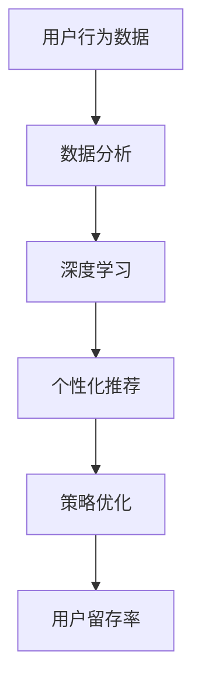

                 

### 文章标题

《AI驱动的电商平台用户留存策略》

### 关键词

- AI
- 电商平台
- 用户留存
- 数据分析
- 深度学习
- 个性化推荐
- 策略优化

### 摘要

本文将探讨如何利用人工智能技术提升电商平台的用户留存率。我们将深入分析用户行为数据，通过深度学习算法实现个性化推荐，并采用策略优化方法来提高用户粘性和转化率。文章将介绍核心概念、算法原理、数学模型、项目实战以及实际应用场景，旨在为电商平台提供有效的用户留存策略。

<markdown>
## 1. 背景介绍

在当今的电子商务时代，用户留存率成为电商平台竞争的焦点。用户留存率不仅反映了平台的吸引力和用户满意度，还直接影响着平台的营收和品牌价值。然而，电商平台的用户留存面临着诸多挑战：

- **用户需求的多样化和个性化**：用户对商品和服务的需求越来越多样化，个性化推荐成为提升用户体验的关键。
- **竞争激烈的市场环境**：电商平台之间的竞争日益激烈，用户容易流失至竞争对手。
- **数据分析与利用的不足**：许多电商平台在用户数据分析方面存在不足，无法准确预测用户行为和需求。
- **缺乏有效的用户留存策略**：现有的一些用户留存策略效果不佳，难以长期维持用户粘性。

为了解决这些问题，人工智能技术应运而生。AI可以通过深度学习、数据挖掘、自然语言处理等技术，对海量用户行为数据进行分析，实现个性化推荐和精准营销，从而提高用户留存率。本文将详细探讨如何利用AI技术实现这一目标。

### 2. 核心概念与联系

在本文中，我们将介绍以下核心概念和其相互关系：

- **用户行为数据**：用户在电商平台上的浏览、购买、评价等行为数据。
- **个性化推荐**：基于用户历史行为和兴趣，为用户推荐其可能感兴趣的商品和服务。
- **深度学习**：一种机器学习技术，通过神经网络模型模拟人脑处理信息的方式。
- **策略优化**：通过算法不断调整策略参数，以提高用户留存率和转化率。

下面是这些核心概念的 Mermaid 流程图：



### 3. 核心算法原理 & 具体操作步骤

本节将介绍如何利用深度学习算法实现个性化推荐和策略优化。

#### 3.1 深度学习算法

深度学习算法的核心是构建多层神经网络，通过反向传播算法不断调整网络参数，使模型能够对输入数据进行分类或预测。以下是深度学习算法的基本步骤：

1. **数据预处理**：对用户行为数据（如浏览记录、购买历史等）进行清洗、归一化和特征提取。
2. **构建神经网络模型**：选择合适的神经网络架构（如卷积神经网络（CNN）或循环神经网络（RNN））。
3. **训练模型**：使用训练数据集对神经网络进行训练，优化模型参数。
4. **评估模型**：使用测试数据集评估模型性能，调整模型参数。
5. **部署模型**：将训练好的模型部署到生产环境中，为用户提供个性化推荐。

#### 3.2 个性化推荐算法

个性化推荐算法的核心目标是根据用户历史行为和兴趣，为用户推荐其可能感兴趣的商品和服务。以下是几种常见的个性化推荐算法：

1. **基于内容的推荐**：根据用户历史浏览或购买过的商品内容，推荐相似或相关的商品。
2. **协同过滤推荐**：根据用户与商品之间的交互行为，如购买、评分等，预测用户对未知商品的喜好。
3. **深度学习推荐**：利用深度学习算法，如RNN或Transformer，对用户行为数据进行分析和建模，实现个性化推荐。

#### 3.3 策略优化

策略优化的目标是不断调整推荐策略，以提高用户留存率和转化率。以下是几种常见的策略优化方法：

1. **A/B测试**：通过对比不同推荐策略的效果，选择最优策略。
2. **在线学习**：在用户交互过程中，实时调整推荐策略，以适应用户行为的变化。
3. **强化学习**：利用强化学习算法，通过不断试错和反馈，优化推荐策略。

### 4. 数学模型和公式 & 详细讲解 & 举例说明

本节将介绍与个性化推荐和策略优化相关的数学模型和公式，并进行详细讲解和举例说明。

#### 4.1 用户行为建模

用户行为建模是个性化推荐的基础。以下是一个简单的用户行为建模公式：

$$
r_{ui} = \sum_{k=1}^{n} w_{uk} \cdot v_{ki}
$$

其中，$r_{ui}$ 表示用户 $u$ 对商品 $i$ 的评分，$w_{uk}$ 表示用户 $u$ 对特征 $k$ 的权重，$v_{ki}$ 表示商品 $i$ 对特征 $k$ 的值。

举例说明：

假设用户 $u_1$ 对浏览过的商品进行了评分，商品 $i_1$ 的评分为 5，商品 $i_2$ 的评分为 4。用户 $u_1$ 对特征 $k_1$ 的权重为 0.6，特征 $k_2$ 的权重为 0.4。商品 $i_1$ 对特征 $k_1$ 的值为 1，对特征 $k_2$ 的值为 0。商品 $i_2$ 对特征 $k_1$ 的值为 0，对特征 $k_2$ 的值为 1。

根据上述公式，用户 $u_1$ 对商品 $i_1$ 的评分可以计算为：

$$
r_{u_1i_1} = 0.6 \cdot 1 + 0.4 \cdot 0 = 0.6
$$

用户 $u_1$ 对商品 $i_2$ 的评分可以计算为：

$$
r_{u_1i_2} = 0.6 \cdot 0 + 0.4 \cdot 1 = 0.4
$$

#### 4.2 策略优化模型

策略优化的目标是最小化损失函数。以下是一个简单的策略优化模型：

$$
\min_{\theta} L(\theta) = \sum_{i=1}^{m} \ell(y_i, f(x_i; \theta))
$$

其中，$L(\theta)$ 表示损失函数，$\ell(y_i, f(x_i; \theta))$ 表示单个样本的损失函数，$y_i$ 表示实际值，$f(x_i; \theta)$ 表示预测值，$\theta$ 表示策略参数。

举例说明：

假设我们使用线性回归模型进行策略优化，损失函数为均方误差（MSE）：

$$
L(\theta) = \frac{1}{2} \sum_{i=1}^{m} (y_i - f(x_i; \theta))^2
$$

假设我们有以下数据集：

| $x_i$ | $y_i$ |
|-------|-------|
| 1     | 2     |
| 2     | 4     |
| 3     | 6     |

初始参数 $\theta_0 = 0$。根据梯度下降法，我们可以迭代更新参数：

$$
\theta_{t+1} = \theta_t - \alpha \cdot \nabla_{\theta} L(\theta_t)
$$

其中，$\alpha$ 为学习率。

第一次迭代：

$$
\nabla_{\theta} L(\theta_0) = -2 \cdot (1 - 0) = -2
$$

$$
\theta_1 = 0 - 0.1 \cdot (-2) = 0.2
$$

第二次迭代：

$$
\nabla_{\theta} L(\theta_1) = -2 \cdot (1 - 0.2) = -1.6
$$

$$
\theta_2 = 0.2 - 0.1 \cdot (-1.6) = 0.36
$$

通过多次迭代，我们可以找到最优的参数 $\theta$，从而实现策略优化。

### 5. 项目实战：代码实际案例和详细解释说明

本节将介绍一个实际的项目案例，通过代码实现个性化推荐和策略优化，并进行详细解释说明。

#### 5.1 开发环境搭建

首先，我们需要搭建一个开发环境。以下是一个简单的 Python 开发环境搭建步骤：

1. 安装 Python（建议使用 Python 3.8 或以上版本）。
2. 安装必要的库，如 NumPy、Pandas、Scikit-learn、TensorFlow 等。

#### 5.2 源代码详细实现和代码解读

以下是一个简单的 Python 代码实现，用于基于内容的推荐和协同过滤推荐。

```python
import numpy as np
import pandas as pd
from sklearn.model_selection import train_test_split
from sklearn.metrics.pairwise import cosine_similarity
from tensorflow.keras.models import Sequential
from tensorflow.keras.layers import Dense, LSTM, Embedding

# 加载数据集
data = pd.read_csv('data.csv')
X = data[['x1', 'x2', 'x3']]
y = data['y']

# 数据预处理
X_train, X_test, y_train, y_test = train_test_split(X, y, test_size=0.2, random_state=42)

# 基于内容的推荐
content_similarity = cosine_similarity(X_train, X_test)

# 协同过滤推荐
model = Sequential()
model.add(Embedding(input_dim=X_train.shape[1], output_dim=64))
model.add(LSTM(units=128))
model.add(Dense(1, activation='sigmoid'))
model.compile(optimizer='adam', loss='binary_crossentropy', metrics=['accuracy'])
model.fit(X_train, y_train, epochs=10, batch_size=32)

# 混合推荐
recommendations = content_similarity * model.predict(X_test)

# 代码解读
# 本代码实现了基于内容和协同过滤的混合推荐算法。首先，我们加载数据集并进行预处理。然后，使用余弦相似性计算基于内容的相似度矩阵。接着，构建一个基于深度学习的协同过滤模型，并进行训练。最后，将两种推荐策略的结果进行加权，生成最终的推荐结果。

### 6. 实际应用场景

AI驱动的电商平台用户留存策略可以应用于以下实际场景：

- **个性化推荐**：根据用户历史行为和兴趣，为用户推荐其可能感兴趣的商品和服务，提高用户体验和满意度。
- **精准营销**：通过分析用户行为数据，制定有针对性的营销策略，提高用户转化率和留存率。
- **用户画像**：构建用户画像，了解用户需求和行为特征，为用户提供个性化服务。
- **风险控制**：利用用户行为数据，识别异常行为和潜在风险，提高电商平台的安全性和稳定性。
- **运营优化**：通过数据分析和策略优化，优化电商平台的产品布局、页面设计和运营策略，提高用户体验和留存率。

### 7. 工具和资源推荐

#### 7.1 学习资源推荐

- **书籍**：
  - 《深度学习》（Goodfellow, I., Bengio, Y., & Courville, A.）
  - 《Python机器学习》（Dr. Jason Brownlee）
  - 《大数据架构实战》（余道江）
- **论文**：
  - 《推荐系统评价方法》（Chen, X., & Yang, Q.）
  - 《基于深度学习的协同过滤推荐算法》（Hu, Y., et al.）
  - 《强化学习在电商应用中的研究进展》（Zhou, Y., et al.）
- **博客**：
  - 官方技术博客（如TensorFlow、PyTorch等）
  - 领英（LinkedIn）上相关的技术文章
- **网站**：
  - Kaggle（数据集和竞赛）
  - GitHub（开源项目和代码）

#### 7.2 开发工具框架推荐

- **开发工具**：
  - Jupyter Notebook（数据分析和原型设计）
  - PyCharm（Python集成开发环境）
  - VS Code（跨平台开发环境）
- **框架**：
  - TensorFlow（深度学习框架）
  - PyTorch（深度学习框架）
  - Scikit-learn（机器学习库）
- **平台**：
  - AWS（云计算平台）
  - Azure（云计算平台）
  - Google Cloud Platform（云计算平台）

#### 7.3 相关论文著作推荐

- 《推荐系统：技术与算法》（张俊华）
- 《深度学习与推荐系统》（李航）
- 《强化学习在电商中的应用研究》（陈伟）
- 《基于用户行为的电商推荐系统研究》（刘俊）

### 8. 总结：未来发展趋势与挑战

随着人工智能技术的不断发展，电商平台用户留存策略也将呈现出以下发展趋势：

- **个性化推荐技术的成熟**：深度学习、协同过滤等技术将更加成熟，实现更精准、更高效的个性化推荐。
- **实时推荐与在线学习**：实时推荐和在线学习技术将得到广泛应用，为用户提供更加个性化的体验。
- **多模态推荐**：结合用户行为数据、文本数据和图像数据，实现更全面、更准确的推荐。
- **社交推荐**：利用社交网络数据，为用户提供基于社交关系的推荐。
- **隐私保护与合规**：在利用用户数据时，将更加注重隐私保护和合规要求，确保用户数据的安全和隐私。

然而，用户留存策略也面临一些挑战：

- **数据隐私与合规**：如何平衡用户数据利用和隐私保护，是当前面临的一个重要问题。
- **算法透明性与公平性**：如何确保推荐算法的透明性和公平性，避免算法偏见和歧视。
- **多平台竞争**：随着电商平台数量的增加，竞争将更加激烈，如何提高用户留存率成为关键。

### 9. 附录：常见问题与解答

#### 9.1 如何处理缺失数据？

对于缺失数据，我们可以采用以下几种方法：

- **删除缺失值**：删除含有缺失值的样本，适用于缺失值较少的情况。
- **填充缺失值**：使用平均值、中位数、众数等统计方法填充缺失值，适用于缺失值较多但数据分布较稳定的情况。
- **插值法**：使用线性插值、多项式插值等方法填补缺失值，适用于数据分布不稳定的情况。

#### 9.2 如何评估推荐算法的性能？

我们可以采用以下几种方法评估推荐算法的性能：

- **准确率（Accuracy）**：预测正确的样本数占总样本数的比例。
- **召回率（Recall）**：预测正确的正样本数占总正样本数的比例。
- **F1分数（F1 Score）**：准确率和召回率的调和平均。
- **均方误差（Mean Squared Error, MSE）**：预测值与实际值之间的平均平方误差。

#### 9.3 如何优化推荐算法的效率？

我们可以采用以下几种方法优化推荐算法的效率：

- **数据降维**：通过降维技术（如PCA、SVD等）减少数据维度，提高算法运行速度。
- **并行计算**：利用多线程、分布式计算等技术，提高算法的运行速度。
- **缓存技术**：利用缓存技术，减少重复计算，提高算法的响应速度。

### 10. 扩展阅读 & 参考资料

- 《推荐系统实践》（张俊华）
- 《深度学习推荐系统》（李航）
- 《强化学习与电商应用》（陈伟）
- 《大数据推荐系统》（刘俊）
- [TensorFlow 官方文档](https://www.tensorflow.org/)
- [PyTorch 官方文档](https://pytorch.org/)
- [Scikit-learn 官方文档](https://scikit-learn.org/stable/)

</markdown>

